# springmvc

## springmvc 的概念

- 介绍

**SpringMVC 也叫Spring web mvc。是Spring 框架的一部分，是在Spring3.0 后发布的。**

- 优点

基于 MVC 架构，功能分工明确。解耦合

容易理解，上手快，使用简单

作为Spring框架一部分，能够使用Spring的IOC和AOP

SpringMVC 强化注解的使用

> 在Controller, Service, Dao 都可以使用注解。方便灵活。使用**@Controller** 创建处理器对象**,@Service** 创建业务对象，**@Autowired** 或者**@Resource** 在控制器类中注入 Service,在Service 类中注入 Dao


- springMvc的优化方向

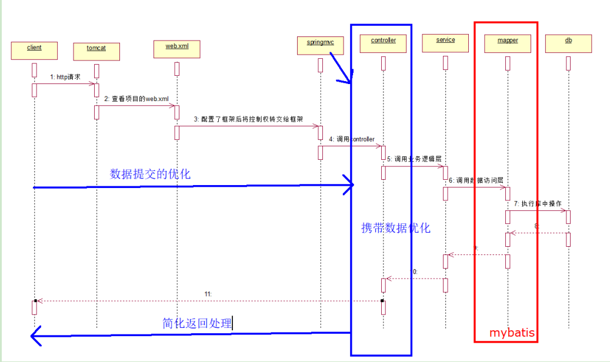

1. 数据提交的优化
2. 携带数据优化
3. 简化返回处理

- springmvc的执行流程

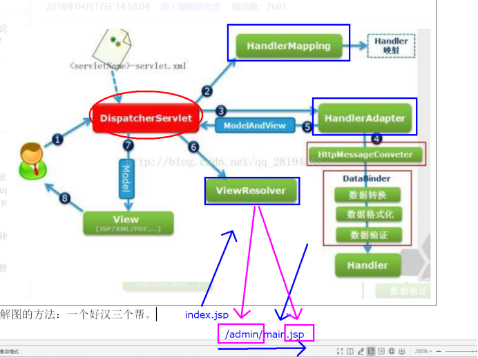

**执行流程说明**

1. 向服务器发送HTTP请求，请求被前端控制器 **DispatcherServlet** 捕获。

2. DispatcherServlet 根据<servlet-name>中的配置对请求的URL进行解析，得到请求资源标识符（URI）。然后根据该URI，调用 **HandlerMapping** 获得该Handler配置的所有相关的对象（包括Handler对象以及Handler对象对应的拦截器），最后以 HandlerExecutionChain 对象的形式返回。

3. DispatcherServlet 根据获得的Handler，选择一个合适的 HandlerAdapter。

4. 提取Request中的模型数据，填充Handler入参，开始执行Handler（Controller)。在填充Handler的入参过程中，根据你的配置，Spring将帮你做一些额外的工作：

   HttpMessageConveter：将请求消息（如Json、xml等数据）转换成一个对象，将对象转换为指定的响应信息。

   - 数据转换：对请求消息进行数据转换。如String转换成Integer、Double等。

   - 数据格式化：对请求消息进行数据格式化。如将字符串转换成格式化数字或格式化日期等。

   - 数据验证：验证数据的有效性（长度、格式等），验证结果存储到BindingResult或Error中

5. Handler(Controller)执行完成后，向 DispatcherServlet 返回一个 ModelAndView 对象。

6. 根据返回的ModelAndView，选择一个适合的 ViewResolver（必须是已经注册到Spring容器中的ViewResolver)返回给DispatcherServlet。

7.  ViewResolver 结合Model和View，来渲染视图。

8. 视图负责将渲染结果返回给客户端

## 快速入门 SpringMvc 程序

> 所谓 SpringMVC 的注解式开发是指，在代码中通过对类与方法的注解，便可完成处理器在 springmvc 容器的注册。注解式开发是重点。

### 创建步骤

- 新建maven_web项目 注意选择jdk版本为1.8

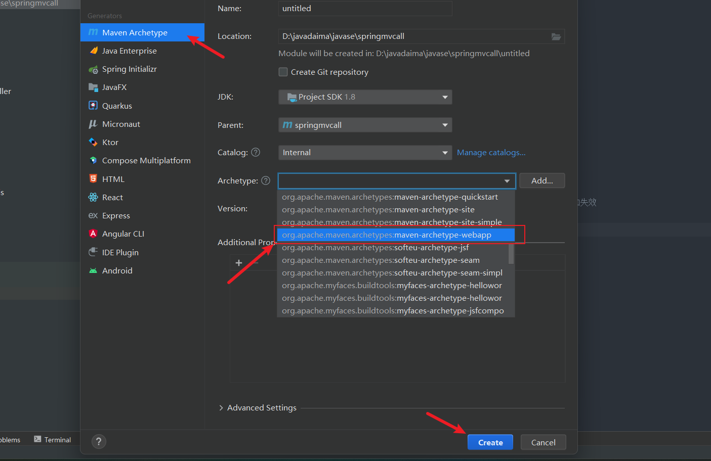

#### 添加依赖

```xml
<dependency>
<groupId>org.springframework</groupId>
<artifactId>spring-webmvc</artifactId>
<version>5.2.5.RELEASE</version>
</dependency>
<dependency>
<groupId>javax.servlet</groupId>
<artifactId>javax.servlet-api</artifactId>
<version>3.1.0</version>
</dependency>
```

#### 配置DisptcherServlet

- 删除web.xml 重新创建 因为自动生成的web.xml文件版本太低了

- 在**web.xml文件中注册SpringMvc框架**。因为**web的请求都是由Servlet来进行处理**的，而SpringMVC的核心处理器就是一个**DispatcherServlet**，它负责接收客户端的请求，并根据请求的路径分派给对应的**action（控制器）**进行处理，处理结束后依然由核心处理器**DispatcherServlet进行响应返回**。

  中央调度器的全限定性类名在导入的 Jar 文件 spring-webmvc-5.2.5.RELEASE.jar 的第一个包org.springframework.web.servlet下可找到

```xml
    <!--    注册springmvc框架-->
    <servlet>
        <servlet-name>springmvc</servlet-name>
        <servlet-class>org.springframework.web.servlet.DispatcherServlet</servlet-class>
        <init-param>
            <!--            加载spring的配置文件-->
            <param-name>contextConfigLocation</param-name>
            <param-value>classpath:springmvc.xml</param-value>
        </init-param>
    </servlet>
    <servlet-mapping>
        <servlet-name>springmvc</servlet-name>
        <!-- 配置拦截什么样的请求，由springmvc处理 请求最后带.action的请求会被处理 -->
        <url-pattern>*.action</url-pattern>
    </servlet-mapping>
```

#### springmvc 的配置文件

```xml
<!--     添加包扫描-->
    <context:component-scan base-package="com.oyy.controller"></context:component-scan>
<!--    添加视图解析器 请求响应时会自动 前缀会自动拼接/admin/ 后缀会自动拼接.jsp-->
    <bean class="org.springframework.web.servlet.view.InternalResourceViewResolver">
        <property name="prefix" value="/admin/"></property>
        <property name="suffix" value=".jsp"></property>
    </bean>
```

#### 编写静态页面

- 创建index.jsp页面

```jsp
<%@ page contentType="text/html;charset=UTF-8" language="java" %>
<html>
<head>
    <title>Title</title>
</head>
<body>
    <a href="${pageContext.request.contextPath}/zar/hello.action">访问action</a>
    其中：
  /zar  是类上的注解路径 @RequestMapper("/zar")
  /hello 是方法上的注解路径 @RequestMapper("/hello")
</body>
</html>
```

- 在webapp目录上新添目录/admin

- 在/admin目录下新建main.jsp页面。用来进行服务器处理完毕后数据的回显。

```jsp
<%@ page contentType="text/html;charset=UTF-8" language="java" %>
<html>
<head>
    <title>Title</title>
</head>
<body>
    <h1>main.....</h1>
</body>
</html>
```

#### 开发控制器 Controller

- 开发HelloSpringMvc.java-->控制器（相当于以前的servlet）。这是一个普通的类，不用继承和实现接口。类中的每个方法就是一个具体的action控制器。

- **类中方法的规范**
  - A. 访问权限是public
  - B. 方法名自定义
  - C. 方法的参数可以有多个，任意类型，用来接收客户端提交上来的数据。
  - D. 方法的返回值任意。以返回String居多

```java
@Controller  // 标注这个类是一个controller控制器 并将将该类交由IOC容器管理
@RequestMapping("/admin") // 请求路径要为 /admin 请求会进这个controller被处理 
public class JumpAction {

    @RequestMapping("/one") //请求为 /admin/one的请求会进入这个处理器
    public String one () {
        System.out.println("/admin/one请求被处理");
        return "main"; //这个返回结果会被视图解析拦截并自动拼接上指定的前后缀 
        // 转发到这个 /admin/main.jsp 页面 最终显示的结果就是这个页面
    }
}
```

1. @Controller：表示当前类为处理器，交给Spring容器去创建对象。

2. @RequestMapping：表示路径映射。该注解可以加在类上相当于包名，还可以加在方法上相当于action的名称，都是来指定映射路径的。

3. 完成springmvc.xml文件的配置。在工程的类路径即resources目录下创建 SpringMVC 的配置文件 springmvc.xml。该文件名可以任意命名。推荐使用springmvc.xml

4. SpringMVC框架为了避免对于请求资源路径与扩展名上的冗余，在视图解析器

   InternalResouceViewResolver 中引入了请求的前辍与后辍。而action中只需给出要跳转页面的文件名即可，对于具体的文件路径与文件扩展名，视图解析器会自动完成拼接。

   <context:component-scan>:用来进行包扫描，这里用于指定@Controller注解所在的包路径。

## SpringMvc注解式开发

### 1.指定模块名称

> 通过**@RequestMapping** 注解可以定义处理器对于请求的映射规则。该注解可以注解在方法上，也可以注解在类上，但意义是不同的。value 属性值常以“/”开始。**@RequestMapping 的 value 属性用于定义所匹配请求的 URI。**
>
> 一个**@Controller** 所注解的类中，可以定义多个处理器方法。当然，**不同的处理器方法所匹配的 URI 是不同的**。这些不同的 URI 被指定在注解于方法之上的**@RequestMapping 的value** 属性中。但若这些请求具有相同的 URI 部分，则这些相同的 URI部分可以被抽取到注解在类之上的@RequestMapping 的 value 属性中。此时的这个 URI 表示模块（相当于包）的名称。URI 的请求是相对于 Web 的根目录。换个角度说，要访问处理器的指定方法，必须要在方法指定 URI 之前加上处理器类前定义的模块名称。

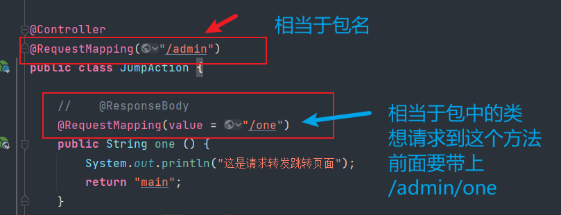

> 简单来说@RequestMapping加在类上相对于建了一个包，而方法上加了@RequestMapping注解中指定的路径相当于包中的文件

### 2.请求提交方式定义

> @**RequestMapping**注解中**method**属性指定处理什么方式的请求

```java
@RequestMapping(value = "/one",method = RequestMethod.GET)
请求方式种类
public enum RequestMethod {
    GET,
    HEAD,
    POST,
    PUT,
    PATCH,
    DELETE,
    OPTIONS,
    TRACE;
}
```

### 3.五种数据提交方式

前四种数据注入的方式，会自动进行类型转换。但无法自动转换日期类型。

- 普通参数的注入

> **处理方法中形参列表声明一个和表单提交的参数名称相同的参数**

- 对象封装注入

> **方法中声明一个自定义的实体类参数**，框架调用**实体类中相应的setter方法**注入属性值，只要**保证实体类中成员变量的名称与提交请求的name属性值**一致即可。

- 动态占位符提交

> 使用框架提供的一个注解**@PathVariable**，将请求**url中的值作为参数进行提取，只能是超链接**。**restful风格**下的数据提取方式。restful是一种软件架构风格、设计风格，而不是标准，只是提供了一组设计原则和约束条件。它主要用于客户端和服务器交互类的软件。基于这个风格设计的软件可以更简洁，更有层次，更易于实现缓存等机制。

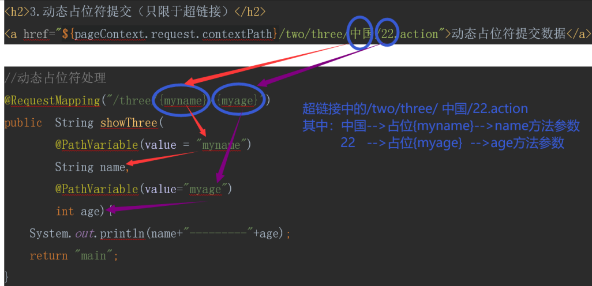

- 请求参数名和形参不一致

> **@RequestParam**(value="name1",required=***\*true\****)String namea来进行参数名称绑定。

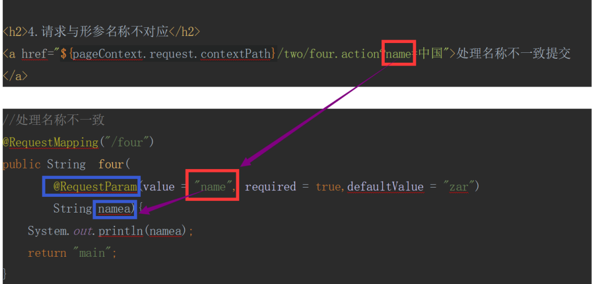

- 使用HttpServletRequest对象提取

> 在方法参数中声明一个**request**对象，使用**request的getParameter()获取表单提交的数据**，这样得到的数据还要手工进行数据类型的转换。

### 4.请求参数中文乱码

**对于前面所接收的请求参数，若含有中文，则会出现中文乱码问题。Spring 对于请求参数中的中文乱码问题，给出了专门的字符集过滤器： spring-web-5.2.5.RELEASE.jar 的org.springframework.web.filter 包下的 CharacterEncodingFilter 类。**

#### 解决方案

> 在 **web.xml 中注册字符集过滤器**，即**可解决 Spring 的请求参数的中文乱码问题**。不过，**最好将该过滤器注册在其它过滤器之前**。因为过滤器的执行是按照其注册顺序进行的。

```xml
 <!--    中文编码过滤器-->
    <filter>
        <filter-name>encod</filter-name>
        <filter-class>org.springframework.web.filter.CharacterEncodingFilter</filter-class>
<!--
    private String encoding; 字符编码
    private boolean forceRequestEncoding;是否强制request使用字符集encoding
    private boolean forceResponseEncoding;是否强制response使用字符集encoding
    -->
<!--        初始化参数-->
        <init-param>
<!--            指定字符集-->
            <param-name>encoding</param-name>
            <param-value>UTF-8</param-value>
        </init-param>
        <init-param>
<!--            强制request使用字符集encoding-->
            <param-name>forceRequestEncoding</param-name>
            <param-value>true</param-value>
        </init-param>
<!--        强制response使用字符集encoding-->
        <init-param>
            <param-name>forceResponseEncoding</param-name>
            <param-value>true</param-value>
        </init-param>
    </filter>
    <filter-mapping>
        <filter-name>encod</filter-name>
<!--        配置拦截那些请求响应处理字符集-->
        <url-pattern>/*</url-pattern>
    </filter-mapping>
```

#### 源码解析

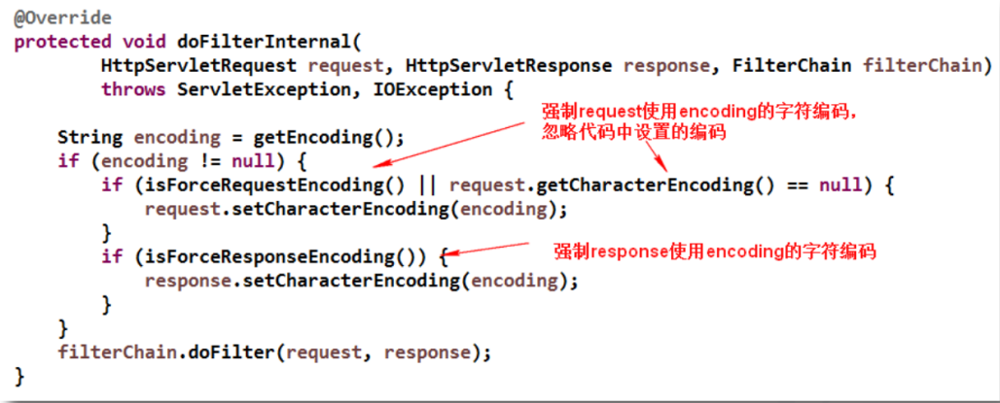

### 5.处理器方法返回值

- 使用@Controller 注解的处理器的方法，其返回值常用的有四种类型：
  - 第一种：ModelAndView
  - 第二种：String
  - 第三种：无返回值void
  - 第四种：返回对象类型

#### 1.返回 ModelAndView

> 若处理器方法处理完后，需要跳转到其它资源，且又要在跳转的资源间传递数据，此时处理器方法返回 ModelAndView 比较好。当然，若要返回 ModelAndView，则处理器方法中需要定义 ModelAndView 对象。在使用时，若该处理器方法只是进行跳转而不传递数据，或只是传递数据而并不向任何资源跳转（如对页面的 Ajax  异步响应），此时若返回 ModelAndView，则将总是有一部分多余：要么 Model 多余，要么 View 多余。即此时返回 ModelAndView 将不合适。较少使用

#### 2.返回 String

> 处理器方法返回的字符串可以指定逻辑视图名，通过视图解析器解析可以将其转换为物理视图地址。

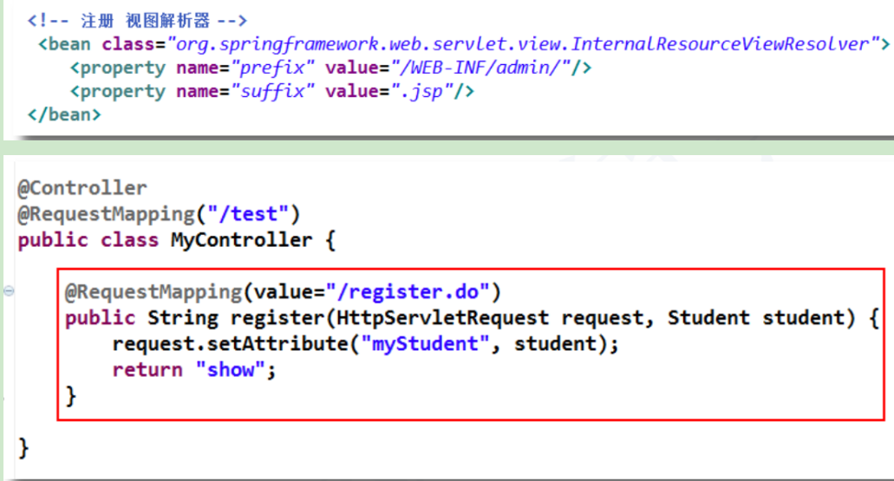

**当然，也可以直接返回资源的物理视图名。不过，此时就不需要再在视图解析器中再配置前辍与后辍了。**

> **注意：**如果要直接放回地址要指定让不让视图解析器处理，要不然会自动拼接前后缀
>
> ```java
> / 加上forward 屏蔽视图解析 并跳转方式为转发
> // 加上redirect 屏蔽视图解析 并跳转方式为重定向 
> 实例 ： return "redirect:/admin/main.jsp"; 这就是一个重定向 把前缀改为forward: 就是请求转发
> ```

#### 3.无返回值 void

> 对于处理器方法返回 void 的应用场景，**应用在AJAX 响应处理**。若处理器对请求处理后，无需跳转到其它任何资源，此时可以让处理器方法返回 void。我们SSM整合案例中的分页使用的就是无返回值。代码见后面。

#### 4.返回Object对象

> 处理器方法也可以返回 **Object 对象。这个 Object 可以是 Integer，自定义对象，Map，List 等**。但返回的对象不是作为**逻辑视图出现的，而是作为直接在页面显示的数据出现的。**

> 返回对象，需要使用**@ResponseBody 注解**，**将转换后的 JSON 数据放入到响应体中**。Ajax请求多用于Object返回值类型。由于转换器**底层使用了Jackson 转换方式将对象转换为JSON 数据**，所以需要**添加Jackson的相关依赖**
>
> **A**.在pom.xml文件中添加依赖。
>
> ```xml
>  <dependency>
>       <groupId>com.fasterxml.jackson.core</groupId>
>       <artifactId>jackson-databind</artifactId>
>       <version>2.9.8</version>
>     </dependency>
> ```
>
> **B**.添加jQuery的函数库,在webapp目录下,新建js目录,拷贝jquery-3.3.1.js到目录下
>
> **C**.在页面添加jQuery的函数库的引用 **<script src="js/jquery-3.3.1.js"></script>**
>
>  **D**.发送ajax请求
>
> ```js
>  function show() {
>           $.ajax({
>               url:"${pageContext.request.contextPath}/ajax.action",
>               type:"post",
>               dataType:"json",
>               success:function (stu) {
>                   $("#oneStu").html(stu.name+"------"+stu.age);
>               }
>           });
>       }
> ```
>
> **E**.开发action
>
> ```java
>  @Controller
> 	public class AjaxDemo {
> 	    @RequestMapping("/ajax")
>          @ResponseBody  //此注解用来解析ajax请求
> 	    public Object ajax(){
> 	        Student stu = new Student("张三",22);
> 	        return stu;
> 	    }
> 	}
> ```
>
> **F**.在springmvc.xml文件中添加注解驱动 
>
> ```xml
> <?xml version="1.0" encoding="UTF-8"?>
> <beans xmlns="http://www.springframework.org/schema/beans"
>        xmlns:xsi="http://www.w3.org/2001/XMLSchema-instance"
>        xmlns:mvc="http://www.springframework.org/schema/mvc"
> 
>        xmlns:context="http://www.springframework.org/schema/context"
>        xsi:schemaLocation="http://www.springframework.org/schema/beans
>         http://www.springframework.org/schema/beans/spring-beans.xsd
>         http://www.springframework.org/schema/context
>         https://www.springframework.org/schema/context/spring-context.xsd
>         http://www.springframework.org/schema/mvc
>         https://www.springframework.org/schema/mvc/spring-mvc.xsd
> ">
> 
> <!--     添加包扫描-->
>     <context:component-scan base-package="com.oyy.controller"></context:component-scan>
> <!--    添加视图解析器-->
>     <bean class="org.springframework.web.servlet.view.InternalResourceViewResolver">
>         <property name="prefix" value="/admin/"></property>
>         <property name="suffix" value=".jsp"></property>
>     </bean>
> <!--    添加mvc注解驱动  为了支持ajax 请求--> 
>         <mvc:annotation-driven></mvc:annotation-driven>
> </beans>
> ```

### 6.SpringMvc的四种跳转方式

转发地址栏不会发生变化，转发地址栏会变成重定向后的地址

- 请求转发页面
- 请求转发 action
- 重定向页面
- 重定向 action

> **默认的跳转是请求转发**，直接跳转到jsp页面展示，还可以使用框架提供的关键字redirect:，进行一个重定向操作，包括重定向页面和重定向action，使用框架提供的关键字forward:，进行服务器内部转发操作，包括转发页面和转发action。当使用redirect:和forward:关键字时，视图解析器中前缀后缀的拼接就无效了。
>
> **返回值是字符串也没有加@ResponseBody 注解的方法可以做页面跳转**
>
> 如果直接返回字符串，该字符串会被视图解析器加上前后缀，如果需要指定跳转链接，和方式要加上**redirect:**进行重定向，
>
> **forward:** 指定请求转发，加上这2个前缀视图解析器不会对其进行拼接前后缀

### 7.springMvc支持的默认参数类型

这些类型只要写在方法参数中就可以使用了。

1. HttpServletRequest 对象
2. HttpServletResponse 对象
3. HttpSession 对象
4. Mode/ModeIMap 对象
5. Map<String,Object> 对象

### 8.日期处理

#### 1.日期注入

> 日期类型不能自动注入到方法的参数中。需要单独做转换处理。使用@DateTimeFormat注解，需要在springmvc.xml文件中添加<mvc:annotation-driven/>标签。
>
> 1.方法参数上使用 @DateTimeFormat 注解
>
> ```java
> @RequestMapping("/submitone")
> public String submitdateone(
> @DateTimeFormat(pattern="yyyy-MM-dd")
>         Date mydate){
>     System.out.println(mydate);
>     return "dateShow";
> }
> ```
>
> 2.对象set方法上加上 @DateTimeFormat 注解
>
> ```java
> @DateTimeFormat(pattern="yyyy-MM-dd")
> public void setDate(Date date) {
> this.date = date;
> }
> ```
>
> 3.@InitBinder 注解解决类中日期问题
>
> ```java
> @InitBinder
> public void initBinder(WebDataBinder dataBinder) {
>     SimpleDateFormat sf = new SimpleDateFormat("yyyy-MM-dd");
> dataBinder.registerCustomEditor(Date.class, new CustomDateEditor(sf, true));
> }
> ```
>
> 这样在类中出现的所有日期都可以进行转换了。

#### 2.日期显示

- Json 中的日期显示

需要在类中的**成员变量的getXXX方法**上加注解

```java
@JsonFormat(pattern="yyyy-MM-dd HH:mm:ss")
public Date getDate() {
return date;
}
```

- JSP页面的日期显示

需要使用国际化标签，先添加依赖

```java
<dependency>
<groupId>jstl</groupId>
<artifactId>jstl</artifactId>
<version>1.2</version>
</dependency>
```

导入国际化的标签库

```jsp
<%@taglib prefix="fmt" uri="http://java.sun.com/jsp/jstl/fmt" %>
```

```jsp
<div id="stulistgood">
<c:forEach items="${list}" var="stu">
<p>${stu.name}-------${stu.age}-------<fmt:formatDate value="${stu.date}" pattern="yyyy-MM-dd"></fmt:formatDate></p>
</c:forEach>
</div>
```

### 9.<mvc:annotation-driven/>标签的使用

> <mvc:annotation-driven/>会自动注册两个bean，分别为
>
> ```java
> DefaultAnnotationHandlerMapping 和 AnnotationMethodHandlerAdapter
> ```
>
> 是springmvc为@controller分发请求所必须的。除了注册了这两个bean，还提供了很多支持
>
> 1. 支持使用ConversionService 实例对表单参数进行类型转换
> 2. 支持使用 @NumberFormat 、@DateTimeFormat 时间转换封装
> 3. 注解完成数据类型的格式化
> 4. 支持使用 @RequestBody 和 @ResponseBody 注解
> 5. 静态资源的分流也使用这个标签

### 10.资源在WEB-INF 目录下

 很多**企业会将动态资源放在WEB-INF目录下**，这样可以保证资源的**安全性**。在WEB-INF目录下的**动态资源不可以直接访问**，必须要通过**请求转发的方式进行访问**。这样避免了通过地址栏直接对资源的访问。**重定向也无法访问动态资源**。


## 拦截器


### 1.介绍

> SpringMVC 中的 Interceptor 拦截器，它的主要作用是拦截指定的用户请求，并进行相应的预处理与后处理。其拦截的时间点在“处理器映射器根据用户提交的请求映射出了所要执行的处理器类，并且也找到了要执行该处理器类的处理器适配器，在处理器适配器执行处理器之前”。当然，在处理器映射器映射出所要执行的处理器类时，已经将拦截器与处理器组合为了一个处理器执行链，并返回给了中央调度器。


### 2.拦截器的运用场景

- 日志记录：记录请求信息的日志
- 权限检查，如登录检查
- 性能检测：检测方法的执行时间


### 3.拦截器的执行原理

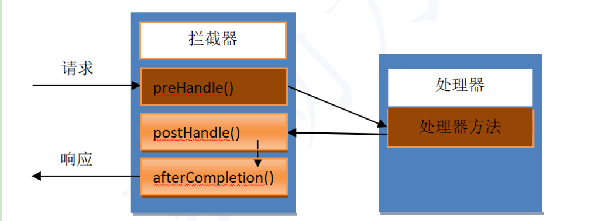


### 4.执行时机

1. preHandle():在请求被处理之前进行操作  	 **预处理**
2. postHandle():在请求被处理之后,但结果还没有渲染前进行操作,可以改变响应结果     **后处理**
3. afterCompletion:所有的请求响应结束后执行善后工作,清理对象,关闭资源      **最终处理**


### 5.拦截器的2种实现方式

- 继承HandlerInterceptorAdapter的父类

- 实现HandlerInterceptor接口,实现的接口,  **推荐使用实现接口的方式**

#### HandlerInterceptor接口分析

自定义拦截器，需要实现 HandlerInterceptor 接口。而该接口中含有三个方法：

- preHandle

该方法在**处理器方法执行之前执行**。其返回值为 boolean，若为 true，则紧接着会执行处理器方法，且会将 afterCompletion()方法放入到一个专门的方法栈中等待执行。

- postHandle

该方法在**处理器方法执行之后执行**。处理器方法若最终未被执行，则该方法不会执行。由于该方法是在处理器方法执行完后执行，且该方法参数中包含 ModelAndView，所以该方法可以修改处理器方法的处理结果数据，且可以修改跳转方向。

- afterCompletion

当**preHandle()方法返回 true 时**，会将该方法放到专门的方法栈中，等到对请求进行响应的所有工作完成之后才执行该方法。即该方法是在中央调度器渲染（数据填充）了响应页面之后执行的，此时对 ModelAndView 再操作也对响应无济于事。afterCompletion 最后执行的方法，清除资源，例如在 Controller 方法中加入数据等。


### 6.自定义拦截器

**实现一个权限验证拦截器。**

- 修改web.xml文件中请求路径 改为 / 接收所有请求

```xml
    <servlet-mapping>
        <servlet-name>springmvc</servlet-name>
        <url-pattern>/</url-pattern>
    </servlet-mapping>
```

- 将所有的页面放入WEB-INF目录下

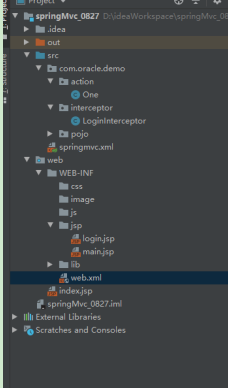

- 开发登录action

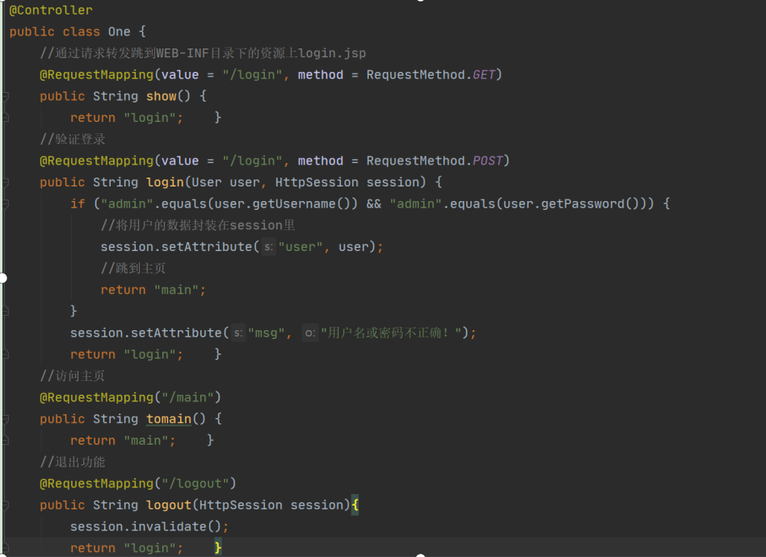

- 开发拦截器

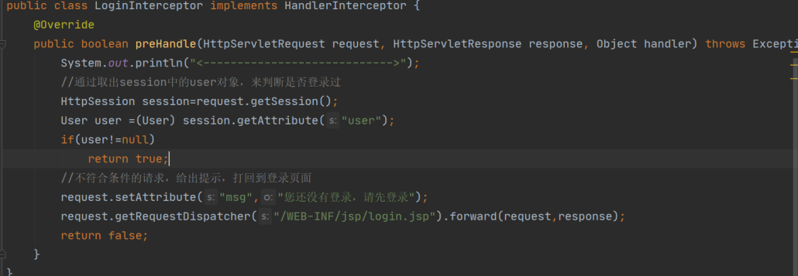


- 配置springmvc.xml文件

```xml
<!--    注册拦截器-->
    <mvc:interceptors>
        <mvc:interceptor>
<!--            配置拦截的路径（那些请求要被拦截）-->
            <mvc:mapping path="/**"/> 
<!--            配置那些请求放行-->
            <mvc:exclude-mapping path="/login"/>
            <mvc:exclude-mapping path="showlogin"/>
<!--           配置拦截类 -->
            <bean class="com.oyy.interceptor.MyHandlerInterceptor"></bean>
        </mvc:interceptor>
    </mvc:interceptors>
```
