[day03-微服务01 - 飞书云文档 (feishu.cn)](https://b11et3un53m.feishu.cn/wiki/R4Sdwvo8Si4kilkSKfscgQX0niB)


之前我们学习的项目一是单体项目，可以满足小型项目或传统项目的开发。而在互联网时代，越来越多的一线互联网公司都在使用微服务技术。

从谷歌搜索指数来看，国内从自2016年底开始，微服务热度突然暴涨：

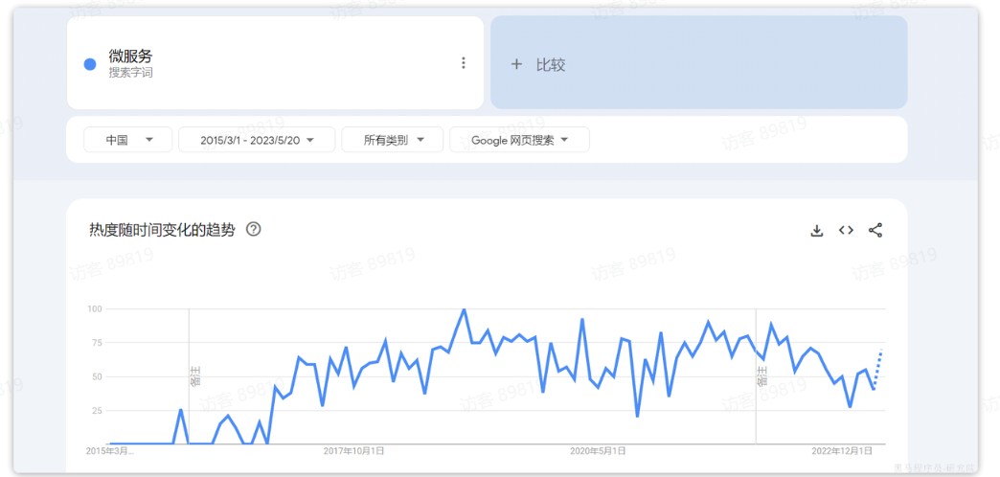

那么：

- 到底什么是微服务？
- 企业该不该引入微服务？
- 微服务技术该如何在企业落地？

接下来几天，我们就一起来揭开它的神秘面纱。

计划是这样的，课前资料中给大家准备了一个**单体**的电商小项目：黑马商城，我们会基于这个单体项目来演示从单体架构到微服务架构的演变过程、分析其中存在的问题，以及微服务技术是如何解决这些问题的。

你会发现每一个微服务技术都是在解决服务化过程中产生的问题，你对于每一个微服务技术具体的应用场景和使用方式都会有更深层次的理解。

今天作为课程的第一天，我们要完成下面的内容：

- 知道单体架构的特点
- 知道微服务架构的特点
- 学会拆分微服务
- 会使用Nacos实现服务治理
- 会使用OpenFeign实现远程调用


# 0.导入黑马商城项目

在课前资料中给大家提供了黑马商城项目的资料，我们需要先导入这个单体项目。不过需要注意的是，本篇及后续的微服务学习都是基于Centos7系统下的Docker部署，因此你必须做好一些准备：

- Centos7的环境及一个好用的SSH客户端
- 安装好Docker
- 会使用Docker

如果你没有这样的Linux环境，或者不是Centos7的话，那么这里有一篇参考文档：

- [Linux环境搭建](https://b11et3un53m.feishu.cn/wiki/FJAnwOhpIihMkLkOKQocdWZ7nUc) 

建议按照上面的文档来搭建虚拟机环境，使用其它版本会出现一些环境问题，比较痛苦。

如果已经有Linux环境，但是没有安装Docker的话，那么这里还有一篇参考文档：

- [安装Docker](https://b11et3un53m.feishu.cn/wiki/Rfocw7ctXij2RBkShcucLZbrn2d) 

如果不会使用Docker的话可以参考黑马的微服务前置Docker课程，B站地址如下：

https://www.bilibili.com/video/BV1HP4118797/?share_source=copy_web&vd_source=3362e6914fb759983690e6e0f1072453

注意：

如果是学习过上面Docker课程的同学，虚拟机中已经有了黑马商城项目及MySQL数据库了，不过为了跟其他同学保持一致，可以先将整个项目移除。使用下面的命令：

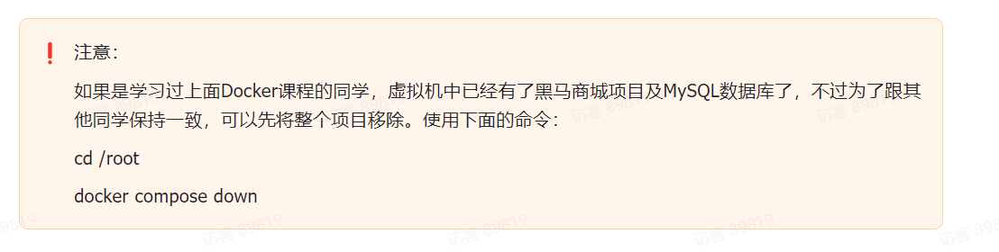


## 0.1.安装MySQL

在课前资料提供好了MySQL的一个目录：

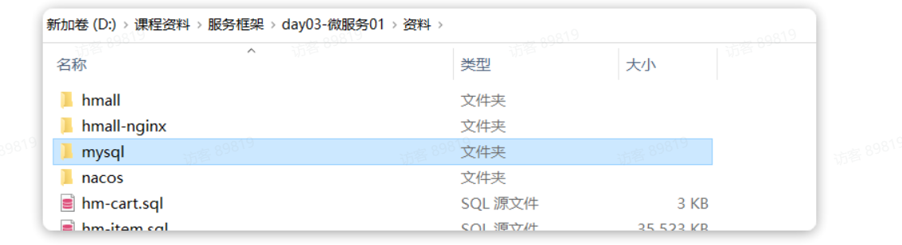

其中有MySQL的配置文件和初始化脚本：

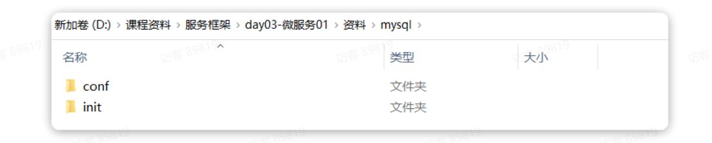

我们将其复制到虚拟机的`/root`目录。如果`/root`下已经存在`mysql`目录则删除旧的，如果不存在则直接复制本地的：

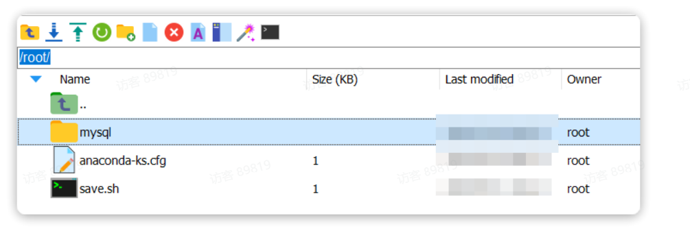

然后创建一个通用网络：

```Bash
docker network create hm-net
```

使用下面的命令来安装MySQL：

```Bash
docker run -d \
  --name mysql \
  -p 3306:3306 \
  -e TZ=Asia/Shanghai \
  -e MYSQL_ROOT_PASSWORD=123 \
  -v /root/mysql/data:/var/lib/mysql \
  -v /root/mysql/conf:/etc/mysql/conf.d \
  -v /root/mysql/init:/docker-entrypoint-initdb.d \
  --network hm-net\
  mysql
```

此时，通过命令查看mysql容器：

```Bash
docker ps
```

如图：

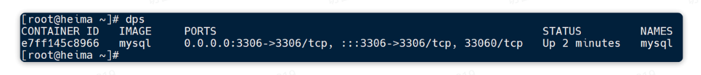

此时，如果我们使用MySQL的客户端工具连接MySQL，应该能发现已经创建了黑马商城所需要的表：


## 0.2.后端

然后是Java代码，在课前资料提供了一个hmall目录：

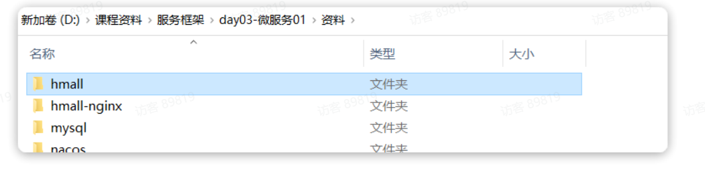

将其复制到你的工作空间，然后利用Idea打开。

项目结构如下：

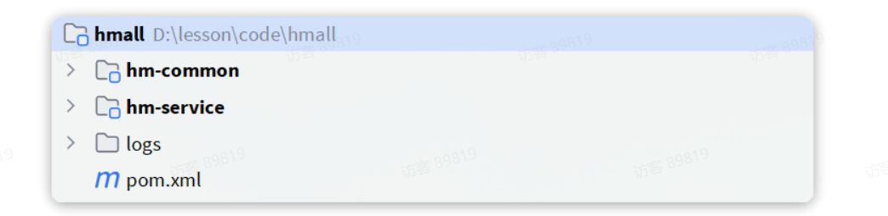


在弹出窗口中鼠标向下滚动，找到`Spring Boot`:

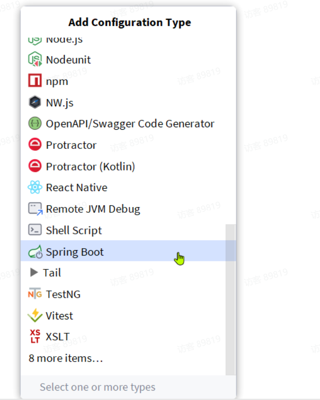

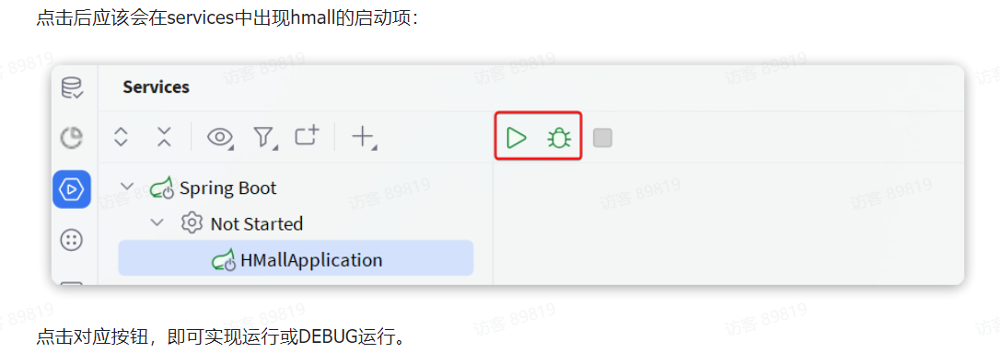

**不过别着急！！**

我们还需要对这个启动项做简单配置，在`HMallApplication`上点击鼠标右键，会弹出窗口，然后选择`Edit Configuration`：

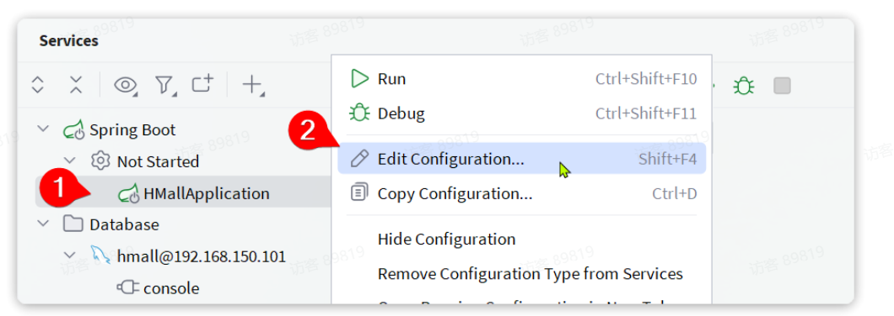

在弹出窗口中配置SpringBoot的启动环境为local：

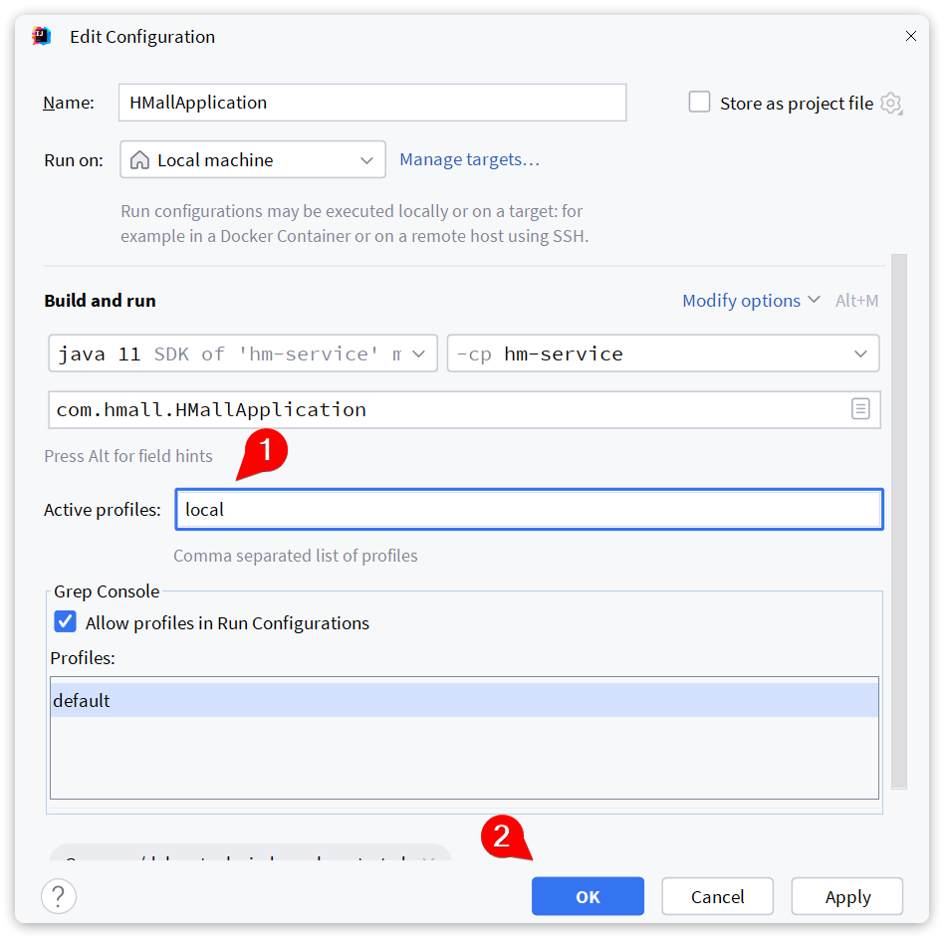

点击OK配置完成。接下来就可以运行了！

启动完成后，试试看访问下 http://localhost:8080/hi 吧！


## 0.3.前端

在课前资料中还提供了一个hmall-nginx的目录：

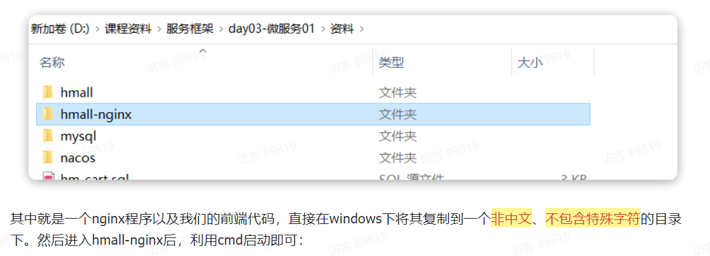

其中就是一个nginx程序以及我们的前端代码，直接在windows下将其复制到一个非中文、不包含特殊字符的目录下。然后进入hmall-nginx后，利用cmd启动即可：

```PowerShell
# 启动nginx
start nginx.exe
# 停止
nginx.exe -s stop
# 重新加载配置
nginx.exe -s reload
# 重启
nginx.exe -s restart
```


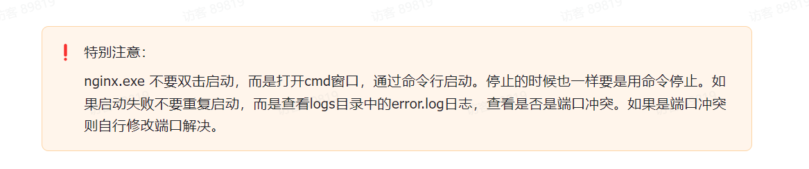

启动成功后，访问http://localhost:18080，应该能看到我们的门户页面：


# (1)Nacos OpenFeign

# 1.认识微服务

这一章我们从单体架构的优缺点来分析，看看开发大型项目采用单体架构存在哪些问题，而微服务架构又是如何解决这些问题的。

## 1.1.单体架构

单体架构（monolithic structure）：顾名思义，整个项目中所有功能模块都在一个工程中开发；项目部署时需要对所有模块一起编译、打包；项目的架构设计、开发模式都非常简单。

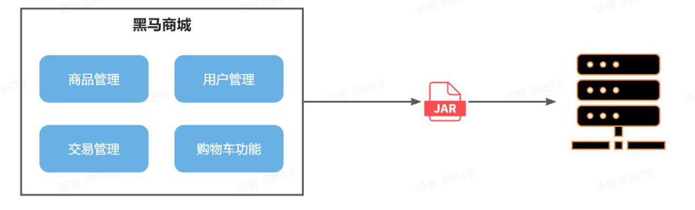


当项目规模较小时，这种模式上手快，部署、运维也都很方便，因此早期很多小型项目都采用这种模式。

但随着项目的业务规模越来越大，团队开发人员也不断增加，单体架构就呈现出越来越多的问题：

- **团队协作成本高**：试想一下，你们团队数十个人同时协作开发同一个项目，由于所有模块都在一个项目中，不同模块的代码之间物理边界越来越模糊。最终要把功能合并到一个分支，你绝对会陷入到解决冲突的泥潭之中。
- **系统发布效率低**：任何模块变更都需要发布整个系统，而系统发布过程中需要多个模块之间制约较多，需要对比各种文件，任何一处出现问题都会导致发布失败，往往一次发布需要数十分钟甚至数小时。
- **系统可用性差**：单体架构各个功能模块是作为一个服务部署，相互之间会互相影响，一些热点功能会耗尽系统资源，导致其它服务低可用。

在上述问题中，前两点相信大家在实战过程中应该深有体会。对于第三点系统可用性问题，很多同学可能感触不深。接下来我们就通过黑马商城这个项目，给大家做一个简单演示。


首先，我们修改hm-service模块下的`com.hmall.controller.HelloController`中的`hello`方法，模拟方法执行时的耗时：

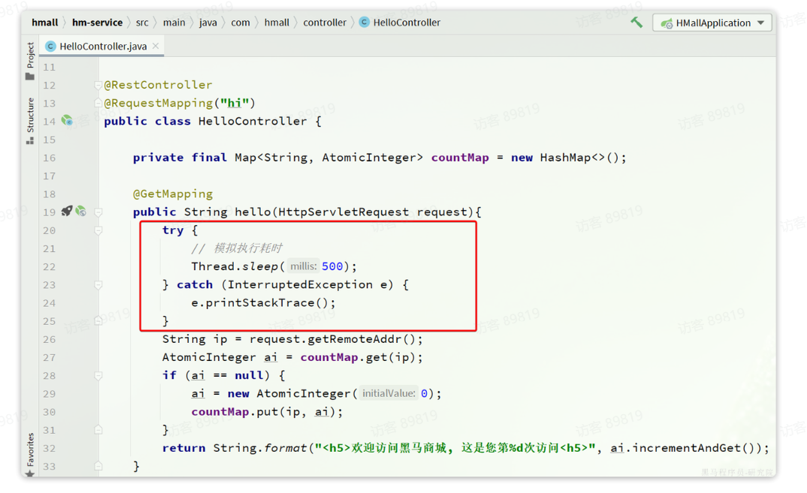

接下来，启动项目，目前有两个接口是无需登录即可访问的：

- `http://localhost:8080/hi`
- `http://localhost:8080/search/list`

经过测试，目前`/search/list` 是比较正常的，访问耗时在30毫秒左右。

接下来，我们假设`/hi`这个接口是一个并发较高的热点接口，我们通过Jemeter来模拟500个用户不停访问。在课前资料中已经提供了Jemeter的测试脚本：


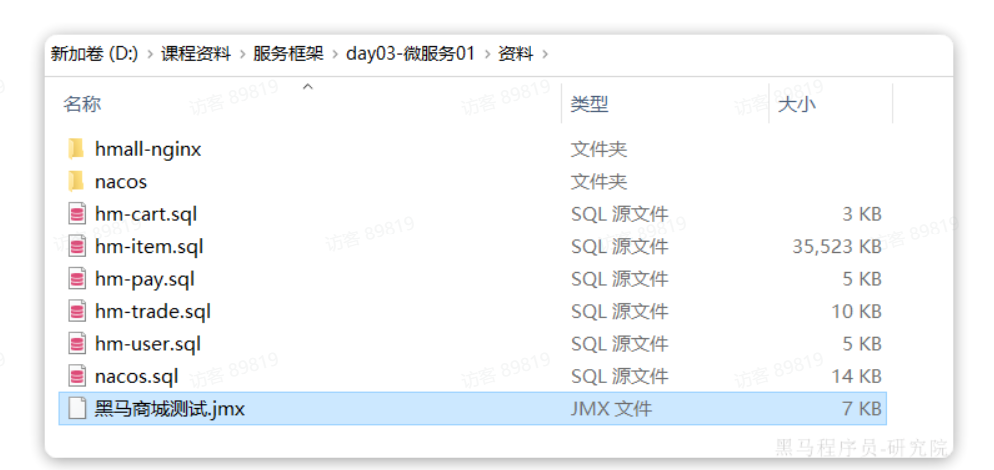

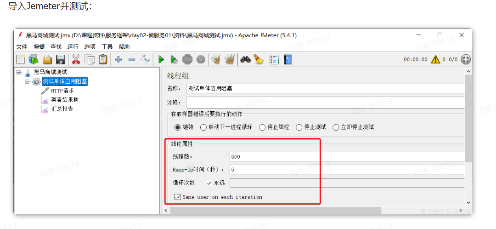

这个脚本会开启500个线程并发请求`http://localhost/hi`这个接口。由于该接口存在执行耗时（500毫秒），这就服务端导致每秒能处理的请求数量有限，最终会有越来越多请求积压，直至Tomcat资源耗尽。这样，其它本来正常的接口（例如`/search/list`）也都会被拖慢，甚至因超时而无法访问了。

我们测试一下，启动测试脚本，然后在浏览器访问`http://localhost:8080/search/list`这个接口，会发现响应速度非常慢：

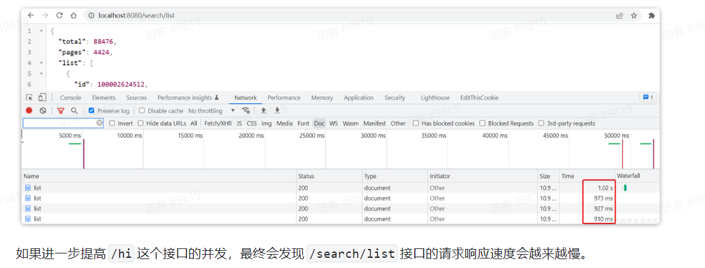

可见，单体架构的可用性是比较差的，功能之间相互影响比较大。

当然，有同学会说我们可以做水平扩展。

此时如果我们对系统做水平扩展，增加更多机器，资源还是会被这样的热点接口占用，从而影响到其它接口，并不能从根本上解决问题。这也就是单体架构的扩展性差的一个原因。

而要想解决这些问题，就需要使用微服务架构了。


## 1.2.微服务

微服务架构，首先是服务化，就是将单体架构中的功能模块从单体应用中拆分出来，独立部署为多个服务。同时要满足下面的一些特点：

- **单一职责**：一个微服务负责一部分业务功能，并且其核心数据不依赖于其它模块。
- **团队自治**：每个微服务都有自己独立的开发、测试、发布、运维人员，团队人员规模不超过10人（2张披萨能喂饱）
- **服务自治**：每个微服务都独立打包部署，访问自己独立的数据库。并且要做好服务隔离，避免对其它服务产生影响


例如，黑马商城项目，我们就可以把商品、用户、购物车、交易等模块拆分，交给不同的团队去开发，并独立部署：

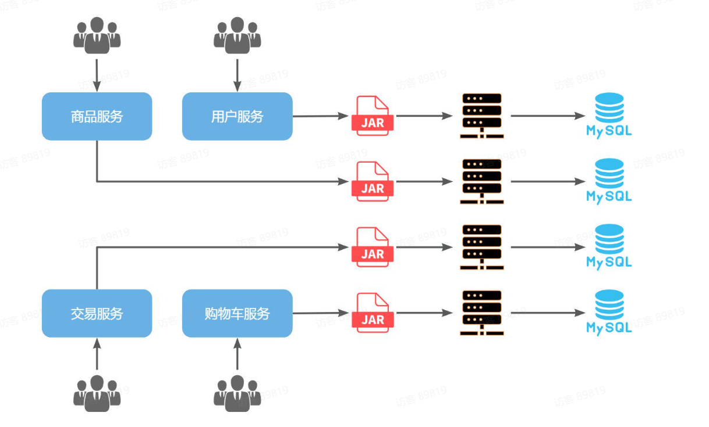

那么，单体架构存在的问题有没有解决呢？

- 团队协作成本高？
  - 由于服务拆分，每个服务代码量大大减少，参与开发的后台人员在1~3名，协作成本大大降低
- 系统发布效率低？
  - 每个服务都是独立部署，当有某个服务有代码变更时，只需要打包部署该服务即可
- 系统可用性差？
  - 每个服务独立部署，并且做好服务隔离，使用自己的服务器资源，不会影响到其它服务。

综上所述，微服务架构解决了单体架构存在的问题，特别适合大型互联网项目的开发，因此被各大互联网公司普遍采用。大家以前可能听说过分布式架构，分布式就是服务拆分的过程，其实微服务架构正式分布式架构的一种最佳实践的方案。

当然，微服务架构虽然能解决单体架构的各种问题，但在拆分的过程中，还会面临很多其它问题。比如：

- 如果出现跨服务的业务该如何处理？
- 页面请求到底该访问哪个服务？
- 如何实现各个服务之间的服务隔离？

这些问题，我们在后续的学习中会给大家逐一解答。


## 1.3.SpringCloud

微服务拆分以后碰到的各种问题都有对应的解决方案和微服务组件，而SpringCloud框架可以说是目前Java领域最全面的微服务组件的集合了。

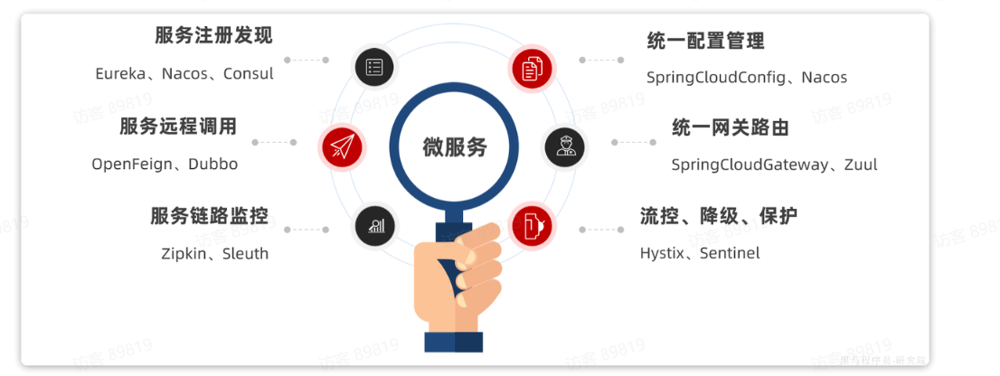

而且SpringCloud依托于SpringBoot的自动装配能力，大大降低了其项目搭建、组件使用的成本。对于没有自研微服务组件能力的中小型企业，使用SpringCloud全家桶来实现微服务开发可以说是最合适的选择了！

https://spring.io/projects/spring-cloud#overview


目前SpringCloud最新版本为`2022.0.x`版本，对应的SpringBoot版本为`3.x`版本，但它们全部依赖于JDK17，目前在企业中使用相对较少。

| **SpringCloud版本**                                          | **SpringBoot版本**                    |
| :----------------------------------------------------------- | :------------------------------------ |
| [2022.0.x](https://github.com/spring-cloud/spring-cloud-release/wiki/Spring-Cloud-2022.0-Release-Notes) aka Kilburn | 3.0.x                                 |
| [2021.0.x](https://github.com/spring-cloud/spring-cloud-release/wiki/Spring-Cloud-2021.0-Release-Notes) aka Jubilee | 2.6.x, 2.7.x (Starting with 2021.0.3) |
| [2020.0.x](https://github.com/spring-cloud/spring-cloud-release/wiki/Spring-Cloud-2020.0-Release-Notes) aka Ilford | 2.4.x, 2.5.x (Starting with 2020.0.3) |
| [Hoxton](https://github.com/spring-cloud/spring-cloud-release/wiki/Spring-Cloud-Hoxton-Release-Notes) | 2.2.x, 2.3.x (Starting with SR5)      |
| [Greenwich](https://github.com/spring-projects/spring-cloud/wiki/Spring-Cloud-Greenwich-Release-Notes) | 2.1.x                                 |
| [Finchley](https://github.com/spring-projects/spring-cloud/wiki/Spring-Cloud-Finchley-Release-Notes) | 2.0.x                                 |
| [Edgware](https://github.com/spring-projects/spring-cloud/wiki/Spring-Cloud-Edgware-Release-Notes) | 1.5.x                                 |
| [Dalston](https://github.com/spring-projects/spring-cloud/wiki/Spring-Cloud-Dalston-Release-Notes) | 1.5.x                                 |

因此，我们推荐使用次新版本：Spring Cloud 2021.0.x以及Spring Boot 2.7.x版本。

另外，Alibaba的微服务产品SpringCloudAlibaba目前也成为了SpringCloud组件中的一员，我们课堂中也会使用其中的部分组件。

在我们的父工程hmall中已经配置了SpringCloud以及SpringCloudAlibaba的依赖：

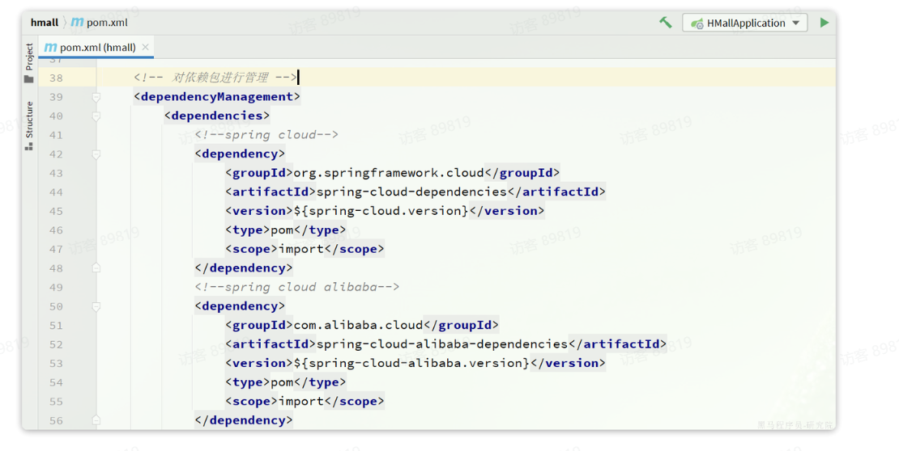

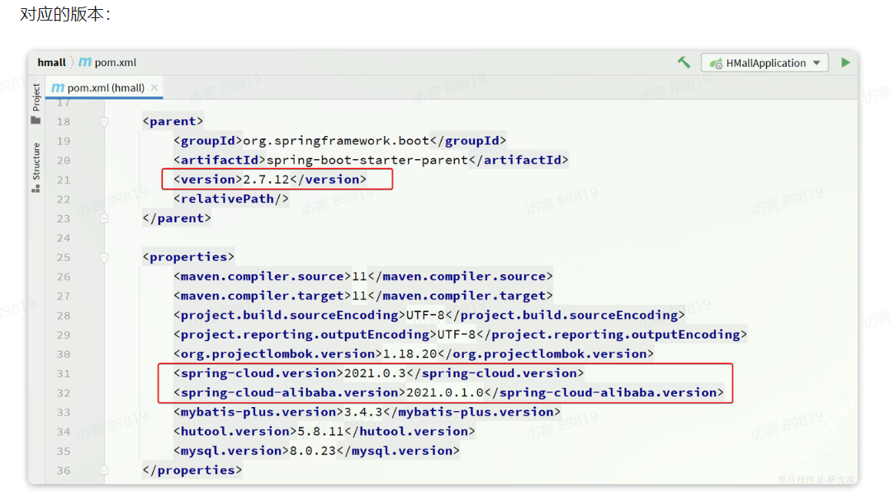

这样，我们在后续需要使用SpringCloud或者SpringCloudAlibaba组件时，就无需单独指定版本了。


# 2.微服务拆分

接下来，我们就一起将黑马商城这个单体项目拆分为微服务项目，并解决其中出现的各种问题。


## 2.1.熟悉黑马商城

首先，我们需要熟悉黑马商城项目的基本结构：

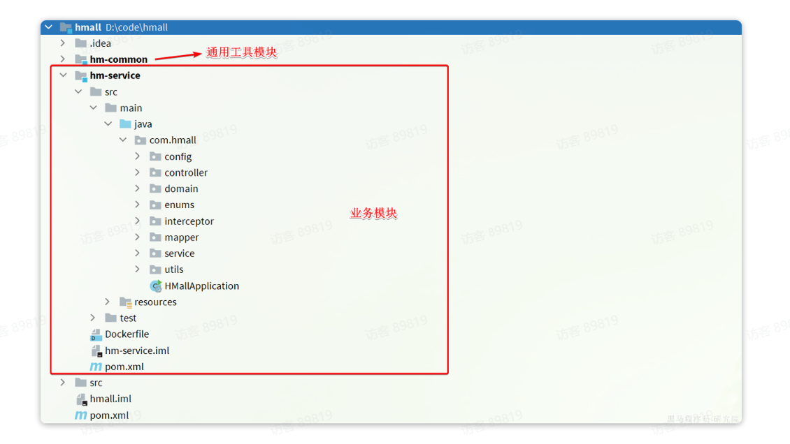

大家可以直接启动该项目，测试效果。不过，需要修改数据库连接参数，在application-local.yaml中：

```YAML
hm:
  db:
    host: 192.168.150.101 # 修改为你自己的虚拟机IP地址
    pw: 123 # 修改为docker中的MySQL密码
```

同时配置启动项激活的是local环境：

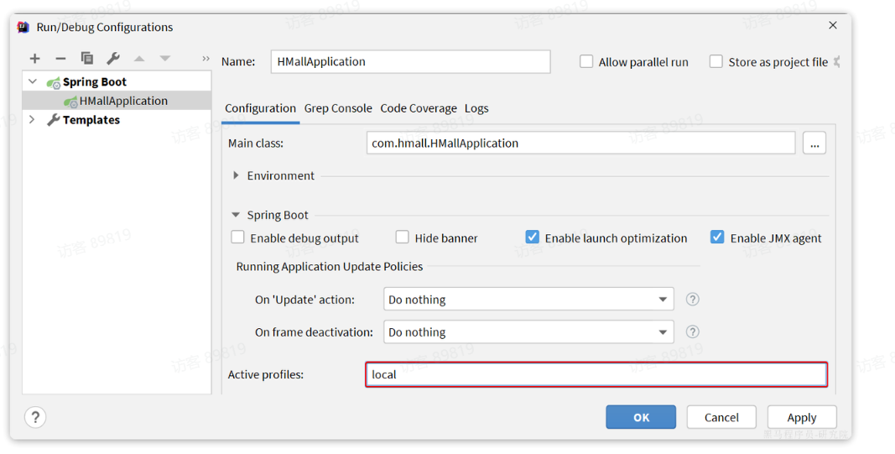


### 2.1.1.登录

首先来看一下登录业务流程：

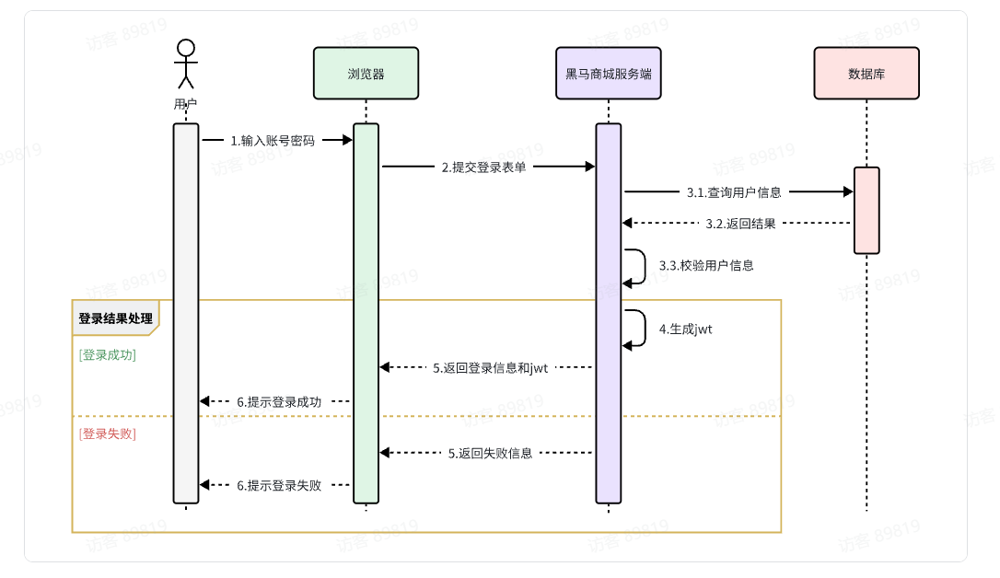

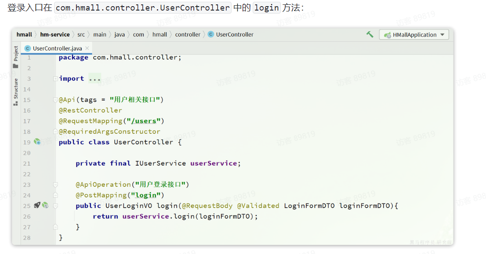


### 2.2.2.搜索商品

在首页搜索框输入关键字，点击搜索即可进入搜索列表页面：


该页面会调用接口：`/search/list`，对应的服务端入口在`com.hmall.controller.SearchController`中的`search`方法：	

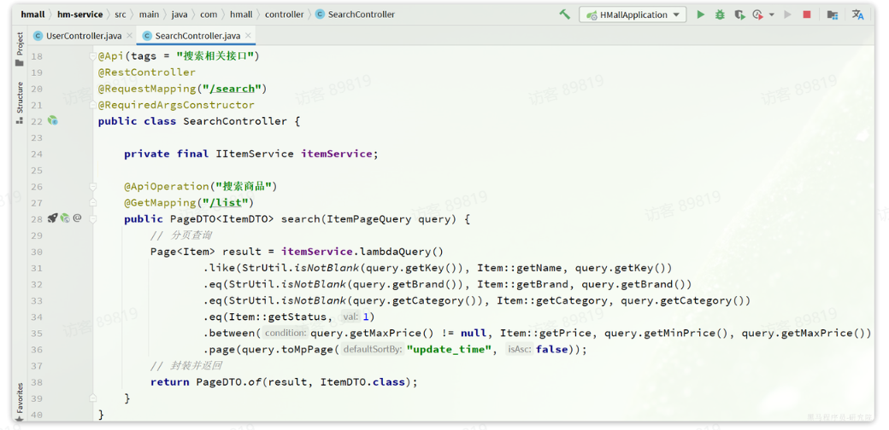

这里目前是利用数据库实现了简单的分页查询。


### 2.2.3.购物车

在搜索到的商品列表中，点击按钮`加入购物车`，即可将商品加入购物车：


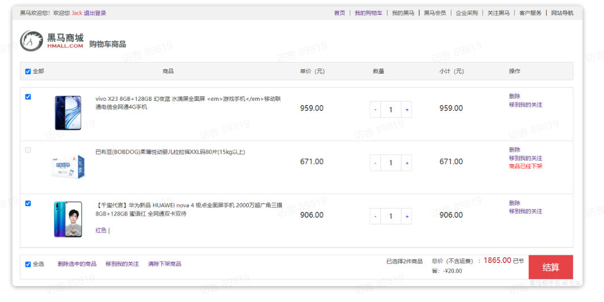

同时这里还可以对购物车实现修改、删除等操作。

相关功能全部在`com.hmall.controller.CartController`中：

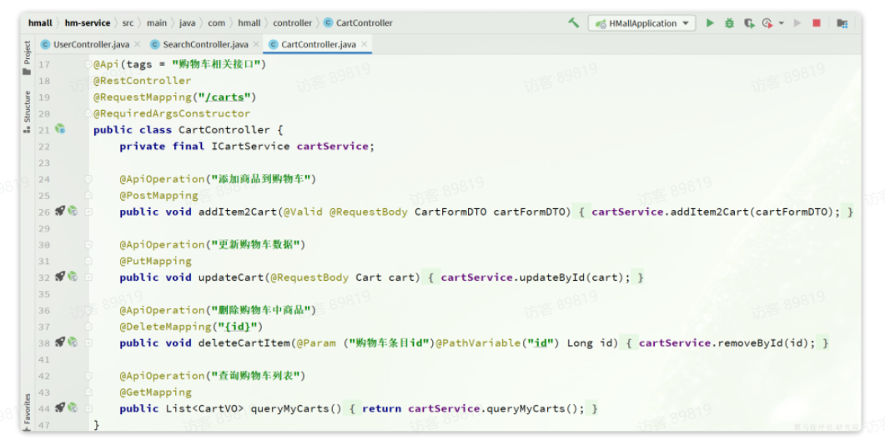

其中，查询购物车列表时，由于要判断商品最新的价格和状态，所以还需要查询商品信息，业务流程如下：

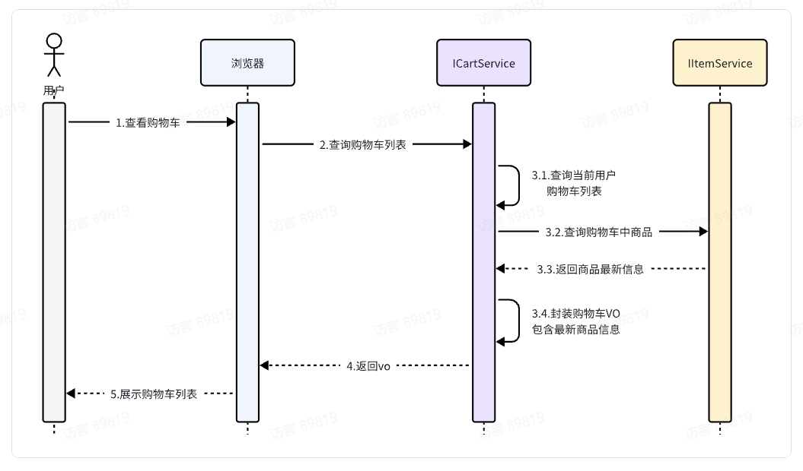


### 2.2.4.下单

在购物车页面点击`结算`按钮，会进入订单结算页面：

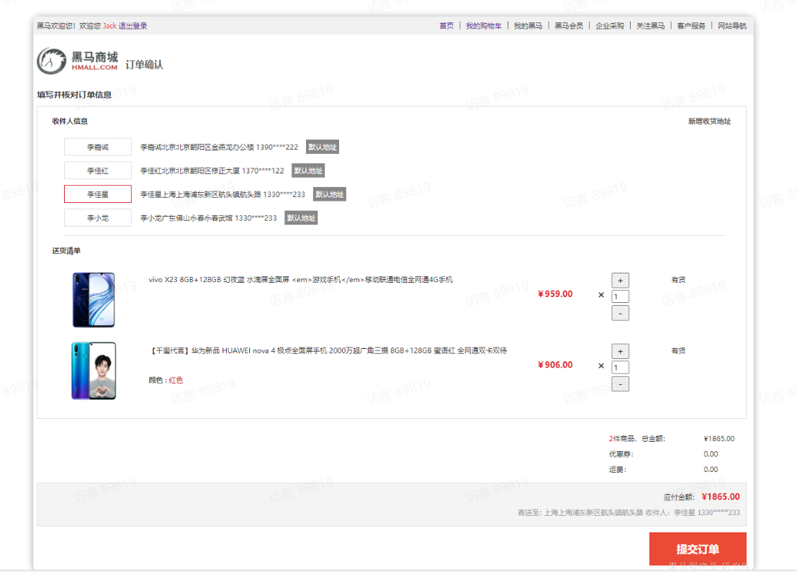

点击提交订单，会提交请求到服务端，服务端做3件事情：

- 创建一个新的订单
- 扣减商品库存
- 清理购物车中商品

业务入口在`com.hmall.controller.OrderController`中的`createOrder`方法：

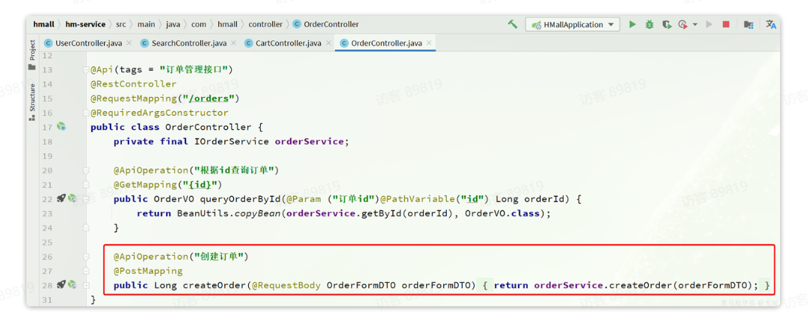

### 2.2.5.支付

下单完成后会跳转到支付页面，目前只支持**余额支付**：

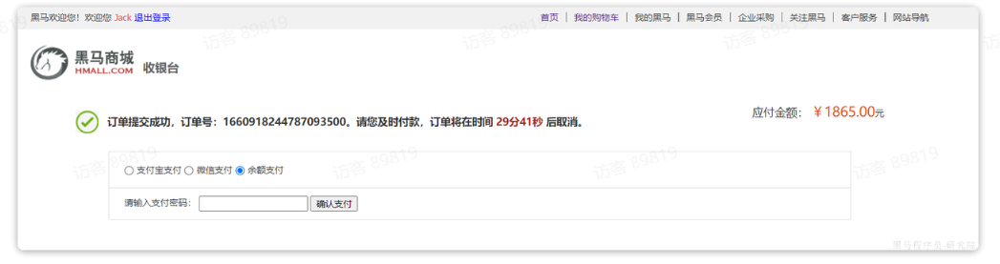

在选择**余额支付**这种方式后，会发起请求到服务端，服务端会立刻创建一个支付流水单，并返回支付流水单号到前端。

当用户输入用户密码，然后点击确认支付时，页面会发送请求到服务端，而服务端会做几件事情：

- 校验用户密码
- 扣减余额
- 修改支付流水状态
- 修改交易订单状态

请求入口在`com.hmall.controller.PayController`中：

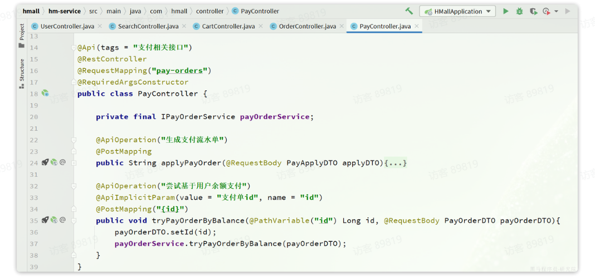


## 2.2.服务拆分原则

服务拆分一定要考虑几个问题：

- 什么时候拆？
- 如何拆？


### 2.2.1.什么时候拆

一般情况下，对于一个初创的项目，首先要做的是验证项目的可行性。因此这一阶段的首要任务是敏捷开发，快速产出生产可用的产品，投入市场做验证。为了达成这一目的，该阶段项目架构往往会比较简单，很多情况下会直接采用单体架构，这样开发成本比较低，可以快速产出结果，一旦发现项目不符合市场，损失较小。

如果这一阶段采用复杂的微服务架构，投入大量的人力和时间成本用于架构设计，最终发现产品不符合市场需求，等于全部做了无用功。

所以，对于**大多数小型项目来说，一般是先采用单体架构**，随着用户规模扩大、业务复杂后**再逐渐拆分为****微服务架构**。这样初期成本会比较低，可以快速试错。但是，这么做的问题就在于后期做服务拆分时，可能会遇到很多代码耦合带来的问题，拆分比较困难（**前易后难**）。

而对于一些大型项目，在立项之初目的就很明确，为了长远考虑，在架构设计时就直接选择微服务架构。虽然前期投入较多，但后期就少了拆分服务的烦恼（**前难后易**）。


### 2.2.2.怎么拆

之前我们说过，微服务拆分时**粒度要小**，这其实是拆分的目标。具体可以从两个角度来分析：

- **高内聚**：每个微服务的职责要尽量单一，包含的业务相互关联度高、完整度高。
- **低**耦合：每个微服务的功能要相对独立，尽量减少对其它微服务的依赖，或者依赖接口的稳定性要强。

**高内聚**首先是**单一职责，**但不能说一个微服务就一个接口，而是要保证微服务内部业务的完整性为前提。目标是当我们要修改某个业务时，最好就只修改当前微服务，这样变更的成本更低。

一旦微服务做到了高内聚，那么服务之间的**耦合度**自然就降低了。

当然，微服务之间不可避免的会有或多或少的业务交互，比如下单时需要查询商品数据。这个时候我们不能在订单服务直接查询商品数据库，否则就导致了数据耦合。而应该由商品服务对应暴露接口，并且一定要保证微服务对外**接口的稳定性**（即：尽量保证接口外观不变）。虽然出现了服务间调用，但此时无论你如何在商品服务做内部修改，都不会影响到订单微服务，服务间的耦合度就降低了。

明确了拆分目标，接下来就是拆分方式了。我们在做服务拆分时一般有两种方式：

- **纵向**拆分
- **横向**拆分

所谓**纵向拆分**，就是按照项目的功能模块来拆分。例如黑马商城中，就有用户管理功能、订单管理功能、购物车功能、商品管理功能、支付功能等。那么按照功能模块将他们拆分为一个个服务，就属于纵向拆分。这种拆分模式可以尽可能提高服务的内聚性。

而**横向拆分**，是看各个功能模块之间有没有公共的业务部分，如果有将其抽取出来作为通用服务。例如用户登录是需要发送消息通知，记录风控数据，下单时也要发送短信，记录风控数据。因此消息发送、风控数据记录就是通用的业务功能，因此可以将他们分别抽取为公共服务：消息中心服务、风控管理服务。这样可以提高业务的复用性，避免重复开发。同时通用业务一般接口稳定性较强，也不会使服务之间过分耦合。

当然，由于黑马商城并不是一个完整的项目，其中的短信发送、风控管理并没有实现，这里就不再考虑了。而其它的业务按照纵向拆分，可以分为以下几个微服务：

- 用户服务
- 商品服务
- 订单服务
- 购物车服务
- 支付服务


## 2.3.拆分购物车、商品服务

接下来，我们先把商品管理功能、购物车功能抽取为两个独立服务。

一般微服务项目有两种不同的工程结构：

- 完全解耦：每一个微服务都创建为一个独立的工程，甚至可以使用不同的开发语言来开发，项目完全解耦。
  - 优点：服务之间耦合度低
  - 缺点：每个项目都有自己的独立仓库，管理起来比较麻烦
- Maven聚合：整个项目为一个Project，然后每个微服务是其中的一个Module
  - 优点：项目代码集中，管理和运维方便（授课也方便）
  - 缺点：服务之间耦合，编译时间较长

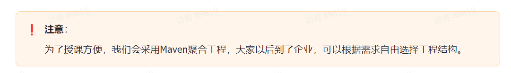

在hmall父工程之中，我已经提前定义了SpringBoot、SpringCloud的依赖版本，所以为了方便期间，我们直接在这个项目中创建微服务module.


### 2.3.1.商品服务

在hmall中创建module：

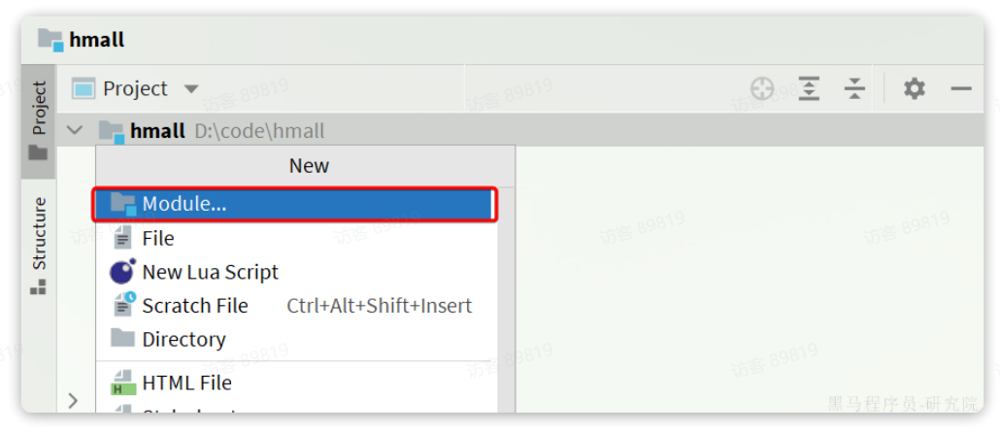

选择maven模块，并设定JDK版本为11：

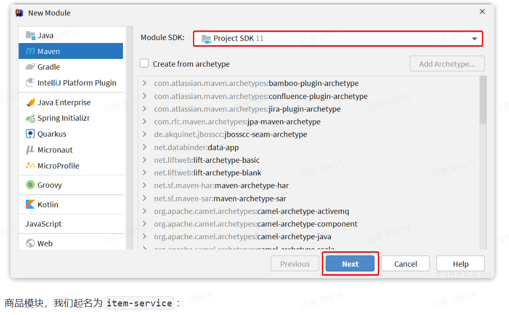

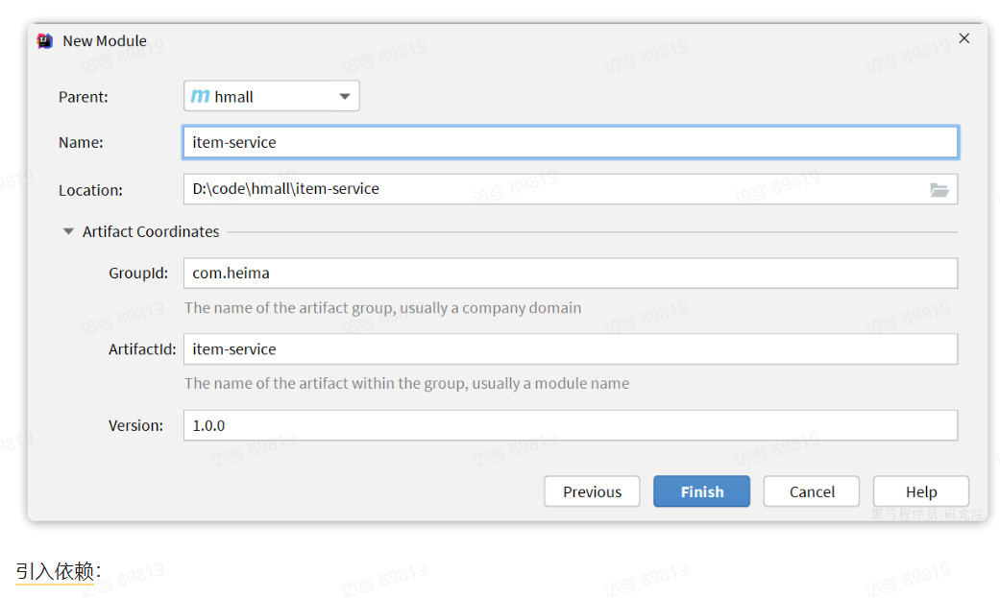

```XML
<?xml version="1.0" encoding="UTF-8"?>
<project xmlns="http://maven.apache.org/POM/4.0.0"
         xmlns:xsi="http://www.w3.org/2001/XMLSchema-instance"
         xsi:schemaLocation="http://maven.apache.org/POM/4.0.0 http://maven.apache.org/xsd/maven-4.0.0.xsd">
    <parent>
        <artifactId>hmall</artifactId>
        <groupId>com.heima</groupId>
        <version>1.0.0</version>
    </parent>
    <modelVersion>4.0.0</modelVersion>

    <artifactId>item-service</artifactId>

    <properties>
        <maven.compiler.source>11</maven.compiler.source>
        <maven.compiler.target>11</maven.compiler.target>
    </properties>
    <dependencies>
        <!--common-->
        <dependency>
            <groupId>com.heima</groupId>
            <artifactId>hm-common</artifactId>
            <version>1.0.0</version>
        </dependency>
        <!--web-->
        <dependency>
            <groupId>org.springframework.boot</groupId>
            <artifactId>spring-boot-starter-web</artifactId>
        </dependency>
        <!--数据库-->
        <dependency>
            <groupId>mysql</groupId>
            <artifactId>mysql-connector-java</artifactId>
        </dependency>
        <!--mybatis-->
        <dependency>
            <groupId>com.baomidou</groupId>
            <artifactId>mybatis-plus-boot-starter</artifactId>
        </dependency>
        <!--单元测试-->
        <dependency>
            <groupId>org.springframework.boot</groupId>
            <artifactId>spring-boot-starter-test</artifactId>
        </dependency>
    </dependencies>
    <build>
        <finalName>${project.artifactId}</finalName>
        <plugins>
            <plugin>
                <groupId>org.springframework.boot</groupId>
                <artifactId>spring-boot-maven-plugin</artifactId>
            </plugin>
        </plugins>
    </build>
</project>
```


编写启动类：

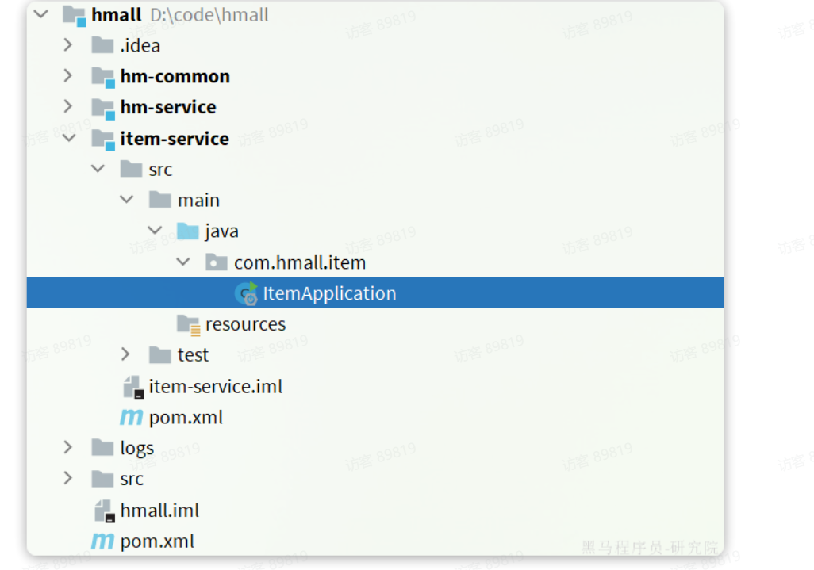

代码如下：

```Java
package com.hmall.item;

import org.mybatis.spring.annotation.MapperScan;
import org.springframework.boot.SpringApplication;
import org.springframework.boot.autoconfigure.SpringBootApplication;

@MapperScan("com.hmall.item.mapper")
@SpringBootApplication
public class ItemApplication {
    public static void main(String[] args) {
        SpringApplication.run(ItemApplication.class, args);
    }
}
```


接下来是配置文件，可以从`hm-service`中拷贝：


其中，`application.yaml`内容如下：

```YAML
server:
  port: 8081
spring:
  application:
    name: item-service
  profiles:
    active: dev
  datasource:
    url: jdbc:mysql://${hm.db.host}:3306/hm-item?useUnicode=true&characterEncoding=UTF-8&autoReconnect=true&serverTimezone=Asia/Shanghai
    driver-class-name: com.mysql.cj.jdbc.Driver
    username: root
    password: ${hm.db.pw}
mybatis-plus:
  configuration:
    default-enum-type-handler: com.baomidou.mybatisplus.core.handlers.MybatisEnumTypeHandler
  global-config:
    db-config:
      update-strategy: not_null
      id-type: auto
logging:
  level:
    com.hmall: debug
  pattern:
    dateformat: HH:mm:ss:SSS
  file:
    path: "logs/${spring.application.name}"
knife4j:
  enable: true
  openapi:
    title: 商品服务接口文档
    description: "信息"
    email: zhanghuyi@itcast.cn
    concat: 虎哥
    url: https://www.itcast.cn
    version: v1.0.0
    group:
      default:
        group-name: default
        api-rule: package
        api-rule-resources:
          - com.hmall.item.controller
```


剩下的`application-dev.yaml`和`application-local.yaml`直接从hm-service拷贝即可。

然后拷贝`hm-service`中与商品管理有关的代码到`item-service`，如图：

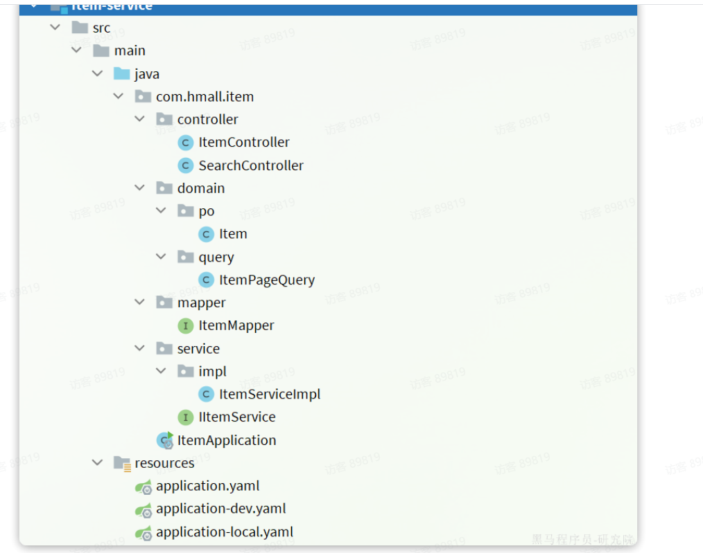


这里有一个地方的代码需要改动，就是`ItemServiceImpl`中的`deductStock`方法：


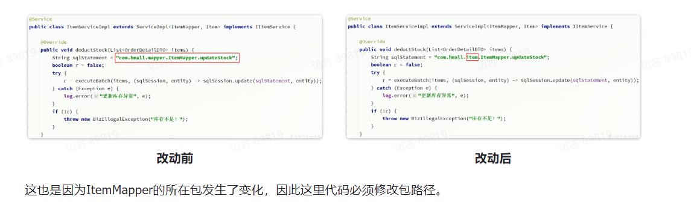

最后，还要导入数据库表。默认的数据库连接的是虚拟机，在你docker数据库执行课前资料提供的SQL文件：

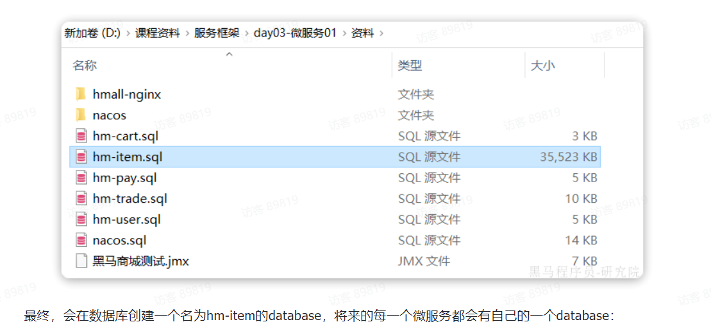

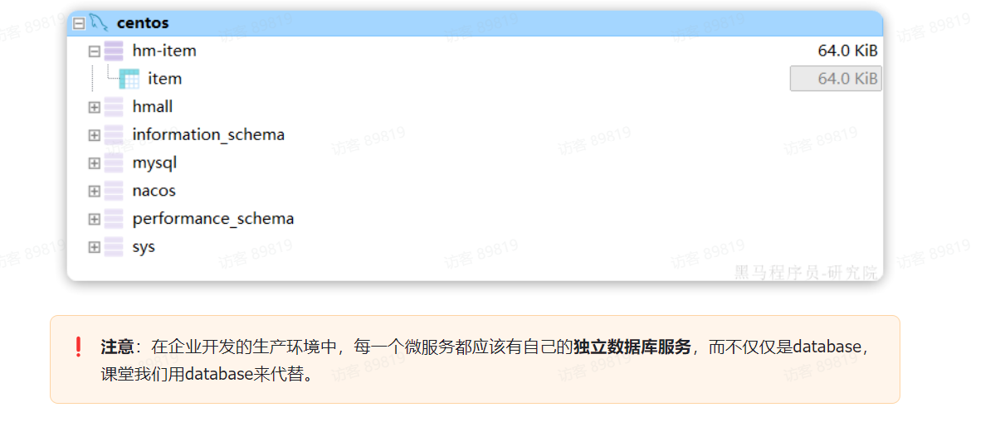

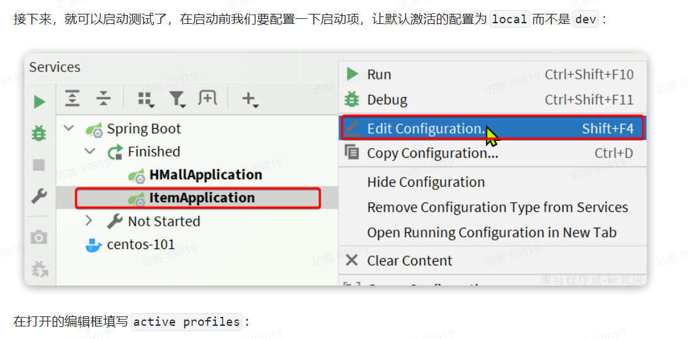

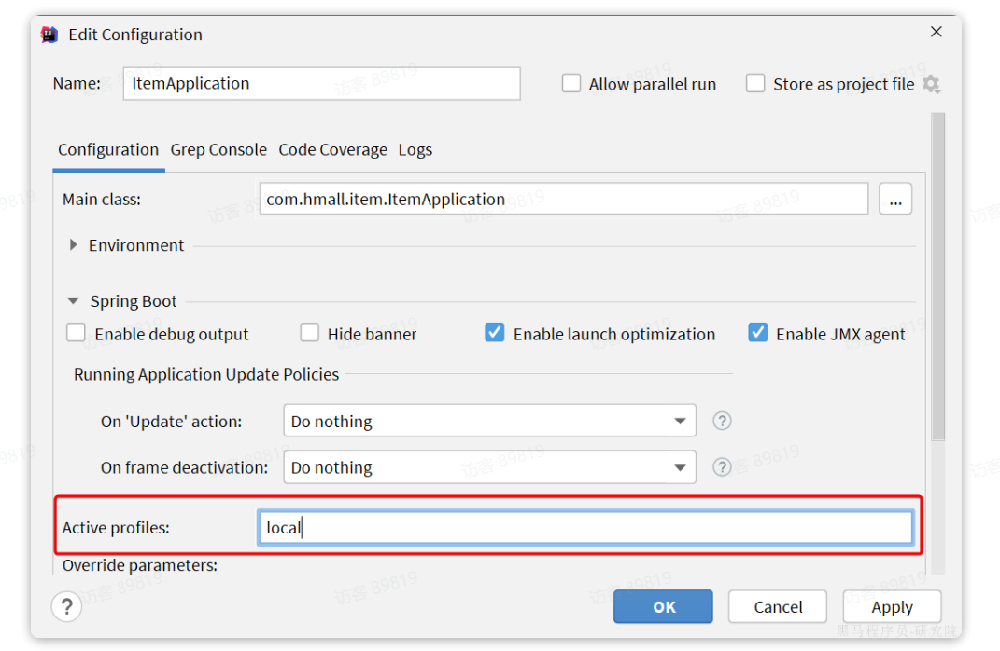

接着，启动`item-service`，访问商品微服务的swagger接口文档：http://localhost:8081/doc.html

然后测试其中的根据id批量查询商品这个接口：

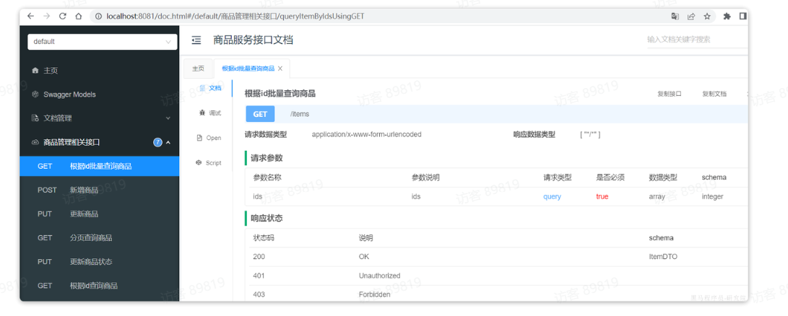

测试参数：100002672302,100002624500,100002533430，结果如下：

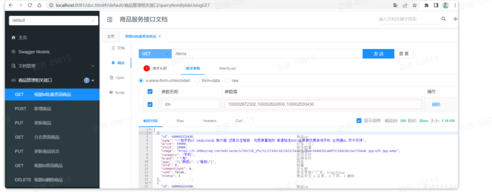

说明商品微服务抽取成功了。


### 2.3.2.购物车服务

与商品服务类似，在hmall下创建一个新的`module`，起名为`cart-service`:

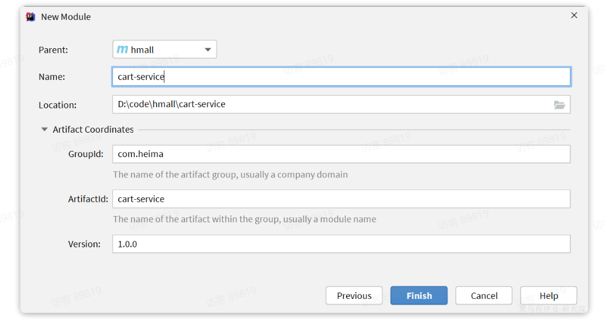

然后是依赖：

```XML
<?xml version="1.0" encoding="UTF-8"?>
<project xmlns="http://maven.apache.org/POM/4.0.0"
         xmlns:xsi="http://www.w3.org/2001/XMLSchema-instance"
         xsi:schemaLocation="http://maven.apache.org/POM/4.0.0 http://maven.apache.org/xsd/maven-4.0.0.xsd">
    <parent>
        <artifactId>hmall</artifactId>
        <groupId>com.heima</groupId>
        <version>1.0.0</version>
    </parent>
    <modelVersion>4.0.0</modelVersion>

    <artifactId>cart-service</artifactId>

    <properties>
        <maven.compiler.source>11</maven.compiler.source>
        <maven.compiler.target>11</maven.compiler.target>
    </properties>

    <dependencies>
        <!--common-->
        <dependency>
            <groupId>com.heima</groupId>
            <artifactId>hm-common</artifactId>
            <version>1.0.0</version>
        </dependency>
        <!--web-->
        <dependency>
            <groupId>org.springframework.boot</groupId>
            <artifactId>spring-boot-starter-web</artifactId>
        </dependency>
        <!--数据库-->
        <dependency>
            <groupId>mysql</groupId>
            <artifactId>mysql-connector-java</artifactId>
        </dependency>
        <!--mybatis-->
        <dependency>
            <groupId>com.baomidou</groupId>
            <artifactId>mybatis-plus-boot-starter</artifactId>
        </dependency>
        <!--单元测试-->
        <dependency>
            <groupId>org.springframework.boot</groupId>
            <artifactId>spring-boot-starter-test</artifactId>
        </dependency>
    </dependencies>
    <build>
        <finalName>${project.artifactId}</finalName>
        <plugins>
            <plugin>
                <groupId>org.springframework.boot</groupId>
                <artifactId>spring-boot-maven-plugin</artifactId>
            </plugin>
        </plugins>
    </build>
</project>
```

然后是启动类：

```Java
package com.hmall.cart;

import org.mybatis.spring.annotation.MapperScan;
import org.springframework.boot.SpringApplication;
import org.springframework.boot.autoconfigure.SpringBootApplication;

@MapperScan("com.hmall.cart.mapper")
@SpringBootApplication
public class CartApplication {
    public static void main(String[] args) {
        SpringApplication.run(CartApplication.class, args);
    }
}
```

然后是配置文件，同样可以拷贝自`item-service`，不过其中的`application.yaml`需要修改：

```YAML
server:
  port: 8082
spring:
  application:
    name: cart-service
  profiles:
    active: dev
  datasource:
    url: jdbc:mysql://${db.host}:3306/hm-cart?useUnicode=true&characterEncoding=UTF-8&autoReconnect=true&serverTimezone=Asia/Shanghai
    driver-class-name: com.mysql.cj.jdbc.Driver
    username: root
    password: ${db.pw}
mybatis-plus:
  configuration:
    default-enum-type-handler: com.baomidou.mybatisplus.core.handlers.MybatisEnumTypeHandler
  global-config:
    db-config:
      update-strategy: not_null
      id-type: auto
logging:
  level:
    com.hmall: debug
  pattern:
    dateformat: HH:mm:ss:SSS
  file:
    path: "logs/${spring.application.name}"
knife4j:
  enable: true
  openapi:
    title: 商品服务接口文档
    description: "信息"
    email: zhanghuyi@itcast.cn
    concat: 虎哥
    url: https://www.itcast.cn
    version: v1.0.0
    group:
      default:
        group-name: default
        api-rule: package
        api-rule-resources:
          - com.hmall.cart.controller
```

最后，把hm-service中的与购物车有关功能拷贝过来，最终的项目结构如下：

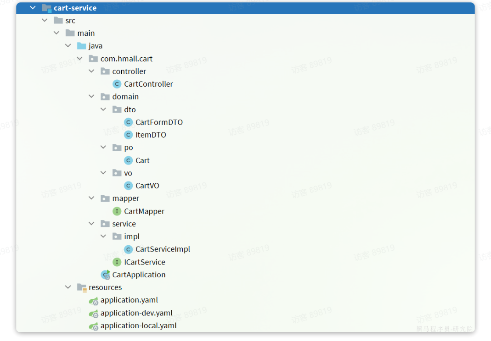

特别注意的是`com.hmall.cart.service.impl.CartServiceImpl`，其中有两个地方需要处理：

- 需要**获取登录用户信息**，但登录校验功能目前没有复制过来，先写死固定用户id
- 查询购物车时需要**查询商品信息**，而商品信息不在当前服务，需要先将这部分代码注释

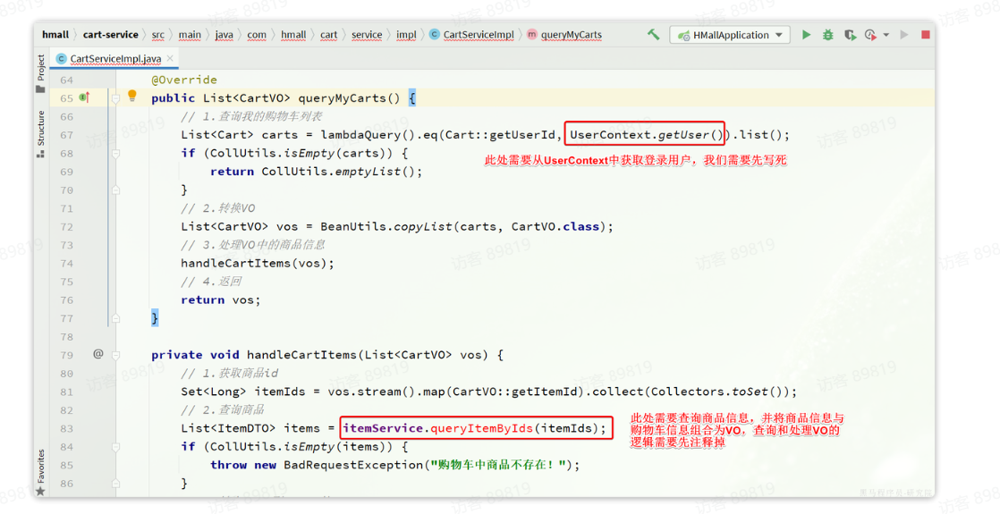

我们对这部分代码做如下修改：

```Java
package com.hmall.cart.service.impl;

import cn.hutool.core.util.StrUtil;
import com.baomidou.mybatisplus.core.conditions.query.QueryWrapper;
import com.baomidou.mybatisplus.extension.service.impl.ServiceImpl;
import com.hmall.cart.domain.dto.CartFormDTO;
import com.hmall.cart.domain.po.Cart;
import com.hmall.cart.domain.vo.CartVO;
import com.hmall.cart.mapper.CartMapper;
import com.hmall.cart.service.ICartService;
import com.hmall.common.exception.BizIllegalException;
import com.hmall.common.utils.BeanUtils;
import com.hmall.common.utils.CollUtils;
import com.hmall.common.utils.UserContext;
import lombok.RequiredArgsConstructor;
import org.springframework.stereotype.Service;

import java.util.Collection;
import java.util.List;

/**
 * <p>
 * 订单详情表 服务实现类
 * </p>
 *
 * @author 虎哥
 * @since 2023-05-05
 */
@Service
@RequiredArgsConstructor
public class CartServiceImpl extends ServiceImpl<CartMapper, Cart> implements ICartService {

    // private final IItemService itemService;

    @Override
    public void addItem2Cart(CartFormDTO cartFormDTO) {
        // 1.获取登录用户
        Long userId = UserContext.getUser();

        // 2.判断是否已经存在
        if (checkItemExists(cartFormDTO.getItemId(), userId)) {
            // 2.1.存在，则更新数量
            baseMapper.updateNum(cartFormDTO.getItemId(), userId);
            return;
        }
        // 2.2.不存在，判断是否超过购物车数量
        checkCartsFull(userId);

        // 3.新增购物车条目
        // 3.1.转换PO
        Cart cart = BeanUtils.copyBean(cartFormDTO, Cart.class);
        // 3.2.保存当前用户
        cart.setUserId(userId);
        // 3.3.保存到数据库
        save(cart);
    }

    @Override
    public List<CartVO> queryMyCarts() {
        // 1.查询我的购物车列表
        List<Cart> carts = lambdaQuery().eq(Cart::getUserId, 1L /*TODO UserContext.getUser()*/).list();
        if (CollUtils.isEmpty(carts)) {
            return CollUtils.emptyList();
        }
        // 2.转换VO
        List<CartVO> vos = BeanUtils.copyList(carts, CartVO.class);
        // 3.处理VO中的商品信息
        handleCartItems(vos);
        // 4.返回
        return vos;
    }

    private void handleCartItems(List<CartVO> vos) {
        // 1.获取商品id TODO 处理商品信息
        /*Set<Long> itemIds = vos.stream().map(CartVO::getItemId).collect(Collectors.toSet());
        // 2.查询商品
        List<ItemDTO> items = itemService.queryItemByIds(itemIds);
        if (CollUtils.isEmpty(items)) {
            throw new BadRequestException("购物车中商品不存在！");
        }
        // 3.转为 id 到 item的map
        Map<Long, ItemDTO> itemMap = items.stream().collect(Collectors.toMap(ItemDTO::getId, Function.identity()));
        // 4.写入vo
        for (CartVO v : vos) {
            ItemDTO item = itemMap.get(v.getItemId());
            if (item == null) {
                continue;
            }
            v.setNewPrice(item.getPrice());
            v.setStatus(item.getStatus());
            v.setStock(item.getStock());
        }*/
    }

    @Override
    public void removeByItemIds(Collection<Long> itemIds) {
        // 1.构建删除条件，userId和itemId
        QueryWrapper<Cart> queryWrapper = new QueryWrapper<Cart>();
        queryWrapper.lambda()
                .eq(Cart::getUserId, UserContext.getUser())
                .in(Cart::getItemId, itemIds);
        // 2.删除
        remove(queryWrapper);
    }

    private void checkCartsFull(Long userId) {
        int count = lambdaQuery().eq(Cart::getUserId, userId).count();
        if (count >= 10) {
            throw new BizIllegalException(StrUtil.format("用户购物车课程不能超过{}", 10));
        }
    }

    private boolean checkItemExists(Long itemId, Long userId) {
        int count = lambdaQuery()
                .eq(Cart::getUserId, userId)
                .eq(Cart::getItemId, itemId)
                .count();
        return count > 0;
    }
}
```

最后，还是要导入数据库表，在本地数据库直接执行课前资料对应的SQL文件：

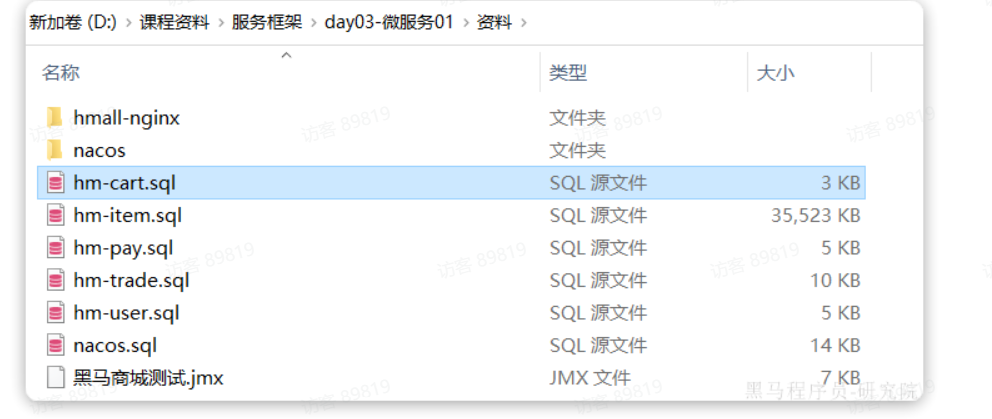

在数据库中会出现名为`hm-cart`的`database`，以及其中的`cart`表，代表购物车：

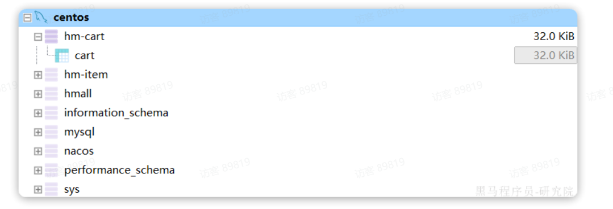

接下来，就可以测试了。不过在启动前，同样要配置启动项的`active profile`为`local`：

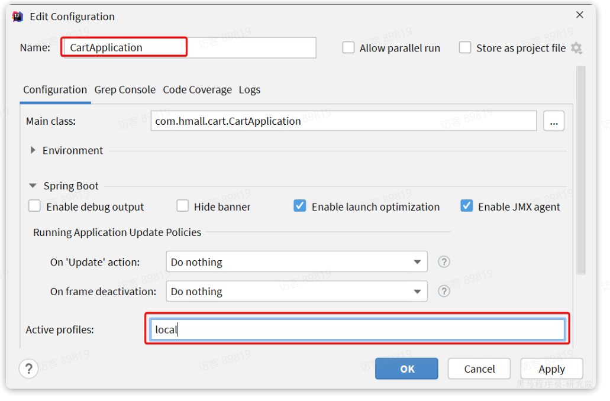

然后启动`CartApplication`，访问swagger文档页面：http://localhost:8082/doc.html

我们测试其中的`查询我的购物车列表`接口：

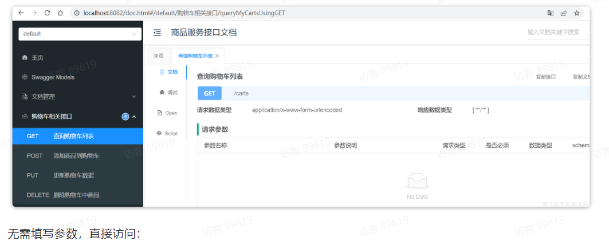

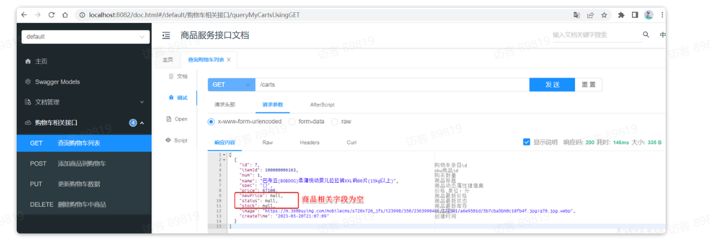


我们注意到，其中与商品有关的几个字段值都为空！这就是因为刚才我们注释掉了查询购物车时，查询商品信息的相关代码。

那么，我们该如何在`cart-service`服务中实现对`item-service`服务的查询呢？


## 2.4.服务调用

在拆分的时候，我们发现一个问题：就是购物车业务中需要查询商品信息，但商品信息查询的逻辑全部迁移到了`item-service`服务，导致我们无法查询。

最终结果就是查询到的购物车数据不完整，因此要想解决这个问题，我们就必须改造其中的代码，把原本本地方法调用，改造成跨微服务的远程调用（RPC，即**R**emote **P**roduce **C**all）。

因此，现在查询购物车列表的流程变成了这样：

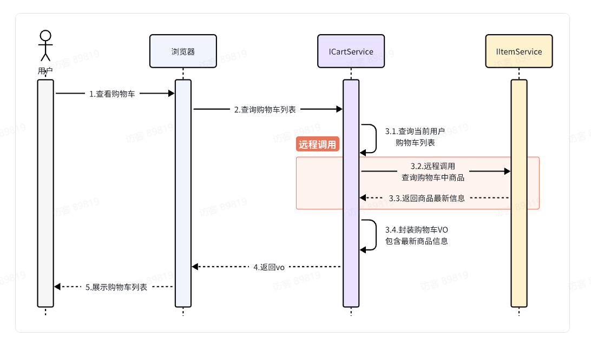

代码中需要变化的就是这一步：

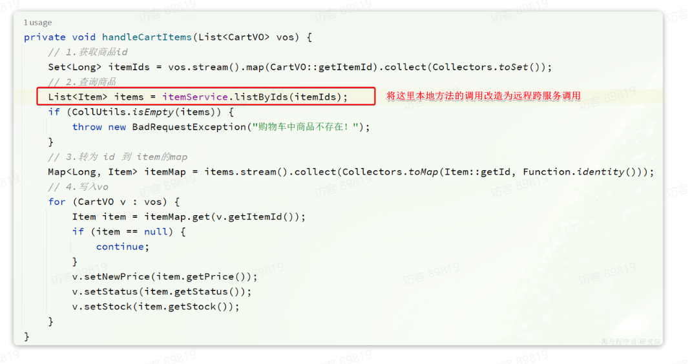

那么问题来了：我们该如何跨服务调用，准确的说，如何在`cart-service`中获取`item-service`服务中的提供的商品数据呢？

大家思考一下，我们以前有没有实现过类似的远程查询的功能呢？

答案是肯定的，我们前端向服务端查询数据，其实就是从浏览器远程查询服务端数据。比如我们刚才通过Swagger测试商品查询接口，就是向`http://localhost:8081/items`这个接口发起的请求：

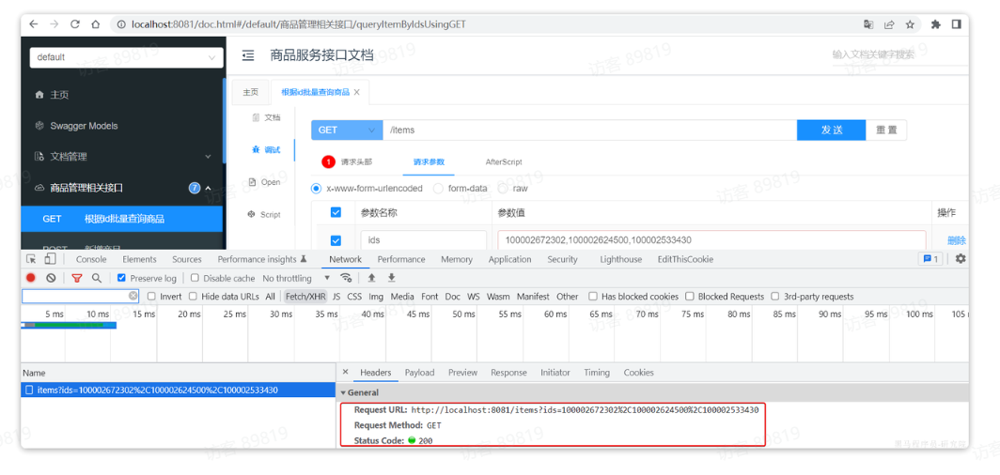

而这种查询就是通过http请求的方式来完成的，不仅仅可以实现远程查询，还可以实现新增、删除等各种远程请求。


### 2.4.1.RestTemplate

Spring给我们提供了一个RestTemplate的API，可以方便的实现Http请求的发送。

> org.springframework.web.client public class RestTemplate
>
> extends InterceptingHttpAccessor
>
> implements RestOperations
>
> \----------------------------------------------------------------------------------------------------------------
>
> 同步客户端执行HTTP请求，在底层HTTP客户端库(如JDK HttpURLConnection、Apache HttpComponents等)上公开一个简单的模板方法API。RestTemplate通过HTTP方法为常见场景提供了模板，此外还提供了支持不太常见情况的通用交换和执行方法。 RestTemplate通常用作共享组件。然而，它的配置不支持并发修改，因此它的配置通常是在启动时准备的。如果需要，您可以在启动时创建多个不同配置的RestTemplate实例。如果这些实例需要共享HTTP客户端资源，它们可以使用相同的底层ClientHttpRequestFactory。 注意:从5.0开始，这个类处于维护模式，只有对更改和错误的小请求才会被接受。请考虑使用org.springframework.web.react .client. webclient，它有更现代的API，支持同步、异步和流场景。  
>
> \----------------------------------------------------------------------------------------------------------------
>
> 自: 3.0 参见: HttpMessageConverter, RequestCallback, ResponseExtractor, ResponseErrorHandler

其中提供了大量的方法，方便我们发送Http请求，例如：

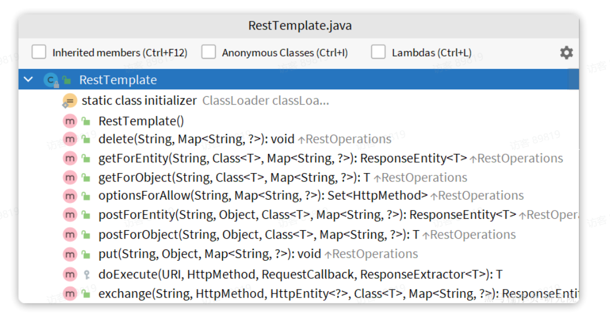

可以看到常见的Get、Post、Put、Delete请求都支持，如果请求参数比较复杂，还可以使用exchange方法来构造请求。

我们在`cart-service`服务中定义一个配置类：

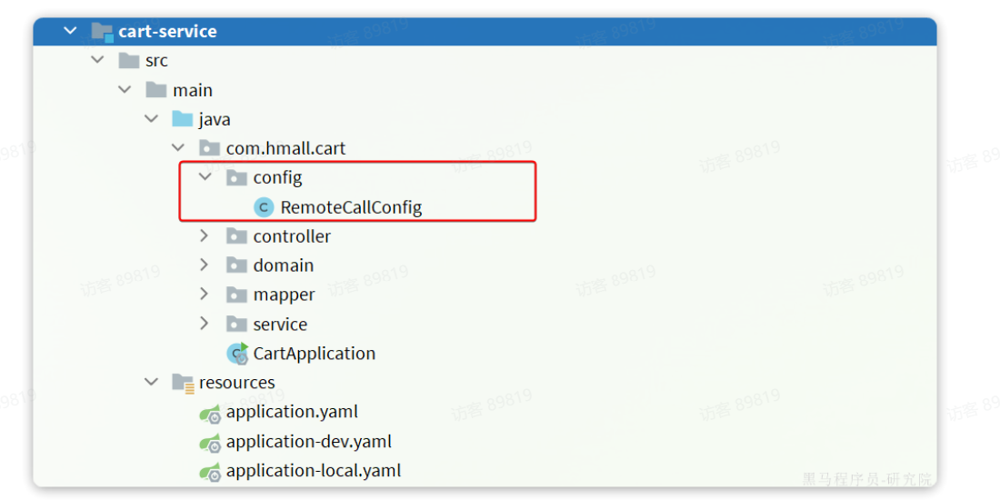

先将RestTemplate注册为一个Bean：

```Java
package com.hmall.cart.config;

import org.springframework.context.annotation.Bean;
import org.springframework.context.annotation.Configuration;
import org.springframework.web.client.RestTemplate;

@Configuration
public class RemoteCallConfig {

    @Bean
    public RestTemplate restTemplate() {
        return new RestTemplate();
    }
}
```


### 2.4.2.远程调用

接下来，我们修改`cart-service`中的`com.hmall.cart.service.impl.CartServiceImpl`的`handleCartItems`方法，发送http请求到`item-service`：

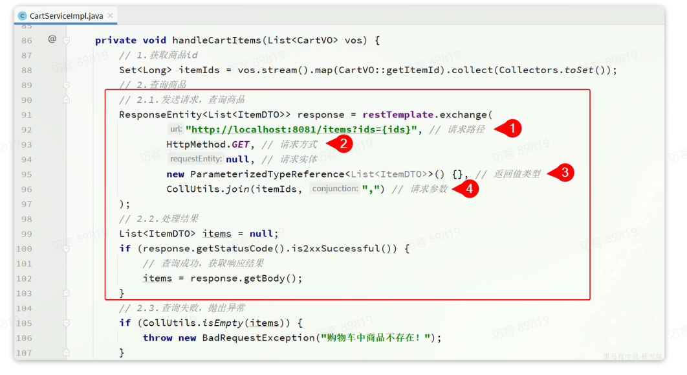

可以看到，利用RestTemplate发送http请求与前端ajax发送请求非常相似，都包含四部分信息：

- ① 请求方式
- ② 请求路径
- ③ 请求参数
- ④  返回值类型

`handleCartItems`方法的完整代码如下：

```Java
private void handleCartItems(List<CartVO> vos) {
    // TODO 1.获取商品id
    Set<Long> itemIds = vos.stream().map(CartVO::getItemId).collect(Collectors.toSet());
    // 2.查询商品
    // List<ItemDTO> items = itemService.queryItemByIds(itemIds);
    // 2.1.利用RestTemplate发起http请求，得到http的响应
    ResponseEntity<List<ItemDTO>> response = restTemplate.exchange(
            "http://localhost:8081/items?ids={ids}",
            HttpMethod.GET,
            null,
            new ParameterizedTypeReference<List<ItemDTO>>() {
            },
            Map.of("ids", CollUtil.join(itemIds, ","))
    );
    // 2.2.解析响应
    if(!response.getStatusCode().is2xxSuccessful()){
        // 查询失败，直接结束
        return;
    }
    List<ItemDTO> items = response.getBody();
    if (CollUtils.isEmpty(items)) {
        return;
    }
    // 3.转为 id 到 item的map
    Map<Long, ItemDTO> itemMap = items.stream().collect(Collectors.toMap(ItemDTO::getId, Function.identity()));
    // 4.写入vo
    for (CartVO v : vos) {
        ItemDTO item = itemMap.get(v.getItemId());
        if (item == null) {
            continue;
        }
        v.setNewPrice(item.getPrice());
        v.setStatus(item.getStatus());
        v.setStock(item.getStock());
    }
}
```

好了，现在重启`cart-service`，再次测试查询我的购物车列表接口：

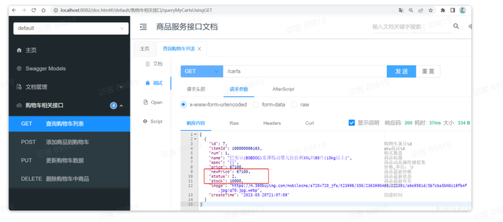

可以发现，所有商品相关数据都已经查询到了。

在这个过程中，`item-service`提供了查询接口，`cart-service`利用Http请求调用该接口。因此`item-service`可以称为服务的提供者，而`cart-service`则称为服务的消费者或服务调用者。

## 2.5.总结

什么时候需要拆分微服务？

- 如果是创业型公司，最好先用单体架构快速迭代开发，验证市场运作模型，快速试错。当业务跑通以后，随着业务规模扩大、人员规模增加，再考虑拆分微服务。
- 如果是大型企业，有充足的资源，可以在项目开始之初就搭建微服务架构。

如何拆分？

- 首先要做到高内聚、低耦合
- 从拆分方式来说，有横向拆分和纵向拆分两种。纵向就是按照业务功能模块，横向则是拆分通用性业务，提高复用性

服务拆分之后，不可避免的会出现跨微服务的业务，此时微服务之间就需要进行远程调用。微服务之间的远程调用被称为RPC，即远程过程调用。RPC的实现方式有很多，比如：

- 基于Http协议
- 基于Dubbo协议

我们课堂中使用的是Http方式，这种方式不关心服务提供者的具体技术实现，只要对外暴露Http接口即可，更符合微服务的需要。

Java发送http请求可以使用Spring提供的RestTemplate，使用的基本步骤如下：

- 注册RestTemplate到Spring容器
- 调用RestTemplate的API发送请求，常见方法有：
  - getForObject：发送Get请求并返回指定类型对象
  - PostForObject：发送Post请求并返回指定类型对象
  - put：发送PUT请求
  - delete：发送Delete请求
  - exchange：发送任意类型请求，返回ResponseEntit


# 3.服务注册和发现


在上一章我们实现了微服务拆分，并且通过Http请求实现了跨微服务的远程调用。不过这种手动发送Http请求的方式存在一些问题。

试想一下，假如商品微服务被调用较多，为了应对更高的并发，我们进行了多实例部署，如图：

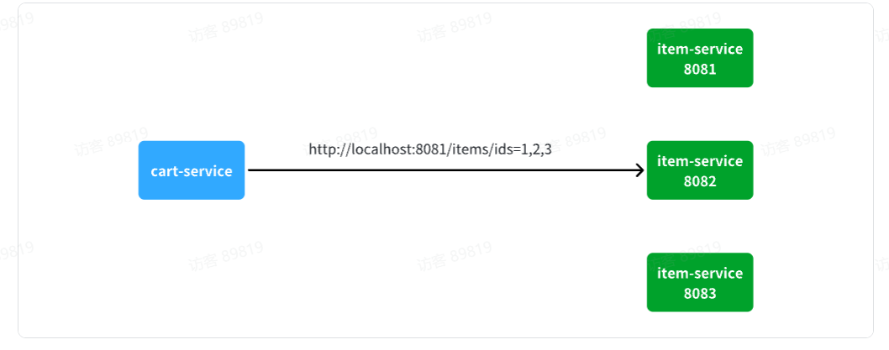

此时，每个`item-service`的实例其IP或端口不同，问题来了：

- item-service这么多实例，cart-service如何知道每一个实例的地址？
- http请求要写url地址，`cart-service`服务到底该调用哪个实例呢？
- 如果在运行过程中，某一个`item-service`实例宕机，`cart-service`依然在调用该怎么办？
- 如果并发太高，`item-service`临时多部署了N台实例，`cart-service`如何知道新实例的地址？

为了解决上述问题，就必须引入注册中心的概念了，接下来我们就一起来分析下注册中心的原理。

## 3.1.注册中心原理

在微服务远程调用的过程中，包括两个角色：

- 服务提供者：提供接口供其它微服务访问，比如`item-service`
- 服务消费者：调用其它微服务提供的接口，比如`cart-service`

在大型微服务项目中，服务提供者的数量会非常多，为了管理这些服务就引入了**注册中心**的概念。注册中心、服务提供者、服务消费者三者间关系如下：

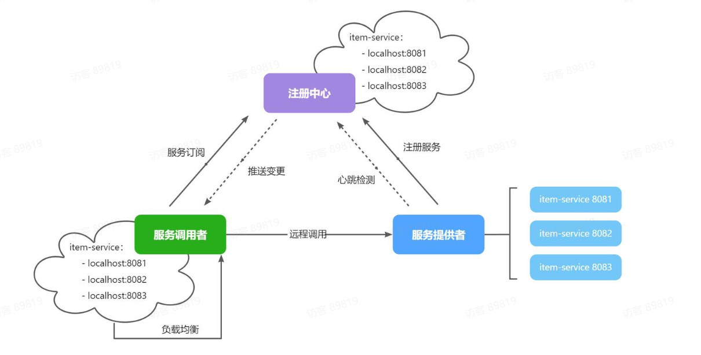


流程如下：

- 服务启动时就会注册自己的服务信息（服务名、IP、端口）到注册中心
- 调用者可以从注册中心订阅想要的服务，获取服务对应的实例列表（1个服务可能多实例部署）
- 调用者自己对实例列表负载均衡，挑选一个实例
- 调用者向该实例发起远程调用

当服务提供者的实例宕机或者启动新实例时，调用者如何得知呢？

- 服务提供者会定期向注册中心发送请求，报告自己的健康状态（心跳请求）
- 当注册中心长时间收不到提供者的心跳时，会认为该实例宕机，将其从服务的实例列表中剔除
- 当服务有新实例启动时，会发送注册服务请求，其信息会被记录在注册中心的服务实例列表
- 当注册中心服务列表变更时，会主动通知微服务，更新本地服务列表


## 3.2.Nacos注册中心

目前开源的注册中心框架有很多，国内比较常见的有：

- Eureka：Netflix公司出品，目前被集成在SpringCloud当中，一般用于Java应用
- Nacos：Alibaba公司出品，目前被集成在SpringCloudAlibaba中，一般用于Java应用
- Consul：HashiCorp公司出品，目前集成在SpringCloud中，不限制微服务语言

以上几种注册中心都遵循SpringCloud中的API规范，因此在业务开发使用上没有太大差异。由于Nacos是国内产品，中文文档比较丰富，而且同时具备**配置管理**功能（后面会学习），因此在国内使用较多，课堂中我们会Nacos为例来学习。

官方网站如下：

https://nacos.io/zh-cn/

我们基于Docker来部署Nacos的注册中心，首先我们要准备MySQL数据库表，用来存储Nacos的数据。由于是Docker部署，所以大家需要将资料中的SQL文件导入到你**Docker中的MySQL容器**中：

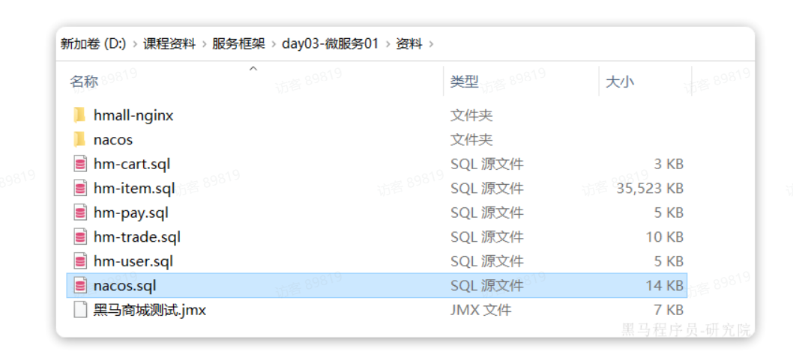

最终表结构如下：

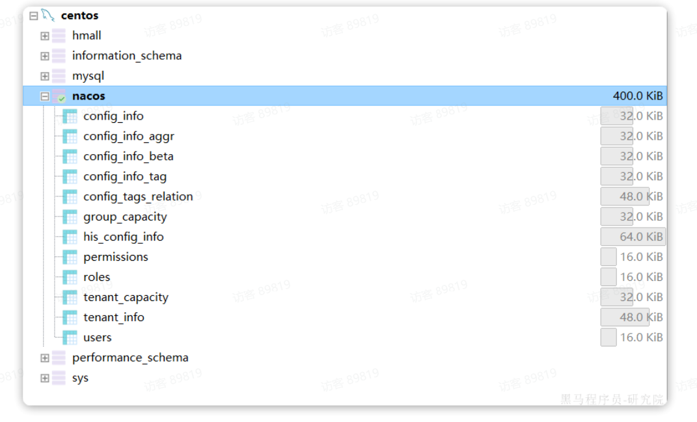

然后，找到课前资料下的nacos文件夹：

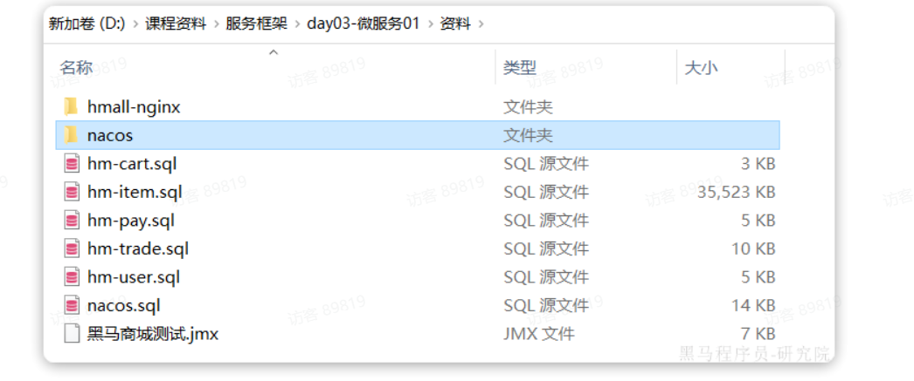

其中的`nacos/custom.env`文件中，有一个MYSQL_SERVICE_HOST也就是mysql地址，需要修改为你自己的虚拟机IP地址：

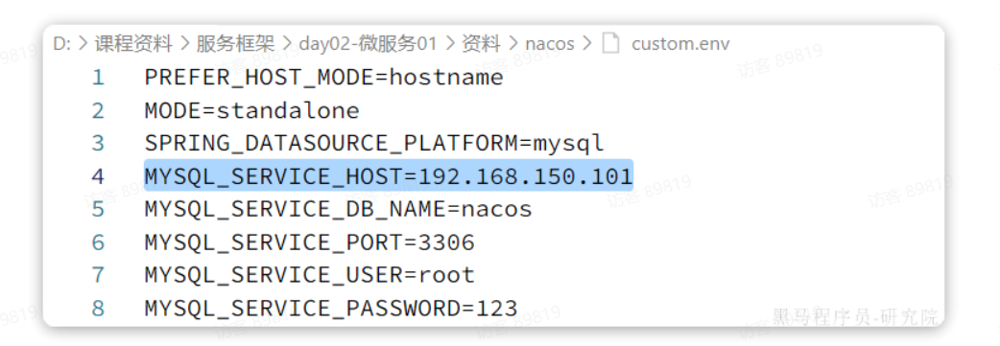

然后，将课前资料中的`nacos`目录上传至虚拟机的`/root`目录。

进入root目录，然后执行下面的docker命令：


```PowerShell
docker run -d \
--name nacos \
--env-file ./nacos/custom.env \
-p 8848:8848 \
-p 9848:9848 \
-p 9849:9849 \
--restart=always \
nacos/nacos-server:v2.1.0-slim
```

启动完成后，访问下面地址：http://192.168.150.101:8848/nacos/，注意将`192.168.150.101`替换为你自己的虚拟机IP地址。

首次访问会跳转到登录页，**账号密码都是nacos**

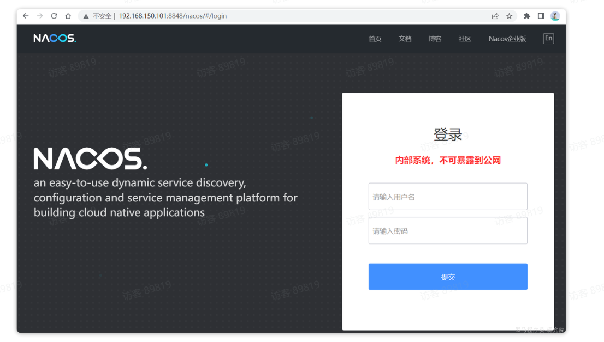

## 3.3.服务注册

接下来，我们把`item-service`注册到Nacos，步骤如下：

- 引入依赖
- 配置Nacos地址
- 重启

### 3.3.1.添加依赖

在`item-service`的`pom.xml`中添加依赖：

```XML
<!--nacos 服务注册发现-->
<dependency>
    <groupId>com.alibaba.cloud</groupId>
    <artifactId>spring-cloud-starter-alibaba-nacos-discovery</artifactId>
</dependency>
```

### 3.3.2.配置Nacos

在`item-service`的`application.yml`中添加nacos地址配置：

```YAML
spring:
  application:
    name: item-service # 服务名称
  cloud:
    nacos:
      server-addr: 192.168.150.101:8848 # nacos地址
```

### 3.3.3.启动服务实例

为了测试一个服务多个实例的情况，我们再配置一个`item-service`的部署实例：

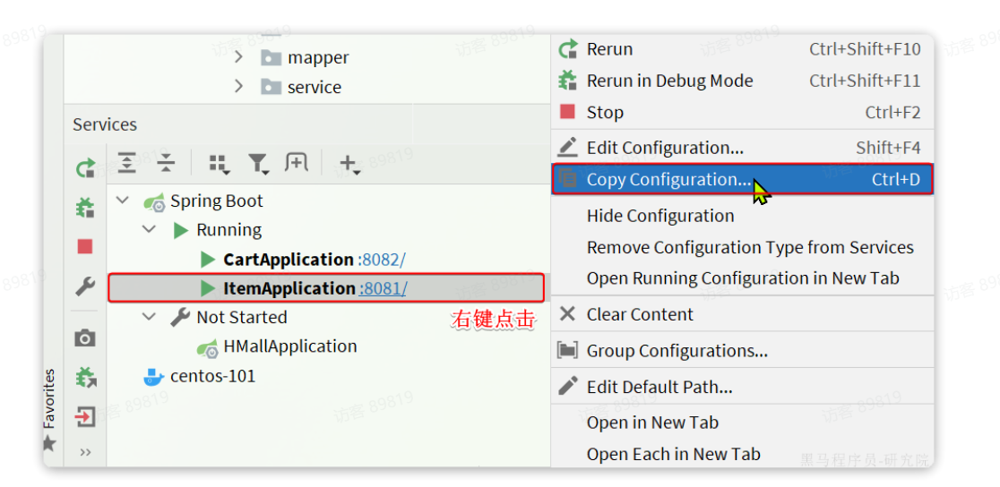

然后配置启动项，注意重命名并且配置新的端口，避免冲突：

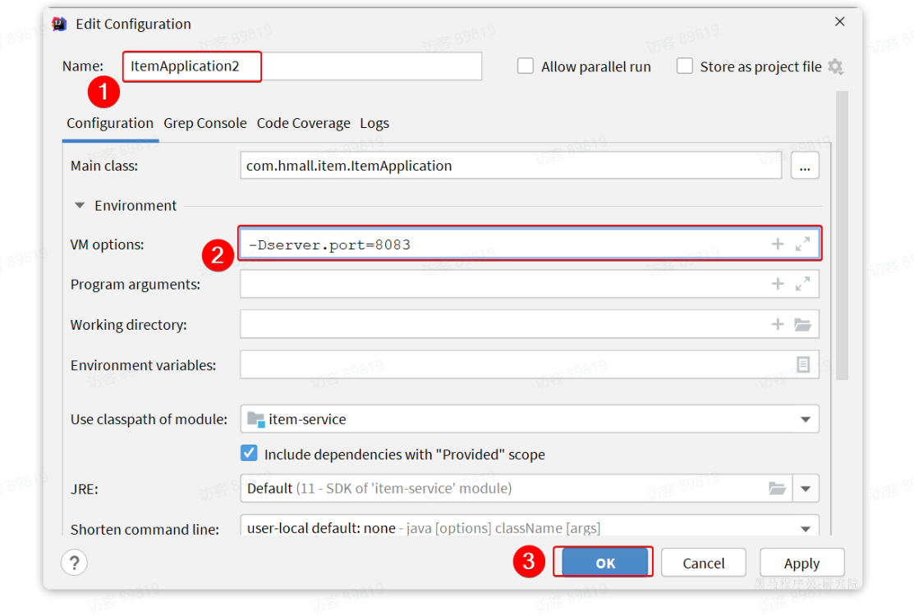

重启`item-service`的两个实例：

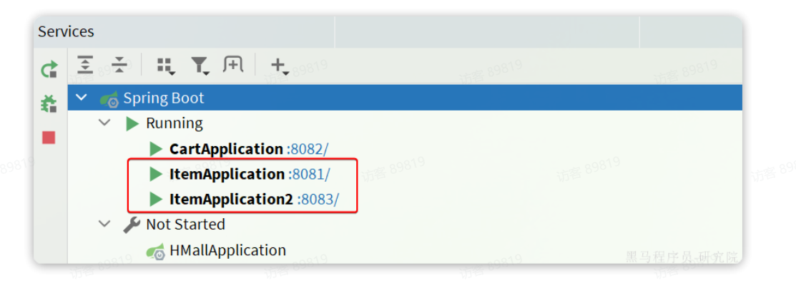

访问nacos控制台，可以发现服务注册成功：

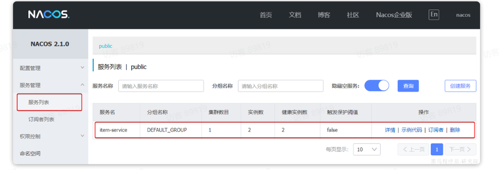

点击详情，可以查看到`item-service`服务的两个实例信息：

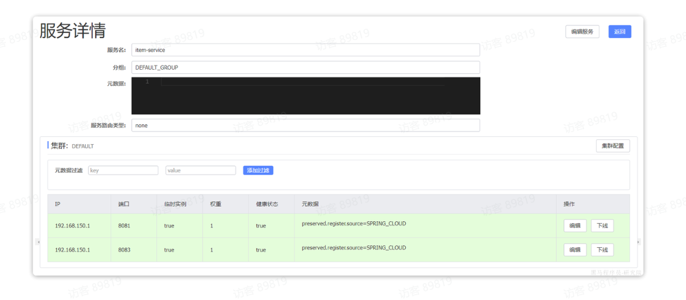

## 3.4.服务发现

服务的消费者要去nacos订阅服务，这个过程就是服务发现，步骤如下：

- 引入依赖
- 配置Nacos地址
- 发现并调用服务

### 3.4.1.引入依赖

服务发现除了要引入nacos依赖以外，由于还需要负载均衡，因此要引入SpringCloud提供的LoadBalancer依赖。

我们在`cart-service`中的`pom.xml`中添加下面的依赖：

```XML
<!--nacos 服务注册发现-->
<dependency>
    <groupId>com.alibaba.cloud</groupId>
    <artifactId>spring-cloud-starter-alibaba-nacos-discovery</artifactId>
</dependency>
```

可以发现，这里Nacos的依赖于服务注册时一致，这个依赖中同时包含了服务注册和发现的功能。因为任何一个微服务都可以调用别人，也可以被别人调用，即可以是调用者，也可以是提供者。

因此，等一会儿`cart-service`启动，同样会注册到Nacos

### 3.4.2.配置Nacos地址

在`cart-service`的`application.yml`中添加nacos地址配置：

```YAML
spring:
  cloud:
    nacos:
      server-addr: 192.168.150.101:8848
```

### 3.4.3.发现并调用服务

接下来，服务调用者`cart-service`就可以去订阅`item-service`服务了。不过item-service有多个实例，而真正发起调用时只需要知道一个实例的地址。

因此，服务调用者必须利用负载均衡的算法，从多个实例中挑选一个去访问。常见的负载均衡算法有：

- 随机
- 轮询
- IP的hash
- 最近最少访问
- ...

这里我们可以选择最简单的随机负载均衡。

另外，服务发现需要用到一个工具，DiscoveryClient，SpringCloud已经帮我们自动装配，我们可以直接注入使用：

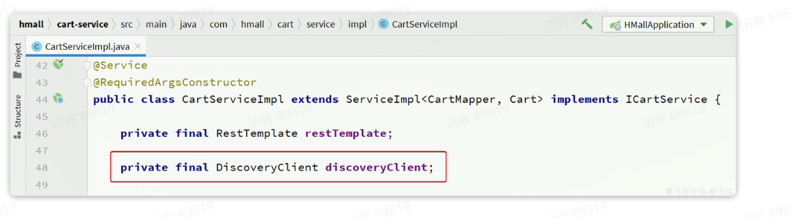

接下来，我们就可以对原来的远程调用做修改了，之前调用时我们需要写死服务提供者的IP和端口：

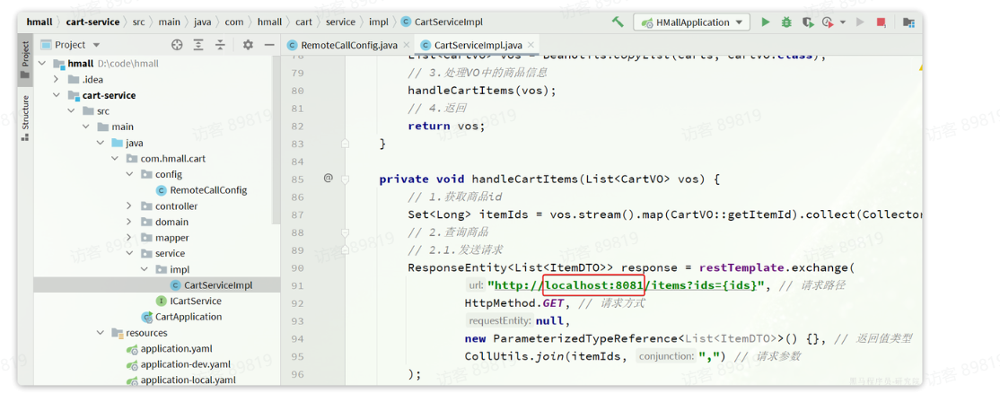

但现在不需要了，我们通过DiscoveryClient发现服务实例列表，然后通过负载均衡算法，选择一个实例去调用：

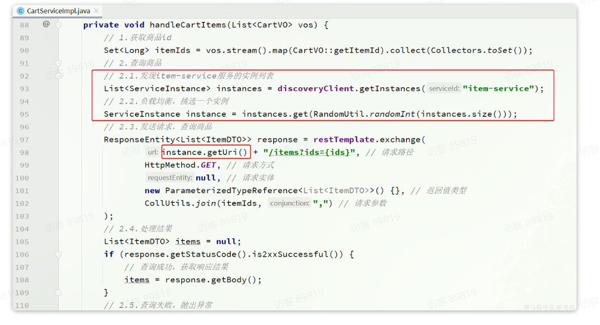

经过swagger测试，发现没有任何问题。


# 4.OpenFeign

在上一章，我们利用Nacos实现了服务的治理，利用RestTemplate实现了服务的远程调用。但是远程调用的代码太复杂了：

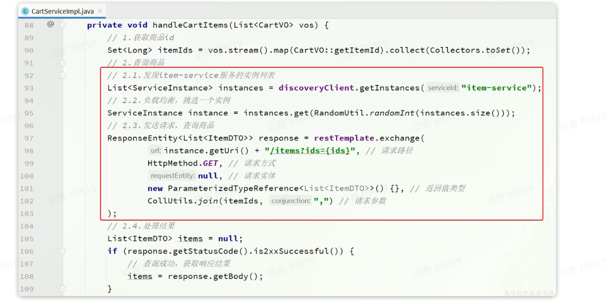

而且这种调用方式，与原本的本地方法调用差异太大，编程时的体验也不统一，一会儿远程调用，一会儿本地调用。

因此，我们必须想办法改变远程调用的开发模式，让**远程调用像本地方法调用一样简单**。而这就要用到OpenFeign组件了。

其实远程调用的关键点就在于四个：

- 请求方式
- 请求路径
- 请求参数
- 返回值类型


所以，OpenFeign就利用SpringMVC的相关注解来声明上述4个参数，然后基于动态代理帮我们生成远程调用的代码，而无需我们手动再编写，非常方便。

接下来，我们就通过一个快速入门的案例来体验一下OpenFeign的便捷吧。

## 4.1.快速入门

我们还是以cart-service中的查询我的购物车为例。因此下面的操作都是在cart-service中进行。

### 4.1.1.引入依赖

在`cart-service`服务的pom.xml中引入`OpenFeign`的依赖和`loadBalancer`依赖：

```XML
  <!--openFeign-->
  <dependency>
      <groupId>org.springframework.cloud</groupId>
      <artifactId>spring-cloud-starter-openfeign</artifactId>
  </dependency>
  <!--负载均衡器-->
  <dependency>
      <groupId>org.springframework.cloud</groupId>
      <artifactId>spring-cloud-starter-loadbalancer</artifactId>
  </dependency>
```

### 4.1.2.启用OpenFeign

接下来，我们在`cart-service`的`CartApplication`启动类上添加注解，启动OpenFeign功能：

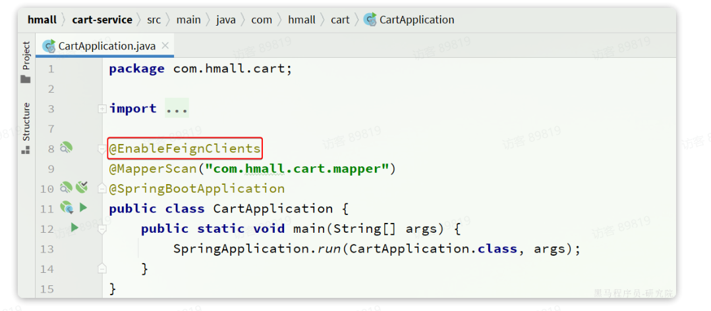


### 4.1.3.编写OpenFeign客户端

在`cart-service`中，定义一个新的接口，编写Feign客户端：

其中代码如下：

```Java
package com.hmall.cart.client;

import com.hmall.cart.domain.dto.ItemDTO;
import org.springframework.cloud.openfeign.FeignClient;
import org.springframework.web.bind.annotation.GetMapping;
import org.springframework.web.bind.annotation.RequestParam;

import java.util.List;

@FeignClient("item-service")
public interface ItemClient {

    @GetMapping("/items")
    List<ItemDTO> queryItemByIds(@RequestParam("ids") Collection<Long> ids);
}
```

这里只需要声明接口，无需实现方法。接口中的几个关键信息：

- `@FeignClient("item-service")` ：声明服务名称
- `@GetMapping` ：声明请求方式
- `@GetMapping("/items")` ：声明请求路径
- `@RequestParam("ids") Collection<Long> ids` ：声明请求参数
- `List<ItemDTO>` ：返回值类型

有了上述信息，OpenFeign就可以利用动态代理帮我们实现这个方法，并且向`http://item-service/items`发送一个`GET`请求，携带ids为请求参数，并自动将返回值处理为`List<ItemDTO>`。

我们只需要直接调用这个方法，即可实现远程调用了。

### 4.1.4.使用FeignClient

最后，我们在`cart-service`的`com.hmall.cart.service.impl.CartServiceImpl`中改造代码，直接调用`ItemClient`的方法：

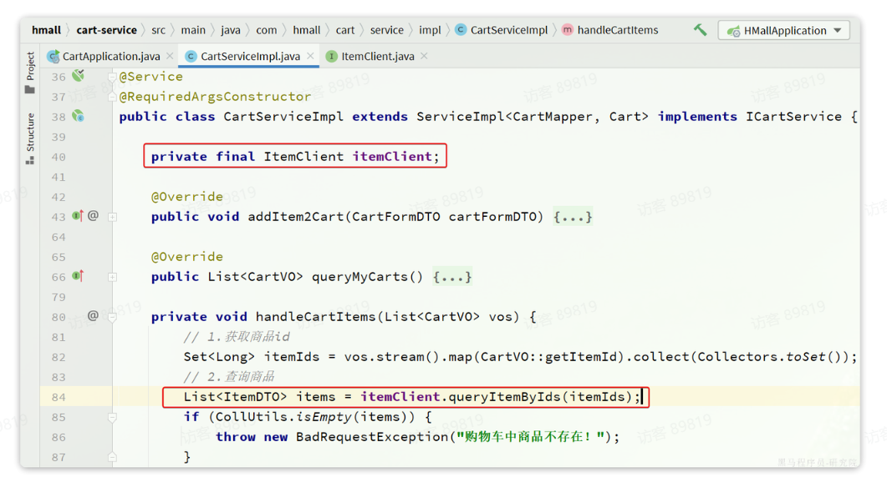

feign替我们完成了服务拉取、负载均衡、发送http请求的所有工作，是不是看起来优雅多了。

而且，这里我们不再需要RestTemplate了，还省去了RestTemplate的注册。

## 4.2.连接池

Feign底层发起http请求，依赖于其它的框架。其底层支持的http客户端实现包括：

- HttpURLConnection：默认实现，不支持连接池
- Apache HttpClient ：支持连接池
- OKHttp：支持连接池

因此我们通常会使用带有连接池的客户端来代替默认的HttpURLConnection。比如，我们使用OK Http.

### 4.2.1.引入依赖

在`cart-service`的`pom.xml`中引入依赖：

```XML
<!--OK http 的依赖 -->
<dependency>
  <groupId>io.github.openfeign</groupId>
  <artifactId>feign-okhttp</artifactId>
</dependency>
```

### 4.2.2.开启连接池

在`cart-service`的`application.yml`配置文件中开启Feign的连接池功能：

```YAML
feign:
  okhttp:
    enabled: true # 开启OKHttp功能
```

重启服务，连接池就生效了。

### 4.2.3.验证

我们可以打断点验证连接池是否生效，在`org.springframework.cloud.openfeign.loadbalancer.FeignBlockingLoadBalancerClient`中的`execute`方法中打断点：

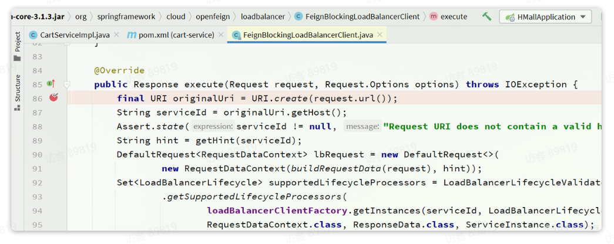

Debug方式启动cart-service，请求一次查询我的购物车方法，进入断点：


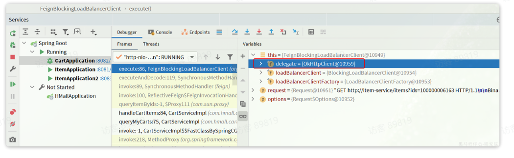

可以发现这里底层的实现已经改为`OkHttpClient`

## 4.3.最佳实践

将来我们要把与下单有关的业务抽取为一个独立微服务:`trade-service`，不过我们先来看一下`hm-service`中原本与下单有关的业务逻辑。

入口在`com.hmall.controller.OrderController`的`createOrder`方法，然后调用了`IOrderService`中的`createOrder`方法。

由于下单时前端提交了商品id，为了计算订单总价，需要查询商品信息：

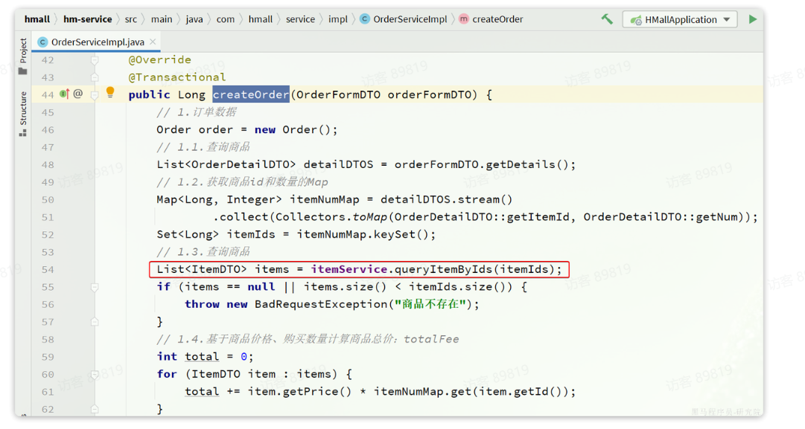

也就是说，如果拆分了交易微服务（`trade-service`），它也需要远程调用`item-service`中的根据id批量查询商品功能。这个需求与`cart-service`中是一样的。

因此，我们就需要在`trade-service`中再次定义`ItemClient`接口，这不是重复编码吗？ 有什么办法能加避免重复编码呢？

### 4.3.1.思路分析

相信大家都能想到，避免重复编码的办法就是**抽取**。不过这里有两种抽取思路：

- 思路1：抽取到微服务之外的公共module
- 思路2：每个微服务自己抽取一个module

如图：

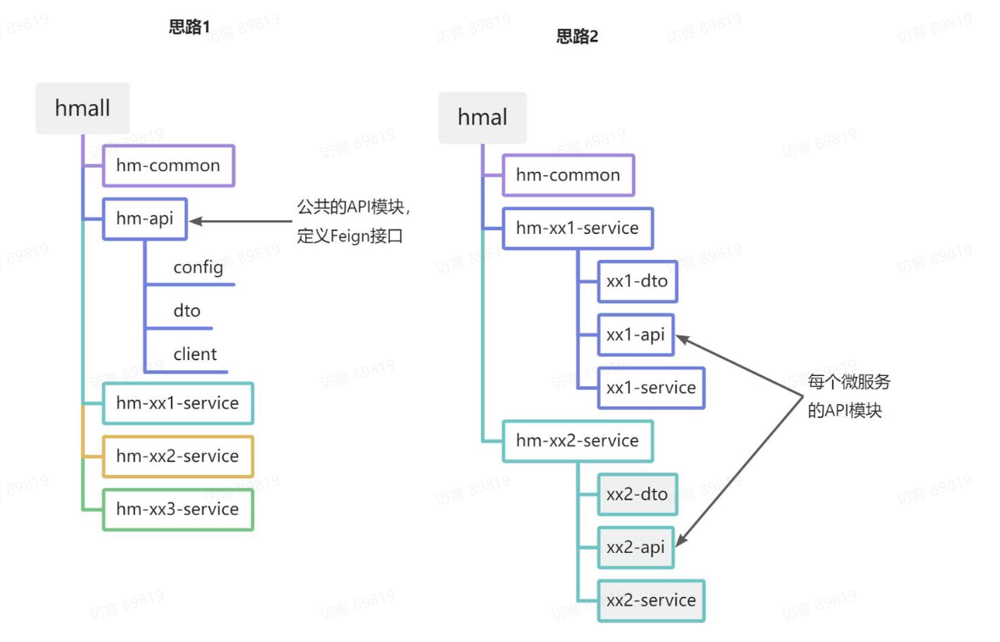

方案1抽取更加简单，工程结构也比较清晰，但缺点是整个项目耦合度偏高。

方案2抽取相对麻烦，工程结构相对更复杂，但服务之间耦合度降低。

由于item-service已经创建好，无法继续拆分，因此这里我们采用方案1.

### 4.3.2.抽取Feign客户端

在`hmall`下定义一个新的module，命名为hm-api

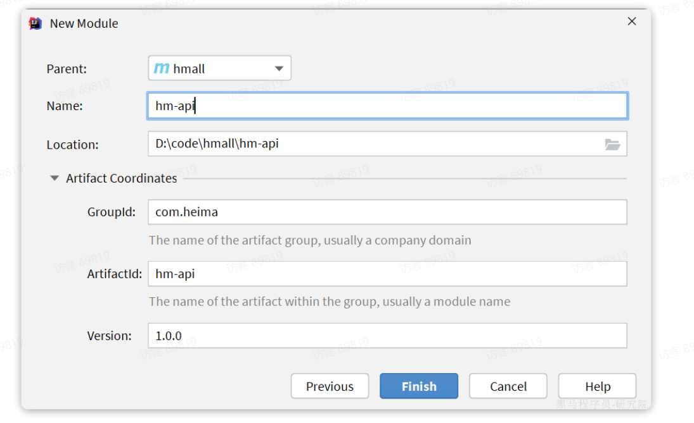


其依赖如下：

```XML
<?xml version="1.0" encoding="UTF-8"?>
<project xmlns="http://maven.apache.org/POM/4.0.0"
         xmlns:xsi="http://www.w3.org/2001/XMLSchema-instance"
         xsi:schemaLocation="http://maven.apache.org/POM/4.0.0 http://maven.apache.org/xsd/maven-4.0.0.xsd">
    <parent>
        <artifactId>hmall</artifactId>
        <groupId>com.heima</groupId>
        <version>1.0.0</version>
    </parent>
    <modelVersion>4.0.0</modelVersion>

    <artifactId>hm-api</artifactId>

    <properties>
        <maven.compiler.source>11</maven.compiler.source>
        <maven.compiler.target>11</maven.compiler.target>
    </properties>

    <dependencies>
        <!--open feign-->
        <dependency>
            <groupId>org.springframework.cloud</groupId>
            <artifactId>spring-cloud-starter-openfeign</artifactId>
        </dependency>
        <!-- load balancer-->
        <dependency>
            <groupId>org.springframework.cloud</groupId>
            <artifactId>spring-cloud-starter-loadbalancer</artifactId>
        </dependency>
        <!-- swagger 注解依赖 -->
        <dependency>
            <groupId>io.swagger</groupId>
            <artifactId>swagger-annotations</artifactId>
            <version>1.6.6</version>
            <scope>compile</scope>
        </dependency>
    </dependencies>
</project>
```

然后把ItemDTO和ItemClient都拷贝过来，最终结构如下：


现在，任何微服务要调用`item-service`中的接口，只需要引入`hm-api`模块依赖即可，无需自己编写Feign客户端了。

### 4.3.3.扫描包

接下来，我们在`cart-service`的`pom.xml`中引入`hm-api`模块：

```XML
  <!--feign模块-->
  <dependency>
      <groupId>com.heima</groupId>
      <artifactId>hm-api</artifactId>
      <version>1.0.0</version>
  </dependency>
```

删除`cart-service`中原来的ItemDTO和ItemClient，重启项目，发现报错了：

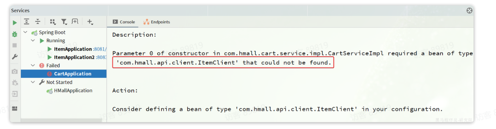

这里因为`ItemClient`现在定义到了`com.hmall.api.client`包下，而cart-service的启动类定义在`com.hmall.cart`包下，扫描不到`ItemClient`，所以报错了。

解决办法很简单，在cart-service的启动类上添加声明即可，两种方式：

- 方式1：声明扫描包：

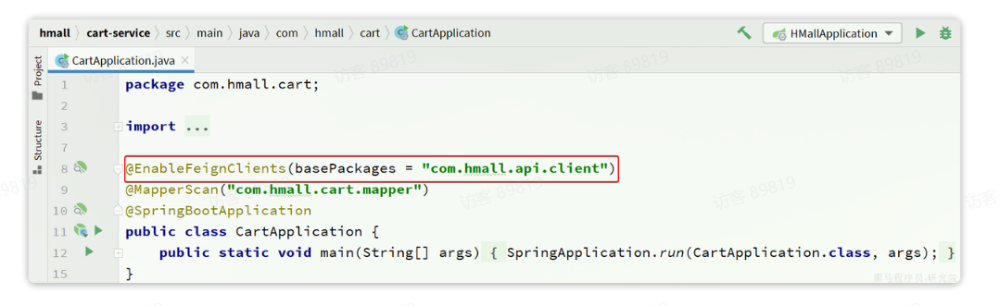

- 方式2：声明要用的FeignClient

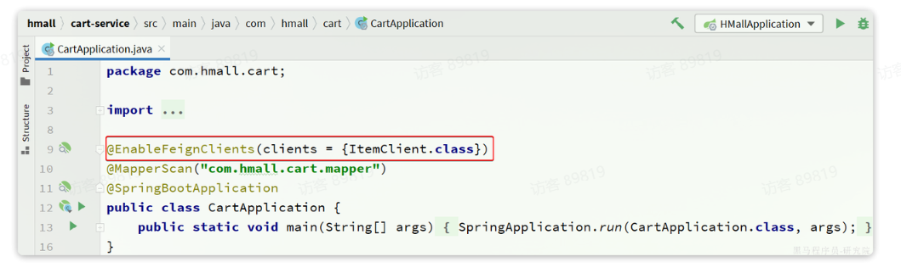

## 4.4.日志配置

OpenFeign只会在FeignClient所在包的日志级别为**DEBUG**时，才会输出日志。而且其日志级别有4级：

- **NONE**：不记录任何日志信息，这是默认值。
- **BASIC**：仅记录请求的方法，URL以及响应状态码和执行时间
- **HEADERS**：在BASIC的基础上，额外记录了请求和响应的头信息
- **FULL**：记录所有请求和响应的明细，包括头信息、请求体、元数据。

Feign默认的日志级别就是NONE，所以默认我们看不到请求日志。

### 4.4.1.定义日志级别

在hm-api模块下新建一个配置类，定义Feign的日志级别：


代码如下：

```Java
package com.hmall.api.config;

import feign.Logger;
import org.springframework.context.annotation.Bean;

public class DefaultFeignConfig {
    @Bean
    public Logger.Level feignLogLevel(){
        return Logger.Level.FULL;
    }
}
```

### 4.4.2.配置

接下来，要让日志级别生效，还需要配置这个类。有两种方式：

- **局部**生效：在某个`FeignClient`中配置，只对当前`FeignClient`生效

```Java
@FeignClient(value = "item-service", configuration = DefaultFeignConfig.class)
```

- **全局**生效：在`@EnableFeignClients`中配置，针对所有`FeignClient`生效。

```Java
@EnableFeignClients(defaultConfiguration = DefaultFeignConfig.class)
```

日志输出再配置的文件中

日志格式：

```Plain
17:35:32:148 DEBUG 18620 --- [nio-8082-exec-1] com.hmall.api.client.ItemClient          : [ItemClient#queryItemByIds] ---> GET http://item-service/items?ids=100000006163 HTTP/1.1
17:35:32:148 DEBUG 18620 --- [nio-8082-exec-1] com.hmall.api.client.ItemClient          : [ItemClient#queryItemByIds] ---> END HTTP (0-byte body)
17:35:32:278 DEBUG 18620 --- [nio-8082-exec-1] com.hmall.api.client.ItemClient          : [ItemClient#queryItemByIds] <--- HTTP/1.1 200  (127ms)
17:35:32:279 DEBUG 18620 --- [nio-8082-exec-1] com.hmall.api.client.ItemClient          : [ItemClient#queryItemByIds] connection: keep-alive
17:35:32:279 DEBUG 18620 --- [nio-8082-exec-1] com.hmall.api.client.ItemClient          : [ItemClient#queryItemByIds] content-type: application/json
17:35:32:279 DEBUG 18620 --- [nio-8082-exec-1] com.hmall.api.client.ItemClient          : [ItemClient#queryItemByIds] date: Fri, 26 May 2023 09:35:32 GMT
17:35:32:279 DEBUG 18620 --- [nio-8082-exec-1] com.hmall.api.client.ItemClient          : [ItemClient#queryItemByIds] keep-alive: timeout=60
17:35:32:279 DEBUG 18620 --- [nio-8082-exec-1] com.hmall.api.client.ItemClient          : [ItemClient#queryItemByIds] transfer-encoding: chunked
17:35:32:279 DEBUG 18620 --- [nio-8082-exec-1] com.hmall.api.client.ItemClient          : [ItemClient#queryItemByIds] 
17:35:32:280 DEBUG 18620 --- [nio-8082-exec-1] com.hmall.api.client.ItemClient          : [ItemClient#queryItemByIds] [{"id":100000006163,"name":"巴布豆(BOBDOG)柔薄悦动婴儿拉拉裤XXL码80片(15kg以上)","price":67100,"stock":10000,"image":"https://m.360buyimg.com/mobilecms/s720x720_jfs/t23998/350/2363990466/222391/a6e9581d/5b7cba5bN0c18fb4f.jpg!q70.jpg.webp","category":"拉拉裤","brand":"巴布豆","spec":"{}","sold":11,"commentCount":33343434,"isAD":false,"status":2}]
17:35:32:281 DEBUG 18620 --- [nio-8082-exec-1] com.hmall.api.client.ItemClient          : [ItemClient#queryItemByIds] <--- END HTTP (369-byte body)
```

# 5.作业

## 5.1.拆分微服务

将hm-service中的其它业务也都拆分为微服务，包括：

- user-service：用户微服务，包含用户登录、管理等功能
- trade-service：交易微服务，包含订单相关功能
- pay-service：支付微服务，包含支付相关功能

其中交易服务、支付服务、用户服务中的业务都需要知道当前登录用户是谁，目前暂未实现，先将用户id写死。

**思考**：如何才能在每个微服务中都拿到用户信息？如何在微服务之间传递用户信息？

## 5.2.定义FeignClient

在上述业务中，包含大量的微服务调用，将被调用的接口全部定义为FeignClient，将其与对应的DTO放在hm-api模块

## 5.3.将微服务与前端联调

课前资料提供了一个`hmall-nginx`目录，其中包含了Nginx以及我们的前端代码：

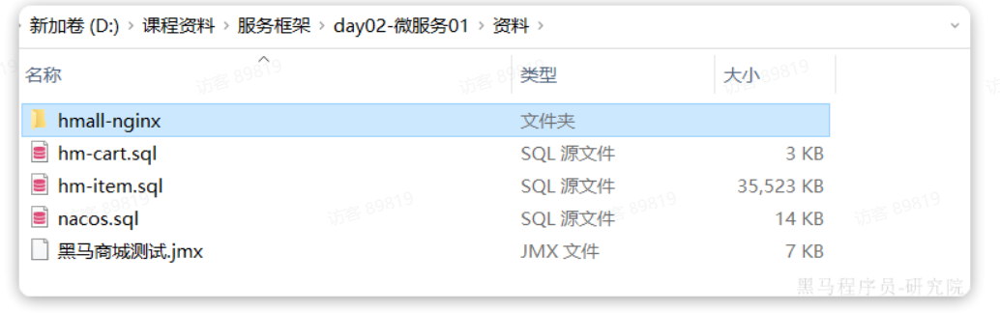

将其拷贝到一个不包含中文、空格、特殊字符的目录，启动后即可访问到页面：

- 18080是用户端页面
- 18081是管理端页面

之前`nginx`内部会将发向服务端请求全部代理到8080端口，但是现在拆分了N个微服务，8080不可用了。请通过`Nginx`配置，完成对不同微服务的反向代理。

**认真思考这种方式存在哪些问题**，**有什么好的解决方案**？


#  (2)网关 router 和 配置管理


在昨天的作业中，我们将黑马商城拆分为5个微服务：

- 用户服务
- 商品服务
- 购物车服务
- 交易服务
- 支付服务 

由于每个微服务都有不同的地址或端口，入口不同，相信大家在与前端联调的时候发现了一些问题：

- 请求不同数据时要访问不同的入口，需要维护多个入口地址，麻烦
- 前端无法调用nacos，无法实时更新服务列表

单体架构时我们只需要完成一次用户登录、身份校验，就可以在所有业务中获取到用户信息。而微服务拆分后，每个微服务都独立部署，这就存在一些问题：

- 每个微服务都需要编写登录校验、用户信息获取的功能吗？
- 当微服务之间调用时，该如何传递用户信息？

不要着急，这些问题都可以在今天的学习中找到答案，我们会通过**网关**技术解决上述问题。今天的内容会分为3章：

- 第一章：网关路由，解决前端请求入口的问题。
- 第二章：网关鉴权，解决统一登录校验和用户信息获取的问题。
- 第三章：统一配置管理，解决微服务的配置文件重复和配置热更新问题。

通过今天的学习你将掌握下列能力：

- 会利用微服务网关做请求路由
- 会利用微服务网关做登录身份校验
- 会利用Nacos实现统一配置管理
- 会利用Nacos实现配置热更新

好了，接下来我们就一起进入今天的学习吧。


# 1.网关路由

## 1.1.认识网关

什么是网关？

顾明思议，网关就是**网**络的**关**口。数据在网络间传输，从一个网络传输到另一网络时就需要经过网关来做数据的**路由和转发以及数据安全的校验**。

更通俗的来讲，网关就像是以前园区传达室的大爷。

- 外面的人要想进入园区，必须经过大爷的认可，如果你是不怀好意的人，肯定被直接拦截。
- 外面的人要传话或送信，要找大爷。大爷帮你带给目标人。


现在，微服务网关就起到同样的作用。前端请求不能直接访问微服务，而是要请求网关：

- 网关可以做安全控制，也就是登录身份校验，校验通过才放行
- 通过认证后，网关再根据请求判断应该访问哪个微服务，将请求转发过去


在SpringCloud当中，提供了两种网关实现方案：

- Netflix Zuul：早期实现，目前已经淘汰
- SpringCloudGateway：基于Spring的WebFlux技术，完全支持响应式编程，吞吐能力更强

课堂中我们以SpringCloudGateway为例来讲解，官方网站：

https://spring.io/projects/spring-cloud-gateway#learn

## 1.2.快速入门

接下来，我们先看下如何利用网关实现请求路由。由于网关本身也是一个独立的微服务，因此也需要创建一个模块开发功能。大概步骤如下：

- 创建网关微服务
- 引入SpringCloudGateway、NacosDiscovery依赖
- 编写启动类
- 配置网关路由

### 1.2.1.创建项目

首先，我们要在hmall下创建一个新的module，命名为hm-gateway，作为网关微服务：


### 1.2.2.引入依赖

在`hm-gateway`模块的`pom.xml`文件中引入依赖：

```XML
<?xml version="1.0" encoding="UTF-8"?>
<project xmlns="http://maven.apache.org/POM/4.0.0"
         xmlns:xsi="http://www.w3.org/2001/XMLSchema-instance"
         xsi:schemaLocation="http://maven.apache.org/POM/4.0.0 http://maven.apache.org/xsd/maven-4.0.0.xsd">
    <parent>
        <artifactId>hmall</artifactId>
        <groupId>com.heima</groupId>
        <version>1.0.0</version>
    </parent>
    <modelVersion>4.0.0</modelVersion>

    <artifactId>hm-gateway</artifactId>

    <properties>
        <maven.compiler.source>11</maven.compiler.source>
        <maven.compiler.target>11</maven.compiler.target>
    </properties>
    <dependencies>
        <!--common-->
        <dependency>
            <groupId>com.heima</groupId>
            <artifactId>hm-common</artifactId>
            <version>1.0.0</version>
        </dependency>
        <!--网关-->
        <dependency>
            <groupId>org.springframework.cloud</groupId>
            <artifactId>spring-cloud-starter-gateway</artifactId>
        </dependency>
        <!--nacos discovery-->
        <dependency>
            <groupId>com.alibaba.cloud</groupId>
            <artifactId>spring-cloud-starter-alibaba-nacos-discovery</artifactId>
        </dependency>
        <!--负载均衡-->
        <dependency>
            <groupId>org.springframework.cloud</groupId>
            <artifactId>spring-cloud-starter-loadbalancer</artifactId>
        </dependency>
    </dependencies>
    <build>
        <finalName>${project.artifactId}</finalName>
        <plugins>
            <plugin>
                <groupId>org.springframework.boot</groupId>
                <artifactId>spring-boot-maven-plugin</artifactId>
            </plugin>
        </plugins>
    </build>
</project>
```

### 1.2.3.启动类

在`hm-gateway`模块的`com.hmall.gateway`包下新建一个启动类：

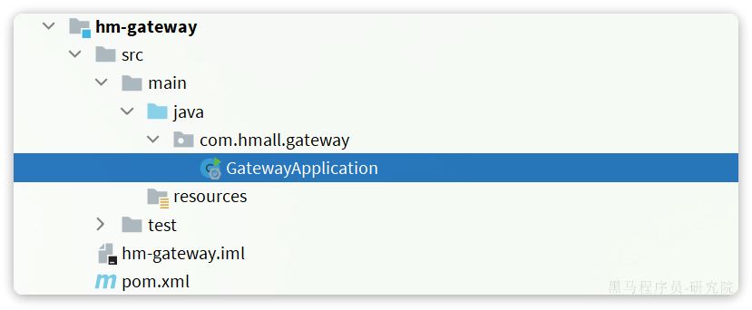

代码如下：

```Java
package com.hmall.gateway;

import org.springframework.boot.SpringApplication;
import org.springframework.boot.autoconfigure.SpringBootApplication;

@SpringBootApplication
public class GatewayApplication {
    public static void main(String[] args) {
        SpringApplication.run(GatewayApplication.class, args);
    }
}
```

### 1.2.4.配置路由

接下来，在`hm-gateway`模块的`resources`目录新建一个`application.yaml`文件，内容如下：

```YAML
server:
  port: 8080
spring:
  application:
    name: gateway
  cloud:
    nacos:
      server-addr: 192.168.150.101:8848
    gateway:
      routes:
        - id: item # 路由规则id，自定义，唯一
          uri: lb://item-service # 路由的目标服务，lb代表负载均衡，会从注册中心拉取服务列表
          predicates: # 路由断言，判断当前请求是否符合当前规则，符合则路由到目标服务
            - Path=/items/**,/search/** # 这里是以请求路径作为判断规则
        - id: cart
          uri: lb://cart-service
          predicates:
            - Path=/carts/**
        - id: user
          uri: lb://user-service
          predicates:
            - Path=/users/**,/addresses/**
        - id: trade
          uri: lb://trade-service
          predicates:
            - Path=/orders/**
        - id: pay
          uri: lb://pay-service
          predicates:
            - Path=/pay-orders/**
```

### 1.2.5.测试

启动GatewayApplication，以 http://localhost:8080 拼接微服务接口路径来测试。例如：

http://localhost:8080/items/page?pageNo=1&pageSize=1

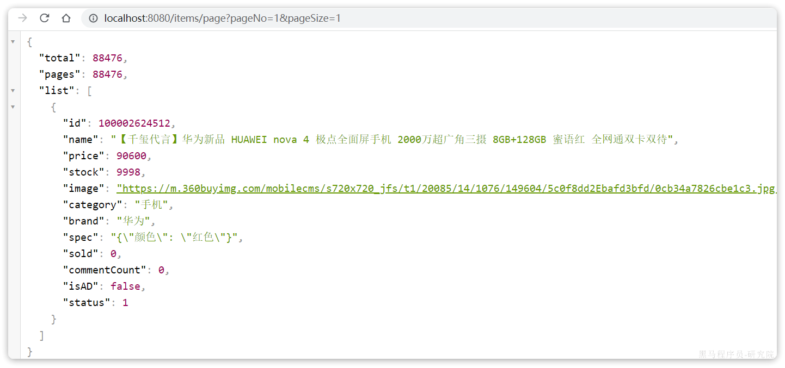

此时，启动UserApplication、CartApplication，然后打开前端页面，发现相关功能都可以正常访问了：

## 1.3.路由过滤

路由规则的定义语法如下：

```YAML
spring:
  cloud:
    gateway:
      routes:
        - id: item
          uri: lb://item-service
          predicates:
            - Path=/items/**,/search/**
```

其中routes对应的类型如下：


是一个集合，也就是说可以定义很多路由规则。集合中的`RouteDefinition`就是具体的路由规则定义，其中常见的属性如下：


四个属性含义如下：

- `id`：路由的唯一标示
- `predicates`：路由断言，其实就是匹配条件
- `filters`：路由过滤条件，后面讲
- `uri`：路由目标地址，`lb://`代表负载均衡，从注册中心获取目标微服务的实例列表，并且负载均衡选择一个访问。

这里我们重点关注`predicates`，也就是路由断言。SpringCloudGateway中支持的断言类型有很多：

| **名称**   | **说明**                       | **示例**                                                     |
| :--------- | :----------------------------- | :----------------------------------------------------------- |
| After      | 是某个时间点后的请求           | - After=2037-01-20T17:42:47.789-07:00[America/Denver]        |
| Before     | 是某个时间点之前的请求         | - Before=2031-04-13T15:14:47.433+08:00[Asia/Shanghai]        |
| Between    | 是某两个时间点之前的请求       | - Between=2037-01-20T17:42:47.789-07:00[America/Denver], 2037-01-21T17:42:47.789-07:00[America/Denver] |
| Cookie     | 请求必须包含某些cookie         | - Cookie=chocolate, ch.p                                     |
| Header     | 请求必须包含某些header         | - Header=X-Request-Id, \d+                                   |
| Host       | 请求必须是访问某个host（域名） | - Host=**.somehost.org,**.anotherhost.org                    |
| Method     | 请求方式必须是指定方式         | - Method=GET,POST                                            |
| Path       | 请求路径必须符合指定规则       | - Path=/red/{segment},/blue/**                               |
| Query      | 请求参数必须包含指定参数       | - Query=name, Jack或者- Query=name                           |
| RemoteAddr | 请求者的ip必须是指定范围       | - RemoteAddr=192.168.1.1/24                                  |
| weight     | 权重处理                       |                                                              |

# 2.网关登录校验

单体架构时我们只需要完成一次用户登录、身份校验，就可以在所有业务中获取到用户信息。而微服务拆分后，每个微服务都独立部署，不再共享数据。也就意味着每个微服务都需要做登录校验，这显然不可取。

## 2.1.鉴权思路分析

我们的登录是基于JWT来实现的，校验JWT的算法复杂，而且需要用到秘钥。如果每个微服务都去做登录校验，这就存在着两大问题：

- 每个微服务都需要知道JWT的秘钥，不安全
- 每个微服务重复编写登录校验代码、权限校验代码，麻烦

既然网关是所有微服务的入口，一切请求都需要先经过网关。我们完全可以把登录校验的工作放到网关去做，这样之前说的问题就解决了：

- 只需要在网关和用户服务保存秘钥
- 只需要在网关开发登录校验功能

此时，登录校验的流程如图：

暂时无法在飞书文档外展示此内容

不过，这里存在几个问题：

- 网关路由是配置的，请求转发是Gateway内部代码，我们如何在转发之前做登录校验？
- 网关校验JWT之后，如何将用户信息传递给微服务？
- 微服务之间也会相互调用，这种调用不经过网关，又该如何传递用户信息？

这些问题将在接下来几节一一解决。

## 2.2.网关过滤器

登录校验必须在请求转发到微服务之前做，否则就失去了意义。而网关的请求转发是`Gateway`内部代码实现的，要想在请求转发之前做登录校验，就必须了解`Gateway`内部工作的基本原理。

暂时无法在飞书文档外展示此内容

如图所示：

1. 客户端请求进入网关后由`HandlerMapping`对请求做判断，找到与当前请求匹配的路由规则（**`Route`**），然后将请求交给`WebHandler`去处理。
2. `WebHandler`则会加载当前路由下需要执行的过滤器链（**`Filter chain`**），然后按照顺序逐一执行过滤器（后面称为**`Filter`**）。
3. 图中`Filter`被虚线分为左右两部分，是因为`Filter`内部的逻辑分为`pre`和`post`两部分，分别会在请求路由到微服务**之前**和**之后**被执行。
4. 只有所有`Filter`的`pre`逻辑都依次顺序执行通过后，请求才会被路由到微服务。
5. 微服务返回结果后，再倒序执行`Filter`的`post`逻辑。
6. 最终把响应结果返回。

如图中所示，最终请求转发是有一个名为`NettyRoutingFilter`的过滤器来执行的，而且这个过滤器是整个过滤器链中顺序最靠后的一个。**如果我们能够定义一个过滤器，在其中实现登录校验逻辑，并且将过滤器执行顺序定义到****`NettyRoutingFilter`****之前**，这就符合我们的需求了！

那么，该如何实现一个网关过滤器呢？

网关过滤器链中的过滤器有两种：

- **`GatewayFilter`**：路由过滤器，作用范围比较灵活，可以是任意指定的路由`Route`. 
- **`GlobalFilter`**：全局过滤器，作用范围是所有路由，不可配置。

**注意**：过滤器链之外还有一种过滤器，HttpHeadersFilter，用来处理传递到下游微服务的请求头。例如org.springframework.cloud.gateway.filter.headers.XForwardedHeadersFilter可以传递代理请求原本的host头到下游微服务。

其实`GatewayFilter`和`GlobalFilter`这两种过滤器的方法签名完全一致：

```Java
/**
 * 处理请求并将其传递给下一个过滤器
 * @param exchange 当前请求的上下文，其中包含request、response等各种数据
 * @param chain 过滤器链，基于它向下传递请求
 * @return 根据返回值标记当前请求是否被完成或拦截，chain.filter(exchange)就放行了。
 */
Mono<Void> filter(ServerWebExchange exchange, GatewayFilterChain chain);
```

`FilteringWebHandler`在处理请求时，会将`GlobalFilter`装饰为`GatewayFilter`，然后放到同一个过滤器链中，排序以后依次执行。

`Gateway`中内置了很多的`GatewayFilter`，详情可以参考官方文档：

https://docs.spring.io/spring-cloud-gateway/docs/3.1.7/reference/html/#gatewayfilter-factories

`Gateway`内置的`GatewayFilter`过滤器使用起来非常简单，无需编码，只要在yaml文件中简单配置即可。而且其作用范围也很灵活，配置在哪个`Route`下，就作用于哪个`Route`.

例如，有一个过滤器叫做`AddRequestHeaderGatewayFilterFacotry`，顾明思议，就是添加请求头的过滤器，可以给请求添加一个请求头并传递到下游微服务。

使用的使用只需要在application.yaml中这样配置：

```YAML
spring:
  cloud:
    gateway:
      routes:
      - id: test_route
        uri: lb://test-service
        predicates:
          -Path=/test/**
        filters:
          - AddRequestHeader=key, value # 逗号之前是请求头的key，逗号之后是value
```

如果想要让过滤器作用于所有的路由，则可以这样配置：

```YAML
spring:
  cloud:
    gateway:
      default-filters: # default-filters下的过滤器可以作用于所有路由
        - AddRequestHeader=key, value
      routes:
      - id: test_route
        uri: lb://test-service
        predicates:
          -Path=/test/**
```

## 2.3.自定义过滤器

无论是`GatewayFilter`还是`GlobalFilter`都支持自定义，只不过**编码**方式、**使用**方式略有差别。

### 2.3.1.自定义GatewayFilter

自定义`GatewayFilter`不是直接实现`GatewayFilter`，而是实现`AbstractGatewayFilterFactory`。最简单的方式是这样的：

```Java
@Component
public class PrintAnyGatewayFilterFactory extends AbstractGatewayFilterFactory<Object> {
    @Override
    public GatewayFilter apply(Object config) {
        return new GatewayFilter() {
            @Override
            public Mono<Void> filter(ServerWebExchange exchange, GatewayFilterChain chain) {
                // 获取请求
                ServerHttpRequest request = exchange.getRequest();
                // 编写过滤器逻辑
                System.out.println("过滤器执行了");
                // 放行
                return chain.filter(exchange);
            }
        };
    }
}
```

**注意**：该类的名称一定要以`GatewayFilterFactory`为后缀！

然后在yaml配置中这样使用：

```YAML
spring:
  cloud:
    gateway:
      default-filters:
            - PrintAny # 此处直接以自定义的GatewayFilterFactory类名称前缀类声明过滤器
```

另外，这种过滤器还可以支持动态配置参数，不过实现起来比较复杂，示例：

```Java
@Component
public class PrintAnyGatewayFilterFactory // 父类泛型是内部类的Config类型
                extends AbstractGatewayFilterFactory<PrintAnyGatewayFilterFactory.Config> {

    @Override
    public GatewayFilter apply(Config config) {
        // OrderedGatewayFilter是GatewayFilter的子类，包含两个参数：
        // - GatewayFilter：过滤器
        // - int order值：值越小，过滤器执行优先级越高
        return new OrderedGatewayFilter(new GatewayFilter() {
            @Override
            public Mono<Void> filter(ServerWebExchange exchange, GatewayFilterChain chain) {
                // 获取config值
                String a = config.getA();
                String b = config.getB();
                String c = config.getC();
                // 编写过滤器逻辑
                System.out.println("a = " + a);
                System.out.println("b = " + b);
                System.out.println("c = " + c);
                // 放行
                return chain.filter(exchange);
            }
        }, 100);
    }

    // 自定义配置属性，成员变量名称很重要，下面会用到
    @Data
    static class Config{
        private String a;
        private String b;
        private String c;
    }
    // 将变量名称依次返回，顺序很重要，将来读取参数时需要按顺序获取
    @Override
    public List<String> shortcutFieldOrder() {
        return List.of("a", "b", "c");
    }
        // 返回当前配置类的类型，也就是内部的Config
    @Override
    public Class<Config> getConfigClass() {
        return Config.class;
    }

}
```

然后在yaml文件中使用：

```YAML
spring:
  cloud:
    gateway:
      default-filters:
            - PrintAny=1,2,3 # 注意，这里多个参数以","隔开，将来会按照shortcutFieldOrder()方法返回的参数顺序依次复制
```

上面这种配置方式参数必须严格按照shortcutFieldOrder()方法的返回参数名顺序来赋值。

还有一种用法，无需按照这个顺序，就是手动指定参数名：

```YAML
spring:
  cloud:
    gateway:
      default-filters:
            - name: PrintAny
              args: # 手动指定参数名，无需按照参数顺序
                a: 1
                b: 2
                c: 3
```

### 2.3.2.自定义GlobalFilter

自定义GlobalFilter则简单很多，直接实现GlobalFilter即可，而且也无法设置动态参数：

```Java
@Component
public class PrintAnyGlobalFilter implements GlobalFilter, Ordered {
    @Override
    public Mono<Void> filter(ServerWebExchange exchange, GatewayFilterChain chain) {
        // 编写过滤器逻辑
        System.out.println("未登录，无法访问");
        // 放行
        // return chain.filter(exchange);

        // 拦截
        ServerHttpResponse response = exchange.getResponse();
        response.setRawStatusCode(401);
        return response.setComplete();
    }

    @Override
    public int getOrder() {
        // 过滤器执行顺序，值越小，优先级越高
        return 0;
    }
}
```

## 2.4.登录校验

接下来，我们就利用自定义`GlobalFilter`来完成登录校验。

### 2.4.1.JWT工具

登录校验需要用到JWT，而且JWT的加密需要秘钥和加密工具。这些在`hm-service`中已经有了，我们直接拷贝过来：


具体作用如下：

- `AuthProperties`：配置登录校验需要拦截的路径，因为不是所有的路径都需要登录才能访问
- `JwtProperties`：定义与JWT工具有关的属性，比如秘钥文件位置
- `SecurityConfig`：工具的自动装配
- `JwtTool`：JWT工具，其中包含了校验和解析`token`的功能
- `hmall.jks`：秘钥文件

其中`AuthProperties`和`JwtProperties`所需的属性要在`application.yaml`中配置：

```YAML
hm:
  jwt:
    location: classpath:hmall.jks # 秘钥地址
    alias: hmall # 秘钥别名
    password: hmall123 # 秘钥文件密码
    tokenTTL: 30m # 登录有效期
  auth:
    excludePaths: # 无需登录校验的路径
      - /search/**
      - /users/login
      - /items/**
```

### 2.4.2.登录校验过滤器

接下来，我们定义一个登录校验的过滤器：


代码如下：

```Java
package com.hmall.gateway.filter;

import com.hmall.common.exception.UnauthorizedException;
import com.hmall.common.utils.CollUtils;
import com.hmall.gateway.config.AuthProperties;
import com.hmall.gateway.util.JwtTool;
import lombok.RequiredArgsConstructor;
import org.springframework.boot.context.properties.EnableConfigurationProperties;
import org.springframework.cloud.gateway.filter.GatewayFilterChain;
import org.springframework.cloud.gateway.filter.GlobalFilter;
import org.springframework.core.Ordered;
import org.springframework.http.server.reactive.ServerHttpRequest;
import org.springframework.http.server.reactive.ServerHttpResponse;
import org.springframework.stereotype.Component;
import org.springframework.util.AntPathMatcher;
import org.springframework.web.server.ServerWebExchange;
import reactor.core.publisher.Mono;

import java.util.List;

@Component
@RequiredArgsConstructor
@EnableConfigurationProperties(AuthProperties.class)
public class AuthGlobalFilter implements GlobalFilter, Ordered {

    private final JwtTool jwtTool;

    private final AuthProperties authProperties;

    private final AntPathMatcher antPathMatcher = new AntPathMatcher();

    @Override
    public Mono<Void> filter(ServerWebExchange exchange, GatewayFilterChain chain) {
        // 1.获取Request
        ServerHttpRequest request = exchange.getRequest();
        // 2.判断是否不需要拦截
        if(isExclude(request.getPath().toString())){
            // 无需拦截，直接放行
            return chain.filter(exchange);
        }
        // 3.获取请求头中的token
        String token = null;
        List<String> headers = request.getHeaders().get("authorization");
        if (!CollUtils.isEmpty(headers)) {
            token = headers.get(0);
        }
        // 4.校验并解析token
        Long userId = null;
        try {
            userId = jwtTool.parseToken(token);
        } catch (UnauthorizedException e) {
            // 如果无效，拦截
            ServerHttpResponse response = exchange.getResponse();
            response.setRawStatusCode(401);
            return response.setComplete();
        }

        // TODO 5.如果有效，传递用户信息
        System.out.println("userId = " + userId);
        // 6.放行
        return chain.filter(exchange);
    }

    private boolean isExclude(String antPath) {
        for (String pathPattern : authProperties.getExcludePaths()) {
            if(antPathMatcher.match(pathPattern, antPath)){
                return true;
            }
        }
        return false;
    }

    @Override
    public int getOrder() {
        return 0;
    }
}
```

重启测试，会发现访问/items开头的路径，未登录状态下不会被拦截：


访问其他路径则，未登录状态下请求会被拦截，并且返回`401`状态码：


## 2.5.微服务获取用户

现在，网关已经可以完成登录校验并获取登录用户身份信息。但是当网关将请求转发到微服务时，微服务又该如何获取用户身份呢？

由于网关发送请求到微服务依然采用的是`Http`请求，因此我们可以将用户信息以请求头的方式传递到下游微服务。然后微服务可以从请求头中获取登录用户信息。考虑到微服务内部可能很多地方都需要用到登录用户信息，因此我们可以利用SpringMVC的拦截器来实现登录用户信息获取，并存入ThreadLocal，方便后续使用。

据图流程图如下：


因此，接下来我们要做的事情有：

- 改造网关过滤器，在获取用户信息后保存到请求头，转发到下游微服务
- 编写微服务拦截器，拦截请求获取用户信息，保存到ThreadLocal后放行

### 2.5.1.保存用户到请求头

首先，我们修改登录校验拦截器的处理逻辑，保存用户信息到请求头中：

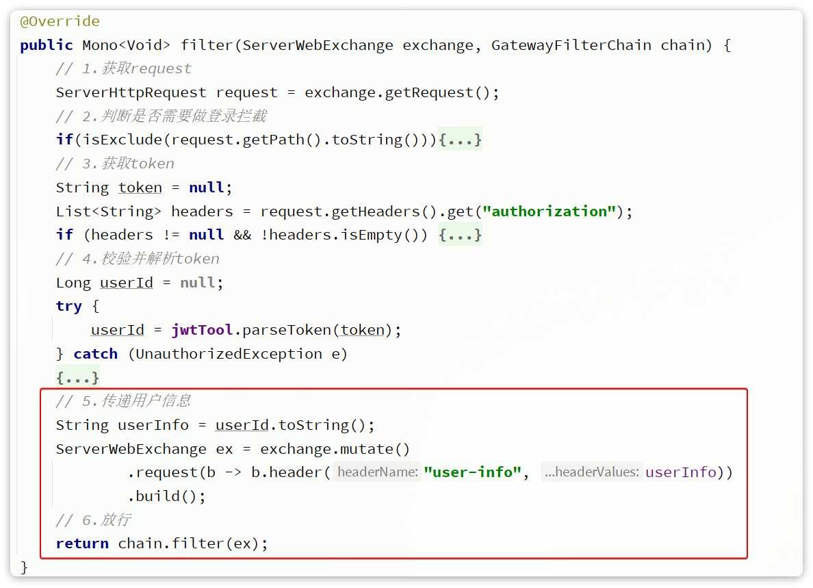

### 2.5.2.拦截器获取用户

在hm-common中已经有一个用于保存登录用户的ThreadLocal工具：


其中已经提供了保存和获取用户的方法：


接下来，我们只需要编写拦截器，获取用户信息并保存到`UserContext`，然后放行即可。

由于每个微服务都有获取登录用户的需求，因此拦截器我们直接写在`hm-common`中，并写好自动装配。这样微服务只需要引入`hm-common`就可以直接具备拦截器功能，无需重复编写。

我们在`hm-common`模块下定义一个拦截器：


具体代码如下：

```Java
package com.hmall.common.interceptor;

import cn.hutool.core.util.StrUtil;
import com.hmall.common.utils.UserContext;
import org.springframework.web.servlet.HandlerInterceptor;

import javax.servlet.http.HttpServletRequest;
import javax.servlet.http.HttpServletResponse;

public class UserInfoInterceptor implements HandlerInterceptor {
    @Override
    public boolean preHandle(HttpServletRequest request, HttpServletResponse response, Object handler) throws Exception {
        // 1.获取请求头中的用户信息
        String userInfo = request.getHeader("user-info");
        // 2.判断是否为空
        if (StrUtil.isNotBlank(userInfo)) {
            // 不为空，保存到ThreadLocal
                UserContext.setUser(Long.valueOf(userInfo));
        }
        // 3.放行
        return true;
    }

    @Override
    public void afterCompletion(HttpServletRequest request, HttpServletResponse response, Object handler, Exception ex) throws Exception {
        // 移除用户
        UserContext.removeUser();
    }
}
```

接着在`hm-common`模块下编写`SpringMVC`的配置类，配置登录拦截器：


具体代码如下：

```Java
package com.hmall.common.config;

import com.hmall.common.interceptors.UserInfoInterceptor;
import org.springframework.boot.autoconfigure.condition.ConditionalOnClass;
import org.springframework.context.annotation.Configuration;
import org.springframework.web.servlet.DispatcherServlet;
import org.springframework.web.servlet.config.annotation.InterceptorRegistry;
import org.springframework.web.servlet.config.annotation.WebMvcConfigurer;

@Configuration
@ConditionalOnClass(DispatcherServlet.class)
public class MvcConfig implements WebMvcConfigurer {
    @Override
    public void addInterceptors(InterceptorRegistry registry) {
        registry.addInterceptor(new UserInfoInterceptor());
    }
}
```

不过，需要注意的是，这个配置类默认是不会生效的，因为它所在的包是`com.hmall.common.config`，与其它微服务的扫描包不一致，无法被扫描到，因此无法生效。

基于SpringBoot的自动装配原理，我们要将其添加到`resources`目录下的`META-INF/spring.factories`文件中：


内容如下：

```Properties
org.springframework.boot.autoconfigure.EnableAutoConfiguration=\
  com.hmall.common.config.MyBatisConfig,\
  com.hmall.common.config.MvcConfig
```

### 2.5.3.恢复购物车代码

之前我们无法获取登录用户，所以把购物车服务的登录用户写死了，现在需要恢复到原来的样子。

找到`cart-service`模块的`com.hmall.cart.service.impl.CartServiceImpl`：


修改其中的`queryMyCarts`方法：


## 2.6.OpenFeign传递用户

前端发起的请求都会经过网关再到微服务，由于我们之前编写的过滤器和拦截器功能，微服务可以轻松获取登录用户信息。

但有些业务是比较复杂的，请求到达微服务后还需要调用其它多个微服务。比如下单业务，流程如下：


下单的过程中，需要调用商品服务扣减库存，调用购物车服务清理用户购物车。而清理购物车时必须知道当前登录的用户身份。但是，**订单服务调用购物车时并没有传递用户信息**，购物车服务无法知道当前用户是谁！

由于微服务获取用户信息是通过拦截器在请求头中读取，因此要想实现微服务之间的用户信息传递，就**必须在微服务发起调用时把用户信息存入请求头**。

微服务之间调用是基于OpenFeign来实现的，并不是我们自己发送的请求。我们如何才能让每一个由OpenFeign发起的请求自动携带登录用户信息呢？

这里要借助Feign中提供的一个拦截器接口：`feign.RequestInterceptor`

```Java
public interface RequestInterceptor {

  /**
   * Called for every request. 
   * Add data using methods on the supplied {@link RequestTemplate}.
   */
  void apply(RequestTemplate template);
}
```

我们只需要实现这个接口，然后实现apply方法，利用`RequestTemplate`类来添加请求头，将用户信息保存到请求头中。这样以来，每次OpenFeign发起请求的时候都会调用该方法，传递用户信息。

由于`FeignClient`全部都是在`hm-api`模块，因此我们在`hm-api`模块的`com.hmall.api.config.DefaultFeignConfig`中编写这个拦截器：


在`com.hmall.api.config.DefaultFeignConfig`中添加一个Bean：

```Java
@Bean
public RequestInterceptor userInfoRequestInterceptor(){
    return new RequestInterceptor() {
        @Override
        public void apply(RequestTemplate template) {
            // 获取登录用户
            Long userId = UserContext.getUser();
            if(userId == null) {
                // 如果为空则直接跳过
                return;
            }
            // 如果不为空则放入请求头中，传递给下游微服务
            template.header("user-info", userId.toString());
        }
    };
}
```

好了，现在微服务之间通过OpenFeign调用时也会传递登录用户信息了。

# 3.配置管理

到目前为止我们已经解决了微服务相关的几个问题：

- 微服务远程调用
- 微服务注册、发现
- 微服务请求路由、负载均衡
- 微服务登录用户信息传递

不过，现在依然还有几个问题需要解决：

- 网关路由在配置文件中写死了，如果变更必须重启微服务
- 某些业务配置在配置文件中写死了，每次修改都要重启服务
- 每个微服务都有很多重复的配置，维护成本高

这些问题都可以通过统一的**配置管理器服务**解决。而Nacos不仅仅具备注册中心功能，也具备配置管理的功能：


微服务共享的配置可以统一交给Nacos保存和管理，在Nacos控制台修改配置后，Nacos会将配置变更推送给相关的微服务，并且无需重启即可生效，实现配置热更新。

网关的路由同样是配置，因此同样可以基于这个功能实现动态路由功能，无需重启网关即可修改路由配置。

## 3.1.配置共享

我们可以把微服务共享的配置抽取到Nacos中统一管理，这样就不需要每个微服务都重复配置了。分为两步：

- 在Nacos中添加共享配置
- 微服务拉取配置

### 3.1.1.添加共享配置

以cart-service为例，我们看看有哪些配置是重复的，可以抽取的：

首先是jdbc相关配置：


然后是日志配置：


然后是swagger以及OpenFeign的配置：


我们在nacos控制台分别添加这些配置。

首先是jdbc相关配置，在`配置管理`->`配置列表`中点击`+`新建一个配置：


在弹出的表单中填写信息：


其中详细的配置如下：

```YAML
spring:
  datasource:
    url: jdbc:mysql://${hm.db.host:192.168.150.101}:${hm.db.port:3306}/${hm.db.database}?useUnicode=true&characterEncoding=UTF-8&autoReconnect=true&serverTimezone=Asia/Shanghai
    driver-class-name: com.mysql.cj.jdbc.Driver
    username: ${hm.db.un:root}
    password: ${hm.db.pw:123}
mybatis-plus:
  configuration:
    default-enum-type-handler: com.baomidou.mybatisplus.core.handlers.MybatisEnumTypeHandler
  global-config:
    db-config:
      update-strategy: not_null
      id-type: auto
```

注意这里的jdbc的相关参数并没有写死，例如：

- `数据库ip`：通过`${hm.db.host:192.168.150.101}`配置了默认值为`192.168.150.101`，同时允许通过`${hm.db.host}`来覆盖默认值
- `数据库端口`：通过`${hm.db.port:3306}`配置了默认值为`3306`，同时允许通过`${hm.db.port}`来覆盖默认值
- `数据库database`：可以通过`${hm.db.database}`来设定，无默认值

然后是统一的日志配置，命名为`shared-log.yaml`，配置内容如下：

```YAML
logging:
  level:
    com.hmall: debug
  pattern:
    dateformat: HH:mm:ss:SSS
  file:
    path: "logs/${spring.application.name}"
```

然后是统一的swagger配置，命名为`shared-swagger.yaml`，配置内容如下：

```YAML
knife4j:
  enable: true
  openapi:
    title: ${hm.swagger.title:黑马商城接口文档}
    description: ${hm.swagger.description:黑马商城接口文档}
    email: ${hm.swagger.email:zhanghuyi@itcast.cn}
    concat: ${hm.swagger.concat:虎哥}
    url: https://www.itcast.cn
    version: v1.0.0
    group:
      default:
        group-name: default
        api-rule: package
        api-rule-resources:
          - ${hm.swagger.package}
```

注意，这里的swagger相关配置我们没有写死，例如：

- `title`：接口文档标题，我们用了`${hm.swagger.title}`来代替，将来可以有用户手动指定
- `email`：联系人邮箱，我们用了`${hm.swagger.email:``zhanghuyi@itcast.cn``}`，默认值是`zhanghuyi@itcast.cn`，同时允许用户利用`${hm.swagger.email}`来覆盖。

### 3.1.2.拉取共享配置

接下来，我们要在微服务拉取共享配置。将拉取到的共享配置与本地的`application.yaml`配置合并，完成项目上下文的初始化。

不过，需要注意的是，读取Nacos配置是SpringCloud上下文（`ApplicationContext`）初始化时处理的，发生在项目的引导阶段。然后才会初始化SpringBoot上下文，去读取`application.yaml`。

也就是说引导阶段，`application.yaml`文件尚未读取，根本不知道nacos 地址，该如何去加载nacos中的配置文件呢？

SpringCloud在初始化上下文的时候会先读取一个名为`bootstrap.yaml`(或者`bootstrap.properties`)的文件，如果我们将nacos地址配置到`bootstrap.yaml`中，那么在项目引导阶段就可以读取nacos中的配置了。


因此，微服务整合Nacos配置管理的步骤如下：

1）引入依赖：

在cart-service模块引入依赖：

```XML
  <!--nacos配置管理-->
  <dependency>
      <groupId>com.alibaba.cloud</groupId>
      <artifactId>spring-cloud-starter-alibaba-nacos-config</artifactId>
  </dependency>
  <!--读取bootstrap文件-->
  <dependency>
      <groupId>org.springframework.cloud</groupId>
      <artifactId>spring-cloud-starter-bootstrap</artifactId>
  </dependency>
```

2）新建bootstrap.yaml

在cart-service中的resources目录新建一个bootstrap.yaml文件：


内容如下：

```YAML
spring:
  application:
    name: cart-service # 服务名称
  profiles:
    active: dev
  cloud:
    nacos:
      server-addr: 192.168.150.101 # nacos地址
      config:
        file-extension: yaml # 文件后缀名
        shared-configs: # 共享配置
          - dataId: shared-jdbc.yaml # 共享mybatis配置
          - dataId: shared-log.yaml # 共享日志配置
          - dataId: shared-swagger.yaml # 共享日志配置
```

3）修改application.yaml

由于一些配置挪到了bootstrap.yaml，因此application.yaml需要修改为：

```YAML
server:
  port: 8082
feign:
  okhttp:
    enabled: true # 开启OKHttp连接池支持
hm:
  swagger:
    title: 购物车服务接口文档
    package: com.hmall.cart.controller
  db:
    database: hm-cart
```

重启服务，发现所有配置都生效了。

## 3.2.配置热更新

有很多的业务相关参数，将来可能会根据实际情况临时调整。例如购物车业务，购物车数量有一个上限，默认是10，对应代码如下：


现在这里购物车是写死的固定值，我们应该将其配置在配置文件中，方便后期修改。

但现在的问题是，即便写在配置文件中，修改了配置还是需要重新打包、重启服务才能生效。能不能不用重启，直接生效呢？

这就要用到Nacos的配置热更新能力了，分为两步：

- 在Nacos中添加配置
- 在微服务读取配置

### 3.2.1.添加配置到Nacos

首先，我们在nacos中添加一个配置文件，将购物车的上限数量添加到配置中：


注意文件的dataId格式：

```Plain
[服务名]-[spring.active.profile].[后缀名]
```

文件名称由三部分组成：

- **`服务名`**：我们是购物车服务，所以是`cart-service`
- **`spring.active.profile`**：就是spring boot中的`spring.active.profile`，可以省略，则所有profile共享该配置
- **`后缀名`**：例如yaml

这里我们直接使用`cart-service.yaml`这个名称，则不管是dev还是local环境都可以共享该配置。

配置内容如下：

```YAML
hm:
  cart:
    maxAmount: 1 # 购物车商品数量上限
```

提交配置，在控制台能看到新添加的配置：

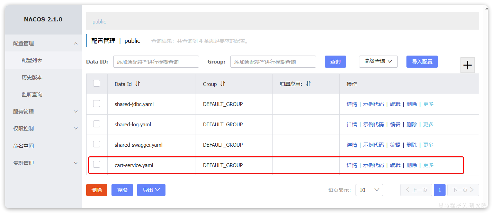

### 3.2.2.配置热更新

接着，我们在微服务中读取配置，实现配置热更新。

在`cart-service`中新建一个属性读取类：


代码如下：

```Java
package com.hmall.cart.config;

import lombok.Data;
import org.springframework.boot.context.properties.ConfigurationProperties;
import org.springframework.stereotype.Component;

@Data
@Component
@ConfigurationProperties(prefix = "hm.cart")
public class CartProperties {
    private Integer maxAmount;
}
```

接着，在业务中使用该属性加载类：

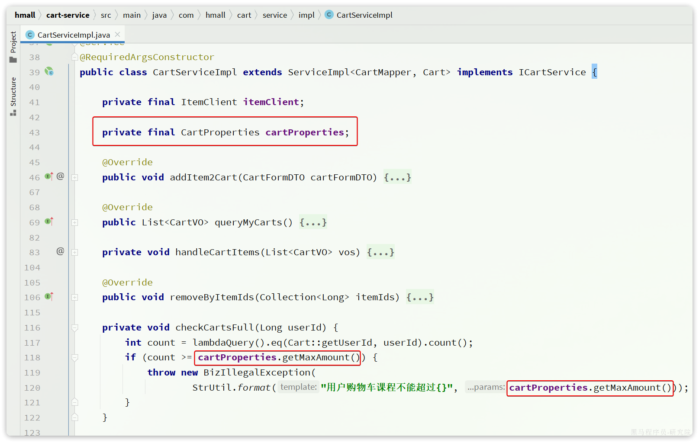

测试，向购物车中添加多个商品：

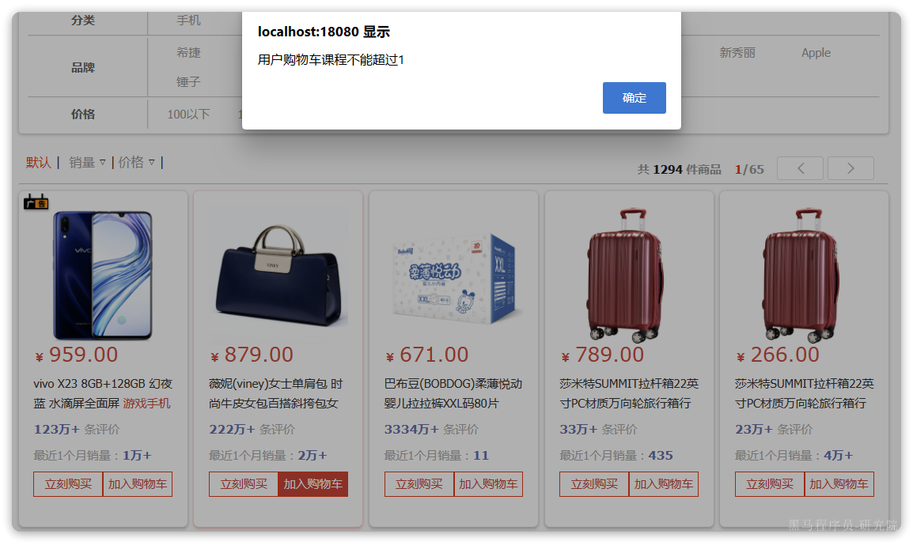

我们在nacos控制台，将购物车上限配置为5：


无需重启，再次测试购物车功能：


加入成功！

无需重启服务，配置热更新就生效了！

## 3.3.动态路由

网关的路由配置全部是在项目启动时由`org.springframework.cloud.gateway.route.CompositeRouteDefinitionLocator`在项目启动的时候加载，并且一经加载就会缓存到内存中的路由表内（一个Map），不会改变。也不会监听路由变更，所以，我们无法利用上节课学习的配置热更新来实现路由更新。

因此，我们必须监听Nacos的配置变更，然后手动把最新的路由更新到路由表中。这里有两个难点：

- 如何监听Nacos配置变更？
- 如何把路由信息更新到路由表？

### 3.3.1.监听Nacos配置变更

在Nacos官网中给出了手动监听Nacos配置变更的SDK：

https://nacos.io/zh-cn/docs/sdk.html

如果希望 Nacos 推送配置变更，可以使用 Nacos 动态监听配置接口来实现。

```Java
public void addListener(String dataId, String group, Listener listener)
```

请求参数说明：

| **参数名** | **参数类型** | **描述**                                                     |
| :--------- | :----------- | :----------------------------------------------------------- |
| dataId     | string       | 配置 ID，保证全局唯一性，只允许英文字符和 4 种特殊字符（"."、":"、"-"、"_"）。不超过 256 字节。 |
| group      | string       | 配置分组，一般是默认的DEFAULT_GROUP。                        |
| listener   | Listener     | 监听器，配置变更进入监听器的回调函数。                       |

示例代码：

```Java
String serverAddr = "{serverAddr}";
String dataId = "{dataId}";
String group = "{group}";
// 1.创建ConfigService，连接Nacos
Properties properties = new Properties();
properties.put("serverAddr", serverAddr);
ConfigService configService = NacosFactory.createConfigService(properties);
// 2.读取配置
String content = configService.getConfig(dataId, group, 5000);
// 3.添加配置监听器
configService.addListener(dataId, group, new Listener() {
        @Override
        public void receiveConfigInfo(String configInfo) {
        // 配置变更的通知处理
                System.out.println("recieve1:" + configInfo);
        }
        @Override
        public Executor getExecutor() {
                return null;
        }
});
```

这里核心的步骤有2步：

- 创建ConfigService，目的是连接到Nacos
- 添加配置监听器，编写配置变更的通知处理逻辑

由于我们采用了`spring-cloud-starter-alibaba-nacos-config`自动装配，因此`ConfigService`已经在`com.alibaba.cloud.nacos.NacosConfigAutoConfiguration`中自动创建好了：


NacosConfigManager中是负责管理Nacos的ConfigService的，具体代码如下：

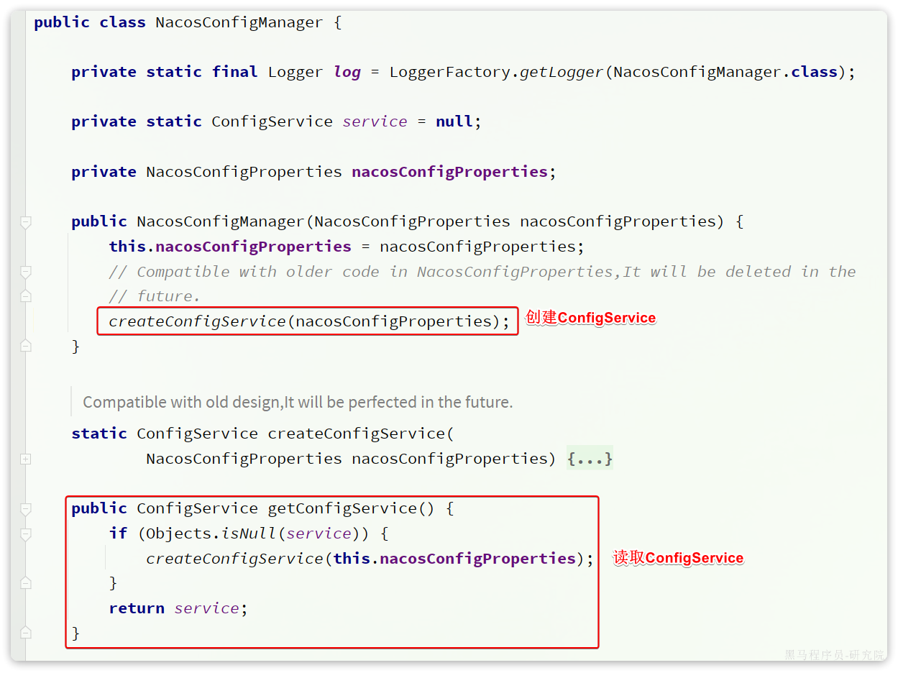

因此，只要我们拿到`NacosConfigManager`就等于拿到了`ConfigService`，第一步就实现了。

第二步，编写监听器。虽然官方提供的SDK是ConfigService中的addListener，不过项目第一次启动时不仅仅需要添加监听器，也需要读取配置，因此建议使用的API是这个：

```Java
String getConfigAndSignListener(
    String dataId, // 配置文件id
    String group, // 配置组，走默认
    long timeoutMs, // 读取配置的超时时间
    Listener listener // 监听器
) throws NacosException;
```

既可以配置监听器，并且会根据dataId和group读取配置并返回。我们就可以在项目启动时先更新一次路由，后续随着配置变更通知到监听器，完成路由更新。

### 3.3.2.更新路由

更新路由要用到`org.springframework.cloud.gateway.route.RouteDefinitionWriter`这个接口：

```Java
package org.springframework.cloud.gateway.route;

import reactor.core.publisher.Mono;

/**
 * @author Spencer Gibb
 */
public interface RouteDefinitionWriter {
        /**
     * 更新路由到路由表，如果路由id重复，则会覆盖旧的路由
     */
        Mono<Void> save(Mono<RouteDefinition> route);
        /**
     * 根据路由id删除某个路由
     */
        Mono<Void> delete(Mono<String> routeId);
}
```

这里更新的路由，也就是RouteDefinition，之前我们见过，包含下列常见字段：

- id：路由id
- predicates：路由匹配规则
- filters：路由过滤器
- uri：路由目的地

将来我们保存到Nacos的配置也要符合这个对象结构，将来我们以JSON来保存，格式如下：

```JSON
{
  "id": "item",
  "predicates": [{
    "name": "Path",
    "args": {"_genkey_0":"/items/**", "_genkey_1":"/search/**"}
  }],
  "filters": [],
  "uri": "lb://item-service"
}
```

以上JSON配置就等同于：

```YAML
spring:
  cloud:
    gateway:
      routes:
        - id: item
          uri: lb://item-service
          predicates:
            - Path=/items/**,/search/**
```

OK，我们所需要用到的SDK已经齐全了。

### 3.3.3.实现动态路由

首先， 我们在网关gateway引入依赖：

```XML
<!--统一配置管理-->
<dependency>
    <groupId>com.alibaba.cloud</groupId>
    <artifactId>spring-cloud-starter-alibaba-nacos-config</artifactId>
</dependency>
<!--加载bootstrap-->
<dependency>
    <groupId>org.springframework.cloud</groupId>
    <artifactId>spring-cloud-starter-bootstrap</artifactId>
</dependency>
```

然后在网关`gateway`的`resources`目录创建`bootstrap.yaml`文件，内容如下：

```YAML
spring:
  application:
    name: gateway
  cloud:
    nacos:
      server-addr: 192.168.150.101
      config:
        file-extension: yaml
        shared-configs:
          - dataId: shared-log.yaml # 共享日志配置
```

接着，修改`gateway`的`resources`目录下的`application.yml`，把之前的路由移除，最终内容如下：

```YAML
server:
  port: 8080 # 端口
hm:
  jwt:
    location: classpath:hmall.jks # 秘钥地址
    alias: hmall # 秘钥别名
    password: hmall123 # 秘钥文件密码
    tokenTTL: 30m # 登录有效期
  auth:
    excludePaths: # 无需登录校验的路径
      - /search/**
      - /users/login
      - /items/**
```

然后，在`gateway`中定义配置监听器：


其代码如下：

```Java
package com.hmall.gateway.route;

import cn.hutool.json.JSONUtil;
import com.alibaba.cloud.nacos.NacosConfigManager;
import com.alibaba.nacos.api.config.listener.Listener;
import com.alibaba.nacos.api.exception.NacosException;
import com.hmall.common.utils.CollUtils;
import lombok.RequiredArgsConstructor;
import lombok.extern.slf4j.Slf4j;
import org.springframework.cloud.gateway.route.RouteDefinition;
import org.springframework.cloud.gateway.route.RouteDefinitionWriter;
import org.springframework.stereotype.Component;
import reactor.core.publisher.Mono;

import javax.annotation.PostConstruct;
import java.util.HashSet;
import java.util.List;
import java.util.Set;
import java.util.concurrent.Executor;

@Slf4j
@Component
@RequiredArgsConstructor
public class DynamicRouteLoader {

    private final RouteDefinitionWriter writer;
    private final NacosConfigManager nacosConfigManager;

    // 路由配置文件的id和分组
    private final String dataId = "gateway-routes.json";
    private final String group = "DEFAULT_GROUP";
    // 保存更新过的路由id
    private final Set<String> routeIds = new HashSet<>();

    @PostConstruct
    public void initRouteConfigListener() throws NacosException {
        // 1.注册监听器并首次拉取配置
        String configInfo = nacosConfigManager.getConfigService()
                .getConfigAndSignListener(dataId, group, 5000, new Listener() {
                    @Override
                    public Executor getExecutor() {
                        return null;
                    }

                    @Override
                    public void receiveConfigInfo(String configInfo) {
                        updateConfigInfo(configInfo);
                    }
                });
        // 2.首次启动时，更新一次配置
        updateConfigInfo(configInfo);
    }

    private void updateConfigInfo(String configInfo) {
        log.debug("监听到路由配置变更，{}", configInfo);
        // 1.反序列化
        List<RouteDefinition> routeDefinitions = JSONUtil.toList(configInfo, RouteDefinition.class);
        // 2.更新前先清空旧路由
        // 2.1.清除旧路由
        for (String routeId : routeIds) {
            writer.delete(Mono.just(routeId)).subscribe();
        }
        routeIds.clear();
        // 2.2.判断是否有新的路由要更新
        if (CollUtils.isEmpty(routeDefinitions)) {
            // 无新路由配置，直接结束
            return;
        }
        // 3.更新路由
        routeDefinitions.forEach(routeDefinition -> {
            // 3.1.更新路由
            writer.save(Mono.just(routeDefinition)).subscribe();
            // 3.2.记录路由id，方便将来删除
            routeIds.add(routeDefinition.getId());
        });
    }
}
```

重启网关，任意访问一个接口，比如 http://localhost:8080/search/list?pageNo=1&pageSize=1：


发现是404，无法访问。

接下来，我们直接在Nacos控制台添加路由，路由文件名为`gateway-routes.json`，类型为`json`：

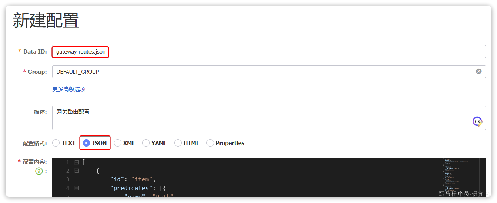

配置内容如下：

```JSON
[
    {
        "id": "item",
        "predicates": [{
            "name": "Path",
            "args": {"_genkey_0":"/items/**", "_genkey_1":"/search/**"}
        }],
        "filters": [],
        "uri": "lb://item-service"
    },
    {
        "id": "cart",
        "predicates": [{
            "name": "Path",
            "args": {"_genkey_0":"/carts/**"}
        }],
        "filters": [],
        "uri": "lb://cart-service"
    },
    {
        "id": "user",
        "predicates": [{
            "name": "Path",
            "args": {"_genkey_0":"/users/**", "_genkey_1":"/addresses/**"}
        }],
        "filters": [],
        "uri": "lb://user-service"
    },
    {
        "id": "trade",
        "predicates": [{
            "name": "Path",
            "args": {"_genkey_0":"/orders/**"}
        }],
        "filters": [],
        "uri": "lb://trade-service"
    },
    {
        "id": "pay",
        "predicates": [{
            "name": "Path",
            "args": {"_genkey_0":"/pay-orders/**"}
        }],
        "filters": [],
        "uri": "lb://pay-service"
    }
]
```

无需重启网关，稍等几秒钟后，再次访问刚才的地址：


网关路由成功了！

# 4.作业

将项目一拆分为一个微服务项目，并完成下列需求：

- 基于OpenFeign实现服务间远程调用
- 定义网关，实现对微服务的请求路由
- 基于网关实现登录用户校验和用户信息传递

以苍穹外卖为例，项目可以拆分为：

- 业务服务：
  - 用户服务：用户、地址、登录等相关业务
  - 产品服务：店铺、分类、菜品、套餐等业务
  - 交易服务：订单、购物车业务
  - 数据服务：工作台、报表统计等业务
- 基础服务：
  - 支付服务：支付相关业务
  - 文件服务：文件上传功能


# (3)服务保护和分布式事务


在微服务远程调用的过程中，还存在几个问题需要解决。

首先是**业务健壮性**问题：

例如在之前的查询购物车列表业务中，购物车服务需要查询最新的商品信息，与购物车数据做对比，提醒用户。大家设想一下，如果商品服务查询时发生故障，查询购物车列表在调用商品服 务时，是不是也会异常？从而导致购物车查询失败。但从业务角度来说，为了提升用户体验，即便是商品查询失败，购物车列表也应该正确展示出来，哪怕是不包含最新的商品信息。

还有**级联**失败问题：

还是查询购物车的业务，假如商品服务业务并发较高，占用过多Tomcat连接。可能会导致商品服务的所有接口响应时间增加，延迟变高，甚至是长时间阻塞直至查询失败。

此时查询购物车业务需要查询并等待商品查询结果，从而导致查询购物车列表业务的响应时间也变长，甚至也阻塞直至无法访问。而此时如果查询购物车的请求较多，可能导致购物车服务的Tomcat连接占用较多，所有接口的响应时间都会增加，整个服务性能很差， 甚至不可用。

暂时无法在飞书文档外展示此内容

依次类推，整个微服务群中与购物车服务、商品服务等有调用关系的服务可能都会出现问题，最终导致整个集群不可用。

暂时无法在飞书文档外展示此内容

这就是**级联**失败**问题，或者叫**雪崩问题。

还有跨服务的事务问题：

比如昨天讲到过的下单业务，下单的过程中需要调用多个微服务：

- 商品服务：扣减库存
- 订单服务：保存订单
- 购物车服务：清理购物车

这些业务全部都是数据库的写操作，我们必须确保所有操作的同时成功或失败。但是这些操作在不同微服务，也就是不同的Tomcat，这样的情况如何确保事务特性呢？

这些问题都会在今天找到答案。

今天的内容会分成几部分：

- 微服务保护
  - 服务保护方案
  - 请求限流
  - 隔离和熔断
- 分布式事务
  - 初识分布式事务
  - Seata

通过今天的学习，你将能掌握下面的能力：

- 知道雪崩问题产生原因及常见解决方案
- 能使用Sentinel实现服务保护
- 理解分布式事务产生的原因
- 能使用Seata解决分布式事务问题
- 理解AT模式基本原理

# 1.微服务保护

保证服务运行的健壮性，避免级联失败导致的雪崩问题，就属于微服务保护。这章我们就一起来学习一下微服务保护的常见方案以及对应的技术。

## 1.1.服务保护方案

微服务保护的方案有很多，比如：

- 请求限流
- 线程隔离
- 服务熔断

这些方案或多或少都会导致服务的体验上略有下降，比如请求限流，降低了并发上限；线程隔离，降低了可用资源数量；服务熔断，降低了服务的完整度，部分服务变的不可用或弱可用。因此这些方案都属于服务**降级**的方案。但通过这些方案，服务的健壮性得到了提升，

接下来，我们就逐一了解这些方案的原理。

### 1.1.1.请求限流

服务故障最重要原因，就是并发太高！解决了这个问题，就能避免大部分故障。当然，接口的并发不是一直很高，而是突发的。因此请求限流，就是**限制或控制**接口访问的并发流量，避免服务因流量激增而出现故障。

请求限流往往会有一个限流器，数量高低起伏的并发请求曲线，经过限流器就变的非常平稳。这就像是水电站的大坝，起到蓄水的作用，可以通过开关控制水流出的大小，让下游水流始终维持在一个平稳的量。


### 1.1.2.线程隔离

当一个业务接口响应时间长，而且并发高时，就可能耗尽服务器的线程资源，导致服务内的其它接口受到影响。所以我们必须把这种影响降低，或者缩减影响的范围。线程隔离正是解决这个问题的好办法。

线程隔离的思想来自轮船的舱壁模式：


轮船的船舱会被隔板分割为N个相互隔离的密闭舱，假如轮船触礁进水，只有损坏的部分密闭舱会进水，而其他舱由于相互隔离，并不会进水。这样就把进水控制在部分船体，避免了整个船舱进水而沉没。

为了避免某个接口故障或压力过大导致整个服务不可用，我们可以限定每个接口可以使用的资源范围，也就是将其“隔离”起来。

暂时无法在飞书文档外展示此内容

如图所示，我们给查询购物车业务限定可用线程数量上限为20，这样即便查询购物车的请求因为查询商品服务而出现故障，也不会导致服务器的线程资源被耗尽，不会影响到其它接口。

### 1.1.3.服务熔断

线程隔离虽然避免了雪崩问题，但故障服务（商品服务）依然会拖慢购物车服务（服务调用方）的接口响应速度。而且商品查询的故障依然会导致查询购物车功能出现故障，购物车业务也变的不可用了。

所以，我们要做两件事情：

- **编写服务降级逻辑**：就是服务调用失败后的处理逻辑，根据业务场景，可以抛出异常，也可以返回友好提示或默认数据。
- **异常统计和熔断**：统计服务提供方的异常比例，当比例过高表明该接口会影响到其它服务，应该拒绝调用该接口，而是直接走降级逻辑。

暂时无法在飞书文档外展示此内容

## 1.2.Sentinel

微服务保护的技术有很多，但在目前国内使用较多的还是Sentinel，所以接下来我们学习Sentinel的使用。

### 1.2.1.介绍和安装

Sentinel是阿里巴巴开源的一款服务保护框架，目前已经加入SpringCloudAlibaba中。官方网站：

https://sentinelguard.io/zh-cn/

Sentinel 的使用可以分为两个部分:

- **核心库**（Jar包）：不依赖任何框架/库，能够运行于 Java 8 及以上的版本的运行时环境，同时对 Dubbo / Spring Cloud 等框架也有较好的支持。在项目中引入依赖即可实现服务限流、隔离、熔断等功能。
- **控制台**（Dashboard）：Dashboard 主要负责管理推送规则、监控、管理机器信息等。

为了方便监控微服务，我们先把Sentinel的控制台搭建出来。

1）下载jar包

下载地址：

https://github.com/alibaba/Sentinel/releases

也可以直接使用课前资料提供的版本：


2）运行

将jar包放在任意非中文、不包含特殊字符的目录下，重命名为`sentinel-dashboard.jar`：

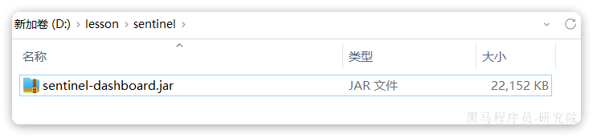

然后运行如下命令启动控制台：

```Shell
java -Dserver.port=8090 -Dcsp.sentinel.dashboard.server=localhost:8090 -Dproject.name=sentinel-dashboard -jar sentinel-dashboard.jar
```

其它启动时可配置参数可参考官方文档：

https://github.com/alibaba/Sentinel/wiki/%E5%90%AF%E5%8A%A8%E9%85%8D%E7%BD%AE%E9%A1%B9

3）访问

访问[http://localhost:8090](http://localhost:8080)页面，就可以看到sentinel的控制台了：


需要输入账号和密码，默认都是：sentinel

登录后，即可看到控制台，默认会监控sentinel-dashboard服务本身：

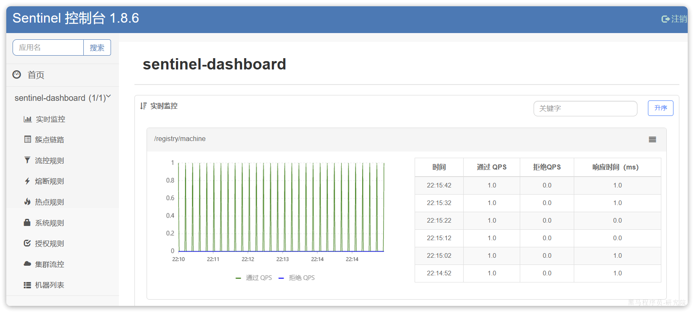

### 1.2.2.微服务整合

我们在`cart-service`模块中整合sentinel，连接`sentinel-dashboard`控制台，步骤如下： 1）引入sentinel依赖

```XML
<!--sentinel-->
<dependency>
    <groupId>com.alibaba.cloud</groupId> 
    <artifactId>spring-cloud-starter-alibaba-sentinel</artifactId>
</dependency>
```

2）配置控制台

修改application.yaml文件，添加下面内容：

```YAML
spring:
  cloud: 
    sentinel:
      transport:
        dashboard: localhost:8090
```

3）访问`cart-service`的任意端点

重启`cart-service`，然后访问查询购物车接口，sentinel的客户端就会将服务访问的信息提交到`sentinel-dashboard`控制台。并展示出统计信息：


点击簇点链路菜单，会看到下面的页面：


所谓簇点链路，就是单机调用链路，是一次请求进入服务后经过的每一个被`Sentinel`监控的资源。默认情况下，`Sentinel`会监控`SpringMVC`的每一个`Endpoint`（接口）。

因此，我们看到`/carts`这个接口路径就是其中一个簇点，我们可以对其进行限流、熔断、隔离等保护措施。

不过，需要注意的是，我们的SpringMVC接口是按照Restful风格设计，因此购物车的查询、删除、修改等接口全部都是`/carts`路径：

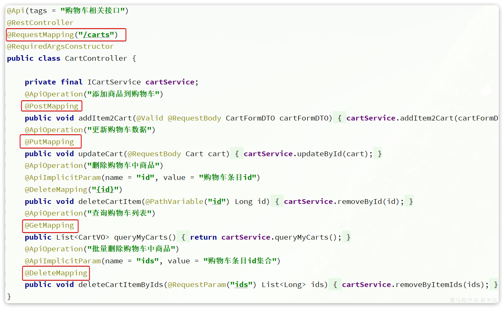

默认情况下Sentinel会把路径作为簇点资源的名称，无法区分路径相同但请求方式不同的接口，查询、删除、修改等都被识别为一个簇点资源，这显然是不合适的。

所以我们可以选择打开Sentinel的请求方式前缀，把`请求方式 + 请求路径`作为簇点资源名：

首先，在`cart-service`的`application.yml`中添加下面的配置：

```YAML
spring:
  cloud:
    sentinel:
      transport:
        dashboard: localhost:8090
      http-method-specify: true # 开启请求方式前缀
```

然后，重启服务，通过页面访问购物车的相关接口，可以看到sentinel控制台的簇点链路发生了变化：


## 1.3.请求限流

在簇点链路后面点击流控按钮，即可对其做限流配置：


在弹出的菜单中这样填写：


这样就把查询购物车列表这个簇点资源的流量限制在了每秒6个，也就是最大QPS为6.

我们利用Jemeter做限流测试，我们每秒发出10个请求：


最终监控结果如下：


可以看出`GET:/carts`这个接口的通过QPS稳定在6附近，而拒绝的QPS在4附近，符合我们的预期。

## 1.4.线程隔离

限流可以降低服务器压力，尽量减少因并发流量引起的服务故障的概率，但并不能完全避免服务故障。一旦某个服务出现故障，我们必须隔离对这个服务的调用，避免发生雪崩。

比如，查询购物车的时候需要查询商品，为了避免因商品服务出现故障导致购物车服务级联失败，我们可以把购物车业务中查询商品的部分隔离起来，限制可用的线程资源：

暂时无法在飞书文档外展示此内容

这样，即便商品服务出现故障，最多导致查询购物车业务故障，并且可用的线程资源也被限定在一定范围，不会导致整个购物车服务崩溃。

所以，我们要对查询商品的FeignClient接口做线程隔离。

### 1.4.1.OpenFeign整合Sentinel

修改cart-service模块的application.yml文件，开启Feign的sentinel功能：

```YAML
feign:
  sentinel:
    enabled: true # 开启feign对sentinel的支持
```

需要注意的是，默认情况下SpringBoot项目的tomcat最大线程数是200，允许的最大连接是8492，单机测试很难打满。

所以我们需要配置一下cart-service模块的application.yml文件，修改tomcat连接：

```YAML
server:
  port: 8082
  tomcat:
    threads:
      max: 50 # 允许的最大线程数
    accept-count: 50 # 最大排队等待数量
    max-connections: 100 # 允许的最大连接
```

然后重启cart-service服务，可以看到查询商品的FeignClient自动变成了一个簇点资源：

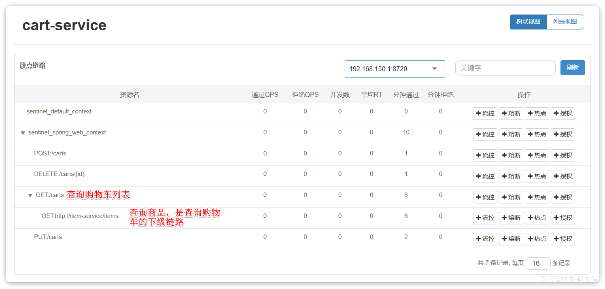

### 1.4.2.配置线程隔离

接下来，点击查询商品的FeignClient对应的簇点资源后面的流控按钮：


在弹出的表单中填写下面内容：


注意，这里勾选的是并发线程数限制，也就是说这个查询功能最多使用5个线程，而不是5QPS。如果查询商品的接口每秒处理2个请求，则5个线程的实际QPS在10左右，而超出的请求自然会被拒绝。


我们利用Jemeter测试，每秒发送100个请求：


最终测试结果如下：


进入查询购物车的请求每秒大概在100，而在查询商品时却只剩下每秒10左右，符合我们的预期。

此时如果我们通过页面访问购物车的其它接口，例如添加购物车、修改购物车商品数量，发现不受影响：


响应时间非常短，这就证明线程隔离起到了作用，尽管查询购物车这个接口并发很高，但是它能使用的线程资源被限制了，因此不会影响到其它接口。

## 1.5.服务熔断

在上节课，我们利用线程隔离对查询购物车业务进行隔离，保护了购物车服务的其它接口。由于查询商品的功能耗时较高（我们模拟了500毫秒延时），再加上线程隔离限定了线程数为5，导致接口吞吐能力有限，最终QPS只有10左右。这就导致了几个问题：

第一，超出的QPS上限的请求就只能抛出异常，从而导致购物车的查询失败。但从业务角度来说，即便没有查询到最新的商品信息，购物车也应该展示给用户，用户体验更好。也就是给查询失败设置一个**降级处理**逻辑。

第二，由于查询商品的延迟较高（模拟的500ms），从而导致查询购物车的响应时间也变的很长。这样不仅拖慢了购物车服务，消耗了购物车服务的更多资源，而且用户体验也很差。对于商品服务这种不太健康的接口，我们应该直接停止调用，直接走降级逻辑，避免影响到当前服务。也就是将商品查询接口**熔断**。

### 1.5.1.编写降级逻辑

触发限流或熔断后的请求不一定要直接报错，也可以返回一些默认数据或者友好提示，用户体验会更好。

给FeignClient编写失败后的降级逻辑有两种方式：

- 方式一：FallbackClass，无法对远程调用的异常做处理
- 方式二：FallbackFactory，可以对远程调用的异常做处理，我们一般选择这种方式。

这里我们演示方式二的失败降级处理。

**步骤一**：在hm-api模块中给`ItemClient`定义降级处理类，实现`FallbackFactory`：


代码如下：

```Java
package com.hmall.api.client.fallback;

import com.hmall.api.client.ItemClient;
import com.hmall.api.dto.ItemDTO;
import com.hmall.api.dto.OrderDetailDTO;
import com.hmall.common.exception.BizIllegalException;
import com.hmall.common.utils.CollUtils;
import lombok.extern.slf4j.Slf4j;
import org.springframework.cloud.openfeign.FallbackFactory;

import java.util.Collection;
import java.util.List;

@Slf4j
public class ItemClientFallback implements FallbackFactory<ItemClient> {
    @Override
    public ItemClient create(Throwable cause) {
        return new ItemClient() {
            @Override
            public List<ItemDTO> queryItemByIds(Collection<Long> ids) {
                log.error("远程调用ItemClient#queryItemByIds方法出现异常，参数：{}", ids, cause);
                // 查询购物车允许失败，查询失败，返回空集合
                return CollUtils.emptyList();
            }

            @Override
            public void deductStock(List<OrderDetailDTO> items) {
                // 库存扣减业务需要触发事务回滚，查询失败，抛出异常
                throw new BizIllegalException(cause);
            }
        };
    }
}
```

**步骤二**：在`hm-api`模块中的`com.hmall.api.config.DefaultFeignConfig`类中将`ItemClientFallback`注册为一个`Bean`：


**步骤三**：在`hm-api`模块中的`ItemClient`接口中使用`ItemClientFallbackFactory`：

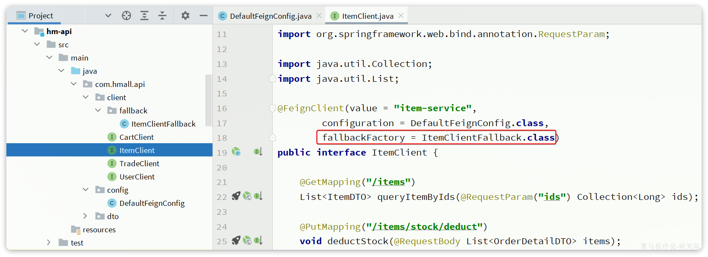

重启后，再次测试，发现被限流的请求不再报错，走了降级逻辑：

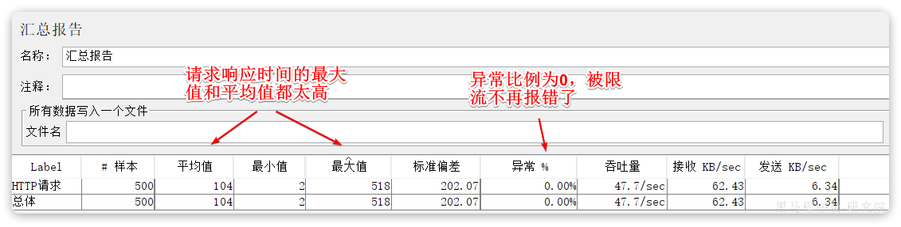

但是未被限流的请求延时依然很高：


导致最终的平局响应时间较长。

### 1.5.2.服务熔断

查询商品的RT较高（模拟的500ms），从而导致查询购物车的RT也变的很长。这样不仅拖慢了购物车服务，消耗了购物车服务的更多资源，而且用户体验也很差。

对于商品服务这种不太健康的接口，我们应该停止调用，直接走降级逻辑，避免影响到当前服务。也就是将商品查询接口**熔断**。当商品服务接口恢复正常后，再允许调用。这其实就是**断路器**的工作模式了。

Sentinel中的断路器不仅可以统计某个接口的**慢请求比例**，还可以统计**异常请求比例**。当这些比例超出阈值时，就会**熔断**该接口，即拦截访问该接口的一切请求，降级处理；当该接口恢复正常时，再放行对于该接口的请求。

断路器的工作状态切换有一个状态机来控制：

暂时无法在飞书文档外展示此内容

状态机包括三个状态：

- **closed**：关闭状态，断路器放行所有请求，并开始统计异常比例、慢请求比例。超过阈值则切换到open状态
- **open**：打开状态，服务调用被**熔断**，访问被熔断服务的请求会被拒绝，快速失败，直接走降级逻辑。Open状态持续一段时间后会进入half-open状态
- **half-open**：半开状态，放行一次请求，根据执行结果来判断接下来的操作。 
  - 请求成功：则切换到closed状态
  - 请求失败：则切换到open状态

我们可以在控制台通过点击簇点后的**`熔断`**按钮来配置熔断策略：


在弹出的表格中这样填写：


这种是按照慢调用比例来做熔断，上述配置的含义是：

- RT超过200毫秒的请求调用就是慢调用
- 统计最近1000ms内的最少5次请求，如果慢调用比例不低于0.5，则触发熔断
- 熔断持续时长20s

配置完成后，再次利用Jemeter测试，可以发现：


在一开始一段时间是允许访问的，后来触发熔断后，查询商品服务的接口通过QPS直接为0，所有请求都被熔断了。而查询购物车的本身并没有受到影响。

此时整个购物车查询服务的平均RT影响不大：


# 2.分布式事务

首先我们看看项目中的下单业务整体流程：

暂时无法在飞书文档外展示此内容

由于订单、购物车、商品分别在三个不同的微服务，而每个微服务都有自己独立的数据库，因此下单过程中就会跨多个数据库完成业务。而每个微服务都会执行自己的本地事务：

- 交易服务：下单事务
- 购物车服务：清理购物车事务
- 库存服务：扣减库存事务

整个业务中，各个本地事务是有关联的。因此每个微服务的本地事务，也可以称为**分支事务**。多个有关联的分支事务一起就组成了**全局事务**。我们必须保证整个全局事务同时成功或失败。

我们知道每一个分支事务就是传统的**单体事务**，都可以满足ACID特性，但全局事务跨越多个服务、多个数据库，是否还能满足呢？

我们来做一个测试，先进入购物车页面：


目前有4个购物车，然结算下单，进入订单结算页面：

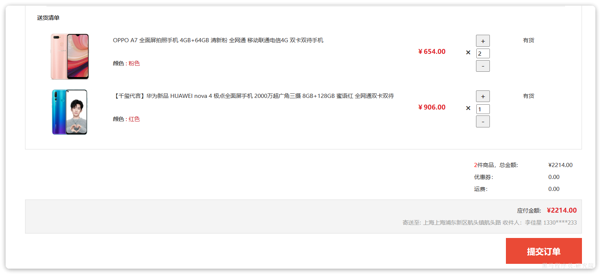

然后将购物车中某个商品的库存修改为`0`：


然后，提交订单，最终因库存不足导致下单失败：


然后我们去查看购物车列表，发现购物车数据依然被清空了，并未回滚：


事务并未遵循ACID的原则，归其原因就是参与事务的多个子业务在不同的微服务，跨越了不同的数据库。虽然每个单独的业务都能在本地遵循ACID，但是它们互相之间没有感知，不知道有人失败了，无法保证最终结果的统一，也就无法遵循ACID的事务特性了。

这就是分布式事务问题，出现以下情况之一就可能产生分布式事务问题：

- 业务跨多个服务实现
- 业务跨多个数据源实现

接下来这一章我们就一起来研究下如何解决分布式事务问题。

## 2.1.认识Seata

解决分布式事务的方案有很多，但实现起来都比较复杂，因此我们一般会使用开源的框架来解决分布式事务问题。在众多的开源分布式事务框架中，功能最完善、使用最多的就是阿里巴巴在2019年开源的Seata了。

https://seata.io/zh-cn/docs/overview/what-is-seata.html

其实分布式事务产生的一个重要原因，就是参与事务的多个分支事务互相无感知，不知道彼此的执行状态。因此解决分布式事务的思想非常简单：

就是找一个统一的**事务协调者**，与多个分支事务通信，检测每个分支事务的执行状态，保证全局事务下的每一个分支事务同时成功或失败即可。大多数的分布式事务框架都是基于这个理论来实现的。

Seata也不例外，在Seata的事务管理中有三个重要的角色：

-  **TC(**Transaction Coordinator**) -** **事务协调者：**维护全局和分支事务的状态，协调全局事务提交或回滚。 
-  **TM (Transaction Manager) -** **事务管理器：**定义全局事务的范围、开始全局事务、提交或回滚全局事务。 
-  **RM (Resource Manager) -** **资源管理器：**管理分支事务，与TC交谈以注册分支事务和报告分支事务的状态，并驱动分支事务提交或回滚。 

Seata的工作架构如图所示：


其中，**TM**和**RM**可以理解为Seata的客户端部分，引入到参与事务的微服务依赖中即可。将来**TM**和**RM**就会协助微服务，实现本地分支事务与**TC**之间交互，实现事务的提交或回滚。

而**TC**服务则是事务协调中心，是一个独立的微服务，需要单独部署。

## 2.2.部署TC服务

### 2.2.1.准备数据库表

Seata支持多种存储模式，但考虑到持久化的需要，我们一般选择基于数据库存储。执行课前资料提供的`《seata-tc.sql》`，导入数据库表：

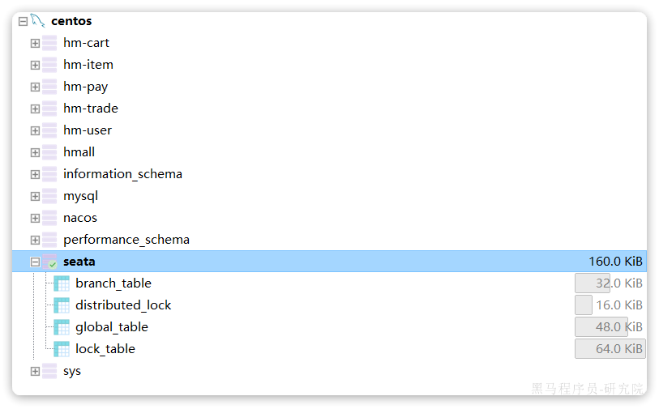

### 2.2.2.准备配置文件

课前资料准备了一个seata目录，其中包含了seata运行时所需要的配置文件：


其中包含中文注释，大家可以自行阅读。

我们将整个seata文件夹拷贝到虚拟机的`/root`目录：

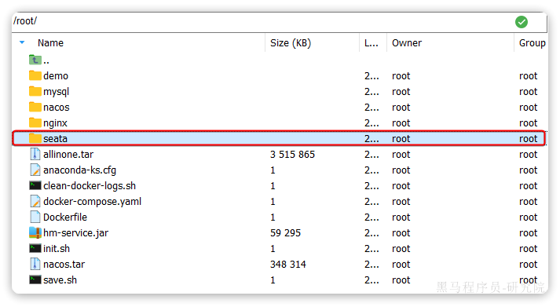

### 2.2.3.Docker部署

需要注意，要确保nacos、mysql都在hm-net网络中。如果某个容器不再hm-net网络，可以参考下面的命令将某容器加入指定网络：

```Shell
docker network connect [网络名] [容器名]
```

在虚拟机的`/root`目录执行下面的命令：

```Shell
docker run --name seata \
-p 8099:8099 \
-p 7099:7099 \
-e SEATA_IP=192.168.238 \
-v ./seata:/seata-server/resources \
--privileged=true \
--network hmall \
-d \
seataio/seata-server:1.5.2
```

如果镜像下载困难，也可以把课前资料提供的镜像上传到虚拟机并加载：

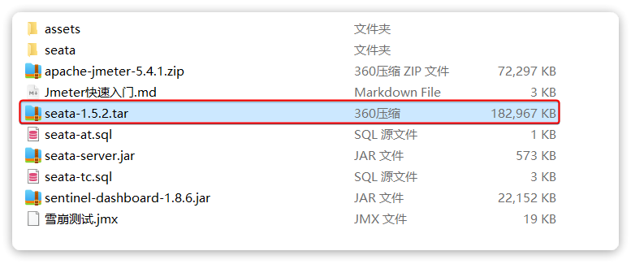

 

## 2.3.微服务集成Seata

参与分布式事务的每一个微服务都需要集成Seata，我们以`trade-service`为例。

### 2.3.1.引入依赖

为了方便各个微服务集成seata，我们需要把seata配置共享到nacos，因此`trade-service`模块不仅仅要引入seata依赖，还要引入nacos依赖:

```XML
<!--统一配置管理-->
  <dependency>
      <groupId>com.alibaba.cloud</groupId>
      <artifactId>spring-cloud-starter-alibaba-nacos-config</artifactId>
  </dependency>
  <!--读取bootstrap文件-->
  <dependency>
      <groupId>org.springframework.cloud</groupId>
      <artifactId>spring-cloud-starter-bootstrap</artifactId>
  </dependency>
  <!--seata-->
  <dependency>
      <groupId>com.alibaba.cloud</groupId>
      <artifactId>spring-cloud-starter-alibaba-seata</artifactId>
  </dependency>
```

### 2.3.2.改造配置

首先在nacos上添加一个共享的seata配置，命名为`shared-seata.yaml`：

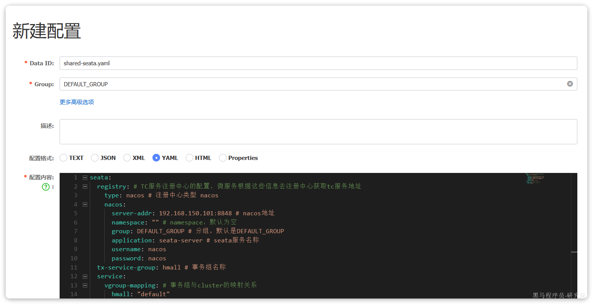

内容如下：

```YAML
seata:
  registry: # TC服务注册中心的配置，微服务根据这些信息去注册中心获取tc服务地址
    type: nacos # 注册中心类型 nacos
    nacos:
      server-addr: 192.168.150.101:8848 # nacos地址
      namespace: "" # namespace，默认为空
      group: DEFAULT_GROUP # 分组，默认是DEFAULT_GROUP
      application: seata-server # seata服务名称
      username: nacos
      password: nacos
  tx-service-group: hmall # 事务组名称
  service:
    vgroup-mapping: # 事务组与tc集群的映射关系
      hmall: "default"
```

然后，改造`trade-service`模块，添加`bootstrap.yaml`：


内容如下:

```YAML
spring:
  application:
    name: trade-service # 服务名称
  profiles:
    active: dev
  cloud:
    nacos:
      server-addr: 192.168.150.101 # nacos地址
      config:
        file-extension: yaml # 文件后缀名
        shared-configs: # 共享配置
          - dataId: shared-jdbc.yaml # 共享mybatis配置
          - dataId: shared-log.yaml # 共享日志配置
          - dataId: shared-swagger.yaml # 共享日志配置
          - dataId: shared-seata.yaml # 共享seata配置
```

可以看到这里加载了共享的seata配置。

然后改造application.yaml文件，内容如下：

```YAML
server:
  port: 8085
feign:
  okhttp:
    enabled: true # 开启OKHttp连接池支持
  sentinel:
    enabled: true # 开启Feign对Sentinel的整合
hm:
  swagger:
    title: 交易服务接口文档
    package: com.hmall.trade.controller
  db:
    database: hm-trade
```

参考上述办法分别改造`hm-cart`和`hm-item`两个微服务模块。

### 2.3.3.添加数据库表

seata的客户端在解决分布式事务的时候需要记录一些中间数据，保存在数据库中。因此我们要先准备一个这样的表。

将课前资料的seata-at.sql分别文件导入hm-trade、hm-cart、hm-item三个数据库中：


结果：


OK，至此为止，微服务整合的工作就完成了。可以参考上述方式对`hm-item`和`hm-cart`模块完成整合改造。

### 2.3.4.测试

接下来就是测试的分布式事务的时候了。

我们找到`trade-service`模块下的`com.hmall.trade.service.impl.OrderServiceImpl`类中的`createOrder`方法，也就是下单业务方法。

将其上的`@Transactional`注解改为Seata提供的`@GlobalTransactional`：


`@GlobalTransactional`注解就是在标记事务的起点，将来TM就会基于这个方法判断全局事务范围，初始化全局事务。

我们重启`trade-service`、`item-service`、`cart-service`三个服务。再次测试，发现分布式事务的问题解决了！

那么，Seata是如何解决分布式事务的呢？

## 2.4.XA模式

Seata支持四种不同的分布式事务解决方案：

- **XA**
- **TCC**
- **AT**
- **SAGA**

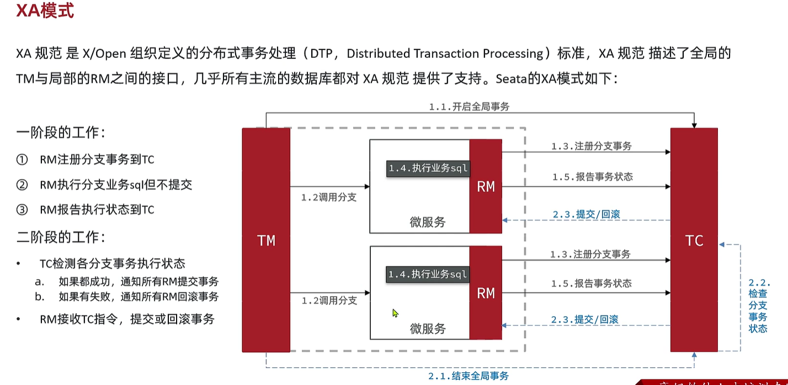

这里我们以`XA`模式和`AT`模式来给大家讲解其实现原理。

`XA` 规范 是` X/Open` 组织定义的分布式事务处理（DTP，Distributed Transaction Processing）标准，XA 规范 描述了全局的`TM`与局部的`RM`之间的接口，几乎所有主流的数据库都对 XA 规范 提供了支持。

### 2.4.1.两阶段提交

A是规范，目前主流数据库都实现了这种规范，实现的原理都是基于两阶段提交。

正常情况：

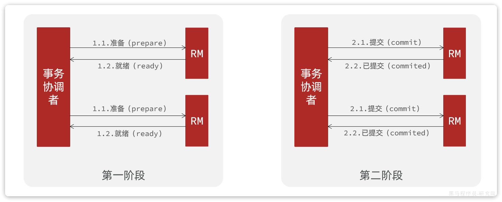

异常情况：


一阶段：

- 事务协调者通知每个事务参与者执行本地事务
- 本地事务执行完成后报告事务执行状态给事务协调者，此时事务不提交，继续持有数据库锁

二阶段：

- 事务协调者基于一阶段的报告来判断下一步操作
- 如果一阶段都成功，则通知所有事务参与者，提交事务
- 如果一阶段任意一个参与者失败，则通知所有事务参与者回滚事务

### 2.4.2.Seata的XA模型

Seata对原始的XA模式做了简单的封装和改造，以适应自己的事务模型，基本架构如图：


`RM`一阶段的工作：

1. 注册分支事务到`TC`
2. 执行分支业务sql但不提交
3. 报告执行状态到`TC`

`TC`二阶段的工作：

1.  `TC`检测各分支事务执行状态
   1. 如果都成功，通知所有RM提交事务
   2. 如果有失败，通知所有RM回滚事务 

`RM`二阶段的工作：

- 接收`TC`指令，提交或回滚事务

### 2.4.3.优缺点

`XA`模式的优点是什么？

- 事务的强一致性，满足ACID原则
- 常用数据库都支持，实现简单，并且没有代码侵入

`XA`模式的缺点是什么？

- 因为一阶段需要锁定数据库资源，等待二阶段结束才释放，性能较差
- 依赖关系型数据库实现事务

### 2.4.4.实现步骤

首先，我们要在配置文件中指定要采用的分布式事务模式。我们可以在Nacos中的共享shared-seata.yaml配置文件中设置：

```YAML
seata:
  data-source-proxy-mode: XA
```

其次，我们要利用`@GlobalTransactional`标记分布式事务的入口方法：

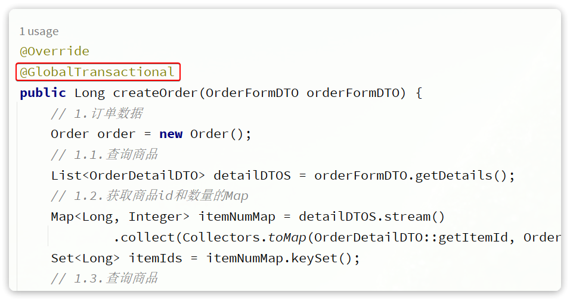

## 2.5.AT模式

`AT`模式同样是分阶段提交的事务模型，不过缺弥补了`XA`模型中资源锁定周期过长的缺陷。

### 2.5.1.Seata的AT模型

基本流程图：


阶段一`RM`的工作：

- 注册分支事务
- 记录undo-log（数据快照）
- 执行业务sql并提交
- 报告事务状态

阶段二提交时`RM`的工作：

- 删除undo-log即可

阶段二回滚时`RM`的工作：

- 根据undo-log恢复数据到更新前

### 2.5.2.流程梳理

我们用一个真实的业务来梳理下AT模式的原理。

比如，现在有一个数据库表，记录用户余额：

| **id** | **money** |
| :----- | :-------- |
| 1      | 100       |

其中一个分支业务要执行的SQL为：

```SQL
 update tb_account set money = money - 10 where id = 1
```

AT模式下，当前分支事务执行流程如下：

**一阶段**：

1. `TM`发起并注册全局事务到`TC`
2. `TM`调用分支事务
3. 分支事务准备执行业务SQL
4. `RM`拦截业务SQL，根据where条件查询原始数据，形成快照。

```JSON
{
  "id": 1, "money": 100
}
```

1. `RM`执行业务SQL，提交本地事务，释放数据库锁。此时 money = 90
2. `RM`报告本地事务状态给`TC`

**二阶段**：

1. `TM`通知`TC`事务结束
2. `TC`检查分支事务状态
   1. 如果都成功，则立即删除快照
   2. 如果有分支事务失败，需要回滚。读取快照数据（{"id": 1, "money": 100}），将快照恢复到数据库。此时数据库再次恢复为100

流程图：


### 2.5.3.AT与XA的区别

简述`AT`模式与`XA`模式最大的区别是什么？

- `XA`模式一阶段不提交事务，锁定资源；`AT`模式一阶段直接提交，不锁定资源。
- `XA`模式依赖数据库机制实现回滚；`AT`模式利用数据快照实现数据回滚。
- `XA`模式强一致；`AT`模式最终一致

可见，AT模式使用起来更加简单，无业务侵入，性能更好。因此企业90%的分布式事务都可以用AT模式来解决。

# 3.练习

## 3.1.编写降级逻辑

给黑马商城中现有的FeignClient都编写对应的降级逻辑，并且改造项目中每一个微服务，将OpenFeign与Sentinel整合。

## 3.2.解决分布式事务

除了下单业务以外，用户如果选择余额支付，前端会将请求发送到pay-service模块。而这个模块要做三件事情：

- 直接从user-service模块调用接口，扣除余额付款
- 更新本地（pay-service）交易流水表状态
- 通知交易服务（trade-service）更新其中的业务订单状态

流程如图：

暂时无法在飞书文档外展示此内容

显然，这里也存在分布式事务问题。

对应的页面如下：


当我们提交订单成功后，进入支付页面，选择余额支付，输入密码后点击确认支付即可。

前端会提交支付请求，业务接口的入口在`com.hmall.pay.controller.PayController`类的`tryPayOrderByBalance`方法：


对应的service方法如下：

```Java
@Override
@Transactional
public void tryPayOrderByBalance(PayOrderDTO payOrderDTO) {
    // 1.查询支付单
    PayOrder po = getById(payOrderDTO.getId());
    // 2.判断状态
    if(!PayStatus.WAIT_BUYER_PAY.equalsValue(po.getStatus())){
        // 订单不是未支付，状态异常
        throw new BizIllegalException("交易已支付或关闭！");
    }
    // 3.尝试扣减余额
    userClient.deductMoney(payOrderDTO.getPw(), po.getAmount());
    // 4.修改支付单状态
    boolean success = markPayOrderSuccess(payOrderDTO.getId(), LocalDateTime.now());
    if (!success) {
        throw new BizIllegalException("交易已支付或关闭！");
    }
    // 5.修改订单状态
    tradeClient.markOrderPaySuccess(po.getBizOrderNo());
}
```

利用seata解决这里的分布式事务问题，并思考这个业务实现有没有什么值得改进的地方


# (4)RabbitMQ


