# 1. C语言的介绍


## 1. 历史


**C语言** 是一种广泛使用的编程语言，由 **Dennis Ritchie** 在20世纪70年代初在 **贝尔实验室** 开发。它最初是为了编写 **UNIX操作系统** 而设计的。C语言的设计目的是提供结构化编程、代码复用、低级内存访问以及简单的编译器实现。


C语言的前身是 **B语言**，由 **Ken Thompson** 在1969年开发，它本身又是基于 **Martin Richards** 在1967年开发的 **BCPL语言**。C语言的开发让UNIX操作系统的移植性大大提高，因为之前UNIX大部分是用汇编语言编写的，这限制了它只能在特定的硬件上运行。


1978年，**Brian Kernighan** 和 **Dennis Ritchie** 出版了著名的《**C程序设计语言**》（The C Programming Language），这本书被广泛认为是C语言的官方手册，并在全世界范围内被用来教授C语言。这本书中的C语言版本后来被称为 **K&R C**。


C语言因其灵活性、效率和广泛的平台支持而成为了一个非常流行的编程语言，并对后来的许多编程语言产生了深远的影响。**C++\**、\**Objective-C**、**C#** 等语言都在不同程度上受到了C语言的启发。


1989年，为了使C语言有一个统一的标准，美国国家标准学会（**ANSI**）制定了**ANSI C** 标准，也称为 **C89**。后来这个标准被国际标准化组织（**ISO**）采纳，并在1990年发布为 **ISO C**（即C90）。此后，C语言的标准经过了几次更新，包括 **C99** 和 **C11**。这些标准化努力确保了C语言可以在各种不同的硬件和操作系统上以一致的方式使用。


## 2. 面向过程和面向对象


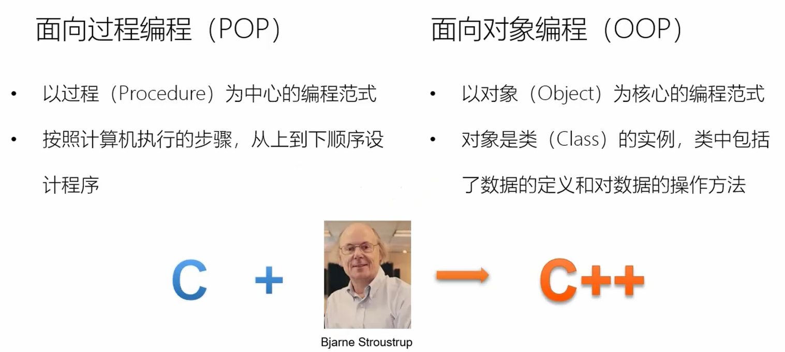

**面向对象**（Object-Oriented）编程和**面向过程**（Procedural）编程是两种不同的编程范式。


**面向过程**编程是一种编程范式，它将程序的执行过程分解成一系列的过程调用或者是函数调用。在这种范式中，数据和函数被分开考虑，程序的结构通常是通过函数的调用顺序来组织的。面向过程的语言侧重于从顶部到底部的流程控制，并且在设计程序时更注重于算法和数据结构。


相对的，**面向对象**编程是以对象为中心的编程范式，它将数据和处理数据的方法（函数）封装成对象。一个对象包含了数据（称为属性）和能对数据进行操作的函数（称为方法）。面向对象编程侧重于对象之间的交互和协作，程序由一组相互作用的对象组成。它支持继承、封装和多态，这可以提高代码的重用性和可维护性。


简而言之，**面向过程**编程关注于执行的步骤和过程，而**面向对象**编程关注于对象的组成和相互作用。

### 面向对象程序设计

C++ 完全支持面向对象的程序设计，包括面向对象开发的四大特性：

- **封装（Encapsulation）**：封装是将数据和方法组合在一起，对外部隐藏实现细节，只公开对外提供的接口。这样可以提高安全性、可靠性和灵活性。
- **继承（Inheritance）**：继承是从已有类中派生出新类，新类具有已有类的属性和方法，并且可以扩展或修改这些属性和方法。这样可以提高代码的复用性和可扩展性。
- **多态（Polymorphism）**：多态是指同一种操作作用于不同的对象，可以有不同的解释和实现。它可以通过接口或继承实现，可以提高代码的灵活性和可读性。
- **抽象（Abstraction）**：抽象是从具体的实例中提取共同的特征，形成抽象类或接口，以便于代码的复用和扩展。抽象类和接口可以让程序员专注于高层次的设计和业务逻辑，而不必关注底层的实现细节。

## 3.  应用领域


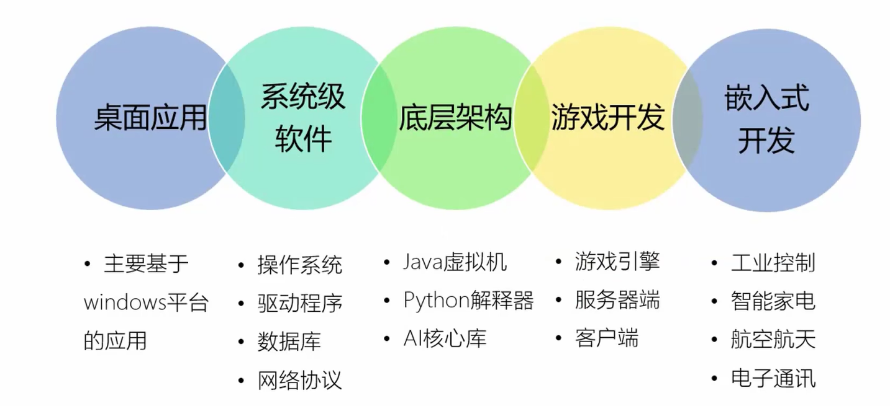


## 4. 编译型和解释型语言

编译型语言和解释型语言在编程领域有着各自鲜明的特点和显著的区别。以下是它们的主要区别和特点：

**编译型语言**：

**特点**：

1. **编译过程**：编译型语言的源代码在程序执行前，需要经过编译器的一次性处理，将其转换为与特定平台相关的机器代码或字节码。
2. **独立性**：编译后会生成一个独立的可执行文件，这个文件可以在目标平台上独立运行，无需编译器的存在。
3. **执行速度**：由于代码已经预先编译成机器代码，执行速度较快。

**优点**：

- 执行效率高，适用于性能要求高的应用。

**缺点**：

- 编译过程可能较长，特别是在大型项目中。
- 不够灵活，修改代码后需要重新编译。
- 可移植性较差，不同平台的可执行文件不同。

**解释型语言**：

**特点**：

1. **逐行解释**：解释型语言的代码在运行时由解释器逐行解释和执行，无需预先编译成机器代码。
2. **动态性**：可以在运行时修改和调试代码，更加灵活。
3. **跨平台性**：由于不依赖特定的编译过程，解释型语言具有较好的跨平台性。

**优点**：

- 开发效率高，修改代码后无需重新编译。
- 跨平台性好，适用于不同平台的兼容性要求。

**缺点**：

- 执行效率相对较低，每次执行都需要进行解释。
- 依赖解释器，非独立性。

总的来说，**编译型语言**和**解释型语言**在编译过程、执行速度、独立性、灵活性以及跨平台性等方面存在显著的区别。选择哪种语言取决于具体的应用场景和需求。例如，对于性能要求高的应用程序，编译型语言通常是更好的选择；而对于需要快速开发和跨平台部署的应用，解释型语言则更具优势。


## 4. c++ 的特点

C++的特点主要体现在以下几个方面：

1. **面向对象编程**：C++是一种支持面向对象编程的语言，它强调以**对象**为中心，将数据和操作封装在一起，通过类的形式来表现。面向对象编程带来了**封装**、**继承**、**多态**等特性，使得代码更加模块化、易于维护和扩展。
2. **泛型编程**：C++支持泛型编程，通过**模板**机制，可以编写与类型无关的代码，提高了代码的复用性和灵活性。无论是函数模板还是类模板，都能让程序员在编译时根据具体类型生成特定的代码。
3. **手动内存管理**：C++提供了指针操作，允许程序员直接进行**内存分配**和**释放**。这种手动管理内存的方式虽然增加了编程的复杂性，但也为程序员提供了更精细的控制，有助于优化程序性能。
4. **高效性**：C++是一种编译型语言，代码在执行前会经过编译器的优化处理，因此执行效率较高。此外，C++提供了对底层硬件的直接访问能力，使其在某些需要高性能的场景中表现出色。
5. **跨平台性**：C++的代码可以在多种操作系统和硬件平台上运行，具有较好的**可移植性**。这得益于C++的标准化和跨平台编译器的支持。
6. **强大的标准库**：C++标准库提供了丰富的功能和算法，如STL（Standard Template Library）等，使得程序员可以更加高效地编写代码。这些库经过优化，性能稳定可靠，为开发者提供了强大的支持。

综上所述，C++以其面向对象编程、泛型编程、手动内存管理、高效性、跨平台性和强大的标准库等特点，在软件开发领域具有广泛的应用和深远的影响。


## 5. c++ 语言的运行流程

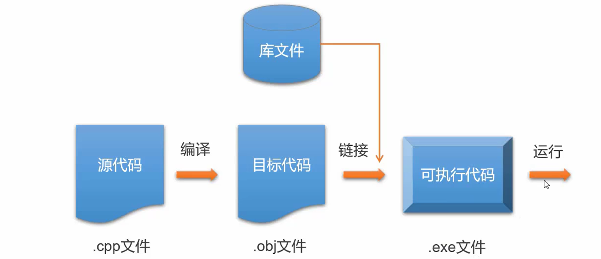


## 6. 标准库

标准的 C++ 由三个重要部分组成：

- 核心语言，提供了所有构件块，包括变量、数据类型和常量，等等。
- C++ 标准库，提供了大量的函数，用于操作文件、字符串等。
- 标准模板库（STL），提供了大量的方法，用于操作数据结构等。


## 7. 环境搭建

### 本地环境设置

如果您想要设置 **C++ 语言环境，**您需要确保电脑上有以下两款可用的软件，**文本编辑器和 C++ 编译器。**


#### 1. 文本编辑器

通过编辑器创建的文件通常称为源文件，源文件包含程序源代码。

C++ 程序的源文件通常使用扩展名 **.cpp**、**.cp** 或 **.c**。

在开始编程之前，请确保您有一个文本编辑器，且有足够的经验来编写一个计算机程序，然后把它保存在一个文件中，编译并执行它。

- **Visual Studio Code**：虽然它是一个通用的文本编辑器，但它有很多插件支持 C/C++ 开发，使其成为一个流行的选择，通过安装 C/C++ 插件和调整设置，你可以使其成为一个很好的 C 语言开发环境。

  安装教程：https://www.runoob.com/w3cnote/vscode-tutorial.html

  下载地址：https://code.visualstudio.com/

- Visual Studio： 面向 .NET 和 C++ 开发人员的综合性 Windows 版 IDE，可用于构建 Web、云、桌面、移动应用、服务和游戏。

  下载地址：https://visualstudio.microsoft.com/zh-hans/downloads/。

- **Vim** 和 **Emacs**：这两个是传统的文本编辑器，它们有着强大的编辑功能和高度的可定制性，对于熟练的用户来说非常强大，有很多插件和配置可以支持C语言的开发。

- **Eclipse**：Eclipse 是另一个功能强大的集成开发环境，虽然它最初是为 Java 开发设计的，但通过安装 C/C++ 插件，可以使其支持 C 语言开发


#### 2. C++ 编译器

写在源文件中的源代码是人类可读的源。它需要"编译"，转为机器语言，这样 CPU 可以按给定指令执行程序。

C++ 编译器用于把源代码编译成最终的可执行程序。

大多数的 C++ 编译器并不在乎源文件的扩展名，但是如果您未指定扩展名，则默认使用 **.cpp**。

最常用的免费可用的编译器是 GNU 的 C/C++ 编译器，如果您使用的是 HP 或 Solaris，则可以使用各自操作系统上的编译器。

以下部分将指导您如何在不同的操作系统上安装 GNU 的 C/C++ 编译器。这里同时提到 C/C++，主要是因为 GNU 的 gcc 编译器适合于 C 和 C++ 编程语言。


## 安装 GNU 的 C/C++ 编译器

### UNIX/Linux 上的安装

如果您使用的是 **Linux 或 UNIX**，请在命令行使用下面的命令来检查您的系统上是否安装了 GCC：

```
$ g++ -v
```

如果您的计算机上已经安装了 GNU 编译器，则会显示如下消息：

```
Using built-in specs.
Target: i386-redhat-linux
Configured with: ../configure --prefix=/usr .......
Thread model: posix
gcc version 4.1.2 20080704 (Red Hat 4.1.2-46)
```

如果未安装 GCC，那么请按照 http://gcc.gnu.org/install/ 上的详细说明安装 GCC。

### Mac OS X 上的安装

如果您使用的是 Mac OS X，最快捷的获取 GCC 的方法是从苹果的网站上下载 Xcode 开发环境，并按照安装说明进行安装。一旦安装上 Xcode，您就能使用 GNU 编译器。

Xcode 目前可从 https://developer.apple.com/download 上下载，需要使用 apple ID 登录 。

### Windows 上的安装

为了在 Windows 上安装 GCC，您需要安装 MinGW。为了安装 MinGW，请访问 MinGW 的主页 [mingw-w64.org](https://www.mingw-w64.org/)，进入 MinGW 下载页面，下载最新版本的 MinGW 安装程序，命名格式为 MinGW-<version>.exe。

当安装 MinGW 时，您至少要安装 gcc-core、gcc-g++、binutils 和 MinGW runtime，但是一般情况下都会安装更多其他的项。

添加您安装的 MinGW 的 bin 子目录到您的 **PATH** 环境变量中，这样您就可以在命令行中通过简单的名称来指定这些工具。

当完成安装时，您可以从 Windows 命令行上运行 gcc、g++、ar、ranlib、dlltool 和其他一些 GNU 工具。


## 使用 Visual Studio (Graphical Interface) 编译

1、下载及安装 [Visual Studio 下载](https://visualstudio.microsoft.com/zh-hans/downloads/)。


2、打开 Visual Studio Community

3、点击 File -> New -> Project

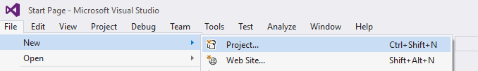

4、左侧列表选择 Templates -> Visual C++ -> Win32 Console Application，并设置项目名为 MyFirstProgram。

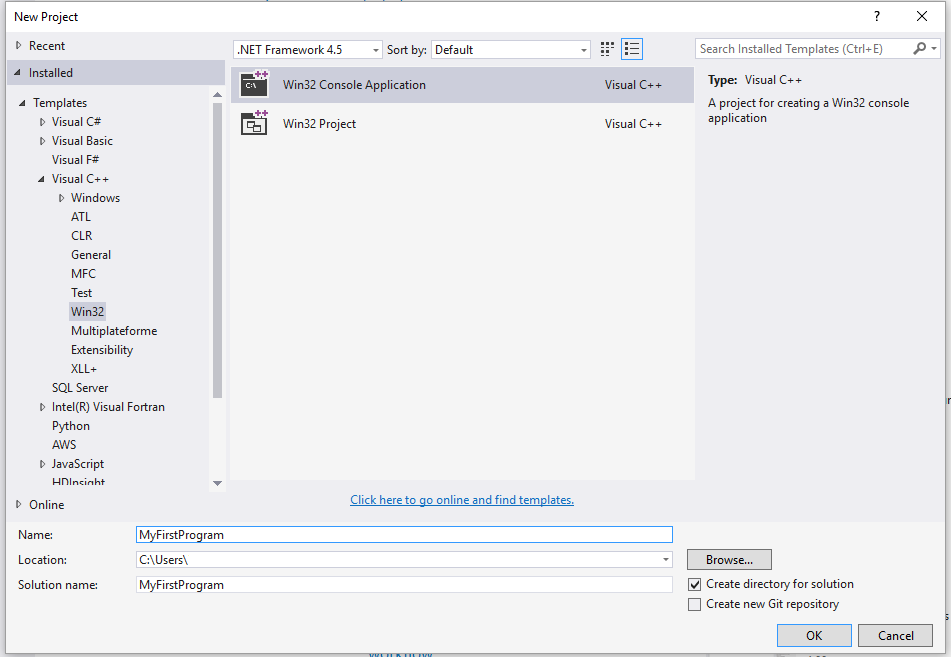


5、点击 OK。

6、在以下窗口中点击 Next

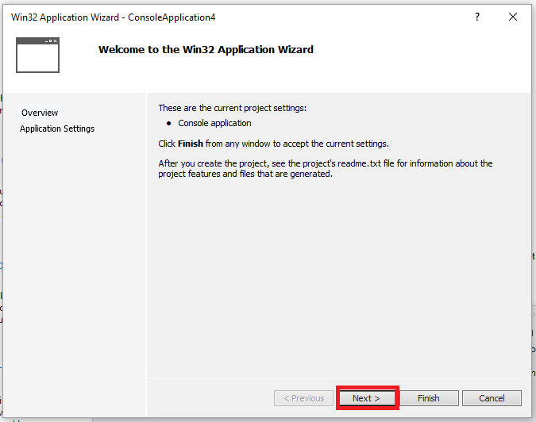

7、在弹出的窗口中选择 Empty project 选项后，点击 Finish 按钮：

8、右击文件夹 Source File 并点击 Add --> New Item... :

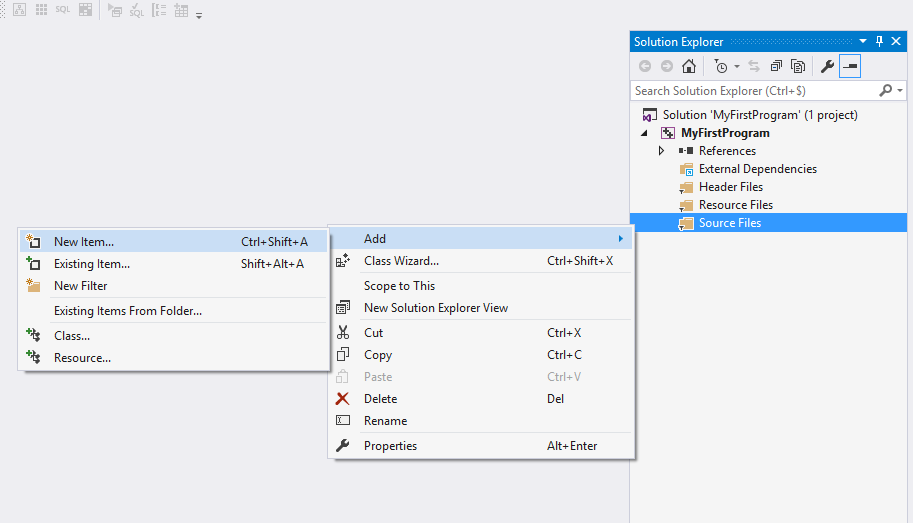

9、选择 C++ File 然后设置文件名为 main.cpp，然后点击 Add：

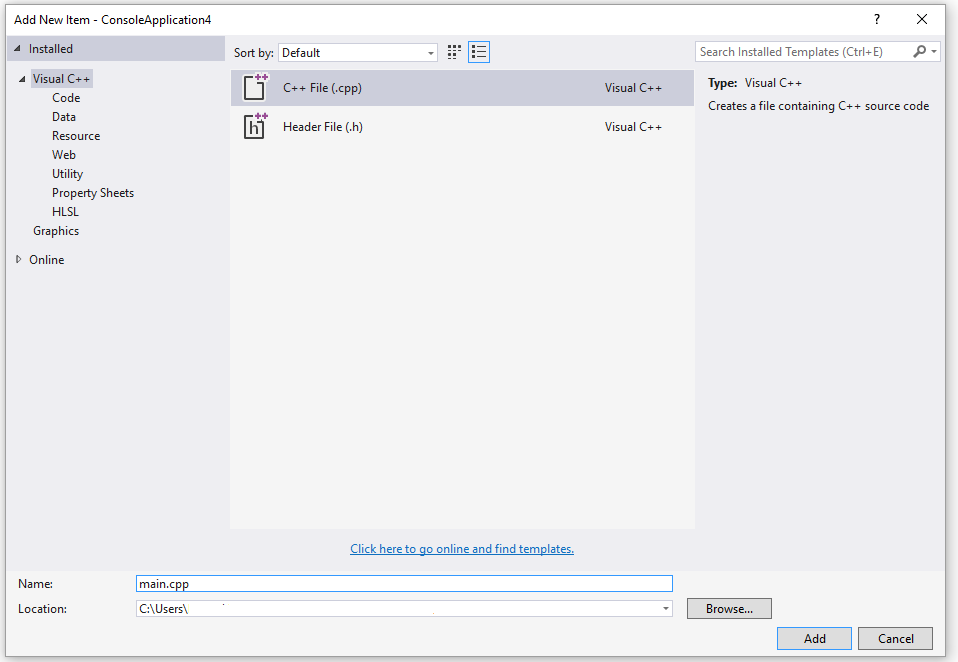


10、拷贝以下代码到 main.cpp 中：

```
#include <iostream>

int main()
{
    std::cout << "Hello World!\n";
    return 0;
}
```

界面如下所示：

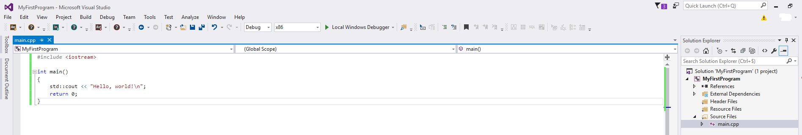

11、点击菜单上的 Debug -> Start Without Debugging (或按下 ctrl + F5) :

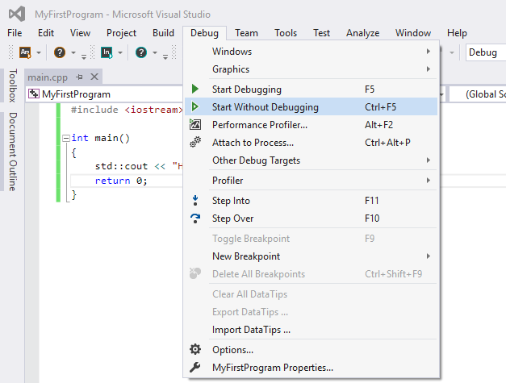

12、完成以上操作后，你可以看到以下输出：

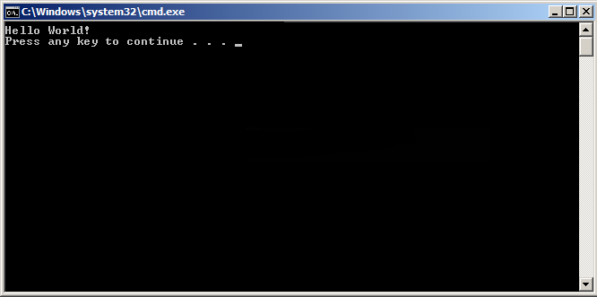

------

## g++ 应用说明

程序 g++ 是将 gcc 默认语言设为 C++ 的一个特殊的版本，链接时它自动使用 C++ 标准库而不用 C 标准库。通过遵循源码的命名规范并指定对应库的名字，用 gcc 来编译链接 C++ 程序是可行的，如下例所示：

```shell
$ gcc main.cpp -lstdc++ -o main
```

下面是一个保存在文件 helloworld.cpp 中一个简单的 C++ 程序的代码：

```c++
#include <iostream>
using namespace std;
int main()
{
    cout << "Hello, world!" << endl;
    return 0;
}
```

最简单的编译方式：

```shell
$ g++ helloworld.cpp
```

由于命令行中未指定可执行程序的文件名，编译器采用默认的 a.out。程序可以这样来运行：

```
$ ./a.out
Hello, world!
```

通常我们使用 **-o** 选项指定可执行程序的文件名，以下实例生成一个 helloworld 的可执行文件：

```
$ g++ helloworld.cpp -o helloworld
```

执行 helloworld:

```
$ ./helloworld
Hello, world!
```

如果是多个 C++ 代码文件，如 runoob1.cpp、runoob2.cpp，编译命令如下：

```
$ g++ runoob1.cpp runoob2.cpp -o runoob
```

生成一个 runoob 可执行文件。

g++ 有些系统默认是使用 C++98，我们可以指定使用 C++11 来编译 main.cpp 文件：

```
g++ -g -Wall -std=c++11 main.cpp
```

### g++ 常用命令选项

| 选项         | 解释                                                         |
| :----------- | :----------------------------------------------------------- |
| -ansi        | 只支持 ANSI 标准的 C 语法。这一选项将禁止 GNU C 的某些特色， 例如 asm 或 typeof 关键词。 |
| -c           | 只编译并生成目标文件。                                       |
| -DMACRO      | 以字符串"1"定义 MACRO 宏。                                   |
| -DMACRO=DEFN | 以字符串"DEFN"定义 MACRO 宏。                                |
| -E           | 只运行 C 预编译器。                                          |
| -g           | 生成调试信息。GNU 调试器可利用该信息。                       |
| -IDIRECTORY  | 指定额外的头文件搜索路径DIRECTORY。                          |
| -LDIRECTORY  | 指定额外的函数库搜索路径DIRECTORY。                          |
| -lLIBRARY    | 连接时搜索指定的函数库LIBRARY。                              |
| -m486        | 针对 486 进行代码优化。                                      |
| -o           | FILE 生成指定的输出文件。用在生成可执行文件时。              |
| -O0          | 不进行优化处理。                                             |
| -O           | 或 -O1 优化生成代码。                                        |
| -O2          | 进一步优化。                                                 |
| -O3          | 比 -O2 更进一步优化，包括 inline 函数。                      |
| -shared      | 生成共享目标文件。通常用在建立共享库时。                     |
| -static      | 禁止使用共享连接。                                           |
| -UMACRO      | 取消对 MACRO 宏的定义。                                      |
| -w           | 不生成任何警告信息。                                         |
| -Wall        | 生成所有警告信息。                                           |


# 2. 基础语法


C++ 程序可以定义为对象的集合，这些对象通过调用彼此的方法进行交互。现在让我们简要地看一下什么是类、对象，方法、即时变量。

- **对象 -** 对象具有状态和行为。例如：一只狗的状态 - 颜色、名称、品种，行为 - 摇动、叫唤、吃。对象是类的实例。
- **类 -** 类可以定义为描述对象行为/状态的模板/蓝图。
- **方法 -** 从基本上说，一个方法表示一种行为。一个类可以包含多个方法。可以在方法中写入逻辑、操作数据以及执行所有的动作。
- **即时变量 -** 每个对象都有其独特的即时变量。对象的状态是由这些即时变量的值创建的。

## 1. C++ 程序结构

让我们看一段简单的代码，可以输出单词 *Hello World*。

## 2. 实例

```c++
#include <iostream>
using namespace std;
 
// main() 是程序开始执行的地方
 
int main()
{
   cout << "Hello World"; // 输出 Hello World
   return 0;
}
```

接下来我们讲解一下上面这段程序：

- C++ 语言定义了一些头文件，这些头文件包含了程序中必需的或有用的信息。上面这段程序中，包含了头文件 **<iostream>**。
- 下一行 **using namespace std;** 告诉编译器使用 std 命名空间。命名空间是 C++ 中一个相对新的概念。
- 下一行 **// main() 是程序开始执行的地方** 是一个单行注释。单行注释以 // 开头，在行末结束。
- 下一行 **int main()** 是主函数，程序从这里开始执行。
- 下一行 **cout << "Hello World";** 会在屏幕上显示消息 "Hello World"。
- 下一行 **return 0;** 终止 main( )函数，并向调用进程返回值 0。

## 3. 编译 & 执行 C++ 程序

接下来让我们看看如何把源代码保存在一个文件中，以及如何编译并运行它。下面是简单的步骤：

- 打开一个文本编辑器，添加上述代码。
- 保存文件为 hello.cpp。
- 打开命令提示符，进入到保存文件所在的目录。
- 键入 'g++ hello.cpp '，输入回车，编译代码。如果代码中没有错误，命令提示符会跳到下一行，并生成 a.out 可执行文件。
- 现在，键入 ' a.out' 来运行程序。
- 您可以看到屏幕上显示 ' Hello World '。

```
$ g++ hello.cpp
$ ./a.out
Hello World
```

请确保您的路径中已包含 g++ 编译器，并确保在包含源文件 hello.cpp 的目录中运行它。

您也可以使用 makefile 来编译 C/C++ 程序。

## 4. C++ 中的分号 & 语句块

在 C++ 中，分号是语句结束符。也就是说，每个语句必须以分号结束。它表明一个逻辑实体的结束。

例如，下面是三个不同的语句：

```c++
x = y;
y = y+1; 
add(x, y);
```


语句块是一组使用大括号括起来的按逻辑连接的语句。例如：

```c++
{   
    cout << "Hello World"; // 输出 Hello World   
    return 0;
}
```


C++ 不以行末作为结束符的标识，因此，您可以在一行上放置多个语句。例如：

```C++
x = y;
y = y+1; 
add(x, y);
```

等同于

```C++
x = y; y = y+1; add(x, y);
```


## 5. C++ 标识符

C++ 标识符是用来标识变量、函数、类、模块，或任何其他用户自定义项目的名称。一个标识符以字母 A-Z 或 a-z 或下划线 _ 开始，后跟零个或多个字母、下划线和数字（0-9）。

C++ 标识符内不允许出现标点字符，比如 @、& 和 %。C++ 是区分大小写的编程语言。因此，在 C++ 中，**Manpower** 和 **manpower** 是两个不同的标识符。

下面列出几个有效的标识符：

```
mohd       zara    abc   move_name  a_123
myname50   _temp   j     a23b9      retVal
```

## 6. C++ 关键字

下表列出了 C++ 中的保留字。这些保留字不能作为常量名、变量名或其他标识符名称。

| asm          | else      | new              | this     |
| ------------ | --------- | ---------------- | -------- |
| auto         | enum      | operator         | throw    |
| bool         | explicit  | private          | true     |
| break        | export    | protected        | try      |
| case         | extern    | public           | typedef  |
| catch        | false     | register         | typeid   |
| char         | float     | reinterpret_cast | typename |
| class        | for       | return           | union    |
| const        | friend    | short            | unsigned |
| const_cast   | goto      | signed           | using    |
| continue     | if        | sizeof           | virtual  |
| default      | inline    | static           | void     |
| delete       | int       | static_cast      | volatile |
| do           | long      | struct           | wchar_t  |
| double       | mutable   | switch           | while    |
| dynamic_cast | namespace | template         |          |

完整关键字介绍可查阅：[C++ 的关键字（保留字）完整介绍](https://www.runoob.com/w3cnote/cpp-keyword-intro.html)


## 7. 三字符组

三字符组就是用于表示另一个字符的三个字符序列，又称为三字符序列。三字符序列总是以两个问号开头。

三字符序列不太常见，但 C++ 标准允许把某些字符指定为三字符序列。以前为了表示键盘上没有的字符，这是必不可少的一种方法。

三字符序列可以出现在任何地方，包括字符串、字符序列、注释和预处理指令。

下面列出了最常用的三字符序列：

| 三字符组 | 替换 |
| :------- | :--- |
| ??=      | #    |
| ??/      | \    |
| ??'      | ^    |
| ??(      | [    |
| ??)      | ]    |
| ??!      | \|   |
| ??<      | {    |
| ??>      | }    |
| ??-      | ~    |

如果希望在源程序中有两个连续的问号，且不希望被预处理器替换，这种情况出现在字符常量、字符串字面值或者是程序注释中，可选办法是用字符串的自动连接："...?""?..."或者转义序列："...?\?..."。

从Microsoft Visual C++ 2010版开始，该编译器默认不再自动替换三字符组。如果需要使用三字符组替换（如为了兼容古老的软件代码），需要设置编译器命令行选项/Zc:trigraphs

g++仍默认支持三字符组，但会给出编译警告。

## 8. C++ 中的空格

只包含空格的行，被称为空白行，可能带有注释，C++ 编译器会完全忽略它。

在 C++ 中，空格用于描述空白符、制表符、换行符和注释。空格分隔语句的各个部分，让编译器能识别语句中的某个元素（比如 int）在哪里结束，下一个元素在哪里开始。因此，在下面的语句中：

```
int age;
```

在这里，int 和 age 之间必须至少有一个空格字符（通常是一个空白符），这样编译器才能够区分它们。另一方面，在下面的语句中：

```
fruit = apples + oranges;   // 获取水果的总数
```

fruit 和 =，或者 = 和 apples 之间的空格字符不是必需的，但是为了增强可读性，您可以根据需要适当增加一些空格。


# 3. C++ 注释

程序的注释是解释性语句，您可以在 C++ 代码中包含注释，这将提高源代码的可读性。所有的编程语言都允许某种形式的注释。

C++ 支持单行注释和多行注释。注释中的所有字符会被 C++ 编译器忽略。

C++ 注释一般有两种：

- **//** - 一般用于单行注释。
- /*** ... \*/** - 一般用于多行注释。

注释以 **//** 开始，直到行末为止。例如：

```c++
#include <iostream>
using namespace std;
 
int main() {
  // 这是一个注释
  cout << "Hello World!";
  return 0;
}
```

也可以放在语句后面：

```C++
#include <iostream>
using namespace std;
 
int main()
{
   cout << "Hello World!"; // 输出 Hello World!
 
   return 0;
}
```


当上面的代码被编译时，编译器会忽略 **// 这是一个注释** 和 **// 输出 Hello World!**，最后会产生以下结果：

```c++
Hello World!
```

C++ 注释以 **/\*** 开始，以 ***/** 终止。例如：

```C++
#include <iostream> 
 using namespace std;  
int main() {  
    /* 这是注释 */     /* C++ 注释也可以     * 跨行     */   
    cout << "Hello World!";    return 0; 
}
```


在 **/\*** 和 ***/** 注释内部，**//** 字符没有特殊的含义。在 **//** 注释内，**/\*** 和 ***/** 字符也没有特殊的含义。因此，您可以在一种注释内嵌套另一种注释。例如：

```c++
/* 用于输出 Hello World 的注释  cout << "Hello World"; // 输出 Hello World  */
```


# 4. C++ 数据类型

使用编程语言进行编程时，需要用到各种变量来存储各种信息。变量保留的是它所存储的值的内存位置。这意味着，当您创建一个变量时，就会在内存中保留一些空间。

您可能需要存储各种数据类型（比如字符型、宽字符型、整型、浮点型、双浮点型、布尔型等）的信息，操作系统会根据变量的数据类型，来分配内存和决定在保留内存中存储什么。

## 1. 基本的内置类型

C++ 为程序员提供了种类丰富的内置数据类型和用户自定义的数据类型。下表列出了七种基本的 C++ 数据类型：

| 类型     | 关键字  |
| :------- | :------ |
| 布尔型   | bool    |
| 字符型   | char    |
| 整型     | int     |
| 浮点型   | float   |
| 双浮点型 | double  |
| 无类型   | void    |
| 宽字符型 | wchar_t |

其实 wchar_t 是这样来的：

```
typedef short int wchar_t;
```

所以 wchar_t 实际上的空间是和 short int 一样。

一些基本类型可以使用一个或多个类型修饰符进行修饰：

- signed
- unsigned
- short
- long

下表显示了各种变量类型在内存中存储值时需要占用的内存，以及该类型的变量所能存储的最大值和最小值。

**注意：**不同系统会有所差异，一字节为 8 位。

**注意：**默认情况下，int、short、long都是带符号的，即 signed。

**注意：**long int 8 个字节，int 都是 4 个字节，早期的 C 编译器定义了 long int 占用 4 个字节，int 占用 2 个字节，新版的 C/C++ 标准兼容了早期的这一设定。

| 类型               | 位            | 范围                                                         |
| :----------------- | :------------ | :----------------------------------------------------------- |
| char               | 1 个字节      | -128 到 127 或者 0 到 255                                    |
| unsigned char      | 1 个字节      | 0 到 255                                                     |
| signed char        | 1 个字节      | -128 到 127                                                  |
| int                | 4 个字节      | -2147483648 到 2147483647                                    |
| unsigned int       | 4 个字节      | 0 到 4294967295                                              |
| signed int         | 4 个字节      | -2147483648 到 2147483647                                    |
| short int          | 2 个字节      | -32768 到 32767                                              |
| unsigned short int | 2 个字节      | 0 到 65,535                                                  |
| signed short int   | 2 个字节      | -32768 到 32767                                              |
| long int           | 8 个字节      | -9,223,372,036,854,775,808 到 9,223,372,036,854,775,807      |
| signed long int    | 8 个字节      | -9,223,372,036,854,775,808 到 9,223,372,036,854,775,807      |
| unsigned long int  | 8 个字节      | 0 到 18,446,744,073,709,551,615                              |
| float              | 4 个字节      | 精度型占4个字节（32位）内存空间，+/- 3.4e +/- 38 (~7 个数字) |
| double             | 8 个字节      | 双精度型占8 个字节（64位）内存空间，+/- 1.7e +/- 308 (~15 个数字) |
| long long          | 8 个字节      | 双精度型占8 个字节（64位）内存空间，表示 -9,223,372,036,854,775,807 到 9,223,372,036,854,775,807 的范围 |
| long double        | 16 个字节     | 长双精度型 16 个字节（128位）内存空间，可提供18-19位有效数字。 |
| wchar_t            | 2 或 4 个字节 | 1 个宽字符                                                   |

> 注意，各种类型的存储大小与系统位数有关，但目前通用的以64位系统为主。
>
> 以下列出了32位系统与64位系统的存储大小的差别（windows 相同）：
>
> 

从上表可得知，变量的大小会根据编译器和所使用的电脑而有所不同。

下面实例会输出您电脑上各种数据类型的大小。

## 实例

```c++
#include<iostream>  
#include <limits>
 
using namespace std;  
  
int main()  
{  
    cout << "type: \t\t" << "************size**************"<< endl;  
    cout << "bool: \t\t" << "所占字节数：" << sizeof(bool);  
    cout << "\t最大值：" << (numeric_limits<bool>::max)();  
    cout << "\t\t最小值：" << (numeric_limits<bool>::min)() << endl;  
    cout << "char: \t\t" << "所占字节数：" << sizeof(char);  
    cout << "\t最大值：" << (numeric_limits<char>::max)();  
    cout << "\t\t最小值：" << (numeric_limits<char>::min)() << endl;  
    cout << "signed char: \t" << "所占字节数：" << sizeof(signed char);  
    cout << "\t最大值：" << (numeric_limits<signed char>::max)();  
    cout << "\t\t最小值：" << (numeric_limits<signed char>::min)() << endl;  
    cout << "unsigned char: \t" << "所占字节数：" << sizeof(unsigned char);  
    cout << "\t最大值：" << (numeric_limits<unsigned char>::max)();  
    cout << "\t\t最小值：" << (numeric_limits<unsigned char>::min)() << endl;  
    cout << "wchar_t: \t" << "所占字节数：" << sizeof(wchar_t);  
    cout << "\t最大值：" << (numeric_limits<wchar_t>::max)();  
    cout << "\t\t最小值：" << (numeric_limits<wchar_t>::min)() << endl;  
    cout << "short: \t\t" << "所占字节数：" << sizeof(short);  
    cout << "\t最大值：" << (numeric_limits<short>::max)();  
    cout << "\t\t最小值：" << (numeric_limits<short>::min)() << endl;  
    cout << "int: \t\t" << "所占字节数：" << sizeof(int);  
    cout << "\t最大值：" << (numeric_limits<int>::max)();  
    cout << "\t最小值：" << (numeric_limits<int>::min)() << endl;  
    cout << "unsigned: \t" << "所占字节数：" << sizeof(unsigned);  
    cout << "\t最大值：" << (numeric_limits<unsigned>::max)();  
    cout << "\t最小值：" << (numeric_limits<unsigned>::min)() << endl;  
    cout << "long: \t\t" << "所占字节数：" << sizeof(long);  
    cout << "\t最大值：" << (numeric_limits<long>::max)();  
    cout << "\t最小值：" << (numeric_limits<long>::min)() << endl;  
    cout << "unsigned long: \t" << "所占字节数：" << sizeof(unsigned long);  
    cout << "\t最大值：" << (numeric_limits<unsigned long>::max)();  
    cout << "\t最小值：" << (numeric_limits<unsigned long>::min)() << endl;  
    cout << "double: \t" << "所占字节数：" << sizeof(double);  
    cout << "\t最大值：" << (numeric_limits<double>::max)();  
    cout << "\t最小值：" << (numeric_limits<double>::min)() << endl;  
    cout << "long double: \t" << "所占字节数：" << sizeof(long double);  
    cout << "\t最大值：" << (numeric_limits<long double>::max)();  
    cout << "\t最小值：" << (numeric_limits<long double>::min)() << endl;  
    cout << "float: \t\t" << "所占字节数：" << sizeof(float);  
    cout << "\t最大值：" << (numeric_limits<float>::max)();  
    cout << "\t最小值：" << (numeric_limits<float>::min)() << endl;  
    cout << "size_t: \t" << "所占字节数：" << sizeof(size_t);  
    cout << "\t最大值：" << (numeric_limits<size_t>::max)();  
    cout << "\t最小值：" << (numeric_limits<size_t>::min)() << endl;  
    cout << "string: \t" << "所占字节数：" << sizeof(string) << endl;  
    // << "\t最大值：" << (numeric_limits<string>::max)() << "\t最小值：" << (numeric_limits<string>::min)() << endl;  
    cout << "type: \t\t" << "************size**************"<< endl;  
    return 0;  
}
```


本实例使用了 **endl**，这将在每一行后插入一个换行符，**<<** 运算符用于向屏幕传多个值，**sizeof()** 运算符用来获取各种数据类型的大小。

当上面的代码被编译和执行时，它会产生以下的结果，结果会根据所使用的计算机而有所不同：

```
type:         ************size**************
bool:         所占字节数：1    最大值：1        最小值：0
char:         所占字节数：1    最大值：        最小值：?
signed char:     所占字节数：1    最大值：        最小值：?
unsigned char:     所占字节数：1    最大值：?        最小值：
wchar_t:     所占字节数：4    最大值：2147483647        最小值：-2147483648
short:         所占字节数：2    最大值：32767        最小值：-32768
int:         所占字节数：4    最大值：2147483647    最小值：-2147483648
unsigned:     所占字节数：4    最大值：4294967295    最小值：0
long:         所占字节数：8    最大值：9223372036854775807    最小值：-9223372036854775808
unsigned long:     所占字节数：8    最大值：18446744073709551615    最小值：0
double:     所占字节数：8    最大值：1.79769e+308    最小值：2.22507e-308
long double:     所占字节数：16    最大值：1.18973e+4932    最小值：3.3621e-4932
float:         所占字节数：4    最大值：3.40282e+38    最小值：1.17549e-38
size_t:     所占字节数：8    最大值：18446744073709551615    最小值：0
string:     所占字节数：24
type:         ************size**************
```

## typedef 声明

您可以使用 **typedef** 为一个已有的类型取一个新的名字。下面是使用 typedef 定义一个新类型的语法：

```
typedef type newname; 
```

例如，下面的语句会告诉编译器，feet 是 int 的另一个名称：

```
typedef int feet;
```

现在，下面的声明是完全合法的，它创建了一个整型变量 distance：

```
feet distance;
```

## 枚举类型

枚举类型(enumeration)是C++中的一种派生数据类型，它是由用户定义的若干枚举常量的集合。

如果一个变量只有几种可能的值，可以定义为枚举(enumeration)类型。所谓"枚举"是指将变量的值一一列举出来，变量的值只能在列举出来的值的范围内。

创建枚举，需要使用关键字 **enum**。枚举类型的一般形式为：

```
enum 枚举名{ 
     标识符[=整型常数], 
     标识符[=整型常数], 
... 
    标识符[=整型常数]
} 枚举变量;
    
```

如果枚举没有初始化, 即省掉"=整型常数"时, 则从第一个标识符开始。

例如，下面的代码定义了一个颜色枚举，变量 c 的类型为 color。最后，c 被赋值为 "blue"。

```
enum color { red, green, blue } c;
c = blue;
```

默认情况下，第一个名称的值为 0，第二个名称的值为 1，第三个名称的值为 2，以此类推。但是，您也可以给名称赋予一个特殊的值，只需要添加一个初始值即可。例如，在下面的枚举中，**green** 的值为 5。

```
enum color { red, green=5, blue };
```

在这里，**blue** 的值为 6，因为默认情况下，每个名称都会比它前面一个名称大 1，但 red 的值依然为 0。


## 类型转换

类型转换是将一个数据类型的值转换为另一种数据类型的值。

C++ 中有四种类型转换：静态转换、动态转换、常量转换和重新解释转换。

### 静态转换（Static Cast）

静态转换是将一种数据类型的值强制转换为另一种数据类型的值。

静态转换通常用于比较类型相似的对象之间的转换，例如将 int 类型转换为 float 类型。

静态转换不进行任何运行时类型检查，因此可能会导致运行时错误。

## 实例

```C++
int i = 10; float f = static_cast<float>(i); // 静态将int类型转换为float类型
```


### 动态转换（Dynamic Cast）

动态转换通常用于将一个基类指针或引用转换为派生类指针或引用。动态转换在运行时进行类型检查，如果不能进行转换则返回空指针或引发异常。

## 实例

```c++
class Base {}; class Derived : public Base {}; Base* ptr_base = new Derived; Derived* ptr_derived = dynamic_cast<Derived*>(ptr_base); // 将基类指针转换为派生类指针
```


### 常量转换（Const Cast）

常量转换用于将 const 类型的对象转换为非 const 类型的对象。

常量转换只能用于转换掉 const 属性，不能改变对象的类型。

## 实例

```c++
const int i = 10; int& r = const_cast<int&>(i); // 常量转换，将const int转换为int
```


### 重新解释转换（Reinterpret Cast）

重新解释转换将一个数据类型的值重新解释为另一个数据类型的值，通常用于在不同的数据类型之间进行转换。

重新解释转换不进行任何类型检查，因此可能会导致未定义的行为。

## 实例

```c++
int i = 10; float f = reinterpret_cast<float&>(i); // 重新解释将int类型转换为float类型
```

