# 1. C语言基础

前面我们已经搭建好了基本的学习环境，现在就让我们开始C语言的学习吧！

C语言的语法层面内容相比其他语言来说，其实算少的了，但是它的难点在于很多概念上的理解，这也是为什么上一章一直在说一些计算机基础相关内容（包括这一章还会继续补一点），这样会有助于各位对于语言的理解，C语言可以说是步入编程领域的分水岭，跨过了这道坎，后续其他编程语言的学习都会无比轻松。

学习编程的过程可能会很枯燥，但是请各位一定不要心急，一步一个脚印，相信大家一定能通关。

## C程序基本格式

前面我们在创建项目之后自动生成了一个`.c`文件，这个就是我们编写的程序代码文件：

```c
#include <stdio.h>

int main() {
    printf("Hello World!");
  	return 0;
}
```

操作系统需要执行我们的程序，但是我们的程序中可能写了很多很多的代码，那么肯定需要知道从哪里开始执行才可以，也就是程序的入口，所以我们需要提供一个入口点，我们的C语言程序入口点就是`main`函数（不过现在还没有讲到函数，所以各位就理解为固定模式即可）它的写法是：

```c
int main() {  //所有的符号一律采用英文的，别用中文
    程序代码...
}
```

注意是`int`后面空格跟上`main()`，我们的程序代码使用花括号`{}`进行囊括（有的人为了方便查阅，会把前半个花括号写在下面）

然后我们看到，如果我们需要打印一段话到控制台，那么就需要使用`printf(内容)`来完成，这其实就是一种函数调用，但是现在我们还没有接触到，我们注意到括号里面的内容就是我们要打印到控制台的内容：

```c
printf("Hello World!");   //注意最后需要添加;来结束这一行，注意是英文的分号，不是中文的！
```

我们要打印的内容需要采用双引号进行囊括，被双引号囊括的这一端话，我们称为字符串，当然我们现在还没有学到，所以各位也是记固定模式就好，当我们需要向控制台打印一段话时，就要用双引号囊括这段话，然后放入`printf`即可。我们会在后续的学习中逐渐认识`printf`函数。

最顶上还有一句：

```c
#include <stdio.h>
```

这个是引入系统库为我们提供的函数，包括`printf`在内，所以我们以后编写一个C语言程序，就按照固定模式：

```c
#include <stdio.h>

int main() {
    程序代码
}
```

除了程序代码部分我们会进行编写之外，其他的地方采用固定模式就好。

我们在写代码的过程中可以添加一些注释文本，这些文本内容在编译时自动忽略，所以比如我们想边写边记点笔记，就可以添加注释，注释的格式为：

```java
#include <stdio.h>   //引入标准库头文件

int main() {   //主函数，程序的入口点
    printf("Hello World!");  //向控制台打印字符串
}
```

当然我们也可以添加多行注释：

```java
#include <stdio.h>

/*
 * 这是由IDE自动生成的测试代码
 * 还是可以的
 */
int main() {
    printf("Hello World!");
  	//最后还有一句 return 0; 但是我们可以不用写，编译器会自动添加，所以后面讲到之后我们再来说说这玩意。
}
```

OK，基本的一些内容就讲解完毕了。

## 基本数据类型

我们的程序离不开数据，比如我们需要保存一个数字或是字母，这时候这些东西就是作为数据进行保存，不过不同的数据他们的类型可能不同，比如1就是一个整数，0.5就是一个小数，A就是一个字符，C语言提供了多种数据类型供我们使用，我们就可以很轻松的使用这些数据了。

不同的数据类型占据的空间也会不同，这里我们需要先提一个概念，就是字、字节是什么？

我们知道，计算机底层实际上只有0和1能够表示，这时如果我们要存储一个数据，比如十进制的3，那么就需要使用2个二进制位来保存，二进制格式为`11`，占用两个位置，再比如我们要表示十进制的15，这时转换为二进制就是`1111`占用四个位置（4个bit位）来保存。一般占用8个bit位表示一个字节（B），2个字节等于1个字，所以一个字表示16个bit位，它们是计量单位。

我们常说的内存大小1G、2G等，实际上就是按照下面的进制进行计算的：

8 bit = 1 B ，1024 B = 1KB，1024 KB = 1 MB，1024 MB = 1GB，1024 GB = 1TB，1024TB = 1PB（基本上是1024一个大进位，但是有些硬盘生产厂商是按照1000来计算的，所以我们买电脑的硬盘容量可能是512G的但是实际容量可能会缩水）

在不同位数的系统下基本数据类型的大小可能会不同，因为现在主流已经是64位系统，本教程统一按照64位系统进行讲解。

### 原码、反码和补码

#### 原码

上面我们说了实际上所有的数字都是使用0和1这样的二进制数来进行表示的，但是这样仅仅只能保存正数，那么负数怎么办呢？

比如现在一共有4个bit位来保存我们的数据，为了表示正负，我们可以让第一个bit位专门来保存符号，这样，我们这4个bit位能够表示的数据范围就是：

- 最小：1111 => - (2^2+2^1+2^0) => -7
- 最大：0111 => + (2^2+2^1+2^0) => +7 => 7

虽然原码表示简单，但是原码在做加减法的时候，很麻烦！以4bit位为例：

1+(-1) = 0001 + 1001 = 怎么让计算机去计算？（虽然我们知道该去怎么算，但是计算机不知道，计算机顶多知道1+1需要进位！）

我们得创造一种更好的表示方式！于是我们引入了反码：

#### 反码

正数的反码是其本身
负数的反码是在其原码的基础上, 符号位不变，其余各个位取反
经过上面的定义，我们再来进行加减法：

1+(-1) = 0001 + 1110 = 1111 => -0 （直接相加，这样就简单多了！）

思考：1111代表-0，0000代表+0，在我们实数的范围内，0有正负之分吗？

0既不是正数也不是负数，那么显然这样的表示依然不够合理！

#### 补码

根据上面的问题，我们引入了最终的解决方案，那就是补码，定义如下：

正数的补码就是其本身 （不变！）
负数的补码是在其原码的基础上, 符号位不变, 其余各位取反, 最后+1. (即在反码的基础上+1)
其实现在就已经能够想通了，-0其实已经被消除了！我们再来看上面的运算：

1+(-1) = 0001 + 1111 = (1)0000 => +0 （现在无论你怎么算，也不会有-0了！）

所以现在，4bit位能够表示的范围是：-8~+7（C使用的就是补码！）

### 整数类型

我们首先来看看整数类型，整数就是不包含小数点的数据，比如`1`，`99`，`666`等数字，整数包含以下几种类型：

* int   -    占用 4 个字节，32个bit位，能够表示 -2,147,483,648 到 2,147,483,647 之间的数字，默认一般都是使用这种类型
* long   -   占用 8 个字节，64个bit位。
* short   -    占用2个字节，16个bit位。

### 浮点类型

浮点类一般用于保存小数，不过为啥不叫小数类型而是浮点类型呢？因为我们的一个小数分为整数部分和小数部分，我们需要用一部分的bit位去表示整数部分，而另一部分去表示小数部分，至于整数部分和小数部分各自占多少并不是固定的，而是浮动决定的（在计算机组成原理中会深入学习，这里就不多介绍了）

* float   -   单精度浮点，占用4个字节，32个bit位。
* double    -    双精度浮点，占用8个字节，64个bit位。

### 字符类型

除了保存数字之外，C语言还支持字符类型，我们的每一个字符都可以使用字符类型来保存：

* char   -    占用1个字节（-128~127），可以表示所有的ASCII码字符，每一个数字对应的是编码表中的一个字符：

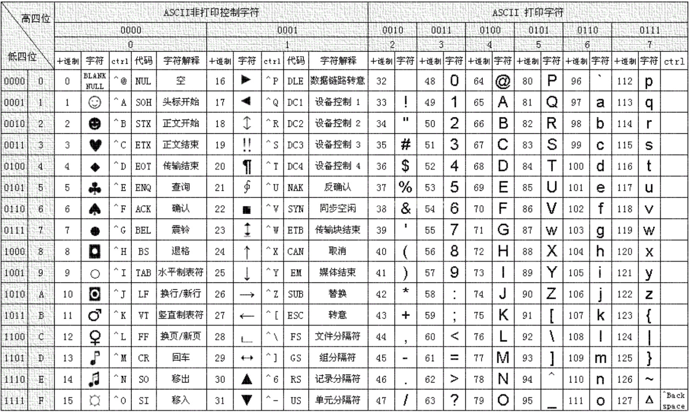

编码表中包含了所有我们常见的字符，包括运算符号、数字、大小写字母等（注意只有英文相关的，没有中文和其他语言字符，包括中文的标点符号也没有）

某些无法直接显示的字符（比如换行，换行也算一个字符）需要使用转义字符来进行表示：

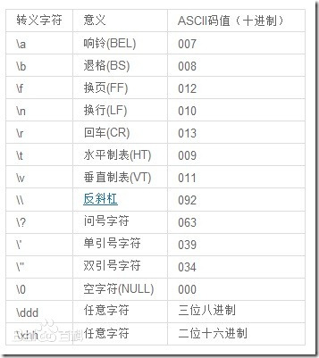

有关基本类型的具体使用我们放到下一节进行讲解。

***

## 变量

前面我们了解了C语言中的基本类型，那么我们如何使用呢？这时我们就可以创建不同类型的变量了。

### 变量的使用

变量就像我们在数学中学习的`x`，`y`一样，我们可以直接声明一个变量，并利用这些变量进行基本的运算，声明变量的格式为：

```c
数据类型 变量名称 = 初始值;    //其中初始值可以不用在定义变量时设定
// = 是赋值操作，可以将等号后面的值赋值给前面的变量，等号后面可以直接写一个数字（常量）、变量名称、算式
```

比如我们现在想要声明一个整数类型的变量：

```java
int a = 10;   //变量类型为int（常用），变量名称为a，变量的初始值为10
```

```c
int a = 10, b = 20;   //多个变量可以另起一行编写，也可以像这样用逗号隔开，注意类型必须是一样的
```

其中，变量的名称并不是随便什么都可以的，它有以下规则：

* 不能重复使用其他变量使用过的名字。
* 只能包含英文字母或是下划线、数字，并且严格区分大小写，比如`a`和`A`不算同一个变量。
* 虽然可以包含数字，但是不能以数字开头。
* 不能是关键字（比如我们上面提到的所有基本数据类型，当然还有一些关键字我们会在后面认识）
* （建议）使用英文单词，不要使用拼音，多个词可以使用驼峰命名法或是通过下划线连接。

初始值可以是一个常量数据（比如直接写10、0.5这样的数字）也可以是其他变量，或是运算表达式的结果，这样会将其他变量的值作为初始值。

我们可以使用变量来做一些基本的运算：

```java
#include <stdio.h>

int main() {
    int a = 10;  //将10作为a的值
    int b = 20;
    int c = a + b;   //注意变量一定要先声明再使用，这里是计算a + b的结果（算式），并作为c的初始值
}
```

这里使用到了`+`运算符（之后我们还会介绍其他类型的运算符）这个运算符其实就是我们数学中学习的加法运算，会将左右两边的变量值加起来，得到结果，我们可以将运算结果作为其他变量的初始值，还是很好理解的。

但是现在虽然做了运算，我们还不知道运算的具体结果是什么，所以这里我们通过前面认识的`printf`函数来将结果打印到控制台：

```c
#include <stdio.h>

int main() {
    int a = 10;
    int b = 20;
    int c = a + b;

    printf(c);   //直接打印变量c
}
```

但是我们发现这样似乎运行不出来结果，不对啊，前面你不是说把要打印到控制台的内容写到`printf`中吗，怎么这里不行呢？实际上`printf`是用于格式化打印的，我们来看看如何进行格式化打印，输出我们的变量值：

```c
printf("c的结果是：%d", );   //使用%d来代表一个整数类型的数据（占位符），在打印时会自动将c的值替换上去
```

我们来看看效果：


这样，我们就知道该如何打印我们变量的值了，当然，除了使用`%d`打印有符号整数之外，还有其他的：

| 格式控制符                      | 说明                                                         |
| ------------------------------- | ------------------------------------------------------------ |
| %c                              | 输出一个单一的字符                                           |
| %hd、%d、%ld                    | 以十进制、有符号的形式输出 short、int、long 类型的整数       |
| %hu、%u、%lu                    | 以十进制、无符号的形式输出 short、int、long 类型的整数       |
| %ho、%o、%lo                    | 以八进制、不带前缀、无符号的形式输出 short、int、long 类型的整数 |
| %#ho、%#o、%#lo                 | 以八进制、带前缀、无符号的形式输出 short、int、long 类型的整数 |
| %hx、%x、%lx %hX、%X、%lX       | 以十六进制、不带前缀、无符号的形式输出 short、int、long 类型的整数。如果 x 小写，那么输出的十六进制数字也小写；如果 X 大写，那么输出的十六进制数字也大写。 |
| %#hx、%#x、%#lx %#hX、%#X、%#lX | 以十六进制、带前缀、无符号的形式输出 short、int、long 类型的整数。如果 x 小写，那么输出的十六进制数字和前缀都小写；如果 X 大写，那么输出的十六进制数字和前缀都大写。 |
| %f、%lf                         | 以十进制的形式输出 float、double 类型的小数                  |
| %e、%le %E、%lE                 | 以指数的形式输出 float、double 类型的小数。如果 e 小写，那么输出结果中的 e 也小写；如果 E 大写，那么输出结果中的 E 也大写。 |
| %g、%lg %G、%lG                 | 以十进制和指数中较短的形式输出 float、double 类型的小数，并且小数部分的最后不会添加多余的 0。如果 g 小写，那么当以指数形式输出时 e 也小写；如果 G 大写，那么当以指数形式输出时 E 也大写。 |
| %s                              | 输出一个字符串                                               |

比如现在我们要进行小数的运算，还记得我们前面介绍的小数类型有哪些吗？

```c
#include <stdio.h>

int main() {
    double a = 0.5;
    float b = 2.5f;   //注意直接写2.5默认表示的是一个double类型的值，我们需要再后面加一个f或是F表示是flaot类型值

    printf("a + b的结果是：%f", a + b);   //根据上表得到，小数类型需要使用%f表示，这里我们可以直接将a + b放入其中
}
```

可以看到，结果也是正确的：

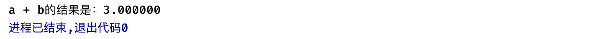

当然，我们也可以一次性打印多个，只需要填写多个占位符表示即可：

```c
#include <stdio.h>

int main() {
    double a = 0.5;
    float b = 2.5f;   //整数类型默认是int，如果要表示为long类型的值，也是需要在最后添加一个l或L

    printf("a = %f, b = %f", a, b);   //后面可以一直添加（逗号隔开），但是注意要和前面的占位符对应
}
```

结果也是正常的：

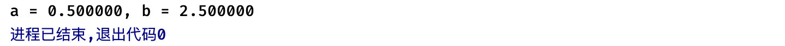

我们再来看看字符类型：

```c
char c = 'A';   //字符需要使用单引号囊括，且只能有一个字符，不能写成'AA'，这就不是单个字符了
//注意这里的A代表的是A这个字符，对应的ASCII码是65，实际上c存储的是65这个数字
```

我们也可以通过格式化打印来查看它的值：

```c
#include <stdio.h>

int main() {
    char c = 'A';
    printf("变量c的值为：%c 对应的ASCII码为：%d", c, c);   //这里我们使用%c来以字符形式输出，%d输出的是变量数据的整数形式，其实就是对应的ASCII码
}
```


当然，我们也可以直接让char存储一个数字（ASCII码），同样也可以打印出对应的字符：

```c
#include <stdio.h>

int main() {
    char c = 66;
    printf("变量c的值为：%c 对应的ASCII码为：%d", c, c);
}
```


那么现在请各位小伙伴看看下面这段代码会输出什么：

```c
#include <stdio.h>

int main() {
    int a = 10;
    char c = 'a';
    printf("变量c的ASCII码为：%d", c);
}
```

没错，这里得到的结果就是字符`a`的ASCII码值，注意千万不要认为c得到的是变量a的值，这里使用的是字符`a`，跟上面的变量a半毛钱关系都没有：


但是如果我们去掉引号，就相当于把变量a的值给了c，c现在的ASCII码就是10了，所以这里一定要分清楚。

对于某些无法表示的字符，比如换行这类字符，我们没办法直接敲出来，只能使用转义字符进行表示：

```c
char c = '\n';
```

详细的转义字符表参见前面的基本数据类型章节。

变量除了有初始值之外，也可以在后续的过程中得到新的值：

```c
#include <stdio.h>

int main() {
    short s = 10;
    s = 20;    //重新赋值为20，注意这里就不要再指定类型了，指定类型只有在声明变量时才需要
    printf("%d", s);   //打印结果
}
```

可以看到，得到的是我们最后一次对变量修改的结果：


那要是我们不对变量设定初始值呢？那么变量会不会有默认值：

```c
#include <stdio.h>

int main() {
    int a, b, c, d;
    printf("%d,%d,%d,%d", a, b, c, d);
}
```

可以看到，虽然定义变量但是我们没有为其设定初始值，那么它的值就是不确定的了（千万注意并不是不设定值默认就是0）：


所以各位小伙伴以后在使用时一定要注意这个问题，至于为什么不是0，这是因为内存分配机制，我们在下一章高级篇再进行讲解。

我们再来看一个例子：

```c
#include <stdio.h>

int main() {
    char c = 127;    //已经到达c的最大值了
    c = c + 1;   //我不管，我就要再加
    printf("%d", c);    //这时会得到什么结果？
}
```

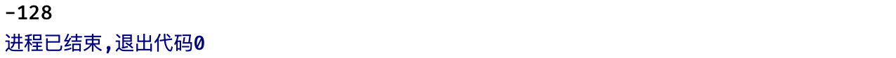

怎么127加上1还变成-128了呢？这是由于位数不够，导致运算结果值溢出：

* 127  +   1= 01111111   +    1
* 由于现在是二进制，满2进1，所以最后变成
* 10000000   =   补码形式的 -128

所以，了解上面这些计算机底层原理是很重要的，我们能够很轻松地知道为什么会这样。

在我们的运算中，可能也会存在一些一成不变的值，比如`π`的值永远都是`3.1415....`，在我们的程序中，也可以使用这样不可变的变量，我们成为常量。

定义常量和变量比较类似，但是需要在前面添加一个`const`关键字，表示这是一个常量：


可以看到，常量在一开始设定初始值后，后续是不允许进行修改的。

### 无符号数

我们知道，所有的数据底层都是采用二进制来进行保存的，而第一位则是用于保存符号位，但是如果我们不考虑这个符号位，那么所有的数都是按照正数来表示，比如考虑了符号位的`char`类型：

* 考虑符号表示范围：-128~127
* 不考虑符号：0~255

我们也可以直接使用这些不带符号位的数据类型：

```c
int main() {
    unsigned char c = -65;   //数据类型前面添加unsigned关键字表示采用无符号形式
    printf("%u", c);    //%u以无符号形式输出十进制数据
}
```

可以看到这里给了无符号char类型c一个-65的值，但是现在很明显符号位也是作为数值的表示部分，所以结果肯定不是-65：

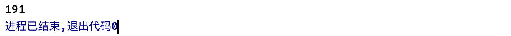

结合我们前面学习的基础知识，我们来看看为什么得到的是191这个数字。首先char类型占据一个字节，8个bit位：

* 00000000   ->    现在赋值-65    ->    -65的补码形式   ->     10111111
* 由于现在没有符号位，一律都是正数，所以，10111111  =  128 + 32 + 16 + 8 + 4 + 2 + 1 = 191

我们也可以直接以无符号数形式打印：

```c
#include <stdio.h>

int main() {
    int i = -1;
    printf("%u", i);    //%u以无符号形式输出十进制数据
}
```


得到无符号int的最大值。

### 类型转换

一种类型的数据可以转换为其他类型的数据，这种操作我们称为类型转换，类型转换分为**自动类型转换**和**强制类型转换**，比如我们现在希望将一个short类型的数据转换为int类型的数据：

```java
#include <stdio.h>

int main() {
    short s = 10;
    int i = s;   //直接将s的值传递给i即可，但是注意此时s和i的类型不同
}
```

这里其实就是一种自动类型转换，自动类型转换就是编译器隐式地进行的数据类型转换，这种转换不需要我们做什么，我们直接写就行，会自动进行转换操作。

```c
float a = 3;    //包括这里我们给的明明是一个int整数3但是却可以赋值给float类型，说明也是进行了自动类型转换
```

如果我们使用一个比转换的类型最大值都还要大的值进行类型转换，比如：

```c
#include <stdio.h>

int main() {
    int a = 511;
    char b = a;   //最大127
    printf("%d", b);
}
```

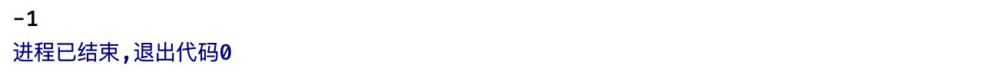

很明显char类型是无法容纳大于127的数据的，因为只占一个字节，而int占4个字节，如果需要进行转换，那么就只能丢掉前面的就只保留char所需要的那几位了，所以这里得到的就是-1：

* 511 = int  ->  00000000 00000000 00000001 11111111
* char   ->   11111111   ->    -1

我们也可以将整数和小数类型的数据进行互相转换：

```c
#include <stdio.h>

int main() {
    int a = 99;
    double d = a;
    printf("%f", d);
}
```

不过这里需要注意的是，小数类型在转换回整数类型时，会丢失小数部分（注意，不是四舍五入，是直接丢失小数！）：

```c
#include <stdio.h>

int main() {
    double a = 3.14;
    int b = a;    //这里编译器还提示了黄标，我们可以通过之后讲到的强制类型转换来处理
    printf("%d", b);
}
```

除了赋值操作可以进行自动类型转换之外，在运算中也会进行自动类型转换，比如：

```c
#include <stdio.h>

int main() {
    float a = 2;
    int b = 3;
    double c = b / a;   //  "/" 是除以的意思，也就是我们数学中的除法运算，这里表示a除以b
    printf("%f", c);
}
```


可以看到，这里得到的结果是小数1.5，但是参与运算的既有整数类型，又有浮点类型，结果为什么就确定为浮点类型了呢？这显然是由于类型转换导致的。那么规则是什么呢？

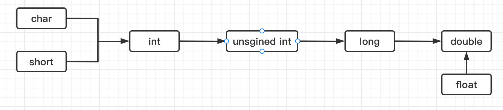

* 不同的类型优先级不同（根据长度而定）
* char和short类型在参与运算时一律转换为int再进行运算。
* 浮点类型默认按双精度进行计算，所以就算有float类型，也会转换为double类型参与计算。
* 当有一个更高优先级的类型和一个低优先级的类型同时参与运算时，统一转换为高优先级运算，比如int和long参与运算，那么int转换为long再算，所以结果也是long类型，int和double参与运算，那么先把int转换为double再算。

我们接着来看看强制类型转换，我们可以为手动去指定类型，强制类型转换格式如下：

```c
(强制转换类型) 变量、常量或表达式;
```

比如：

```c
#include <stdio.h>

int main() {
    int a = (int) 2.5;   //2.5是一个double类型的值，但是我们可以强制转换为int类型赋值给a，强制转换之后小数部分丢失
    printf("%d", a);
}
```

我们也可以对一个算式的结果进行类型转换：

```c
#include <stdio.h>

int main() {
    double a = 3.14;
    int b = (int) (a + 2.8);   //注意得括起来表示对整个算式的结果进行类型转换（括号跟数学中的挺像，也是提升优先级使用的，我们会在运算符部分详细讲解），不然强制类型转换只对其之后紧跟着的变量生效
    printf("%d", b);
}
```

在我们需要得到两个int相除之后带小数的结果时，强制类型转换就显得很有用：

```java
#include <stdio.h>

int main() {
    int a = 10, b = 4;
    double c = a / b;    //不进行任何的类型转换，int除以int结果仍然是int，导致小数丢失
    double d = (double) a / b;   //对a进行强制类型转换，现在是double和int计算，根据上面自动类型转换规则，后面的int自动转换为double，结果也是double了，这样就是正确的结果了
    printf("不进行类型转换: %f, 进行类型转换: %f", c, d);
}
```

合理地使用强制类型转换，能够解决我们很多情况下的计算问题。

***

## 运算符

前面我们了解了如何声明变量以及变量的类型转换，那么我们如何去使用这些变量来参与计算呢？这是我们本小节的重点。

### 基本运算符

基本运算符包含我们在数学中常用的一些操作，比如加减乘除，分别对应：

* 加法运算符：+
* 减法运算符：-
* 乘法运算符：*
* 除法运算符：/（注意不是“\”，看清楚一点）

当然，还有我们之前使用的赋值运算符`=`，我们先来看看赋值运算符的使用，其实在之前我们已经学习过了：

```c
变量 = 值   //其中，值可以直接是一个数字、一个变量、表达式的结果等
```

实际上等号左边的内容准确的说应该是一个左值，不过大部分情况下都是变量，这里就不展开左值和右值的话题了（感兴趣的小伙伴可以去详细了解，有助于后面学习C++理解右值引用）

最简单的用法就是我们前面所说的，对一个变量进行赋值操作：

```c
int a = 10;
```

也可以连续地使用赋值操作，让一连串的变量都等于后面的值：

```c
int a, b;
a = b = 20;   //从右往左依次给b和a赋值20
```

可以看出，实际上`=`运算除了赋值之外，和加减乘除运算一样也是有结果的，比如上面的 a = 就是b = 20 运算的结果（可以看着一个整体），只不过运算的结果就是b被赋值的值，也就是20。

我们接着来看加减法，这个就和我们数学中的是一样的了：

```c
#include <stdio.h>

int main() {
    int a = 10, b = 5;
    printf("%d", a + b);   //打印 a + b 的结果
}
```

当然也可以像数学中那样写在一个数或是变量的最前面，表示是正数：

```c
int a = +10, b = +5;
```

不过默认情况下就是正数，所以没必要去写一个+号。减法运算符其实也是一样的：

```c
#include <stdio.h>

int main() {
    int a = 10, b = 5;
    printf("%d", a - b);   //打印 a - b 的结果
}
```

```c
#include <stdio.h>

int main() {
    int a = -10;   //等于 -10
    printf("%d", -a);   //输出 -a 的值，就反着来嘛
}
```

接着我们来看看乘法和除法运算：

```c
#include <stdio.h>

int main() {
    int a = 20, b = 10;
    printf("%d, %d", a * b, a / b);   //使用方式和上面的加减法是差不多的
}
```

还有一个比较有意思的取模运算：

```c
#include <stdio.h>

int main() {
    int a = 20, b = 8;
    printf("%d", a % b);   //取模运算实际上就是计算a除以b的余数
}
```

不过很遗憾，在C中没有指数相关的运算符（比如要计算5的10次方），在后面学习了循环语句之后，我们可以尝试来自己实现一个指数运算。

### 运算符优先级

和数学中一样，运算符是有优先级的：

```java
#include <stdio.h>

int main() {
    int a = 20, b = 10;
    printf("%d", a + a * b);   //如果没有优先级，那么结果应该是400
}
```

很明显这里的结果是考虑了优先级的：


在数学中，加减运算的优先级是没有乘除运算优先级高的，所以我们需要先计算那些乘除法，最后再来进行加减法的计算，而C语言中也是这样，运算符之间存在优先级概念。我们在数学中，如果需要优先计算加减法再计算乘除法，那么就需要使用括号来提升加减法的优先级，C语言也可以：

```c
#include <stdio.h>

int main() {
    int a = 20, b = 10;
    printf("%d", (a + a) * b);   //优先计算 a + a 的结果，再乘以 b
}
```

那要是遇到多重的呢？类似于下面的这种：

```
数学上的写法：[1 - (3 + 4)] x (-2 ÷ 1) = ?
```

那么我们在C中就可以这样编写：

```java
#include <stdio.h>

int main() {
    printf("%d", (1 - (3 + 4)) * (-2 / 1));   //其实写法基本差不多，只需要一律使用小括号即可
}
```

这样，我们就可以通过`()`运算符，来提升运算优先级了。

我们来总结一下，上面运算符优先级如下，从左往右依次递减：

* `()`  >   `+ - (做符号表示，比如-9)`  >  `* / %`  >  `+ - (做加减运算)`  >  `=`

根据上面的优先级，我们来看看下面`a`的结果是什么：

```c
int c;
int a = (3 + (c = 2)) * 6;
```

```c
int b, c;
int a = (b = 5, c = b + 8);  //逗号运算符从前往后依次执行，赋值结果是最后边的结果
```

### 自增自减运算符

我们可以快速使用自增运算符来将变量的值`+1`，正常情况下我们想要让一个变量值自增需要：

```c
int a = 10;
a = a + 1;
```

现在我们只需要替换为：

```c
int a = 10;
++a;   //使用自增运算符，效果等价于 a = a + 1
```

并且它也是有结果的，除了做自增运算之外，它的结果是自增之后的值：

```c
#include <stdio.h>

int main() {
    int a = 10;
    //int b = a = a + 1;  下面效果完全一致
    int b = ++a;
    printf("%d", b);
}
```

当然我们也可以将自增运算符写到后面，和写在前面的区别是，它是先返回当前变量的结果，再进行自增的，顺序是完全相反的：

```c
#include <stdio.h>

int main() {
    int a = 10;
    int b = a++;   //写在后面和写在前面是有区别的
    printf("a = %d, b = %d", a, b);
}
```

> 重点内容：自增运算符`++`在前，那么先自增再出结果；自增运算符`++`在后，那么先出结果再自增。各位小伙伴可以直接记运算符的位置，来方便记忆。

那要是现在我们不想自增1而是自增2或是其他的数字呢？我们可以使用复合赋值运算符，正常情况下依然是使用普通的赋值运算符：

```c
int a = 10;
a = a + 5;
```

但是现在我们可以简写：

```c
int a = 10;
a += 5;
```

效果和上面是完全一样的，并且得到的结果也是在自增之后的：

```c
#include <stdio.h>

int main() {
    int a = 10;
    int b = a += 5;
    printf("a = %d", b);
}
```

复合赋值运算符不仅仅支持加法，还支持各种各样的运算：

```c
#include <stdio.h>

int main() {
    int a = 10;
    a %= 3;   //可以复合各种运算，比如加减乘除、模运算、包括我们我们还要讲到的位运算等
    printf("a = %d", a);
}
```

当然，除了自增操作之外，还有自减操作：

```c
#include <stdio.h>

int main() {
    int a = 10;
    a--;   //--是自减操作，相当于a = a - 1，也可以在前后写，规则和上面的自增是一样的
    printf("a = %d", a);
}
```

注意自增自减运算符和`+`、`-`做符号是的优先级一样，仅次于`()`运算符，所以在编写时一定要注意：

```c
#include <stdio.h>

int main() {
    int a = 10;
    int b = 5 * --a;
    printf("b = %d", b);
}
```

### 位运算符

前面我们学习了乘法运算符`*`，当我们想要让一个变量的值变成2倍，只需要做一次乘法运算即可：

```c
int a = 10;
a *= 2;  //很明显算完之后a就是20了
```

但是我们现在可以利用位运算来快速进行计算：

```c
int a = 10;
a = a << 1;   //也可以写成复合形式 a <<= 1
```

我们会发现这样运算之后得到的结果居然也是20，这是咋算出来的呢？实际上`<<`是让所有的bit位进行左移操作，上面就是左移1位，我们可以来看看：

* 10  =  00001010     现在所以bit位上的数据左移一位    00010100   =   20

是不是感觉特别神奇？就像我们在十进制中，做乘以10的操作一样：22乘以10那么就直接左移了一位变成220，而二进制也是一样的，如果让这些二进制数据左移的话，那么相当于在进行乘2的操作。

比如：

```c
#include <stdio.h>

int main() {
    int a = 6;
    a = a << 2;   //让a左移2位，实际上就是 a * 2 * 2，a * 2的平方（类比十进制，其实还是很好理解的）
    printf("a = %d", a);
}
```

当然能左移那肯定也可以右移：

```c
#include <stdio.h>

int main() {
    int a = 6;
    a = a >> 1;   //右移其实就是除以2的操作
    printf("a = %d", a);
}
```

当然除了移动操作之外，我们也可以进行按位比较操作，先来看看按位与操作：

```c
#include <stdio.h>

int main() {
    int a = 6, b = 4;
    int c = a & b;   //按位与操作
    printf("c = %d", c);
}
```

按位与实际上也是根据每个bit位来进行计算的：

* 4  =  00000100
* 6  =  00000110
* 按位与实际上就是让两个数的每一位都进行比较，如果两个数对应的bit位都是1，那么结果的对应bit位上就是1，其他情况一律为0
* 所以计算结果为：00000100    =    4

除了按位与之外，还有按位或运算：

```c
int a = 6, b = 4;
int c = a | b;
```

* 4  =  00000100
* 6  =  00000110
* 按位与实际上也是让两个数的每一位都进行比较，如果两个数对应bit位上其中一个是1，那么结果的对应bit位上就是1，其他情况为0。
* 所以计算结果为：00000110  =  6

还有异或和按位非（按位否定）：

```c
int a = 6, b = 4;
int c = a ^ b;    //注意^不是指数运算，表示按位异或运算，让两个数的每一位都进行比较，如果两个数对应bit位上不同时为1或是同时为0，那么结果就是1，否则结果就是0，所以这里的结果就是2
a = ~a;   //按位否定针对某个数进行操作，它会将这个数的每一个bit位都置反，0变成1，1变成0，猜猜会变成几
```

按位运算都是操作数据底层的二进制位来进行的。

### 逻辑运算符

最后我们来看一下逻辑运算符，逻辑运算符主要用到下一节的流程控制语句中。

逻辑运算符用于计算真和假，比如今天要么下雨要么不下雨，现在我们想要在程序中判断一下是否下雨了，这时就需要用到逻辑运算符，我们来举个例子：

```c
#include <stdio.h>

int main() {
    int a = 10;
    _Bool c = a < 0;    //我们现在想要判断a的值是否小于0，我们可以直接使用小于符号进行判断，最后得到的结果只能是1或0
  	//虽然结果是一个整数，但是这里推荐使用_Bool类型进行接收，它只能表示0和1（更加专业一些）
    printf("c = %d", c);  
}
```

实际上在C语言中，0一般都表示为假，而非0的所有值（包括正数和负数）都表示为真，上面得到1表示真，0表示假。

除了小于符号可以判断大小之外，还有：`<`、` <=`、`>=`、`>`

比如我们现在想要判断字符C是否为大写字母：

```c
#include <stdio.h>

int main() {
    char c = 'D';
    printf("c是否为大写字母：%d", c >= 'A');    //由于底层存储的就是ASCII码，这里可以比较ASCII码，也可以写成字符的形式
}
```

但是我们发现，现在我们的判断只能判断一个条件，也就是说只能判断c是否是大于等于'A'的，但是不能同时判断c的值是否是小于等于'Z'的，所以这时，我们就需要利用逻辑与和逻辑或来连接两个条件了：

```c
#include <stdio.h>

int main() {
    char c = 'D';
    printf("c是否为大写字母：%d", c >= 'A' && c <= 'Z');   //使用&&表示逻辑与，逻辑与要求两边都是真，结果才是真
}
```

又比如现在我们希望判断c是否不是大写字母：

```c
#include <stdio.h>

int main() {
    char c = 'D';
    printf("c是否不为大写字母：%d", c < 'A' || c > 'Z');   //使用||表示逻辑或，只要两边其中一个为真或是都为真，结果就是真
}
```

当然我们也可以判断c是否为某个字母：

```c
#include <stdio.h>

int main() {
    char c = 'D';
    printf("c是否为字母A：%d", c == 'A');    //注意判断相等时使用==双等号
}
```

判断不相等也可以使用：

```c
printf("c是否不为字母A：%d", c != 'A');
```

我们也可以对某个结果取反：

```c
#include <stdio.h>

int main() {
    int i = 20;
    printf("i是否不小于20：%d", !(i < 20));   //使用!来对结果取反，注意!优先级很高，一定要括起来，不然会直接对i生效
}
```

这里要注意一下`!`如果直接作用于某个变量或是常量，那么会直接按照上面的规则（0表示假，非0表示真）非0一律转换为0，0一律转换为1。

这里我们可以结合三目运算符来使用这些逻辑运算符：

```c
#include <stdio.h>

int main() {
    int i = 0;
    char c = i > 10 ? 'A' : 'B';    //三目运算符格式为：expression ? 值1 : 值2，返回的结果会根据前面判断的结果来的
    //这里是判断i是否大于10，如果大于那么c的值就是A，否则就是B
  	printf("%d", c);
}
```

最后，我们来总结一下前面认识的所有运算符的优先级，从上往下依次降低：

| 运算符                          | 解释                                 | 结合方式 |
| ------------------------------- | ------------------------------------ | -------- |
| ()                              | 同数学中的括号，直接提升到最高优先级 | 由左向右 |
| ! ~ ++ -- + -                   | 否定，按位否定，增量，减量，正负号   | 由右向左 |
| * / %                           | 乘，除，取模                         | 由左向右 |
| + -                             | 加，减                               | 由左向右 |
| << >>                           | 左移，右移                           | 由左向右 |
| < <= >= >                       | 小于，小于等于，大于等于，大于       | 由左向右 |
| == !=                           | 等于，不等于                         | 由左向右 |
| &                               | 按位与                               | 由左向右 |
| ^                               | 按位异或                             | 由左向右 |
| \|                              | 按位或                               | 由左向右 |
| &&                              | 逻辑与                               | 由左向右 |
| \|\|                            | 逻辑或                               | 由左向右 |
| ? :                             | 条件                                 | 由右向左 |
| = += -= *= /= &= ^= \|= <<= >>= | 各种赋值                             | 由右向左 |
| ,                               | 逗号（顺序）                         | 由左向右 |

***

## 流程控制

前面我们学习了运算符，知道该如何使用运算符来计算我们想要的内容，但是仅仅依靠计算我们的程序还没办法实现丰富多样的功能，我们还得加点额外的控制操作。

### 分支语句 - if

我们可能会有这样的一个需求，就是判断某个条件，当满足此条件时，才执行某些代码，那这个时候该怎么办呢？我们可以使用`if`语句来实现：

```c
#include <stdio.h>

int main() {
    int i = 0;
    if(i > 20) {    //我们只希望i大于20的时候才执行下面的打印语句
        printf("Hello World!");
    }
  	printf("Hello World?");   //后面的代码在if之外，无论是否满足if条件，都跟后面的代码无关，所以这里的代码任何情况下都会执行
}
```

if语句的标准格式如下：

```c
if(判断条件) {
    执行的代码
}
```

当然如果只需要执行一行代码的话，可以省略花括号：

```c
if(判断条件)
  一行执行的代码   //注意这样只有后一行代码生效，其他的算作if之外的代码了
```

现在我们需求升级了，我们需要判断某个条件，当满足此条件时，执行某些代码，而不满足时，我们想要执行另一段代码，我们就可以结合else语句来实现：

```c
#include <stdio.h>

int main() {
    int i = 0;
    if(i > 20) {
        printf("Hello World!");   //满足if条件才执行
    } else {
        printf("LBWNB");   //不满足if条件才执行
    }
}
```

但是这样可能还是不够用，比如我们现在希望判断学生的成绩，不同分数段打印的等级不一样，比如90以上就是优秀，70以上就是良好，60以上是及格，其他的都是不及格，那么这种我们又该如何判断呢？要像这样进行连续判断，我们需要使用`else-if`来完成：

```c
#include <stdio.h>

int main() {
    int score =  2;
    if(score >= 90) {
        printf("优秀");
    } else if (score >= 70) {
        printf("良好");
    } else if (score >= 60){
        printf("及格");
    } else{
        printf("不及格");
    }
}
```

`if`这类的语句（包括我们下面还要介绍的三种）都是支持嵌套使用的，比如我们现在希望低于60分的同学需要补习，0-30分需要补Java，30-60分需要补C++，这时我们就需要用到嵌套：

```c
#include <stdio.h>

int main() {
    int score =  2;
    if(score < 60) {   //先判断不及格
        if(score > 30) {   //在内层再嵌套一个if语句进行进一步的判断
            printf("学习C++");
        } else{
            printf("学习Java");
        }
    }
}
```

### 分支语句 - switch

前面我们介绍了if语句，我们可以通过一个if语句轻松地进行条件判断，然后根据对应的条件，来执行不同的逻辑，当然除了这种方式之外，我们也可以使用switch语句来实现，它更适用于多分支的情况：

```c
switch (目标) {   //我们需要传入一个目标，比如变量，或是计算表达式等
  case 匹配值:    //如果目标的值等于我们这里给定的匹配值，那么就执行case后面的代码
    代码...
    break;    //代码执行结束后需要使用break来结束，否则会继续溜到下一个case继续执行代码
}
```

比如现在我们要根据学生的等级进行分班，学生有ABC三个等级：

```c
#include <stdio.h>

int main() {
    char c = 'A';
    switch (c) {  //这里目标就是变量c
        case 'A':    //分别指定ABC三个匹配值，并且执行不同的代码
            printf("去尖子班！准备冲刺985大学！");
            break;   //执行完之后一定记得break，否则会继续向下执行下一个case中的代码
        case 'B':
            printf("去平行班！准备冲刺一本！");
            break;
        case 'C':
            printf("去职高深造。");
            break;
    }
}
```

switch可以精准匹配某个值，但是它不能进行范围判断，比如我们要判断分数段，这时用switch就很鸡肋了。

当然除了精准匹配之外，其他的情况我们可以用default来表示：

```c
switch (目标) {
    case: ...
    default:
    		其他情况下执行的代码
}
```

比如：

```c
#include <stdio.h>

int main() {
    char c = 'A';
    switch (c) {
        case 'A':
            printf("去尖子班！");
            break;
        case 'B':
            printf("去平行班！");
            break;
        case 'C':
            printf("去差生班！");
            break;
        default:   //其他情况一律就是下面的代码了
            printf("去读职高，分流");
    }
}
```

当然switch中可以继续嵌套其他的流程控制语句，比如if：

```c
#include <stdio.h>

int main() {
    char c = 'A';
    switch (c) {
        case 'A':
            if(c == 'A') {    //嵌套一个if语句
                printf("去尖子班！");   
            }
            break;
        case 'B':
            printf("去平行班！");
            break;
    }
}
```

### 循环语句 - for

通过前面的学习，我们了解了如何使用分支语句来根据不同的条件执行不同的代码，我们接着来看第二种重要的流程控制语句，循环语句。

我们在某些时候，可能需要批量执行某些代码：

```c
#include <stdio.h>

int main() {
    printf("伞兵一号卢本伟准备就绪！");   //把这句话给我打印三遍
    printf("伞兵一号卢本伟准备就绪！");
    printf("伞兵一号卢本伟准备就绪！");
}
```

遇到这种情况，我们由于还没学习循环语句，那么就只能写N次来实现这样的多次执行。现在我们可以使用for循环语句来多次执行：

```c
for (表达式1表达式2;表达式3) {
    循环体
}
```

我们来介绍一下：

* 表达式1：在循环开始时仅执行一次。
* 表达式2：每次循环开始前会执行一次，要求为判断语句，用于判断是否可以结束循环，若结果为真，那么继续循环，否则结束循环。
* 表达式3：每次循环完成后会执行一次。
* 循环体：每次循环都会执行循环体里面的内容，直到循环结束。

一个标准的for循环语句写法如下：

```c
//比如现在我们希望循环4次
for (int i = 0; i < 4; ++i) {
    //首先定义一个变量i用于控制循环结束
  	//表达式2在循环开始之前判断是否小于4
  	//表达式3每次循环结束都让i自增一次，这样当自增4次之后不再满足条件，循环就会结束，正好4次循环
}
```

我们来看看按顺序打印的结果：

```c
#include <stdio.h>

int main() {
    //比如现在我们希望循环4次
    for (int i = 0; i < 4; ++i) {
        printf("%d, ", i);
    }
}
```


这样，利用循环我们就可以批量执行各种操作了。

注意，如果表达式2我们什么都不写，那么会默认判定为真：

```c
#include <stdio.h>

int main() {
    for (int i = 0; ; ++i) {   //表达式2不编写任何内容，默认为真，这样的话循环永远都不会结束
        printf("%d, ", i);
    }
}
```

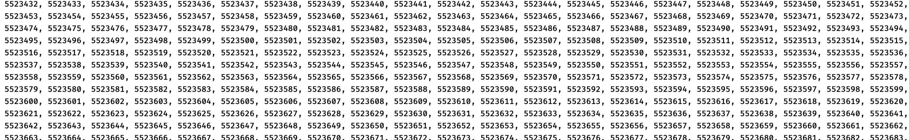

所以，如果我们想要编写一个无限循环，其实什么都不用写就行了：

```c
#include <stdio.h>

int main() {
    for (;;) {   //什么都不写直接无限循环，但是注意，两个分号还是要写的
        printf("Hello World!\n");   //这里用到了\n表示换行
    }
}
```

当然，我们也可以在循环过程中提前终止或是加速循环的进行，这里我们需要认识两个新的关键字：

```c
for (int i = 0; i < 10; ++i) {
    if(i == 5) break;   //比如现在我们希望在满足某个条件下提前终止循环，可以使用break关键字来跳出循环
    printf("%d", i);
}
```


可以看到，当满足条件时，会直接通过break跳出循环，循环不再继续下去，直接结束掉。

我们也可以加速循环：

```c
for (int i = 0; i < 10; ++i) {
    if(i == 5) continue;   //使用continue关键字会加速循环，无论后面有没有未执行完的代码，都会直接开启下一轮循环
    printf("%d", i);
}
```

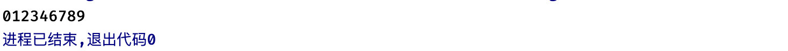

虽然使用break和continue关键字能够更方便的控制循环，但是注意在多重循环嵌套下，它只对离它最近的循环生效（就近原则）：

```c
for (int i = 1; i < 4; ++i) {
    for (int j = 1; j < 4; ++j) {
        if(i == j) continue;    //当i == j时加速循环
        printf("%d, %d\n", i, j);
    }
}
```

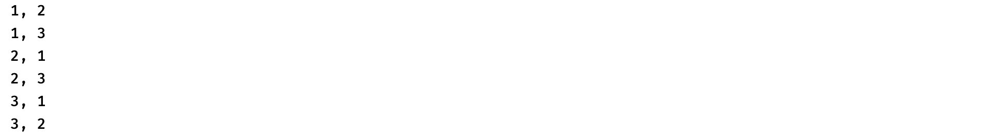

可以看到，continue仅仅加速的是内层循环，而对外层循环没有任何效果，同样的，break也只会终结离它最近的：

```c
for (int i = 1; i < 4; ++i) {
    for (int j = 1; j < 4; ++j) {
        if(i == j) break;    //当i == j时终止循环
        printf("%d, %d\n", i, j);
    }
}
```

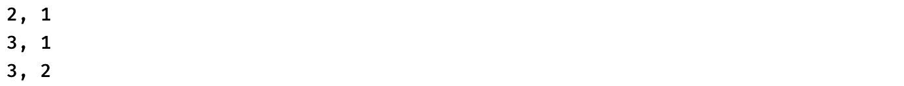

### 循环语句 - while

前面我们介绍了for循环语句，我们接着来看第二种while循环，for循环要求我们填写三个表达式，而while相当于是一个简化版本，它只需要我们填写循环的维持条件即可，比如：

```c
#include <stdio.h>

int main() {
    while (1) {   //每次循环开始之前都会判断括号内的内容是否为真，如果是就继续循环
        printf("Hello World!\n");   //这里会无限循环
    }
}
```

相比for循环，while循环更多的用在不明确具体的结束时机的情况下，而for循环更多用于明确知道循环的情况，比如我们现在明确要进行循环10次，此时用for循环会更加合适一些，又比如我们现在只知道当`i`大于10时需要结束循环，但是`i`在循环多少次之后才不满足循环条件我们并不知道，此时使用while就比较合适了。

```c
#include <stdio.h>

int main() {
    int i = 100;   //比如现在我们想看看i不断除以2得到的结果会是什么，但是循环次数我们并不明确
    while (i > 0) {   //现在唯一知道的是循环条件，只要大于0那么就可以继续除
        printf("%d, ", i);
        i /= 2;   //每次循环都除以2
    }
}
```

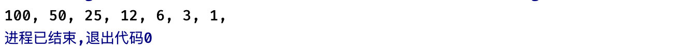

while也支持使用break和continue来进行循环的控制：

```c
int i = 100;
while (i > 0) {
    if(i < 30) break;
    printf("%d, ", i);
    i /= 2;
}
```


我们可以反转循环判断的位置，可以先执行循环内容，然后再做循环条件判断，这里要用到`do-while`语句：

```c
#include <stdio.h>

int main() {
    do {  //无论满不满足循环条件，先执行循环体里面的内容
        printf("Hello World!");
    } while (0);   //再做判断，如果判断成功，开启下一轮循环，否则结束
}
```


### 实战：寻找水仙花数

> “水仙花数（Narcissistic number）也被称为超完全数字不变数（pluperfect digital invariant, PPDI）、自恋数、自幂数、阿姆斯壮数或阿姆斯特朗数（Armstrong number），水仙花数是指**一个 3 位数，它的每个位上的数字的 3次幂之和等于它本身。**例如：1^3 + 5^3+ 3^3 = 153。”

现在请你设计一个C语言程序，打印出所有1000以内的水仙花数。

### 实战：打印九九乘法表


现在我们要做的是在我们的程序中，也打印出这样的一个乘法表出来，请你设计一个C语言程序来实现它。

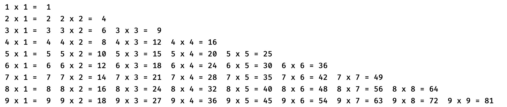

### 实战：斐波那契数列解法其一

> 斐波那契数列（Fibonacci sequence），又称[黄金分割](https://baike.baidu.com/item/黄金分割/115896)数列，因数学家莱昂纳多·斐波那契（Leonardo Fibonacci）以兔子繁殖为例子而引入，故又称为“兔子数列”，指的是这样一个数列：**1、1、2、3、5、8、13、21、34、……**在数学上，斐波那契数列以如下被以递推的方法定义：*F*(0)=0，*F*(1)=1, *F*(n)=*F*(n - 1)+*F*(n - 2)（*n* ≥ 2，*n* ∈ N*）在现代物理、准[晶体结构](https://baike.baidu.com/item/晶体结构/10401467)、化学等领域，斐波纳契数列都有直接的应用，为此，美国数学会从 1963 年起出版了以《斐波纳契数列季刊》为名的一份数学杂志，用于专门刊载这方面的研究成果。

斐波那契数列：1，1，2，3，5，8，13，21，34，55，89...，不难发现一个规律，实际上从第三个数开始，每个数字的值都是前两个数字的和，现在请你设计一个C语言程序，可以获取斐波那契数列上任意一位的数字，比如获取第5个数，那么就是5。

```c
#include <stdio.h>

int main() {
    int target = 7, result;  //target是要获取的数，result是结果

    //请在这里实现算法

    printf("%d", result);
}
```

***

## 数组

现在我们有一个新的需求，我们需要存储2022年每个月都天数，那么此时，为了保存这12个月的天数，我们就得创建12个变量：

```c
#include <stdio.h>

int main() {
    int january = 31, february = 28, march = 31 ...
}
```

这样是不是太累了点？万一我们想保存100个商品的售价，那岂不是得创建100个变量？这肯定不行啊。

### 数组的创建和使用

为了解决这种问题，我们可以使用数组，什么是数组呢？简单来说，就是存放数据的一个组，所有的数据都统一存放在这一个组中，一个数组可以同时存放多个数据。比如现在我们想保存12个月的天数，那么我们只需要创建一个int类型的数组就可以了，它可以保存很多个int类型的数据，这些保存在数组中的数据，称为“元素”：

```c
int arr[12] = {31, 28, 31, 30, 31, 30, 31, 31, 30, 31, 30, 31};  //12个月的数据全部保存在了一起
```

可以看到，数组的定义方式也比较简单：

```c
类型 数组名称[数组大小] = {数据1, 数据2...};  //后面的数据可以在一开始的时候不赋值，并且数组大小必须是整数
```

注意数组只能存放指定类型的数据，一旦确定是不能更改的，因为数组声明后，会在内存中开辟一块连续的区域，来存放这些数据，所以类型和长度必须在一开始就明确。


创建数组的方式有很多种：

```c
int a[10];   //直接声明int类型数组，容量为10

int b[10] = {1, 2, 4};   //声明后，可以赋值初始值，使用{}囊括，不一定需要让10个位置都有初始值，比如这里仅仅是为前三个设定了初始值，注意，跟变量一样，如果不设定初始值，数组内的数据并不一定都是0

int c[10] = {1, 2, [4] = 777, [9] = 666}; //我们也可以通过 [下标] = 的形式来指定某一位的初始值，注意下标是从0开始的，第一个元素就是第0个下标位置，比如这里数组容量为10，那么最多到9

int c[] = {1, 2, 3};  //也可以根据后面的赋值来决定数组长度
```

基本类型都可以声明数组：

```c
#include <stdio.h>

int main() {
    char str[] = {'A', 'B', 'C'};   //多个字符
  
    char str2[] = "ABC";  //实际上字符串就是多个字符的数组形式，有关字符串我们会在下一节进行讲解
}
```

那么数组定义好了，如何去使用它呢？比如我们现在需要打印12个月的天数：

```c
#include <stdio.h>

int main() {
    int arr[12] = {31, 28, 31, 30, 31, 30, 31, 31, 30, 31, 30, 31};
    for (int i = 0; i < 12; ++i) {
        int days = arr[i];   //直接通过数组 名称[下标] 来访问对应的元素值，再次提醒，下标是从0开始的，不是1
        printf("2022年 %d 月的天数是：%d 天\n", (i + 1), days);
    }
}
```


当然我们也可以对数组中的值进行修改：

```c
#include <stdio.h>

int main() {
    int arr[] = {666, 777, 888};
    arr[1] = 999;   //比如我们现在想要让第二个元素的值变成999
    printf("%d", arr[1]);   //打印一下看看是不是变成了999
}
```


注意，和变量一样，如果只是创建数组但是不赋初始值的话，因为是在内存中随机申请的一块空间，有可能之前其他地方使用过，保存了一些数据，所以数组内部的元素值并不一定都是0：

```c
#include <stdio.h>

int main() {
    int arr[10];
    for (int i = 0; i < 10; ++i) {
        printf("%d, ", arr[i]);
    }
}
```


不要尝试去访问超出数组长度位置的数据，虽然可以编译通过，但是会给警告，这些数据是毫无意义的：

```c
#include <stdio.h>

int main() {
    int arr[] = {111, 222, 333};
    printf("%d", arr[3]);  //不能去访问超出数组长度的元素，很明显这里根本就没有第四个元素
}
```

### 多维数组

数组不仅仅只可以有一个维度，我们可以创建二维甚至多维的数组，简单来说就是，存放数组的数组（套娃了属于是）：

```c
int arr[][2] = {{20, 10}, {18, 9}};   //可以看到，数组里面存放的居然是数组
//存放的内层数组的长度是需要确定的，存放数组的数组和之前一样，可以根据后面的值决定
```

比如现在我们要存放2020-2022年每个月的天数，那么此时用一维数组肯定是不方便了，我们就可以使用二维数组来处理：

```c
int arr[3][12] = {{31, 29, 31, 30, 31, 30, 31, 31, 30, 31, 30, 31}, //2020年是闰年，2月有29天
                  {31, 28, 31, 30, 31, 30, 31, 31, 30, 31, 30, 31},
                  {31, 28, 31, 30, 31, 30, 31, 31, 30, 31, 30, 31}};
```

这样，我们就通过二维数组将这三年每个月的天数都保存下来了。


那么二维数组又该如何去访问呢？

```c
#include <stdio.h>

int main() {
    int arr[3][12] = {{31, 29, 31, 30, 31, 30, 31, 31, 30, 31, 30, 31}, //2020年是闰年，2月有29天
                      {31, 28, 31, 30, 31, 30, 31, 31, 30, 31, 30, 31},
                      {31, 28, 31, 30, 31, 30, 31, 31, 30, 31, 30, 31}};
    printf("%d", arr[0][1]);   //比如现在我们想要获取2020年2月的天数，首先第一个是[0]表示存放的第一个数组，第二个[1]表示数组中的第二个元素
}
```

当然除了二维还可以上升到三维、四维：

```c
int arr[2][2][2] = {{{1, 2}, {1, 2}}, {{1, 2}, {1, 2}}};
```

有关多维数组，暂时先介绍到这里。

### 实战：冒泡排序算法

现在有一个int数组，但是数组内的数据是打乱的，现在请你通过C语言，实现将数组中的数据按**从小到大**的顺序进行排列：

```c
#include <stdio.h>

int main() {
    int arr[10] = {3, 5, 7, 2, 9, 0, 6, 1, 8, 4};  //乱序的
    //请编写代码对以上数组进行排序
}
```

这里我们使用冒泡排序算法来实现，此算法的核心思想是：

* 假设数组长度为N
* 进行N轮循环，每轮循环都选出一个最大的数放到后面。
* 每次循环中，从第一个数开始，让其与后面的数两两比较，如果更大，就交换位置，如果更小，就不动。

动画演示：https://visualgo.net/zh/sorting?slide=2-2

### 实战：斐波那契数列解法其二

学习了数组，我们来看看如何利用数组来计算斐波那契数列，这里采用动态规划的思想。

> 动态规划算法通常用于求解具有某种最优性质的问题。在这类问题中，可能会有许多可行解。每一个解都对应于一个值，我们希望找到具有[最优值](https://baike.baidu.com/item/最优值)的解。动态规划算法与[分治法](https://baike.baidu.com/item/分治法)类似，其基本思想也是将待求解问题分解成若干个子问题，先求解子问题，然后从[这些子](https://baike.baidu.com/item/这些子)问题的解得到原问题的解。

我们可以在一开始创建一个数组，然后从最开始的条件不断向后推导，从斐波那契数列的规律我们可以得知：

* `fib[i] = fib[i - 1] + fib[i - 2]`（这里`fib`代表斐波那契数列）

得到这样的一个关系（递推方程）就好办了，我们要求解数列第`i`个位置上的数，只需要知道`i - 1`和`i - 2`的值即可，这样，一个大问题，就分成了两个小问题，比如现在我们要求解斐波那契数列的第5个元素：

* `fib[4] = fib[3] + fib[2]`现在我们只需要知道`fib[3]`和`fib[2]`即可，那么我们接着来看：
* `fib[3] = fib[2] + fib[1]`以及`fib[2] = fib[1] + fib[0]`
* 由于`fib[0]`和`fib[1]`我们已经明确知道是`1`了，那么现在问题其实已经有结果了，把这些小问题的结果组合起来不就能得到原来大问题的结果了吗？

现在请你设计一个C语言程序，利用动态规划的思想解决斐波那契数列问题。

### 实战：打家劫舍

我们继续通过一道简单的算法题来强化动态规划思想。

**来源：力扣（LeetCode）No.198 打家劫舍**：https://leetcode.cn/problems/house-robber/

>你是一个专业的小偷，计划偷窃沿街的房屋。每间房内都藏有一定的现金，影响你偷窃的唯一制约因素就是相邻的房屋装有相互连通的防盗系统，如果两间相邻的房屋在同一晚上被小偷闯入，系统会自动报警。
>
>给定一个代表每个房屋存放金额的非负整数数组，计算你 **不触动警报装置的情况下** ，一夜之内能够偷窃到的最高金额。

**示例 1：**

> 输入：[1,2,3,1]
> 输出：4
> 解释：偷窃 1 号房屋 (金额 = 1) ，然后偷窃 3 号房屋 (金额 = 3)。
> 	  偷窃到的最高金额 = 1 + 3 = 4 。

**示例 2：**

> 输入：[2,7,9,3,1]
> 输出：12
> 解释：偷窃 1 号房屋 (金额 = 2), 偷窃 3 号房屋 (金额 = 9)，接着偷窃 5 号房屋 (金额 = 1)。
> 	  偷窃到的最高金额 = 2 + 9 + 1 = 12 。


这道题我们也可以很轻松地按照上面的动态规划思路来处理，首先我们可以将问题分为子问题，比如现在有`[2,7,9,3,1]`五个房屋，这个问题看起来比较复杂，我们不妨先将大问题先简化成小问题，我们来看看只有N个房屋的情况：

* 假设现在只有`[2]`这一个房屋，那么很明显，我可以直接去偷一号房，得到2块钱，所以当有一个房子时最大能偷到2块钱。
* 假设现在有`[2, 7]`这两个房屋，那么很明显，我可以直接去偷二号房，得到7块钱，所以当有两个房子时最大能偷到7块钱。
* 假设现在只有`[2, 7, 9]`这三个房屋，我们就要来看看了，是先偷一号房再偷三号房好，还是只偷二号房好，根据前面的结论，如果我们偷了一号房，那么就可以继续偷三号房，并且得到的钱就是从一号房过来的钱+三号房的钱，也就是2+9块钱，但是如果只偷二号房的话，那么就只能得到7块钱，所以，三号房能够偷到的最大金额有以下关系（dp是我们求出的第i个房屋的最大偷钱数量，value表示房屋价值，max表示取括号中取最大的一个）：
  * `dp[i] = max(dp[i - 1], dp[i - 2] + value[i])`  -> **递推方程已得到**
* 这样就不难求出：`dp[2] = max(dp[1], dp[0] + value[i])` = `dp[2] = max(7, 2 + 9)` = `dp[2] = 11`，所以有三个房屋时最大的金额是11块钱。
* 所以，实际上我们只需要关心前面计算出来的盗窃最大值即可，而不需要关心前面到底是怎么在偷。
* 我们以同样的方式来计算四个房屋`[2, 7, 9, 3]`的情况：
  * `dp[3] = max(dp[2], dp[1] + value[3])` = `dp[3] = max(11, 7 + 3)` = `dp[3] = 11`
* 所以，当有四个房屋时，我们依然采用先偷一后偷三的方案，不去偷四号，得到最大价值11块钱。

好了，现在思路已经出来了，我们直接上算法吧，现在请你实现下面的C语言程序：

```c
#include <stdio.h>

int main() {
    int arr[] = {2,7,9,3,1}, size = 5, result;

    //请补充程序

    printf("%d", result);
}
```

力扣提交，建议各位小伙伴学习了函数和指针之后再回来看看，这里暂时可以跳过。


```c
int max(int a, int b) {
    return a > b ? a : b;
}

int rob(int* nums, int numsSize){
    if(numsSize == 0) return 0;
    if(numsSize == 1) return nums[0];
    if(numsSize == 2) return max(nums[1], nums[0]);

    int dp[numsSize];
    dp[0] = nums[0];
    dp[1] = max(nums[1], nums[0]);

    for (int i = 2; i < numsSize; ++i) {
        dp[i] = max(dp[i - 1], dp[i - 2] + nums[i]);
    }

    return dp[numsSize - 1];
}
```

***

## 字符串

前面我们学习了数组，而对于字符类型的数组，比较特殊，它实际上可以作为一个字符串（String）表示，字符串就是一个或多个字符的序列，比如我们在一开始认识的`"Hello World!"`，像这样的多个字符形成的一连串数据，就是一个字符串，而`printf`函数接受的第一个参数也是字符串。

那么，我们就来认识一下字符串。

### 字符串的创建和使用

在C语言中并没有直接提供存储字符串的类型，我们熟知的能够存储字符的只有char类型，但是它只能存储单个字符，而一连串的字符想要通过变量进行保存，那么就只能依靠数组了，char类型的数组允许我们存放多个字符，这样的话就可以表示字符串了。

比如我们现在想要存储`Hello`这一连串字符：

```c
char str[] = {'H', 'e', 'l', 'l', 'o', '\0'};  //直接保存单个字符，但是注意，无论内容是什么，字符串末尾必须添加一个‘\0’字符（ASCII码为0）表示结束。
printf("%s", str);   //用%s来作为一个字符串输出
```

不过这样写起来实在是太麻烦了，我们可以使用更加简便的写法：

```c
char str[] = "Hello";   //直接使用双引号将所有的内容囊括起来，并且也不需要补充\0（但是本质上是和上面一样的字符数组）
//也可以添加 const char str[] = "Hello World!"; 双引号囊括的字符串实际上就是一个const char数组类型的值
printf("%s", str);
```

这下终于明白了，原来我们一直在写的双引号，其实表示的就是一个字符串。

那么现在请各位小伙伴看看下面的写法有什么不同：

```c
"c"
'c'
```

我们发现一个问题，char类型只能保存ASCII编码表中的字符，但是我们发现实际上中文也是可以正常打印的：

```c
printf("你这瓜保熟吗");
```


这是什么情况？那么多中文字符（差不多有6000多个），用ASCII编码表那128个肯定是没办法全部表示的，但是我们现在需要在电脑中使用中文。这时，我们就需要扩展字符集了。

> 我们可以使用两个甚至多个字节来表示一个中文字符，这样我们能够表示的数量就大大增加了，GB2132方案规定当连续出现两个大于127的字节时（注意不考虑符号位，此时相当于是第一个bit位一直为1了），表示这是一个中文字符（所以为什么常常有人说一个英文字符占一字节，一个中文字符占两个字节），这样我们就可以表示出超过7000种字符了，不仅仅是中文，甚至中文标点、数学符号等，都可以被正确的表示出来。
>
> ```c
> 10000011 10000110   //这就是一个连续出现都大于127的字节（注意这里是不考虑符号位的）
> ```
>
> 不过这样能够表示的内容还是不太够，除了那些常见的汉字之外，还有很多的生僻字，比如龘、錕、釿、拷这类的汉字，后来干脆直接只要第一个字节大于127，就表示这是一个汉字的开始，无论下一个字节是什么内容（甚至原来的128个字符也被编到新的表中），这就是Windows至今一直在使用的默认GBK编码格式。
>
> 虽然这种编码方式能够很好的解决中文无法表示的问题，但是由于全球还有很多很多的国家以及很多很多种语言，所以我们的最终目标是能够创造一种可以表示全球所有字符的编码方式，整个世界都使用同一种编码格式，这样就可以同时表示全球的语言了。所以这时就出现了一个叫做ISO的（国际标准化组织）组织，来定义一套编码方案来解决所有国家的编码问题，这个新的编码方案就叫做Unicode，规定每个字符必须使用俩个字节，即用16个bit位来表示所有的字符（也就是说原来的那128个字符也要强行用两位来表示）
>
> 但是这样的话实际上是很浪费资源的，因为这样很多字符都不会用到两字节来保存，但是又得这样去表示，这就导致某些字符浪费了很多空间。所以最后就有了UTF-8编码格式，区分每个字符的开始是根据字符的高位字节来区分的，比如用一个字节表示的字符，第一个字节高位以“0”开头；用两个字节表示的字符，第一个字节的高位为以“110”开头，后面一个字节以“10开头”；用三个字节表示的字符，第一个字节以“1110”开头，后面俩字节以“10”开头；用四个字节表示的字符，第一个字节以“11110”开头，后面的三个字节以“10”开头：
>
> | Unicode符号范围（十六进制） | UTF-8编码方式(二进制)               |
> | --------------------------- | ----------------------------------- |
> | 0000 0000 ~ 0000 007F       | 0xxxxxxx                            |
> | 0000 0080 ~ 0000 07FF       | 110xxxxx 10xxxxxx                   |
> | 0000 0800 ~ 0000 FFFF       | 1110xxxx 10xxxxxx 10xxxxxx          |
> | 0001 0000 ~ 0010 FFFF       | 11110xxx 10xxxxxx 10xxxxxx 10xxxxxx |
>
> 所以如果我们的程序需要表示多种语言，最好采用UTF-8编码格式。

简而言之，我们的中文实际上是依靠多个char来进行表示的。

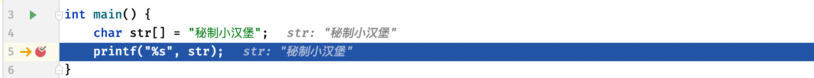

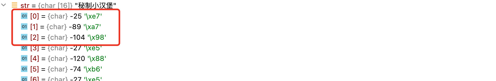

这样，我们就了解了字符串的使用。

### scanf、gets、puts函数

函数我们会在下一章详细介绍，不过这里还是要再提到一个比较重要的函数。

前面我们认识了`printf`函数，实际上这个函数就是用于打印字符串到控制台，我们只需要填入一个字符串和后续的参数即可。

```c
#include <stdio.h>

int main() {
    const char str[] = "Hello World!";   //注意printf需要填写一个const char数组进去，也就是字符串
    printf(str);
}
```

现在我们知道该如何输出，那么输入该如何实现呢，比如我们现在希望将我们想要说的话告诉程序，让程序从控制台读取我们输入的内容，这时我们就需要使用到`scanf`函数了：

```c
#include <stdio.h>

int main() {
    char str[10];
    scanf("%s", str);   //使用scanf函数来接受控制台输入，并将输入的结果按照格式，分配给后续的变量
  	//比如这里我们想要输入一个字符串，那么依然是使用%s（和输出是一样的占位符），后面跟上我们要赋值的数组（存放输入的内容）
    printf("输入的内容为：%s", str);
}
```

可以看到，成功接收到用户输入：

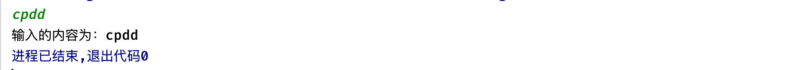

当然除了能够扫描成字符串之外，我们也可以直接扫描为一个数字：

```c
#include <stdio.h>

int main() {
    int a, b;
    scanf("%d", &a);   //连续扫描两个int数字
    scanf("%d", &b);   //注意，如果不是数组类型，那么这里在填写变量时一定要在前面添加一个&符号（至于为什么，下一章在指针小节中会详细介绍）这里的&不是做与运算，而是取地址操作。

    printf("a + b = %d", a + b);   //扫描成功后，我们来计算a + b的结果
}
```

除了使用`scanf`之外，我们也可以使用字符串专用的函数来接受字符串类型的输入和输出：

```c
#include <stdio.h>

int main() {
    char str[10];
    gets(str);   //gets也是接收控制台输入，然后将结果丢给str数组中
    puts(str);   //puts其实就是直接打印字符串到控制台
}
```

当然也有专门用于字符输入输出的函数：

```c
#include <stdio.h>

int main() {
    int c = getchar();
    putchar(c);
}
```

由于我们目前还没有学习函数，所以这里稍微提及一下即可。

### 实战：回文串判断

“回文串”是一个正读和反读都一样的字符串，请你实现一个C语言程序，判断用户输入的字符串（仅出现英文字符）是否为“回文”串。

> ABCBA    就是一个回文串，因为正读反读都是一样的
>
> ABCA    就不是一个回文串，因为反着读不一样

### 实战：字符串匹配KMP算法

现在有两个字符串：

> str1 = "abcdabbc"
>
> str2 = "cda"

现在请你设计一个C语言程序，判断第一个字符串中是否包含了第二个字符串，比如上面的例子中，很明显第一个字符串包含了第二个字符串。

* 暴力解法
* KMP算法

我们着重来看一下KMP算法，实际上我们发现，暴力解法虽然很好理解，但是可能会做一些毫无意义的比较：

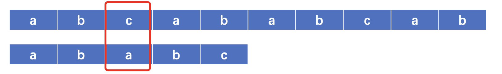

当发生不匹配时，又会重新开始比较下一个：

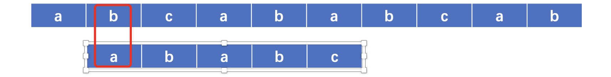

但是我们不难发现，因为不匹配的位置发生在第三个字符，而前面是`a,b`两个字符都匹配，显然完全没有必要再继续挨着去比较`a`和`b`了，因为很明显不可能匹配。


实际上我们可以直接跳过`b`，因为我们一眼就能看出肯定不匹配，所以直接跳过从后面继续判断，能节省不少的时间。我相信如果让你通过自己的人脑去进行匹配，也是按照这样的方式去比较的吧？

不过关键点就在于怎么在程序中得知该不该跳过呢，又该跳过多少个字符不判断呢？所以我们在拿到子串的时候，就需要根据子串来计算一个叫做`next`的数组，与子串的长度相同，它存储了**当不匹配发生在对应的位置上时，应该在哪一个位置开始继续比较。**

这里说一下怎么去求（计算机领域大佬总结出来的算法）：

>从第一位开始依次推导。
>
>next数组的第一位一定是0。
>
>从第二位开始（用`i`表示），将第`i-1`个字符（也就是前一个）与其对应的`next[i - 1] - 1`位上的字符进行比较。
>
>如果相等，那么`next[i]`位置的值就是`next[i - 1] + 1`
>
>如果不相等，则继续向前计算一次`next[next[i-1] - 1] - 1`位置上的字符和第`i-1`个字符是否相同，直到找到相等的为止，并且这个位置对应的值加上`1`就是`next[i]`的值了，要是都已经到头了都没遇到相等的，那么`next[i]`直接等于`1`。

比如：


首先一二位明确是0和1，这里我们从第三位开始计算，根据我们前面的规则：

1. 首先判断`str[next[1] - 1] == str[1]`，显然不相等。
2. 此时无法继续向前走了，`next[2]`直接等于`1`即可。


我们接着来看第四位：

1. 首先判断`str[next[2] - 1] == str[2]`，发现相等。
2. 此时`next[2]`直接等于`next[2 - 1] + 1`即可。


最后一位也是一样的判断方式：

1. 首先判断`str[next[3] - 1] == str[3]`，发现相等。
2. 此时`next[3]`直接等于`next[3 - 1] + 1`即可。


至此，next数组求解完毕，之后比较只需要多考虑一下next数组即可：

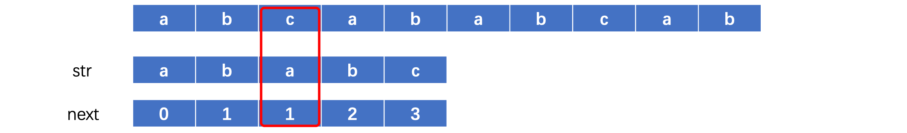

当不匹配发生在第三位时，此时`next[2] = 1`， 所以我们将第一个元素移动到c的位置重新开始比较：

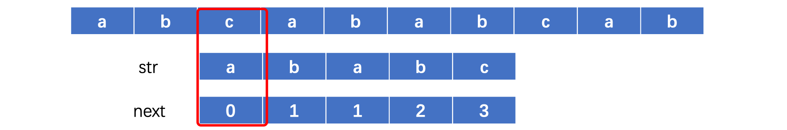

发现不匹配，直接继续向后比较，重复上述操作，像这样这样跳着去比较就大大节省了时间。

OK，理论差不多结束了，上代码。

有关C语言的基础部分内容，我们就讲解到这里，从下一章开始，难度将会有一定的提升，所以请各位小伙伴务必将本章知识点梳理清楚，牢记心中。


# 2. C语言高级特性

前面我们了解了C语言的相关基础内容，我们来看看C语言的高级部分。这一章的学习难道会比较大，尤其是指针板块，因为需要理解计算机内存模型，所以说是很多初学者的噩梦。

## 函数

其实函数我们在一开始就在使用了：

```c
int main() {   //这是定义函数
   ...
}
```

我们程序的入口点就是`main`函数，我们只需要将我们的程序代码编写到主函数中就可以运行了，不够这个函数只是由我们来定义，而不是我们自己来调用。当然，除了主函数之外，我们一直在使用的`printf`也是一个函数，不过这个函数是标准库中已经实现好了的，现在是我们在调用这个函数：

```c
printf("Hello World!");    //直接通过 函数名称(参数...) 的形式调用函数
```

那么，函数的具体定义是什么呢？

> 函数是完成特定任务的独立程序代码单元。

其实简单来说，函数时为了完成某件任务而生的，可能我们要完成某个任务并不是一行代码就可以搞定的，但是现在可能会遇到这种情况：

```c
#include <stdio.h>

int main() {
    int a = 10;
    
    printf("H");   //比如下面这三行代码就是我们要做的任务
    printf("A");
    a += 10;
    
    if(a > 20) {
        printf("H");   //这里我们还需要执行这个任务
        printf("A");
        a += 10;
    }

    switch (a) {
        case 30:
            printf("H");   //这里又要执行这个任务
            printf("A");
            a += 10;
            
    }
}
```

我们每次要做这个任务时，都要完完整整地将任务的每一行代码都写下来，如果我们的程序中多处都需要执行这个任务，每个地方都完整地写一遍，实在是太臃肿了，有没有一种更好的办法能优化我们的代码呢？

这时我们就可以考虑使用函数了，我们可以将我们的程序逻辑代码全部编写到函数中，当我们执行函数时，实际上执行的就是函数中的全部内容，也就是按照我们制定的规则执行对应的任务，每次需要做这个任务时，只需要调用函数即可。

我们来看看，如何创建和使用函数。

### 创建和使用函数

首先我们来看看如何创建一个函数，其实创建一个函数是很简单的，格式如下：

```c
返回值类型 函数名称([函数参数...]);
```

其中函数名称也是有要求的，并不是所有的字符都可以用作函数名称，它的命名规则与变量的命名规则基本一致，所以这里就不一一列出了。

函数不仅仅需要完成我们的任务，可能某些函数还需要告诉我们结果，比如我们之前认识的`getchar`函数，这个函数实际上返回了一个int值作为结果（也就是我们输入的字符）我们同样可以将函数返回的结果赋值给变量或是参与运算等等。

当然如果我们的函数只需要完成任务，不需要告诉我们结果，返回值类型可以写成`void`表示为空。

函数参数我们放在下一个小节中讲解，所以这里我们不使用任何参数，所以这里也将参数设定为`void`表示没有参数（当然为了方便，我们也可以直接什么都不写）

```c
#include <stdio.h>

void test(void);   //定义函数原型，因为C语言是从上往下的，所以如果要在下面的主函数中使用这个函数，一定要定义到它的上面。

int main() {
    
}

void test(void){   //函数具体定义，添加一个花括号并在其中编写程序代码，就和我们之前在main中编写一样
    printf("我是测试函数!");
}
```

或是直接在上方写上函数的具体定义：

```c
#include <stdio.h>

void test(void){   //函数具体定义，添加一个花括号并在其中编写程序代码，就和我们之前在main中编写一样
    printf("我是测试函数!");
}

int main() {
    
}
```

那么现在我们将函数定义好之后，该如何去使用呢？

```c
int main() {
    test();   //这里我们只需要使用 函数名称(); 就可以调用函数了
  	printf("Hello World!");   //实际上printf也是一个函数，功能是向控制台打印字符串，只不过这个函数是系统提供的，已经提前实现好了，其中的参数我们后续还会进行介绍。
}
```

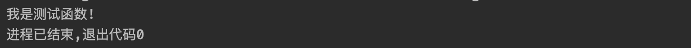

这样，我们就可以很好解决上面的代码复用性的问题，我们只需要将会重复使用的逻辑代码定义到函数中，当我们需要执行时，直接调用编写好的函数就可以了，这样是不是简单多了？

```c
int main() {
    int a = 10;

    test();   //多次使用的情况下，函数会让我们的程序简单很多

    if(a > 20) test();

    switch (a) {
        case 30:
            test();
    }
}
```

当然函数除了可以实现代码的复用之外，也可以优化我们的程序，让我们的代码写得更有层次感，我们的程序可能会有很多很多的功能，需要写很多的代码，但是谁愿意去看一个几百行上千行的`main`函数呢？我们可以将每个功能都写到一个对应的函数中，这样就可以大大减少`main`函数中的代码量了。

```c
int main() {
    func1();   //直接把多行代码写到一个函数中，在main中调用对应的函数，这样能够大幅度减少代码量
    func2();
    func3();
}
```

而我们从一开始就在编写main函数实际上是一种比较特殊的函数，C语言规定程序一律从主函数开始执行，所以这也是为什么我们一定要写成`int main()`的形式。

### 全局变量和局部变量

现在我们已经了解了如何创建和调用函数，在继续学习后续内容之前，我们需要先认识一下全局变量和局部变量这两个概念（啊这，变量就变量，还分这么细啊？）

我们首先来看看局部变量，实际上我们之前使用的都是局部变量，比如：

```c
int main() {
    int i = 10;   //这里定义的变量i实际上是main函数中的局部变量，它的作用域只能是main函数中，也就是说其他地方是无法使用的
}
```

局部变量只会在其作用域中生效：

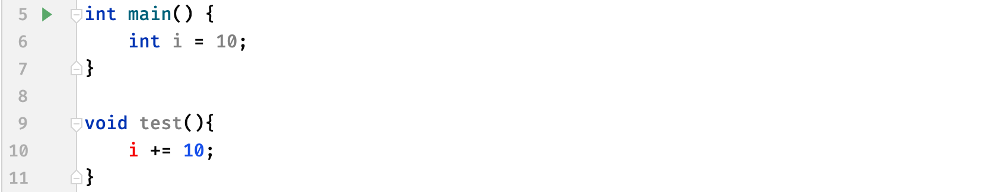

可以看到在其他函数中，无法使用main函数中的变量，因为局部变量的作用域是有限的，比如位于某个函数内部的变量，那么它的作用域就是整个函数内部，而在其他位置均无法访问。又比如我们之前学习的for循环，当我们这样定义时：

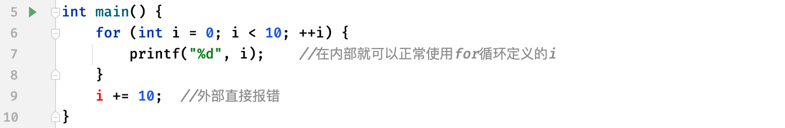

可以看到，在for循环中定义的变量i，只能在for循环内部使用，而出了这个花括号之后就用不了了，当然由于作用域不同，所以下面这种写法是完全没问题的：

```c
int main() {
    for (int i = 0; i < 10; ++i) {   //虽然这里写了两个for都使用了i，但是由于处于两个不同的作用域，所以这两个i半毛钱关系都没有

    }

    for (int i = 0; i < 20; ++i) {

    }
}
```

所以，清楚了局部变量的作用域之后，我们在编写程序的时候就很清楚了：

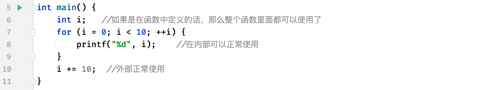

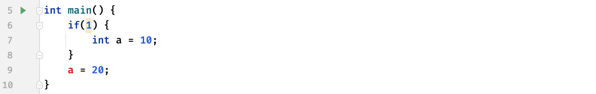

那么如果现在我们想要在任何位置都能使用一个变量，该怎么办呢？这时就要用到全局变量了：

```c
#include <stdio.h>

void test();

int a = 10;   //我们可以直接将变量定义放在外面，这样所有的函数都可以访问了

int main() {
    a += 10;
    test();    //现在各位觉得，这两个操作完成后，a会是多少呢？
    printf("%d", a);
}

void test(){
    a += 10;
}
```

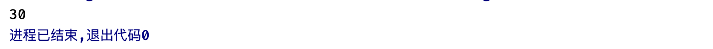

因为现在所有函数都能使用全局变量，所以这个结果不难得到。

### 函数参数和返回

我们的函数可以接受参数来完成任务，比如我们现在想要实现**用一个函数计算两个数的和并输出到控制台。**

这种情况我们就需要将我们需要进行加法计算的两个数，告诉函数，这样函数才能对这两个数求和，那么怎么才能告诉函数呢？我们可以通过设定参数：

```c
#include <stdio.h>

void test(int, int);   //函数原型中需要写上需要的参数类型，多个参数用逗号隔开，比如这里我们需要的就是两个int类型的参数

int main() {

}

void test(int a, int b){  //函数具体定义中也要写上，这里的a和b我们称为形式参数（形参），等价于函数中的局部变量，作用域仅限此函数
		printf("%d", a + b);
}
```

那么现在定义完成了，该如何使用这个函数呢，还记得我们怎么使用`printf`函数的吗？我们只需要把它所需要的参数填入即可：

```c
int main() {
    test(10, 20);   //这里直接填写一个常量、变量或是运算表达式都是可以的，我们称实际传入的值为实际参数（实参）
}
```

可以看到，成功计算出结果：

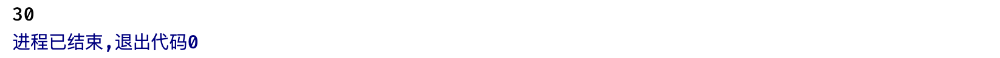

实际上我们传入的实参在进入到函数时，会自动给函数中形参（局部变量）进行赋值，这样我们在函数中就可以得到外部传入的参数值了。

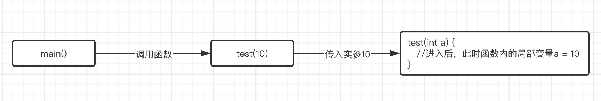

我们来看看`printf`函数是怎么写的：

```c
int  printf(const char * __restrict, ...) __printflike(1, 2);   //看起来比较高级
```

这里我们主要关心它的两个参数，一个是`char *`由于还没有学习指针，这里就把它当做`const char[]`就行了，表示一个不可修改的字符串，而第二个参数我们看到是`...`，这三个点是个啥？

我们知道，如果我们想要填写具体需要打印的值时，可以一直往后写：

```c
printf("%d, %d", 1, 2);   //参数可以一直写
```

正常情况下我们函数的参数列表都是固定的，怎么才能像这样写很多个呢？这就要用到可变长参数了，不过可变长参数的使用比较麻烦，这里我们就不做讲解了。

这里给大家提一个问题，如果我们修改形式参数的值，外面的实参值会跟着发生修改吗？

```c
#include <stdio.h>

void swap(int, int);

int main() {
    int a = 10, b = 20;
    swap(a, b);

    printf("a = %d, b = %d", a, b);   //最后会得到什么结果？
}

void swap(int a, int b){
    int tmp = a;   //这里对a和b的值进行交换
    a = b;
    b = tmp;
}
```

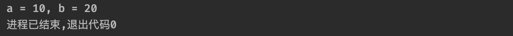

通过结果发现，虽然调用了函数对a和b的值进行交换，但貌似并没有什么卵用。这是为什么呢？

还记得我们前面说的吗，函数的形参实际上就是函数内的局部变量，它的作用域仅仅是这个函数，而我们外面传入的实参，仅仅知识将值赋值给了函数内的形参而已，并且外部的变量跟函数内部的变量作用域都不同，所以半毛钱关系都没有，这里交换的仅仅是函数内部的两个形参变量值，跟外部作实参的变量没有任何关系。

那么，怎么样才能实现通过函数交换两个变量的值呢？这个问题我们会在指针部分进行讨论。

不过数组却不受限制，我们在函数中修改数组的值，是直接可以生效的：

```c
#include <stdio.h>

void test(int arr[]);

int main() {
    int arr[] = {4, 3, 8, 2, 1, 7, 5, 6, 9, 0};
    test(arr);
    printf("%d", arr[0]);  //打印的是修改后的值了
}

void test(int arr[]) {
    arr[0] = 999;   //数组就可以做到这边修改，外面生效
}
```

我们再来看一个例子：

```c
#include <stdio.h>

void test(int a){
    a += 10;
    printf("%d\n", a);
}

int main() {
    int a = 10;
    test(a);
    test(a);   //连续两次调用，那么这两次的结果会是什么？
}
```

可以看到结果都是20，（如果猜对了可以直接跳过，如果你猜测的是20和30的话，需要听我解释了）注意每次调用函数都是单独进行的，并不是复用函数中的形参，不要认为第一次调用函数test就将函数的局部变量变成20了，再次调用就是20+10变成30。实际上这两次调用都是单独进行的，形参a都是在一开始的时候被赋值为实参的值的，这两次调用没有任何关系，并且函数执行完毕后就自动销毁了。

那要是我就希望每次调用函数时保留变量的值呢？我们可以使用静态变量：

```c
#include <stdio.h>

void test();

int main() {
    test();
    test();
}

void test() {
    static int a = 20;   //静态变量并不会在函数结束时销毁其值，而是保持
    a += 20;
    printf("%d ", a);
}
```

我们接着来看函数的返回值，并不是所有的函数都是执行完毕就结束了的，可能某些时候我们需要函数告诉我们执行的结果如何，这时我们就需要用到返回值了，比如现在我们希望实现一个函数计算a+b的值：

```c
#include <stdio.h>

int sum(int ,int );   //现在我们要返回a和b的和（那么肯定也是int类型）所以这里需要将返回值类型修改为int

int main() {
    int a = 10, b = 20;   //计算a和b的和
  	int result = sum(a, b);   //函数执行后，会返回一个int类型的结果，我们可以接收它，也可以像下面一样直接打印，当然也可以参与运算等等。
    printf("a+b=%d", sum(a, b));
}

int sum(int a, int b) {
    return a + b;   //通过return关键字来返回计算的结果
}
```

我们接着来看下一个例子，现在我们希望你通过函数找到数组中第一个小于0的数字并将其返回，如果没有找到任何小于0的数，就返回0即可：

```c
#include <stdio.h>

int findMin(int arr[], int len);   //需要两个参数，一个是数组本身，还有一个是数组的长度

int main() {
    int arr[] = {1, 4, -9, 2, -4, 7};
    int min = findMin(arr, 6);
    printf("第一个小于0的数是：%d", min);
}

int findMin(int arr[], int len) {
    for (int i = 0; i < len; ++i) {
        if(arr[i] < 0) return arr[i];   //当判断找到后，直接return返回即可，这样的话函数会直接返回结果，无论后面还有没有代码没有执行完，整个函数都会直接结束。
    }
    return 0;   //如果没有找到就返回0
}
```


这里我们使用了`return`关键字来返回结果，注意当我们的程序走到`return`时，无论还有什么内容没执行完，整个函数都将结束，并返回结果。注意带返回值（非void）的函数中的所有情况都需要有一个对应的返回值：

```c
int test(int a) {
    if (a > 0) {
        return 10;   //当a大于0时有返回语句
    } else{
          //但是当a不大于0时就没有返回值了，这样虽然可以编译通过，但是会有警告（黄标），运行后可能会出现一些无法预知的问题
    }
}
```

如果是没有返回值的函数，我们也可以调用`return`来返回，不过默认情况下是可以省略的：

```c
void test(int a){
    if(a == 10) return;   //因为是void，所以什么都不需要加，直接return
    printf("%d", a);
}
```

### 递归调用

我们的函数除了在其他地方被调用之外，也可以自己调用自己（好家伙，套娃是吧），这种玩法我们称为递归。

```c
#include <stdio.h>

void test(){
    printf("Hello World!\n");
    test();   //函数自己在调用自己，这样的话下一轮又会进入到这个函数中
}

int main() {
    test();
}
```

我们可以尝试运行一下上面的程序，会发现程序直接无限打印`Hello World!`这个字符串，这是因为函数自己在调用自己，不断地重复进入到这个函数，理论情况下，它将永远都不会结束，而是无限地执行这个函数的内容。

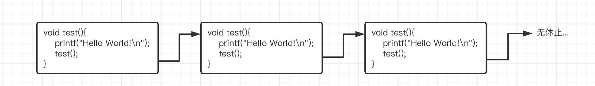

但是到最后我们的程序还是终止了，这是因为函数调用有最大的深度限制，因为计算机不可能放任函数无限地进行下去。

> **（选学）**我们来大致了解一下函数的调用过程，实际上在程序运行时会有一个叫做**函数调用栈**的东西，它用于控制函数的调用：
>
> ```c
> #include <stdio.h>   //我们以下面的调用关系为例
> 
> void test2(){
>  printf("giao");
> }
> 
> void test(){
>  test2();   //main -> test -> test2
> 	printf("giao");
> }
> 
> int main() {
>  test();
> 	printf("giao");
> }
> ```
>
> 其实我们可以很轻易地看出整个调用关系，首先是从main函数进入，然后调用test函数，在test函数中又调用了test2函数，此时我们就需要等待test2函数执行完毕，test才能继续，而main则需要等待test执行完毕才能继续。而实际上这个过程是由函数调用栈在控制的：
>
> 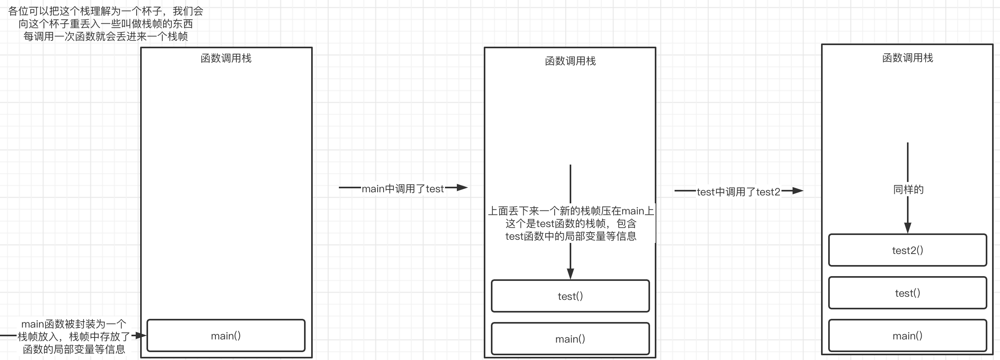
>
> 而当test2函数执行完毕后，每个栈帧又依次从栈中出去：
>
> 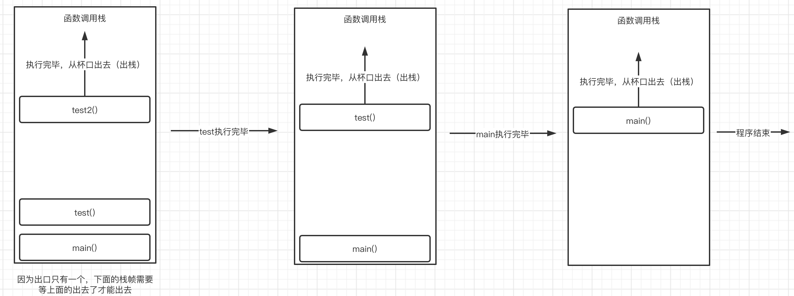
>
> 当所有的栈全部出去之后，程序结束。
>
> 所以这也就不难解释为什么无限递归会导致程序出现错误，因为栈的空间有限，而函数又一直在进行自我调用，所以会导致不断地有新的栈帧进入，最后塞满整个栈的空间，就爆炸了，这种问题我们称为栈溢出（Stack Overflow）

当然，如果我们好好地按照规范使用递归操作，是非常方便的，比如我们现在需要求某个数的阶乘：

```c
#include <stdio.h>

int test(int n);

int main() {
    printf("%d", test(3));
}

int test(int n){
    if(n == 1) return 1;   //因为不能无限制递归下去，所以我们这里添加一个结束条件，在n = 1时返回
    return test(n - 1) * n;  //每次都让n乘以其下一级的计算结果，下一级就是n-1了
}
```

通过给递归调用适当地添加结束条件，这样就不会无限循环了，并且我们的程序看起来无比简洁，那么它是如何执行的呢：

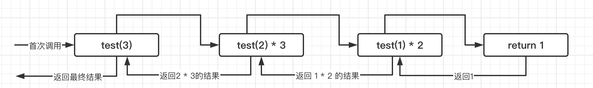

它看起来就像是一个先走到底部，然后拿到问题的钥匙后逐步返回的一个过程，并在返回的途中不断进行计算最后得到结果（妙啊）

所以，合理地使用递归反而是一件很有意思的事情。

### 实战：斐波那契数列解法其三

前面我们介绍了函数的递归调用，我们来看一个具体的实例吧，我们还是以解斐波那契数列为例。

既然每个数都是前两个数之和，那么我们是否也可以通过递归的形式不断划分进行计算呢？我们依然可以借鉴之前动态规划的思想，通过划分子问题，分而治之来完成计算。

### 实战：汉诺塔

什么是汉诺塔？

> **汉诺塔**（Tower of Hanoi），又称**河内塔**，是一个源于[印度](https://baike.baidu.com/item/印度/121904)古老传说的[益智玩具](https://baike.baidu.com/item/益智玩具/223159)。[大梵天](https://baike.baidu.com/item/大梵天/711550)创造世界的时候做了三根金刚石柱子，在一根柱子上从下往上按照大小顺序摞着64片黄金圆盘。大梵天命令[婆罗门](https://baike.baidu.com/item/婆罗门/1796550)把圆盘从下面开始
>
> **按大小顺序重新摆放在另一根柱子上。并且规定，在小圆盘上不能放大圆盘，在三根柱子之间一次只能移动一个圆盘。**


这三根柱子我们就依次命名为A、B、C，现在请你设计一个C语言程序，计算N阶（n片圆盘）汉诺塔移动操作的每一步。

这个问题看似很难，实际上我们也可以对每一步进行推理：

> 当汉诺塔只有1阶的情况下：直接把A上的圆盘移动到C，搞定。

> 当汉诺塔只有2阶的情况下：我们的最终目标还是需要将A柱最下面的圆盘丢到C，不过现在多了圆盘，我们得先把这个圆盘给处理了，所以我们得把这上面的1个圆盘丢到B上去，这样才能把A最下面的圆盘丢给C。然后再把B上面的1个圆盘丢到C上去

> 当汉诺塔只有3阶的情况下：我们的最终目标还是需要将A柱最下面的圆盘丢到C，不过现在多了圆盘，我们得先把这个圆盘给处理了，所以我们得把这上面的2个圆盘丢到B上去，这样才能把A最下面的圆盘丢给C。然后再把B上面的2个圆盘丢到C上

实际上我们发现，把A移动到C是一定要进行的，而在进行之前需要先把压在上面全部的圆盘全部放到B去。而移动之后也要把B上的圆盘全部移动到C上去。其实所有的情况下最终都会有一个n=1的情况，将A上的最后一个圆盘移动到C，只是多了一个前面的步骤和后面的步骤。

不过难点就是，怎么把A上的n-1个圆盘移动到B去呢？其实这时我们可以依靠C作为中间商，来帮助我们移动（比如n = 3，那么先把最上面的移动到C，然后把第二大的移动到B，再从C上把最小的移动到B上，这样就借助了C完成了两个圆盘的转移），而最后又怎么把B上的圆盘全部移到C去呢，这时就可以依靠A作为中间商，方法同理；实际上大问题最后都会变成n = 2时这样的小问题，只不过是要移动目标不同罢了。

只要想通了怎么去借助中间商进行移动，就很好写出程序了。

递归函数如下设计：

```c
//a存放圆盘的初始柱子，b作为中间柱子存放使用，c作为目标柱子，n表示要从a移动到c的圆盘数
void hanoi(char a, char b, char c, int n){
    
}
```

现在我们来实现一下吧。

```c
void move(char start, char end, int n){   //用于打印移动操作到控制台，start是起始柱子，end是结束柱子，n是哪一个圆盘
    printf("第%d个圆盘：%c --> %c\n", n, start, end);
}

void hanoi(char a, char b, char c, int n){  //刚进来的时候，B作为中间柱子，C作为目标柱子，要移动A上的n个圆盘到C去
    if(n == 1) {
        move(a, c, n);   //无论a,b,c如何变换，通过递归，最后都会变成一个n = 1的问题，直接移动就完事了
    } else{
        hanoi(a, c ,b, n - 1);  //首要目标是先把上面n-1个圆盘全部放到B去，这里就变换一下，让B作为目标柱子，C作为中间
        move(a, c, n);   //现在A上只剩下一个最大的圆盘了，接着把A最下方的一个圆盘移到C去
        hanoi(b, a, c, n - 1);   //最后需要把B上的全部搬到C上去，这里就可以以C为目标柱子，A为中间柱子
    }
}
```

简化一波：

```c
void hanoi(char a, char b, char c, int n){
    if(n == 0) return;
    hanoi(a, c ,b, n - 1);
    printf("第%d个圆盘：%c --> %c\n", n, a, c);
    hanoi(b, a, c, n - 1);
}
```

看似如此复杂的问题，其实只需要4行就可以解决了。

### 实战：快速排序算法（选学）

有一个数组：

```c
int arr[] = {4, 3, 8, 2, 1, 7, 5, 6, 9, 0};
```

现在请你设计一个C语言程序，对数组按照从小到大的顺序进行排序。这里我们使用冒泡排序的进阶版本——**快速排序**来完成，它的核心思想是分而治之，每一轮排序都会选出一个基准，一轮排序完成后，所以比基准小的数一定在左边，比基准大的数一定在右边，在分别通过同样的方法对左右两边的数组进行排序，不断划分，最后完成整个数组的排序。它的效率相比冒泡排序的双重for循环有所提升。

```c
#include <stdio.h>

void quickSort(int arr[], int left, int right){  //arr是数组，left是起始下标，right是结束下标
    //请实现这一部分
}

int main() {
    int arr[] = {4, 3, 8, 2, 1, 7, 5, 6, 9, 0};
    quickSort(arr, 0, 9);  //10个数字下标就是0-9
    for (int i = 0; i < 10; ++i) {
        printf("%d ", arr[i]);
    }
}
```

不过虽然这种排序算法很快，但是极端情况下（比如遇到了刚好倒序的数组）还是会退化成冒泡排序的。

***

## 指针

指针可以说是整个C语言中最难以理解的部分了，不过其实说简单也简单，你会发现也并没有想象中的那么难，你与它的距离可能只差了那么一些基础知识，这一部分都会及时进行补充的。

### 什么是指针

还记得我们在上一个部分谈到的通过函数交换两个变量的值吗？

```c
#include <stdio.h>

void swap(int, int);

int main() {
    int a = 10, b = 20;
    swap(a, b);

    printf("a = %d, b = %d", a, b);   //最后会得到什么结果？
}

void swap(int a, int b){
    int tmp = a;   //这里对a和b的值进行交换
    a = b;
    b = tmp;
}
```

实际上这种写法是错误的，因为交换的并非是真正的a和b，而是函数中的局部变量。那么有没有办法能够直接对函数外部的变量进行操作呢？这就需要指针的帮助了。

我们知道，程序中使用的变量实际上都在内存中创建的，每个变量都会被保存在内存的某一个位置上（具体在哪个位置是由系统分配的），就像我们最终会在这个世界上的某个角落安家一样，所有的变量在对应的内存位置上都有一个地址（地址是独一无二的），而我们可以通过这个地址寻找到这个变量本体，比如int占据4字节，因此int类型变量的地址就是这4个字节的起始地址，后面32个bit位全部都是用于存放此变量的值的。

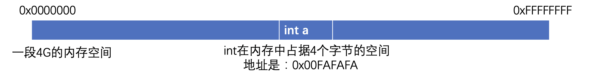

这里的`0x`是十六进制的表示形式（10-15用字母A - F表示）如果我们能够知道变量的内存地址，那么无论身在何处，都可以通过地址找到这个变量了。而指针的作用，就是专门用来保存这个内存地址的。

我们来看看如何创建一个指针变量用于保存变量的内存地址：

```c
#include <stdio.h>

int main(){
    int a = 10;
  	//指针类型需要与变量的类型相同，且后面需要添加一个*符号（注意这里不是乘法运算）表示是对于类型的指针
    int * p = &a;   //这里的&并不是进行按位与运算，而是取地址操作，也就是拿到变量a的地址
    printf("a在内存中的地址为：%p", p);  //地址使用%p表示
}
```


可以看到，我们通过取地址操作`&`，将变量a的地址保存到了一个地址变量`p`中。

拿到指针之后，我们可以很轻松地获取指针所指地址上的值：

```c
#include <stdio.h>

int main(){
    int a = 666;
    int * p = &a;
    printf("内存%p上存储的值为：%d", p, *p);   //我们可以在指针变量前添加一个*号（间接运算符，也可以叫做解引用运算符）来获取对应地址存储的值
}
```

注意这里访问指针所指向地址的值时，是根据类型来获取的，比如int类型占据4个字节，那么就读取地址后面4个字节的内容作为一个int值，如果指针是char类型的，那么就只读取地址后面1个字节作为char类型的值。


同样的，我们也可以直接像这样去修改对应地址存放的值：

```c
#include <stdio.h>

int main(){
    int a = 666;
    int * p = &a;

    *p = 999;   //通过*来访问对应地址的值，并通过赋值运算对其进行修改

    printf("a的值为：%d", a);
}
```


实际上拿到一个变量的地址之后，我们完全不需要再使用这个变量，而是可以通过它的指针来对其进行各种修改。因此，现在我们想要实现对两个变量的值进行交换的函数就很简单了：

```c
#include <stdio.h>

// 这里是两个指针类型的形参，其值为实参传入的地址，
// 虽然依然是值传递，但是这里传递的可是地址啊，
// 只要知道地址改变量还不是轻轻松松？
void swap(int * a, int * b){
    int tmp = *a;   //先暂存一下变量a地址上的值
    *a = *b;   //将变量b地址上的值赋值给变量a对应的位置
    *b = tmp;   //最后将a的值赋值给b对应位置，OK，这样就成功交换两个变量的值了
}

int main(){
    int a = 10, b = 20;
    swap(&a, &b);   //只需要把a和b的内存地址给过去就行了，这里取一下地址
    printf("a = %d, b = %d", a, b);
}
```

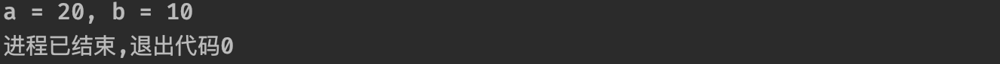

通过地址操作，我们就轻松实现了使用函数交换两个变量的值了。

了解了指针的相关操作之后，我们再来看看`scanf`函数，实际上就很好理解了：

```c
#include <stdio.h>

int main(){
    int a;
    scanf("%d", &a);   //这里就是取地址，我们需要告诉scanf函数变量的地址，这样它才能通过指针访问变量的内存地址，对我们变量的值进行修改，这也是为什么scanf里面的变量（除数组外）前面都要进行一个取地址操作
    printf("%d", a);
}
```

当然，和变量一样，要是咱们不给指针变量赋初始值的话，就不知道指的哪里了，因为指针变量也是变量，存放的其他变量的地址值也在内存中保存，如果不给初始值，那么存放别人地址的这块内存可能在其他地方使用过，这样就不知道初始值是多少了（那么指向的地址可能是一个很危险的地址，随意使用可能导致会出现严重错误），所以一定要记得给个初始值或是将其设定为NULL，表示空指针，不指向任何内容。

```c
#include <stdio.h>

int main(){
    int * a = NULL;
}
```

我们接着来看看`const`类型的指针，这种指针比较特殊：

```c
#include <stdio.h>

int main(){
    int a = 9, b = 10;
    const int * p = &a;
    *p = 20;   //这里直接报错，因为被const标记的指针，所指地址上的值不允许发生修改
  	p = &b;   //但是指针指向的地址是可以发生改变的
}
```

我们再来看另一种情况：

```c
#include <stdio.h>

int main(){
    int a = 9, b = 10;
    int * const p = &a;   //const关键字被放在了类型后面
    *p = 20;   //允许修改所指地址上的值
    p = &b;   //但是不允许修改指针存储的地址值，其实就是反过来了。
}
```

当然也可以双管齐下：

```c
#include <stdio.h>

int main(){
    int a = 9, b = 10;
    const int * const p = &a;
    *p = 20;   //两个都直接报错，都不让改了
    p = &b;
}
```

### 指针与数组

前面我们介绍了指针的基本使用，我们来回顾一个问题，为什么数组可以以原身在函数之间进行传递呢？先说结论，数组表示法实际上是在变相地使用指针，你甚至可以将其理解为数组变量其实就是一个指针变量，它存放的就是数组中第一个元素的起始地址。

为什么这么说？

```c
#include <stdio.h>

int main(){
    char str[] = "Hello World!";
    char * p = str;   //？？？啥情况，为什么能直接把数组作为地址赋值给指针变量p？？？

    printf("%c", *p);   //还能正常使用，打印出第一个字符？？？
}
```


你以为这就完了？还能这样玩呢：

```c
int main(){
    char str[] = "Hello World!";
    char * p = str;

    printf("%c", p[1]);   //？？？怎么像在使用数组一样用指针？？？
}
```

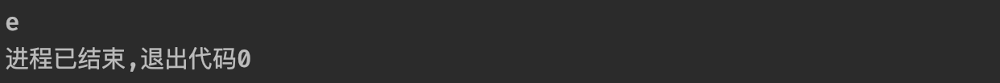

太迷了吧，怎么数组和指针还能这样混着用呢？我们先来看看数组在内存中是如何存放的：

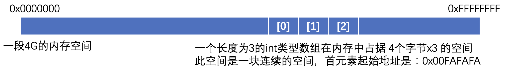

数组在内存中是一块连续的空间，所以为什么声明数组一定要明确类型和大小，因为这一块连续的内存空间生成后就固定了。

而我们的数组变量实际上存放的就是首元素的地址，而实际上我们之前一直使用的都是**数组表示法**来操作数组，这样可以很方便地让我们对内存中的各个元素值进行操作：

```c
int main(){
    char str[] = "Hello World!";
    printf("%c", str[0]);   //直接在中括号中输入对应的下标就能访问对应位置上的数组了
}
```

而我们知道实际上`str`表示的就是数组的首地址，所以我们完全可以将其赋值给一个指针变量，因为指针变量也是存放的地址：

```c
char str[] = "Hello World!";
char * p = str;   //直接把str代表的首元素地址给到p
```

而使用指针后，实际上我们可以使用另一种表示法来操作数组，这种表示法叫做**指针表示法**：

```c
int main(){
    char str[] = "Hello World!";
    char * p = str;

    printf("第一个元素值为：%c，第二个元素值为：%c", *p, *(p+1));   //通过指针也可以表示对应位置上的值
}
```

比如我们现在需要表示数组中的第二个元素：

* 数组表示法：`str[1]`
* 指针表示法：`*(p+1)`

虽然写法不同，但是他们表示的意义是完全相同的，都代表了数组中的第二个元素，其中指针表示法使用了`p+1`的形式表示第二个元素，这里的`+1`操作并不是让地址+1，而是让地址`+ 一倍的对应类型大小`，也就是说地址后移一个char的长度，所以正好指向了第二个元素，然后通过`*`取到对应的值（注意这种操作仅对数组是有意义的，如果是普通的变量，虽然也可以通过这种方式获得后一个char的长度的数据，但是毫无意义）

```c
*(p+i)   <=>    str[i]    //实际上就是可以相互转换的
```

这两种表示法都可以对内存中存放的数组内容进行操作，只是写法不同罢了，所以你会看到数组和指针混用也就不奇怪了。了解了这些东西之后，我们来看看下面的各个表达式分别代表什么：

```c
*p   //数组的第一个元素
p   //数组的第一个元素的地址
p == str   //肯定是真，因为都是数组首元素地址
*str    //因为str就是首元素的地址，所以这里对地址加*就代表第一个元素，使用的是指针表示法
&str[0]   //这里得到的实际上还是首元素的地址
*(p + 1)   //代表第二个元素
p + 1    //第二个元素的内存地址
*p + 1    //注意*的优先级比+要高，所以这里代表的是首元素的值+1，得到字符'K'
```

所以不难理解，为什么`printf`函数的参数是一个`const char * `了，实际上就是需要我们传入一个字符串而已，只不过这里采用的是指针表示法而已。

当然指针也可以进行自增和自减操作，比如：

```c
#include <stdio.h>

int main(){
    char str[] = "Hello World!";
    char * p = str;

    p++;  //自增后相当于指针指向了第二个元素的地址

    printf("%c", *p);   //所以这里打印的就是第二个元素的值了
}
```

一维数组看完了，我们来看看二维数组，那么二维数组在内存中是如何表示的呢？

```c
int arr[2][3] = {{1, 2, 3}, {4, 5, 6}};
```

这是一个2x3的二维数组，其中存放了两个能够容纳三个元素的数组，在内存中，是这样的：

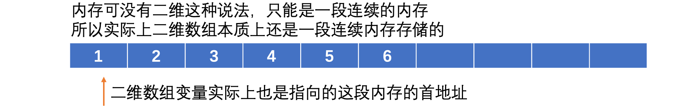

所以虽然我们可以使用二维数组的语法来访问这些元素，但其实我们也可以使用指针来进行访问：

```c
#include <stdio.h>

int main(){
    int arr[][3] = {{1, 2, 3}, {4, 5, 6}};
    int * p = arr[0];  //因为是二维数组，注意这里要指向第一个元素，来降一个维度才能正确给到指针
    //同理如果这里是arr[1]的话那么就表示指向二维数组中第二个数组的首元素
    printf("%d = %d", *(p + 4), arr[1][1]);   //实际上这两种访问形式都是一样的
}
```

### 多级指针

我们知道，实际上指针本身也是一个变量，它存放的是目标的地址，但是它本身作为一个变量，它也要将地址信息保存到内存中，所以，实际上当我们有指针之后：


实际上，我们我们还可以继续创建一个指向指针变量地址的指针，甚至可以创建更多级（比如指向指针的指针的指针）比如现在我们要创建一个指向指针的指针：


落实到咱们的代码中：

```c
#include <stdio.h>

int main(){
    int a = 20;
    int * p = &a;   //指向普通变量的指针
    //因为现在要指向一个int *类型的变量，所以类型为int* 再加一个*
    int ** pp = &p;   //指向指针的指针（二级指针）
    int *** ppp = &pp;   //指向指针的指针的指针（三级指针）
}
```

那么我们如何访问对应地址上的值呢？

```c
#include <stdio.h>

int main(){
    int a = 20;
    int * p = &a;
    int ** pp = &p;

    printf("p = %p, a = %d", *pp, **pp);  //使用一次*表示二级指针指向的指针变量，继续使用一次*会继续解析成指针变量所指的普通变量
}
```

本质其实就是一个套娃而已，只要把各个层次分清楚，实际上还是很好理解的。

**特别提醒：**一级指针可以操作一维数组，那么二级指针是否可以操作二维数组呢？不能！因为二级指针的含义都不一样了，它是表示指针的指针，而不是表示某个元素的指针了。下面我们会认识数组指针，准确的说它才更贴近于二维数组的形式。

### 指针数组与数组指针

前面我们了解了指针的一些基本操作，包括它与数组的一些关系。我们接着来看指针数组和数组指针，这两词语看着就容易搞混，不过哪个词在后面就哪个，我们先来看指针数组，虽然名字很像数组指针，但是它本质上是一个数组，不过这个数组是用于存放指针的数组。

```c
#include <stdio.h>

int main(){
    int a, b, c;
    int * arr[3] = {&a, &b, &c};   //可以看到，实际上本质还是数组，只不过存的都是地址
}
```

因为这个数组中全都是指针，比如现在我们想要访问数组中第一个指针指向的地址：

```c
#include <stdio.h>

int main(){
    int a, b, c;
    int * arr[3] = {&a, &b, &c};

    *arr[0] = 999;   //[]运算符的优先级更高，所以这里先通过[0]取出地址，然后再使用*将值赋值到对应的地址上
    printf("%d", a);
}
```

当然我们也可以用二级指针变量来得到指针数组的首元素地址：

```c
#include <stdio.h>

int main(){
    int * p[3];   //因为数组内全是指针
    int ** pp = p;  //所以可以直接使用指向指针的指针来指向数组中的第一个指针元素
}
```

实际上指针数组还是很好理解的，那么数组指针呢？可以看到指针在后，说明本质是一个指针，不过这个指针比较特殊，它是一个指向数组的指针（注意它的目标是整个数组，和我们之前认识的指针不同，之前认识的指针是指向某种类型变量的指针）

比如：

```c
int * p;   //指向int类型的指针
```

而数组指针则表示指向整个数组：

```c
int (*p)[3];   //注意这里需要将*p括起来，因为[]的优先级更高
```

注意它的目标是整个数组，而不是普通的指针那样指向的是数组的首个元素：

```c
int arr[3] = {111, 222, 333};
int (*p)[3] = &arr;  //直接对整个数组再取一次地址（因为数组指针代表的是整个数组的地址，虽然和普通指针都是指向首元素地址，但是意义不同）
```

那么现在已经取到了指向整个数组的指针，该怎么去使用呢？

```c
#include <stdio.h>

int main(){
    int arr[3] = {111, 222, 333};
    int (*p)[3] = &arr;  //直接对整个数组再取一次地址

    printf("%d, %d, %d", *(*p+0), *(*p+1), *(*p+2));   //要获取数组中的每个元素，稍微有点麻烦
}
```

注意此时：

* `p`代表整个数组的地址
* `*p`表示所指向数组中首元素的地址
* `*p+i`表示所指向数组中第`i`个（0开始）元素的地址（实际上这里的*p就是指向首元素的指针）
* `*(*p + i)`就是取对应地址上的值了

虽然在处理一维数组上感觉有点麻烦，但是它同样也可以处理二维数组：

```c
int arr[][3] = {{111, 222, 333}, {444, 555, 666}};
int (*p)[3] = arr;  //二维数组不需要再取地址了，因为现在维度提升，数组指针指向的是二维数组中的其中一个元素（因为元素本身就是一个数组）
```

比如现在我们想要访问第一个数组的第二个元素，根据上面p各种情况下的意义：

```c
printf("%d", *(*p+1));   //因为上面直接指向的就是第一个数组，所以想要获取第一个元素和之前是一模一样的
```

那么要是我们现在想要获取第二个数组中的最后一个元素呢？

```c
printf("%d", *(*(p+1)+2);   //首先*(p+1)为一个整体，表示第二个数组（因为是数组指针，所以这里+1一次性跳一个数组的长度），然后再到外层+2表示数组中的第三个元素，最后再取地址，就是第二个数组的第三个元素了
```

当然也可以使用数组表示法：

```java
printf("%d", p[1][2]);   //好家伙，这不就是二维数组的用法吗，没错，看似很难，你甚至可以认为这两用着是同一个东西
```

### 指针函数与函数指针

我们的函数可以返回一个指针类型的结果，这种函数我们就称为**指针函数**。

```c
#include <stdio.h>

int * test(int * a){   //函数的返回值类型是int *指针类型的
    return a;
}

int main(){
    int a = 10;
    int * p = test(&a);   //使用指针去接受函数的返回值
    printf("%d", *p);
  	printf("%d", *test(&a));   //当然也可以直接把间接运算符在函数调用前面表示直接对返回的地址取地址上的值
}
```

不过要注意指针函数不要尝试去返回一个局部变量的地址：

```c
#include <stdio.h>

int * test(int a){
    int i = a;
    return &i;   //返回局部变量i的地址
}

int main(){
    int * p = test(20);   //连续调用两次test函数
    test(30);

    printf("%d", *p);   //最后结果可能并不是我们想的那样
}
```

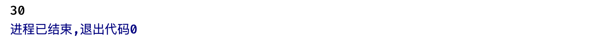

为什么会这样呢？还记得我们前面说的吗？函数一旦返回，那么其中的局部变量就会全部销毁了，至于这段内存之后又会被怎么去使用，我们也就不得而知了。

*局部变量其实是存放在栈帧中的，如果前面的选学部分听了之后，你就知道为什么这里得到的是第二次的30了，因为第二次调用的栈帧入栈后就覆盖了这段内存，又因为是同一个函数所以栈帧结构是一样的，最后在同样的位置就存放了新的30这个值。*

我们接着来看**函数指针**，实际上指针除了指向一个变量之外，也可以指向一个函数，当然函数指针本身还是一个指针，所以依然是用变量表示，但是它代表的是一个函数的地址（编译时系统会为函数代码分配一段存储空间，这段存储空间的首地址称为这个函数的地址）

我们来看看如何定义：

```c
#include <stdio.h>

int sum(int a, int b) {
    return a + b;
}

int main(){
  	//类型 (*指针变量名称)(函数参数...)  //注意一定要把*和指针变量名称括起来，不然优先级不够
    int (*p)(int, int) = sum;
    printf("%p", p);
}
```

这样我们就拿到了函数的地址，既然拿到函数的地址，那么我们就可以通过函数的指针调用这个函数了：

```c
#include <stdio.h>

int sum(int a, int b) {
    return a + b;
}

int main(){
    int (*p)(int, int) = sum;

    int result = (*p)(1, 2);   //就像我们正常使用函数那样，(*p)表示这个函数，后面依然是在小括号里面填上实参
  	int result = p(1, 2);  //当然也可以直接写函数指针变量名称，效果一样（咋感觉就是给函数换了个名呢）
    printf("%d", result);
}
```

有了函数指针，我们就可以编写函数回调了（所谓回调就让别人去调用我们提供的函数，而不是我们主动来调别人的函数），比如现在我们定义了一个函数，不过这个函数需要参数通过一个处理的逻辑才能正常运行：

```c
int sum(int (*p)(int, int), int a, int b){  //将函数指针作为参数传入
  	//函数回调
    return p(a, b);    //就像你进了公司然后花钱请别人帮你写代码，工资咱们五五开，属于是直接让别人帮你实现
}
```

于是我们就还要给他一个其他函数的地址：

```c
#include <stdio.h>

int sum(int (*p)(int, int), int a, int b){
    return p(a, b);
}

int sumImpl(int a, int b){   //这个函数实现了a + b
    return a + b;
}

int main(){
    int (*p)(int, int) = sumImpl;  //拿到实现那个函数的地址
    printf("%d", sum(p, 10, 20));  
}
```

当然，函数指针也可以保存一组函数的地址，成为函数指针数组，但是这里就不多说了，相信各位已经快顶不住了吧。

### 实战：合并两个有序数组

**来源：力扣 No.88 合并两个有序数组**：https://leetcode.cn/problems/merge-sorted-array/

给你两个按 非递减顺序 排列的整数数组 nums1 和 nums2，另有两个整数 m 和 n ，分别表示 nums1 和 nums2 中的元素数目。

请你 合并 nums2 到 nums1 中，使合并后的数组同样按 非递减顺序 排列。

注意：最终，合并后数组不应由函数返回，而是存储在数组 nums1 中。为了应对这种情况，nums1 的初始长度为 m + n，其中前 m 个元素表示应合并的元素，后 n 个元素为 0 ，应忽略。nums2 的长度为 n 。

> 示例 1：
>
> 输入：nums1 = [1,2,3,0,0,0], m = 3, nums2 = [2,5,6], n = 3
> 输出：[1,2,2,3,5,6]
> 解释：需要合并 [1,2,3] 和 [2,5,6] 。
> 合并结果是 [1,2,2,3,5,6] ，其中斜体加粗标注的为 nums1 中的元素。
>
> 示例 2：
>
> 输入：nums1 = [1], m = 1, nums2 = [], n = 0
> 输出：[1]
> 解释：需要合并 [1] 和 [] 。
> 合并结果是 [1] 。
>
> 示例 3：
>
> 输入：nums1 = [0], m = 0, nums2 = [1], n = 1
> 输出：[1]
> 解释：需要合并的数组是 [] 和 [1] 。
> 合并结果是 [1] 。
> 注意，因为 m = 0 ，所以 nums1 中没有元素。nums1 中仅存的 0 仅仅是为了确保合并结果可以顺利存放到 nums1 中。

现在请你设计一个C语言程序，实现下面的函数（要求全程使用指针，不允许出现数组用法）：

```c
void merge(int* nums1, int nums1Size, int m, int* nums2, int nums2Size, int n){

}
```

### 实战：二维数组中的查找

**来源：剑指Offer 04. 二维数组中的查找**：https://leetcode.cn/problems/er-wei-shu-zu-zhong-de-cha-zhao-lcof/

在一个 n * m 的二维数组中，每一行都按照从左到右递增的顺序排序，每一列都按照从上到下递增的顺序排序。请完成一个高效的函数，输入这样的一个二维数组和一个整数，判断数组中是否含有该整数。

> 示例:
>
> 现有矩阵 matrix 如下：
>
> [
> [1,   4,  7, 11, 15],
> [2,   5,  8, 12, 19],
> [3,   6,  9, 16, 22],
> [10, 13, 14, 17, 24],
> [18, 21, 23, 26, 30]
> ]
>
> 给定 target = 5，返回 true。
>
> 给定 target = 20，返回 false。

现在请你设计一个C语言程序，实现下面的函数（要求全程使用指针，不允许出现数组用法）：

```c
/*
 * 输入 **matrix 是长度为 matrixSize 的数组指针的数组，其中每个元素（也是一个数组）
 * 的长度组成 *matrixColSize 数组作为另一输入，*matrixColSize 数组的长度也为 matrixSize
 */
bool findNumberIn2DArray(int** matrix, int matrixSize, int* matrixColSize, int target){

}
```

***

## 结构体、联合体和枚举

终于熬过了最难的一个部分，后面的内容就相对简单多了，我们接着来看结构体。

我们之前认识过很多种数据类型，包括整数、小数、字符、数组等，通过使用对应的数据类型，我们就可以很轻松地将我们的数据进行保存了，但是有些时候，这种简单类型很难去表示一些复杂结构。

### 创建和使用结构体

比如现在我们要保存100个学生的信息（学生信息包括学号、姓名、年龄）我们发现似乎找不到一种数据类型能够同时保存这三种数据（数组虽然能保存一些列的元素，但是只能保存同种类型的）。但是如果把它们拆开单独存在，就可以使用对应的类型存放了，不过这样也太不方便了吧，这些数据应该是捆绑在一起的，而不是单独地去存放。所以，为了解决这种问题，C语言提供了结构体类型，它能够将多种类型的数据集结到一起，让他们形成一个整体。

```c
struct Student {   //使用 (struct关键字 + 结构体类型名称) 来声明结构体类型，这种类型是我们自己创建的（同样也可以作为函数的参数、返回值之类的）
    int id;    //结构体中可以包含多个不同类型的数据，这些数据共同组成了整个结构体类型（当然结构体内部也能包含结构体类型的变量）
    int age;
    char * name;   //用户名可以用指针指向一个字符串，也可以用char数组来存，如果是指针的话，那么数据不会存在结构体中，只会存放字符串的地址，但是如果是数组的话，数据会存放在结构体中
};
```

```c
int main() {
    struct Student {   //也可以以局部形式存在
        
    };
}
```

定义好结构体后，我们只需要使用结构体名称作为类型就可以创建一个结构体变量了：

```c
#include <stdio.h>

struct Student {
    int id;
    int age;
    char * name;
};

int main() {
  	//类型需要写为struct Student，后面就是变量名称
    struct Student s = {1, 18, "小明"};     //结构体包含多种类型的数据（它们是一个整体），只需要把这些数据依次写好放在花括号里面就行了
}
```

```c 
struct Student {
    int id;
    int age;
    char * name;
} s;  //也可以直接在花括号后面写上变量名称（多个用逗号隔开），声明一个全局变量
```

这样我们就创建好了一个结构体变量，而这个结构体表示的就是学号为1、年龄18、名称为小明的结构体数据了。

当然，结构体的初始化需要注意：

```c
struct Student s = {1, 18};   //如果只写一半，那么只会初始化其中一部分数据，剩余的内容相当于没有初始值，跟数组是一样的
struct Student s = {1, .name = "小红"};   //也可以指定去初始化哪一个属性 .变量名称 = 初始值
```

那么现在我们拿到结构体变量之后，怎么去访问结构体内部存储的各种数据呢？

```c
printf("id = %d, age = %d, name = %s", s.id, s.age, s.name);  //结构体变量.数据名称 (这里.也是一种运算符) 就可以访问结构体中存放的对应的数据了
```

是不是很简单？当然我们也可以通过同样的方式对结构体中的数据进行修改：

```C
int main() {
    struct Student s = {1, 18, "小明"};

    s.name = "小红";
  	s.age = 17;

    printf("id = %d, age = %d, name = %s", s.id, s.age, s.name);
}
```

那么结构体在内存中占据的大小是如何计算的呢？比如下面的这个结构体

```c
struct Object {
    int a;
    short b;
    char c;
};
```

这里我们可以借助`sizeof`关键字来帮助我们计算：

```c
int main() {
    printf("int类型的大小是：%lu", sizeof(int));  //sizeof能够计算数据在内存中所占据的空间大小（字节为单位）
}
```

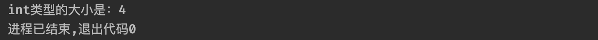

当然也可以计算变量的值占据的大小：

```c
int main() {
    int arr[10];
    printf("int arr[10]占据的大小是：%lu", sizeof (arr)); //在判断非类型时，sizeof 括号可省
}
```

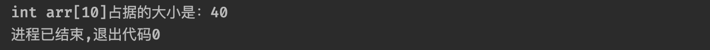

同样的，它也能计算我们的结构体类型会占用多少的空间：

```c
#include <stdio.h>

struct Object {
  	char a;
    int b;
    short c;
};

int main() {
    printf("%lu", sizeof(struct Object));   //直接填入struct Object作为类型
}
```

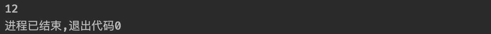

可以看到结果是8，那么，这个8字节是咋算出来的呢？

> int（4字节）+ short（2字节）+ char（1字节） =  7字节（这咋看都算不出来12啊？）

实际上结构体的大小是遵循下面的规则来进行计算的：

* 结构体中的各个数据要求字节对齐，规则如下：
  * **规则一：**结构体中元素按照定义顺序依次置于内存中，但并不是紧密排列的。从结构体首地址开始依次将元素放入内存时，元素会被放置在其自身对齐大小的整数倍地址上（0默认是所有大小的整数倍）
  * **规则二：**如果结构体大小不是所有元素中最大对齐大小的整数倍，则结构体对齐到最大元素对齐大小的整数倍，填充空间放置到结构体末尾。
  * **规则三：**基本数据类型的对齐大小为其自身的大小，结构体数据类型的对齐大小为其元素中最大对齐大小元素的对齐大小。

这里我们以下面的为例：

```c
struct Object {
  	char a;   //char占据1个字节
    int b;   //int占据4个字节，因为前面存了一个char，按理说应该从第2个字节开始存放，但是根据规则一，必须在自己的整数倍位置上存放，所以2不是4的整数倍位置，这时离1最近的下一个整数倍地址就是4了，所以前面空3个字节的位置出来，然后再放置
    short c; //前面存完int之后，就是从8开始了，刚好满足short（2字节）的整数倍，但是根据规则二，整个结构体大小必须是最大对齐大小的整数倍（这里最大对齐大小是int，所以是4），存完short之后，只有10个字节，所以屁股后面再补两个空字节，这样就可以了
};
```


这样，就不难得出为什么结构体的大小是12了。

### 结构体数组和指针

前面我们介绍了结构体，现在我们可以将各种类型的数据全部安排到结构体中一起存放了。

不过仅仅只是使用结构体，还不够，我们可能需要保存很多个学生的信息，所以我们需要使用结构体类型的数组来进行保存：

```c
#include <stdio.h>

struct Student {
    int id;
    int age;
    char * name;
};

int main() {
    struct Student arr[3] = {{1, 18, "小明"},   //声明一个结构体类型的数组，其实和基本类型声明数组是一样的
                             {2, 17, "小红"},   //多个结构体数据用逗号隔开
                             {3, 18, "小刚"}};
}
```

那么现在如果我们想要访问数组中第二个结构体的名称属性，该怎么做呢？

```c
int main() {
    struct Student arr[3] = {{1, 18, "小明"},
                             {2, 17, "小红"},
                             {3, 18, "小刚"}};

    printf("%s", arr[1].name);   //先通过arr[1]拿到第二个结构体，然后再通过同样的方式 .数据名称 就可以拿到对应的值了
}
```

当然，除了数组之外，我们可以创建一个指向结构体的指针。

```c
int main() {
    struct Student student = {1, 18, "小明"};
    struct Student * p = &student;   //同样的，类型后面加上*就是一个结构体类型的指针了
}
```

我们拿到结构体类型的指针后，实际上指向的就是结构体对应的内存地址，和之前一样，我们也可以通过地址去访问结构体中的数据：

```c
int main() {
    struct Student student = {1, 18, "小明"};
    struct Student * p = &student;

    printf("%s", (*p).name);  //由于.运算符优先级更高，所以需要先使用*p得到地址上的值，然后再去访问对应数据
}
```

不过这样写起来太累了，我们可以使用简便写法：

```c
printf("%s", p->name);   //使用 -> 运算符来快速将指针所指结构体的对应数据取出
```

我们来看看结构体作为参数在函数之间进行传递时会经历什么：

```c
void test(struct Student student){
    student.age = 19;   //我们对传入的结构体中的年龄进行修改
}

int main() {
    struct Student student = {1, 18, "小明"};
    test(student);
    printf("%d", student.age);  //最后会是修改后的值吗？
}
```


可以看到在其他函数中对结构体内容的修改并没有对外面的结构体生效，因此，实际上结构体也是值传递。我们修改的只是另一个函数中的局部变量而已。

所以如果我们需要再另一个函数中处理外部的结构体，需要传递指针：

```c
void test(struct Student * student){   //这里使用指针，那么现在就可以指向外部的结构体了
    student->age = 19;   //别忘了指针怎么访问结构体内部数据的
}

int main() {
    struct Student student = {1, 18, "小明"};
    test(&student);   //传递结构体的地址过去
    printf("%d", student.age);
}
```


当然一般情况下推荐传递结构体的指针，而不是直接进行值传递，因为如果结构体非常大的话，光是数据拷贝就需要花费很大的精力，并且某些情况下我们可能根本用不到结构体中的所有数据，所以完全没必要浪费空间，使用指针反而是一种更好的方式。

### 联合体

联合体也可以在内部定义很多种类型的变量，但是它与结构体不同的是，所以的变量共用同一个空间。？？？？啥意思？

```c
union Object {   //定义一个联合体类型唯一不同的就是前面的union了
    int a;
    char b;
    float c;
};
```

我们来看看一个神奇的现象：

```c
#include <stdio.h>

union Object {
    int a;
    char b;
    float c;
};

int main() {
    union Object object;
    object.a = 66;   //先给a赋值66
    printf("%d", object.b);   //访问b
}
```


？？？？

我修改的是a啊，怎么b也变成66了？这是因为它们共用了内存空间，实际上我们先将a修改为66，那么就将这段内存空间上的值修改为了66，因为内存空间共用，所以当读取b时，也会从这段内存空间中读取一个char长度的数据出来，所以得到的也是66。

```c
int main() {
    union Object object;
    object.a = 128;
    printf("%d", object.b);
}
```

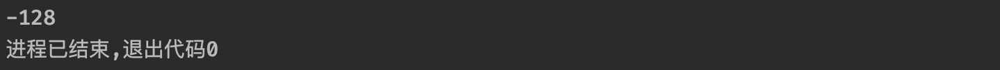

因为：128 = 10000000，所以用char读取后，由于第一位是符号位，于是就变成了-128。

那么联合体的大小又是如何决定的呢？

```c
union Object {
    int a;
    char b;
    float c;
};

int main() {
    printf("%lu", sizeof(union Object));
}
```


实际上，联合体的大小至少是其内部最大类型的大小，这里是int所以就是4，当然，当最大成员大小不是最大对齐数的整数倍的时候，就要对齐到最大对齐数的整数倍。

当然联合体的其他使用基本与结构体差不多，这里就不提了。

### 枚举

最后我们来看一下枚举类型，枚举类型一般用于表示一些预设好的整数常量，比如我们风扇有低、中、高三个档位，我们总是希望别人使用我们预设好的这三个档位，而不希望使用其他的档位，因为我们风扇就只设计了这三个档位。

这时我们就可以告诉别人，我们的风扇有哪几个档位，这种情况使用枚举就非常适合。在我们的程序中，只能使用基本数据类型对这三种档位进行区分，这样显然可读性不够，别人怎么知道哪个代表哪个档位呢？而使用枚举就没有这些问题了：

```c
/**
 * 比如现在我们设计：
 * 1 = 低档位
 * 2 = 中档位
 * 3 = 高档位
 */
enum status {low = 1, middle = 2, high = 3};   //enum 枚举类型名称 {枚举 = 初始值, 枚举...}
```

我们可以创建多个自定义名称的枚举，命名规则和变量差不多。我们可以当每一个枚举对应一个整数值，这样的话，我们就不需要去记忆每个数值代表的是什么档位了，我们可以直接根据枚举的名称来进行分辨，是不是很方便？

使用枚举也非常地方便：

```c
enum status {low = 1, middle = 2, high = 3};

int main() {
    enum status a = low;   //和之前一样，直接定义即可，类型为enum + 枚举名称，后面是变量名称，值可以直接写对应的枚举
    printf("%d", a);
}
```

```c
int main() {
    enum status a = high;
    if(a == low) {   //判断起来就方便多了
        printf("低档位");
    } else if (a == high){
        printf("高档位");
    } else {
        printf("中档位");
    }
}
```

当然也可以直接加入到`switch`语句中：

```c
int main() {
    enum status a = high;
    switch (a) {
        case low:
        case high:
        case middle:
        default: ;
    }
}
```

不过在枚举变量定义时需要注意：

```c
enum status {low, middle, high};   //如果不给初始值的话，那么会从第一个枚举开始，默认值为0，后续依次+1
```

所以这里的low就是0，middle就是1，high就是2了。

如果中途设定呢？

```c
enum status {low, middle = 6, high};   //这里我们给middle设定为6
```

这时low由于是第一个，所以还是从0开始，不过middle这里已经指定为6了，所以紧跟着的high初始值就是middle的值+1了，因此low现在是0，middle就是6，high就是7了。

### typedef关键字

这里最后还要提一下typedef关键字，这个关键字用于给指定的类型起别名。怎么个玩法呢？

```c
typedef int lbwnb;   //食用方式：typedef 类型名称 自定义类型别名
```

比如这里我们给int起了一个别名，那么现在我们不仅可以使用int来表示一个int整数，而且也可以使用别名作为类型名称了：

```c
#include <stdio.h>

typedef int lbwnb;

int main() {
    lbwnb i = 666;   //类型名称直接写成别名，实际上本质还是int
    printf("%d", i);
}
```

```c
typedef const char * String;   //const char * 我们就起个名称为String表示字符串

int main() {
    String str = "Hello World!";  //是不是有Java那味了
    printf(str);
}
```

当然除了这种基本类型之外，包括指针、结构体、联合体、枚举等等都可以使用这个关键字来完全起别名操作：

```c
#include <stdio.h>

typedef struct test {
    int age;
    char name[10];
} Student;   //为了方便可以直接写到后面，当然也可以像上面一样单独声明

int main() {
    Student student = {18, "小明"};   //直接使用别名，甚至struct关键字都不用加了
}
```

在数据结构的学习总，typedef使用会更加地频繁。

***

## 预处理

虽然我们的C语言学习已经快要接近尾声了，但是有一个东西迟迟还没有介绍，就是我们一直在写的：

```c
#include <stdio.h>
```

这到底是个什么东西，为什么每次都要加上呢？这一部分，我们将详细讨论它缘由。

`#include`实际上是一种预处理指令，在我们的程序运行之前，会有一个叫做"C预处理器"的东西，根据我们程序中的预处理指令，预处理器能把对应的指令替换为指令想要表示的内容。我们先来看看`#include`做了什么。

### 文件包含

当预处理器发现`#include`指令时，会查看后面的文件名并把文件的内容包含到当前文件中，来替换掉`#include`指令。比如：

```c
int main() {
    printf("Hello World!");   //一个很普通的printf打印函数
}
```

我们说了，这个函数是由系统为我们提供的函数，实际上这个函数实在其他源文件中定义好的，而定义这个函数的源文件，就是`stdio.h`，我们可以点进去看看：

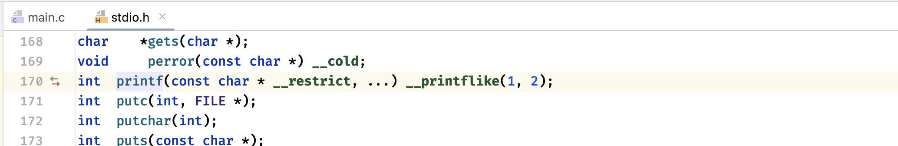

除了`printf`之外，我们看到还有很多很多的函数原型定义，他们都写到这个源文件中，而这个文件并不是以`.c`结尾的，而是以`.h`结尾的，这种文件我们称为**头文件**。头文件一般仅包含定义一类的简单信息，只要能让编译器认识就行了。

而`#include`则是将这些头文件中提供的信息包含到我们的C语言源文件中，这样我们才能使用定义好的`printf`函数，如果我们不添加这个指令的话，那么会：

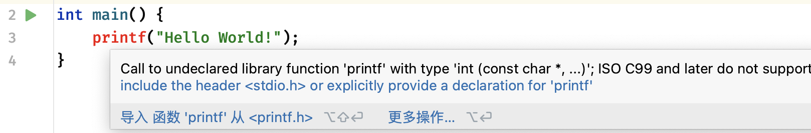

直接不认识了，`printf`是啥，好吃吗？说白了就是，我们如果不告诉编译器我们的这个函数是从哪来的，它怎么知道这个函数的具体定义什么是，程序又该怎么执行呢？

`#include`的具体使用格式如下：

```c
#include <文件名称>
```

当然也可以写成：

```
#include "文件名称"
```

这两种写法虽然都能引入头文件，但是区别还是有的：

* **尖括号：**引用的是编译器的库路径里面的头文件。
* **双引号：**引用的是程序目录中相对路径中的头文件，如果找不到再去上面的库里面找。

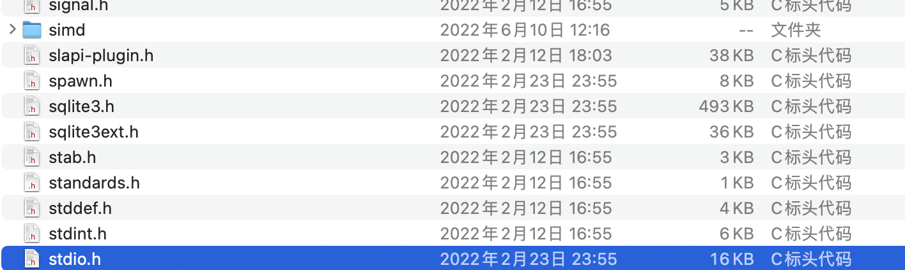

可以看到系统已经为我们提供好了多种多样的头文件了，通过这些系统提供的库，我们就可以做很多的事情了。

当然我们也可以自己编写一个头文件，直接在项目根目录下创建一个新的C/C++头文件：

```c
//
// Created by Nago Coler on 2023/6/26.
//

#ifndef UNTITLED_TEST_H
#define UNTITLED_TEST_H

#endif //UNTITLED_TEST_H
```

可以看到系统自动为我们生成好了这些内容，只不过现在还没学到（后面会介绍），现在直接删掉：

```c
int test(int a, int b);
```

我们直接在头文件中随便声明一个函数原型，接着我们就可以引入这个头文件了：

```c
#include <stdio.h>
#include "test.h"   //因为是我们自己项目目录中的，所以需要使用双引号

int main() {
    int c = test(1, 2);   //这样就可以使用头文件中声明的函数了
}
```

通过导入头文件，我们就可以使用定义好的各种内容了，当然，不仅仅局限于函数。

不过现在还没办法执行，因为我们这里只是引入了头文件中定义的函数原型，具体的函数实现我们一般还是使用`.c`源代码文件去进行编写，这里我们创建一个同名的C源文件（不强制要求同名，但是这样看着整齐一点）去实现一下：

```c
#include "test.h"  //这里也需要把定义引入

int test(int a, int b) {   //编写函数具体实现
    return a + b;
}
```

这样，我们再次运行程序就可以正确得到结果了：

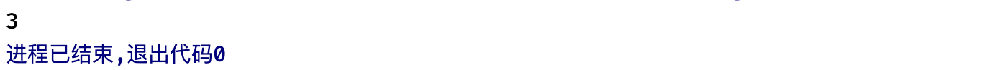

实际上预处理器正是通过头文件得到编译代码时所需的一些信息，然后才能把我们程序需要的内容（比如这里要用到的test函数）替换到我们的源文件中，最后才能正确编译为可执行程序。

比如现在我们要做一个学生管理库，这个库中提供了学生结构体的定义，以及对学生信息相关操作：

```c
struct stu {   //学生结构体定义
    int id;
    int age;
    char name[20];
} typedef Student;

void print(Student * student);   //打印学生信息
void modifyAge(Student * student, int newAge);   //修改年龄 
void modifyId(Student * student, int newId);   //修改学号
```

```c
#include <stdio.h>    //函数具体实现源文件
#include "student.h"

void print(Student * student) {
    printf("ID: %d, 姓名: %s, 年龄: %d岁\n", student->id, student->name, student->age);
}

void modifyAge(Student * student, int newAge) {
    student->age = newAge;
}

void modifyId(Student * student, int newId) {
    student->id = newId;
}
```

最后我们就可以愉快地使用了：

```c
#include "student.h"

int main() {
    Student student = {1, 18, "小明"};
    modifyAge(&student, 19);
    print(&student);   //打印
}
```

通过使用`#include`我们就可以将我们的项目拆分成多个模块去进行编写了。

### 系统库介绍

前面我们了解了如何使用`#include`引入其他文件，我们接着来了解一下系统为我们提供的一些常用库。实际上我们已经用过不少官方库提供的内容了：

```c
#include <stdio.h>

int main() {
    int a;
    scanf("%d", &a);
    printf("%d", a);
    getchar();
    putchar('A');
    ...
}
```

包括前面我们在实战中用到了一次`string.h`中提供的计算字符串长度的函数：

```c
#include <stdio.h>
#include <string.h>

int main() {
    char * c = "Hello World!";
    printf("%lu", strlen(c));   //使用strlen计算长度，注意返回值类型是size_t（别名而已，本质上就是unsigned long）
}
```

当然除了这个函数之外，实际上还有很多实用的字符串处理函数，都在这里定义了：

```c
#include <stdio.h>
#include <string.h>

int main() {
    char a[20] = "Hello",* b = "World!";   //现在有两个字符串，但是我们希望把他们拼接到一起
  	//注意不能这样写 char * a = "Hello",* b = "World!"; 如果直接用指针指向字符串常量，是无法进行拼接的，因为大小已经固定了
  	//这里需要两个参数，第一个是目标字符串，一会会将第二个参数的字符串拼接到第一个字符串中（注意要装得下才行）
    strcat(a, b);
    printf("%s", a);
}
```

```c
int main() {
    char str[10], * c = "Hello";
    strcpy(str, c);   //使用cpy会直接将后面的字符串拷贝到前面的字符串数组中（同样需要前面装得下才行）
    printf("%s", str);
}
```

```c
int main() {
    char * a = "AAA", * b = "AAB";
    int value = strcmp(a, b);   //strcmp会比较两个字符串，并返回结果
    printf("%d", value);
}
```

这里需要说一下的比较规则：把字符串str1和str2从首字符开始逐个字符的进行比较，直到某个字符不相同或者其中一个字符串比较完毕才停止比较，字符的比较按照ASCII码的大小进行判断。

比较完成后，会返回不匹配的两个字符的ASCII码之差：

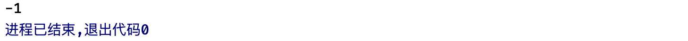

我们接着来看用于处理数学问题的相关库：

```c
#include <math.h>
```

这里要用到`math.h`，它提供了我们场景的数学计算函数，比如求算术平方根、三角函数、对数等。

```c
#include <stdio.h>
#include <math.h>

int main() {
    int a = 2;
    double d = sqrt(a);   //使用sqrt可以求出非负数的算术平方根（底层采用牛顿逼近法计算）
    printf("%lf", d);
}
```


当然能够开根，也可以做乘方：

``` c
int main() {
    int a = 2;
    double d = pow(a, 3);   //使用pow可以快速计算乘方，这里求的是a的3次方
    printf("%lf", d);
}
```

有了这个函数，写个水仙花数更简单了：

```c
int main() {
    for (int i = 0; i < 1000; ++i) {
        int a = i % 10, b = i / 10 % 10, c = i / 10 / 10;
        if(pow(a, 3) + pow(b, 3) + pow(c, 3) == i) {
            printf("%d 是水仙花数！\n", i);
        }
    }
}
```

当然也可以计算三角函数：

```c
int main() {
    printf("%f", tan(M_PI));   //这里我们使用正切函数计算tan180度的值，注意要填入的是弧度值
    //M_PI也是预先定义好的π的值，非常精确
}
```

当然某些没有不存在的数可能算出来会得到一个比较奇怪的结果：

```c
int main() {
    printf("%f", tan(M_PI / 2));   //这里计算tan90°，我们知道tan90° = sin90°/cos90° = 1/0 不存在
}
```

当然还有两个比较常用的函数：

```c
int main() {
    double x = 3.14;
    printf("不小于x的最小整数：%f\n", ceil(x));
    printf("不大于x的最大整数：%f\n", floor(x));
}
```

当然也有快速求绝对值的函数：

```c
int main() {
    double x = -3.14;
    printf("x的绝对值是：%f", fabs(x));
}
```

我们最后再来介绍一下通用工具库`stdlib`，这个库里面为我们提供了大量的工具函数：

```c
#include <stdio.h>
#include <stdlib.h>

int main() {
    int arr[] = {5, 2, 4, 0, 7, 3, 8, 1, 9, 6};
    //工具库已经为我们提供好了快速排序的实现函数，直接用就完事
    //参数有点多，第一个是待排序数组，第二个是待排序的数量（一开始就是数组长度），第三个是元素大小，第四个是排序规则（我们提供函数实现）
    qsort();
}
```

当然在开始使用之前我们还要先补充一点知识，我们发现`qsort`的原型定义，使用的是void类型的指针。

怎么void还有指针呢？void不是空吗？

> void 指针是一种特殊的指针，表示为“无类型指针”，由于 void 指针没有特定的类型，因此它可以指向任何类型的数据。也就是说，任何类型的指针都可以直接赋值给 void 指针，而无需进行其他相关的强制类型转换。

所以这里之所以需要void指针，其实就是为了可以填入任何类型的数组，而我们发现第三个参数实际上就是因为是void指针不知道具体给进来的类型是什么，所以需要我们来告诉函数我们使用的类型所占大小是多少。

而最后一个参数实际上就是我们前面介绍的函数回调了，因为函数不知道你的比较规则是什么，是从小到大还是从大到小呢？所以我们需要编写一个函数来对两个待比较的元素进行大小判断。

好了，现在了解了之后，我们就可以开始填入参数了：

```c
#include <stdio.h>
#include <stdlib.h>

int compare(const void * a, const void * b) {  //参数为两个待比较的元素，返回值负数表示a比b小，正数表示a比b大，0表示相等
    int * x = (int *) a, * y = (int *) b;   //这里因为判断的是int所以需要先强制类型转换为int *指针
    return *x - *y;   //其实直接返回a - b就完事了，因为如果a比b大的话算出来一定是正数，反之同理
}

int main() {
    int arr[] = {5, 2, 4, 0, 7, 3, 8, 1, 9, 6};
    //工具库已经为我们提供好了快速排序的实现函数，直接用就完事
    //参数有点多，第一个是待排序数组，第二个是待排序的数量（一开始就是数组长度），第三个是元素大小，第四个是排序规则（我们提供函数实现）
    qsort(arr, 10, sizeof(int), compare);

    for (int i = 0; i < 10; ++i) {
        printf("%d ", arr[i]);
    }
}
```

这样，我们就可以对数组进行快速排序了。

当然工具库中还提供了`exit`函数用于终止程序：

```c
#include <stdlib.h>

int main() {
    exit(EXIT_SUCCESS);   //直接终止程序，其中参数是传递给父进程的（但是现在我们只是简单程序）
}
```

不过乍一看，貌似和我直接在main里面return没啥区别，反正都会结束。

当然还有两个我们会在后续学习数据结构中用的较多的函数：

```c
int main() {
    int * p = (int *) malloc(sizeof(int));   //我们可以使用malloc函数来动态申请一段内存空间
    //申请后会返回申请到的内存空间的首地址
    *p = 128;
    printf("%d", *p);
}
```

>  malloc用于向系统申请分配指定size个字节的内存空间，返回类型是 void * 类型，如果申请成功返回首地址，如果失败返回NULL空地址（比如系统内存不足了就可能会申请失败）

申请到一段内存空间后，这段内存空间我们就可以往上面随便读写数据了，实际上就是和变量一样，只不过这个内存空间是我们自主申请的，并不是通过创建变量得到的，但是使用上其实没啥大的区别。

不过要注意，这段内存使用完之后记得清理，就像函数执行完会自动销毁其中的局部变量一样，如果不清理那么这段内存会被一直占用：

```c
int main() {
    int * p = (int *)malloc(sizeof(int));
    *p = 128;
    printf("%d", *p);

    free(p);   //使用free函数对内存空间进行释放，归还给系统，这样这段内存又可以被系统分配给别人用了
  	p = NULL;   //指针也不能再指向那个地址了，因为它已经被释放了
}
```

内存资源是很宝贵的（不像硬盘几个T随便用，我们的电脑可能32G的内存都算高配了），不能随便浪费，所以一般情况下malloc和free都是一一对应的，这样才能安全合理地使用内存。

### 宏定义

我们前面认识了`#include`指令，我们接着来看`#define`指令，它可以实现宏定义。我语文不好，宏是啥意思？

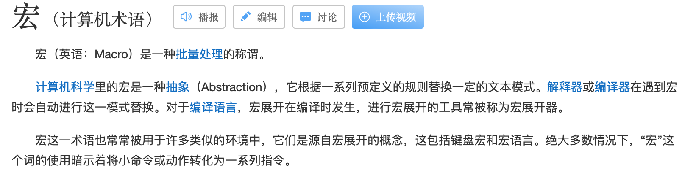

> 把参数批量替换到文本中，这种实现通常称为宏（macro）或定义宏 (define macro)

我们可以通过`#define`来定义宏，规则如下：

```
#define    宏名(记号)    内容
```

比如现在我们想通过宏定义一个PI：

```c
#define PI 3.1415926
```

这样就可以了，那么怎么去使用它呢？

```c
#include <stdio.h>

#define PI 3.1415926

int main() {
    printf("π的值为：%f", PI);   //就像使用变量一样，我们可以直接将PI放到这个位置
}
```

在编译时，预处理程序会进行宏替换操作，也就是将程序中所有的`PI`全部替换为`3.1415926`，注意这个跟类型无关，是赤裸裸的纯文本替换，也就是相当于把我们的代码修改了，PI那里直接变成`3.1415926`，当然如果你定义为其他任意的内容，同样会替换到那个位置，但是至于替换之后程序还正不正常就不知道了。

我们通过下面这个例子来加深对文本替换这句话的理解：

```c
#include <stdio.h>

#define M a + b

int main() {
    int a = 10, b = 20;
    printf("%d", M * a);   //各位觉得计算结果会是多少呢？
}
```

如果按照我们的正常思维，M是a+b，那么替换上去之后应该就是30了吧？然后30 x 10最后得到的应该是300才对。


不过最后貌似并不是这样的，怎么会算出来是210的呢？

实际上还是那句话，在编译时仅仅是做了文本替换，相当于最后我们的代码是：

```c
printf("%d", a + b * a);
```

所以先计算的是a x b然后再加a，最后结果就是210了。

当然任何地方都可以使用宏替换，包括类型，反正最后都会变成被替换的内容：

```c
#define lbwnb long

int main() {
    lbwnb a = 10L;
}
```

当然除了这种简单的替换之外我们还可以添加参数，就像函数那样：

```c
#include <stdio.h>

#define MUL(x) x * x

int main() {
    printf("%d", MUL(9));
}
```

虽然这里搞得像函数一样，但是最后还是会被替换为x * x，而这个x就是我们填写的参数，所以最后会变成 9 * 9 替换上去，程序运行出来的结果就是81了。

直接调函数肯定也是没问题的，反正就纯替换：

```c
#include <stdio.h>

#define bb(i) printf("我是宏替换的：%d", i);

int main() {
    bb(666);
}
```

那要是我想在字符串里面加一个宏定义中的参数呢？

```c
#include <stdio.h>

#define bb(str) printf("我是宏替换的："#str" <");  //使用#直接在字符串中进行宏替换，否则默认情况下会被当做一个字符

int main() {
    bb("你看这不就替换了吗");
}
```

当然还可以替换宏中的部分：

```c
#define TEST(n) x ##n   //##会使用参数进行拼接

int main() {
    int TEST(1) = 10;   //这里传入1，那么实际上就是被替换为x1
    x1 = 20;   //所以上面其实是int x1 = 10
}
```

宏既然可以定义出来，那么也可以取消定义，我们可以使用`#undef`来取消已有的宏定义：


可以看到在使用`#undef`之后，直接不认识了。

当然除了我们自己可以去定义之外，系统也为我们提供了一些预定义的宏：

| 宏名称       | 含义                                        |
| ------------ | ------------------------------------------- |
| _ _ DATE _ _ | 当前的日期，格式为类似 Jun 27 2023 的字符串 |
| _ _ TIME _ _ | 当前的时间，格式为类似 10:23:12 的字符串    |
| _ _ FILE _ _ | 当前源代码文件的名称（含路径）的字符串      |
| _ _ LINE _ _ | 当前所处的行号是多少就替换为多少，整数      |

这里只列出了一部分。

### 条件编译

我们来看看条件编译，我们还可以根据条件，选择性地对某些内容进行忽略。

收我们我们来认识一下`#ifdef`、`#else`、`#endif`这三种条件编译指令：

```c
#include <stdio.h>

#ifdef PI   //ifdef用于判断是否定义了符号PI，如果没有的话则处理以下的指令
    #define M 666
#else   //如果定义了符号PI，那么就处理这个分支的语句
    #define M 777
#endif   //最后需要以endif指令结束整个判断

int main() {
    printf("%d", M);   //最后打印M
}
```


可以看到，在我们没有定义PI的情况下，执行的是`#define M 777`，那要是现在定义了呢？我们编写一个新的头文件：

```c
#define PI 3.1415
```

现在我们引入这个头文件，那么对应的预编译指令也会跟着包含进来：

```c
#include <stdio.h>
#include "test.h"

#ifdef PI
    #define M 666
#else
    #define M 777
#endif

int main() {
    printf("%d", M);
}
```


可以看到此时得到的结果就是666了，因为现在PI在引入的头文件中已经定义了（当然直接在当前源文件中定义也是一样的）

那如果我现在希望判断某个符号没定义呢？没错，还有`#ifndef`表示判断是否未定义某个符号：

```c
#include <stdio.h>

#ifndef PI   //ifndef 就是 if not define，跟ifdef反着的
    #define M 666
#else
    #define M 777
#endif

int main() {
    printf("%d", M);
}
```


当然，除了判断某个符号是否存在之外，我们也可以像条件语句那样直接进行逻辑判断，这里需要使用到`#if`和`#elif`指令：

```c
#define M 666

#if M == 666   //若M等于666那么定义K = 999
    #define K 999
#elif M == 777   //等同于else if语句
    #define K 888
#else    //else语句
    #define K 000
#endif
```

并且这些分支还支持嵌套使用：

```c
#define M 666

#if M == 666
    #ifdef L
        #include "test.h"
    #endif
#elif M == 777
    #define K = 888
#else
    #define K = 000
#endif
```

***

## 文件输入/输出（选学）

**注意：**本小节作为选学内容，不强制要求。

我们的电脑上其实存放了多种多样的文件，比如我们办公经常需要打交道的Word文档、PPT幻灯片、Excel表格等，包括我们的C程序源文件，图片、视频等等，这些都是文件，由于文件需要被长期保存，所以它们被统一存放到我们电脑上的硬盘中。硬盘不像内存，虽然它们都可以存放数据，但是内存中的数据断电即失（在学习完数字电路中的锁存器后，你就知道为什么了）而硬盘却支持长期保存数据，当然也是以二进制的形式进行保存的。

### 文本读写操作

现代计算机使用的硬盘大致分为固态硬盘和机械硬盘两种，其中固态硬盘的读写速度远超机械硬盘，但是寿命（硬盘是有读写次数限制的，如果读写次数超标，那么就无法使用了）不如机械硬盘，所以一般重要数据都是在机械硬盘中存放，而系统文件一般是在固态硬盘中存放，这样电脑的启动速度会很快。

不过文件并不是随便在硬盘中进行保存的，而是根据不同的文件系统按规则进行存放的，比如Windows下采用的就是NTFS文件系统，而MacOS采用的是APFS文件系统。

> 文件系统是操作系统用于明确存储设备（常见的是磁盘，也有基于NAND Flash的固态硬盘）或分区上的文件的方法和数据结构；即在存储设备上组织文件的方法。

其中某些文件是以文本格式存储的，比如我们的C语言源文件、普通的文本文档等；而有些文件是二进制格式，比如图片、视频、应用程序等，但是他们最终都是以二进制的形式存储到硬盘上的。当然，普通的文本文件我们直接打开记事本都可以直接进行编辑，而图片这类二进制文件，需要使用专门读取图片的软件来查看，根据格式的不同（图片有png、jpg等格式）对文件的解读方式也不一样，但是最后都会被专门的图片查看软件展示出来。

通过使用C语言，我们也可以读取硬盘上的文件，这里我们先创建一个简单的文本文件：


接着我们可以使用stdio.h中为我们提供的函数打开一个文件：

```c
#include <stdio.h>

int main() {
    FILE * file = fopen("hello.txt", "rw");  //使用fopen函数来打开一个文件
}
```

这里我们先来介绍一下参数：

* 第一个参数：文件的名称，这里我填写的是相对路径，也可以写成绝对路径
* 第二个参数：打开文件的模式，其中模式有以下这些：

|               模式字符串               |                             含义                             |
| :------------------------------------: | :----------------------------------------------------------: |
|                  “r”                   |                       以读模式打开文件                       |
|                  “w”                   | 以写模式打开文件，把现有文件的长度截为0，如果文件不存在，则创建一个新文件 |
|                  “a”                   | 以写模式打开文件，在现有文件末尾添加内容，如果文件不存在，则创建一个新文件 |
|                  “r+”                  |      以更新模式打开文件（即可以读写文件）该文件必须存在      |
|                  “w+”                  | 以更新模式打开文件（即可以读写文件），如果文件存在，则将其长度截为0；如果文件不存在，则创建一个新文件 |
|                  “a+”                  | 以更新模式打开文件（即，读写），在现有文件的末尾添加内容，如果文件不存在则创建一个新文件；可以读整个文件，但是只能从末尾添加内容 |
| “rb”,“wb”,“ab”,“ab+”,“a+b”,“wb+”,“w+b” | 与“a+”模式类似，但是以二进制模式打开文件而不是以文本模式打开文件 |

具体的不同打开模式会影响到后续的操作，我们后面再说。这里我们使用r表示可读。

然后这个函数返回的是一个FILE结构体指针：

```c
typedef struct __sFILE {
   unsigned char *_p; /* current position in (some) buffer */
   int    _r;       /* read space left for getc() */
	 ...
} FILE;
```

定义非常复杂，这里我们就不详细介绍了，这样我们就成功打开了这个文件，那么如何对文件进行读取操作呢？

我们可以使用`getc`来快速读取文件中的字符：

```c
#include <stdio.h>

int main() {
    FILE * file = fopen("hello.txt", "r");
    int c;
    while ((c = getc(file)) != EOF) {   //通过一个while循环来不断读取文件，使用getc从文件中读取一个字符，如果到末尾了，那么会返回一个特殊值EOF
        putchar(c);   //使用putchar来快速打印字符到控制台
    }
}
```

可以看到成功输出：


当然如果没有这个文件或是文件打开失败的话，可能会返回一个空指针，所以我们需要进一步判断：

```c
#include <stdio.h>

int main() {
    FILE * file = fopen("hello.txt", "r");
    if(file != NULL) {   //如果打开失败会返回NULL
        int c;
        while ((c = getc(file)) != EOF) {
            putchar(c);
        } 
    } else{
        puts("文件打开失败！");
    }
}
```

最后我们在使用完文件后，记得关闭文件来释放资源，不然一直会被占用：

```c
fclose(file);   //fclose用于关闭文件
```

那么读取文件我们知道了，写入呢？写入我们同样可以使用`putc`来完成：

```c
#include <stdio.h>

int main() {
    FILE * file = fopen("hello.txt", "w");   //注意这里需要修改为写模式
    if(file != NULL) {
        for (int i = 0; i < 10; ++i)
            putc('A' + i, file);   //从A开始依次写入10个字符
        fclose(file);
    } else{
        puts("文件打开失败！");
    }
}
```

可以看到最后我们的文件变成了：


原来的文本被覆盖为了我们输入的新文本，那要是我们现在不想覆盖原来的，而是希望在后面追加输入呢？

```c
FILE * file = fopen("hello.txt", "a");   //我们可以将其修改为a表示append追加输入
```

这样就不会覆盖原有内容而是追加填写了：


不过这里要补充一下，文件的读写实际上并不是直接对文件进行操作的，在这之间还有一个缓冲区：


我们所有的读操作，首先是从文件读取到缓冲区中，再从缓冲区中读取到程序中的；写操作就是先写入到缓冲区，然后再从缓冲区中写入到文件中。这样做的目的是，因为内存和硬盘的速度差距有点大，为了解决这种速度差异导致的性能问题，所以设定一个缓冲区，这样就算速度不一样，但是内容被放在缓冲区中慢慢消化就没问题了。

虽然缓冲区能够解决这些问题，但是也会带来一些不便之处，比如下面的例子：

```c
#include <stdio.h>

int main() {
    FILE * file = fopen("hello.txt", "a+");   //注意这里需要修改为写模式
    if(file != NULL) {
        while (1) {
            int c = getchar();   //不断从控制台读取字符
            if(c == 'q') break;
            putc(c, file);  //写入到文件中
        }
        fclose(file);
    }
}
```

我们发现当我们敲了一个字符之后，可能并不会马上更新到文件中，这就是由于缓冲区没有及时同步到文件中，所以我们需要调用一个函数来刷新缓冲区，将那些缓冲区的没有同步的数据全部同步到文件中：

```c
#include <stdio.h>

int main() {
    FILE * file = fopen("hello.txt", "a+");
    if(file != NULL) {
        while (1) {
            int c = getchar();
            if(c == 'q') break;
            putc(c, file);
            fflush(file);   //使用fflush来刷新缓冲区
        }
        fclose(file);
    }
}
```

这样我们就可以看到输入一个字符马上就能同步更新了。当然我们也可以手动设定缓冲区的大小：

```c
char buf[3];
setvbuf(file, buf, _IOFBF, 3);
```

其中：

* _IONBF：表示不使用缓冲区
* _IOFBF：表示只有缓冲区填满了才会更新到文件
* _IOLBF：表示遇到换行就更新到文件

除了使用`getc`之外，标准库中还提供了`fprintf`和`fgets`系列函数：

```c
#include <stdio.h>

int main() {
    FILE * file = fopen("hello.txt", "a+");
    if(file != NULL) {
        fprintf(file, "树脂%d", 666);   //fprintf就像普通的打印一样，但是它并不是打印到控制台，而是文件中
        fclose(file);
    }
}
```

```c
#include <stdio.h>

int main() {
    FILE * file = fopen("hello.txt", "w");
    if(file != NULL) {
        fputs("小黑子苏珊", file);   //就像使用puts一样，同样是输出到文件中
        fclose(file);
    }
}
```

这样，对于文本文件的基础读写操作就讲解到这里。

### 随机访问

前面我们介绍了文本文件的基础读写操作，我们接着来看随机访问。首先什么是随机访问？

我们在前面读取文件时，实际上是按照顺序，每次读取都会往后移动一个字符继续读取，那么如果现在我希望直接跳到某个位置进行读取是否可以实现呢？

我们可以使用fseek来跳转到指定位置：

```c
#include <stdio.h>

int main() {
    FILE * file = fopen("hello.txt", "r");
    if(file != NULL) {
        fseek(file, -2L, SEEK_SET);   //第二个参数为偏移量，根据后面的参数而定
        putchar(getc(file));
        fclose(file);
    }
}
```

这里介绍一下起始点：

* SEEK_SET：从文件开始处开始
* SEEK_CUR：从当前位置开始（就是已经读到哪个位置就是哪个位置）
* SEEK_END：从文件末尾开始

而上面的使用的是SEEK_SET，那么就是从文件开始，往后偏移2个字符的位置，也就是字符`l`。

那么我们怎么知道当前已经读取到文件第几个字符了呢？

```c
#include <stdio.h>

int main() {
    FILE * file = fopen("hello.txt", "r");
    if(file != NULL) {
        fseek(file, 2L, SEEK_SET);
        printf("%ld", ftell(file));  //可以使用ftell来直接返回当前位置，返回类型为long
        fclose(file);
    }
}
```

当然除了fseek和ftell之外，还有fgetpos和fsetpos这两个函数，它们也可以获取位置和设定位置：

```c
#include <stdio.h>

int main() {
    FILE * file = fopen("hello.txt", "r");
    if(file != NULL) {
        fpos_t pos;   //位置需要使用fpos_t进行存储（主要用于处理大文件）
        fgetpos(file, &pos);   //获取位置，并设定给pos，此时位置为0
        fseek(file, -2L, SEEK_END);   //通过fseek移动到倒数第二个位置
        fsetpos(file, &pos);   //设定位置为pos位置
        printf("%ld", ftell(file));   //最后得到的就是经过fsetpos设定的新位置了
        fclose(file);
    }
}
```

了解了这些函数，这样我们就可以实现对文件的随机读写了。

前面我都是对文本文件进行操作，我们接着来看如何直接读写二进制文件，比如现在我们想要复制一个文件：

```c
#include <stdio.h>

int main() {
    FILE * file = fopen("hello.txt", "r");
    FILE * target = fopen("hello2.txt", "w");
    if(file != NULL) {
        char buf[1024];   //这里我们使用char类型的数组作为暂存
        size_t s;
        while ((s = fread(buf, sizeof(char), 1024, file)) > 0) {  //使用fread函数进行读取，每次都会从文件中读取指定大小的数据到暂存数组中，返回值为实际读取的值，如果读取的值小于0表示读完了
            fwrite(buf, sizeof(char), s, target);  //使用fwrite将数据写入到指定文件中
        }
        fclose(file);
    }
}
```


可以看到我们成功将hello.txt中的内容复制到另一个文本文件中了。当然我们也可以用来拷贝大型文件：

```c
#include <stdio.h>

int main() {
    FILE * file = fopen("22000.318.211104-1236.co_release_svc_refresh_CLIENTCONSUMER_RET_A64FRE_zh-cn.iso", "r");
    FILE * target = fopen("22000.318.211104-1236.co_release_svc_refresh_CLIENTCONSUMER_RET_A64FRE_zh-cn-2.iso", "w");

    if(file != NULL) {
        //计算文件的大小
        fseek(file, 0L, SEEK_END);
        long size = ftell(file);
        fseek(file, 0L, SEEK_SET);

        char buf[1024 * 1024];
        size_t s, all = 0;
        while ((s = fread(buf, sizeof(char), 1024, file)) > 0) {
            fwrite(buf, sizeof(char), s, target);
            all += s;
            printf("当前进度 %.1f%%\n", (double) all / (double) size * 100);
        }
        fclose(file);
    }
}
```

是不是感觉有内味了：


这样我们就实现了文件的拷贝。

***

## 程序编译和调试（选学）

**注意：**本小节作为选学内容，不强制要求。

有关C语言语言层面的教学基本就结束了，最后让我们来了解一下如何不借助IDE，通过最原始的方式手动完成程序的编译。

### C语言程序的编译

在开始之前，我们需要介绍一个编译器：

> GCC原名为GNU C语言编译器（GNU C Compiler），只能处理C语言。但其很快扩展，变得可处理C++，后来又扩展为能够支持更多编程语言，如Fortran、[Pascal](https://baike.baidu.com/item/Pascal/241171)、Objective -C、Java、Ada、Go以及各类处理器[架构](https://baike.baidu.com/item/架构/13004195)上的[汇编语言](https://baike.baidu.com/item/汇编语言/61826)等，所以改名GNU编译器套件（GNU Compiler Collection）

那么gcc编译器是如何将我们的程序一步步编译为可执行文件的呢？


1. 预处理（Pre-Processing）：首先会经过预处理器将程序中的预编译指令进行处理，然后把源文件中的注释这些没用的东西都给扬了。
2. 编译（Compiling）：处理好之后，就可以正式开始编译，首先会编译为汇编代码。
3. 汇编（Assembling）：接着就该将汇编代码编译为机器可以执行的二进制机器指令了，会得到一个二进制目标文件。
4. 链接（Linking）：最后需要将这个二进制目标文件与系统库和其他库的OBJ文件、库文件链接起来，最终生成了可以在特定平台运行的可执行文件。

比如在Windows操作系统下完成这四步，就会生成一个Windows的.exe可执行文件。

我们来一步一步尝试一下，首先我们把CLion自带的GCC工具目录配置到环境变量中（Mac系统直接自带，不需要任何配置）：


位置在你的`CLion安装目录/bin/mingw/bin`，打开高级系统设置，添加环境变量：


配置完成后，打开CLion，我们随便编写一点内容：

```c
#include <stdio.h>

int main() {
    printf("Hello, World!\n");
    return 0;
}
```

然后我们点击IDE下方的终端面板：


可以看到这里打开的是Windows自带的PowerShell终端，如果不是的可以在设置中修改：


现在我们就可以手动开始对我们的C源文件进行编译了，首先是第一步，我们需要对源文件进行预处理：

```sh
gcc -E main.c -o main.i
```

其中 `-E` 后面的是我们的源文件名称，`-o` 是我们预处理后生成的文件名称：


生成后，我们可以直接查看这个文件（因为此时依然是普通文本）可以看到，我们的代码在经过预处理之后，`#include <stdio.h>`中的内容都替换过来了。最下面大约1000行左右的位置就是我们的代码了：


现在我们已经完成了预处理，接着就可以将其编译为汇编程序了：

```sh
gcc -S main.i -o main.s
```

这里的`-S`就是预处理之后的文件，我们可以直接将其编译为汇编代码：


可以看到这里都是汇编代码，各种各样的汇编指令。接着我们就可以将这个汇编代码继续编译为二进制文件了：

```sh
gcc -c main.s -o main.o
```

这里`-c`后的就是我们的汇编程序，直接生成为二进制文件：


不过现在我们还没办法直接运行它，因为还需要进一步链接，变成Windows操作系统可以执行的程序：

```sh
gcc main.o -o main
```

这里直接将刚刚生成的目标文件编译为可执行文件，我们就可以直接运行了：


成功生成.exe文件，我们直接在控制台输入它的名字就可以运行了：


这样我们就实现了手动编译一个C语言程序。当然如果我们要更快速一点地完成编译，可以直接将源文件进行编译：

```sh
gcc main.c -o main
```

当然这种只是简单的单源文件下的编译，要是遇到多文件的情况下呢？


```c
void swap(int * a, int * b);
```

```c
#include "test.h"

void swap(int * a, int * b) {
    int tmp = *a;
    *a = *b;
    *b = tmp;
}
```

```c
#include <stdio.h>
#include "test.h"

int main() {
    int arr[] = {4, 2, 1, 9, 5, 0, 3, 8, 7, 6};

    for (int i = 0; i < 9; ++i) {
        for (int j = 0; j < 9 - i; ++j) {
            if(arr[j] > arr[j + 1]) swap(&arr[j], &arr[j + 1]);
        }
    }

    for (int i = 0; i < 10; ++i) {
        printf("%d ", arr[i]);
    }
}
```

我们还是按照刚刚的方式直接进行编译：


可以看到，编译错误，无法识别到`swap`这个函数，说明肯定还需要把引入的其他文件也给一起带上，所以：

```sh
gcc main.c test.c -o main
```

或是将两个文件单独编译为对应的二进制文件，最后再放到一起编译也是可以的：

```sh
gcc main.o test.o -o main
```

OK，现在多个文件就可以在一起编译了，最后同样生成了一个可执行文件：


### 使用Make和CMake进行构建

我们的项目可能会有很多很多的内容需要去进行编译，如何去进行组织成了一个大问题，比如让谁先编译，谁后编译，这时，我们就需要一个构建工具来帮助我们对程序的构建流程进行组织。

>  Make是最常用的构建工具，诞生于1977年，主要用于C语言的项目。但是实际上 ，任何只要某个文件有变化，就要重新构建的项目，都可以用Make构建。

要使用Make对我们的项目进行构建，我们需要先告诉Make我们的程序应该如何去进行构建，这时我们就要编写一下Makefile了：


我们只需要把需要执行的命令按照我们想要的顺序全部写到里面就可以了，但是需要遵循以下格式：

```makefile
targets : prerequisites
  command
```

一个Makefile中可以有很多个目标，比如我们现在要分别编译main.c和test.c，那么就需要创建两个目标：

* targets：构建的目标，可以是一个普通的标签、文件名称等
* prerequisites：前置条件，可以设定要求完成其他目标才能开始构建当前目标
* command：构建需要执行的命令

比如现在我们想要分别先编译test.c和main.c，最后将他们变成一个可执行文件，那么makefile可以这样编写：

```makefile
main.exe: test.o main.o  #目标1：构建最终的程序，要求完成下面两个目标（注意最终目标需要写在第一个）
	gcc test.o main.o -o main

main.o: main.c  #目标2：构建目标为main.o，前置要求必须有main.c文件
	gcc -E main.c -o main.i
	gcc -S main.i -o main.s
	gcc -c main.s -o main.o

test.o: test.c  #目标3：同样的，要求必须有test.c文件才能开始
	gcc -E test.c -o test.i
	gcc -S test.i -o test.s
	gcc -c test.s -o test.o
```

接着我们只需要在控制台输入make命令（CLion自带环境需要输入mingw32-make命令，Mac下直接输入make）就可以进行编译了：


命令执行的每一步都会详细打印出来，我们可以看到构建确实是按照我们的顺序在进行，并且成功编译出最终目标：


当然，如果我们没有做任何的修改，那么再次执行make命令不会做任何事情：


但是如果我们修改一下源文件的话，执行make将会重新构建目标：


再次执行：


通过使用Make，即使没有如此高级的IDE，哪怕我们纯靠记事本写C代码，都可以很方便地完成对一个项目的构建了。当然这只是Make的简单使用，它还支持使用变量、逻辑判断等高级玩法，这里我们就不多做介绍了。

虽然使用Make可以很方便地对项目构建流程进行配置，但是貌似CLion并没有采用这种方式来组织我们的项目进行构建，而是使用了CMake，我们来看看它又是做什么的。

> CMake是一个跨平台的安装（[编译](https://baike.baidu.com/item/编译/1258343)）工具，可以用简单的语句来描述所有平台的安装(编译过程)。他能够输出各种各样的makefile或者project文件，能测试[编译器](https://baike.baidu.com/item/编译器/8853067)所支持的C++特性,类似[UNIX](https://baike.baidu.com/item/UNIX/219943)下的automake。

简而言之， CMake是一个跨平台的Makefile生成工具! 

实际上当我们创建一个项目后，CLion会自动为我们配置CMake，而具体的配置都是写在CMakeList.txt中的：

```cmake
cmake_minimum_required(VERSION 3.22)
project(untitled C)

set(CMAKE_C_STANDARD 99)

add_executable(untitled main.c test.c test.h)
```

我们逐行来进行解读：

* 第一行使用cmake_minimum_required来指定当前项目使用的CMake最低版本，如果使用的CMake程序低于此版本是无法构建的。
* 第二行project指定项目名称，名称随意，后面的是项目使用的语言，这里是C。
* 第三行set用于设定一些环境变量等，这里设定的是C 99标准。
* 第四行add_executable用于指定一个编译出来的可执行文件，这里名称为untitled，后面的都是需要编译的源文件（头文件可以不写）

当然除了这些语法之外，还有各种各样的设定，比如设定库目录或是外部动态连接库等，这里就不多说了，感兴趣的可以自行了解。

这里我们来手动执行一下cmake：


首先还是添加环境变量，添加完成后重启CLion，我们输入cmake命令进行生成：

```sh
 cmake -S . -B test -G "MinGW Makefiles"
```

其中`-S`后面的是源文件目录，这里`.`表示当前目录，`-B`后面是构建目录，一会构建的文件都在这里面存放，最后`-G`是选择生成器（生成器有很多，甚至可以直接生成一个VS项目，我们可以直接使用Visual Studio打开），这里我们需要生成Makefile，所以填写"MinGW Makefiles"：


可以看到已经成功在我们的构建目录中生成了：


只不过它这个自动生成的Makefile写的就比较复杂了，我们也不需要去关心，接着我们像之前一样直接使用make就可以编译了：

这里要先进入一下test目录，使用`cd test`命令修改当前工作目录：


可以看到它生成的Makefile还是挺高级的，还能输出进度，现在我们的程序就构建好了，直接启动把：


当然CLion并没有使用Makefile的编译方式，而是Ninja，并且生成的构建文件默认存放在`cmake-build-debug`中，跟make比较类似，但是速度会更快一些，不过最后都会成功构建出我们的可执行程序。

这下，我们就清楚整个项目中个个文件是干嘛的了。

### 使用LLDB调试工具

最后我们来说一下LLDB调试工具（与之类似的还有GDB），首先还是配置一下环境变量：


LLDB调试工具用于对我们的程序进行逐步调试使用，实际上我们之前也使用调试，只不过是在IDE中的图形化界面中操作的，那么如果没有IDE呢，我们可以使用LLDB调试工具来进行调试：

```sh
lldb .\untitled.exe
```

注意在编译时需要需要添加-g参数来附带调试信息，这样才可以使用gdb进行调试，否则不能（CLion默认生成的是可以调试的程序，所以直接使用就行了）


进入后，可以看到是这样的一个界面，我们需要输入命令来进行逐步调试，输入r就可以开始运行了：


成功运行出结果，那么具体怎么进行断点调试呢？我们可以使用`b 行号`的形式在对应的行号打上断点，比如这里对第9行进行断点：


接着我们再输入r之后，程序会暂时卡在断点位置，此时我们可以通过输入v来查看当前所有的局部变量信息：


可以看到现在是冒泡排序的第一轮，所以`i`和`j`都还是0，并且数组是乱序的，我们输入c可以继续运行：


继续运行一轮后，此时`j`就变成1了，因为内层循环执行了一次，我们可以通过p来打印变量的值：


当我们不需要再调试时，可以直接结束掉程序：


当然这仅仅是展示lldb的简单使用，通过使用lldb我们就可以很轻松地在控制台进行调试了。

至此，包括编译、构建、调试的所有操作，我们完全可以脱离IDE纯靠命令行进行操作了（其实在没有图形化界面的年代基本上都是这样写代码的）