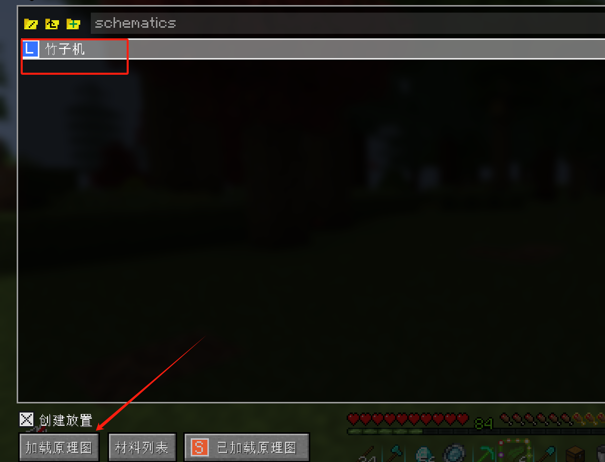
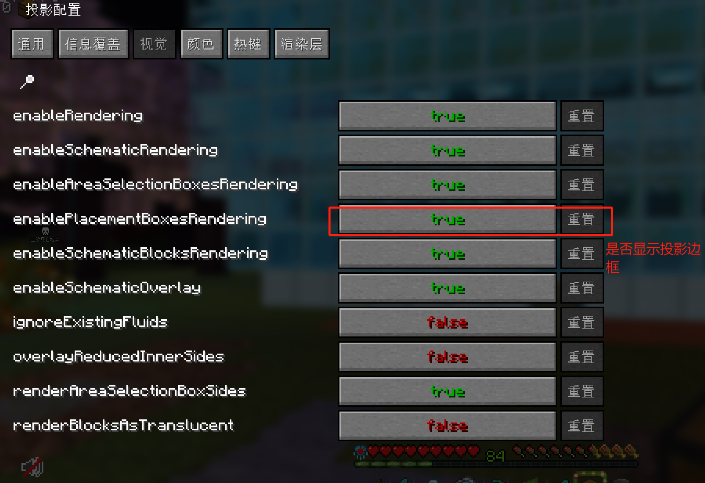

## 指令

1. **/gamemode**：改变游戏模式。例如，`/gamemode 0` 设置为生存模式，`/gamemode 1` 设置为创造模式，`/gamemode 2` 设置为冒险模式（必须用相应的工具来破坏方块），`/gamemode 3` 设置为旁观者模式（仅Java版有）。
2. **/give**：给予玩家物品。例如，`/give @p diamond_sword 1` 给予玩家一把钻石剑。
3. **/time**：设置或查询当前的时间。例如，`/time set day` 设置为白天，`/time set night` 设置为夜晚，`/time set noon` 设置为正午，`/time set midnight` 设置为午夜。
4. **/weather**：改变天气。例如，`/weather rain` 开始下雨，`/weather clear` 停止下雨。
5. **/kill**：杀死实体（玩家、生物、物品等）。例如，`/kill @e[type=Zombie]` 杀死所有僵尸。
6. **/tp**：传送实体。例如，`/tp @p @e[type=Wolf]` 把所有玩家传送到最近的一只狼的位置。
7. **/summon**：召唤一个实体。例如，`/summon Zombie ~ ~ ~` 在你的位置召唤一个僵尸。
8. **/difficulty**：设置游戏的难度。例如，`/difficulty 0` 设置难度为和平（没有怪物，不能获得成就），`/difficulty 1` 设置难度为简单（怪物伤害低），`/difficulty 2` 设置难度为普通（正常游戏难度），`/difficulty 3` 设置难度为困难（怪物伤害高，经验值多）。
9. **/effect**：给玩家添加或移除状态效果。例如，`/effect give @p strength 100 1` 给予玩家力量效果（等级1，持续100秒）。
10. **/locate**：显示特定结构的坐标。例如，`/locate village` 显示最近的村庄的坐标。
11. **/gamerule keepInventory true 死亡不掉落**

12. **/gamerule mobgriefing true**  **生物破坏**

 

F3 加 B  查看物体的碰撞体积

## 辅助mod

### minHUB

显示史莱姆区块

H+C

### Tweakeroo

灵魂出窍等功能

X+C

## 投影mod的使用

不要开光影使用，兼容性不好

**按住ctrl + 滚轮切换模式**

**M + P 对投影进行编辑**

1. **区域选择**

 **拿上小木棍  左键选择第一个坐标， 右键选择第二个坐标**

**按住Alt + 鼠标滚轮 可以移动选中区块，面朝哪里就往哪里移动**

查看原理图需要的材料

### **保存原理图**

### **放置原理图**

按住ctlr + 滚轮切换到放置模式

**M + P 对投影进行编辑**

### 配置菜单

#### 视觉

#### 打开简单放置

#### 逐层渲染

**设置渲染快捷键增加层数与减少**

#### 设置显示透明度

### 卸载原理图

### 粘贴原理图

然后使用设置的快捷键粘贴

### 替换方块

**按住设置好的快捷键加鼠标中间选取方块**

### 填充

选择填充方块

## 加载区块

一个区块的大小

玩家所在的区块 为 31

区块加载装置

## 炼药

以下是一个更详细的《我的世界》炼药配方表格，包含了药水的作用和材料的获取途径：

|   药水名称   |              配方              |                 作用                 |                         材料获取途径                         |
| :----------: | :----------------------------: | :----------------------------------: | :----------------------------------------------------------: |
|  粗糙的药水  |         地狱疣 + 水瓶          |     炼制其他二级或三级药水的材料     | 地狱疣：在地狱堡垒中采集 水瓶：用玻璃瓶装水（玻璃由沙子烧制得到） |
|   迅捷药水   |        粗糙的药水 + 糖         |           提高玩家移动速度           |                    糖：由甘蔗或甜菜根制成                    |
|   跳跃药水   |      粗糙的药水 + 兔子脚       |           提高玩家跳跃高度           |                     兔子脚：击杀兔子获得                     |
|   迟缓药水   | 迅捷药水/跳跃药水 + 发酵蜘蛛眼 |           减缓目标移动速度           |              发酵蜘蛛眼：由蜘蛛眼和棕色蘑菇制成              |
|   力量药水   |      粗糙的药水 + 烈焰粉       |           提高玩家伤害输出           |   烈焰粉：由烈焰棒制成（烈焰棒在地狱堡垒中击杀烈焰人获得）   |
|   治疗药水   |    粗糙的药水 + 闪烁的西瓜     |            恢复玩家生命值            |                闪烁的西瓜：由西瓜片和金粒合成                |
|   剧毒药水   |      粗糙的药水 + 蜘蛛眼       |      使目标中毒，持续损失生命值      |                     蜘蛛眼：击杀蜘蛛获得                     |
|   再生药水   |     粗糙的药水 + 恶魂之泪      |      在一定时间内持续恢复生命值      |                    恶魂之泪：击杀恶魂获得                    |
|   抗火药水   |      粗糙的药水 + 岩浆膏       |        使玩家获得火焰抵抗效果        |                岩浆膏：由史莱姆球和烈焰棒制成                |
|   水肺药水   |       粗糙的药水 + 河豚        |       延长玩家在水下的呼吸时间       |                   河豚：在河流或海洋中找到                   |
|   夜视药水   |     粗糙的药水 + 金胡萝卜      |     使玩家在黑暗环境中看得更清楚     |                 金胡萝卜：由胡萝卜和金粒合成                 |
| 火焰免疫药水 |      粗糙的药水 + 熔岩球       | 使玩家获得火焰抵抗效果，持续时间更长 |          熔岩球：在地狱堡垒中的熔岩湖或熔岩块中找到          |

请注意，以上配方和材料获取途径可能因游戏版本或MOD的不同而有所差异。另外，药水的持续时间和效果也可能受到其他物品（如红石、萤石粉）的影响。在炼药之前，建议仔细研究并确认配方和材料的准确性。

# 红石

## 空置域

**《我的世界》中的空置域是指在清空的区域中进行难度低、效率高的刷怪塔操作**。

空置域并不是天然存在的，但可以人为制造出来以达到高效刷怪的目的。这种区域按照需求不同，其面积一般在17×17区块至33×33区块左右。在空置域中，由于没有任何生物可以生成，因此实体带来的卡顿将非常低，MSPT占用一般要比自然条件下减少5-25左右，这会给大型红石机器运转提供良好的环境。

同时，由于生物生成只能在特定区域进行，利用这一点可以建造一个非常高效的生物农场。例如，一个史莱姆农场在非空置域环境中每小时只能获取不到二百个黏液球，但在空置域中可以轻松地达到数千甚至数万黏液球。

然而，要修建一个空置域可能会耗费大量的时间和物品，而且是一个比较危险的活动，一个偏差就有可能导致前功尽弃。因此，在施工时建议经常进行备份，最好将存档备份至云端或者是NAS。

总的来说，空置域在《我的世界》中是一个重要的游戏机制，可以帮助玩家提高刷怪效率，建造高效的生物农场，但同时也要注意其施工难度和风险。

**y值越低 怪物生成概率越大** **玩家半径为128格内生成怪物**

### 漏斗

game time  

20gt = 1000ms

10gt = 500ms

1gt = 50ms

漏洞的 cd  1gt时间内吸入或输出 物品成功 则会进入8gt 冷却

漏斗传输一个物品需要 8gt 的时间

 

漏斗通过红石激活锁定状态， 则只剩下

### QC

QC，全称**Quasi-connectivity**，是发射器、投掷器和活塞（包括普通活塞和粘性活塞）独有的特性，中文译名“半连接性”。使用QC的活塞有一个很显著的特点，就是红石信号没有直接接触到活塞，但是活塞却能伸出和收回。这实际上是当初JE版本的一个bug，不过最后成为了特性得以保留到现在。我们把红石信号不直接接触活塞，但也能使活塞能够运动的位置称作QC位。

### 比较器

比较器：  对容器进行检测    有1正面输入 一个输出 和 2个侧边输入 1 个输出

模式：

​			比较模式： 输入 > 侧边输入 => 输出电流  	 否则不输出  

​			减法模式： 输入 -  侧边输入 => 输出电流大小   【比较器侧边有2测输入  会拿输入信号更强的一侧进行减法】

## 红石基础概念

## 元器件

### 1. 红石线

### 2.红石火把，红石中继器

### 3.红石比较器和侦测器

比较器：  对容器进行检测    有1正面输入 一个输出 和 2个侧边输入 1 个输出

模式：

​			比较模式： 输入 > 侧边输入 => 输出电流  	 否则不输出  

​			减法模式： 输入 -  侧边输入 => 输出电流大小   【比较器侧边有2测输入  会拿输入信号更强的一侧进行减法】

## 数字电路

### 介绍

### 二进制数

### 逻辑代数，逻辑门

## 逻辑电路介绍

### 1.非门

**对输入的结果进行取反**

### 2.与门

**当输入的内容有一个为0 输出为0，只有全部输入为1时，结果才为1.**

### 3.或门

输入有一个为1时，结果为1，只有全部输入为0时，结果才为0.

### 4.与非门

**在与门的基础上，后加入了一个非门，对结果取反**

**只要有一个为0，结果就为1，全为1时结果为0。**

### 5.或非门

**在或门的基础上，后接了一个非门，对结果取反**

**只要有一个输入为1，结果就为0，全为0时，结果为1**

### 6.异或门

**输入一样时，输出为1，输入不同时输出为1.**

输入 A  输入B  输出X

公式： （A取反 与 B ）或 （A 与 B取反）

### 同或门，异或门符号

**同或门，是在异或门的后面进行结果的取反**

## 逻辑代数

### 1.逻辑代数的基本规则

# 

