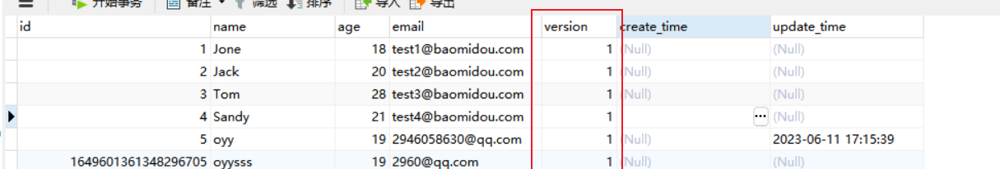
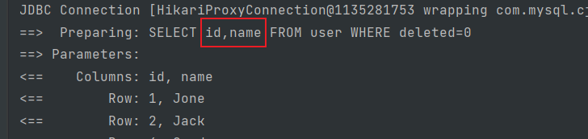
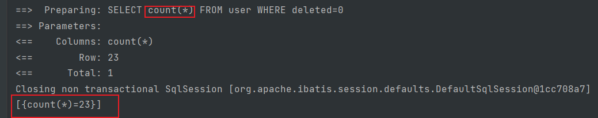
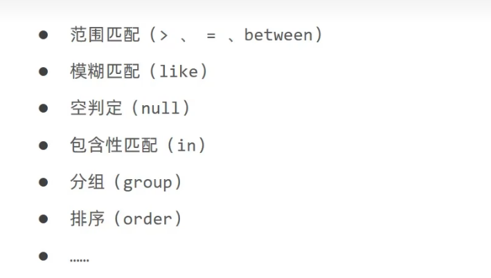
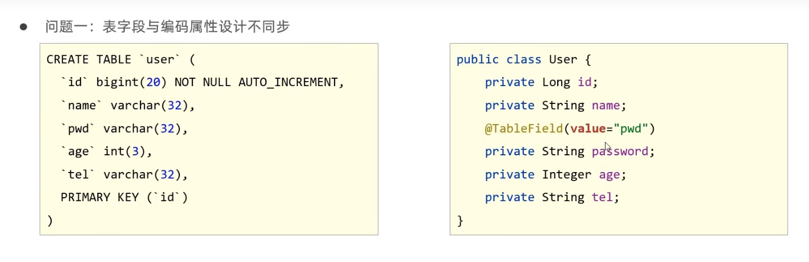
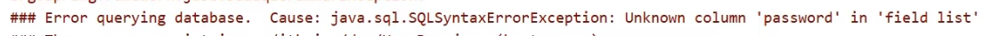
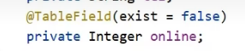

# mybatisPlus

```java
mybatisPlus 在springBoot项目中的使用
mapper mapper接口 继承 BaseMapper<表对应的实体类>
    实体类为Category
@Mapper
public interface CategoryMapper extends BaseMapper<Category> {
}
service 接口继承 IService<表对应的实体类> 
public interface CategoryService extends IService<Category> {
}
 service 的实现类 实现 自己service 接口 继承ServiceImpl<EmployeeMapper,Employee> 
@Service
public class CategoryServiceImpl extends ServiceImpl<CategoryMapper, Category> implements CategoryService {
}

```


```java
统一响应结果对象 result 
@Data
@NoArgsConstructor
@AllArgsConstructor
public class Result {
    private Integer code;//响应码，1 代表成功; 0 代表失败
    private String msg;  //响应信息 描述字符串
    private Object data; //返回的数据

    //增删改 成功响应
    public static Result success(){
        return new Result(1,"success",null);
    }
    //查询 成功响应
    public static Result success(Object data){
        return new Result(1,"success",data);
    }
    //失败响应
    public static Result error(String msg){
        return new Result(0,msg,null);
    }
}
```

```java
@Data
public class R<T> {

    private Integer code; //编码：1成功，0和其它数字为失败

    private String msg; //错误信息

    private T data; //数据

    private Map map = new HashMap(); //动态数据

    public static <T> R<T> success(T object) {
        R<T> r = new R<T>();
        r.data = object;
        r.code = 1;
        return r;
    }

    public static <T> R<T> error(String msg) {
        R r = new R();
        r.msg = msg;
        r.code = 0;
        return r;
    }

    public R<T> add(String key, Object value) {
        this.map.put(key, value);
        return this;
    }

}
```


## 关闭spring的日志输出  和 banner显示

```java
// 1，在resource 资源目录下面创建logback.xml 内容为:
```

```xml
<?xml version="1.0" encoding="UTF-8" ?>
<configuration>

</configuration>
```

```
取消spring 和mybatisplus 的banner的显示
```

```yml
spring:
  main:
    banner-mode: off # 关闭spring 的banner
mybatis-plus:
  global-config:
    banner: false # 关闭mybatisplus 的banner
```


## springboot配置

### 数据库连接信息配置

```yml
# 数据库连接配置
spring:
  datasource:
    driver-class-name: com.mysql.cj.jdbc.Driver
    url: jdbc:mysql://localhost:3306/mybatis_plus?serverTimezone=Asia/Shanghai&useUnicode=true&characterEncoding=utf-8&zeroDateTimeBehavior=convertToNull&useSSL=false&allowPublicKeyRetrieval=true
    username: root
    password: 1234
```

### mybatisplus 配置

```yml
# 数据库日志配置
mybatis-plus:
  configuration:
    #在映射实体或者属性时，将数据库中表名和字段名中的下划线去掉，按照驼峰命名法映射
    map-underscore-to-camel-case: true
    # 开启mybatis-plus 的日志输出
    log-impl: org.apache.ibatis.logging.stdout.StdOutImpl
  db-config:
    logic-delete-field: flag # 全局逻辑删除的实体字段名(since 3.3.0,配置后可以忽略不配置步骤2)
    logic-delete-value: 1 # 逻辑已删除值(默认为 1)
    ogic-not-delete-value: 0 # 逻辑未删除值(默认为 0)
```

### 依赖配置

```xml
<dependencies>
        <dependency>
            <groupId>org.springframework.boot</groupId>
            <artifactId>spring-boot-starter-web</artifactId>
        </dependency>
	
        <dependency>
            <groupId>com.mysql</groupId>
            <artifactId>mysql-connector-j</artifactId>
            <scope>runtime</scope>
        </dependency>

        <dependency>
            <groupId>org.projectlombok</groupId>
            <artifactId>lombok</artifactId>
            <optional>true</optional>
        </dependency>

        <dependency>
            <groupId>org.springframework.boot</groupId>
            <artifactId>spring-boot-starter-test</artifactId>
            <scope>test</scope>
        </dependency>
		<-- mybatis版本不能低于3.5 低于可能报错 -->
        <dependency>
            <groupId>com.baomidou</groupId>
            <artifactId>mybatis-plus-boot-starter</artifactId>
            <version>3.5.3</version>
        </dependency>
    
    </dependencies>

```


## 查询

```java
// 测试查询
@Test
public void testSelectById(){
User user = userMapper.selectById(1L); System.out.println(user);
}

// 测试批量查询！
@Test
public void testSelectByBatchId(){
List<User> users = userMapper.selectBatchIds(Arrays.asList(1, 2, 3));
users.forEach(System.out::println);
}

// 按条件查询之一使用map操作
@Test
public void testSelectByBatchIds(){ HashMap<String, Object> map = new HashMap<>();
// 自定义要查询
map.put("name","狂神说Java");
map.put("age",3);


List<User> users = userMapper.selectByMap(map); users.forEach(System.out::println);
```


## 插入

```java
        User user = new User();
        user.setAge(5);
        user.setEmail("2946058630@qq.com");
        user.setName("oyy");
        int result = mapper.insert(user);
        log.info("查询result为:{},user为:{}",result,user.toString());
```

### 主键生成策略

```
默认 ID_WORKER 全局唯一id
```

**雪花算法：**

snowflake是Twitter开源的分布式ID生成算法，结果是一个long型的ID。其核心思想是：使用41bit作为  毫秒数，10bit作为机器的ID（5个bit是数据中心，5个bit的机器ID），12bit作为毫秒内的流水号（意味  着每个节点在每毫秒可以产生 4096 个 ID），最后还有一个符号位，永远是0。可以保证几乎全球唯

```
主键自增
```

我们需要配置主键自增：

1. 实体类字段上：加上@TableId(Type = IdType.AUTO)
2. 数据库**id字段必需是自增的**
3. 调用插入方法

```java
    @TableId(type = IdType.AUTO)
    private Long id;
```


## 更新

```java
 User user = new User();
        user.setId(5L);
        user.setAge(19);
        // 根据条件动态拼接sql
        int i = mapper.updateById(user);
        log.info("更新条数为:{}",i);
        System.out.println(new Date());
```

## 删除

```java
    @Test
    void deleteDate() {
        QueryWrapper<User> queryWrapper = new QueryWrapper<User>();
        LambdaQueryWrapper<User> lambda = queryWrapper.lambda();
        lambda.eq(User::getAge,1);
        int delete = mapper.delete(lambda);
        log.info("删除的的条数为:{}",delete);
    }
```

## 自动填充策略

```java
@TableField(fill = FieldFill.需要使用的策略)
public enum FieldFill {
    // 填充策略
    DEFAULT, 删除时自动填充
    INSERT, 插入时自动填充
    UPDATE, 更新时自动填充
    INSERT_UPDATE; 更新和创建时自动填充
}

```


1. **实体类中需要自动填充字段加上注解**
2. **编写预处理器处理该注解**
3. 注意需要实现 **updateTime createTime** 字段 都自动填充更新
4.  需要在 **updateTime** 属性上加上 **@TableField(fill = FieldFill.INSERT_UPDATE)** 让该字段在创建和更新时都实现自动填充

```java

@Slf4j
@Component  //将该处理器加入ioc容器中
// 实现MetaObjectHandler  接口
public class MyMeteObjectHandler implements MetaObjectHandler {

    //插入数据时的填充策略
    @Override
    public void insertFill(MetaObject metaObject) {
        log.info("start insert fill .....");
        // 第一个参数时需要填充的字段属性名
        this.setFieldValByName("createTime",new Date(),metaObject);
        this.setFieldValByName("updateTime",new Date(),metaObject);
    }
    //更新数据时的填充策略
    @Override
    public void updateFill(MetaObject metaObject) {
        log.info("start update fill .....");
        this.strictUpdateFill(metaObject,"updateTime", Date::new, Date.class);
    }
}
```

## 乐观锁

```
乐观锁 : 故名思意十分乐观，它总是认为不会出现问题，无论干什么不去上锁！如果出现了问题， 再次更新值测试
悲观锁：故名思意十分悲观，它总是认为总是出现问题，无论干什么都会上锁！再去操作！
```

**乐观锁机制！** 

乐观锁实现方式：

- 取出记录时，获取当前 version
- 更新时，带上这个version
- 执行更新时， set version = newVersion where version = oldVersion
- 如果version不对，就更新失败

```
乐观锁：1、先查询，获得版本号 version = 1
-- A
update user set name = "kuangshen", version = version + 1 where id = 2 and version = 1

-- B 线程抢先完成，这个时候 version = 2，会导致 A 修改失败！ update user set name = "kuangshen", version = version + 1 where id = 2 and version = 1
```

```
测试MP的乐观锁插件
```

1.给数据库中增加version字段！



2.我们实体类加对应的字段，并加上version注解

```java
 @Version
 private Integer version;
```

3.注册组件

```java

@EnableTransactionManagement //开启事务管理
@Configuration //配置类
@MapperScan("com.oyy.mybatis_plus_demo2.mapper")
@Slf4j

public class MybatisPlusConfig {
    //注册乐视锁插件
    // 注册乐观锁插件
    @Bean
    public MybatisPlusInterceptor mybatisPlusInterceptor() {
        log.info("拦截器调用");
        //1. 定义MP拦截器
        MybatisPlusInterceptor mybatisPlusInterceptor = new MybatisPlusInterceptor();
        //2.添加乐观锁拦截器
        mybatisPlusInterceptor.addInnerInterceptor(new OptimisticLockerInnerInterceptor());
        //3.添加分页插件拦截器
        mybatisPlusInterceptor.addInnerInterceptor(new PaginationInnerInterceptor());
        return mybatisPlusInterceptor;
    }
}
```

```java
// 测试乐观锁成功！
@Test
public void testOptimisticLocker(){
// 1、查询用户信息
User user = userMapper.selectById(1L);
// 2、修改用户信息user.setName("kuangshen"); user.setEmail("24736743@qq.com");
// 3、执行更新操作
userMapper.updateById(user);
}
```

```java
// 测试乐观锁失败！多线程下
@Test
public void testOptimisticLocker2(){

// 线程 1
User user = userMapper.selectById(1L); user.setName("kuangshen111"); user.setEmail("24736743@qq.com");

// 模拟另外一个线程执行了插队操作
User user2 = userMapper.selectById(1L); user2.setName("kuangshen222"); user2.setEmail("24736743@qq.com"); userMapper.updateById(user2);

// 自旋锁来多次尝试提交！
userMapper.updateById(user); // 如果没有乐观锁就会覆盖插队线程的值！
}
```

## 分页查询

1.配置拦截器

```java
@Configuration //配置类
@Slf4j
public class MybatisPlusConfig {
    //注册分页插件
    @Bean
    public MybatisPlusInterceptor mybatisPlusInterceptor() {
        log.info("拦截器调用");
        //1. 定义MP拦截器
        MybatisPlusInterceptor mybatisPlusInterceptor = new MybatisPlusInterceptor();
        //3.添加分页插件拦截器
        mybatisPlusInterceptor.addInnerInterceptor(new PaginationInnerInterceptor());
        return mybatisPlusInterceptor;
    }
}
```

2.使用分页功能

```java
 @Test
    void pageTests() {
        // 使用分页插件
        // 1.配置分页插件的拦截器
        // 2.构建 page 对象 查询第一页 一页5条数据
        Page<User> userPage = new Page<>(1,5);
        // 3.调用mapper的查询
        // 参数1: page  参数2: QueryWrapper 条件对象
        mapper.selectPage(userPage,null);
        // 4.获取分页后的数据
        // getRecords 查询分页后的接口数据集合
        List<User> records = userPage.getRecords();
        // getPages当前分页总页数
        long pages = userPage.getPages();
        // getCurrent当前页码
        long current = userPage.getCurrent();
        // getTotal 当前查询总数
        long total = userPage.getTotal();
        log.info("查询的结果为:{}",records);
        log.info("当前分页总页数:{},当前页面:{},当前查询总数:{}",pages,current,total);
    }
```

## 逻辑删除

```
物理删除 ：从数据库中直接移除
逻辑删除 ：再数据库中没有被移除，而是通过一个变量来让他失效！ deleted = 0 => deleted = 1
```

1.给表 新增一个 deleted 字段 设置默认值为 0 不能叫delete因为是关键字

2.实体类 新增属性 deleted 

```java
    // 逻辑删除
    @TableLogic 
    private Integer delete;
```

3.配置

```yml
mybatis-plus:
  global-config:
    db-config:
      logic-delete-field: flag # 全局逻辑删除的实体字段名(since 3.3.0,配置后可以忽略不配置步骤2)
      logic-delete-value: 1 # 逻辑已删除值(默认为 1)
      logic-not-delete-value: 0 # 逻辑未删除值(默认为 0)
```

## 条件构造器 Wrapper

1.方式1 ：

```java
    @Test
    void wrapperTest1 () {
        QueryWrapper<User> queryWrapper = new QueryWrapper<>();
        // lt 小于 参数1: 字段名 参数2: 小于的值
        queryWrapper.lt("id",10);
        List<User> users = mapper.selectList(queryWrapper);
        users.forEach(System.out::println);
    }
```

2.方式2 lambdab 表达式:

```java
    @Test
    void wrapperTest1 () {
        QueryWrapper<User> queryWrapper = new QueryWrapper<>();
        // lt 小于 参数1: 字段名 参数2: 小于的值 lambda 格式
        queryWrapper.lambda().lt(User::getId,10);
        List<User> users = mapper.selectList(queryWrapper);
        users.forEach(System.out::println);
    }
```

3. 方式3 LombdaQueryWrapper :

```java
    @Test
    void wrapperTest1 () {
        LambdaQueryWrapper<User> lambdaQueryWrapper = new LambdaQueryWrapper<>();
        // lt 小于 参数1: 字段名 参数2: 小于的值
        lambdaQueryWrapper.lt(User::getId,10);
        List<User> users = mapper.selectList(lambdaQueryWrapper);
        users.forEach(System.out::println);
    }
```

4.条件支持链式编程 直接链式的条件之间是 and 

### null值处理

```java
    @Test
    void wrapperTest1 () {
        Integer id1 = 0;
        Integer id2 = null;
        LambdaQueryWrapper<User> lambdaQueryWrapper = new LambdaQueryWrapper<>();
        // lt 小于 参数1: 字段名 参数2: 小于的值
        // 对于条件为null的处理
        lambdaQueryWrapper.gt(id1!=null,User::getId,id1).lt(id2 != null,User::getId,id2);
        
        List<User> users = mapper.selectList(lambdaQueryWrapper);
        users.forEach(System.out::println);
    }
```

## 查询投影(查询字段控制)

```java
    @Test
    void test8(){
        LambdaQueryWrapper<User> lambdaQueryWrapper = new LambdaQueryWrapper<>();
        //指定查询出来的字段
        lambdaQueryWrapper.select(User::getId,User::getName);
        List<User> users = mapper.selectList(lambdaQueryWrapper);
        log.info("result为:{}",users);
    }
```



```java
    @Test
    void test9(){
        // 这里不能使用LambdaQueryWrapper
        QueryWrapper<User> queryWrapper = new QueryWrapper<>();
        //指定查询出来的字段
        queryWrapper.select("count(*)");
        // 返回结果封装成map返回
        List<Map<String, Object>> maps = mapper.selectMaps(queryWrapper);
        System.out.println(maps);
    }
```



```java
分组方法 groupBy() 排序方法 orderBy()
```

## 查询条件

查询条件地址:

[条件构造器 | MyBatis-Plus (baomidou.com)](https://baomidou.com/pages/10c804/#abstractwrapper)




说明:
以下出现的第一个入参boolean condition表示该条件是否加入最后生成的sql中，

例如：query.like(StringUtils.isNotBlank(name), Entity::getName, name) .eq(age!=null && age >= 0, Entity::getAge, age)
以下代码块内的多个方法均为从上往下补全个别boolean类型的入参,默认为true
以下出现的泛型Param均为Wrapper的子类实例(均具有AbstractWrapper的所有方法)
以下方法在入参中出现的R为泛型,在普通wrapper中是String,在LambdaWrapper中是函数(例:Entity::getId,Entity为实体类,getId为字段id的getter Method)
以下方法入参中的R column均表示数据库字段,当R具体类型为String时则为数据库字段名(字段名是数据库关键字的自己用转义符包裹!)!而不是实体类数据字段名!!!,另当R具体类型为SFunction时项目runtime不支持eclipse自家的编译器!!!
以下举例均为使用普通wrapper,入参为Map和List的均以json形式表现!
使用中如果入参的Map或者List为空,则不会加入最后生成的sql中!!!
有任何疑问就点开源码看,看不懂函数的点击我学习新知识

## 字段与表名映射





实体类和表字段不一致

```
实体类中出现和表中不存在的字段属性可以用
@TebleField(exist = false)
加在不存在的属性上
```



## 代码生成器

