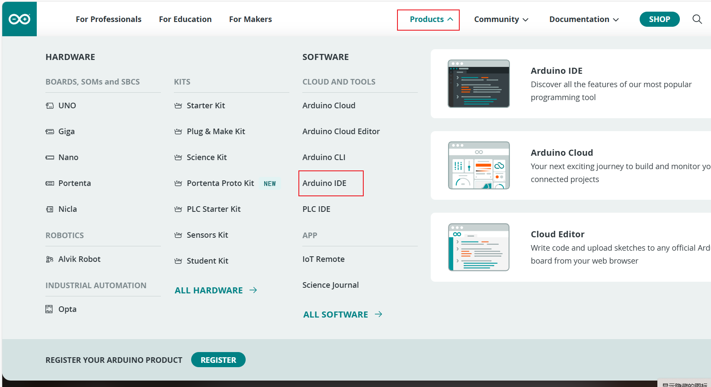
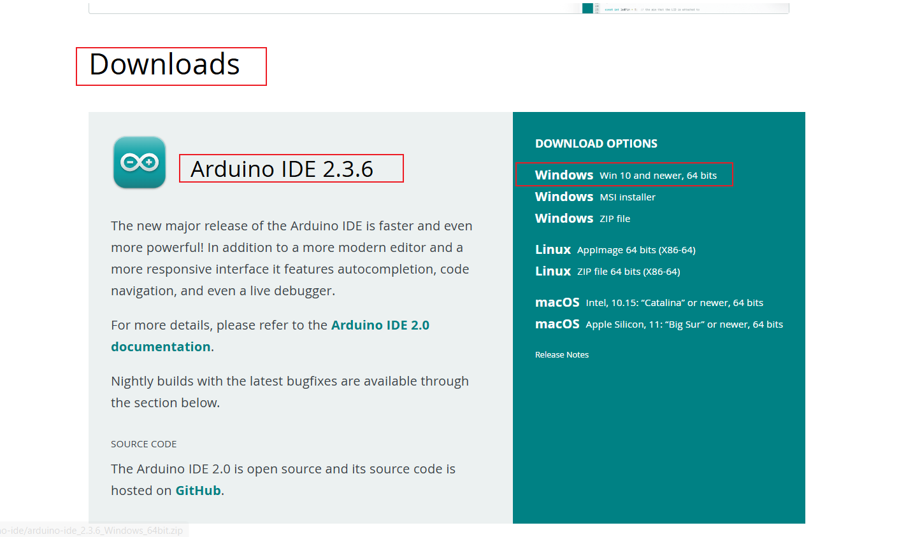
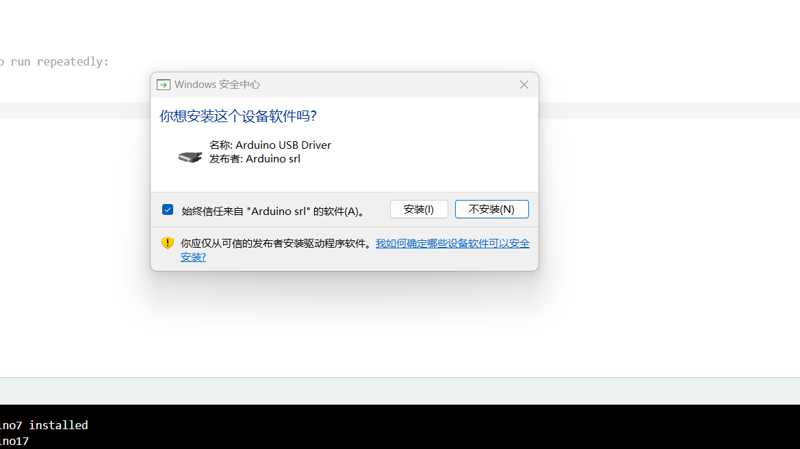
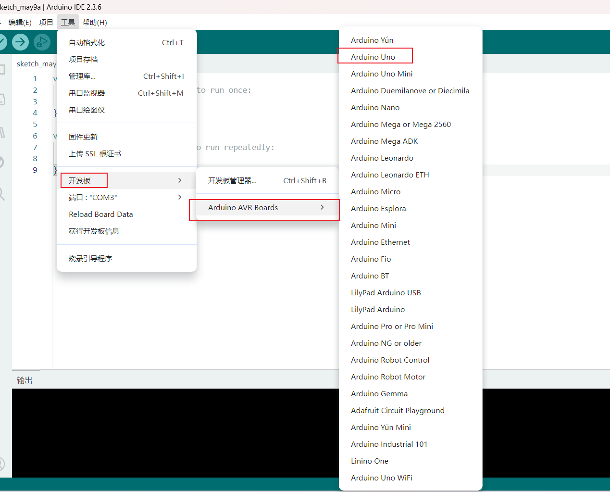
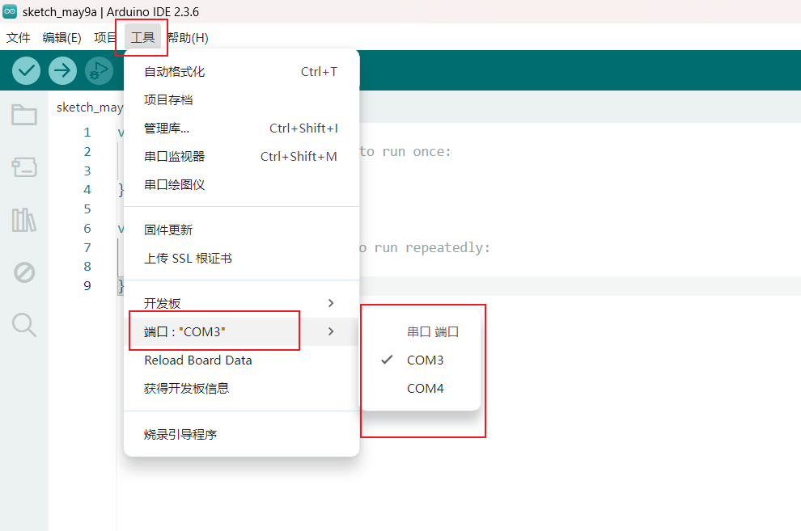
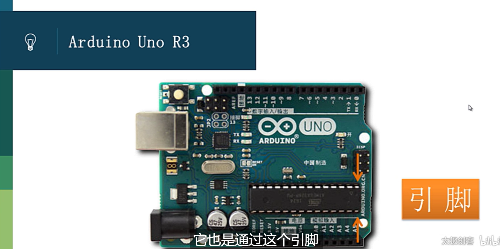
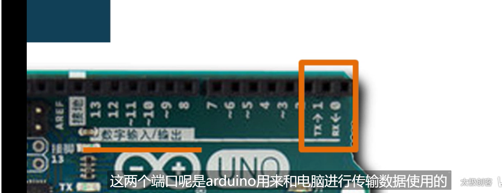
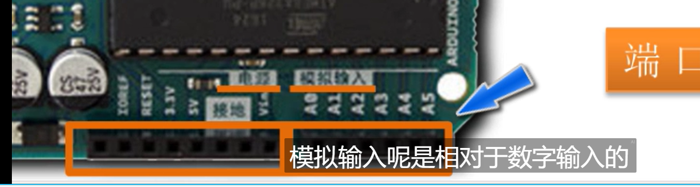
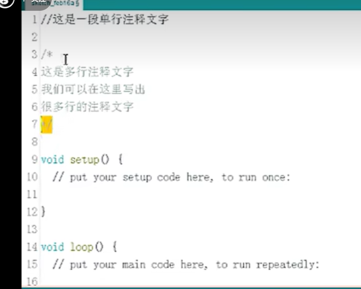

# 1.基础知识篇

仿真网页  https://www.tinkercad.com/

## 1 arduino IDE 和开发板介绍

### 1.1 arduino IDE 下载和安装

官网网站 www.arduino.cc

下载安装版本

**遇到安装全部同意**

### 1.2 arduino IDE 界面介绍

1. 选择你的开发板型号

2. 选择到你的开发所usb 所连接到的端口

### 1.3 开发板介绍

## 2 Arduino 程序开发

### 2.1 注释

### 2.2 变量

PINMODE: pinMode（）函数语法：

 pinMode（脚位，工作模式）

 pinMode（）函数可以将Arduino的引脚配置成三种模式：

 1、输出模式（OUTPUT）——使用引脚提供≤40ma的电流 

2、输入模式（INPUT）

 3、上拉模式（INPUT_PULLUP） DIGITALWRITE: digitalWrite（）

函数语法： digitalWrite（脚位，高电平或低电平） 高电平（HIGH）5v 低电平（LOW）0v/GND 使引脚变为输出的顺序：

 1、先给引脚设置相应的工作状态——pinMode（脚位，工作模式）

 2、然后设置脚位的状态——digitalWrite（脚位，高电平或低电平）

 3、设置持续时间——delay（毫秒）
