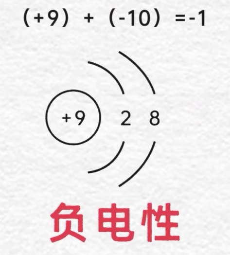
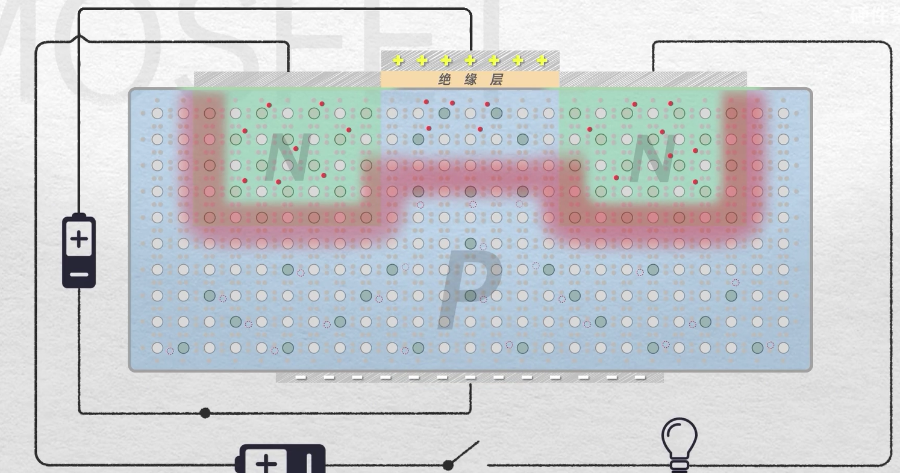
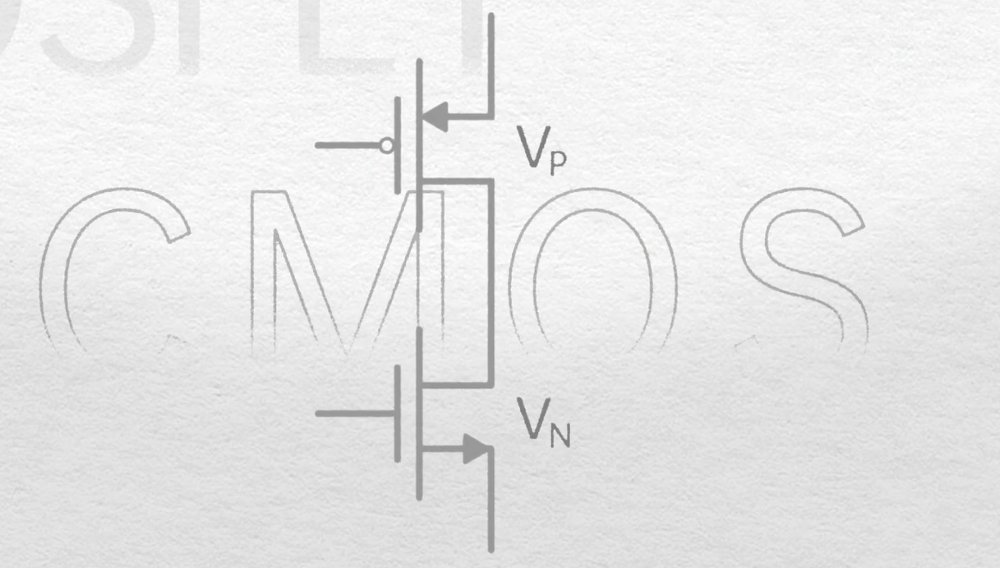
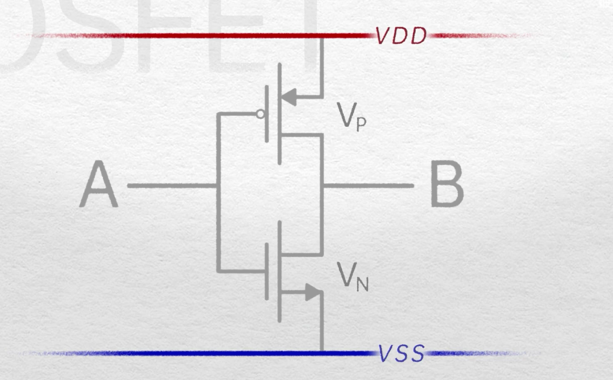
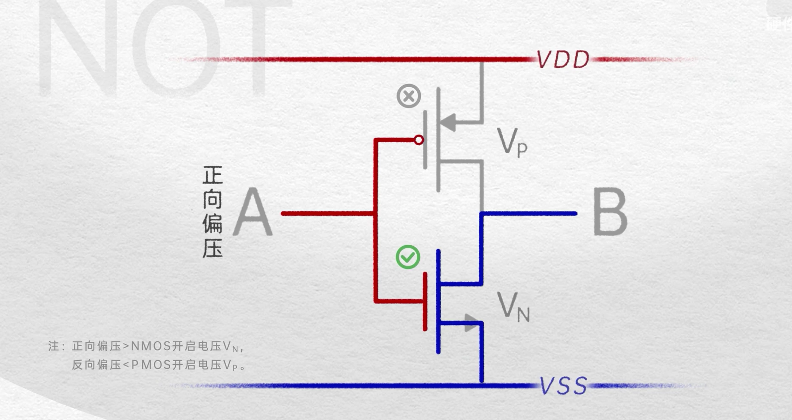
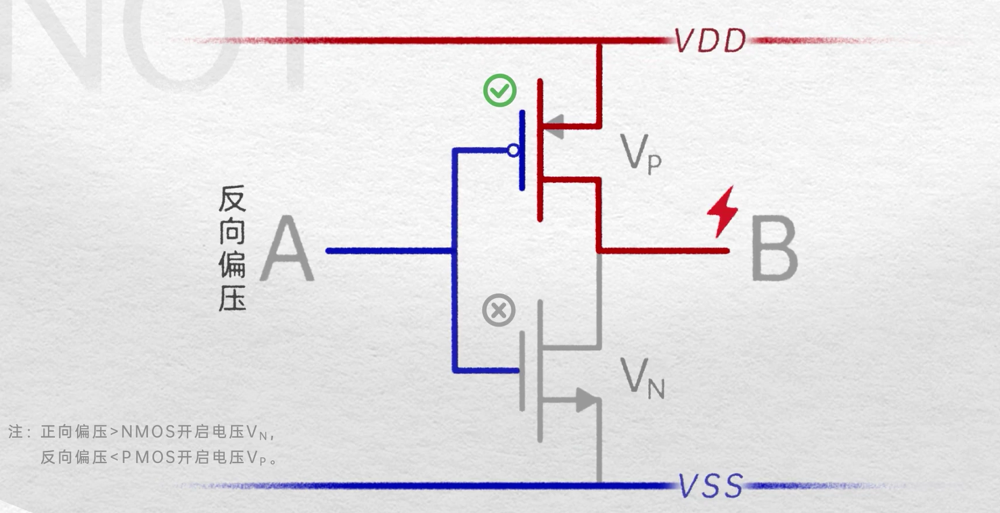
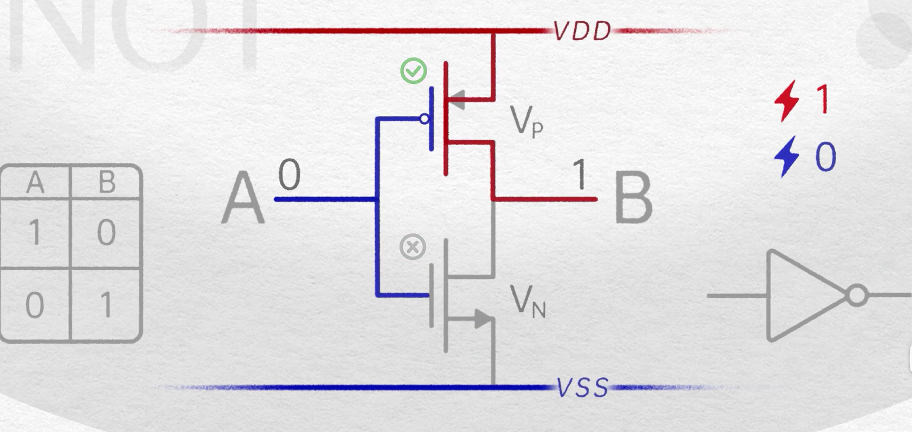
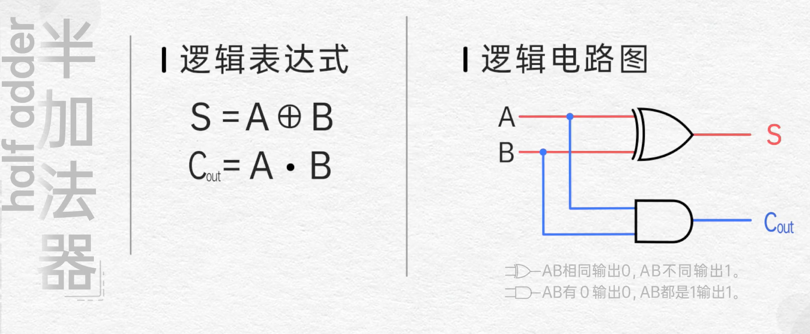
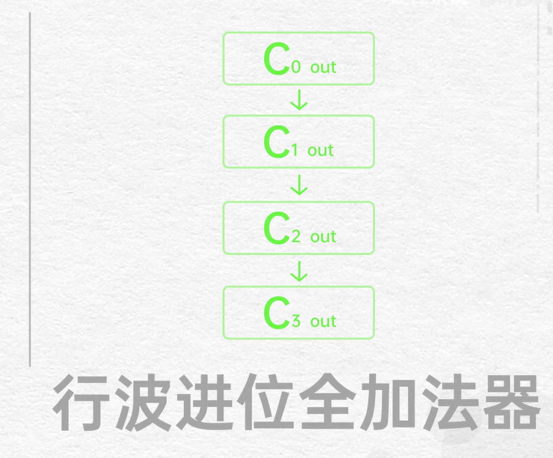

## 电流

电压（Voltage）是推动电荷（在电路中通常是电子）在导体中移动的力量，而电流（Current）则是电荷的流动。

具体来说：

1. **电压**：电压是两点之间电势能的差异。在电路中，电源（如电池或发电机）提供电压。这个电压差会在电路中产生一个电场，电场力会推动电子从低电势点向高电势点移动（在常规电路中，电流是从正极流向负极，但电子是带负电的，所以它们实际上是从负极流向正极）。
2. **电流**：电流是单位时间内通过导体横截面的电荷量。在电路中，当电压作用于导体时，导体中的自由电子（或其他电荷载体）会在电场力的作用下开始移动，从而形成电流。

所以，简单地说，电压是推动电子移动产生电流的原因。这个关系可以用欧姆定律（Ohm's Law）来描述：V = IR，其中V是电压，I是电流，R是电阻。这个定律表明，在电阻一定的条件下，电压和电流成正比。

$$
C= 
V
Q
​
$$

## 1. 什么是MOSFET

### 水的组成：

**由H2O 的水分子**

**水分子又是由 2 个氢原子和 1 个氧原子**

**原子的组成  质子 中子 电子**  

 **质子带正电  中子不带电 电子带负电**

**原子核 -> 质子 + 中子**

**在电场作用下电子围绕原子核做运动**（电子环绕的轨迹是不确定的）

**电子环绕的运动的空间叫做电子云**

### 原子结构示意图：

如果一个原子失去一个电子，因为质子不变，所有显正电

如果一个中性的原子得到一个电子，由于电子显负电，所有显负电性

### 铜的原子结构

铜最外圈有一个单独的电子，这个电子由于某些原因倾向脱离原子，成为自由电子

如果没有外力的作用下这个电子的运行是随机的

放一个电源，并用铜将其与灯泡连接，

**闭合开关，电源的电压会驱使电子做定向移动，就产生了电流，灯泡就会亮起**

注意电子带的是负电荷，**电流的规定的是正电荷的移动方向**。所以电流的方向和电子的方向是相反的

### 半导体（硅）

原子结构示意图：

硅的最外层其实可以容纳 8个电子

如果我们把一堆硅原子组合在一起，形成纯净的硅晶体，

这样每个硅原子和四周的四个硅原子就会各种拿出一个电子，**两两形成共价键**

**此时就相当于每个硅原子最外层有8个电子**

共价键对电子的束缚是很强的，是一种很稳定的结构，既不容易得到电子，也不容易失去电子。**整体导电性很弱**

### N型掺杂 （负电）

如果我们往纯净的硅中掺入少量的磷元素，磷原子中含有5个价电子，其中4个价电子会与四周硅原子形成共价键。

此时还会多出一个电子，这个电子受到的束缚较弱，比较容易发生移动

这样少量掺杂的硅的导电性就会上升，这种增加电子方式的掺杂被称为N型掺杂

在N型掺杂的半导体中，电荷的载体也叫做载流子 电子

### P型掺杂（正电）

同样我们往纯净的硅中掺杂少量的硼元素，由于硼原子只有3个价电子，

这样它只能形成3个共价键

**会有一个空穴**

其他的电子会移动到这个空穴中，由于其他的电子移动过来，就相当于空穴位置移动到了其他地方，

此时这种少量掺杂的硅导电性将会上升，

增加空穴的掺杂被称为P型掺杂

**在P型掺杂中载流子是空穴**

### 扩散作用

假设左边有墨水，右边是纯净水，中间有块挡板。

如果将挡板拿开，墨水会自发的向右扩散**，这就是扩散作用**

如果在同一块硅板进行N型掺杂，和P型掺杂，就得到了一个PN结

应为N型掺杂的**电子比较多**，P型掺杂的**空穴比较多**。

电子就会由**N区扩散到P区**，和空穴结合，由于N区域失去了电子由中性变为显正电，P区域由于得到了电子，显负电

这样就会有一个由**正电性的区域，指向负电性区域的电场**，这个电场会驱使电子做移动。

由于**电子是带负电的会被正极**吸引，所以**电子在电场中的运动方向是和电场相反的**

当扩散作用和电子受电场的作用想等时，此时就保持了一个平衡，其他的电子将无法往另一侧扩散

### 耗尽层

**中间这片缺乏载流子的、存在内电场的区域被称为耗尽层。**

此时外接一个一个灯泡，正极接P，负极接N，

**电池提供的电场是从右往左的，当这个电场足以抵消向右的电场时，平衡就会被打破**

电子就可以跨过耗尽层源源不断的流动了，此时电路就可以导通，灯泡亮起

**如何我们将电池反过来接**

电场的电场，和内建电场方向相同，电场加强以后

由于电子的运动方向与电场相反，所以所有的电子往左边赶，那对应的空穴就是往右边走，于是耗尽层被加宽

电子几乎无法跨过这个电场形成的回路

### **二极管的工作原理**

二极管是一种典型的单向导电元件，它只允许电流在一个方向上流动，这个方向被称为正向。在正向方向，如果施加一个小电压，电流就会开始流动。

二极管的工作原理主要基于P-N结的特性。P-N结是由P型半导体和N型半导体相接触形成的，其中P型半导体中多负电荷，而N型半导体中多正电荷。

当二极管正向连接（P型半导体连接正极，N型半导体连接负极）并施加电压时，P型和N型半导体中的电荷会互相吸引，导致P-N结消失，形成导电通道，电流就能流过二极管。

如果二极管反向连接（P型半导体连接负极，N型半导体连接正极），由于电荷之间的排斥，P-N结会变得更宽，阻止电流流过。

但是，如果施加的电压超过二极管的刻耐压，二极管就会发生击穿，电流也会在反向流过。这通常是二极管损坏的原因，因为这可能会产生大批量的热量，对二极管造成热损伤。

总结一下，二极管的基本工作原理就是利用P-N结的特性，只让电流在一个方向上流动。希望这个答案能帮你理解二极管的工作原理。

**电源可以由P流向N，不能又N流向P**

### MOSFET 的工作原理

将一块纯硅中，两个肩膀的位置进行N型掺杂，其他位置进行P型掺杂

扩散作用会在N和P之间形成耗尽层

这时候往两个N区域接一个电池和灯泡形成回路

负极P往N是可以导通的，正极是N往P不能导通，耗尽层会加宽，阻止电子移动

电池反过来也是同理

正极N往P不导通，耗尽层扩大

负极P往N导通

想要实现导通需要一点电场的帮助

使用2块金属板，中间夹着一块绝缘层，将2层金属板连接到电源的正负极

在电源的作用下，大量的电子会被正极吸引离开上层金属板，聚集到下层金属板，

这时候上层金属板显正电，下层金属板成负电性，这样在绝缘层中就会形成一个从上到下的指向性电场

**如果将这个结构装到两个N区域的中间**

上层金属板，

P区域充当下层金属板

将电源导通，就会有大量的电子被吸引到这块区域，填充空穴的同时，还会多出很多自由电子

当达成平衡以后，在这片区域的下方也会因为扩散的作用形成新的耗尽层。

此时就能发现这块区域与N区是一模一样的，相当于将2个N区联通，**此时电路就能被导通了**

#### **N沟道**

所有就得到了一个可以用电压控制的开关

当我们给中间的电极施加正向偏压，当电压高于**阈值电压**（能让N沟道产生的电压）时，MOSFET可以导通

当电压低于阈值电压时，不导通

### 最基本的MOSFET结构

### NMOS

### PMOS

将P N掺杂调换位置反过来,珊极的正负调换，给G级施加反向偏压

**PMOS 的箭头指向MOS内**

**NMOS 的箭头指向MOS外**

### CMOS

将PMOS和NMOS 的漏极连接起来 就得到了一个CMOS

把两个G极连接起来作为输入端A，两个D极的连接处拉出来作为输出端B

PMOS 的S极接入供电电压 VDD

NMOS的S极接入接地电压 VSS

就得到了一个非门

当A输入正向偏压，电压高于阈值时PMOS 不导通，NMOS 导通，相当于输出端B接到了接地电压VSS。输出的就是相对低压

当A输入的电压低于阈值，NMOS不导通，PMOS导通，相当于B直接接到了高压VDD上

规定相对高压时1 相对低压是0

给A输入0 B输出1

输入1 输出0

## 2.逻辑门

**NMOS 高压导通，低压不导通**

**PMOS 高压不导通 低压导通**

**VDD 可以理解为整个电源的正极供电 高电位 VSS**

**VSS 可以理解为构成回路的负极接地 相对于整个电路为低电位或0电位**

### 非门

将PMOS 和 NMOS 珊极连接起来到 输入A  漏极连接起来到 输出Y 

PMOS 源极接入 VDD高电压 NMOS 接入低电压 VSS

实现一个最简单的非门

**当A输入高压 PMOS 不导通， NMOS 导通**   相当于输出端Y接入到低电压VSS，输出的是相对低压

**当A输入低压PMOS 导通 NMOS不导通** 相当于 输出Y 直接接入VDD 高压输出

如果定义相对高压为1 低压为0

则可以得到

A输入 1 输出 0

A输入 0 输出 1

### 或门

**只要有一个为1 结果就为1，全部为0才为0**

 

### 或非门

将或门后面的非门去掉后

**只有全部为0时才为1，只有有一个为1就为0**

### 与门

当只要有一个输入为0时 输出为0 只有全部输入1 是输出为1

### 与非门

**只有当输入都为 1 时输出为0，只有有一个输入为0时 输出就为0**

### 异或门

**当输入的相同时为0   不同时为1**

简化后的电路图

### 同或门

**在异或门的基础上后加上 非门**

**输入相同时，输出为1，输入不同时输出为0**

### 总结

### 3.CPU 进行加法运算

#### 半加法器

#### 全加法器

##### 方式一

##### 方式二

当AB输入的结果的值进行异或后，得到的值与C out 进行与运算得到的结果为真说明 ，ABC 中必定有2个1，最后再对结构进行或运行，就能计算出进位值

当AB输入值都为1 时 AB进行 与 运算的结果为1， Cout 与 AB进行异或运行的结果为0 ，最后进行或运算得到进位为1

AB相同  与 AB 不同 不可能同时发生，属于互斥关系

#### 串型进位加法器

将4个全加法器的Cout 首尾相连

行波进位全加法器

一步一步计算下去的加法器，必需计算出上一位才能计算下一位，位数增加，延迟会以几何增加高

#### 并行进位全加法器，超前进位加法器

## 图灵完备

## 1. 德 摩根定律

