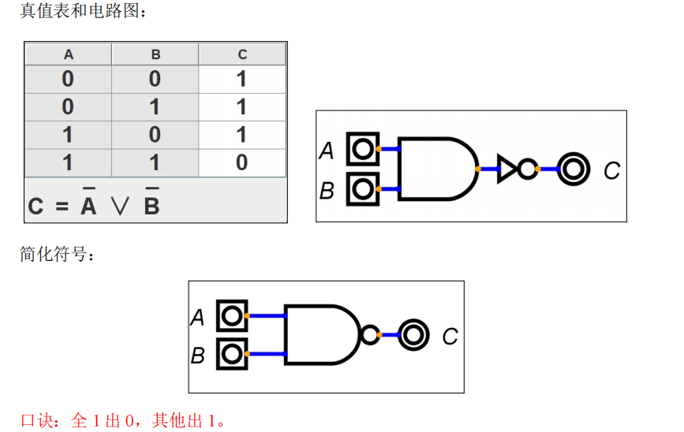
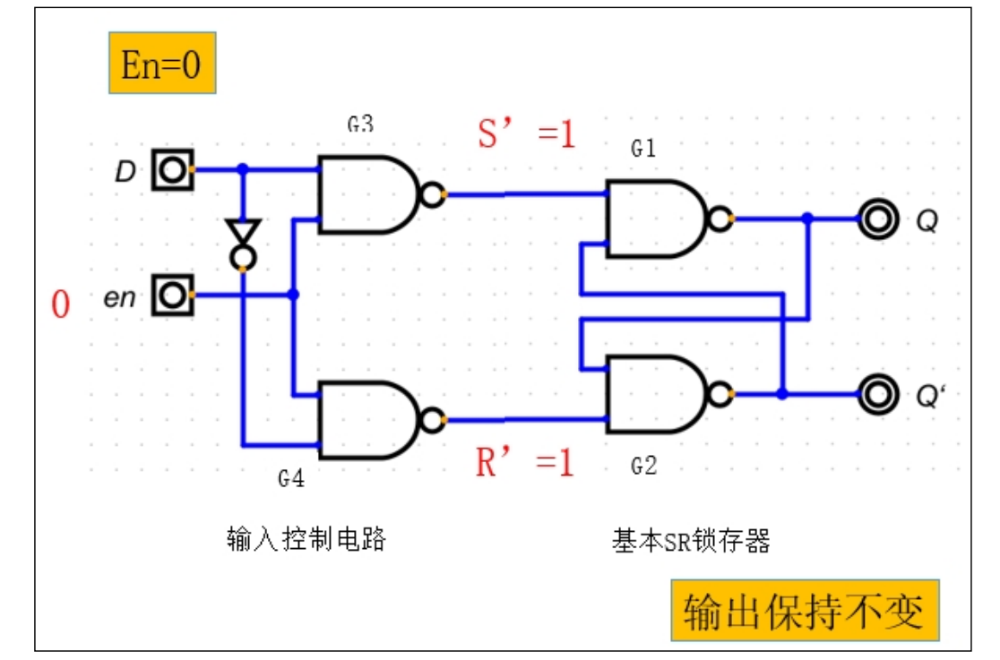
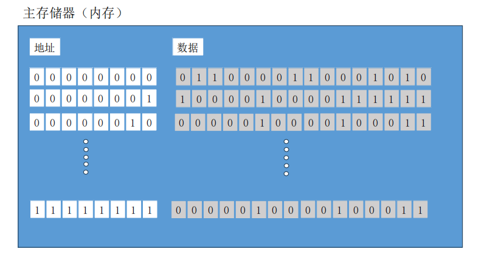

# **第** **1** **章 数字电路基础**


## **1.1** **引言**

数字电路是现代科技和工程领域中不可或缺的基础。从计算机系统到通信设备，从家

庭电子产品到工业自动化，数字电路无处不在，影响着我们的生活和工作。本章节旨在向

读者介绍数字电路的基本概念、原理和应用，为后期学习单片机开发打基础。

## **1.2** **二进制数据表达**

### **1.2.1** **二进制简介**

二进制是一种数字表示法，它使用两个不同的数字符号，0 和 1，来表示数值。下面是

一些二进制的基本概念：

1. 位（**bit**）

不同于十进制中，每个位可以用 0-9 表示，二进制中每位都是 0 或 1，每个二进制位我

们称之为一个 bit，可以表示两种状态。位一般用 b 代替，例如 8b 代表 8 个 bit。

2. **字节（byte)**

8bit组成一个字节，总共可以表示 256种状态。字节一般用 B代替，例如 8B一般表示 8

个字节。

3. **其他计量单位（K，M，…）**

K：表示 2 的十次方，例如，1KB 就是 1024B

M：表示 2 的 20 次方。例如：1MB 就是 1048576B

G：表示 2 的 30 次方。

T：表示 2 的 40 次方。

比这些更高的计量单位，尽管有定义，但是现实中我们很少用到，这里就不再赘述。

二进制是计算机科学的基础，现实中的绝大部分信息都可以完全数字化，并进一步用二进制来表示和存储。


### 1.2.2 用二进制表达文字

计算机使用二进制（0 和 1）来表达和处理各种信息，包括文字。文字在计算机内部并不是直接以它们在纸上或屏幕上显示的形式存储的，而是被转换成一种或多种编码格式。以下是计算机如何使用二进制表达文字的基本过程：

1. **字符编码**：
   - 为了在计算机中存储和传输文字，我们需要一种将字符（如字母、数字、标点符号等）映射到唯一数字的方法。这种映射称为字符编码。
   - 最早的字符编码之一是 ASCII（美国信息交换标准代码），它使用 7 位二进制数来表示 128 个不同的字符（包括大小写字母、数字、标点符号和控制字符）。但由于 7 位不便于计算机内部处理（通常使用字节作为基本单位），ASCII 实际上使用了一个字节（8 位）来存储每个字符，其中最高位（最左边的位）通常设为 0。
   - 随着国际化需求的增长，需要表示更多的字符（如中文、日文、阿拉伯文等），于是出现了各种扩展的字符编码，如 ISO 8859、GB2312、Big5 等。但这些编码系统之间并不兼容，给国际交流带来了困难。
   - 为了解决这个问题，Unicode 编码系统被开发出来。Unicode 使用一个或多个代码点（code point）来表示一个字符，每个代码点都有一个唯一的数字标识。Unicode 标准定义了一个庞大的字符集，几乎包含了世界上所有已知的文字和符号。
2. **Unicode 编码与二进制**：
   - Unicode 字符可以使用多种编码形式在计算机中存储和传输，其中最常见的是 UTF-8、UTF-16 和 UTF-32。
   - UTF-8（8 位 Unicode 转换格式）是一种可变长度的编码方式，它使用 1 到 4 个字节来表示一个 Unicode 字符。对于 ASCII 字符，UTF-8 的编码与 ASCII 相同；对于其他字符，UTF-8 使用额外的字节来表示。这使得 UTF-8 在处理包含大量 ASCII 字符的文本时非常高效，同时也支持全 Unicode 字符集。
   - 当我们将一个 Unicode 字符转换为 UTF-8 编码时，实际上是将其唯一的数字标识转换为一系列的二进制位（bits），然后这些二进制位被分组为字节（bytes）进行存储和传输。
3. **字体和渲染**：
   - 仅仅知道字符的二进制编码还不够，我们还需要知道如何将这些编码转换为人类在屏幕上看到的实际形状（即字体）。这通常是通过字体文件（如 TrueType、OpenType 等）来完成的。
   - 字体文件包含了字符的矢量图形描述，计算机可以根据这些描述和字符的编码来渲染出对应的字符形状。这个过程称为文本的渲染或排版。

总结起来，计算机使用二进制表达文字的过程包括将字符映射到唯一的数字（字符编码），将这些数字转换为二进制位（如 UTF-8 编码），然后通过字体文件将这些二进制位渲染为实际的字符形状。


### 1.2.3 用二进制表达图片

用二进制表达图片涉及将图像的像素信息转换为二进制数据。以下是基本步骤：

1. **颜色表示**
   - 对于彩色图像，**每个像素通常由三个颜色通道（红色、绿色和蓝色，简称RGB**）组成。每个颜色通道通常使用**一个字节（8位**）来表示，其值范围从0（无颜色）到255（最大颜色强度）。
   - 对于灰度图像，每个像素只有一个亮度值，同样可以用一个字节来表示。
2. **图像数据**
   - 图像的宽度和高度决定了像素的数量。例如，一个100x100像素的图像将有10,000个像素。
   - 对于彩色图像，每个像素由三个字节表示（RGB各一个字节），所以总字节数是像素数乘以3。对于灰度图像，每个像素一个字节。
3. **二进制转换**
   - 将每个像素的颜色值（或灰度值）转换为二进制数。例如，红色通道的值为255时，其二进制表示为`11111111`。
   - 将所有像素的二进制数连接在一起，形成一个连续的二进制数据流。
4. **图像文件格式**
   - 图像数据不仅包含像素值，还包含关于图像如何显示的信息（如颜色空间、分辨率、压缩方式等）。这些信息与像素数据一起被封装在图像文件格式中，如JPEG、PNG、BMP等。
   - 每个图像文件格式都有其特定的文件头和元数据部分，这些部分也包含二进制数据。
5. **存储和传输**
   - 完整的图像文件（包括文件头、元数据和像素数据）被存储为二进制文件，可以在计算机系统中读取和处理。
   - 在网络上传输图像时，也是传输这些二进制数据。
6. **图像处理和显示**
   - 当图像数据被读取到计算机内存中时，它可以被各种图像处理软件或库进行操作和变换。
   - 最终，图像数据被传递给显示设备（如显示器或打印机），这些设备根据像素的二进制值来生成对应的颜色或亮度。

总之，用二进制表达图片涉及将图像的像素信息（包括颜色或灰度值）转换为二进制数据，并将这些数据与图像的其他元数据一起封装在特定的文件格式中。这些二进制数据可以被存储、传输和处理，最终用于在显示设备上呈现图像。


### 1.2.4 用二进制表达声音

计算机是使用**二进制代码**来表达和处理所有数据的，包括声音。在计算机中，声音被转化为电子信号，然后被抓取并转化为数字，这个过程叫做**模拟-数字转换（ADC）**。


声音的模拟-数字转换过程可以简化为以下三个步骤：


1. **取样**：声音信号是连续的，在取样过程中，我们将这个连续信号转换为离散信号。假设我们每秒钟取样44100次（这是CD音质的标准取样率），我们就可以将每秒的声音切分为44100个小部分。
2. **量化**：量化是将每个样本的振幅值映射到最近的整数。例如，在16比特的音频中，我们可以将振幅值映射到-32768到32767之间的整数。
3. **编码**：最后，将量化后的振幅值转换为二进制代码。例如，整数100可能会被转换为二进制的“01100100”。


所以，假设我们有一个声音信号，它在某一特定瞬间的振幅值为100，然后我们将100转换为二进制的“01100100”，这个二进制代码就所代表的声音。


进一步地，如果把这个过程反过来，将二进制代码“01100100”转化回为十进制的100，然后引发出相应的振幅的声音，我们就可以复原这段声音。整个这个过程叫做**数字-模拟转换（DAC）**。

可视化示例：

```plaintext
声音信号（模拟信号）-->  取样定时信号  -->  量化振幅值  -->  二进制编码（数字信号）

    /\                       /\                    /\                 /\
连续波形               离散波点               整数值                二进制代码
```


### 1.2.5 用二进制表达视频


用二进制表达视频的过程其实与表达声音和图片相似，都涉及到数据的数字化和编码。具体来说，视频可以被视为一系列连续的图像（帧）与声音的组合。以下是视频用二进制表达的基本步骤：

1. 图像编码
   - 每一帧图像都需要经过与图片编码类似的步骤，即将像素信息转换为二进制数据。这通常包括颜色空间转换（如从RGB到YUV）、子采样、变换编码（如离散余弦变换DCT）、量化、熵编码等步骤。
2. 声音编码
   - 视频中的音频部分也需要经过与声音编码类似的步骤，即将连续的音频信号转换为离散的样本，然后对这些样本进行量化、编码为二进制数据。
3. 同步与封装
   - 编码后的图像帧和音频数据需要按照一定的时间顺序和格式进行同步和封装，以形成完整的视频文件。这个过程中，可能还需要添加一些额外的信息，如时间戳、帧类型、编解码参数等。
4. 视频文件格式
   - 封装后的视频数据被存储为特定的视频文件格式，如MP4、AVI、MKV等。这些文件格式定义了如何组织和存储视频数据，以便播放器能够正确地解码和播放。
5. 压缩
   - 为了减少存储空间和传输带宽的需求，视频文件通常会使用各种压缩技术。这些技术可能包括帧间压缩（如利用相邻帧之间的相似性来减少数据量）、帧内压缩（如利用图像内部的冗余信息来减少数据量）、有损压缩（如通过牺牲一定的图像质量来减少数据量）等。
6. 解码与播放
   - 当需要播放视频时，视频文件被读取并解码回原始的图像帧和音频数据。然后，这些数据被连续地显示在屏幕上并播放出来，形成我们看到的视频画面和听到的声音。

需要注意的是，视频编码是一个复杂的过程，涉及到多个学科的知识和技术。不同的视频编码标准（如H.264、H.265等）会采用不同的编码算法和参数设置，以实现不同的压缩效率和图像质量。同时，视频编码也是一个不断发展的领域，随着技术的进步和应用场景的变化，新的编码标准和算法不断涌现。


## 1.3 数字电路


将信息数字化后，我们可以方便的用二进制表示信息。而现代计算机技术的基础—— 数字电路，研究的就是如何用电表示二进制。其实这件事非常简单，例如下面的一个电路


​		当开关闭合，信号输出就有 5v 电压；当开关断开，由于下拉电阻存在，信号输出电压 变为 0，我们可以将信号输出的高电平态视为 1，低电平态视为 0，即可用电表示二进制。 所以数字电路就是对电路进行定性分析（高或者低），而不用去考虑精确电压是否会有误差。


### 1.3.1 数字电路仿真软件——Digital

为了学习数字电路，给大家介绍一款数字电路拟真软件。

官方网站：https://github.com/hneemann/Digital

最新版下载地址：https://github.com/hneemann/Digital/releases/download/v0.30/Digital.zip

该软件运行需要 Java 环境，下载地址为：https://download.oracle.com/java/17/latest/jdk-

17_windows-x64_bin.msi

安装完成后打开 digital，看到如下页面即安装成功：


### **1.3.2** **基础逻辑门电路**

基础逻辑电路重点掌握表述该逻辑的四种方式：逻辑表达式、真值表、逻辑符号、口

诀。

**1****）非门**

（1）从“组件——输入输出”中，选择一个输入和一个输出；

（2）从“组件——导线”中选择一个地、一个电源和一个下拉电阻；

（3）从“组件——开关”中选择一个继电器；

（4）右键点击输入，标签输入 A；

（5）右键点击输出，标签输入 B；

（6）右键点击继电器，勾选“闭合继电器”；


开始仿真后，尝试改变 A 的输入电平，观察 B 输出的电平变化。可以看到 AB 的信号

关系如下：


这种输入信号和输出信号完全相反的电路，叫做非门，上面的这张0-1关系表，我们称

之为真值表。Digital 软件也可以根据电路自动生成真值表：


可以看到 Digital 软件不但给出了 AB 的真值表，还给出了 B 和 A 的逻辑关系。

在今后我们使用非门时，不会再画该电路，而是直接采用“组件——逻辑”里面的非

门，如图示：非门逻辑符号。


**2**）与门

（1）从“组件——输入输出”中，选择两个输入和一个输出；

（2）从“组件——导线”中选择两个地、一个电源和一个下拉电阻；

（3）从“组件——开关”中选择两个继电器；

给输入编号 A、B，给输出编号 C，按照如下图连接


开启仿真，观察 C 与 AB 之间的关系，可得真值表如下图所示：


在今后我们使用与门时，不会再绘制该电路，而是直接采用“组件——逻辑”里面的

与门，如图示：与门逻辑符号。


**3**）或门

（1）从“组件——输入输出”中，选择两个个输入和一个输出；

（2）从“组件——导线”中选择两个地、一个电源和一个下拉电阻；

（3）从“组件——开关”中选择两个继电器；

给输入编号 A、B，给输出编号 C，按照如下图连接：


开启仿真，观察 C 与 AB 之间的关系，可得真值表如下图所示：


口诀：有 1 出 1，全 0 出 0。


### **1.3.3** **其他门电路**

​		与或非三门我们一般称之为基础门电路，而其他门电路可以用这三种门电路组合得到。下面我们给出一些门电路真值表以及用与或非三门的组合实现。（这些实现并非最简实现，

我们的这门数字电路基础，更多只考虑可行性，不考虑优化）

#### **1**）异或门

真值表和电路图：


口诀：奇数出 1，偶数出 0。


#### **2**）与非门




#### 3) **或非门**

**真值表和电路图：**


#### 4) **异或非门**


#### **5**）逻辑门电路总结


### **1.3.4** **运算器**


#### **1**）半加器


​     现在我们来考虑如何用电路来实现 1 位加法。假如有两个 1 位二进制数 A、B，它们的

和为 1 位二进制数 S，那么存在如下枚举：

（1）如果 A=0，B=0，那么 S=0；

（2）如果 A=1，B=0，那么 S=1；

（3）如果 A=0，B=1，那么 S=1；

（4）如果 A=1，B=1，那么 S=0，而且产生一个进位 C=1。

也就是说，对于加法运算，应该两个输入 A 和 B，两个输出 S 和 C，S 表示和，C 表示

是否产生进位，也就是说真值表如下图所示：


其中 A、B 与 S 的关系为异或，与 C 的关系为与，得到如下电路图：


#### **2**）将半加器封装成一个组件


（1）将电路另存到 Digital 的安装目录的 lib 中


（2）保存半加器电路到 class_code 目录


**（3）使用封装好的电路**


#### **3**）全加法器


**半加器实现一位全加器。**

半加器只能处理两个数的运算，但在实际计算中，如果我们做加法的两个位不是最低

的位，那就要考虑低位可能产生的进位。也就是说，一个功能完整的 1 位加法器，应该考

虑三个输入，除了 A、B 两个加数，还要考虑是否存在低位进位 Cin。

为了处理三个数相加，我们可以用两个半加器分别处理两个累加过程，同时两个累加

器产生的进位 C1 和 C2，不可能同时为 1，（因为如果 C1 位 1，那么 S1=0，S1=0，C2 不可

能为 1），且二者只要有一个为 1，则输出进位为 1，所以关系为或，最终呈现的电路如下：


其中的黄色方块为子电路，内容就是我们上面实现的半加器。


#### **4** ）4位加法器


多位加法器就是多个加法器的串联，下面我们以 4 位加法器为例来展示多位加法器电

路：

添加输入 Cin，A，B，右键点击 A 和 B，将位数调整为 4；

添加两个“组件——导线”中的分裂器，右键点击将其设置如下图所示：


将分裂器输入端与 A、B相连，并添加 8个“组件——导线”里面的隧道，分别命名为

A0、A1、A2、A2、B0、B1、B2、B3，并接在分裂器的输出端，如图示：

说明：图中 A0 管道是给标签名起名位 A_0 来实现的


添加输出 S，并将位数调整为 4，并添加分裂器，输入/输出设置为 1，1，1，1/4，并将

输出端连接到 S，输出端连接四个隧道 S0、S1、S2、S3，如图示：


今后我们在用到多位加法器时，不会再次绘制该电路，而是会直接使用“组件——运

算器”中的加法器，如图示：


### **1.3.5** 锁存器和触发器


目前我们画了很多计算电路，这些电路都有一个特点，当输入信号发生变化，输出信

号会立刻变化，无法对状态进行存储。这在某些情况下会给我们的计算带来麻烦，例如我们想计算这个算式：25+37+12-9+8。在没有状态存储的情况下，我们只能用 4 个计算电路

串联得到最终结果，这显然是不现实的。

接下来的一系列电路，我们要给大家描述的是，如何储存电信号。


#### **1.3.5.1 SR** **锁存器**

**1**）**SR **锁存器的电路结构：

SR 锁存器（set-reset-Latch）是静态存储单元中最基本、也是电路结构中最简单的一种

电路。SR 锁存器可以有两种构成方式。方式一，由两个或非门构成。方式二，由两个与非

门构成。两种方式构成的 SR 锁存器功能相同。此处，我们以与非门构成的 SR 锁存器为例

进行介绍。

**2**）由两个与非门组成的 **SR** **锁存器的工作原理**


总结：

（1）当 S`为 1，R`为 1， Q 和 Q`状态不变；

（2）当 S`为 0，R`为 1， Q=1、Q`=0；(置位)

（3）当 S`为 1，R`为 0， Q=0、Q`=1；(复位)

（4）当 S`为 0，R`为 0，电路无意义


#### **1.3.5.2** **带** **en** **输入的** **D** **锁存器**

上面的 SR锁存器尽管可以锁住输出状态，但是我们没法控制设置输出的时机。所以我

们给这个电路加上一些其他组件。

**1**）电路结构：锁存器的基础上，增加一个触发信号输入端


**2**）工作原理


（1）En = 0 时，输出保持不变


En=0，与非门特性，G3 输出 S1=1，G4 输出 R’=1，因为 S’、R’低电平有效，此处

都为 1，处于高电平，既不置 0 也不置 1 输出保持不变。

（2）En=1，正常 SR 锁存器的功能


当 en=1时，与非门 G3输出就是 S’，与非门 G4的输出就是 R’，正好是之前讲过的 SR

锁存器的输入。


**3**）真值特性表


**4**）带 **En** **输入的 D** 锁存


当 en 为 1 时，如果我们想将 Q 设为 1，此时 S 应为 1，R 应为 0；反之，如果我们想将Q 设置为 0，S 应为 0，R 应为 1。由此可得到，SR 恰好为反相输入时，可以顺利的设置 Q，

所以我们对电路稍加改造，将 S 改名为 D，并将其反相输入到 R，如图示


我们就得到了一个带 en 输入的 D 锁存器，其特性为：当 en 为高电平，Q 和 D 的输入保持一致；当 en 为低电平，Q 保持之前状态不变，从而起到存储作用。

（1）工作原理：

- **En=0**




- **En=1，D=0**


- **En=1，D=1**


总结：当 en 为 1 时，输出 Q的值与 D 输入的值相同。

问题：当 en 为 1 时，D 的输入直接影响 Q*的输出，为了提高触发器的可靠性，增强抗

干扰能力，希望触发器的次态仅仅取决于 en 的下降沿（或上升沿）到来时的输入信号状态。D

触发器可以解决以上问题。


#### **1.3.5.3** **边沿触发的** **D** 触发器


D 锁存器尽管可以起到保存数据的作用，但是当 en 信号为 1 时，D 输入和 Q 输出相当于是联通的，此时如果 D 信号有波动，Q 会跟随波动。我们希望能得到更稳定的输出 Q，

不希望 en 高电平时 Q 随 D 波动，而是希望 Q 只在 en 信号由 0 变成 1 的一瞬间随 D 输入变化，其他时间都保持不变。看下面的电路图


其中输入 C 为时钟输入，添加路径为“组件——输入输出”里面的时钟输入。关于时钟的作用，我们在之后计算机组成原理里面再为大家详细介绍，现在我们可以仅仅把时钟

输入当作一个普通输入来用。


**1**）工作原理

（1）C=0


（2）C=1


（3）C 从 1到0


（4）C 从 0到1


开启仿真后，经过实验我们得知，C 信号不论是高电平还是低电平，Q 都不会随 D 变化；只有当 C信号由 0变 1的一瞬间，D的值能够传递到 Q。这个电路我们称为上升沿触发的 D 触发器。其实对电路稍作改变，我们还能得到下降沿触发的 D 触发器，但之后我们如

果不做特殊说明，凡是用到 D 触发器，都是指上升沿触发器。

今后我们如果使用 D 触发器，不会再绘制该电路，而是直接使用“组件——触发器”

中的 D 触发器。有一点需要注意，Digital 软件中的 D 触发器，Q 输入和标准触 D 发器是反

相的，所以我们将 Q`当作 Q 来用，如图示：


### **1.3.6** **寄存器**


今后我们只用寄存器时，不会在绘制该电路，而是直接使用“组件——存储器”中的寄存器，如图示


# **第** **2** 章 计算机组成原理


## **2.1** **冯诺依曼模型的计算机**

由科学家冯诺依曼提出的模型理论。基于通用图灵机建造的计算机都是在存储器（内存/寄存器）上存储数据。鉴于程序和数据在逻辑上是相同的，因此程序也能存储在计算机的存储器中。


**1**）冯诺依曼模型的四个子系统

（1）存储器：用来存储数据和程序的区域

（2）算数逻辑单元（ALU）：用来进行计算（算数运算、逻辑运算、位运算等）的地

方。

（3）控制单元：对存储器、算数逻辑单元、输入/输出等子系统进行控制操作。

（4）输入/输出单元：输入子系统负责从计算机外部接收输入数据，输出子系统负责

将计算机处理结果输出到计算机外部。

**2**）冯诺依曼模型**-**存储程序概念

冯诺依曼模型要求程序也必须存储在存储器(内存)中，现代计算机的存储单元用来存储程序和数据，这意味着程序和数据应该有相同的格式，实际上他们都是以位模式（0 和 1）存储在内存中。

**3**）冯诺依曼模型**-**指令的顺序执行

冯诺依曼模型中的一段程序是由一组数量有限的指令组成。控制单元从内存中提取一条指令，解释指令，接着执行指令，也就是说指令是一条接着一条顺序执行的。


## **2.2** **计算机组成部件**


计算机组成部件可以分为三大类。

（1）中央处理单元（CPU）

（2）主存储器（内存）

（3）输入/输出子系统


### **2.2.1** **中央处理单元** CPU

CPU 用于数据的运算【算数逻辑单元（ALU）、控制单元、寄存器组】。


**1**）**CPU** **中的算数逻辑单元**

算数逻辑单元：对数据进行逻辑、移位和算数运算。

（1）算术运算：整数和浮点数的加减运算。

（2）位移运算：逻辑移位运算和算术移位运算。

（3）逻辑运算：非、与、或、异或，这些运算的输入数据为二进制模式，运算结果也是二进制模式。


**2**）**CPU** 中的寄存器

寄存器：用来存放临时数据的高速独立存储单元。

（1）数据存储寄存器：保存运算的中间结果。

（2）指令存储器（IR）：CPU 从内存中逐条取出指令，并存储在指令存储器中，解释

并执行指令。

（3）程序计数器（PC）：保存当前正在执行的指令地址，当前指令执行完成后，计数

器自动加 1，指向下一条指令的内存地址。

**3**）**CPU** **控制单元：**

控制单元：控制各个子系统的操作，控制是通过从控制单元到其他子系统的信号来进

行的。

**2.2.2** **内存**

内存是存储单元的集合，每个存储单元都有唯一的标识，称为地址。

数据以“字”的形式在内存中传入传出，字可以是 8 位、16 位、32 位、64 位。如果字是 8 位，一般称为一个字节。



**1**）内存类型

主要有两种类型：RAM 和 ROM。

（1）随机存取存储器（RAM）

特点：系统断电后，信息（程序或数据）丢失。

（2）只读存储器（ROM）：里面的数据由制造商写进去，用户只能读不能写

特点：系统断电数据不会丢失。常用来存储那些在开机时运行的程序。

（例如：系统开机时的引导程序）。

**2**）存储器的层次


**3**）高速缓冲存储器

存储数据的速度比内存快，比寄存器慢。通常容量较小，被置于 CPU 和主存储器（内

存之间）。

**4**）**CPU***和存储器的连接

CPU 与主存储器之间通常由称为总线的三组线路进行连接。他们分别是：数据总线、

地址总线、控制总线。

（1）数据总线：由多根线组成，每根线每次传送 1 个位的数据。线的数量取决于计算

机字的大小。例如：计算机的字是 32 位（4 个字节），那么需要 32 根线的数据总线，以便

同一时刻同时传送 32 位的数据。

（2）地址总线：允许访问存储器中的某个字的。地址总线的线数取决于存储空间的大

小。例如：存储器的容量为 2 的 n 次方个字，那么地址总线一次需要传送 n 位的地址数据，

因此需要 n 根线。

（3）控制总线：负责传送指令的。例如：如果计算机有 2 的 m 次方条控制命令，那么

控制总线就需要有 m 根


**2.2.3** **输入**/**输出（**I/O）系统

可以使计算机与外界进行通信，并在断电情况下存储程序和数据，分为两大类：非存

储设备和存储设备。

（1）非存储设备：键盘、鼠标、显示器、打印机等。

（2）存储设备：也称为辅助存储设备，通常有磁介质和光介质两种。

特点：便宜，断电后数据不丢失。

**1**）**I / O** **设备的连接**

（1）输入/输出设备不能直接与 CPU 和内存的总线相连接，因为输入/输出设备本质与

CPU 和内存的本质不同，输入/输出设备都是磁性或光学设备，而 CPU 和内存是电子设备。

与 CPU和内存相比，输入/输出设备的数据读取速度要慢的多，因此必须要有一个中介来处

理这种差异，输入/输出控制器。

（2）输入/输出控制器：连接输入/输出设备到总线上，每一个输入/输出设备都有一个

特定的控制器。

（3）I/O设备的连接控制器：控制器清除了输入/输出设备与 CPU以及内存在本质上的

障碍，控制器可以是串行或并行的设备。

 串行控制器：只有一根数据线连接在设备上。

 并行控制器：有多根数据线连接到设备上，一次能同时传送多个位。

（4）常用控制器：SCSI、火线、USB 和 HDMI。


### **2.2.4** 程序的执行

通用计算机使用程序的一系列指令来处理数据，通过执行程序，将输入数据转换为输

出数据。程序和数据都放在内存中。

（1）机器周期。

（2）输入/输出操作。


**1**）程序执行：机器周期

CPU 利用重复的机器周期来执行程序中的指令，一步一条，从开始到结束。

一个周期包括 3 步：取指令译码执行


**2**）取指令

CPU 的控制单元命令系统将下一条将要执行的指令复制到 CPU 的指令寄存器中，被复

制的指令地址保存到程序计数器中，复制完成后，程序计数器自动加 1，指向内存中的下

一条指令。

**3**）译码

当指令置于指令寄存器后，该指令将由控制单元负责译码，指令译码的结果是产生一

系列系统可执行的二进制代码。

**4**）执行

指令译码完毕后，控制单元发送任务命令到 CPU 的某个部件，例如：控制单元告知系

统，让它从内存中读取数据。这就是执行阶段。


### **2.2.5** 不同的体系结构

**1**）**CISC**（**复杂指令集计算机**）体系结构

设计策略：是使用大量的指令，包括复杂指令。

优点：程序设计更容易，因为每个简单或复杂的任务都有一条对应的指令。程序员不

需要写一大堆的指令去完成复杂的任务。

缺点：指令集的复杂性使得 CPU 和控制单元电路非常复杂。

优化方案：程序在两个层面上运行，CPU 不直接执行机器语言指令，CPU 只执行被称

为微操作的简单操作，复杂指令被转化为一系列简单操作后由 CPU 执行，使用微操作的程

序设计被称为**微程序设计**。

应用：英特尔公司开发的奔腾系列 CPU。

**2**）**RISC **（**精简指令集计算机**）体系结构

设计策略：是使用少量的指令完成最少的简单操作。

缺点：程序设计更难，复杂指令需要用简单指令模拟。

**3**）流水线

计算机对每条指令使用**取指令、译码、执行三个阶段**，早期计算机每条指令的这三个

阶段需要串行完成，现代计算机使用流水线技术改善吞吐量（单位时间内完成的指令总数）。

如果控制单元能同时执行两个或三个阶段，那么下一条指令就可以在前一条指令完成前开始。


### **2.2.6** **简单计算机**

为了解释计算机的体系结构和指令处理，引入一台简单（非真实）计算机。简单计算

机有三部分组成。

（1）CPU

（2）存储器

（3）输入/输出（I/O）系统


# **第** **3** 章 设计计算机硬件


## **3.1** **实现一个** **ALU**

ALU（算术逻辑单元）是计算机中的一种关键组件，负责执行算术运算和逻辑运算。它是中央处理器（CPU）内部的一个重要功能模块，用于处理数据和执行指令。简单的ALU，可以看作是计算电路的大杂烩，例如，接下来我们打算实现一个 ALU，它能够实现A、B 两16bit 数字之间的加法、减法、按位与和按位或运算，同时有一个 ZF（Zero Flag）指示 A、B 两数是否相等。


**1**）选择器

在 ALU 中我们会用到复用器，两相复用器原理和封装如下图：


输出Q会跟随sel来决定是取输入A还是输入B。而四相复用器就是两相复用器的叠加：


今后我们在使用多相复用器时，不会再绘制该电路图。


**2**）**16** **位** **ALU** **实现**

查看如下电路


该电路可以求 A、B 两数的加，减，按位与和按位或，最终的输出取决于 sel。映射关

系如下表：


Cin 和 Cout 是输入输出的进位标志，ZF 是 A 和 B 是否相等的标志。右键点击 A、B、加法器，减法器，与门，或门，比较器、S，将它们的位数改为 16bit，这个 ALU 的位数就被设置成了 16bit。


## **3.2** **实现一个简单的计算单元**

现在我们希望使用刚刚创建的 ALU 来计算一下 13+45+27+6，实现的步骤如下：

（1）A 输入 13，B 输入 45，然后可以看到 S 是累加后的结果。

（2）记录 S 的结果，并将其输入到 A，在 B 输入 27，那么 S 的结果就是 13+45+27，

记录这个结果。

（3）将上一步 S 的结果输入到 A，B 输入 6，最终得到 S 结果 13+45+27+6。


上面的操作需要我们每次手动记录 S 运算后的结果，用这个结果作为输入进行下一步骤的计算。如果我们给 ALU 添加存储功能就可以解决人工记录的问题。接下来我们将 ALU 和寄存器连接在一起，来实现一个简单的计算单元。

 添加一个寄存器组件，并设置为 16 位；

 添加一个刚刚实现的 ALU 组件；

 从“组件——输入输出”添加一个按钮组件；

 从“组件——导线”添加三个常量组件；

 添加一个输入和输出，并设置为 16 位，数据模式设置位 decimal。

按照下图连接电路


注意：与 sel 连接的常量设置为 2bit，值为 0，表示我们暂时只算加法。接下来我们来

尝试计算 13+45+27+6，开启仿真后，执行如下步骤：

 B 输入 13，拍下按钮。

 B 输入 45，拍下按钮。

 B 输入 27，拍下按钮。

 B 输入 6，拍下按钮。

最终可以看到寄存器输出显示 91，即是此加法算式的结果。在刚刚的计算过程中，我

们拍按钮的动作模拟的是计算机中的时钟信号。时钟信号就是计算机电路中的节拍器，由

晶振统一产生，CPU 的计算就是以时钟信号为单位进行的，时钟信号频率越高，CPU 计算

速度越快，但相对的单位时间内电路中的电流就越大，发热也越大，这也是现实中限制

CPU 提升频率的一个重要因素。


## **3.3** **添加一块数据存储**


刚刚的这个累加过程，我们完全是通过手动操作进行的。而现实情况是，我们的计算

一般都是通过预设的程序自动完成。而预设的程序，需要一个外部存储。对于一般的个人

计算机来说，这个存储是内存和硬盘，但是此时我们为了简化计算机的外部架构，专注于

CPU 内部设计，我们就统一只使用一种外部存储，一块由多个 16bit 寄存器组成的内存。


### **3.3.1** **用寄存器实现一块内存**

目标：实现一块内存，存储空间是 8*16bit。

实现思路：添加 8 个寄存器（16bit），并给每个寄存器编号（地址），通过地址操作对

应的寄存器存取数据。8个寄存器就要有8个寄存器的地址，可以用3位数据来控制。因此，

需要先创建一个 3-8 译码器。通过 3 位的数据来控制 8 个内存地址。

 添加 8 个寄存器，并设置为 16bit。

 添加输入 A（地址位），str（写允许），Din（数据），ld（输出允许），将 A 设置为

3bit，Din 设置为 16bit。

 添加输出 Dout，设置为 16bit。

 添加下拉电阻。

 添加复用器，数据位数设置为 16，选择位数设置为 3。

 从“组件——导线”中添加驱动器，驱动器就相当于一个继电器模块。

首先将时钟输入，数据输入和数据输出按照如下方式连接：


数据输入直接并联了 8 个寄存器，此时我们可以通过控制 en 信号来决定 Din 实际写入

哪个寄存器；同时我们可以通过控制复用器的选择信号决定哪个寄存器的数据可以输出到

Dout。例如，我们让第寄存器 1 号的 en 为 1，其余的 en 为 0，即可写入寄存器 1 号；我们

让复用器的选择器输入 0b000，即可选择从寄存器 1 号输出。

现在的问题是，我们可以通过复用器控制哪个寄存器输出，但是我们需要一个选择器

帮我们选择输入的寄存器。这个选择器应该是 3bit 输入，8bit 输出，封装和真值表类似下

图：


这个经典电路就是 3-8 译码器，电路如下：


我们将封装好的 3-8 译码器放入电路图，效果如下：


最后我们在输出端加上一个控制电路：


我们就实现了一个读写可控的 16x8bit 内存。

现实中的内存不可能用寄存器这种高成本电路，但为了简化外部存储结构，我们并不

会讲解 SRAM 和 DRAM 架构。

之后我们在使用外部存储的时候，不会再次绘制该电路。为了之后编程方便，我们选

择封装好的 EEPROM，如下图：


该封装可以非常方便的预编辑其内部存储，便于我们之后的调试。


### **3.3.2** **给计算单元接入外部存储**

对我们之前的计算单元做一点小小的改造，我们添加一块 EEPROM，将数据位数设置

为 16，地址位数设置为 2，并将我们刚刚的四个数写到这块存储中。如下图所示。


我们希望计算机可以从该内存中逐条的读取数据，并将数据输入到计算单元中进行计

算。那就需要逐条的将内存中的数据按照地址顺序取出。地址位是 2bit，所以，取值是 00、

01、10、11。需要设计一个程序计数器 PC，来完成地址位累加的变化。


**1**）程序计数器（Program counter简称**PC**）


由于预设了数据，我们不需要对这块存储进行修改，所以 Din和 str全部接 0（Din注意

数据位数），ld 设置为 1，表示我们要一直读取数据。数据读取的地址信号要通过 A 传入，

但是 A 正好是每时钟周期递增 1，所以我们可以做一个计数器，每次时钟周期自动递增 1。

计数器的电路比较简单，就是一个寄存器拼一个加法器，这里直接给出电路图：

因为要完成 4 个数的累加，我们使用一个 2 位加法器，并且设置 Cin 始终为 0。加法器

的一个输入恒为 1，另一个输入是寄存器的输出，也就是说加法器完成的功能就是将寄存

器的输出加 1。而加法器的输出又作为寄存器的输入，每当时钟信号上升沿到来的时候都

把累加的结果存储在该寄存器中。

这样的话，初始情况下我们只需要将寄存器清零，然后每次时钟信号上升沿到来后，

寄存器的输出都会自动加 1～也就是说上图中 out 的值将会是 0、1、2、3 完成累加。


**2**）通过PC **计数器逐条读取内存中的数据进行计算**

数据 RAM 中的数据存储如下


PC 计数器累加后的结果恰好就是 EEPROM 的地址，这样就可以通过 PC 计数器取出内

存中对应地址存储的数据，进行算数运算了。

当 en 信号打开，每个时钟周期该计数器递增 1，我们将寄存器和加法器的位数都设为

2，以匹配 EEPROM，并将该子电路加入计算单元，最终结果如下：


开启仿真，我们连续拍 4 下时钟信号，即可得到加和结果 91。

**3**）添加 **halt** **信号**

以上我们是通过点击的方式模拟时钟信号的，但真正的时钟信号是一个周期性循环的

震 荡 信 号 。 如 果 我 们 将 其 换 成 震 荡 时 钟 信 号 后 ， 会 发 现 程 序 计 数 器 会 反 复 从

0,1,2,3,0,1,2,3….执行，进而使得内存中的数据被反复的累加。而不是累加一遍就结束。


我们希望程序能够在PC计数器输出为3时终止。因此，加入一个halt终止信号，当halt值为 1 时，PC 累加，halt 为 3 时，停止时钟信号的输出。使用一个与门，当 halt 为 1 时，clock 有时钟信号，halt 为 0 时，clock 时钟信号永远输出 0。


接下来的问题是，如何判断 PC 计数器的值为 3 呢？可以通过一个比较器来实现。比较器的作用是，比较两个输入，如果相等则输出 1，否。改造后的电路如下：注意：此处输出取的是 ALU 中的 S 端。


分析一下整个电路不同时钟周期时的输入、输出情况


通过分析发现，PC 计数器累加后，可以从内存中读取数据到 ALU 进行运算，而 ALU的控制引脚一直输入的是 00（加），因此，执行的结果是将数据 RAM 中的数据进行了累加。那如果我们改变 ALU 的控制引脚，使其进行其他操作，那么，我们的程序就可以进行复杂的运算了。因此，我们考虑添加一块指令存储器，用来存储 ALU 的操作模式。


## **3.4** **添加一块指令存储**


目前我们的程序只能计算四个数的加法，那如果我们想计算 13+45-27-6 呢？毕竟我们的 ALU 是支持减法运算的。这时候我们就要一段输入信号去控制 ALU 的 sel 输入。我们加入一块新的 EEPROM，将数据设置为 16bit，地址设置为 2bit，并输入数据 0、0、1、1，对应 ALU 的加法、加法、减法、减法。将 EEPROM 的输出连接到 ALU 的 sel，这中间注意做位数转换。将这块 EEPROM 的时钟信号和 Clock 相连，Din，str，ld 的处理与数据 RAM 一样。地址位也连上计数器输出，最终效果如图所示：


如果我们想要实现 13+45-27-6 的操作，我们只需要改变 ALU-sel 引脚的控制信号即可。


因为 ALU-sel 引脚的控制信号决定了 ALU 做何种运算，所以，ALU 的 sel 控制信号又叫做指令。而新引入的指令寄存器中目前存储的是 ALU 的控制信号，专门用来存储指令。原来的 EEPROM 存储的是数据。为了实现 13+45-27-6 的操作，那么数据 RAM 中存储数据如下：


## **3.5** **添加其他控制指令**


### **3.5.1** **添加** **halt** **信号位**

上面的电路中没有程序终止的指令，我们给指令寄存器的第2位作为程序终止的halt信

号位，当 halt=1 时，程序执行，当 halt=0 时，程序终止


加入 halt 终止指令后的电路图如下：


我们想要实现 13+45-27，之后终止程序。那么对应的数据存储和指令寄存器的数据，

如下图所示：


将如上数据输入数据 RAM 和指令寄存器后，仿真执行测试 halt 指令。电路中各个时钟周期，各设备的输出情况：


### **3.5.2** **添加** **str** **存储信号位**

我们希望将运算之后的结果回存到数据 RAM中，那就需要对数据 RAM的 str引脚信号进行控制，因此指令 RAM 中输出的 16bit 的数据中，需要有 1bit 对其进行控制。此处我们选择 11 号位。加入 str 存储控制后的指令信号控制位如图：


当 str=1 时，将 ALU 运算后的结果，存储进数据 RAM 中。添加 str 控制信号后的电路图如下：


 指令寄存器 D 输出信号增加分裂器，添加 str 指令信号。

 ALU 的 S 输出接入数据内存的 Din。

 str 引脚接 str 信号。

 修改数据 RAM 的地址位为 3 位。

 修改指令 RAM 的地址位为 3 位。

 修改程序计数器的位数为 3 位。

 因为最后计算的结果会被存储到数据 RAM 中，所以，取消了 out 输出。

我们要实现一个计算，13+45-27，并将计算的结果存储到数据 RAM 的 011 地址中。

数据 RAM 和指令 RAM 存储程序如下：


开启仿真执行后的效果如图：


在电路运行各个时钟周期，各个设备的输出情况如图所示：


