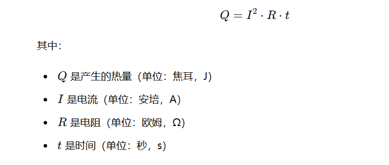
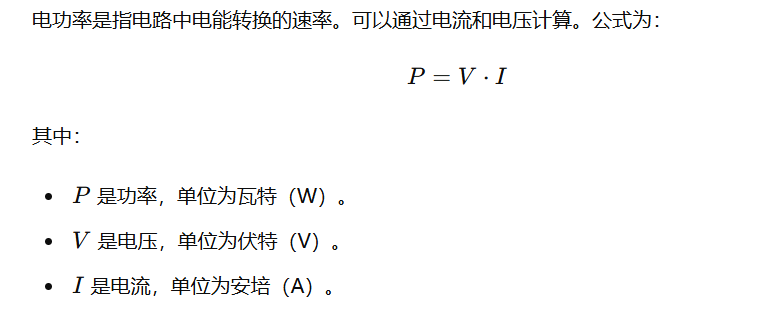
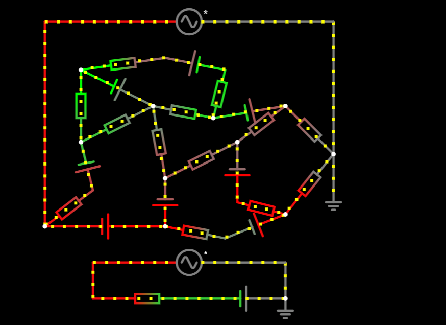
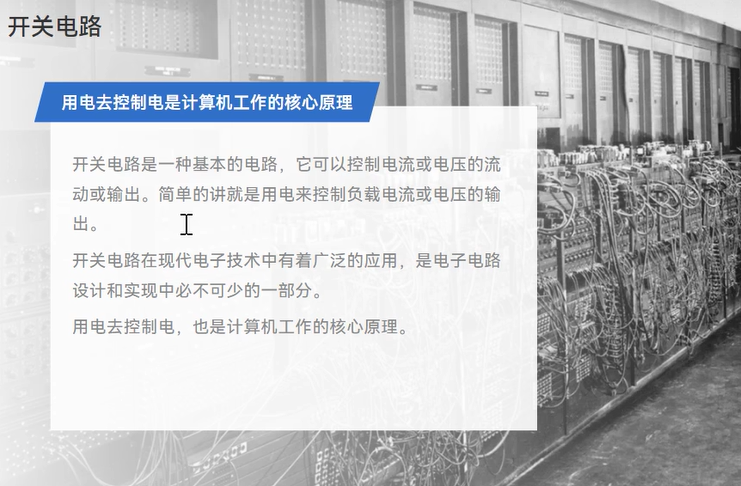
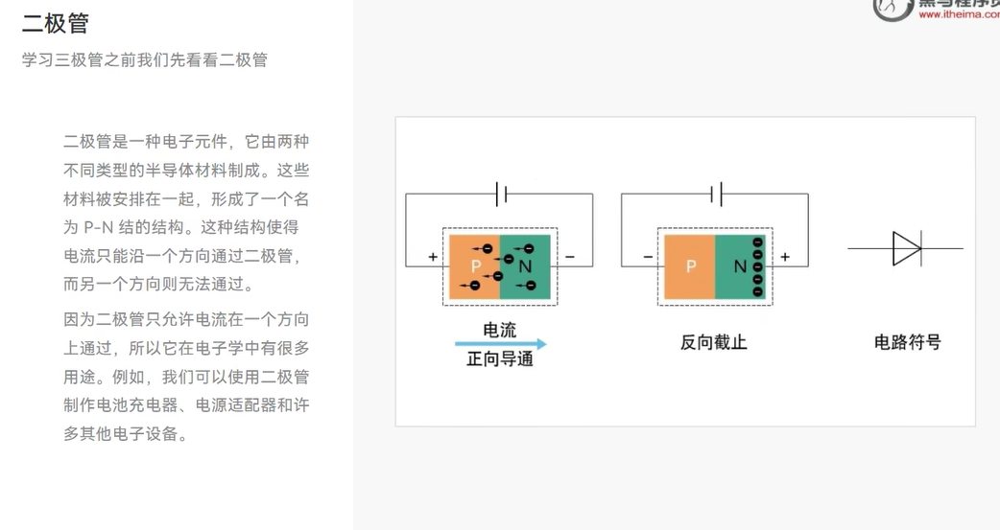

# 1.基础概念

## 1.电流

### 总结

- 实际电流方向是 **负电荷** （电子） 的移动方向
- 电学上定义的电流方向是 **正电荷** 定向移动的方向
- 电流实际上就是由于电势差使电子发生定向移动产生的

电流的换算关系: 1A=1000 毫安（mA），1mA=1000微安 （uA）1uA=1000纳安 （nA）

 

**10**ma 以下的电流人体基本上没有感觉

超过 **16**ma 的电流，会感觉到轻微的肌肉刺痛

长期超过 **80**ma 电流，可能导致肌肉麻痹

长期超过 **300ma** 的电流会导致心脏肌肉收缩异常，导致紊乱，停搏，甚至骤停。

## 2.电压

 

在电学中，电压（V）、电流（I）和功（或能量，W）之间的关系可以用以下的数学公式表示：

W = V × I × t

其中，W 是功（或能量，单位是焦耳 J），V 是电压（单位是伏特 V），I 是电流（单位是安培 A），t 是时间（单位是秒 s）。

v*1A*1s = v ,v=1 ,所有做的工等于电压，1焦耳

### 电势差的产生

电压的形成可以用一种简单易懂的方式来解释。

首先，想象一下你有一个装满水的容器（比如一个水桶）和一个空容器（比如另一个水桶），两者之间有一根管子相连，但管子上有一个阀门关闭着。这时，虽然两个容器之间有高度差（水位差），但水并没有流动，因为没有形成通路。

现在，如果你打开阀门，水就会从**高水位的容器流向低水位的容器，**直到两者水位相等为止。这是因为高水位的水有“向下”的**势能**，这种势能驱动水流动，直到势能平衡（即两个容器水位相同）。

在电路中，电压的形成也是类似的。电压可以理解为电荷的“势能差”。在电池或电源中，**正极的电荷（通常是正离子或缺少电子的地方）**和**负极的电荷（通常是负离子或多余电子的地方）**之间存在**势能差**。这个**势能差就是电压**。当电路闭合（即形成一个**通路**）时，电荷就会从**高电势（正极）流向低电势（负极）**，就像水从高水位流向低水位一样。

 

电势差（也称为电压）是电场中两个点之间的电势差异。要理解电势差是如何形成的，我们可以从以下几个方面来解释：

**1.** **电荷的存在和相互作用**

电势差的形成与电荷及其相互作用密切相关。以下是基本的电荷性质：

- **电荷的类型**：有两种类型的电荷，正电荷和负电荷。
- **库仑定律**：相同类型的电荷相互排斥，不同类型的电荷相互吸引。

**2.** **电场的产生**

当电荷存在时，会在其周围空间产生一个电场。电场的强度和方向由电场线表示，电场线从正电荷出发，指向负电荷。

**3.** **电势的概念**

电势是指在电场中某一点所具有的电势能。电势高的地方表示在那里放置一个正电荷，它会具有较高的势能；电势低的地方表示正电荷在那里具有较低的势能。

**4.** **电势差的形成**

电势差是指在电场中两点之间电势的差值。可以通过以下几个步骤来理解电势差的形成：

- **电池的作用**：以电池为例，电池的化学反应会将电子从正极推向负极，导致负极积累过量的电子（负电荷），正极缺少电子（正电荷）。
- **电场的形成**：由于电荷分布的不均匀，电池两极之间形成一个电场。电场方向从正极指向负极。
- **电势差的产生**：电池的电场使得负极的电势低于正极，从而形成电势差（电压）。电势差驱动电荷沿电路流动，从而产生电流。

**5.** **生活中的例子**

- **干电池**：干电池的化学反应产生电势差，电压通常为1.5伏特。
- **插座电压**：家庭插座中的电压通常为220伏特或110伏特，通过电网供电。

**总结**

电势差是由于电荷的分布不均匀导致电场的形成，从而在电场中的两点之间产生电势差。这一电势差推动电荷流动，形成电流，供我们日常生活中的各种电器使用。

## 3. 电阻

电阻是电子学中的一个基本概念，用来描述材料对电流流动的阻碍程度。以下是电阻的详细概念和作用：

### 1. 电阻的概念

电阻（Resistance）是物质对电流流动的阻碍作用，通常用符号 R 表示，单位是欧姆（Ω）。电阻的大小与材料的性质、形状和尺寸有关。

- **电阻率**：材料的电阻性质由其电阻率（resistivity）决定。电阻率是材料固有的特性，通常用 ρ 表示，单位是欧姆·米（Ω·m）。
- **欧姆定律**：电阻与电压和电流的关系由欧姆定律描述： V=IR，其中 V 是电压（伏特），I 是电流（安培），R是电阻。

### 2. 电阻的计算

对于一个均匀的长方体材料，其电阻 R 可以通过以下公式计算：

 其中：

- ρ是材料的电阻率，
- L是材料的长度，
- A 是材料的横截面积。

### 3. 电阻的作用

电阻在电路中有多种重要作用：

#### 3.1 限制电流

电阻限制通过电路的电流量，防止电流过大损坏电路元件。例如，在LED电路中使用电阻可以保护LED不被过大的电流烧坏。

#### 3.2 分压

电阻可以用于分压电路中，通过分压电路，可以得到所需的电压值。例如，在音频设备中，电阻用于调整音量。

#### 3.3 设定时间常数

在电容和电感电路中，电阻与电容、电感一起决定了电路的时间常数，影响电路的响应速度。例如，在滤波器和定时电路中，电阻和电容的组合决定了信号的延迟和滤波特性。

#### 3.4 能量耗散

电阻将电能转化为热能，从而在电路中耗散能量。这种特性在加热设备中应用广泛，例如电热器和电炉。

### 4. 电阻的类型

电阻器有多种类型，常见的有：

- **固定电阻**：具有固定电阻值，用于一般电路中。
- **可变电阻**：电阻值可调节，用于需要调节电阻的电路中，如音量控制器。
- **热敏电阻**：电阻值随温度变化，广泛应用于温度传感器。
- **光敏电阻**：电阻值随光强度变化，用于光感应设备。

### 总结

电阻是电路中的基本元件，起着限制电流、分压、设定时间常数和耗散能量的重要作用。了解电阻的概念和作用有助于设计和分析各种电子电路。

## 4.电容

电容是电路中的一个基本元件，用于存储电荷。以下是电容的概念、公式和单位：

### 1. 电容的概念

电容（Capacitance）是指电路元件存储电荷的能力。当电容器两极之间施加电压时，会在电容器内部积累电荷，形成电场。电容器的电容值决定了单位电压下存储的电荷量。

### 2. 电容的公式

电容 C 与电荷量 Q 和电压 V 之间的关系由以下公式描述：

其中：

- C 是电容（单位是法拉，F），
- Q 是电容器存储的电荷量（单位是库仑，C），
- V 是电容器两极之间的电压（单位是伏特，V）。

### 3. 电容的单位

电容的单位是法拉（Farad），通常用大写字母 F 表示。法拉是一个比较大的单位，通常在实际电路中常用的电容单位是微法（微法是法拉的百万分之一，记作 μF）、纳法（纳法是法拉的十亿分之一，记作 nF）和皮法（皮法是法拉的万亿分之一，记作 pF）。

### 4. 电容的计算

对于一个平行板电容器，其电容 CCC 可以通过以下公式计算：

 

其中：

- ε是介电常数，是介质相对真空的电容率；
- A 是电容器的平行板面积；
- d 是电容器两极之间的距离。

### 5. 电容的作用

电容在电路中有多种重要作用：

- **电源滤波**：电容用于平滑直流电源，减少电源中的脉动。
- **耦合和解耦**：电容用于信号耦合，将信号从一个部分传递到另一个部分，或用于解耦，分离不同电路段的信号。
- **时序电路**：电容用于定时和延迟电路，如振荡器和计时器。
- **滤波**：电容用于滤波器，过滤掉特定频率的信号。

## 5.电感

### 1. 电感的产生和单位

电感（Inductance）是一种电路元件，当电流通过导体时，会产生一个磁场，这个磁场又会产生一个电动势，阻碍电流变化，从而产生电感。

- **单位**：电感的单位是亨利（Henry，缩写为H），常见的子单位包括毫亨（mH，千分之一亨利）和微亨（μH，百万分之一亨利）。

电感 L 的定义是：

- L 是电感，以亨利（H）为单位。

- V是电压，以伏特（V）为单位。

-  是电流的变化率，以安培每秒（A/s)为单位。

### 2. 电感的工作原理

电感通过自感和互感来工作：

- **自感**：电流通过导体时，产生的磁场导致导体中的自感电动势，阻碍电流的变化。
- **互感**：电感与其他线圈或导体之间通过磁场相互耦合，也会产生电动势。

### 3. 电感与电阻的关系

电感和电阻在电路中有明显的不同：

- **电阻**：阻碍电流流动，将电能转化为热能。
- **电感**：阻碍电流变化，通过存储磁场能量。

### 4. 电感与电容的关系

电感和电容是电路中的两种基本元件，具有不同的作用：

- **电感**：稳定电流，阻碍电流变化。
- **电容**：稳定电压，存储电荷。

## 6.电路

### 1. 电路的定义

电路是由导体、电源和各种电气元件（如电阻、电容、电感、二极管、晶体管等）组成的闭合路径，电流可以在其中流动。

### 2. 电路的基本组成部分

- **电源**：提供电压和电流的源头，例如电池、发电机等。
- **导线**：连接电路元件，提供电流的流动路径。
- **负载**：消耗电能的元件，如电阻、灯泡、电动机等。
- **开关**：控制电路的开合状态，允许或阻止电流流动。

### 3. 电路的类型

- **直流电路（DC Circuit）**：电流方向恒定不变，例如使用电池供电的电路。
- **交流电路（AC Circuit）**：电流方向周期性变化，例如家庭电网中的电路。

### 4. 电路的基本原理

- **欧姆定律**：描述电压、电流和电阻之间的关系，公式为 V=IRV = IRV=IR。

- 基尔霍夫定律

  ：

  - **基尔霍夫电流定律（KCL）**：在任何节点处，流入节点的电流之和等于流出节点的电流之和。
  - **基尔霍夫电压定律（KVL）**：在任何闭合回路中，各个电压的代数和为零。

### 5. 电路的工作原理

电路工作是通过电源提供电压驱动电流在导体中流动，电流通过各个电气元件时，执行特定的功能（如加热、发光、运算等）。

### 6. 电路的功能

- **传输信号**：如音频信号、视频信号等。
- **处理信号**：如放大、滤波、调制等。
- **执行控制**：如自动开关、定时器等。
- **能量转换**：如电动机将电能转换为机械能，发热器将电能转换为热能。

### 7. 电路图

电路图是电路的图形表示，使用符号表示各个元件及其连接方式，帮助理解和设计电路。

## 7.直流电与交流电

| **属性**     | **直流电（DC）**                   | **交流电（AC）**                           |
| ------------ | ---------------------------------- | ------------------------------------------ |
| **电流方向** | 恒定不变                           | 周期性变化                                 |
| **电压**     | 恒定不变                           | 周期性变化                                 |
| **频率**     | 无频率                             | 有频率（例如50Hz或60Hz）                   |
| **电源**     | 电池、直流发电机、DC电源适配器     | 交流发电机、家庭电网、市电插座             |
| **应用**     | 电子设备、蓄电池供电设备、小型电器 | 家庭和工业供电、大功率电器、电动机、变压器 |
| **能量传输** | 长距离传输损耗较大                 | 通过变压器改变电压，长距离传输损耗小       |
| **安全性**   | 通常安全电压下较为安全             | 高压交流电危险性更高                       |
| **波形**     | 恒定的直线                         | 通常为正弦波，但也可以是方波、三角波等     |
| **变压**     | 不容易通过变压器改变电压           | 容易通过变压器改变电压                     |
| **储能方式** | 通过电池存储                       | 通常不直接存储，通过电网供电               |

## 8.弱电和强电的定义

### 弱电

**定义**：弱电通常指电压较低、电流较小、功率较小的电力系统和信号系统。主要用于传输信息和控制信号。

**特征**：

- **电压**：一般在50V以下（有些标准为36V或24V以下）。
- **电流**：通常较小，主要用于信号传输。
- **功率**：较小，通常在几十瓦以内。
- **应用**：用于通信系统、电子设备、计算机网络、安防系统、照明控制、消防报警等。

### 强电

**定义**：强电指电压较高、电流较大、功率较大的电力系统，主要用于传输和分配电能。

**特征**：

- **电压**：一般在50V以上，常见的有220V、380V，甚至更高的高压电（如10kV、110kV等）。
- **电流**：较大，用于电力传输和设备供电。
- **功率**：较大，通常在千瓦级、兆瓦级。
- **应用**：用于电力传输、配电、工业设备供电、建筑物电力系统、家用电器等。

### 弱电与强电的主要区别

| **属性**     | **弱电**                             | **强电**                               |
| ------------ | ------------------------------------ | -------------------------------------- |
| **电压**     | 一般在50V以下                        | 一般在50V以上                          |
| **电流**     | 通常较小，主要用于信号传输           | 较大，用于电力传输和设备供电           |
| **功率**     | 较小，通常在几十瓦以内               | 较大，通常在千瓦级、兆瓦级             |
| **应用**     | 通信、电子设备、计算机网络、安防系统 | 电力传输、配电、工业设备供电、家用电器 |
| **主要功能** | 传输信息和控制信号                   | 传输和分配电能                         |
| **安全性**   | 较高，一般不会引起严重电击           | 较低，容易引起电击、火灾等安全问题     |
| **传输介质** | 常用双绞线、同轴电缆、光纤           | 常用电力电缆、架空线路                 |

### 总结

- **弱电**：主要用于信息传输和控制，电压和功率较低，应用于通信、计算机网络、安防等领域。
- **强电**：主要用于电能传输和分配，电压和功率较高，应用于电力传输、配电和工业供电等领域。

## 9.家庭电路

、

# 2.常用定律

## 1.欧姆定律

## 1. 串联电路

在串联电路中，电流依次通过每个元件，电流相同但电压会分配到各个元件上。

特点

- **电流（I）**：电流在电路中处处相等。
- **电压（V）**：总电压等于各元件电压之和。
- **电阻（R）**：总电阻等于各元件电阻之和。

1

1

2. #### 并联电路

在并联电路中，各元件并排连接，电压相同但电流会分配到各个元件上。

#### 特点

- **电流（I）**：总电流等于各支路电流之和。
- **电压（V）**：总电压在各支路上相等。
- **电阻（R）**：总电阻的倒数等于各元件倒数之和。

1

1

**串联分压，并连分流**

## 2.焦耳定律

#### 焦耳定律的定义和公式

**焦耳定律**（Joule's Law）描述了电流通过导体时产生的热量。它由英国物理学家詹姆斯·普雷斯科特·焦耳在1840年提出。焦耳定律的基本内容是：

1. **定义**：当电流通过导体时，电流所产生的热量与电流的平方、导体的电阻和通过电流的时间成正比。
2. **公式**：焦耳定律的数学表达式为：

·

#### 单位转换

在焦耳定律公式中，各个物理量的单位可以进行转换。以下是一些常见的单位转换：

·

#### 应用场景

焦耳定律在许多领域有广泛的应用，以下是一些典型的应用场景：

1. **电热设备**：如电热水器、电饭煲、电炉等。这些设备通过电流通过高电阻材料产生热量来加热。
2. **电路设计**：在设计电路时，需要考虑电流通过电阻时产生的热量，以防止过热损坏元器件。
3. **保险丝和断路器**：通过焦耳定律，可以计算出在特定电流下产生的热量，从而设计出合适的保险丝和断路器来保护电路。
4. **电能表和功率计**：利用焦耳定律来测量和计算电能消耗。
5. **散热设计**：在电子设备中，焦耳定律帮助工程师计算发热量并设计相应的散热方案，以确保设备正常运行。

#### 示例计算

假设一个电路中的电阻为10Ω，电流为2A，通过电流的时间为5秒，计算电流产生的热量。

·

#### 总结

**焦耳定律**描述了电流通过导体时产生的热量，与电流的平方、导体的电阻和时间成正比。它在许多实际应用中至关重要，包括电热设备、电路设计、保险丝和断路器、电能表和散热设计等。理解并应用焦耳定律有助于优化电路和设备的性能和安全性。

#### 将焦耳转换成温度

将能量（如200焦耳）转换成温度，需要考虑具体的情境和物理条件，例如使用的物质及其特性。常见的方法是使用热容量（也称为比热容），它是将能量转换成温度变化的关键参数。

·

·

#### 总结

要将能量转换成温度，需要知道物质的质量和比热容。使用热容量公式，可以计算出特定物质在吸收一定能量后温度的变化。在本例中，200焦耳的能量使1千克水的温度升高了约0.0478摄氏度。

## 3.功率

#### 功率的定义

·

#### 电功率

·

·

#### 根据功率计算电流

根据功率计算电流是一个常见的问题，特别是在电气工程和家庭电路设计中。要计算电流，需要知道设备的功率（通常以瓦特为单位）和工作电压（通常以伏特为单位）。使用以下公式可以计算出电流：

·

#### 计算实例

·

#### 例2：三相交流电

·

·

# 3.常用的电阻元器件

## 1.电阻器

## 2.电容器

**容抗计算公式**

利用电容对替代电阻进行分压，电容分压是没有损耗得，电阻分压会产生热

作用

## 3.电感器

详细见上方基础概念中 电感定义

## 4.保险丝和熔断丝

保险丝和熔断丝是电路保护设备，用于防止过电流对电路和设备造成损坏。它们的工作原理基于过电流产生的热量导致熔断元件熔化，从而断开电路。

#### 保险丝和熔断丝的原理

**保险丝**（Fuse）和**熔断丝**（Fuse Wire）基本原理是相同的：

1. **正常工作状态**：当电流通过保险丝或熔断丝时，由于其材料的电阻，会产生一定的热量。但在正常电流范围内，这些热量不足以使熔断丝熔化。
2. **过电流状态**：当电流超过额定值时，产生的热量会迅速增加。由于保险丝或熔断丝的材料具有较低的熔点，过大的热量会使其迅速熔化，从而断开电路，保护设备。

#### 计算熔断电流

熔断电流的计算涉及多个因素，包括熔断丝的材料、电阻、长度和横截面积。以下是计算过程的简化步骤和公式：

##### 主要影响因素

1. **材料的电阻率（ρ）**：不同材料的电阻率不同，常用材料有铅、锡、铜、银等。
2. **横截面积（A）**：保险丝或熔断丝的横截面积，单位为平方毫米（mm²）。
3. **长度（L）**：保险丝或熔断丝的长度，单位为毫米（mm）。
4. **熔点温度（T_m）**：材料的熔点温度，单位为摄氏度（°C）。

·

·

·

#### 总结

1. **保险丝和熔断丝**通过过电流产生的热量导致熔化，从而保护电路。
2. **熔断电流**的计算涉及材料的电阻率、横截面积、长度和熔点温度。
3. **实际应用**中，需要根据具体材料和设计要求进行详细计算。

这些基本原理和计算方法有助于设计和选择合适的保险丝和熔断丝。

## 5.接插件

## 6.蜂鸣器

声音频率，或称为声波的频率，是指声波在一秒钟内振动的次数，通常以赫兹（Hz）为单位来表示。频率决定了声音的音调高低，即声音的高低程度。频率越高，音调就越高；频率越低，音调就越低。

对于人耳来说，能够听到的声音频率范围是有限的。这个范围大致是从20赫兹（Hz）到20,000赫兹（Hz），这被称为人耳的音频范围或可听声范围。

- 低于20Hz的声音被称为次声波，这些声音频率太低，人耳无法听到，但某些动物（如大象）却能够感知到。
- 高于20,000Hz的声音被称为超声波，这些声音频率太高，同样超出了人耳的听觉范围。超声波在医疗、探测和通信等领域有广泛的应用。

需要注意的是，随着年龄的增长，人的听力会逐渐下降，特别是在高频段的听力。因此，老年人可能会发现难以听到高音调的声音。此外，长时间暴露于噪音环境中也会对听力造成损害，导致听力下降或丧失。

# 4.万用表

## 概述：

**万用表**（Multimeter），又称为多用表，是一种测量电压、电流和电阻等电参数的便携式仪表。它结合了电压表、电流表和欧姆表的功能，可以用于电工、电子和家庭维修等领域。

### 万用表的作用

1. **测量直流电压（DCV）**：检查电池、电源和直流电路中的电压。
2. **测量交流电压（ACV）**：检查家庭电路和交流设备中的电压。
3. **测量直流电流（DCA）**：检查直流电路中的电流强度。
4. **测量交流电流（ACA）**：检查交流电路中的电流强度（某些万用表）。
5. **测量电阻（Ω）**：检查电路中电阻器、电线和电器的电阻值。
6. **二极管测试**：检查二极管的正向和反向电阻，以确定其工作状态。
7. **电容测量**：检查电容器的电容量（某些高级万用表）。
8. **温度测量**：使用温度探针测量温度（某些高级万用表）。
9. **连续性测试**：检查电路的连续性，判断是否有断路。

### 万用表的分类

万用表可以根据其显示方式、功能和用途进行分类：

#### 根据显示方式分类

1. **模拟万用表**：
   - **特点**：使用指针和刻度盘显示测量值。
   - **优点**：反应速度快，适合观察变化的电参数。
   - **缺点**：读数不够直观和精确，受环境影响较大。
2. **数字万用表**：
   - **特点**：使用数字显示屏显示测量值。
   - **优点**：读数直观、精确，功能丰富，操作简单。
   - **缺点**：响应速度相对较慢，价格较高。

#### 根据功能和用途分类

1. **基础型万用表**：
   - **特点**：功能简单，适用于基本的电压、电流和电阻测量。
   - **用途**：家庭维修、初学者使用。
2. **专业型万用表**：
   - **特点**：功能丰富，支持更多电参数测量，如电容、频率、温度等。
   - **用途**：专业电工、电子工程师使用。
3. **工业型万用表**：
   - **特点**：高精度、高耐用性，能在恶劣环境下工作，具有防水、防尘、防摔功能。
   - **用途**：工业环境、现场维修和维护。

### 总结

万用表是一种多功能的电参数测量仪器，广泛应用于电工、电子和家庭维修领域。根据显示方式，万用表分为模拟和数字两种。根据功能和用途，万用表可以分为基础型、专业型和工业型。了解万用表的分类和功能，有助于选择合适的万用表以满足特定需求。

## 1.测量电阻

**步骤：**

1. 预估电阻阻值
2. 调整到合适的欧姆挡位
3. 把万用表的笔两端接到电阻两端
4. 读取万用表显示的数字

注意： 测量是测量底部不要是导体

**测量10k欧的电助**

如果将阻值挡位调整到200欧 低于实际电阻阻值则可能测不出结果，挡位太大会失去精度

## 2.测量电压

步骤：

1. 预估测试的电压
2. 调整到合适的电压挡位（**注意区分直流和交流**）
3. 把万用表的笔两端接到供电电源的两端
4. 读取万用表显示的数字

使用万用表测量电压时，交流电（AC）和直流电（DC）之间存在明显的区别。以下是关于这两种电压类型在测量时的主要区别：

1. 电流和电压的特性

- **直流电压（DC）**：直流电压具有恒定的电位差，其电压值始终保持不变。在电路中，直流电流是电子在一个方向上流动的电流。
- **交流电压（AC）**：交流电压则是随时间周期性地变化，电压的正负极性也会周期性地反转。交流电流是周期性地改变方向的电流，其大小和方向都随时间变化。

2. 测量时的注意事项

- **直流电压（DC）**：
- 在测量直流电压时，不需要特别注意电压的极性变化，因为直流电压的方向和大小都是恒定的。
- 但需要注意连接红黑表笔的正确性。红表笔应连接到电路的正极，黑表笔连接到电路的负极。如果连接反了，万用表的读数会是负数，并且需要加上负号才是正确的电压值。
- **交流电压（AC）**：
- 由于交流电压的极性和大小都随时间变化，因此在测量时不需要特别关注红黑表笔的连接顺序。
- 万用表在测量交流电压时，会自动识别并显示交流电压的有效值（RMS值），这是交流电压的一个常用表示方法，它表示交流电压产生的热量与等效直流电压产生的热量相同。

3. 万用表的选择和设置

- **直流电压（DC）**：在测量直流电压时，需要确保万用表设置为直流电压测量模式（通常标记为“DCV”或类似的符号）。
- **交流电压（AC）**：在测量交流电压时，需要确保万用表设置为交流电压测量模式（通常标记为“ACV”或类似的符号）。

4. 总结

- 使用万用表测量电压时，交流电和直流电的主要区别在于其电流和电压的特性、测量时的注意事项以及万用表的选择和设置。正确理解和应用这些区别，可以确保准确、安全地进行电压测量。

## 3.测量电流

**步骤：** 

1. 预估测试的电流

1. 调整到合适的电流挡位（**注意区分直流电，交流电**）
2. 把万用表的笔两端串联到电路中
3. 读取万用表显示的数字

万用表测试直流电（DC）和交流电（AC）时，存在明显的区别。以下是关于这两者的详细区别：

一、测试方法

1. 直流电（DC）测试：

- 直流电的特点是电流方向始终保持不变，从正极流向负极。
- 使用万用表测试直流电时，需要将万用表设置到直流电压（DCV）或直流电流（DCA）档位，并确保红表笔连接到电路的正极，黑表笔连接到电路的负极。
- 读取万用表上的数值，即为直流电压或直流电流的大小。

1. 交流电（AC）测试：

- 交流电的特点是电流方向随时间周期性变化，正负极不断切换。
- 使用万用表测试交流电时，需要将万用表设置到交流电压（ACV）或交流电流（ACA）档位。
- 由于交流电没有固定的极性，因此红表笔和黑表笔可以随意连接到电路的任意两端。
- 读取万用表上的数值，即为交流电压或交流电流的有效值（RMS值）。

二、区别概述

| 类别           | 直流电（DC）                                  | 交流电（AC）                                  |
| -------------- | --------------------------------------------- | --------------------------------------------- |
| **定义**       | 电流方向不变的电流                            | 电流方向不断变化的电流                        |
| **电流方向**   | 始终一个方向                                  | 正负交替变化                                  |
| **电压特点**   | 电压始终为正值或负值，稳定不变                | 电压可以为正或负，大小和方向都在变化          |
| **万用表设置** |                                               |                                               |
| 选择档位       | 选择直流电流档位（如：DCA 10mA, 100mA, 1A等） | 选择交流电流档位（如：ACA 10mA, 100mA, 1A等） |
| 量程选择       | 根据预期电流大小选择合适的量程                | 同上                                          |
| 接线方式       | 红色表笔连接电路正极，黑色表笔连接电路负极    | 同上，无需区分正负极                          |
| **读数**       | 显示稳定的电流值                              | 显示变化的电流值（有效值或峰值）              |
| **注意事项**   | 确保电路断开，再将万用表串联到电路中          | 同上                                          |
| **应用场景**   | 常见于电池、电子设备、直流电源等              | 常见于家庭电路、工业设备、电网等              |

总结：万用表测试直流电和交流电时，在测试方法、方向性、频率、波形以及应用场景等方面存在明显的区别。在实际应用中，需要根据被测电路的类型和特点选择合适的测试方法和档位。

## 4.万用表测试电容

**注意测量电容先给电容放电**

万用表测试电容的步骤如下，这些步骤旨在确保测量的准确性和安全性：

1. **选择合适的万用表**：

- 确保万用表具有电容测量功能。某些数字万用表具有专门的电容测量档位，量程可能包括2000p、20n、200n、2μ和20μ等。
- 如果万用表没有电容测量档位，可以考虑使用电阻档或其他方法来间接测量电容。

1. **准备电容器**：

- 确保电容器已经放电，以防止测量过程中产生过高的电压。
- 检查电容器的标识，了解其容量和耐压值。

1. **连接万用表和电容器**：

- 将万用表的测试引线分别与电容器的两个极端连接。如果电容器有极性（如电解电容），请确保正负极引线连接到正确的位置。
- 在连接时，如果您不确定电容器的极性，请随意连接。但对于极性电容器，正确的极性连接是必要的。

1. **选择适当的测量范围**：

- 根据电容器的容量大小，选择万用表上适当的测量范围。对于较小的电容，选择较小的范围以得到更精确的测量结果。
- 例如，2000p档适用于测量小于2000pF的电容；20μ档适用于测量2μF至20μF之间的电容。

1. **读取和记录测量结果**：

- 打开万用表的电源，并观察其显示屏。等待几秒钟，直到测量读数稳定下来。
- 读取并记录显示屏上的数值。这个数值即为电容器的容量。

1. **注意事项**：

- 在测量电容时，应将电容器从电路中拆除，避免其他元器件的影响，确保测量的准确性。
- 在测量大电容值时，要注意安全，避免因接触高压而受伤。
- 使用万用表测量电容时，要选择适当的测量档位，避免因档位选择不当而损坏仪器。
- 定期校准万用表，确保测量结果的准确性。
- 在测量结束后，及时关闭万用表的电源，并将测试引线拔出，以免因接触而引发安全事故。

总结：使用万用表测试电容时，需要选择合适的万用表、准备电容器、正确连接万用表和电容器、选择适当的测量范围、读取和记录测量结果，并注意相关的安全事项。这些步骤将帮助您准确、安全地测量电容器的容量。

# 3.仿真工具circuit js

## 1.电阻的串并连

并联3个电阻，相当于有3条通路同时流水，多条阻力大的通路，最终流水量也比一条流的多

**串联电阻**

**当有一个没有电阻的通路和有电阻的通路并联时，电流将不会走有电阻的通路**

## 2.电容器

电容就相当于一个存储电子的容器

 

电容电势差与电源相等电子将不再移动

电容放电

## 3.电感器

磁场变化产生电流

## 4.LRC震荡电路

L 是电感， R电阻， C电容

## 5.分压器

**串联分压。并连分流**

**基尔霍夫定理 能更好的理解并联分流**

## 6.可变电阻

通过调节阻值，改变电流电压大小

## 7.戴维宁定理

**任何复杂的电路都可以等效为一个电压源和一个电阻器组成**

 

戴维宁定理（也称为戴维南定理或Thevenin's theorem）是一个重要的电学定理，主要用于简化和分析线性电路。以下是关于戴维宁定理的详细解释：

1. **定义与提出者**：

- 戴维宁定理是由法国科学家莱昂·夏尔·戴维南（Léon     Charles Thévenin）于1883年提出的一个电学定理。
- 由于早在1853年，亥姆霍兹（Helmholtz）也提出过类似的定理，所以该定理有时也被称为亥姆霍兹-戴维南定理。

1. **定理内容**：

- 一个含有独立电压源、独立电流源及电阻的线性网络的两端，就其外部形态而言，在电性上可以用一个独立电压源V和一个松弛二端网络的串联电阻组合来等效。
- 在单频交流系统中，此定理不仅适用于电阻，也适用于广义的阻抗。

1. **等效电路**：

- 对于含独立源、线性电阻和线性受控源的单口网络（二端网络），都可以用一个电压源与电阻相串联的单口网络（二端网络）来等效。
- 这个电压源的电压，就是此单口网络（二端网络）的开路电压（uoc）。
- 这个串联电阻就是从此单口网络（二端网络）两端看进去，当网络内部所有独立源均置零以后的等效电阻（Ro）。

1. **数学表达**：

- 当单口网络的端口电压和电流采用关联参考方向时，其端口电压电流关系方程可表为：U     = R0i + uoc。
- 其中，U是端口电压，i是端口电流，R0是戴维南等效电阻，uoc是开路电压。

1. **应用**：

- 戴维宁定理在电路分析中有广泛的应用，尤其是在分析多电源多回路的复杂直流电路时。
- 通过将复杂电路简化为一个等效的电压源和电阻的组合，可以极大地简化分析和计算过程。

1. **与其他定理的关系**：

- 戴维宁定理和诺顿定理（Norton's     theorem）是最常用的电路简化方法，两者统称为等效电源定理或等效发电机定理。
- 诺顿定理指出，含独立源的线性电阻单口网络N，就端口特性而言，可以等效为一个电流源和电阻的并联。

通过以上解释，可以看出戴维宁定理在电路分析和设计中具有重要的作用和价值。

## 8.诺顿定理

**任何复杂的电路可以等效为一个电流源和一个电阻器组成**

诺顿定理（Norton's theorem）是电路理论中的一个重要定理，主要用于简化和分析线性电路。以下是关于诺顿定理的详细解释：

定义

诺顿定理指的是一个由电压源及电阻所组成的具有两个端点的电路系统，都可以在电路上等效于由一个理想电流源I与一个电阻R并联的电路。

主要内容

1. **等效电路**：

- 一个含有独立源的线性电阻单口网络N，从端口特性来看，可以等效为一个电流源和电阻的并联。
- 电流源的电流（Isc）等于单口网络从外部短路时的端口电流。
- 电阻R0是单口网络内全部独立源为零值时所得网络N0的等效电阻。

1. **应用范围**：

- 诺顿定理不仅适用于直流电路，也适用于单频的交流系统，此时电阻R可以扩展为广义的阻抗。

1. **与戴维宁定理的关系**：

- 诺顿定理是戴维宁定理的一个延伸，两者互为对偶定理。
- 戴维宁定理将一个线性二端网络等效为一个电压源和电阻的串联，而诺顿定理则等效为一个电流源和电阻的并联。

1. **提出者**：

- 诺顿定理于1926年由两人分别提出，分别是西门子公司研究员汉斯·梅耶尔（1895年-1980年）及贝尔实验室工程师爱德华·劳笠·诺顿（1898-1983）。

1. **作用**：

- 诺顿定理在电路理论中具有重要的地位，可以用于分析各种电路，从而计算和预测电路性质，如电平、频率响应、幅度等。
- 它能有效简化电路的求解过程，提高求解效率和准确度，是电路理论中的重要工具。

结论

诺顿定理是电路理论中的一个基本定理，通过将一个复杂的线性电路简化为一个等效的电流源和电阻的并联电路，大大简化了电路的分析和计算过程。它与戴维宁定理互为对偶，共同构成了电路分析的重要基础。

## 9.基尔霍夫定理

**对于电路中任一节点。流入节点的电流之和必定等于该流出节点之和**

 

**任意节点** **流入电流**=*流出电流A+*流出电流**B**

基尔霍夫定理，也称为基尔霍夫定律（Kirchhoff laws），是电路中电压和电流所遵循的基本规律，是分析和计算较为复杂电路的基础。该定律由德国物理学家G.R.基尔霍夫（Gustav Robert Kirchhoff）于1845年提出。基尔霍夫定律包括两个主要部分：基尔霍夫电流定律（KCL）和基尔霍夫电压定律（KVL）。

基尔霍夫电流定律（KCL）

**定义**：

基尔霍夫电流定律，又称节点电流定律，简记为KCL。它表述的是对于电路中任一节点，在任一时刻，流入该节点的电流之和等于流出该节点的电流之和。

**公式**：

基尔霍夫电流定律的数学表达式为 ∑I(流入) = ∑I(流出)，或 ∑I = 0。其中，I表示电流，求和符号∑表示对节点所有支路电流的代数和。流出节点的电流取正号，流入节点的电流取负号。

**物理背景**：

基尔霍夫电流定律的物理背景是电荷守恒公理，即在闭合电路中，**电荷的总量保持不变**。

基尔霍夫电压定律（KVL）

**定义**：

基尔霍夫电压定律，又称回路电压定律，简记为KVL。它表述的是对于电路中任一闭合回路，在任一时刻，沿该回路的所有支路电压降的代数和为零。

**公式**：

基尔霍夫电压定律的数学表达式为 ∑V = 0。其中，V表示电压降，求和符号∑表示对回路所有支路电压降的代数和。正方向绕行回路时，电压降方向与绕行方向一致时取正号，反之取负号。

**物理背景**：

基尔霍夫电压定律的物理背景是能量守恒公理，即在电路中，能量的总和保持不变。

应用范围

基尔霍夫定律既可以用于直流电路的分析，也可以用于交流电路的分析，还可以用于含有电子元件的非线性电路的分析。该定律在电路理论中占有重要地位，是电路分析和计算的重要工具。

总结

基尔霍夫定理（或基尔霍夫定律）是电路理论中的基础定律，包括基尔霍夫电流定律（KCL）和基尔霍夫电压定律（KVL）。这两个定律分别描述了电路中电流和电压的基本规律，为复杂电路的分析和计算提供了有力的工具。通过熟练掌握和应用这两个定律，可以更加准确地分析和设计电路。

## 10.毫安时，和毫瓦时

# 4.开关电路

## 1.继电器

通过继电器实现控制开关电灯

## 2.三极管入门

### 1.二极管

### 2.三极管工作原理

#### 三极管的应用案例

## 3.MOS管

### MOSFET 的工作原理

将一块纯硅中，两个肩膀的位置进行N型掺杂，其他位置进行P型掺杂

扩散作用会在N和P之间形成耗尽层

这时候往两个N区域接一个电池和灯泡形成回路

负极P往N是可以导通的，正极是N往P不能导通，耗尽层会加宽，阻止电子移动

电池反过来也是同理

正极N往P不导通，耗尽层扩大

负极P往N导通

想要实现导通需要一点电场的帮助

使用2块金属板，中间夹着一块绝缘层，将2层金属板连接到电源的正负极

在电源的作用下，大量的电子会被正极吸引离开上层金属板，聚集到下层金属板，

这时候上层金属板显正电，下层金属板成负电性，这样在绝缘层中就会形成一个从上到下的指向性电场

**如果将这个结构装到两个N区域的中间**

上层金属板，

P区域充当下层金属板

将电源导通，就会有大量的电子被吸引到这块区域，填充空穴的同时，还会多出很多自由电子

当达成平衡以后，在这片区域的下方也会因为扩散的作用形成新的耗尽层。

此时就能发现这块区域与N区是一模一样的，相当于将2个N区联通，**此时电路就能被导通了**

#### **N沟道**

所有就得到了一个可以用电压控制的开关

当我们给中间的电极施加正向偏压，当电压高于**阈值电压**（能让N沟道产生的电压）时，MOSFET可以导通

当电压低于阈值电压时，不导通

### 最基本的MOSFET结构

### NMOS

### PMOS

将P N掺杂调换位置反过来,珊极的正负调换，给G级施加反向偏压

**PMOS 的箭头指向MOS内**

**NMOS 的箭头指向MOS外**

### CMOS

将PMOS和NMOS 的漏极连接起来 就得到了一个CMOS

把两个G极连接起来作为输入端A，两个D极的连接处拉出来作为输出端B

PMOS 的S极接入供电电压 VDD

NMOS的S极接入接地电压 VSS

就得到了一个非门

当A输入正向偏压，电压高于阈值时PMOS 不导通，NMOS 导通，相当于输出端B接到了接地电压VSS。输出的就是相对低压

当A输入的电压低于阈值，NMOS不导通，PMOS导通，相当于B直接接到了高压VDD上

规定相对高压时1 相对低压是0

给A输入0 B输出1

输入1 输出0

## 4.MOS管与三级管区别

MOS管（Metal-Oxide-Semiconductor Field-Effect Transistor，金属氧化物半导体场效应晶体管）和三级管（Bipolar Junction Transistor，双极型结晶体管）是两种常见的半导体器件，它们在工作原理、结构、性能和应用方面都有显著的区别。以下表格详细比较了MOS管和三级管的区别：

| 项目             | MOS管 (MOSFET)                            | 三级管 (BJT)                                  |
| ---------------- | ----------------------------------------- | --------------------------------------------- |
| **工作原理**     | 电场效应控制通道电导                      | 电流控制电流                                  |
| **控制信号**     | 电压控制                                  | 电流控制                                      |
| **输入阻抗**     | 高                                        | 低                                            |
| **输出阻抗**     | 低                                        | 高                                            |
| **开关速度**     | 快（纳秒级）                              | 较慢（微秒级）                                |
| **功耗**         | 低（主要取决于开关频率）                  | 较高（由于基极电流）                          |
| **放大倍数**     | 由栅极电压控制，放大倍数较高              | 由电流增益 (hFE) 决定                         |
| **导通电阻**     | 低（特别是功率MOSFET）                    | 相对较高                                      |
| **噪声性能**     | 低                                        | 相对较高                                      |
| **温度稳定性**   | 相对较高                                  | 相对较低                                      |
| **结构**         | 三层结构：栅极（G）、漏极（D）、源极（S） | 三层结构：基极（B）、集电极（C）、发射极（E） |
| **类型**         | N型和P型                                  | NPN型和PNP型                                  |
| **典型应用**     | 数字电路、开关电源、放大器、高速开关电路  | 模拟放大器、电流放大、低频信号处理            |
| **制造成本**     | 相对较高                                  | 相对较低                                      |
| **热稳定性**     | 较好                                      | 较差                                          |
| **电流驱动能力** | 强（特别是功率MOSFET）                    | 较弱                                          |

### 详细比较

#### 工作原理

- **MOS管**：通过栅极电压来控制漏源之间的电流，属于电压控制器件。
- **三级管**：通过基极电流来控制集电极和发射极之间的电流，属于电流控制器件。

#### 输入阻抗

- **MOS管**：输入阻抗很高，几乎没有栅极电流，因此对前级电路的负载影响很小。
- **三级管**：输入阻抗较低，需要基极电流，前级电路需要提供额外的电流驱动。

#### 开关速度

- **MOS管**：开关速度非常快，适用于高频和高速开关应用。
- **三级管**：开关速度相对较慢，适用于低频和模拟信号放大。

#### 功耗

- **MOS管**：由于栅极电流几乎为零，静态功耗低；动态功耗取决于开关频率。
- **三级管**：基极电流存在，因此静态功耗较高。

#### 放大特性

- **MOS管**：放大倍数由栅极电压控制，具有线性度高和放大倍数大的优点。
- **三级管**：放大倍数由电流增益 决定，适用于模拟信号放大。

#### 应用领域

- **MOS管**：广泛用于数字电路、高速开关电路、功率放大器和开关电源等领域。
- **三级管**：广泛用于模拟放大器、低频信号处理和电流放大应用。

### 总结

MOS管和三级管在不同的应用场景中各有优势。MOS管以其高输入阻抗、快速开关速度和低功耗，特别适用于数字电路和高速开关应用。而三级管以其高电流放大能力和较低的制造成本，广泛用于模拟电路和低频放大应用。根据具体应用需求选择合适的器件，可以最大化电路性能和效率。

# 5.模拟集成电路

## 1.NE555

**数据手册**

## 2.比较器(运放) 运算放大器

当上方电压大于下方电压时，输出 1，否则输出 0

## 3.反向门（非门）

## 4.或非门

## 5.双稳态触发器

# 6.PCB概念与入门

## 什么是PCB

## PCB的优点

## 现代的 PCB 结构

