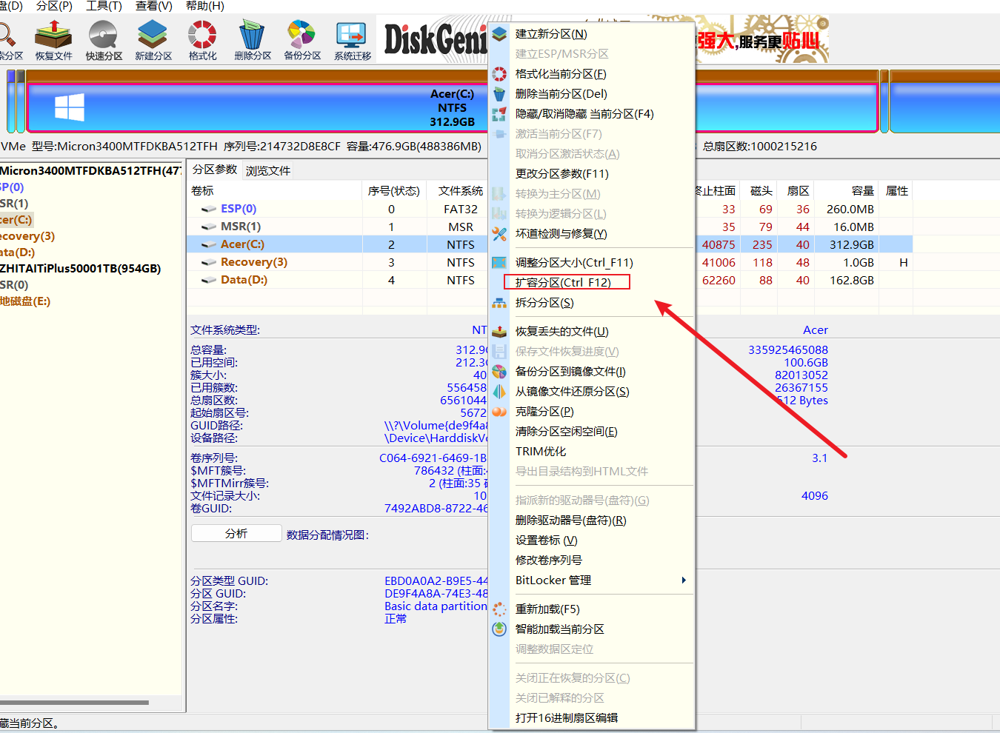
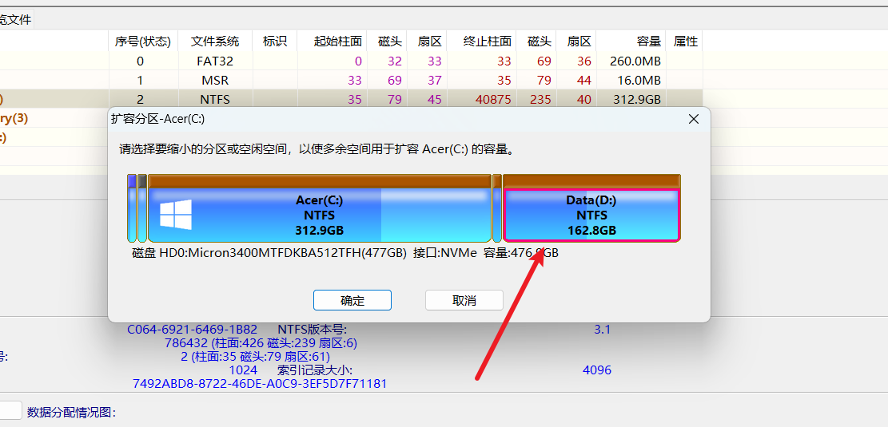
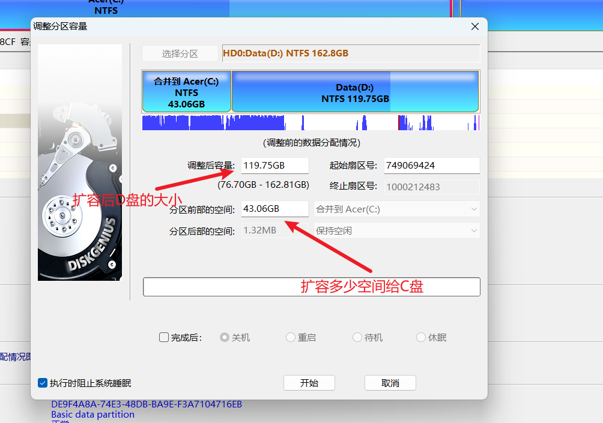
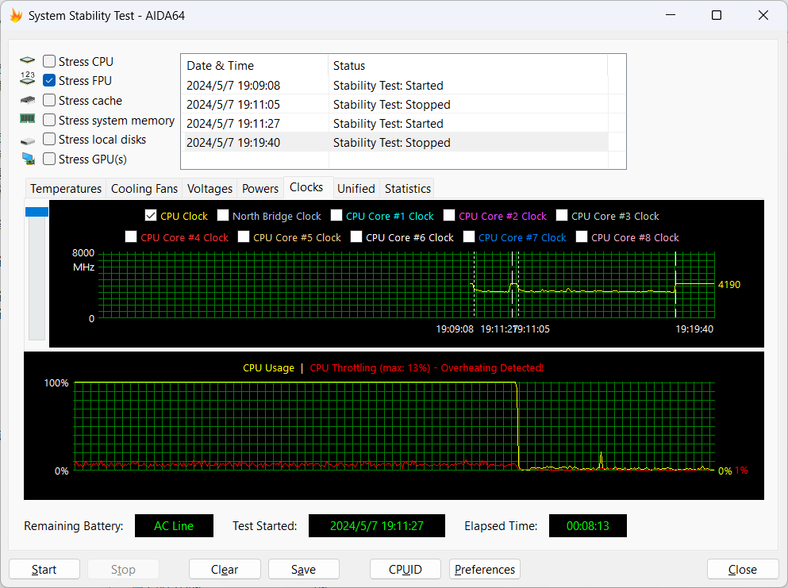

#  1. DiskGenius 磁盘管理工具


## 1. 对将C扩容


1. 右键C盘 选择扩容分区




2. 选择将哪个盘的容量扩容到C盘，这边选择D盘




3. 选择好需要扩容多大的空间给到C盘




4. 等待关机重启后自动完成扩容


# 2. python 将 .py 文件打包成exe


1. 使用 pip命令安装   pyinstaller    

```shell
pip install pyinstaller
```

2. 将对应的 .py 文件打包成 exe   【这样构建会不仅有exe 文件 还会有一个 _internal  目录】

```shell
pyinstall your_script.py 
```

打包完成后会在同级目录下生成一个 dist 目录 ，构造的exe就在里面


使用这个命令构建的 exe 文件 将是只有一个exe 不会有 _internal 目录

```shell
pyinstall --onefile your_script.py 
简写 pyinstall -F your_script.py
```


# 3. AIDA64 工具


1. System Stability Test 工具使用





1. **stress CPU 作用**

AIDA64中的Stress CPU测试主要作用是评估**CPU进行高负荷整数运算**时的系统稳定性。在进行Stress CPU测试时，AIDA64将CPU置于高负荷的整数运算场景中，并通过监测CPU温度、频率等系统状态来评估系统的稳定性。

这个测试的目的是为了模拟CPU在日常使用中可能会遇到的各种高负荷场景，如运行大型游戏、处理复杂的数据运算等。通过Stress CPU测试，用户可以了解CPU在这些高负荷场景下的表现，以及系统是否能够稳定运行。

在测试过程中，AIDA64会监测CPU的温度、频率、电压等关键指标，以评估CPU的稳定性和性能。如果CPU能够在测试过程中保持稳定运行，并且没有出现过热、降频等问题，那么就可以认为系统具有较高的稳定性。

需要注意的是，Stress CPU测试是一种极限测试，会对CPU产生较大的负荷。因此，在进行测试时，需要确保系统具有良好的散热性能，以避免因过热而导致的系统崩溃或硬件损坏。同时，也需要注意测试时间不宜过长，以免对CPU造成过度磨损。


2. **stress fpu 的作用**

AIDA64中的单烤stress FPU主要用于测试**CPU在高负荷浮点运算**（实数运算）时的系统稳定性。浮点运算的负荷通常高于整数运算负荷，因此这项测试能够更深入地考察系统的稳定性。

在进行stress FPU测试时，AIDA64将CPU置于高负荷的浮点运算场景中，并通过监测CPU温度、频率等系统状态来评估系统在极端情况下的稳定性。如果在短时间内（如5分钟内）不出现降频或过热现象，那么可以认为系统的稳定性良好。

请注意，进行stress FPU测试时，CPU的负荷会非常高，因此请确保您的系统具有足够的散热能力以避免过热。


3. **stress cache** 

AIDA64的Stress Cache功能主要用于对**CPU缓存**进行满载压力测试。通过模拟高负载场景，这个测试能够评估CPU缓存的稳定性和性能。

具体来说，Stress Cache测试会将大量的数据反复读取和写入到CPU缓存中，以观察缓存的响应速度、错误率以及是否出现其他问题。如果CPU缓存能够在测试中保持稳定，并且没有出现错误或性能下降，那么就可以认为CPU缓存的性能良好。

这个测试对于评估系统的整体性能非常重要，因为CPU缓存是计算机系统中非常重要的组成部分，它对于提高数据访问速度和降低延迟有着至关重要的作用。如果CPU缓存存在问题，那么整个系统的性能都会受到影响。

需要注意的是，在进行Stress Cache测试时，需要确保系统处于稳定状态，并且关闭其他可能会影响测试结果的程序或进程。同时，测试时间也不宜过长，以免对系统造成不必要的负担。


4. stress system memory

**stress system memory的作用是进行内存稳定性测试**。具体来说，它通过给内存加压，即模拟高负载的内存使用情况，来检测内存的稳定性和性能。这种测试可以帮助用户了解内存在长时间高负荷下的表现，以及是否会出现错误、崩溃或其他问题。如果内存能够在测试中保持稳定运行，并且没有出现错误，那么就可以认为内存的性能良好。

在进行stress system memory测试时，通常会设置一个运行时间，例如30分钟或更长时间。如果在此期间没有出现蓝屏或其他异常情况，那么就可以认为内存的稳定性较好。

请注意，这种测试会对系统造成一定的压力，因此在进行测试之前，请确保系统已经备份重要数据，并且关闭不必要的程序或进程，以避免对系统造成不必要的损害。


5. stress local disks

**Stress local disks（本地磁盘压力测试）在AIDA64中主要用于评估硬盘在高负载下的性能和稳定性**。这个测试会模拟大量的磁盘读写操作，以检查硬盘在持续高负载下的表现。

具体来说，Stress local disks测试会监测硬盘的读写速度、响应时间、错误率等关键指标，以评估硬盘的性能和稳定性。如果硬盘在测试中表现出色，没有出现错误或性能下降，那么就可以认为其具有良好的性能和稳定性。

通过进行这个测试，用户可以了解硬盘在长时间高负载下的性能表现，以及是否需要进行升级或更换。同时，也可以帮助用户诊断和解决与硬盘相关的性能问题。

请注意，进行Stress local disks**测试可能会对硬盘造成一定的磨损**，因此建议仅在必要时进行此测试，并确保在测试前已经备份了重要数据。


6. stress GPU

**Stress GPU在AIDA64中主要用于对显卡进行满载压力测试**。这个测试通过模拟高负载的图形渲染场景，来评估显卡的稳定性和性能。

具体来说，Stress GPU测试会模拟图形、视频渲染、特效、数据运算、游戏等场景，让显卡在高负荷下运行，并监测其温度、频率、显存使用量等关键指标。如果显卡能够在测试中保持稳定运行，并且没有出现过热、降频、崩溃等问题，那么就可以认为显卡的性能和稳定性良好。

这个测试对于评估显卡的性能和稳定性非常重要，尤其是在进行游戏、图形设计等需要高性能显卡的应用场景中。通过Stress GPU测试，用户可以了解显卡在高负载下的表现，以及是否需要进行升级或更换。

请注意，由于显卡的性能和稳定性受到多种因素的影响，因此在进行Stress GPU测试时，建议确保系统散热良好、电源供应稳定，并在必要时进行散热改造或电源升级。同时，测试时间也不宜过长，以免对显卡造成过度磨损。


#  注册表regedit 


注册表（Registry）的文件结构和对应描述作用，以列表的方式展示并重点使用加粗：

**注册表文件结构**

1. HKEY_CLASSES_ROOT (HKCR)

   - **描述**：用于存储文件关联和COM类信息。
   - **作用**：当用户双击一个文件时，系统会根据此键来确定用于打开文件的应用程序。

2. HKEY_CURRENT_USER (HKCU)

   - **描述**：包含当前登录用户的配置信息。
   - **作用**：包括用户特定的桌面设置、应用程序设置、网络连接和打印机设置等。

3. HKEY_LOCAL_MACHINE (HKLM)

   - **描述**：包含计算机硬件和操作系统信息。
   - **作用**：包括安装的硬件驱动程序、系统配置、安全设置、以及安装的软件信息等。

4. HKEY_USERS

   - **描述**：包含系统上所有用户的配置信息。
   - **作用**：每个用户都有一个子键（SID），存储了用户的个人设置。

5. HKEY_CURRENT_CONFIG

   - **描述**：包含当前硬件配置的信息**。
   - **作用**：这个键是HKEY_LOCAL_MACHINE\SYSTEM\CurrentControlSet\Hardware Profiles\Current的别名，用于存储当前硬件配置信息。

   

**注册表的主要作用**

1. 系统设置存储

   存储操作系统和硬件的各种设置和选项。

   - **作用**：如用户账户、网络设置、安全设置、系统启动项等。通过修改注册表可以改变操作系统的行为。

2. 应用程序配置

   存储各种应用程序的配置信息。

   - **作用**：包括应用程序的界面设置、默认选项、插件和扩展等。通过修改注册表可以改变应用程序的行为。

3. 硬件配置

   存储计算机硬件的配置信息。

   - **作用**：包括硬件设备的驱动程序、端口设置、设备资源分配等。通过修改注册表可以管理和优化硬件设备。

4. 用户个性化设置

   存储用户的个性化设置。

   - **作用**：如桌面背景、主题、字体、文件关联等。通过修改注册表可以自定义用户的个人设置。

5. 安全设置

   存储操作系统和应用程序的安全设置**。

   - **作用**：包括用户权限、访问控制列表、加密算法等。通过修改注册表可以增强系统的安全性。

请注意，直接修改注册表可能会对系统造成不可逆的损害，因此在修改之前请务必备份注册表或确保了解所进行操作的后果。


