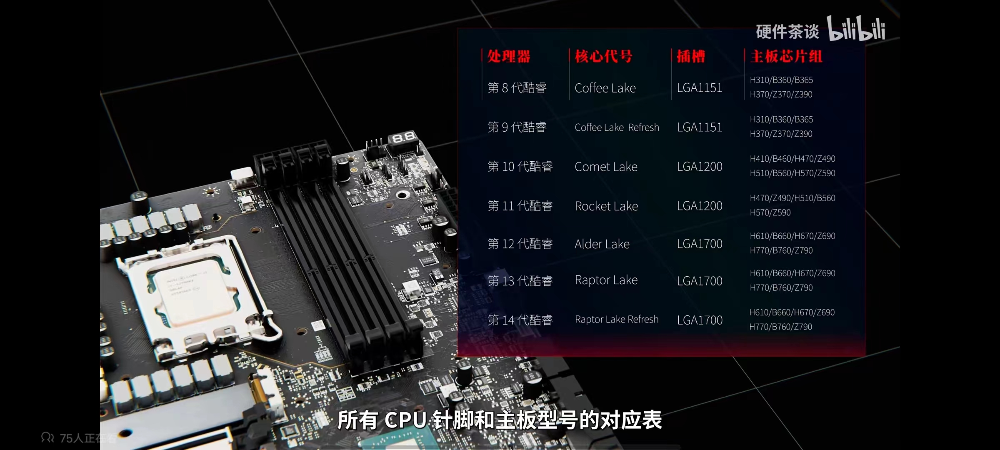
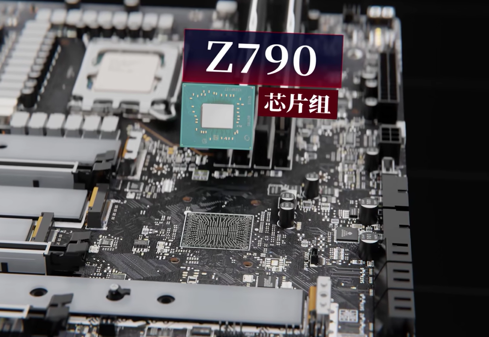
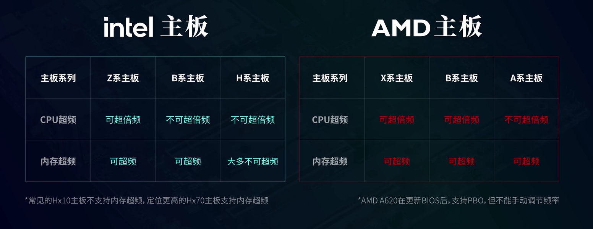
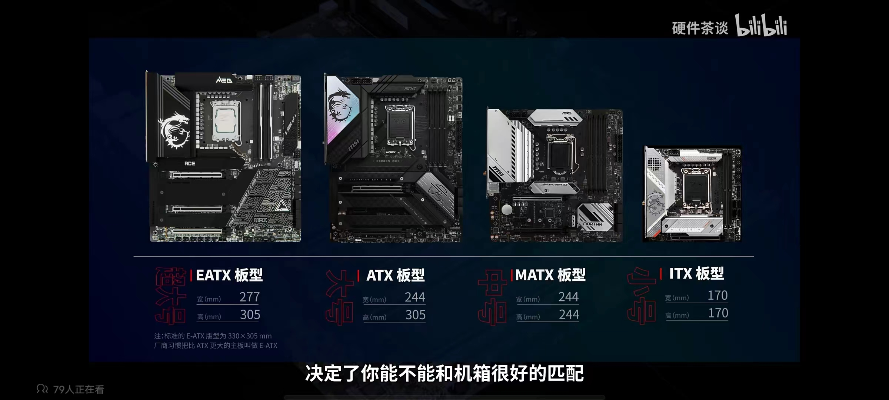
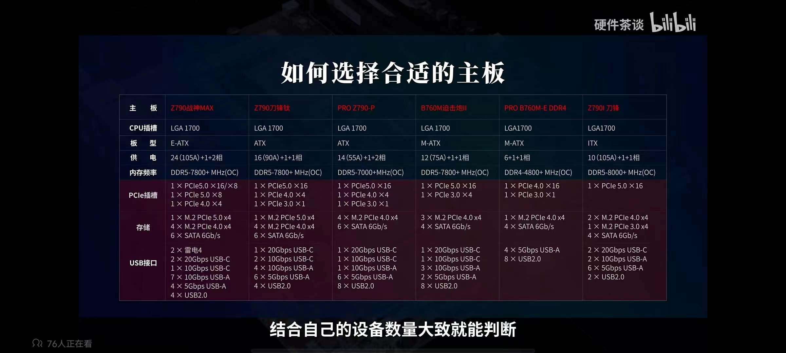
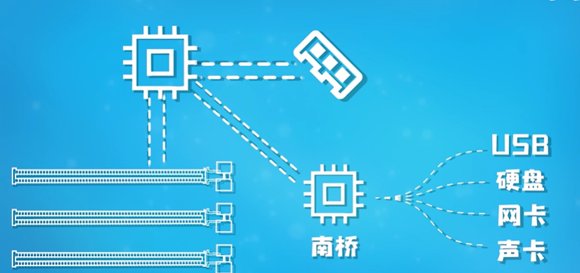
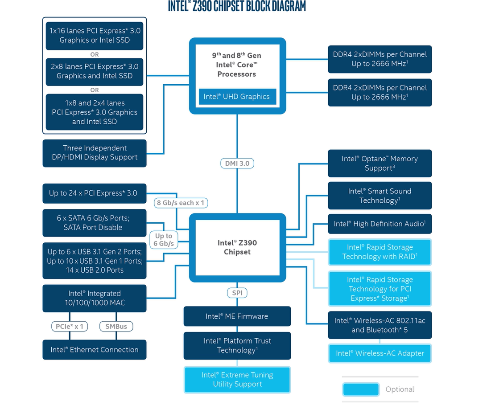
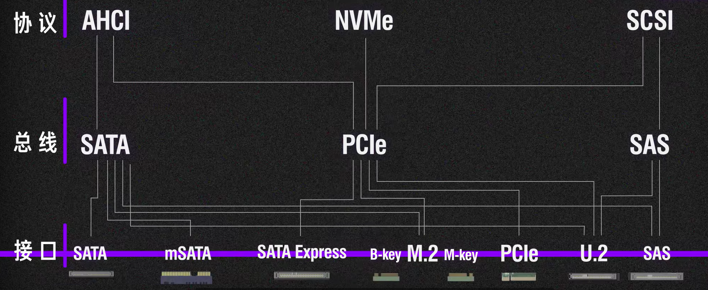

## 主板

**根据cpu的芯片组和插槽规格选择对应的主板**

### 芯片组

**南桥芯片**

系列越高的 供电和扩展接口越多

### **大小**  

### **如何选择**

根据 cpu 的插槽类型

### 相供电

主板的10**相供电**是指主板上CPU供电的元件组成，具体由10组MOSFET（金属氧化物半导体场效应晶体管）加上下桥组成，这些元件共同负责为CPU提供稳定的电力供应。这种供电方式能够提供更稳定、更高效的电流输出，以满足高性能CPU的电力需求。

具体来说，10相供电意味着有10个电感（或其他相应的供电元件）参与到CPU的供电过程中，它们分别负责在不同阶段为CPU提供电力，从而确保CPU能够稳定、高效地运行。这种多相供电方式可以减小电路中的阻抗，降低电源损耗，提高电源转换效率，同时也有助于降低电源的发热量，提高系统的稳定性和可靠性。

需要注意的是，供电相数并不是唯一决定主板性能的因素，还需要考虑其他因素如主板的电路设计、用料、散热等方面。因此，在选择主板时，需要综合考虑各种因素，选择适合自己需求的产品。

### 南桥芯片

南桥芯片（South Bridge）在主板芯片组中扮演着至关重要的角色，其主要作用包括但不限于以下几个方面：

1. 数据传输和协调：南桥芯片负责处理和传输来自各个外设的数据。例如，当用户读取硬盘上的数据时，南桥芯片会接收并处理这些数据，然后将其传输给CPU进行计算。同时，南桥芯片还负责协调各种设备之间的数据传输，确保它们之间的数据能够顺利交互。
2. 总线控制和管理：南桥芯片负责管理主板上的各种总线，如PCI、SATA、USB等。它通过与这些设备的接口进行通信，使它们可以与计算机系统进行数据交换。
3. 电源管理：南桥芯片负责计算机的电源管理，可以通过控制和管理电源的供应情况、功耗等来实现节能和保护电脑的作用。它可以对各个组件的功耗进行监测并进行调整，以达到最优的能源利用效果。
4. 控制和管理BIOS：BIOS（Basic Input/Output System）是计算机系统上的一个重要组件，它主要负责启动计算机并初始化各种硬件设备。南桥芯片负责控制和管理BIOS的操作，包括存储和读取BIOS的各种设置、更新BIOS等。
5. 管理和支持存储设备：南桥芯片负责管理存储设备，如硬盘、光驱、闪存等。它负责与这些设备进行通信，将数据传输到存储设备或从存储设备读取数据。同时，它还负责管理存储设备的工作状态和电源控制，确保数据的安全传输和存储。
6. 管理和支持网络连接：南桥芯片通过以太网接口和无线网络接口，与计算机系统的网络进行连接，并负责网络数据的传输和接收。这使得我们可以在计算机上进行网络浏览、在线购物、社交媒体等各种网络活动。
7. 监视和管理系统功耗和温度：南桥芯片可以通过传感器监测系统的温度，当温度过高时，它可以通过控制风扇的转速来散热，以保证系统的稳定性和安全性。同时，它还可以对计算机系统的功耗进行监测和管理，以提高系统的能效和节能性能。

总的来说，南桥芯片是主板芯片组中不可或缺的一部分，它负责处理各种低速信号，并通过北桥与中央处理器联系，确保计算机系统的正常运行和高效工作。

## CPU 处理器

主机处理器的参数和规格对于电脑的整体性能至关重要。以下是一些常见的处理器（CPU）参数和规格，这些参数将影响处理器的性能和功能：

1. **核心数（Cores）**：核心数是处理器内部的处理单元数量。多核心处理器可以同时处理多个任务，提高整体性能。例如，四核处理器可以同时处理四个任务，而八核处理器则可以同时处理八个任务。
2. **线程数（Threads）**：线程是CPU基本工作单元，是程序执行流的最小单元。某些处理器支持超线程技术（如Intel的Hyper-Threading），这项技术可以使每个核心同时处理两个线程，从而提高处理器的效率。
3. **主频（Clock Speed）**：主频是处理器的时钟频率，通常以GHz为单位。主频越高，处理器每秒钟能完成的指令数就越多，性能也就越强。但是，主频并不是决定处理器性能的唯一因素，还需要考虑其他参数如缓存大小、指令集等。
4. **缓存（Cache）**：缓存是处理器内部的高速存储器，用于暂存即将被处理的数据。缓存分为L1、L2、L3等不同级别，级数越高，缓存容量越大，CPU获取数据的速度就越快。缓存的大小和速度对处理器的性能有很大影响。
5. **外频（External Clock）**：外频是CPU与主板之间同步运行的速度，即CPU的基准频率。外频的高低对处理器的整体性能有很大影响，但通常不是用户可以直接调整的参数。
6. **倍频（Multiplier）**：倍频是CPU主频与外频之间的倍数关系。主频的计算方式为：主频=外频×倍频。倍频越高，主频就越高，处理器的性能也就越强。
7. **制程工艺（Process Technology）**：制程工艺是指生产CPU的硅晶片上所采用的纳米级工艺。制程工艺越先进，CPU的功耗越低，性能也可能越强。
8. **指令集（Instruction Set）**：指令集是处理器所能执行的全部指令的集合。不同的处理器有不同的指令集，某些特定的指令集可以优化某些特定类型的任务（如多媒体处理、科学计算等）的性能。

除了以上参数和规格外，还有一些其他的因素也会影响处理器的性能，如散热性能、功耗、兼容性等。在选择处理器时，需要根据自己的需求和预算综合考虑这些因素。

### 参数说明

主频、核心数、线程数、缓存大小和指令集都是描述CPU（中央处理器）性能的重要参数，它们各自具有不同的含义和作用，以下是对这些参数的区别解释：

1. 主频（Clock Speed）：

- 定义：主频即CPU的时钟频率，它表示CPU每秒钟可以完成多少次基本的时钟周期。
- 作用：主频的高低在很大程度上反映了CPU速度的快慢，但主频并不直接等同于CPU的运算速度。提高主频对于提高CPU运算速度至关重要，但电脑的整体运行速度还与其他分系统的运行情况有关。
- 关系：主频与实际的运算速度存在一定的关系，但并非简单的线性关系。因为CPU的运算速度还受到CPU的流水线、总线等各方面的性能指标的影响。

2. 核心数（Cores）：

- 定义：核心数又称处理器核心数，是指计算机处理器内集成的独立处理器核心的数量。
- 作用：核心数用于衡量处理器的多任务处理能力。每个核心都可以独立地执行指令，从而实现并行计算。更多的核心意味着CPU可以同时执行更多的指令流，从而提高处理能力。

3. 线程数（Threads）：

- 定义：线程数是指在一个计算机程序或进程中同时执行的线程的数量。线程是操作系统能够进行调度的最小单位，用于执行程序中的指令。
- 作用：线程数的意义在于它决定了程序能够并发执行的任务数量。如果程序具有多个线程，它们可以同时执行不同的任务，从而加快程序的执行速度。

4. 缓存大小（Cache Memory）：

- 定义：缓存大小是CPU缓存的容量，它位于CPU与内存之间的临时存储器，容量比内存小但交换速度比内存快。
- 作用：缓存的出现主要是为了解决CPU运算速度与内存读写速度不匹配的矛盾。缓存中的数据是内存中的一小部分，但这一小部分是短时间内CPU即将访问的。当CPU调用大量数据时，可直接从缓存中调用，从而加快读取速度。

5. 指令集（Instruction Set）：

- 定义：指令集是一种用于计算机或其他数字设备的基本语言，它指定了处理器能够执行的操作和命令，包括算术、逻辑和输入输出等。
- 作用：指令集定义了如何使用处理器来完成特定任务。通过编写程序，将高级语言转换成特定的机器码，使得计算机可以执行各种任务，包括数据处理、浮点运算、逻辑运算、输入输出等。它也是操作系统与硬件之间的桥梁，负责将指令翻译为实际的电路信号，并对计算机资源进行管理与调度。

这些参数共同影响着CPU的性能，但每个参数都有其独特的作用和重要性。在选择CPU时，需要根据自己的需求和预算综合考虑这些参数。

## 内存

### 频率

1. **数据读写速度**：较高的内存频率可以提供更快的数据读写速度，从而加快了计算机与内存之间的数据交互。这意味着当计算机需要频繁地读取或写入内存中的数据时，较高的内存频率可以减少等待时间，加快数据的访问和处理速度。
2. **应用程序执行效率**：内存频率的提升可以加快应用程序的执行速度。由于较高的内存频率能够更快地处理数据，因此可以提高应用程序的执行效率，使得用户能够更快地完成任务。
3. **多任务处理能力**：较高的内存频率可以提升计算机的多任务处理能力。在同时执行多个任务时，内存频率的提高可以更快地切换和读取不同任务所需的数据，从而减少任务之间的等待时间，提升系统的整体处理能力。
4. **游戏和图形处理性能**：对于需要处理大量图形和视频数据的应用场景，如游戏和图形渲染等，较高的内存频率可以提升计算机的游戏和图形处理性能。这可以更快地加载游戏资源、渲染图像和播放高清视频，提供更流畅的游戏体验和图形表现。

总的来说，内存的频率是内存模块每秒钟可以传输数据的速度，通常以兆赫兹（MHz）为单位表示。内存频率越高，每秒钟可以传输的数据就越多，从而提高了计算机的性能。因此，在选择内存时，内存频率是一个重要的考虑因素。

### DDR

下是一个简化版的表格，列出了每一代DDR协议的内存读写频率的示例值：

| DDR 版本 |                       内存频率（MHz）                        |
| :------: | :----------------------------------------------------------: |
|   DDR    |                        266, 333, 400                         |
|   DDR2   |                        533, 667, 800                         |
|   DDR3   |                    1066, 1333, 1600, 2133                    |
|   DDR4   |                    2133, 2400, 2666, 3200                    |
|   DDR5   | 3600, 4800, 5200, 6400 (注：DDR5的频率范围更广，这里仅列出部分示例值) |

请注意，以上数据仅为示例值，并不涵盖每一代DDR协议的所有可能频率。实际可用的内存频率取决于具体的内存模块规格、主板和处理器的兼容性以及系统配置。另外，DDR5的内存频率范围更广，且不同厂商和产品之间的频率可能会有所不同。

**以DDR4为例，列出的多个频率值（如2133MHz、2400MHz、2666MHz、3200MHz）表示DDR4内存模块可以运行在这些不同的频率下。具体使用哪个频率取决于主板、处理器和内存模块之间的兼容性，以及用户的配置选择。**

### 超频

**超频内存，也称为内存条超频（Memory Overclocking）**，是指在保持CPU或GPU频率不变的情况下，通过调整内存的工作频率来提高内存性能的一种操作。超频内存可以让计算机在处理大量数据或运行复杂任务时更加流畅，提高整体性能。

超频内存的方法主要有以下几种：

1. 进入BIOS设置：重新启动电脑并进入BIOS设置界面。在BIOS中找到内存频率设置选项，逐步提高内存的工作频率。可以从内存的标称频率开始，逐渐增加以寻找最高可用频率。
2. 调整时序参数：在找到合适的频率后，还需要调整内存时序，包括CAS延迟、RAS到CAS延迟、行预充电时间等，以达到最佳的性能和稳定性。
3. 使用XMP配置文件：如果不想手动调整各项参数，可以使用内存的XMP配置文件。XMP（Extreme Memory Profile）是Intel推出的一种内存认证标准，通过加载内存上的XMP配置文件，可以自动将内存频率、时序、电压等参数设置为最优状态。

需要注意的是，超频内存存在一定的风险。首先，超频可能会导致系统稳定性下降，出现蓝屏、死机或突然重启的情况。其次，长期超频可能会对硬件造成损耗，缩短其使用寿命。此外，超频通常会使电脑消耗更多的电力，增加电费开销，并可能导致电脑发热量增大。

### XMP和XPD

假设你购买的是中高频内存，比如3200 3600这类，如果你不做任何的设置，那么你开机后，在任务管理器内你通常会发现你的内存工作在2133频率下，并没有达到商家宣传的3200或者3600，那这时候如果你去询问卖家怎么解决，他们都会告诉你去主板的BIOS里打开XMP，然后保存并重启电脑后，再次进入系统，你就会发现你的内存成功的跑到了应有的频率。为什么高频内存在不开启XMP的情况下只能跑到很低的频率，XMP究竟是什么东西，为什么打开以后内存就能达到商家宣传的频率，今天这期视频我们就带你了解一下XMP

在内存技术中，XMP（Extreme Memory Profile）是一个重要的概念，但XPD并不是一个普遍认可或广泛使用的术语，可能是一个误写或特定上下文中的特定术语。

XMP是Intel在2007年提出的一种内存认证标准，适用于DDR3和DDR4内存。它的主要作用是将内存频率超频，但XMP属于在厂商设定的范围内超频，因此是一种安全的超频方式。通过XMP认证的内存会在内存地址176~254中记录内存的速度设定，最多可以保存2组设定值。这些预设的超频配置文件可以通过BIOS或操作系统的特定微调应用程序加载，从而实现内存的超频。

而XPD并没有在内存技术中作为一个普遍认可或广泛使用的术语出现。它可能是一个误写，或者是在特定上下文中的特定术语。如果你在某个特定的产品、技术或文档中看到了XPD，建议查阅相关的官方文档或联系技术支持以获取准确的信息。

总的来说，XMP是内存技术中一个重要的概念，用于实现内存的超频，而XPD并不是一个普遍认可或广泛使用的术语。

## 硬盘

**PCIe总线则是PCIe协议的具体实现方式**

### 接口

#### M.2接口

**M.2 B-key和M-key是两种不同的M.2接口标准**，它们的主要区别如下：

1. 通道速率：**B-key走的是SATA或PCI-E 2x通道**，主要支持SSD、WWAN或其他主要key界面。而M-key则是PCI-E 4x通道，更适合高速SSD。
2. 缺口位置：在结构表现上，M-key接口的位置在右，B-key接口的缺口位置在左。

至于它们之间的兼容性，一般来说，**B-key和M-key是不能直接互相兼容的**。因为它们的接口形状和通道速率不同，所以不能直接插入对方的插槽中。但是，有些M.2接口设计为B&M key，这种接口可以兼容B-key和M-key两种固态硬盘。

因此，在选择M.2固态硬盘和主板时，需要**确认主板上的M.2接口是B-key、M-key还是B&M key**，以及固态硬盘的接口类型，以确保它们之间的兼容性。如果主板和固态硬盘的接口不匹配，可能需要进行一些硬件改造或更换，才能实现兼容。

另外，还需要注意固态硬盘的尺寸和主板支持的协议。**M.2固态硬盘常见的尺寸有2230、2242、2260、2280等**，需要**确保固态硬盘的尺寸与主板上的M.2插槽相匹配**。同时，还需要确认主板支持的协议类型，例如NVME或SATA，以确保固态硬盘能够正常工作。

### 协议

**AHCI、NVMe和SCSI是三种不同的存储协议**，它们在速率、作用和设计上有所区别。

1. **AHCI**（Advanced Host Controller Interface）：

- 速率：AHCI主要用于SATA总线，其速率受限于SATA接口的性能。在SATA 3.0总线下，SATA接口SSD产品的性能大多在600MB/s。
- 作用：AHCI协议在系统内存总线和串行ATA设备内部逻辑之间扮演一种通用接口的角色。它使得主机能够与硬盘驱动器（HDD）或固态硬盘（SSD）等SATA设备进行通信。
- 设计：AHCI为单队列模式，主机和HDD/SSD之间通过单队列进行数据交互。对于HDD这种慢速设备，主要瓶颈在存储设备，而非AHCI协议。但对于SSD，AHCI的单队列模式可能限制其并发性能。

2. **NVMe**（Non-Volatile Memory Host Controller Interface Specification）：

- 速率：NVMe协议基于PCI Express（PCIe）总线，因此其速率远高于AHCI。基于NVMe的驱动器可实现高达16Gbps的吞吐量，且供应商正在推动32Gbps或更高的吞吐量产品。
- 作用：NVMe协议主要用于PCIe总线的产品，为基于闪存的存储设备提供一个低延时、内部并发化的原生界面规范。它使得主机硬件和软件可以充分利用固态存储设备的并行化存储能力。
- 设计：NVMe协议降低了I/O操作等待时间、提升同一时间内的操作数、更大容量的操作队列等。许多基于NVMe的驱动器在IOPS（每秒输入/输出操作次数）方面表现出色，可以超过50万，部分甚至达到150万、200万或1000万IOPS。

3. **SCSI**（Small Computer System Interface）：

- 速率：SCSI的速率取决于其使用的具体接口和总线技术，如SCSI-1、SCSI-2、SCSI-3等。
- 作用：SCSI协议定义了一套不同设备（磁盘、磁带、处理器、光设备、网络设备等）利用该框架进行信息交互的模型和必要指令集。它是一个庞大协议体系，用于连接和管理多种存储设备。
- 设计：SCSI协议本质上与传输介质（如SATA线、PCIE线、网线等）无关，可以在多种介质上实现，甚至是虚拟介质。

总结来说，AHCI、NVMe和SCSI在速率、作用和设计上各有特点。AHCI适用于SATA存储设备，NVMe则基于PCIe总线提供高性能存储解决方案，而SCSI是一个广泛使用的存储协议体系，支持多种设备和接口。在选择存储设备和协议时，需要根据具体需求和应用场景进行评估和选择。

#### 总线

**SATA、PCIe和SAS**在存储领域都有各自的特点，以下是它们之间的区别、速率、作用以及对应的协议与接口：

1. **SATA**（Serial Advanced Technology Attachment）：

- 速率：SATA的速率受限于其接口规范。例如，SATA 3.0的接口速率理论最大值为6Gbps（即750MB/s）。但实际应用中，受限于硬盘内部传输率、接口瓶颈、以及现有机械硬盘的机械结构限制，SATA 3.0接口下SSD的读写速度大约在450MB/s至550MB/s之间。
- 作用：SATA是一种串行接口标准，主要用于连接硬盘驱动器和主板。它是许多个人电脑和消费级存储设备中常见的接口。
- 协议与接口：SATA接口通常与AHCI（Advanced Host Controller Interface）协议一起使用。AHCI是一种用于SATA接口的硬件接口标准，它允许软件与SATA存储设备通信。

2. **PCIe**（Peripheral Component Interconnect Express）：

- 速率：PCIe的速率远高于SATA。PCIe 3.0的x4通道速率即可达到32Gbps，而PCIe 4.0的x4通道速率更是高达64Gbps。这使得PCIe成为高性能存储解决方案的首选。
- 作用：PCIe是一种高速串行计算机扩展总线标准，它定义了计算机内部和外部设备之间的连接方式和通信方式。在存储领域，PCIe通常与NVMe（Non-Volatile Memory Express）协议一起使用，以实现极快的存储性能。
- 协议与接口：PCIe接口可以与NVMe协议结合使用。NVMe是一种基于PCIe的存储协议，专为SSD设计，以提供更高的性能和更低的延迟。通过PCIe接口和NVMe协议的结合，SSD可以实现接近内存的性能。

3. SAS（Serial Attached SCSI）：

- 速率：SAS的速率通常高于SATA，但低于PCIe。SAS 2.0的接口速率理论最大值为6Gbps，而SAS 3.0的接口速率理论最大值为12Gbps。
- 作用：SAS是一种高性能的串行接口技术，通常用于企业级存储应用。它提供了更高的数据传输速度和更好的可靠性，适用于需要高性能和大容量的存储环境。SAS接口既可以连接机械硬盘（HDD），也可以连接固态硬盘（SSD）。
- 协议与接口：SAS接口使用SCSI（Small Computer System Interface）协议。SCSI是一种用于计算机和存储设备之间数据传输的标准接口和协议。SAS接口利用PCIe总线进行通信，提供了极高的数据传输速度和低延迟。

总结来说，SATA、PCIe和SAS在速率、作用和对应的协议与接口方面各有特点。SATA适用于消费级存储设备，PCIe提供极高的性能和低延迟，适用于高性能存储需求，而SAS则适用于企业级存储应用。在选择存储解决方案时，需要根据具体需求和应用场景进行评估和选择。

