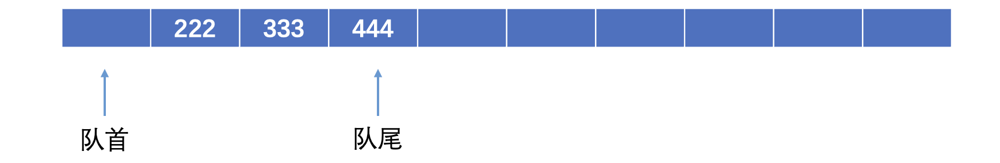
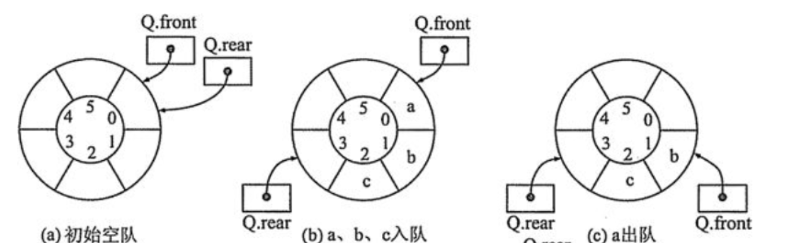
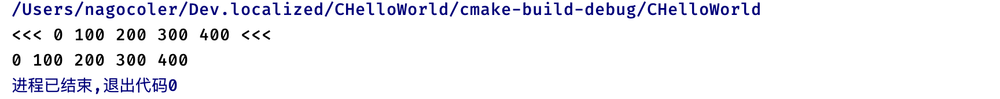
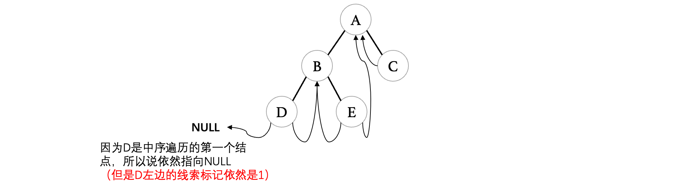
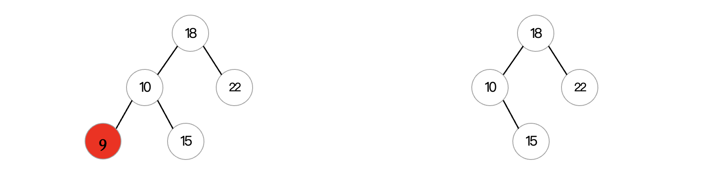
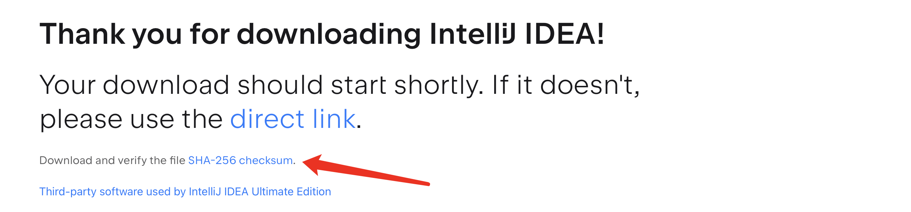
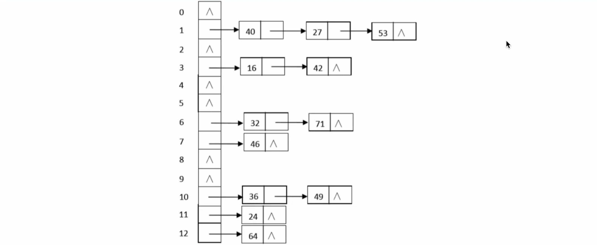
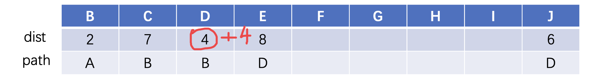
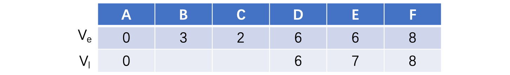

# 线性结构篇

**注意：** 开始本篇学习之前，请确保你完成了 **C语言程序设计** 篇视频教程，否则无法进行学习。

我们本系列课程分为基础知识和算法实战两部分，其中算法实战在LeetCode上进行：https://leetcode.cn/，各位可以提前在平台上注册好相关账号。

学习完数据结构，各位小伙伴可以尝试参加算法相关的学科竞赛，如ICPC-ACM、蓝桥杯等，算法类的比赛含金量相比项目类比赛更高，也更有价值，相应的，算法类竞赛难道会更大一些，尤其是ICPC-ACM大学生程序设计竞赛，一般都是各个高校内顶尖级队伍进行参赛，甚至还有中学队伍（这类学生预定清华、北大），因为算法更加考验个人的思维能力和天赋水平，相比其他计算机基础课程，数据结构和算法是难度最高的，也是各大高校考研的重点内容。

不过虽然很难，并且考验个人天赋，但是大部分人通过努力学习是完全能够掌握基础部分的，在应对80%的题目时，是完全有机会解决的，所以，不要怀疑自己，说不定你就是下一个大佬。

这里也说一下面试推荐书籍，内含多种常用算法以及解题分析，值得一看：


本篇内容虽然继续以C语言为基础进行讲解，但是将不再涉及到C语言的语言层面相关内容，更多的是数据结构和算法的思想，实际上用任意一种语言都可以实现。

***

## 什么是数据结构与算法

回顾我们之前的C语言程序设计阶段，我们已经接触过基本数据类型，并且能够使用结构体对数据进行组织，我们可以很轻松地使用一个结构体来存放一个学生的完整数据，在数据结构学习阶段，我们还会进一步地研究。

### 数据结构

那么，我们来看看，什么是数据结构呢？

>  数据结构(data structure)是带有结构特性的数据元素的集合，它研究的是数据的[逻辑结构](https://baike.baidu.com/item/逻辑结构/9663235)和数据的物理结构以及它们之间的相互关系。

比如现在我们需要保存100个学生的数据，那么你首先想到的肯定是使用数组吧！没错，没有什么比数组更适合存放这100个学生的数据了，但是如果我们现在有了新的需求呢？我们不仅仅是存放这些数据，我们还希望能够将这些数据按顺序存放，支持在某个位置插入一条数据、删除一条数据、修改一条数据等，这时候，数组就显得有些乏力了。


我们需要一种更好的数据表示和组织方式，才能做到类似于增删改查这样的操作，而完成这些操作所用到的方法，我们称其为“算法”，所以数据结构和算法，一般是放在一起进行讲解的。

### 算法

比如现在我们希望你求出1-100所有数字的和，请通过程序来实现：

```c
int main() {
    int sum = 0;
    for (int i = 1; i <= 100; ++i) sum += i;
    printf("%d", sum);
}
```

我们很容易就能编写出这样的程序，实际上只需要一个for循环就能搞定了，而这就是我们设计的算法。


在之前的C语言程序设计阶段，我们其实已经学习了许多算法，包括排序算法、动态规划等。

当然，解决问题的算法并不是只有一种，实际上我们上面的方式并不是最优的算法，如果想要求得某一段整数的和，其实使用**高斯求和公式**能够瞬间得到结果：
$$
\sum=\frac{(首项+末项)\times项数}{2}
$$
所以，我们完全没必要循环那么多次进行累加计算，而是直接使用数学公式：

```c
int main() {
    printf("%d", (1 + 100) * 100 / 2);
}
```

所以，算法的尽头还得是数学啊。

可见，不同的算法，执行的效率也是有很大差别的，这里我们就要提到算法的复杂度了。衡量一个算法的复杂程度需要用到以下两个指标：

* 时间复杂度`T(n)`：算法程序在执行时消耗的时间长度，一般与输入数据的规模n有关。
* 空间复杂度`S(n)`：算法程序在执行时占用的存储单元长度，同样与数据的输入规模n有关，大部分情况下，我们都是采取空间换时间的算法。

比如我们上面的两种算法，第一种需要执行n次循环，每轮循环进行一次累加操作，而第二种只需要进行一次计算即可。实际中我们计算时间复杂度时，其实并不一定要计算精确的执行次数，而只需要大概执行次数，那么这里我们使用`O`渐进表示法。

* **大O符号（Big O notation）**：是用于描述函数渐进行为的数学符号。

而这里的循环次数，实际上就是我们需要知道的大致执行次数，所以第一种算法的时间复杂度为：`O(n)`，其中n就是项数，因为它需要执行n次计算才能得到最后的结果。而第二种算法的时间复杂度为：`O(1)`，因为它只需要执行一次计算（更准确的说它的执行次数是一个常数，跟项数n毫无关系），显然，当n变得非常大时，第二种方法的计算速度远超第一种。

再比如我们之前使用的冒泡排序算法，需要进行两轮循环，而循环的次数在经过优化之后为`(n - 1)(n - 1)/2`，得到的结果中包含了一个`n`的平方，此时这种算法的时间复杂度就来到`O(n^2)`了。

在不同的空间复杂度下，可能n小的时候还没什么感觉，但是当n变得非常大时，差距就不是一点半点了，我们来看看常用函数的增长曲线：


所以我们在设计算法的时候，一定要考虑到时间和空间复杂度的问题，这里列出常用函数的增长表：

|          函数          |    类型    |                             解释                             |
| :--------------------: | :--------: | :----------------------------------------------------------: |
|     $\Omicron(1)$      |   常数阶   |   如果算法能够优化到这个程度，那么基本上算是最快的算法了。   |
| $\Omicron(\log_{2}n)$  |   对数阶   | 仅次于常数阶的速度，我们后面会介绍的二分搜索算法，就能够到达这个级别。 |
|     $\Omicron(n)$      |   线性阶   | 我们后面介绍的线性表插入、删除数据，包括动态规划类算法能够达到线性阶。 |
| $\Omicron(n\log_{2}n)$ | 线性对数阶 |          相当于在对数阶算法外层套了一层线性阶循环。          |
|    $\Omicron(n^2)$     |   平方阶   | 我们前面学习的冒泡排序，需要进行两重循环，实际上就是平方阶。 |
|    $\Omicron(n^3)$     |   立方阶   |         从立方阶开始，时间复杂度就开始变得有点大了。         |
|    $\Omicron(2^n)$     |   指数阶   | 我们前面介绍的斐波那契数列递归算法，就是一个指数阶的算法，因为它包含大量的重复计算。 |
|     $\Omicron(n!)$     |    阶乘    | 这个增长速度比指数阶还恐怖，但是一般很少有算法能达到这个等级。 |

我们在编写算法时，一定要注意算法的时间复杂度，当时间复杂度太大时，可能计算机就很难在短时间内计算出结果了。

### 案例：二分搜索算法

现在有一个从小到大排序的数组，给你一个目标值`target`，现在请你找到这个值在数组中的对应下标，如果没有，请返回`-1`：

```c
int search(int* nums, int numsSize, int target){
    //请实现查找算法
}

int main() {
    int arr[] = {1, 3, 4, 6, 7,8, 10, 11, 13, 15}, target = 3;
    printf("%d", search(arr, 10, target));
}
```

此时，最简单的方法就是将数组中的元素一个一个进行遍历，总有一个是，如果遍历完后一个都没有，那么就结束：

```c
int search(int* nums, int numsSize, int target){
    for (int i = 0; i < len; ++i) {
        if(nums[i] == target) return i;   //循环n次，直到找到为止
    }
    return -1;
}
```

虽然这样的算法简单粗暴，但是并不是最好的，我们需要遍历n次才能得到结果，时间复杂度为$\Omicron(n)$，我们可以尝试将其优化到更低的时间复杂度。这里我们利用它有序的特性，实际上当我们查找到大于目标`target`的数时，就没必要继续寻找了：

```c
int search(int* nums, int numsSize, int target){
    for (int i = 0; i < len; ++i) {
        if(nums[i] == target) return i;
        if(nums[i] > target) break;
    }
    return -1;
}
```

这样循环进行的次数也许就会减小了，但是如果我们要寻找的目标`target`刚好是最后几个元素呢？这时时间复杂度又来到到了$\Omicron(n)$，那么有没有更好的办法呢？我们依然可以继续利用数组有序的特性，既然是有序的，那么我们不妨随机在数组中找一个数，如果这个数大于目标，那么就不再考虑右边的部分，如果小于目标，那么就考虑左边的部分，然后继续在另一部分中再次随机找一个数，这样每次都能将范围缩小，直到找到为止（其思想就比较类似于**牛顿迭代法**，再次强调数学的重要性）


而二分思想就是将一个有序数组不断进行平分，直到找到为止，这样我们每次寻找的范围会不断除以2，所以查找的时间复杂度就降到了$\Omicron(\log_{2}n)$，相比一个一个比较，效率就高了不少：


好了，那么现在我们就可以利用这种思想，编写出二分搜索算法了，因为每一轮都在进行同样的搜索操作，只是范围不一样，所以这里直接采用递归分治算法：

```c
int binarySearch(int * nums, int target, int left, int right){  //left代表左边界，right代表右边界
    if(left > right) return -1;   //如果左边大于右边，那么肯定就找完了，所以直接返回
    int mid = (left + right) / 2;   //这里计算出中间位置
    if(nums[mid] == target) return mid;   //直接比较，如果相等就返回下标
    if(nums[mid] > target)    //这里就是大于或小于的情况了，这里mid+1和mid-1很多人不理解，实际上就是在下一次寻找中不算上当前的mid，因为这里已经比较过了，所以说左边就-1，右边就+1
        return binarySearch(nums, target, left, mid - 1);   //如果大于，那么说明肯定不在右边，直接去左边找
    else
        return binarySearch(nums, target, mid + 1, right);  //如果小于，那么说明肯定不在左边，直接去右边找
}

int search(int* nums, int numsSize, int target){
    return binarySearch(nums, target, 0, numsSize - 1);
}
```

当然也可以使用`while`循环来实现二分搜索，如果需要验证自己的代码是否有问题，可以直接在力扣上提交代码：https://leetcode.cn/problems/binary-search/

***

## 线性表

那么作为数据结构的开篇，我们就从最简单的线性表开始介绍。

还记得我们开篇提了一个问题吗？

> 我们还希望能够将这些数据按顺序存放，支持在某个位置插入一条数据、删除一条数据、修改一条数据等，这时候，数组就显得有些乏力了。

数组无法做到这么高级的功能，那么我们就需要定义一种更加高级的数据结构来做到，我们可以使用线性表（Linear List）

> 线性表是由同一类型的数据元素构成的有序序列的线性结构。线性表中元素的个数就是线性表的长度，表的起始位置称为表头，表的结束位置称为表尾，当一个线性表中没有元素时，称为空表。

线性表一般需要包含以下功能：

* **初始化线性表：** 将一个线性表进行初始化，得到一个全新的线性表。
* **获取指定位置上的元素：** 直接获取线性表指定位置`i`上的元素。
* **获取元素的位置：** 获取某个元素在线性表上的位置`i`。
* **插入元素：** 在指定位置`i`上插入一个元素。
* **删除元素：** 删除指定位置`i`上的一个元素。
* **获取长度：** 返回线性表的长度。

也就是说，现在我们需要设计的是一种功能完善的表结构，它不像是数组那么低级，而是真正意义上的表：


简单来说它就是列表，比如我们的菜单，我们在点菜时就需要往菜单列表中添加菜品或是删除菜品，这时列表就很有用了，因为数组长度固定、操作简单，而我们添加菜品、删除菜品这些操作又要求长度动态变化、操作多样。

那么，如此高级的数据结构，我们该如何去实现呢？实现线性表的结构一般有两种，一种是顺序存储实现，还有一种是链式存储实现，我们先来看第一种，也是最简单的的一种。

### 顺序表

前面我们说到，既然数组无法实现这样的高级表结构，那么我就基于数组，对其进行强化，也就是说，我们存放数据还是使用数组，但是我们可以为其编写一些额外的操作来强化为线性表，像这样底层依然采用顺序存储实现的线性表，我们称为顺序表。


这里我们可以先定义一个新的结构体类型，将一些需要用到的数据保存在一起，这里我们以`int`类型的线性表为例：

```c
typedef int E;  //这里我们的元素类型就用int为例吧，先起个别名

struct List {
    E array[10];   //实现顺序表的底层数组
    int capacity;   //表示底层数组的容量
};
```

为了一会使用方便，我们可以给其起一个别名：

```c
typedef struct List * ArrayList; //因为是数组实现，所以就叫ArrayList，这里直接将List的指针起别名
```

然后我们就可以开始编写第一个初始化操作了：

```c
void initList(ArrayList list){
    list->capacity = 10;   //直接将数组的容量设定为10即可
}
```

但是我们发现一个问题，这样的话我们的顺序表长度不就是固定为10的了吗？而前面我们线性表要求的是长度是动态增长的，那么这个时候怎么办呢？我们可以直接使用一个指针来指向底层数组的内存区域，当装不下的时候，我们可以创建一个新的更大的内存空间来存放数据，这样就可以实现扩容了，所以我们来修改一下：

```c
struct List {
    E * array;   //指向顺序表的底层数组
    int capacity;   //数组的容量
};
```

接着我们修改一下初始化函数：

```c
void initList(ArrayList list){  //这里就默认所有的顺序表初始大小都为10吧，随意
    list->array = malloc(sizeof(E) * 10);   //使用malloc函数申请10个int大小的内存空间，作为底层数组使用
    list->capacity = 10;    //容量同样设定为10
}
```

但是还没完，因为我们的表里面，默认情况下是没有任何元素的，我们还需要一个变量来表示当前表中的元素数量：

```c
struct List {
    E * array;   //指向顺序表的底层数组
    int capacity;   //数组的容量
    int size;   //表中的元素数量
};

typedef struct List * ArrayList;

void initList(ArrayList list){  //这里就默认所有的顺序表初始大小都为10吧，随意
    list->array = malloc(sizeof(int) * 10);   //使用malloc函数申请10个int大小的内存空间，作为底层数组使用
    list->capacity = 10;    //容量同样设定为10
    list->size = 0;   //元素数量默认为0
}
```

还有一种情况我们需要考虑，也就是说如果申请内存空间失败，那么需要返回一个结果告诉调用者：

```c
_Bool initList(ArrayList list){
    list->array = malloc(sizeof(int) * 10);
    if(list->array == NULL) return 0;  //需要判断如果申请的结果为NULL的话表示内存空间申请失败
    list->capacity = 10;
    list->size = 0;
    return 1;   //正常情况下返回true也就是1
}
```

这样，一个比较简单的顺序表就定义好，我们可以通过`initList`函数对其进行初始化：

```c
int main() {
    struct List list;   //创建新的结构体变量
    if(initList(&list)){   //对其进行初始化，如果失败就直接结束
      	...
    } else{
        printf("顺序表初始化失败，无法启动程序！");
    }
}
```

接着我们来编写一下插入和删除操作，对新手来说也是比较难以理解的操作：


我们先设计好对应的函数：

```c
void insertList(ArrayList list, E element, int index){
    	//list就是待操作的表，element就是需要插入的元素，index就是插入的位置（注意顺序表的index是按位序计算的，从1开始，一般都是第index个元素）
}
```

我们按照上面的思路来编写一下代码：

```c
void insertList(ArrayList list, E element, int index){
    for (int i = list->size; i > index - 1; i--)  //先使用for循环将待插入位置后续的元素全部丢到后一位
        list->array[i] = list->array[i - 1];
    list->array[index - 1] = element;    //挪完之后，位置就腾出来了，直接设定即可
    list->size++;   //别忘了插入之后相当于多了一个元素，记得size + 1
}
```

现在我们可以来测试一下了：

```c
void printList(ArrayList list){   //编写一个函数用于打印表当前的数据
    for (int i = 0; i < list->size; ++i)   //表里面每个元素都拿出来打印一次
        printf("%d ", list->array[i]);
    printf("\n");
}
```

```c
int main() {
    struct List list;
    if(initList(&list)){
        insertList(&list, 666, 1);  //每次插入操作后都打印一下表，看看当前的情况 
        printList(&list);
        insertList(&list, 777, 1);
        printList(&list);
        insertList(&list, 888, 2);
        printList(&list);
    } else{
        printf("顺序表初始化失败，无法启动程序！");
    }
}
```

运行结果如下：


虽然这样看起来没什么问题了，但是如果我们在非法的位置插入元素会出现问题：

```c
insertList(&list, 666, -1);   //第一个位置就是0，怎么可能插入到-1这个位置呢，这样肯定是不正确的，所以我们需要进行判断
printList(&list);
```

我们需要检查一下插入的位置是否合法：


转换成位序，也就是[1, size + 1]这个闭区间，所以我们在一开始的时候进行判断：

```c
_Bool insertList(ArrayList list, E element, int index){
    if(index < 1 || index > list->size + 1) return 0;   //如果在非法位置插入，返回0表示插入操作执行失败
    for (int i = list->size; i > index - 1; i--)
        list->array[i] = list->array[i - 1];
    list->array[index - 1] = element;
    list->size++;
    return 1;   //正常情况返回1
}
```

我们可以再来测试一下：

```c
if(insertList(&list, 666, -1)){
    printList(&list);
} else{
    printf("插入失败！");
}
```


不过我们还是没有考虑到一个情况，那么就是如果我们的表已经装满了，也就是说size已经达到申请的内存空间最大的大小了，那么此时我们就需要考虑进行扩容了，否则就没办法插入新的元素了：

```c
_Bool insertList(ArrayList list, E element, int index){
    if(index < 1 || index > list->size + 1) return 0;
    if(list->size == list->capacity) {   //如果size已经到达最大的容量了，肯定是插不进了，那么此时就需要扩容了
        int newCapacity = list->capacity + (list->capacity >> 1);   //我们先计算一下新的容量大小，这里我取1.5倍原长度，当然你们也可以想扩多少扩多少
        E * newArray = realloc(list->array, sizeof(E) * newCapacity);  //这里我们使用新的函数realloc重新申请更大的内存空间
        if(newArray == NULL) return 0;   //如果申请失败，那么就确实没办法插入了，只能返回0表示插入失败了
        list->array = newArray;
        list->capacity = newCapacity;
    }
    for (int i = list->size; i > index - 1; i--)
        list->array[i] = list->array[i - 1];
    list->array[index - 1] = element;
    list->size++;
    return 1;
}
```

> realloc函数可以做到控制动态内存开辟的大小，重新申请的内存空间大小就是我们指定的新的大小，并且原有的数据也会放到新申请的空间中，所以非常方便。当然如果因为内存不足之类的原因导致内存空间申请失败，那么会返回NULL，所以别忘了进行判断。

这样，我们的插入操作就编写完善了，我们可以来测试一下：

```c
int main() {
    struct List list;
    if(initList(&list)){
        for (int i = 0; i < 30; ++i)
            insertList(&list, i, i);
        printList(&list);
    } else{
        printf("顺序表初始化失败，无法启动程序！");
    }
}
```

成功得到结果：


这样，我们就完成了顺序表的插入操作，接着我们来编写一下删除操作，其实删除操作也比较类似，也需要对元素进行批量移动，但是我们不需要考虑扩容问题，我们先设计好函数：

```c
void deleteList(ArrayList list, int index){
    	//list就是待操作的表，index是要删除的元素位序
}
```

按照我们上面插入的思路，我们反过来想一想然后实现删除呢？首先是删除的范围：


换算成位序就是[1, size]这个闭区间内容，所以我们先来限定一下合法范围：

```c
_Bool deleteList(ArrayList list, int index){
    if(index < 1 || index > list->size) return 0;

    return 1;  //正常情况返回1
}
```

接着就是删除元素之后，我们还需要做什么呢？我们应该将删除的这个元素后面的全部元素前移一位：


我们按照这个思路，来编写一下删除操作：

```c
_Bool deleteList(ArrayList list, int index){
    if(index < 1 || index > list->size) return 0;
    for (int i = index - 1; i < list->size - 1; ++i)
        list->array[i] = list->array[i + 1];   //实际上只需要依次把后面的元素覆盖到前一个即可
    list->size--;   //最后别忘了size - 1
    return 1;
}
```

删除相比插入要简单一些，我们来测试一下吧：

```c
for (int i = 0; i < 10; ++i)  //先插10个
    insertList(&list, i, i);
deleteList(&list, 5);   //这里删除5号元素
printList(&list);
```

成功得到结果：


OK，那么插入和删除操作我们就成功完成了，还有一些比较简单的功能，我们这里也来依次实现一下，首先是获取长度：

```c
int sizeList(ArrayList list){
    return list->size;   //直接返回size就完事
}
```

接着是按位置获取元素和查找指定元素的位置：

```c
E * getList(ArrayList list, int index){
    if(index < 1 || index > list->size) return NULL;   //如果超出范围就返回NULL
    return &list->array[index - 1];
}
```

```c
int findList(ArrayList list, E element){
    for (int i = 0; i < list->size; ++i) {   //一直遍历，如果找到那就返回位序
        if(list->array[i] == element) return i + 1;
    }
    return -1;  //如果遍历完了都没找到，那么就返回-1
}
```

这样，我们的线性表就实现完成了，完整代码如下：

```c
#include <stdio.h>
#include <stdlib.h>

typedef int E;

struct List {
    E * array;
    int capacity;
    int size;
};

typedef struct List * ArrayList;

_Bool initList(ArrayList list){
    list->array = malloc(sizeof(E) * 10);
    if(list->array == NULL) return 0;
    list->capacity = 10;
    list->size = 0;
    return 1;
}

_Bool insertList(ArrayList list, E element, int index){
    if(index < 1 || index > list->size + 1) return 0;

    if(list->size == list->capacity) {
        int newCapacity = list->capacity + (list->capacity >> 1);
        E * newArray = realloc(list->array, newCapacity * sizeof(E));
        if(newArray == NULL) return 0;
        list->array = newArray;
        list->capacity = newCapacity;
    }

    for (int i = list->size; i > index - 1; --i)
        list->array[i] = list->array[i - 1];
    list->array[index - 1] = element;
    list->size++;
    return 1;
}

_Bool deleteList(ArrayList list, int index){
    if(index < 1 || index > list->size) return 0;
    for (int i = index - 1; i < list->size - 1; ++i)
        list->array[i] = list->array[i + 1];
    list->size--;
    return 1;
}

int sizeList(ArrayList list){
    return list->size;
}

E * getList(ArrayList list, int index){
    if(index < 1 || index > list->size) return NULL;
    return &list->array[index - 1];
}

int findList(ArrayList list, E element){
    for (int i = 0; i < list->size; ++i) {
        if(list->array[i] == element) return i + 1;
    }
    return -1;
}
```

**问题：** 请问顺序实现的线性表，插入、删除、获取元素操作的时间复杂度为？

* **插入：** 因为要将后续所有元素都向后移动，所以平均时间复杂度为$O(n)$
* **删除：** 同上，因为要将所有元素向前移动，所以平均时间复杂度为$O(n)$
* **获取元素：** 因为可以利用数组特性直接通过下标访问到对应元素，所以时间复杂度为$O(1)$

**顺序表习题：** 

1. 在一个长度为`n`的顺序表中，向第`i`个元素前插入一个新的元素时，需要向后移动多少个元素？

   A. `n - i`      B. `n - i + 1`     C. `n - i - 1`       D. `i`

   *注意这里要求的是向第`i`个元素前插入（第`i`个表示的是位序，不是下标，不要搞混了，第1个元素下标就为0），这里我们假设`n`为3，`i`为2，那么也就是说要在下标为1的这个位置上插入元素，那么就需要移动后面的2个元素，所以答案是B*

2. 顺序表是一种（    ）的存储结构？

   A. 随机存取        B. 顺序存取       C. 索引存取        D. 散列存取

   *首先顺序表底层是基于数组实现的，那么它肯定是支持随机访问的，因为我们可以直接使用下标想访问哪一个就访问哪一个，所以选择A，不要看到名字叫做顺序表就选择顺序存取，因为它并不需要按照顺序来进行存取，链表才是。这里也没有建立索引去访问元素，也更不可能是散列存取了，散列存取我们会在后面的哈希表中进行介绍*

***

### 链表

前面我们介绍了如何使用数组实现线性表，我们接着来看第二种方式，我们可以使用链表来实现，那么什么是链表呢？


链表不同于顺序表，顺序表底层采用数组作为存储容器，需要分配一块连续且完整的内存空间进行使用，而链表则不需要，它通过一个指针来连接各个分散的结点，形成了一个链状的结构，每个结点存放一个元素，以及一个指向下一个结点的指针，通过这样一个一个相连，最后形成了链表。它不需要申请连续的空间，只需要按照顺序连接即可，虽然物理上可能不相邻，但是在逻辑上依然是每个元素相邻存放的，这样的结构叫做链表（单链表）。

链表分为带头结点的链表和不带头结点的链表，戴头结点的链表就是会有一个头结点指向后续的整个链表，但是头结点不存放数据：


而不带头结点的链表就像上面那样，第一个节点就是存放数据的结点，一般设计链表都会采用带头结点的结构，因为操作更加方便。

那么我们就来尝试编写一个带头结点的链表：

```c
typedef int E;   //这个还是老样子

struct ListNode {
    E element;   //保存当前元素
    struct ListNode * next;   //指向下一个结点的指针
};

typedef struct Node * Node;   //这里我们直接为结点指针起别名，可以直接作为表实现
```

同样的，我们先将初始化函数写好：

```c
void initList(Node head){
    head->next = NULL;   //头结点默认下一个为NULL
}

int main() {
    struct ListNode head;   //这里创建一个新的头结点，头结点不存放任何元素，只做连接，连接整个链表
    initList(&head);  //先进行初始化
}
```

接着我们来设计一下链表的插入和删除，我们前面实现了顺序表的插入，那么链表的插入该怎么做呢？


我们可以先修改新插入的结点的后继结点（也就是下一个结点）指向，指向原本在这个位置的结点：


接着我们可以将前驱结点（也就是上一个结点）的后继结点指向修改为我们新插入的结点：


这样，我们就成功插入了一个新的结点，现在新插入的结点到达了原本的第二个位置上：


按照这个思路，我们来实现一下，首先设计一下函数：

```c
void insertList(Node head, E element, int index){
		//head是头结点，element为待插入元素，index是待插入下标
}
```

接着我们需要先找到待插入位置的前驱结点：

```c
_Bool insertList(Node head, E element, int index){
    if(index < 1) return 0;   //如果插入的位置小于1，那肯定是非法的
    while (--index) {   //通过--index的方式不断向后寻找前驱结点
        head = head->next;   //正常情况下继续向后找
      	if(head == NULL) return 0;  
      	//如果在寻找的过程中发型已经没有后续结点了，那么说明index超出可插入的范围了，也是非法的，直接润
    }
    
    return 1;
}
```

在循环操作完成后，如果没问题那么会找到对应插入位置的前驱结点，我们只需要按照上面分析的操作来编写代码即可：

```c
_Bool insertList(Node head, E element, int index){
    if(index < 1) return 0;
    while (--index) {
        head = head->next;
      	if(head == NULL) return 0;
    }
    Node node = malloc(sizeof (struct ListNode));
    if(node == NULL) return 0;   //创建一个新的结点，如果内存空间申请失败返回0
    node->element = element;   //将元素保存到新创建的结点中
    node->next = head->next;   //先让新插入的节点指向原本位置上的这个结点
    head->next = node;   //接着将前驱结点指向新的这个结点
    return 1;
}
```

这样，我们就编写好了链表的插入操作了，我们可以来测试一下：

```c
void printList(Node head){
    while (head->next) {
        head = head->next;
        printf("%d ", head->element);   //因为头结点不存放数据，所以从第二个开始打印
    }
}

int main() {
    struct ListNode head;
    initList(&head);
    for (int i = 0; i < 3; ++i) {
        insertList(&head, i * 100, i);   //依次插入3个元素
    }
    printList(&head);   //打印一下看看
}
```

成功得到结果：


那么链表的插入我们研究完了，接着就是结点的删除了，那么我们如何实现删除操作呢？实际上也会更简单一些，我们可以直接将待删除节点的前驱结点指向修改为待删除节点的下一个：


这样，在逻辑上来说，待删除结点其实已经不在链表中了，所以我们只需要释放掉待删除结点占用的内存空间就行了：


那么我们就按照这个思路来编写一下程序，首先还是设计函数：

```c
void deleteList(Node head, int index){
    //head就是头结点，index依然是待删除的结点位序
}
```

首先我们还是需要找到待删除结点的前驱结点：

```c
_Bool deleteList(Node head, int index){
    if(index < 1) return 0;   //大体和上面是一样的
    while (--index) {
        head = head->next;
        if(head == NULL) return 0;
    }
    if(head->next == NULL) return 0;  //注意删除的范围，如果前驱结点的下一个已经是NULL了，那么也说明超过了范围

    return 1;
}
```

最后就是按照我们上面说的删除结点了：

```c
_Bool deleteList(Node head, int index){
    if(index < 0) return 0;
    while (index--) {
        head = head->next;
        if(head == NULL) return 0;
    }
    if(head->next == NULL) return 0;
    Node tmp = head->next;   //先拿到待删除结点
    head->next = head->next->next;   //直接让前驱结点指向下一个的下一个结点
    free(tmp);   //最后使用free函数释放掉待删除结点的内存
    return 1;
}
```

这样，我们就成功完成了链表的删除操作：

```c
int main() {
    struct ListNode head;
    initList(&head);
    for (int i = 0; i < 3; ++i) {
        insertList(&head, i * 100, i);
    }
    deleteList(&head, 0);   //这里我们尝试删除一下第一个元素
    printList(&head);
}
```

最后得到结果也是正确的：


接着就是链表的一些其他操作了，这里我们也来实现一下，首先是获取对应位置上的元素：

```c
E * getList(Node head, int index){
    if(index < 1) return NULL;   //如果小于0那肯定不合法，返回NULL
    do {
        head = head->next;  //因为不算头结点，所以使用do-while语句
        if(head == NULL) return NULL;  //如果已经超出长度那肯定也不行
    } while (--index);  //到达index就结束
    return &head->element;
}
```

接着是查找对应元素的位置：

```c
int findList(Node head, E element){
    head = head->next;    //先走到第一个结点
    int i = 1;   //计数器
    while (head) {
        if(head->element == element) return i;   //如果找到，那么就返回i
        head = head->next;   //没找到就继续向后看
        i++;   //i记住要自增
    }
    return -1;   //都已经走到链表尾部了，那么就确实没找到了，返回-1
}
```

接着是求链表的长度，这个太简单了：

```c
int sizeList(Node head){
    int i = 0;  //从0开始
    while (head->next) {   //如果下一个为NULL那就停止
        head = head->next;
        i++;   //每向后找一个就+1
    }
    return i;
}
```

这样，我们的链表就编写完成了，整个代码如下：

```c
#include <stdio.h>
#include <stdlib.h>

typedef int E;

struct ListNode {
    E element;
    struct ListNode * next;
};

typedef struct ListNode * Node;

void initList(Node node){
    node->next = NULL;
}

_Bool insertList(Node head, E element, int index){
    if(index < 1) return 0;
    while (--index) {
        head = head->next;
        if(head == NULL) return 0;
    }

    Node node = malloc(sizeof(struct ListNode));
    if(node == NULL) return 0;
    node->element = element;
    node->next = head->next;
    head->next = node;
    return 1;
}

_Bool deleteList(Node head, int index){
    if(index < 1) return 0;   //大体和上面是一样的
    while (--index) {
        head = head->next;
        if(head == NULL) return 0;
    }
    if(head->next == NULL) return 0;

    Node tmp = head->next;
    head->next = head->next->next;
    free(tmp);
    return 1;
}

E * getList(Node head, int index){
    if(index < 1) return 0;
    do {
        head = head->next;
        if(head == NULL) return 0;
    } while (--index);
    return &head->element;
}

int findList(Node head, E element){
    head = head->next;
    int i = 1;
    while (head) {
        if(head->element == element) return i;
        head = head->next;
        i++;
    }
    return -1;
}

int sizeList(Node head){
    int i = -1;
    while (head) {
        head = head->next;
        i++;
    }
    return i;
}
```

**问题：** 请问链式实现的线性表，插入、删除、获取元素操作的时间复杂度为？

* **插入：** 因为要寻找对应位置的前驱结点，所以平均时间复杂度为$O(n)$，但是不需要做任何的移动操作，效率肯定是比顺序表要高的。
* **删除：** 同上，所以平均时间复杂度为$O(n)$
* **获取元素：** 由于必须要挨个向后寻找，才能找到对应的结点，所以时间复杂度为$O(n)$，不支持随机访问，只能顺序访问，比顺序表慢。

**问题**：什么情况下使用顺序表，什么情况下使用链表呢？

* 通过分析顺序表和链表的特性我们不难发现，链表在随机访问元素时，需要通过遍历来完成，而顺序表则利用数组的特性直接访问得到，所以，当我们读取数据多于插入或是删除数据的情况下时，使用顺序表会更好。
* 而顺序表在插入元素时就显得有些鸡肋了，因为需要移动后续元素，整个移动操作会浪费时间，而链表则不需要，只需要修改结点 指向即可完成插入，所以在频繁出现插入或删除的情况下，使用链表会更好。

**链表练习题：** 

1. 在一个长度为`n (n>1)`的单链表上，设有头和尾两个指针，执行（     ）操作与链表的长度有关？

   A．删除单链表中的第一个元素
   B．删除单链表中的最后一个元素
   C．在单链表第一个元素前插入一个新元素
   D．在单链表最后一个元素后插入一个新元素

   *注意题干，现在有指向链表头尾的两个指针，那么A、C肯定是可以直接通过头结点找到的，无论链表长度如何都不影响，D也可以直接通过尾指针进行拼接，只有B需要尾指针的前驱结点，此时只能从头开始遍历得到，所以选择B*

2. 在一个单链表HL中（HL为头结点指针），若要向表头插入一个由指针p指向的结点，则执行？

   A． HL＝p; p->next＝HL;
   B． p->next＝HL; HL＝p;
   C． p->next＝HL; p＝HL;
   D． p->next＝HL->next; HL->next＝p;

   *既然要在表头插入一个数据，也就是说要在第一个位置插入，那么根据我们之前讲解的链表的插入，只需要将头结点指向新的结点，再让新的结点指向原本的第一个结点即可，所以选择D*

3. 链表不具备的特点是？

   A．可随机访问任一结点             B．插入删除不需要移动元素
   C．不必事先估计存储空间         D．所需空间与其长度成正比

   *我们前面说了，链表由于是链式存储结构，无法直接访问到对应下标的元素，所以我们只能通过遍历去找到对应位置的元素，故选择A*

***

### 双向链表和循环链表

前面我们介绍了单链表，通过这样的链式存储，我们不用再像顺序表那样一次性申请一段连续的空间，而是只需要单独为结点申请内存空间，同时在插入和删除的速度上也比顺序表轻松。不过有一个问题就是，如果我们想要操作某一个结点，比如删除或是插入，那么由于单链表的性质，我们只能先去找到它的前驱结点，才能进行。

为了解决这种查找前驱结点非常麻烦的问题，我们可以让结点不仅保存指向后续结点的指针，同时也保存指向前驱结点的指针：


这样我们无论在哪个结点，都能够快速找到对应的前驱结点，就很方便了，这样的链表我们成为双向链表（双链表）

这里我们也来尝试实现一下，首先定义好结构体：

```c
typedef int E;

struct ListNode {
    E element;   //保存当前元素
    struct ListNode * next;   //指向下一个结点的指针
    struct ListNode * prev;   //指向上一个结点的指针
};

typedef struct ListNode * Node;
```

接着是初始化方法，在初始化时需要将前驱和后继都设置为NULL：

```c
void initNode(Node node){
    node->next = node->prev = NULL;
}

int main() {
    struct ListNode head;
    initNode(&head);
}
```

接着是双向链表的插入操作，这就比单链表要麻烦一些了，我们先来分析一下：


首先我们需要考虑后继结点，当新的结点插入之后，新的结点的后继结点就是原本在此位置上的结点，所以我们可以先将待插入结点的后继指针指向此位置上的结点：


由于是双向链表，所以我们需要将原本在此位置上的结点的前驱指针指向新的结点：


接着我们来处理一下前驱结点，首先将前驱结点的后继指针修改为新的结点：


 最后我们将新的结点的前驱指针指向前驱结点即可：


这样，我们就完成了双向链表中结点的插入操作，按照这个思路，我们来设计一下函数吧：

```c
_Bool insertList(Node head, E element, int index){
    if(index < 1) return 0;   //跟单链表一样，还是先找到对应的位置
    while (--index) {
        head = head->next;
        if(head == NULL) return 0;
    }
    Node node = malloc(sizeof (struct ListNode));  //创建新的结点
    if(node == NULL) return 0;
  	node->element = element;

    if(head->next) {   //首先处理后继结点，现在有两种情况，一种是后继结点不存在的情况，还有一种是后继结点存在的情况
        head->next->prev = node;   //如果存在则修改对应的两个指针
        node->next = head->next;
    } else {
        node->next = NULL;   //不存在直接将新结点的后继指针置为NULL
    }
    
    head->next = node;   //接着是前驱结点，直接操作就行
    node->prev = head;
    return 1;
}
```

这样，我们就编写好了双向链表的插入操作，来测试一下吧：

```c
int main() {
    struct ListNode head;
    initNode(&head);
    for (int i = 0; i < 5; ++i)  //插5个元素吧
        insertList(&head, i * 100, i);

    Node node = &head;   //先来正向遍历一次
    do {
        node = node->next;
        printf("%d -> ", node->element);
    } while (node->next != NULL);

    printf("\n");   //再来反向遍历一次
    do {
        printf("%d -> ", node->element);
        node = node->prev;
    } while (node->prev != NULL);
}
```

可以看到结果没有问题：


无论是正向遍历还是反向遍历，都可以正常完成，相比单链表的灵活度肯定是更大的，我们接着来看删除操作，其实删除操作也是差不多的方式：


我们只需将前驱结点和后继结点的指向修改即可：


接着直接删除对应的结点即可：


现在我们就来编码吧：

```c
_Bool deleteList(Node head, int index){
    if(index < 1) return 0;   //跟单链表一样，还是先找到对应的位置
    while (--index) {
        head = head->next;
        if(head == NULL) return 0;
    }
    if(head->next == NULL) return 0;

    Node tmp = head->next;  //先拿到待删除结点
    if(head->next->next) {   //这里有两种情况待删除结点存在后继结点或是不存在
        head->next->next->prev = head;
        head->next = head->next->next;   //按照上面分析的来
    }else{
        head->next = NULL;   //相当于删的是最后一个结点，所以直接后继为NULL就完事
    }
    free(tmp);   //最后释放已删除结点的内存
    return 1;
}
```

这样，我们就实现了双向链表的插入和删除操作，其他操作这里就不演示了。 

接着我们再来简单认识一下另一种类型的链表，循环链表，这种链表实际上和前面我们讲的链表是一样的，但是它的最后一个结点，是与头结点相连的，双向链表和单向链表都可以做成这样的环形结构，我们这里以单链表为例：


这种类型的链表实际上与普通链表的唯一区别就在于最后是否连接到头结点，因此循环链表支持从任意一个结点出发都可以到达任何的结点，而普通的链表则只能从头结点出发才能到达任意结点，同样也是为了更灵活而设计的。

**链表练习题：** 

1. 与单链表相比，双链表的优点之一是？

   A．插入、删除操作更简单 
   B．可以进行随机访问
   C．可以省略表头指针或表尾指针
   D．顺序访问相邻结点更灵活

   *首先插入删除操作并没有更简单，反而更复杂了，随机访问肯定也是不行的，省略表头表尾指针实际上单链表也可以，所以直接冲D就完事了*

2. 非空的循环单链表head的尾结点（由p所指向）满足？

   A．p->next == NULL       B．p == NULL
   C．p->next ==head         D．p == head

   *前面我们说了，循环链表实际上唯一区别就是尾部的下一个结点会指向头部，所以这里选择C*

3. 若某表最常用的操作是在最后一个结点之后插入一个结点或删除最后一个结点，则采用什么存储方式最节省运算时间？

   A．单链表    B．给出表头指针的单循环链表    C．双链表      D．带头结点的双循环链表

   *题干说明了常用的是在尾结点插入或删除尾结点，那么此时不仅需要快速找到最后一个结点，也需要快速找到最后一个结点的前驱结点，所以肯定是使用双向链表，为了快速找到尾结点，使用循环双向链表从头结点直接向前就能找到，所以选择D*

4. 如果对线性表的操作只有两种，即删除第一个元素，在最后一个元素的后面插入新元素，则最好使用？

   A．只有表头指针没有表尾指针的循环单链表
   B．只有表尾指针没有表头指针的循环单链表
   C．非循环双链表
   D．循环双链表

   *首先这里需要操作两个内容，一个是删除第一个元素，另一个是在最后插入新元素，所以A的话只有表头指针虽然循环但是还是得往后遍历才行，而B正好符合，因为循环链表的尾指针可以快速到达头结点，C不可能，D的话，循环双链表也可以，但是没有单链表节省空间，故B是最优解*

***

## 特殊线性表

前面我们讲解的基础的线性表，通过使用线性表，我们就可以很方便地对数据进行管理了。这一部分，我们将继续认识一些特殊的线性表，它有着特别的规则，在特定场景有着很大的作用，也是考察的重点。

### 栈

栈（也叫堆栈，Stack）是一种特殊的线性表，它只能在在表尾进行插入和删除操作，就像下面这样：


也就是说，我们只能在一端进行插入和删除，当我们依次插入1、2、3、4这四个元素后，连续进行四次删除操作，删除的顺序刚好相反：4、3、2、1，我们一般将其竖着看：


底部称为栈底，顶部称为栈顶，所有的操作只能在栈顶进行，也就是说，被压在下方的元素，只能等待其上方的元素出栈之后才能取出，就像我们往箱子里里面放的书一样，因为只有一个口取出里面的物品，所以被压在下面的书只能等上面的书被拿出来之后才能取出，这就是栈的思想，它是一种先进后出的数据结构（FILO，First In, Last Out）

实现栈也是非常简单的，可以基于我们前面的顺序表或是链表，这里我们先使用顺序表来实现一下，这里我们需要实现两个新的操作：

* pop：出栈操作，从栈顶取出一个元素。
* push：入栈操作，向栈中压入一个新的元素。

首先还是按照我们的顺序表进行编写：

```c
typedef int E;

struct Stack {
    E * array;
    int capacity;
    int top;   //这里使用top来表示当前的栈顶位置，存的是栈顶元素的下标
};

typedef struct Stack * ArrayStack;  //起个别名
```

接着我们需要编写一个初始化方法：

```c
_Bool initStack(ArrayStack stack){
    stack->array = malloc(sizeof(E) * 10);
    if(stack->array == NULL) return 0;
    stack->capacity = 10;   //容量还是10
    stack->top = -1;   //由于栈内没有元素，那么栈顶默认就为-1
    return 1;
}
```

```c
int main(){
    struct Stack stack;
    initStack(&stack);
}
```

接着就是栈的两个操作了，一个是入栈操作，一个是出栈操作：

```c
_Bool pushStack(ArrayStack stack, E element){
    //入栈操作只需要给元素就可以，不需要index，因为只能从尾部入栈
}
```

由于入栈只能在尾部插入，所以就很好写了：

```c
_Bool pushStack(ArrayStack stack, E element){
    stack->array[stack->top + 1] = element;   //直接设定栈顶元素
    stack->top++;   //栈顶top变量记得自增
    return 1;
}
```

我们来测试一下吧：

```c
void printStack(ArrayStack stack){
    printf("| ");
    for (int i = 0; i < stack->top + 1; ++i) {
        printf("%d, ", stack->array[i]);
    }
    printf("\n");
}

int main(){
    struct Stack stack;
    initStack(&stack);
    for (int i = 0; i < 3; ++i) {
        pushStack(&stack, i*100);
    }
    printStack(&stack);
}
```

测试结果也是正确的：


可以看到，从栈底到栈顶一次是0、100、200，不过我们现在的`push`操作还不够完美，因为栈有可能塞满，所以要进行扩容处理：

```c
_Bool pushStack(ArrayStack stack, E element){
    if(stack->top + 1 == stack->capacity) {  //栈顶+1如果等于容量的话，那么说明已经塞满了
        int newCapacity = stack->capacity + (stack->capacity >> 1);   //大体操作和顺序表一致
        E * newArray = realloc(stack->array, newCapacity * sizeof(E));
        if(newArray == NULL) return 0;
        stack->array = newArray;
        stack->capacity = newCapacity;
    }
    stack->array[stack->top + 1] = element;
    stack->top++;
    return 1;
}
```

这样我们的入栈操作就编写完成了，接着是出栈操作，出栈操作我们只需要将栈顶元素取出即可：

```c
_Bool isEmpty(ArrayStack stack){   //在出栈之前，我们还需要使用isEmpty判断一下栈是否为空，空栈元素都没有出个毛
    return stack->top == -1;   
}

E popStack(ArrayStack stack){
    return stack->array[stack->top--];   //直接返回栈顶元素，注意多加一个自减操作
}
```

我们来测试一下吧：

```c
int main(){
    struct Stack stack;
    initStack(&stack);
    for (int i = 0; i < 3; ++i) {
        pushStack(&stack, i*100);
    }
    printStack(&stack);
    while (!isEmpty(&stack)) {
        printf("%d ", popStack(&stack));   //将栈中所有元素依次出栈
    }
}
```

可以看到，出栈顺序和入栈顺序是完全相反的：


当然使用数组实现栈除了这种可以自己扩容的之外，也有固定大小的栈，当栈已满时，就无法再进行入栈操作了。

不过有些时候，栈的利用率可能会很低，这个时候我们可以将一个固定长度的数组共享给两个栈来使用：


数组的两头分别作为两个栈的栈底，当两个栈的栈顶指针相遇时（栈顶指针下标之差绝对值为1时），表示栈已满。通过这种方式，我们就可以将数组占用的空间更充分地使用，这样的栈我们称为**共享栈**。

前面我们演示了使用顺序表实现栈，我们接着来看如何使用链表来实现栈，实际上使用链表会更加的方便，我们可以直接将头结点指向栈顶结点，而栈顶结点连接后续的栈内结点：


当有新的元素入栈，只需要在链表头部插入新的结点即可，我们来尝试编写一下：

```c
typedef int E;

struct ListNode {
    E element;
    struct ListNode * next;
};

typedef struct ListNode * Node;

void initStack(Node head){
    head->next = NULL;
}

int main(){
    struct ListNode head;
    initStack(&head);
}
```

接着我们来编写一下入栈操作：


代码如下：

```c
_Bool pushStack(Node head, E element){
    Node node = malloc(sizeof(struct ListNode));   //创建新的结点
    if(node == NULL) return 0;   //失败就返回0
    node->next = head->next;   //将当前结点的下一个设定为头结点的下一个
    node->element = element;   //设置元素
    head->next = node;   //将头结点的下一个设定为当前结点
    return 1;
}
```

我们来编写一个测试：

```c
void printStack(Node head){
    printf("| ");
    head = head->next;
    while (head){
        printf("%d ", head->element);
        head = head->next;
    }
    printf("\n");
}

int main(){
    struct ListNode head;
    initStack(&head);
    for (int i = 0; i < 3; ++i) {
        pushStack(&head, i*100);
    }
    printStack(&head);
}
```

可以看到结果没有问题：


其实出栈也是同理，所以我们只需要将第一个元素移除即可：

```c
_Bool isEmpty(Node head){
    return head->next == NULL;   //判断栈是否为空只需要看头结点下一个是否为NULL即可
}

E popStack(Node head){
    Node top = head->next;
    head->next = head->next->next;
    E e = top->element;
    free(top);  //别忘了释放结点的内存
    return e;   //返回出栈元素
}
```

这里我们来测试一下：

```c
int main(){
    struct ListNode head;
    initStack(&head);
    for (int i = 0; i < 3; ++i) {
        pushStack(&head, i*100);
    }
    printStack(&head);
    while (!isEmpty(&head)) {
        printf("%d ", popStack(&head));   //将栈中所有元素依次出栈
    }
}
```


实际上无论使用链表还是顺序表，都可以很轻松地实现栈，因为栈的插入和删除操作很特殊。

**栈练习题：** 

1. 若进栈序列为1，2，3，4，则不可能得到的出栈序列是？

   A.  3，2，1，4       B.  3，2，4，1
   C.  4，2，3，1       D.  2，3，4，1

   *注意进栈并不一定会一次性全部进栈，可能会出现边进边出的情况，所以出栈的顺序可能有很多种情况，首先来看A，第一个出栈的是3，那么按照顺序，说明前面一定入栈了2、1，在出栈时4还没有入栈，然后是2、1最后是4，没有问题。接着是B，跟前面的A一样，不过这次是先出站3、2，而1留在栈中，接着4入栈，然后再让4、1出栈，也是正确的。然后是C，首先是4出栈，那么说明前三个一定都入栈了，而此时却紧接着的一定是3，而这里是2，错误。所以选择C*

2. 假设有5个整数以1、2、3、4、5的顺序被压入堆栈，且出栈顺序为3、5、4、2、1，那么栈大小至少为？

   A.2
   B.3
   C.4
   D.5

   *首先我们分析一下，第一个出栈的元素为3，那么也就是说前面的1、2都在栈内，所以大小至少为3，然后是5，那么说明此时栈内为1、2、4，算是出栈的5，那么至少需要的大小就是4了，所以选择C*

### 队列

前面我们学习了栈，栈中元素只能栈顶出入，它是一种特殊的线性表，同样的，队列（Queue）也是一种特殊的线性表。

就像我们在超市、食堂需要排队一样，我们总是排成一列，先到的人就排在前面，后来的人就排在后面，越前面的人越先完成任务，这就是队列，队列有队头和队尾：


秉承先来后到的原则，队列中的元素只能从队尾进入，只能从队首出去，也就是说，入队顺序为1、2、3、4，那么出队顺序也一定是1、2、3、4，所以队列是一种先进先出（FIFO，First In, First Out）的数据结构。

想要实现队列也是很简单的，也可以通过两种线性表来实现，我们先来看看使用顺序表如何实现队列，假设一开始的时候队列中有0个元素，队首和队尾一般都初始都是-1这个位置：


此时有新的元素入队了，队尾向后移动一格（+1），然后在所指向位置插入新的元素：


之后都是同样的方式进行插入，队尾会一直向后移动：


现在我们想要执行出队操作了，那么需要将队首向后移动一格，然后删除队首指向的元素：



看起来设计的还挺不错的，不过这样有一个问题，这个队列是一次性的，如果队列经过反复出队入队操作，那么最后指针会直接指向数组的最后，如果我们延长数组的话，也不是一个办法，不可能无限制的延伸下去吧？所以一般我们采用循环队列的形式，来实现重复使用一个数组（不过就没办法扩容了，大小是固定的）



我们可以在移动队首队尾指针时，考虑循环的问题，也就是说如果到达了数组尽头，那么就直接从数组的前面重新开始计算，这样就相当于逻辑上都循环了，队首和队尾指针在一开始的时候都指向同一个位置，每入队一个新的元素，依然是先让队尾后移一位，在所指向位置插入元素，出队同理。

不过这样还是有问题，既然是循环的，那么怎么判断队列是否已满呢？


由于队首指针和队尾指针重合时表示队列为空，所以我们只能舍弃一个存储单元，当队尾距离队首一个单元的时候，表示队列已满。

好了，现在理论讲解完毕，我们可以开始编写代码了：

```c
typedef int E;

struct Queue {
    E * array;
    int capacity;   //数组容量
    int rear, front;   //队尾、队首指针
};

typedef struct Queue * ArrayQueue;
```

接着我们来对其进行初始化：

```c
_Bool initQueue(ArrayQueue queue){
    queue->array = malloc(sizeof(E) * 10);
    if(queue->array == NULL) return 0;
    queue->capacity = 10;
    queue->front = queue->rear = 0;   //默认情况下队首和队尾都指向0的位置
    return 1;
}

int main(){
    struct Queue queue;
    initQueue(&queue);   
}
```

接着我们来编写一下入队操作：

```c
_Bool offerQueue(ArrayQueue queue, E element){
    if((queue->rear + 1) % queue->capacity == queue->front)   //先判断队列是否已满，如果队尾下一个就是队首，那么说明已满
        return 0;
    queue->rear = (queue->rear + 1) % queue->capacity;   //队尾先向前移动一位，注意取余计算才能实现循环
    queue->array[queue->rear] = element;   //在新的位置插入元素
    return 1;
}
```

我们来测试一下：

```c
void printQueue(ArrayQueue queue){
    printf("<<< ");
    int i = queue->front;   //遍历队列需要从队首开始
    do {
        i = (i + 1) % queue->capacity;   //先向后循环移动
        printf("%d ", queue->array[i]);  //然后打印当前位置上的元素
    } while (i != queue->rear);   //当到达队尾时，结束
    printf("<<<\n");
}

int main(){
    struct Queue queue;
    initQueue(&queue);
    for (int i = 0; i < 5; ++i) {
        offerQueue(&queue, i * 100);
    }
    printQueue(&queue);
}
```

最后结果如下：


我们接着来看出队操作：

```c
_Bool isEmpty(ArrayQueue queue){   //在出队之前需要先看看容量是否足够
    return queue->rear == queue->front;
}

E pollQueue(ArrayQueue queue){
    queue->front = (queue->front + 1) % queue->capacity;   //先将队首指针后移
    return queue->array[queue->front];   //出队，完事
}
```

我们来测试一下吧：

```c
int main(){
    struct Queue queue;
    initQueue(&queue);
    for (int i = 0; i < 5; ++i) {
        offerQueue(&queue, i * 100);
    }
    printQueue(&queue);
    while (!isEmpty(&queue)) {
        printf("%d ", pollQueue(&queue));
    }
}
```

我们来看看结果：


可以看到，队列是先进先出的，我们是以什么顺序放入队列中，那么出来的就是是什么顺序。

同样的，队列也可以使用链表来实现，并且使用链表的话就不需要关心容量之类的问题了，会更加灵活一些：


注意我们需要同时保存队首和队尾两个指针，因为是单链表，所以队首需要存放指向头结点的指针，因为需要的是前驱结点，而队尾则直接是指向尾结点的指针即可，后面只需要直接在后面拼接就行。

当有新的元素入队时，只需要拼在队尾就行了，同时队尾指针也要后移一位：


出队时，只需要移除队首指向的下一个元素即可：


那么我们就按照这个思路，来编写一下代码吧：

```c
typedef int E;

struct LNode {
    E element;
    struct LNode * next;
};

typedef struct LNode * Node;

struct Queue{
    Node front, rear;
};

typedef struct Queue * LinkedQueue;   //因为要存储首位两个指针，所以这里封装一个新的结构体吧
```

接着是初始化，初始化的时候，需要把头结点先创建出来：

```c
_Bool initQueue(LinkedQueue queue){
    Node node = malloc(sizeof(struct LNode));
    if(node == NULL) return 0;
  	node->next = NULL;
    queue->front = queue->rear = node;   //一开始两个指针都是指向头结点的，表示队列为空
    return 1;
}

int main(){
    struct Queue queue;
    initQueue(&queue);
}
```

首先是入队操作，入队其实直接在后面插入新的结点就行了：

```c
_Bool offerQueue(LinkedQueue queue, E element){
    Node node = malloc(sizeof(struct LNode));
    if(node == NULL) return 0;
  	node->next = NULL;
    node->element = element;
    queue->rear->next = node;   //先让尾结点的下一个指向新的结点
    queue->rear = node;   //然后让队尾指针指向新的尾结点
    return 1;
}
```

我们来测试一下看看：

```c
void printQueue(LinkedQueue queue){
    printf("<<< ");
    Node node = queue->front->next;
    while (1) {    //注意不能直接判空，因为前面我们没考虑，也就没将新结点next设定为NULL
        printf("%d ", node->element);
        if(node == queue->rear) break;    //当已经打印最后一个元素后，再结束
        else node = node->next;
    }
    printf("<<<\n");
}

int main(){
    struct Queue queue;
    initQueue(&queue);
    for (int i = 0; i < 5; ++i) {
        offerQueue(&queue, i*100);
    }
    printQueue(&queue);
}
```

测试结果如下：


接着是出队操作，出队操作要相对麻烦一点：

```c
E pollQueue(LinkedQueue queue){
    E e = queue->front->next->element;
    Node node = queue->front->next;
    queue->front->next = queue->front->next->next;  //直接让头结点指向下下个结点
    if(queue->rear == node) queue->rear = queue->front;   //如果队尾就是待出队的结点，那么队尾回到队首位置上
    free(node);   //释放内存
    return e;
}
```

这样，我们就编写好了：

```c
int main(){
    struct Queue queue;
    initQueue(&queue);
    for (int i = 0; i < 5; ++i) {
        offerQueue(&queue, i*100);
    }
    printQueue(&queue);
    while (!isEmpty(&queue)){
        printf("%d ", pollQueue(&queue));
    }
}
```

测试结果如下：



效果和前面的数组实现是一样的，只不过使用链表会更加灵活一些。

**队列练习题：** 

1. 使用链表方式存储的队列，在进行出队操作时需要？

   A. 仅修改头结点指向    B. 仅修改尾指针    C. 头结点指向、尾指针都要修改    D. 头结点指向、尾指针可能都要修改

   *首先出队肯定是要动头结点指向的，但是不一定需要动尾指针，因为只有当尾指针指向的是待出队的元素时才需要，因为执行后队列就为空了，所以需要将队尾指针移回头结点处，选择D*

2. 引起循环队列队头位置发生变化的操作是？

   A. 出队

   B. 入队

   C. 获取队头元素

   D. 获取队尾元素

   *这个题还是很简单的，因为只有出队操作才会使得队头位置后移，所以选择A*

***

## 算法实战

欢迎来到线性结构篇算法实战，这一部分我们将从算法相关题目上下手，解决实际问题，其中链表作为重点考察项目。

### （简单）删除链表中重复元素

本题来自LeetCode：[83. 删除排序链表中的重复元素](https://leetcode.cn/problems/remove-duplicates-from-sorted-list/)

给定一个已排序的链表的头 head（注意是无头结点的链表，上来第一个结点就是存放第一个元素） ， 删除所有重复的元素，使每个元素只出现一次 。返回已排序的链表 。

 示例 1：


> 输入：head = [1,1,2]
> 输出：[1,2]

示例 2：


> 输入：head = [1,1,2,3,3]
> 输出：[1,2,3]

这道题实际上比较简单，只是考察各位小伙伴对于链表数据结构的掌握程度，我们只需要牢牢记住如何对链表中的元素进行删除操作就能轻松解决这道题了。

```c
struct ListNode* deleteDuplicates(struct ListNode* head){
    if(head == NULL) return head;  //首先如果进来的就是NULL，那就不用再浪费时间了
    struct ListNode * node = head;  //这里用一个指针来表示当前所指向的结点
    while (node->next != NULL) {   //如果结点的下一个为空，就没必要再判断了，否则不断进行判断
        if(node->next->val == node->val) {  //如果下一个节点跟当前节点值一样，那么删除下一个节点
            node->next = node->next->next;
        } else {
            node = node->next;   //否则继续从下一个节点开始向后判断
        }
    }
    return head;   //最后原样返回头结点
}
```

### （简单）反转链表

本题来自LeetCode：[206. 反转链表](https://leetcode.cn/problems/reverse-linked-list/)

给你单链表的头节点 head ，请你反转链表，并返回反转后的链表。

示例 1：


> 输入：head = [1,2,3,4,5]
> 输出：[5,4,3,2,1]

示例 2：


> 输入：head = [1,2]
> 输出：[2,1]

这道题依然是考察各位小伙伴对于链表相关操作的掌握程度，我们如何才能将一个链表的顺序进行反转，关键就在于如何修改每个节点的指针指向。

```c
struct ListNode* reverseList(struct ListNode* head){
    struct ListNode * newHead = NULL, * tmp;   //创建一个指针存放新的头结点（注意默认要为NULL），和一个中间暂存指针
    while (head != NULL) {   //这里利用head不断向后遍历，来依次修改每个结点的指向
        tmp = head;   //先暂存当前结点
        head = head->next;  //head可以先后移了
        tmp->next = newHead;   //将暂存节点的下一个节点，指向前一个结点
        newHead = tmp;   //最后新的头结点就是tmp所指向结点，这样循环操作直到结束
    }
    return newHead;  //最后返回新的结点即可
}
```

### （中等）旋转链表

本题来自LeetCode：[61. 旋转链表](https://leetcode.cn/problems/rotate-list/)

给你一个链表的头节点 head ，旋转链表，将链表每个节点向右移动 k 个位置。

示例 1：


> 输入：head = [1,2,3,4,5], k = 2
> 输出：[4,5,1,2,3]

示例 2：


> 输入：head = [0,1,2], k = 4
> 输出：[2,0,1]

这道题需要我们进行一些思考了，首先我们要知道，在经过旋转之后最终的头结点是哪一个，在知道后，这道题就很简单了，我们只需要断掉对应头结点的指针即可，最后返回头结点，就是旋转之后的链表了。

```c
struct ListNode* rotateRight(struct ListNode* head, int k){
    if(head == NULL || k == 0) return head;   //如果给进来的链表是空的，或者说k为0，那么就没必要再继续了
    struct ListNode * node = head;
    int len = 1;
    while (node->next) {   //先来算一波链表的长度
        node = node->next;
        len++;
    }
  	if(k == len) return head;   //如果len和k长度一样，那也没必要继续了
  
    node->next = head;   //将链表连起来变成循环的，一会再切割
    int index = len - k % len;  //计算头结点最终位置
  
  	node = head;
    while (--index) node = node->next;
    head = node->next;    //找到新的头结点
    node->next = NULL;   //切断尾部与头部
    return head;  //返回新的头结点
}
```

### （简单）有效的括号

本题来自LeetCode：[20. 有效的括号](https://leetcode.cn/problems/valid-parentheses/)

给定一个只包括 '('，')'，'{'，'}'，'['，']' 的字符串 s ，判断字符串是否有效。

有效字符串需满足：

1. 左括号必须用相同类型的右括号闭合。
2. 左括号必须以正确的顺序闭合。


示例 1：

> 输入：s = "()"
> 输出：true

示例 2：

> 输入：s = "()[]{}"
> 输出：true

示例 3：

> 输入：s = "(]"
> 输出：false

**示例 4：** 

> 输入：s = "([)]"
> 输出：false

**示例 5：** 

> 输入：s = "{[]}"
> 输出：true 

题干很明确，就是需要我们去对这些括号完成匹配，如果给定字符串中的括号无法完成一一匹配的话，那么就表示匹配失败。实际上这种问题我们就可以利用前面学习的栈这种数据结构来解决，我们可以将所有括号的左半部分放入栈中，当遇到右半部分时，进行匹配，如果匹配失败，那么就失败，如果匹配成功，那么就消耗一个左半部分，直到括号消耗完毕。

```c
#include <stdlib.h>
#include <stdbool.h>
#include <string.h>

typedef char E;

struct LNode {
    E element;
    struct LNode * next;
};

typedef struct LNode * Node;

void initStack(Node head){
    head->next = NULL;
}

_Bool pushStack(Node head, E element){
    Node node = malloc(sizeof(struct LNode));
    if(node == NULL) return 0;
    node->next = head->next;
    node->element = element;
    head->next = node;
    return 1;
}

_Bool isEmpty(Node head){
    return head->next == NULL;
}

E popStack(Node head){
    Node top = head->next;
    head->next = head->next->next;
    E e = top->element;
    free(top);
    return e;
}

bool isValid(char * s){
    unsigned long len = strlen(s);
    if(len % 2 == 1) return false;  //如果长度不是偶数，那么一定不能成功匹配
    struct LNode head;
    initStack(&head);
    for (int i = 0; i < len; ++i) {
        char c = s[i];
        if(c == '(' || c == '[' || c == '{') {
            pushStack(&head, c);
        }else {
            if(isEmpty(&head)) return false;
            if(c == ')') {
                if(popStack(&head) != '(') return false;
            } else if(c == ']') {
                if(popStack(&head) != '[') return false;
            } else {
                if(popStack(&head) != '{') return false;
            }
        }
    }
    return isEmpty(&head);
}
```

一般遇到括号匹配问题、算式计算问题，都可以使用栈这种数据结构来轻松解决。当然使用C语言太过原始，像Java、C++这些语言一般系统库都会直接提供栈的实现类，所以我们在打比赛时，可以尽量选择这些方便的语言，能节省不少时间。

### （简单）第 k 个缺失的正整数

本题来自LeetCode：[1539. 第 k 个缺失的正整数](https://leetcode.cn/problems/kth-missing-positive-number/)

给你一个 严格升序排列 的正整数数组 arr 和一个整数 k 。

请你找到这个数组里第 k 个缺失的正整数。

示例 1：

> 输入：arr = [2,3,4,7,11], k = 5
> 输出：9
> 解释：缺失的正整数包括 [1,5,6,8,9,10,12,13,...] 。第 5 个缺失的正整数为 9 。

示例 2：

> 输入：arr = [1,2,3,4], k = 2
> 输出：6
> 解释：缺失的正整数包括 [5,6,7,...] 。第 2 个缺失的正整数为 6 。

实际上这种问题，我们第一个能够想到的就是直接通过遍历挨个寻找，从头开始一个一个找，总能找到第K个吧？我们可以很轻松地得到如下的代码：

```c
int findKthPositive(int* arr, int arrSize, int k){
    int j = 1, i = 0;   //直接从第一个元素开始挨个找
    while (i < arrSize) {
        if(arr[i] != j) {
            if(--k == 0) return j;   //发现不相等时，相当于找到了一个数，k自减，如果自减后为0，那么说明已经找到第K个了，直接返回对应的j
        } else{
            i++;  //相等的话就继续看下一个
        }
        j++;   //每一轮j自增，表示下一轮应该按顺序匹配的数
    }
    return j + k - 1;   //如果遍历完了都还没找到，那就按顺序直接算出下一个
}
```

不过这样的效率并不高，如果这个数组特别长的话，那么我们总不可能还是挨个看吧？这样的遍历查找算法的时间复杂度为$O(n)$，那么有没有更好的算法能够解决这种问题呢？

既然这个数组是有序的，那么我们不妨直接采用二分搜索的思想，通过使用二分搜索，我们就可以更快速地找到对应的位置，但是有一个问题，我们怎么知道二分搜索找到的数，是不是第N个数呢？实际上也很简单，通过规律我们不难发现，如果某个位置上的数不匹配，那么被跳过的数`k`一定满足：
$$
k = arr[i] - i - 1
$$
所以，我们只需要找到一个大于等于`k`的位置即可，并且要尽可能的接近，在找到之后，再根据公式去寻找即可：

```c
int findKthPositive(int *arr, int arrSize, int k) {
    if (arr[0] > k) return k;
    
    int l = 0, r = arrSize;
    while (l < r) {
        int mid = (l + r) / 2;
        if (arr[mid] - mid - 1 >= k) {
            r = mid;
        } else {
            l = mid + 1;
        }
    }

    return k - (arr[l - 1] - (l - 1) - 1) + arr[l - 1];
}
```


# 树形结构篇

前面我们学习了线性相关的数据结构，了解了顺序表和链表两种类型，我们接着来看树形结构。这一章会更加考验各位小伙伴的数学功底以及逻辑思维，难度会更大一些。

## 树与森林

树是一种全新的数据结构，它就像一棵树的树枝一样，不断延伸。


### 树结构介绍

一棵树就像下面这样连接：


可以看到，现在一个结点下面可能会连接多个节点，并不断延伸，就像树枝一样，每个结点都有可能是一个分支点，延伸出多个分支，从位于最上方的结点开始不断向下，而这种数据结构，我们就称为**树**（Tree）注意分支只能向后单独延伸，之后就分道扬镳了，**不能与其他分支上的结点相交！**

* 我们一般称位于最上方的结点为树的**根结点**（Root）因为整棵树正是从这里开始延伸出去的。
* 每个结点连接的子结点数目（分支的数目），我们称为结点的**度**（Degree），而各个结点度的最大值称为树的度。
* 每个结点延伸下去的下一个结点都可以称为一棵**子树**（SubTree）比如结点`B`及其之后延伸的所有分支合在一起，就是一棵`A`的子树。
* 每个**结点的层次**（Level）按照从上往下的顺序，树的根结点为`1`，每向下一层`+1`，比如`G`的层次就是`3`，整棵树中所有结点的最大层次，就是这颗**树的深度**（Depth），比如上面这棵树的深度为4，因为最大层次就是4。

由于整棵树错综复杂，所以说我们需要先规定一下结点之间的称呼，就像族谱那样：

* 与当前结点直接向下相连的结点，我们称为**子结点**（Child），比如`B、C、D`结点，都是`A`的子结点，就像族谱中的父子关系一样，下一代一定是子女，相反的，那么`A`就是`B、C、D`的**父结点**（Parent），也可以叫双亲结点。
* 如果某个节点没有任何的子结点（结点度为0时）那么我们称这个结点为**叶子结点**（因为已经到头了，后面没有分支了，这时就该树枝上长叶子了那样）比如`K、L、F、G、M、I、J`结点，都是叶子结点。
* 如果两个结点的父结点是同一个，那么称这两个节点为**兄弟结点**（Sibling）比如`B`和`C`就是兄弟结点，因为都是`A`的孩子。
* 从根结点开始一直到某个结点的整条路径的所有结点，都是这个结点的**祖先结点**（Ancestor）比如`L`的祖先结点就是`A、B、E`

那么在了解了树的相关称呼之后，相信各位就应该对树有了一定的了解，虽然概念比较多，但是还请各位一定记住，不然后面就容易听懵。

### 森林

森林其实很好理解，一片森林肯定是是由很多棵树构成的，比如下面的三棵树：


它们共同组成了一片森林，因此，m（m≥0）棵树的集合我们称为**森林**（Forest）

***

## 二叉树

前面我们给大家介绍了树的概念，而我们本章需要着重讨论的是**二叉树**（Binary Tree）它是一种特殊的树，它的度最大只能为`2`，所以我们称其为二叉树，一棵二叉树大概长这样：


并且二叉树任何结点的子树是有左右之分的，不能颠倒顺序，比如A结点左边的子树，称为左子树，右边的子树称为右子树。

二叉树有5种基本形态，分别是：


当然，对于某些二叉树我们有特别的称呼，比如，在一棵二叉树中，所有分支结点都存在左子树和右子树，且叶子结点都在同一层：


这样的二叉树我们称为**满二叉树**，可以看到整棵树都是很饱满的，没有出现任何度为1的结点，当然，还有一种特殊情况：


可以看到只有最后一层有空缺，并且所有的叶子结点是按照从左往右的顺序排列的，这样的二叉树我们一般称其为**完全二叉树**，所以，一棵满二叉树，一定是一棵完全二叉树。

### 树和森林的转换

二叉树和树、森林之间是可以相互转换的。

我们可以使用下面的规律将一棵普通的树转换为一棵二叉树：

1. 最左边孩子结点 -> 左子树结点（左孩子）
2. 兄弟结点 -> 右子树结点（右孩子）

我们以下面的这棵树为例：


我们优先从左边开始看，B、F、G都是A的子结点，根据上面的规律，我们将B作为左子树：


接着继续从左往右看，由于F是B的兄弟结点，那么根据规律，F作为B的右子树：


接着是G，G是F的兄弟结点，那么G继续作为F的右子树：


我们接着来看第三排，依然是从左往右，C是B的子节点，所以C作为B的左子树：


接着，D是C的兄弟节点，那么D就作为C的右子树了：


此时还有一个H结点，它是G的子结点，所以直接作为G的左子树：


现在只剩下最后一排了，E是D的子结点，K是H的子结点，所以最后就像这样了：


按照规律，我们就将一棵树转换为了二叉树。当然还有一种更简单的方法，我们可以直接将所有的兄弟结点连起来（橙色横线）：


接着擦掉所有结点除了最左边结点以外的连线：


所有的黑色连线偏向左边，橙色连线偏向右边：


效果是一样的，这两种方式都可以，你觉得哪一种简单就使用哪一种就行了。我们会发现，无论一棵树长成啥样，转换为二叉树后，**根节点一定没有右子树**。

**思考：** 那二叉树咋变回普通的树呢？实际上我们只需要反推回去就行了。

那么森林呢，森林如何转换为一棵二叉树呢？其实很简单：


首先我们还是按照二叉树转换为树的规则，将森林中所有树转换为二叉树，接着我们只需要依次连接即可：


注意连接每一棵树的时候，一律从根结点的右边开始，不断向右连接。

我们发现，相比树转换为二叉树，森林转换为二叉树之后，根节点就存在右子树了，右子树连接的都是森林中其他的树。

**思考：** 现在有一棵二叉树，我们想要转回去，我们怎么知道到底是将其转换为森林还是转换为树呢？

### 二叉树的性质

由于二叉树结构特殊，我们可以总结出以下的五个性质：

* **性质一：** 对于一棵二叉树，第`i`层的最大结点数量为 $2^{i-1}$ 个，比如二叉树的第一层只有一个根结点，也就是 $2^0 = 1$ ，而二叉树的第三层可以有 $2^2 = 4$ 个结点。

  

* **性质二：** 对于一棵深度为`k`的二叉树，可以具有的最大结点数量为：
  $$
  n = 2^0 + 2^1 + 2^2 + ... + 2^{k-1}
  $$
  我们发现，实际上每一层的结点数量，组成了一个等比数列，公比`q`为`2`，结合等比数列求和公式，我们可以将其简化为：
  $$
  S_n = \frac {a_1 \times (1 - q^n)} {1 - q} = \frac {1 \times (1 - 2^k)} {1 - 2} = - (1 - 2^k) = 2^k - 1
  $$
  所以一棵深度为`k`的二叉树最大结点数量为 $n = 2^k - 1$，顺便得出，结点的边数为 $E = n - 1$。

  

* **性质三：** 假设一棵二叉树中度为0、1、2的结点数量分别为$n_0$、$n_1$、$n_2$，由于一棵二叉树中只有这三种类型的结点，那么可以直接得到结点总数：
  $$
  n = n_0 + n_1 + n_2
  $$
  我们不妨换一个思路，我们从二叉树的边数上考虑，因为每个结点有且仅有一条边与其父结点相连，那么边数之和就可以表示为：
  $$
  E = n_1 + 2n_2
  $$
  度为1的结点有一条边，度为2的结点有两条边，度为0的结点没有，加在一起就是整棵二叉树的边数之和，结合我们在**性质二**中推导的结果，可以得到另一种计算结点总数的方式：
  $$
  E = n - 1 = n_1 + 2n_2
  $$

  $$
  n = n_1 + 2n_2 + 1
  $$

  再结合我们第一个公式：
  $$
  n = n_0 + n_1 + n_2 = n_1 + 2n_2 + 1
  $$
  综上，对于任何一棵二叉树，如果其叶子结点个数为 $n_0$ ，度为2的结点个数为 $n_2$ ，那么两者满足以下公式：
  $$
  n_0 = n_2 + 1
  $$
  *（性质三的推导过程比较复杂，如果觉得麻烦推荐直接记忆）*

  

* **性质四：** 完全二叉树除了最后一层有空缺外，其他层数都是饱满的，假设这棵二叉树为满二叉树，那么根据我们前面得到的性质，假设层数为`k`，那么结点数量为：$n = 2^k - 1$ ，根据完全二叉树的性质，最后一层可以满可以不满，那么一棵完全二叉树结点数`n`满足：
  $$
  2^{k-1} - 1 < n <= 2^k - 1
  $$
  因为`n`肯定是一个整数，那么可以写为：
  $$
  2^{k - 1} <= n <= 2^k - 1
  $$
  现在我们只看左边的不等式，我们对不等式两边同时取对数，得到：
  $$
  k - 1 <= log_2n
  $$
  综上所述，一棵具有`n`个结点的完全二叉树深度为 $k = \lfloor log_2n \rfloor + 1$ 。

  *（性质四的推导过程比较复杂，如果觉得麻烦推荐直接记忆）*

  

* **性质五：** 一颗有`n`个结点的完全二叉树，由性质四得到深度为 $k = \lfloor log_2n \rfloor + 1$ 现在对于任意一个结点`i`，结点的顺序为从上往下，从左往右：

  * 对于一个拥有左右孩子的结点来说，其左孩子为`2i`，右孩子为`2i + 1`。
  * 如果`i = 1`，那么此结点为二叉树的根结点，如果`i > 1`，那么其父结点就是 $\lfloor i/2 \rfloor$，比如第3个结点的父结点为第1个节点，也就是根结点。
  * 如果`2i > n`，则结点`i`没有左孩子，比如下面图中的二叉树，n为5，假设此时`i = 3`，那么`2i = 6 > n = 5` 说明第三个结点没有左子树。
  * 如果`2i + 1 > n`，则结点`i`没有右孩子。


以上五条二叉树的性质一般是笔试重点内容，还请务必牢记，如果觉得推导过程比较麻烦，推荐直接记忆结论。

**二叉树练习题：** 

1. **由三个结点可以构造出多少种不同的二叉树？**

   *这个问题我们可以直接手画得到结果，一共是五种，当然，如果要求N个结点的话，可以利用动态规划求解，如果这道题是求N个结点可以构造多少二叉树，我们可以分析一下：*

   * 假设现在只有一个结点或者没有结点，那么只有一种，$h(0) = h(1) = 1$
   * 假设现在有两个结点，那么其中一个拿来做根结点，剩下这一个可以左边可以右边，要么左边零个结点右边一个结点，要么左边一个结点右边零个结点，所以说 $h(2) = h(1) × h(0) + h(0) × h(1) = 2$
   * 假设现在有三个结点，那么依然是其中一个拿来做根节点，剩下的两个结点情况就多了，要么两个都在左边，两个都在右边，或者一边一个，所以说 $h(3) = h(2) × h(0) + h(1) × h(1) + h(0) × h(2)$ 

   *我们发现，它是非常有规律的，N每+1，项数多一项，所以我们只需要按照规律把所有情况的结果相加就行了，我们按照上面推导的结果，编写代码：*

   ```c
   int main(){
       int size;
       scanf("%d", &size);   //读取需要求的N
       int dp[size + 1];
       dp[0] = dp[1] = 1;   //没有结点或是只有一个结点直接得到1
       for (int i = 2; i <= size; ++i) {
           dp[i] = 0;   //一开始先等于0再说
           for (int j = 0; j < i; ++j) {   //内层循环是为了计算所有情况，比如i等于3，那么就从j = 0开始，计算dp[0]和dp[2]的结果，再计算dp[1]和dp[1]...
               dp[i] += dp[j] * dp[i - j - 1];
           }
       }
       printf("%d", dp[size]);   //最后计算的结果就是N个结点构造的二叉树数量了
   }
   ```

   

   *成功得到结果，当然，实际上我们根据这个规律，还可以将其进一步简化，求出的结果序列为：1, 1, 2, 5, 14, 42, 132...，这种类型的数列我们称为**卡特兰数**，以中国蒙古族数学家明安图 (1692-1763)和比利时的数学家欧仁·查理·卡塔兰 (1814–1894)的名字来命名，它的通项公式为：*
   $$
   C_n = \frac {1} {n + 1}C^n_{2n} = \frac {1} {n + 1} \times \frac {(2n)!} {n!\times(2n - n)!} = \frac {(2n)!} {n!\times (n + 1)!}
   $$
   *所以说不需要动态规划了，直接一个算式解决问题：*

   ```c
   int factorial(int n){
       int res = 1;
       for (int i = 2; i <= n; ++i) res *= i;
       return res;
   }
   
   int main(){
       int n;
       scanf("%d", &n);
       printf("%d", factorial(2*n) / (factorial(n) * factorial(n + 1)));
   }
   ```

   *只不过这里用的是int，运算过程中如果数字太大的话就没办法了*

2. **一棵完全二叉树有1001个结点，其中叶子结点的个数为？**

   *既然是完全二叉树，那么最下面这一排肯定是按顺序排的，并且上面各层应该是排满了的，那么我们先求出层数，根据性质四：*
   $$
   k = \lfloor log_2n \rfloor + 1 = 9 + 1 = 10
   $$
   *所以此二叉树的层数为10，也就是说上面9层都是满满当当的，最后一层不满，那么根据性质二，我们求出前9层的结点数：*
   $$
   n = 2^k - 1 = 511
   $$
   *那么剩下的结点就都是第十层的了，得到第十层所有叶子结点数量 $ = 1001 - 511 = 490$，因为第十层并不满，剩下的叶子第九层也有，所以最后我们还需要求出第九层的叶子结点数量，先计算第九层的所有结点数量：*
   $$
   n = 2^{i - 1}=256
   $$
   *接着我们需要去掉那些第九层度为一和度为二的结点，其实只需要让第十层都叶子结点除以2就行了：*
   $$
   n = (490 + 1) / 2 = 245
   $$
   *注意在除的时候+1，因为有可能会出现一个度为1的结点，此时也需要剔除，所以说+1变成偶数这样才可以正确得到结果。最后剔除这些结点，得到最终结果：*
   $$
   n_0 = 256 - 245 + 490 = 501
   $$
   *所以这道题的答案为501。*

3. **深度为h的满m叉树的第k层有多少个结点？**

   *这道题只是看着复杂，但是实际上我们把之前推导都公式带进来就行了。但是注意，难点在于，这道题给的是满m叉树，而不是满二叉树，满二叉树根据性质一我们已经知道：*
   $$
   n = 2^{i-1}
   $$
   那m叉树呢？实际上也是同理的，我们以三叉树为例，每向下一层，就划分三个孩子结点出来：

   

   每一层的最大结点数依次为：1、3、9、27....

   我们发现，实际上每一层的最大结点数，正好是3的次方，所以说无论多少叉树，实际上变化的就是底数而已，所以说深度为h（h在这里没卵用，障眼法罢了）的满m叉树第k层的结点数：
   $$
   n = m^{k-1}
   $$

4. **一棵有1025个结点的二叉树的层数k的取值范围是？**

   *这个问题比较简单，层数的最小值实际上就是为完全二叉树的情况，层数的最大值实际上就是连成一根线的情况，结点数就是层数，所以说根据性质四得到最小深度为11，最大深度就直接1025了，k的范围是11 - 1025*

5. **将一棵树转换为二叉树时，根节点的右边连接的是？**

   *根据我们前面总结得到的性质，树转换为二叉树之后，根节点一定没有右子树，所以为空*

### 二叉树的构建

前面我们介绍了二叉树的几个重要性质，那么现在我们就来尝试在程序中表示和使用一棵二叉树。

二叉树的存储形式也可以使用我们前面的两种方式，一种是使用数组进行存放，还有一种就是使用链式结构，只不过之前链式结构需要强化一下才可以表示为二叉树。

首先我们来看数组形式的表示方式，利用前面所推导的性质五，我们可以按照以下顺序进行存放：


这颗二叉树的顺序存储：


从左往右，编号`i`从1开始，比如现在我们需要获取A的右孩子，那么就需要根据性质五进行计算，因为右孩子为`2i + 1`，所以A的右边孩子的编号就是3，也就是结点C。

这种表示形式使用起来并不方便，而且存在大量的计算，所以说我们只做了解即可，我们的重点是下面的链式存储方式。

我们在前面使用链表的时候，每个结点不仅存放对应的数据，而且会存放一个指向下一个结点的指针：


而二叉树也可以使用这样的链式存储形式，只不过现在一个结点需要存放一个指向左子树的指针和一个指向右子树的指针了：


通过这种方式，我们就可以通过连接不同的结点形成一颗二叉树了，这样也更便于我们去理解它，我们首先定义一个结构体：

```c
typedef char E;

struct TreeNode {
    E element;    //存放元素
    struct TreeNode * left;   //指向左子树的指针
    struct TreeNode * right;   //指向右子树的指针
};

typedef struct TreeNode * Node;
```

比如我们现在想要构建一颗像这样的二叉树：


首先我们需要创建好这几个结点：

```c
int main(){
    Node a = malloc(sizeof(struct TreeNode));   //依次创建好这五个结点
    Node b = malloc(sizeof(struct TreeNode));
    Node c = malloc(sizeof(struct TreeNode));
    Node d = malloc(sizeof(struct TreeNode));
    Node e = malloc(sizeof(struct TreeNode));
  	a->element = 'A';
    b->element = 'B';
    c->element = 'C';
    d->element = 'D';
    e->element = 'E';
}
```

接着我们从最上面开始，挨着进行连接，首先是A这个结点：

```c
int main(){
    ...

    a->left = b;   //A的左孩子是B
    a->right = c;   //A的右孩子是C
}
```

然后是B这个结点：

```c
int main(){
    ...
      
    b->left = d;   //B的左孩子是D
    b->right = e;   //B的右孩子是E
  
  	//别忘了把其他的结点改为NULL
  	...
}
```

这样的话，我们就成功构建好了这棵二叉树：

```c
int main(){
    ...

    printf("%c", a->left->left->element);   //比如现在我想要获取A左孩子的左孩子，那么就可以直接left二连
}
```

断点调试也可以看的很清楚：


### 二叉树的遍历

前面我们通过使用链式结构，成功构建出了一棵二叉树，接着我们来看看如何遍历一棵二叉树，也就是说我们想要访问二叉树的每一个结点，由于树形结构特殊，遍历顺序并不唯一，所以一共有四种访问方式：**前序遍历、中序遍历、后序遍历、层序遍历。**不同的访问方式输出都结点顺序也不同。

首先我们来看最简单的前序遍历：


前序遍历是一种勇往直前的态度，走到哪就遍历到那里，先走左边再走右边，比如上面的这个图，首先会从根节点开始：


从A开始，先左后右，那么下一个就是B，然后继续走左边，是D，现在ABD走完之后，B的左边结束了，那么就要开始B的右边了，所以下一个是E，E结束之后，现在A的左子树已经全部遍历完成了，然后就是右边，接着就是C，C没有左子树了，那么只能走右边了，最后输出F，所以上面这个二叉树的前序遍历结果为：ABDECF

1. 打印根节点
2. 前序遍历左子树
3. 前序遍历右子树

我们不难发现规律，整棵二叉树（包括子树）的根节点一定是出现在最前面的，比如A在最前面，A的左子树根结点B也是在最前面的。

接着我们来通过代码实现一下，首先先把咱们这棵二叉树组装好：

```c
int main(){
    Node a = malloc(sizeof(struct TreeNode));
    Node b = malloc(sizeof(struct TreeNode));
    Node c = malloc(sizeof(struct TreeNode));
    Node d = malloc(sizeof(struct TreeNode));
    Node e = malloc(sizeof(struct TreeNode));
    Node f = malloc(sizeof(struct TreeNode));
    a->element = 'A';
    b->element = 'B';
    c->element = 'C';
    d->element = 'D';
    e->element = 'E';
    f->element = 'F';

    a->left = b;
    a->right = c;
    b->left = d;
    b->right = e;
    c->right = f;
    c->left = NULL;
    d->left = e->right = NULL;
    e->left = e->right = NULL;
    f->left = f->right = NULL;
}
```

组装好之后，我们来实现一下前序遍历的函数：

```c
void preOrder(Node root){   //传入的是二叉树的根结点
    
}
```

那么现在我们拿到根结点之后该怎么去写呢？既然是走到哪里打印到哪里，那么我们就先打印一下当前结点的值：

```c
void preOrder(Node root){
    printf("%c", root->element);   //不多bb先打印再说
}
```

打印完成之后，我们就按照先左后右的规则往后遍历下一个结点，这里我们就直接使用递归来完成：

```c
void preOrder(Node root){
    printf("%c", root->element);
    preOrder(root->left);   //将左孩子结点递归交给下一级
    preOrder(root->right);  //等上面的一系列向左递归结束后，再以同样的方式去到右边
}
```

不过还没，我们的递归肯定是需要一个终止条件的，不可能无限地进行下去，如果已经走到底了，那么就不能再往下走了，所以：

```c
void preOrder(Node root){
    if(root == NULL) return;   //如果走到NULL了，那就表示已经到头了，直接返回
    printf("%c", root->element);
    preOrder(root->left);
    preOrder(root->right);
}
```

最后我们来测试一下吧：

```c
int main(){
 		...

    preOrder(a);
}
```

可以看到结果为：


这样我们就通过一个简单的递归操作完成了对一棵二叉树的前序遍历，如果不太好理解，建议结合调试进行观察。

当然也有非递归的写法，我们使用循环，但是就比较麻烦了，我们需要使用栈来帮助我们完成（实际上递归写法本质上也是在利用栈），我们依然是从第一个结点开始，先走左边，每向下走一步，先输出节点的值，然后将对应的结点丢到栈中，当走到尽头时，表示左子树已经遍历完成，接着就是从栈中依次取出栈顶节点，如果栈顶结点有右子树，那么再按照同样的方式遍历其右子树，重复执行上述操作，直到栈清空为止。

* 一路向左，不断入栈，直到尽头
* 到达尽头后，出栈，看看有没有右子树，如果没有就继续出栈，直到遇到有右子树的为止
* 拿到右子树后，从右子树开始，重复上述步骤，直到栈清空

比如我们还是以上面的这棵树为例：


首先我们依然从根结点A出发，不断遍历左子树，沿途打印结果并将节点丢进栈中：


当遍历到D结点时，没有左子树了，此时将栈顶结点D出栈，发现没有右节点，继续出栈，得到B结点，接着得到当前结点的右孩子E结点，然后重复上述步骤：


接着发现E也没有左子树了，同样的，又开始出栈，此时E没有右子树，接着看A，A有右子树，所以继续从C开始，重复上述步骤：


由于C之后没有左子树，那么就出栈获取右子树，此时得到结点F，继续重复上述步骤：


最后F出栈，没有右子树了，栈空，结束。

按照这个思路，我们来编写一下程序吧：

```c
typedef char E;

struct TreeNode {
    E element;
    struct TreeNode * left;
    struct TreeNode * right;
};

typedef struct TreeNode * Node;

//------------- 栈 -------------------
typedef Node T;   //这里栈内元素类型定义为上面的Node，也就是二叉树结点指针

struct StackNode {
    T element;
    struct StackNode * next;
};

typedef struct StackNode * SNode;  //这里就命名为SNode，不然跟上面冲突了就不好了

void initStack(SNode head){
    head->next = NULL;
}

_Bool pushStack(SNode head, T element){
    SNode node = malloc(sizeof(struct StackNode));
    if(node == NULL) return 0;
    node->next = head->next;
    node->element = element;
    head->next = node;
    return 1;
}

_Bool isEmpty(SNode head){
    return head->next == NULL;
}

T popStack(SNode head){
    SNode top = head->next;
    head->next = head->next->next;
    T e = top->element;
    free(top);
    return e;
}

//-------------------------------------

void preOrder(Node root){
    struct StackNode stack;  //栈先搞出来
    initStack(&stack);
    while (root || !isEmpty(&stack)){   //两个条件，只有当栈空并且节点为NULL时才终止循环
        while (root) {    //按照我们的思路，先不断遍历左子树，直到没有为止
            pushStack(&stack, root);   //途中每经过一个结点，就将结点丢进栈中
            printf("%c", root->element);   //然后打印当前结点元素值
            root = root->left;  //继续遍历下一个左孩子结点
        }
        root = popStack(&stack);  //经过前面的循环，明确左子树全部走完了，接着就是右子树了
        root = root->right;  //得到右孩子，如果有右孩子，下一轮会重复上面的步骤；如果没有右孩子那么这里的root就被赋值为NULL了，下一轮开始会直接跳过上面的while，继续出栈下一个结点再找右子树
    }
}
```

这样，我们就通过非递归的方式实现了前序遍历，可以看到代码是相当复杂的，也不推荐这样编写。

那么前序遍历我们了解完了，接着就是中序遍历了，中序遍历在顺序上与前序遍历不同，前序遍历是走到哪就打印到哪，而中序遍历需要先完成整个左子树的遍历后再打印，然后再遍历其右子树。

我们还是以上面的二叉树为例：


首先需要先不断遍历左子树，走到最底部，但是沿途并不进行打印，而是到底之后，再打印，所以第一个打印的是D，接着由于没有右子树，所以我们回到B，此时再打印B，然后再去看B的右结点E，由于没有左子树和右子树了，所以直接打印E，左边遍历完成，接着回到A，打印A，然后对A的右子树重复上述操作。所以说遍历的基本规则还是一样的，只是打印值的时机发生了改变。

1. 中序遍历左子树
2. 打印结点
3. 中序遍历右子树

所以这棵二叉树的中序遍历结果为：DBEACF，我们可以发现一个规律，就是在某个结点的左子树中所有结点，其中序遍历结果也是按照这样的规律排列的，比如A的左子树中所有结点，中序遍历结果中全部都在A的左边，右子树中所有的结点，全部都在A的右边（这个规律很关键，后面在做一些算法题时会用到）

那么怎么才能将打印调整到左子树全部遍历结束之后呢？其实很简单：

```c
void inOrder(Node root){
    if(root == NULL) return;
    inOrder(root->left);  //先完成全部左子树的遍历
    printf("%c", root->element);   //等待左子树遍历完成之后再打印
    inOrder(root->right);   //然后就是对右子树进行遍历
}
```

我们只需要将打印放到左子树遍历之后即可，这样打印出来的结果就是中序遍历的结果了：


同样的，如果采用的是非递归，那么我也只需要稍微改动一个地方即可：

```c
...
  
void inOrder(Node root){
    struct StackNode stack;
    initStack(&stack);
    while (root || !isEmpty(&stack)){   //其他都不变
        while (root) {
            pushStack(&stack, root);
            root = root->left;
        }
        root = popStack(&stack);
        printf("%c", root->element);   //只需要将打印时机延后到左子树遍历完成
        root = root->right;
    }
}
```

这样，我们就实现了二叉树的中序遍历，实际上还是很好理解的。

接着我们来看一下后序遍历，后序遍历继续将打印的时机延后，需要等待左右子树全部遍历完成，才会去进行打印。


首先还是一路向左，到达结点D，此时结点D没有左子树了，接着看结点D还有没有右子树，发现也没有，左右子树全部遍历完成，那么此时再打印D，同样的，D完事之后就回到B了，此时接着看B的右子树，发现有结点E，重复上述操作，E也打印出来了，接着B的左右子树全部OK，那么再打印B，接着A的左子树就完事了，现在回到A，看到A的右子树，继续重复上述步骤，当A的右子树也遍历结束后，最后再打印A结点。

1. 后序遍历左子树
2. 后序遍历右子树
3. 打印结点

所以最后的遍历顺序为：DEBFCA，不难发现，整棵二叉树（包括子树）根结点一定是在后面的，比如A在所有的结点的后面，B在其子节点D、E的后面，这一点恰恰和前序遍历相反（注意不是得到的结果相反，是规律相反）

所以，按照这个思路，我们来编写一下后序遍历：

```c
void postOrder(Node root){
    if(root == NULL) return;
    postOrder(root->left);
    postOrder(root->right);
    printf("%c", root->element);   //时机延迟到最后
}
```

结果如下：


不过难点来了，后序遍历使用非递归貌似写不了啊？因为按照我们的之前的思路，最多也就实现中序遍历，我们没办法在一次循环中得知右子树是否完成遍历，难点就在这里。那么我们就要想办法先让右子树完成遍历，由于一个结点需要左子树全部完成+右子树全部完成，而目前只能明确左子树完成了遍历（也就是内层while之后，左子树一定结束了）所以我们可以不急着将结点出栈，而是等待其左右都完事了再出栈，这里我们需要稍微对结点的结构进行修改，添加一个标记变量，来表示已经完成左边还是左右都完成了：

```c
struct TreeNode {
    E element;
    struct TreeNode * left;
    struct TreeNode * right;
    int flag;   //需要经历左右子树都被遍历才行，这里用flag存一下状态，0表示左子树遍历完成，1表示右子树遍历完成
};
```

```c
T peekStack(SNode head){   //这里新增一个peek操作，用于获取栈顶元素的值，但是不出栈，仅仅是值获取
    return head->next->element;
}
```

```c
void postOrder(Node root){
    struct StackNode stack;
    initStack(&stack);
    while (root || !isEmpty(&stack)){   //其他都不变
        while (root) {
            pushStack(&stack, root);
            root->flag = 0;    //首次入栈时，只能代表左子树遍历完成，所以flag置0
            root = root->left;
        }
        root = peekStack(&stack);   //注意这里只是获取到结点，并没有进行出栈操作，因为需要等待右子树遍历完才能出栈
        if(root->flag == 0) {    //如果仅仅遍历了左子树，那么flag就等于0
            root->flag = 1;   //此时标记为1表示遍历右子树
            root = root->right;   //这里跟之前是一样的
        } else {
            printf("%c", root->element);   //当flag为1时走这边，此时左右都遍历完成了，这时再打印值出来
            popStack(&stack);   //这时再把对应的结点出栈，因为左右都完事了
            root = NULL;   //置为NULL，下一轮直接跳过while，然后继续取栈中剩余的结点，重复上述操作
        }
    }
}
```

所以，后序遍历的非递归写法的最大区别是将结点的出栈时机和打印时机都延后了。

最后我们来看层序遍历，实际上这种遍历方式是我们人脑最容易理解的，它是按照每一层在进行遍历：


层序遍历实际上就是按照从上往下每一层，从左到右的顺序打印每个结点，比如上面的这棵二叉树，那么层序遍历的结果就是：ABCDEF，像这样一层一层的挨个输出。

虽然理解起来比较简单，但是如果让你编程写出来，该咋搞？是不是感觉有点无从下手？

我们可以利用队列来实现层序遍历，首先将根结点存入队列中，接着循环执行以下步骤：

* 进行出队操作，得到一个结点，并打印结点的值。
* 将此结点的左右孩子结点依次入队。

不断重复以上步骤，直到队列为空。

我们来分析一下，首先肯定一开始A在里面：


接着开始不断重复上面的步骤，首先是将队首元素出队，打印A，然后将A的左右孩子依次入队：


现在队列中有B、C两个结点，继续重复上述操作，B先出队，打印B，然后将B的左右孩子依次入队：


现在队列中有C、D、E这三个结点，继续重复，C出队并打印，然后将F入队：


我们发现，这个过程中，打印的顺序正好就是我们层序遍历的顺序，所以说队列还是非常有用的。

那么现在我们就来上代码吧：

```c
typedef char E;

struct TreeNode {
    E element;
    struct TreeNode * left;
    struct TreeNode * right;
    int flag;
};

typedef struct TreeNode * Node;

//--------------- 队列 ----------------
typedef Node T;   //还是将Node作为元素

struct QueueNode {
    T element;
    struct QueueNode * next;
};

typedef struct QueueNode * QNode;

struct Queue{
    QNode front, rear;
};

typedef struct Queue * LinkedQueue;

_Bool initQueue(LinkedQueue queue){
    QNode node = malloc(sizeof(struct QueueNode));
    if(node == NULL) return 0;
    queue->front = queue->rear = node;
    return 1;
}

_Bool offerQueue(LinkedQueue queue, T element){
    QNode node = malloc(sizeof(struct QueueNode));
    if(node == NULL) return 0;
    node->element = element;
    queue->rear->next = node;
    queue->rear = node;
    return 1;
}

_Bool isEmpty(LinkedQueue queue){
    return queue->front == queue->rear;
}

T pollQueue(LinkedQueue queue){
    T e = queue->front->next->element;
    QNode node = queue->front->next;
    queue->front->next = queue->front->next->next;
    if(queue->rear == node) queue->rear = queue->front;
    free(node);
    return e;
}
//--------------------------------

void levelOrder(Node root){
    struct Queue queue;   //先搞一个队列
    initQueue(&queue);
    offerQueue(&queue, root);  //先把根节点入队
    while (!isEmpty(&queue)) {   //不断重复，直到队列空为止
        Node node = pollQueue(&queue);   //出队一个元素，打印值
        printf("%c", node->element);
        if(node->left)    //如果存在左右孩子的话
            offerQueue(&queue, node->left);  //记得将左右孩子入队，注意顺序，先左后右
        if(node->right)
            offerQueue(&queue, node->right);
    }
}
```

可以看到结果就是层序遍历的结果：


当然，使用递归也可以实现，但是需要单独存放结果然后单独输出，不是很方便，所以说这里就不演示了。

**二叉树练习题：** 

1. 现在有一棵二叉树前序遍历结果为：ABCDE，中序遍历结果为：BADCE，那么请问该二叉树的后序遍历结果为？

2. 对二叉树的结点从1开始连续进行编号，要求每个结点的编号大于其左右孩子的编号，那么请问需要采用哪种遍历方式来实现？

   A. 前序遍历      B. 中序遍历      **C. 后序遍历**     D. 层序遍历

***

## 高级树结构

高级树结构篇是对树结构的延伸扩展，有着特殊的定义和性质，在编写上可能会比较复杂，所以这一部分对于那些太过复杂的结构，就不进行代码编写了，只进行理论讲解。

### 线索化二叉树

前面我们学习了二叉树，我们知道一棵二叉树实际上可以由多个结点组成，每个结点都有一个左右指针，指向其左右孩子。我们在最后也讲解了二叉树的遍历，包括前序、中序、后序以及层序遍历。只不过在遍历时实在是太麻烦了，我们需要借助栈来帮助我们完成这项遍历操作。

实际上我们发现，一棵二叉树的某些结点会存在NULL的情况，我们可以利用这些为NULL的指针，将其线索化为某一种顺序遍历的指向下一个按顺序的结点的指针，这样我们在进行遍历的时候，就会很方便了。

例如，一棵二叉树的前序遍历顺序如下：


我们就可以将其进行线索化，首先还是按照前序遍历的顺序依次寻找：


线索化的规则为：

* 结点的左指针，指向其当前遍历顺序的前驱结点。
* 结点的右指针，指向其当前遍历顺序的后继结点。

所以在线索化之后，G的指向情况如下：


这样，G原本两个为NULL的指针就被我们利用起来了，但是现在有一个问题，我们怎么知道，某个结点的指针到底是指向的其左右孩子，还是说某种遍历顺序下的前驱或是后继结点呢？所以，我们还需要分别为左右添加一个标志位，来表示左右指针到底指向的是孩子还是遍历线索：

```c
typedef char E;

typedef struct TreeNode {
    E element;
    struct TreeNode * left;
    struct TreeNode * right;
    int leftTag, rightTag;   //标志位，如果为1表示这一边指针指向的是线索，不为1就是正常的孩子结点
} * Node;
```

接着是H结点，同样的，因为H结点的左右指针都是NULL，那么我们也可以将其线索化：


接着我们来看结点E，这个结点只有一个右孩子，没有左孩子，左孩子指针为NULL，我们也可以将其线索化：


最后，整棵二叉树完成线索化之后，除了遍历顺序的最后一个结点没有后续之外，其他为NULL的指针都被利用起来了：


我们可以发现，在利用上那些为NULL的指针之后，当我们再次进行前序遍历时，我们不需要再借助栈了，而是可以一路向前。

这里我们弄一个简单一点的线索化二叉树，来尝试对其进行遍历：


首先我们要对这棵二叉树进行线索化，将其变成一棵线索化二叉树：

```c
Node createNode(E element){   //单独写了个函数来创建结点
    Node node = malloc(sizeof(struct TreeNode));
    node->left = node->right = NULL;
    node->rightTag = node->leftTag = 0;
    node->element = element;
    return node;
}

int main() {
    Node a = createNode('A');
    Node b = createNode('B');
    Node c = createNode('C');
    Node d = createNode('D');
    Node e = createNode('E');

    a->left = b;
    b->left = d;
    a->right = c;
    b->right = e;
}
```

实际上要将其进行线索化，我们只需要正常按照对应的遍历顺序进行即可，不过在遍历过程中需要留意那些存在空指针的结点，我们需要修改其指针的指向：

```c
void preOrderThreaded(Node root){   //前序遍历线索化函数
    if(root == NULL) return;
  	//别急着写打印
    preOrderThreaded(root->left);
    preOrderThreaded(root->right);
}
```

首先还是老规矩，先把前序遍历写出来，然后我们需要进行判断，如果存在指针指向为NULL，那么就将其线索化：

```c
Node pre = NULL;  //这里我们需要一个pre来保存后续结点的指向
void preOrderThreaded(Node root){   //前序遍历线索化函数
    if(root == NULL) return;

    if(root->left == NULL) {   //首先判断当前结点左边是否为NULL，如果是，那么指向上一个结点
        root->left = pre;
        root->leftTag = 1;  //记得修改标记
    }
    if(pre && pre->right == NULL) {  //然后是判断上一个结点的右边是否为NULL，如果是那么进行线索化，指向当前结点
        pre->right = root;
        pre->rightTag = 1;  //记得修改标记
    }
    
    pre = root;   //每遍历完一个，需要更新一下pre，表示上一个遍历的结点

  	if(root->leftTag == 0)   //注意只有标志位是0才可以继续向下，否则就是线索了
    	preOrderThreaded(root->left);
  	if(root->rightTag == 0)
    	preOrderThreaded(root->right);
}
```

这样，在我们进行二叉树的遍历时，会自动将其线索化，线索化完成之后就是一棵线索化二叉树了。


可以看到结点D的左右标记都是1，说明都被线索化了，并且D的左边指向的是其前一个结点B，右边指向的是后一个结点E，这样我们就成功将其线索化了。

现在我们成功得到了一棵线索化之后的二叉树，那么怎么对其进行遍历呢？我们只需要一个简单的循环就可以了：

```c
void preOrder(Node root){  //前序遍历一棵线索化二叉树非常简单
    while (root) {   //到头为止
        printf("%c", root->element);   //因为是前序遍历，所以直接按顺序打印就行了
        if(root->leftTag == 0) 
            root = root->left;   //如果是左孩子，那么就走左边
        else
            root = root->right;   //如果左边指向的不是孩子，而是线索，那么就直接走右边，因为右边无论是线索还是孩子，都要往这边走了
    }
}
```

我们接着来看看中序遍历的线索化二叉树，整个线索化过程我们只需要稍微调整位置就行了：

```c
Node pre = NULL;  //这里我们需要一个pre来保存后续结点的指向
void inOrderThreaded(Node root){   //前序遍历线索化函数
    if(root == NULL) return;
    if(root->leftTag == 0)
        inOrderThreaded(root->left);
  
    //------  线索化 -------  现在放到中间去，其他的还是一样的
    if(root->left == NULL) {
        root->left = pre;
        root->leftTag = 1;
    }
    if(pre && pre->right == NULL) {
        pre->right = root;
        pre->rightTag = 1;
    }
    pre = root;
    //--------------------
  
    if(root->rightTag == 0)
        inOrderThreaded(root->right);
}
```

最后我们线索化完成之后，长这样了：



那么像这样的一棵树，我们怎么对其进行遍历呢？中序遍历要稍微麻烦一些：

```c
void inOrder(Node root){
    while (root) {   //因为中序遍历需要先完成左边，所以说要先走到最左边才行
        while (root && root->leftTag == 0)    //如果左边一直都不是线索，那么就一直往左找，直到找到一个左边是线索的为止，表示到头了
            root = root->left;

        printf("%c", root->element);   //到最左边了再打印，中序开始

        while (root && root->rightTag == 1) {   //打印完就该右边了，右边如果是线索化之后的结果，表示是下一个结点，那么就一路向前，直到不是为止
            root = root->right;
            printf("%c", root->element);   //注意按着线索往下就是中序的结果，所以说沿途需要打印
        }
        root = root->right;  //最后继续从右结点开始，重复上述操作
    }
}
```

最后我们来看看后序遍历的线索化，同样的，我们只需要在线索化时修改为后序就行了

```c
Node pre = NULL;  //这里我们需要一个pre来保存后续结点的指向
void inOrderThreaded(Node root){   //前序遍历线索化函数
    if(root == NULL) return;
    if(root->leftTag == 0)
        inOrderThreaded(root->left);
    if(root->rightTag == 0)
        inOrderThreaded(root->right);
    //------  线索化 -------   现在这一坨移到最后，就是后序遍历的线索化了
    if(root->left == NULL) {
        root->left = pre;
        root->leftTag = 1;
    }
    if(pre && pre->right == NULL) {
        pre->right = root;
        pre->rightTag = 1;
    }
    pre = root;
    //--------------------
}
```

线索化完成之后，变成一棵后续线索化二叉树：


后序遍历的结果看起来有点怪怪的，但是这就是后序，那么怎么对这棵线索化二叉树进行后续遍历呢？这就比较复杂了。首先后续遍历需要先完成左右，左边还好说，关键是右边，右边完事之后我们并不一定能找到对应子树的根结点，比如我们按照上面的线索，先从D开始，根据线索找到E，然后继续跟据线索找到B，但是此时B无法找到其兄弟结点C，所以说这样是行不通的，因此要完成后续遍历，我们只能对结点进行改造：

```c
typedef struct TreeNode {
    E element;
    struct TreeNode * left;
    struct TreeNode * right;
    struct TreeNode * parent;   //指向双亲（父）结点
    int leftTag, rightTag;
} * Node;
```

现在每个结点都保存其父结点，这样就可以顺利地找上去了。现在我们来编写一下吧：

```c
Node pre = NULL;  //这里我们需要一个pre来保存后续结点的指向
void postOrderThreaded(Node root){   //前序遍历线索化函数
    if(root == NULL) return;
    if(root->leftTag == 0) {
        postOrderThreaded(root->left);
        if(root->left) root->left->parent = root;  //左边完事之后，如果不为空，那么就设定父子关系
    }
    if(root->rightTag == 0) {
        postOrderThreaded(root->right);
        if(root->right) root->right->parent = root;   //右边完事之后，如果不为空，那么就设定父子关系
    }
    //------  线索化 -------
    if(root->left == NULL) {
        root->left = pre;
        root->leftTag = 1;
    }
    if(pre && pre->right == NULL) {
        pre->right = root;
        pre->rightTag = 1;
    }
    pre = root;
    //--------------------
}
```

后序遍历代码如下：

```c
void postOrder(Node root){
    Node last = NULL, node = root;  //这里需要两个暂存指针，一个记录上一次遍历的结点，还有一个从root开始
    while (node) {
        while (node->left != last && node->leftTag == 0)    //依然是从整棵树最左边结点开始，和前面一样，只不过这里加入了防无限循环机制，看到下面就知道了
            node = node->left;
        while (node && node->rightTag == 1) {   //左边完了还有右边，如果右边是线索，那么直接一路向前，也是跟前面一样的
            printf("%c", node->element);   //沿途打印
            last = node;
            node = node->right;
        }
        if (node == root && node->right == last) {
            //上面的操作完成之后，那么当前结点左右就结束了，此时就要去寻找其兄弟结点了，我们可以
            //直接通过parent拿到兄弟结点，但是如果当前结点是根结点，需要特殊处理，因为根结点没有父结点了
            printf("%c", node->element);
            return;   //根节点一定是最后一个，所以说直接返回就完事
        }
        while (node && node->right == last) {    //如果当前结点的右孩子就是上一个遍历的结点，那么一直向前就行
            printf("%c", node->element);   //直接打印当前结点
            last = node;
            node = node->parent;
        }
        //到这里只有一种情况了，是从左子树上来的，那么当前结点的右边要么是线索要么是右子树，所以直接向右就完事
        if(node && node->rightTag == 0) {  //如果不是线索，那就先走右边，如果是，等到下一轮再说
            node = node->right;
        }
    }
}
```

至此，有关线索化二叉树，我们就讲解到这样。

### 二叉查找树

还记得我们开篇讲到的二分搜索算法吗？通过不断缩小查找范围，最终我们可以以很高的效率找到有序数组中的目标位置。而二叉查找树则利用了类似的思想，我们可以借助其来像二分搜索那样快速查找。

**二叉查找树**也叫二叉搜索树或是二叉排序树，它具有一定的规则：

* 左子树中所有结点的值，均小于其根结点的值。
* 右子树中所有结点的值，均大于其根结点的值。
* 二叉搜索树的子树也是二叉搜索树。

一棵二叉搜索树长这样：


这棵树的根结点为18，而其根结点左边子树的根结点为10，包括后续结点，都是满足上述要求的。二叉查找树满足左边一定比当前结点小，右边一定比当前结点大的规则，比如我们现在需要在这颗树种查找值为15的结点：

1. 从根结点18开始，因为15小于18，所以从左边开始找。
2. 接着来到10，发现10比15小，所以继续往右边走。
3. 来到15，成功找到。

实际上，我们在对普通二叉树进行搜索时，可能需要挨个进行查看比较，而有了二叉搜索树，查找效率就大大提升了，它就像我们前面的二分搜索那样。

因为二叉搜索树要求比较严格，所以我们在插入结点时需要遵循一些规律，这里我们来尝试编写一下：

```c
#include <stdio.h>
#include <stdlib.h>

typedef int E;

typedef struct TreeNode {
    E element;
    struct TreeNode * left;
    struct TreeNode * right;
} * Node;

Node createNode(E element){
    Node node = malloc(sizeof(struct TreeNode));
    node->left = node->right = NULL;
    node->element = element;
    return node;
}

int main() {
    
}
```

我们就以上面这颗二叉查找树为例，现在我们想要依次插入这些结点，我们需要编写一个特殊的插入操作，这里需要注意一下，二叉查找树不能插入重复元素，如果出现重复直接忽略：

```c
Node insert(Node root, E element){
    if(root){
        if(root->element > element)    //如果插入结点值小于当前结点，那么说明应该放到左边去
            root->left = insert(root->left, element);
        else if(root->element < element)    //如果插入结点值大于当前结点，那么说明应该放到右边去
            root->right = insert(root->right, element);
    } else {   //当结点为空时，说明已经找到插入的位置了，创建对应结点
        root = createNode(element);
    }
    return root;   //返回当前结点
}
```

这样我们就可以通过不断插入创建一棵二叉查找树了：

```c
void inOrder(Node root){
    if(root == NULL) return;
    inOrder(root->left);
    printf("%d ", root->element);
    inOrder(root->right);
}

int main() {
    Node root = insert(NULL, 18);   //插入后，得到根结点
    inOrder(root);   //用中序遍历查看一下结果
}
```

我们按照顺序来，首先是根结点的左右孩子，分别是10和20，那么这里我们就依次插入一下：

```c
int main() {
    Node root = insert(NULL, 18);   //插入后，得到根结点
    insert(root, 10);
    insert(root, 20);
    inOrder(root);
}
```

可以看到中序结果为：


比18小的结点在左边，大的在右边，满足二叉查找树的性质。接着是7、15、22：


最后再插入9就是我们上面的这棵二叉查找树了。当然我们直接写成控制台扫描的形式，就更方便了：

```c
int main() {
    Node root = NULL;
    while (1) {
        E element;
        scanf("%d", &element);
        root = insert(root, element);
        inOrder(root);
        putchar('\n');
    }
}
```

那么插入写好之后，我们怎么找到对应的结点呢？实际上也是按照规律来就行了：

```c
Node find(Node root, E target){
    while (root) {
        if(root->element > target)    //如果要找的值比当前结点小，说明肯定在左边
            root = root->left;
        else if(root->element < target)   //如果要找的值比当前结点大，说明肯定在右边
            root = root->right;
        else
            return root;   //等于的话，说明找到了，就直接返回
    }
    return NULL;   //都找到底了还没有，那就是真没有了
}

Node findMax(Node root){   //查找最大值就更简单了，最右边的一定是最大的
    while (root && root->right) 
        root = root->right;
    return root;
}
```

我们来尝试查找一下：

```c
int main() {
    Node root = insert(NULL, 18);   //插入后，得到根结点
    insert(root, 10);
    insert(root, 20);
    insert(root, 7);
    insert(root, 15);
    insert(root, 22);
    insert(root, 9);

    printf("%p\n", find(root, 17));
    printf("%p\n", find(root, 9));
}
```


搜索17的结果为NULL，说明没有这个结点，而9则成功找到了。

最后我们来看看二叉查找树的删除操作，这个操作就比较麻烦了，因为可能会出现下面的几种情况：

1. 要删除的结点是叶子结点。
2. 要删除的结点是只有一个孩子结点。
3. 要删除的结点有两个孩子结点。

首先我们来看第一种情况，这种情况实际上最好办，直接删除就完事了：



而第二种情况，就有点麻烦了，因为有一个孩子，就像一个拖油瓶一样，你离开了还不行，你还得对他负责才可以。当移除后，需要将孩子结点连接上去：


可以看到在调整后，依然满足二叉查找树的性质。最后是最麻烦的有两个孩子的情况，这种该怎么办呢？前面只有一个孩子直接上位就完事，但是现在两个孩子，到底谁上位呢？这就不好办了，为了保持二叉查找树的性质，现在有两种选择：

1. 选取其左子树中最大结点上位
2. 选择其右子树中最小结点上位

这里我们以第一种方式为例：


现在我们已经分析完三种情况了，那么我们就来编写一下代码吧：

```c
Node delete(Node root, E target){
    if(root == NULL) return NULL;   //都走到底了还是没有找到要删除的结点，说明没有，直接返回空
    if(root->element > target)   //这里的判断跟之前插入是一样的，继续往后找就完事，直到找到为止
        root->left = delete(root->left, target);
    else if(root->element < target)
        root->right = delete(root->right, target);
    else {   //这种情况就是找到了
        if(root->left && root->right) {   //先处理最麻烦的左右孩子都有的情况
            Node max = findMax(root->left);  //寻找左子树中最大的元素
            root->element = max->element;  //找到后将值替换
            root->left = delete(root->left, root->element);  //替换好后，以同样的方式去删除那个替换上来的结点
        } else {   //其他两种情况可以一起处理，只需要删除这个结点就行，然后将root指定为其中一个孩子，最后返回就完事
            Node tmp = root;
            if(root->right) {   //不是左边就是右边
                root = root->right;
            } else {
                root = root->left;
            }
            free(tmp);   //开删
        }
    }
    return root;   //返回最终的结点
}
```

这样，我们就完成了二叉查找树的各种操作，当然目前为止我们了解的二叉树高级结构还比较简单，后面就开始慢慢复杂起来了。

### 平衡二叉树

前面我们介绍了二叉查找树，利用二叉查找树，我们在搜索某个值的时候，效率会得到巨大提升。但是虽然看起来比较完美，也是存在缺陷的，比如现在我们依次将下面的值插入到这棵二叉树中：

```
20 15 13 8 6 3
```

在插入完成后，我们会发现这棵二叉树竟然长这样：


因为根据我们之前编写的插入规则，小的一律往左边放，现在正好来的就是这样一串递减的数字，最后就组成了这样的一棵只有一边的二叉树，这种情况，与其说它是一棵二叉树，不如说就是一个链表，如果这时我们想要查找某个结点，那么实际上查找的时间并没有得到任何优化，直接就退化成线性查找了。

所以，二叉查找树只有在理想情况下，查找效率才是最高的，而像这种极端情况，就性能而言几乎没有任何的提升。我们理想情况下，这样的效率是最高的：


所以，我们在进行结点插入时，需要尽可能地避免这种一边倒的情况，这里就需要引入**平衡二叉树**的概念了。实际上我们发现，在插入时如果不去维护二叉树的平衡，某一边只会无限制地延伸下去，出现极度不平衡的情况，而我们理想中的二叉查找树左右是尽可能保持平衡的，**平衡二叉树**（AVL树）就是为了解决这样的问题而生的。

它的性质如下：

* 平衡二叉树一定是一棵二叉查找树。
* 任意结点的左右子树也是一棵平衡二叉树。
* 从根节点开始，左右子树都高度差不能超过1，否则视为不平衡。

可以看到，这些性质规定了平衡二叉树需要保持高度平衡，这样我们的查找效率才不会因为数据的插入而出现降低的情况。二叉树上节点的左子树高度 减去 右子树高度， 得到的结果称为该节点的**平衡因子**（Balance Factor），比如：


通过计算平衡因子，我们就可以快速得到是否出现失衡的情况。比如下面的这棵二叉树，正在执行插入操作：


可以看到，当插入之后，不再满足平衡二叉树的定义时，就出现了失衡的情况，而对于这种失衡情况，为了继续保持平衡状态，我们就需要进行处理了。我们可能会遇到以下几种情况导致失衡：


根据插入结点的不同偏向情况，分为LL型、LR型、RR型、RL型。针对于上面这几种情况，我们依次来看一下如何进行调整，使得这棵二叉树能够继续保持平衡：

动画网站：https://www.cs.usfca.edu/~galles/visualization/AVLtree.html（实在不理解可以看看动画是怎么走的）

1. **LL型调整**（右旋）

   

   首先我们来看这种情况，这是典型的LL型失衡，为了能够保证二叉树的平衡，我们需要将其进行**旋转**来维持平衡，去纠正最小不平衡子树即可。那么怎么进行旋转呢？对于LL型失衡，我们只需要进行右旋操作，首先我们先找到最小不平衡子树，注意是最小的那一个：

   

   可以看到根结点的平衡因子是2，是目前最小的出现不平衡的点，所以说从根结点开始向左的三个结点需要进行右旋操作，右旋需要将这三个结点中间的结点作为新的根结点，而其他两个结点现在变成左右子树：

   

   这样，我们就完成了右旋操作，可以看到右旋之后，所有的结点继续保持平衡，并且依然是一棵二叉查找树。

2. **RR型调整**（左旋）

   前面我们介绍了LL型以及右旋解决方案，相反的，当遇到RR型时，我们只需要进行左旋操作即可：

   

   操作和上面是一样的，只不过现在反过来了而已：

   

   这样，我们就完成了左旋操作，使得这棵二叉树继续保持平衡状态了。

3. **RL型调整**（先右旋，再左旋）

   剩下两种类型比较麻烦，需要旋转两次才行。我们来看看RL型长啥样：

   

   可以看到现在的形状是一个回旋镖形状的，先右后左的一个状态，也就是RL型，针对于这种情况，我们需要先进行右旋操作，注意这里的右旋操作针对的是后两个结点：

   

   其中右旋和左旋的操作，与之前一样，该怎么分配左右子树就怎么分配，完成两次旋转后，可以看到二叉树重新变回了平衡状态。

4. **LR型调整**（先左旋，再右旋）

   和上面一样，我们来看看LR型长啥样，其实就是反着的：

   

   形状是先向左再向右，这就是典型的LR型了，我们同样需要对其进行两次旋转：

   

   这里我们先进行的是左旋，然后再进行的右旋，这样二叉树就能继续保持平衡了。

这样，我们只需要在插入结点时注意维护整棵树的平衡因子，保证其处于稳定状态，这样就可以让这棵树一直处于高度平衡的状态，不会再退化了。这里我们就编写一个插入结点代码来实现一下吧，首先还是结点定义：

```c
typedef int E;

typedef struct TreeNode {
    E element;
    struct TreeNode * left;
    struct TreeNode * right;
    int height;   //每个结点需要记录当前子树的高度，便于计算平衡因子
} * Node;

Node createNode(E element){
    Node node = malloc(sizeof(struct TreeNode));
    node->left = node->right = NULL;
    node->element = element;
    node->height = 1;   //初始化时，高度写为1就可以了
    return node;
}
```

接着我们需要先将左旋、右旋等操作编写出来，因为一会插入时可能需要用到：

```c
int max(int a, int b){
    return a > b ? a : b;
}

int getHeight(Node root){
    if(root == NULL) return 0;
    return root->height;
}

Node leftRotation(Node root){  //左旋操作，实际上就是把左边结点拿上来
    Node newRoot = root->right;   //先得到左边结点
    root->right = newRoot->left;   //将左边结点的左子树丢到原本根结点的右边去
    newRoot->left = root;   //现在新的根结点左边就是原本的跟结点了

    root->height = max(getHeight(root->right), getHeight(root->left)) + 1;
    newRoot->height = max(getHeight(newRoot->right), getHeight(newRoot->left)) + 1;
    return newRoot;
}

Node rightRotation(Node root){
    Node newRoot = root->left;
    root->left = newRoot->right;
    newRoot->right = root;

    root->height = max(getHeight(root->right), getHeight(root->left)) + 1;
    newRoot->height = max(getHeight(newRoot->right), getHeight(newRoot->left)) + 1;
    return newRoot;
}

Node leftRightRotation(Node root){
    root->left = leftRotation(root->left);
    return rightRotation(root);
}

Node rightLeftRightRotation(Node root){
    root->right = rightRotation(root->right);
    return leftRotation(root);
}
```

最后就是我们的插入操作了，注意在插入时动态计算树的高度，一旦发现不平衡，那么就立即采取对应措施：

```c
Node insert(Node root, E element){
    if(root == NULL) {    //如果结点为NULL，说明找到了插入位置，直接创建新的就完事
        root = createNode(element);
    }else if(root->element > element) {   //和二叉搜索树一样，判断大小，该走哪边走哪边，直到找到对应插入位置
        root->left = insert(root->left, element);
        if(getHeight(root->left) - getHeight(root->right) > 1) {   //插入完成之后，需要计算平衡因子，看看是否失衡
            if(root->left->element > element) //接着需要判断一下是插入了左子树的左边还是右边，如果是左边那边说明是LL，如果是右边那说明是LR
                root = rightRotation(root);   //LL型得到左旋之后的结果，得到新的根结点
            else
                root = leftRightRotation(root);    //LR型得到先左旋再右旋之后的结果，得到新的根结点
        }
    }else if(root->element < element){
        root->right = insert(root->right, element);
        if(getHeight(root->left) - getHeight(root->right) < -1){
            if(root->right->element < element)
                root = leftRotation(root);
            else
                root = rightLeftRightRotation(root);
        }
    }
    //前面的操作完成之后记得更新一下树高度
    root->height = max(getHeight(root->left), getHeight(root->right)) + 1;
    return root;  //最后返回root到上一级
}
```

这样，我们就完成了平衡二叉树的插入操作，当然删除操作比较类似，也是需要在删除之后判断是否平衡，如果不平衡同样需要进行旋转操作，这里就不做演示了。

### 红黑树

**注意：** 本小节内容作为选学内容，不强制要求掌握。很多人都说红黑树难，其实就那几条规则，跟着我推一遍其实还是很简单的，当然前提是一定要把前面的平衡二叉树搞明白。

前面我们讲解了二叉平衡树，通过在插入结点时维护树的平衡，这样就不会出现极端情况使得整棵树的查找效率急剧降低了。但是这样是否开销太大了一点，因为一旦平衡因子的绝对值超过1那么就失衡，这样每插入一个结点，就有很大的概率会导致失衡，我们能否不这么严格，但同时也要在一定程度上保证平衡呢？这就要提到红黑树了。

在线动画网站：https://www.cs.usfca.edu/~galles/visualization/RedBlack.html

红黑树也是二叉查找树的一种，它大概长这样，可以看到结点有红有黑：


它并不像平衡二叉树那样严格要求高度差不能超过1，而是只需要满足五个规则即可，它的规则如下：

- 规则1：每个结点可以是黑色或是红色。
- 规则2：根结点一定是黑色。
- 规则3：红色结点的父结点和子结点不能为红色，也就是说不能有两个连续的红色。
- 规则4：所有的空结点都是黑色（空结点视为NIL，红黑树中是将空节点视为叶子结点）
- 规则5：每个结点到空节点（NIL）路径上出现的黑色结点的个数都相等。

它相比平衡二叉树，通过不严格平衡和改变颜色，就能在一定程度上减少旋转次数，这样的话对于整体性能是有一定提升的，只不过我们在插入结点时，就有点麻烦了，我们需要同时考虑变色和旋转这两个操作了，但是会比平衡二叉树更简单。

那么什么时候需要变色，什么时候需要旋转呢？我们通过一个简单例子来看看：


首先这棵红黑树只有一个根结点，因为根结点必须是黑色，所以说直接变成黑色。现在我们要插入一个新的结点了，所有新插入的结点，默认情况下都是红色：


所以新来的结点7根据规则就直接放到11的左边就行了，然后注意7的左右两边都是NULL，那么默认都是黑色，这里就不画出来了。同样的，我们往右边也来一个：


现在我们继续插入一个结点：


插入结点4之后，此时违反了红黑树的规则3，因为红色结点的父结点和子结点不能为红色，此时为了保持以红黑树的性质，我们就需要进行**颜色变换**才可以，那么怎么进行颜色变换呢？我们只需要直接将父结点和其兄弟结点同时修改为黑色（为啥兄弟结点也需要变成黑色？因为要满足性质5）然后将爷爷结点改成红色即可：


当然这里还需注意一下，因为爷爷结点正常情况会变成红色，相当于新来了个红色的，这时还得继续往上看有没有破坏红黑树的规则才可以，直到没有为止，比如这里就破坏了性质一，爷爷结点现在是根结点（不是根结点就不需要管了），必须是黑色，所以说还要给它改成黑色才算结束：


接着我们继续插入结点：


此时又来了一个插在4左边的结点，同样是连续红色，我们需要进行变色才可以讲解问题，但是我们发现，如果变色的话，那么从11开始到所有NIL结点经历的黑色结点数量就不对了：


所以说对于这种**父结点为红色，父结点的兄弟结点为黑色**（NIL视为黑色）的情况，变色无法解决问题了，那么我们只能考虑旋转了，旋转规则和我们之前讲解的平衡二叉树是一样的，这实际上是一种LL型失衡：


同样的，如果遇到了LR型失衡，跟前面一样，先左旋在右旋，然后进行变色即可：


而RR型和RL型同理，这里就不进行演示了，可以看到，红黑树实际上也是通过颜色规则在进行旋转调整的，当然旋转和变色的操作顺序可以交换。所以，在插入时比较关键的判断点如下：

* 如果整棵树为NULL，直接作为根结点，变成黑色。
* 如果父结点是黑色，直接插入就完事。
* 如果父结点为红色，且父结点的兄弟结点也是红色，直接变色即可（但是注意得继续往上看有没有破坏之前的结构）
* 如果父结点为红色，但父结点的兄弟结点为黑色，需要先根据情况（LL、RR、LR、RL）进行旋转，然后再变色。

在了解这些步骤之后，我们其实已经可以尝试去编写一棵红黑树出来了，当然代码太过复杂，这里就不演示了。其实红黑树难点并不在于如何构建和使用，而是在于，到底是怎么设计出来的，究竟要多么丰富的知识储备才能想到如此精妙的规则。

红黑树的发明者：

> 红黑树（Red Black Tree） 是一种自平衡二叉查找树，是在[计算机](https://baike.baidu.com/item/计算机)科学中用到的一种[数据结构](https://baike.baidu.com/item/数据结构/1450)，典型的用途是实现[关联数组](https://baike.baidu.com/item/关联数组/3317025)。 
>
> 红黑树是在1972年由[Rudolf Bayer](https://baike.baidu.com/item/Rudolf Bayer/3014716)发明的，当时被称为平衡二叉B树（symmetric binary B-trees）。后来，在1978年被 Leo J. Guibas 和 Robert Sedgewick 修改为如今的“红黑树”。

在了解了后面的B树之后，相信我们就能揭开这层神秘面纱了。

***

## 其他树结构

前面我们介绍了各种各样的二叉树，其实还是比较简单的。我们接着来看一下其他的一些树结构，这一部分我们只做了解即可。

### B树和B+树

前面我们介绍了多种多样的二叉树，有线索化二叉树，平衡二叉树等等，这些改造版二叉树无疑都是为了提高我们的程序运行效率而生的，我们接着来看一种同样为了提升效率的树结构。

这里首先介绍一下B树（Balance Tree），它是专门为磁盘数据读取设计的一种度为 m 的查找树（多用于数据库）它同样是一棵平衡树，但是不仅限于二叉了，之前我们介绍的这些的二叉树都是基于内存读取的优化，磁盘读取速度更慢，它同样需要优化，一棵度为4的（4阶）B树大概长这样：


第一眼看上去，感觉好像没啥头绪，不能发现啥规律，但是只要你仔细观察，你会发现，它和二叉查找树很相似，左边的一定比根节点小，右边的一定比根节点大，并且我们发现，每个结点现在可以保存多个值，每个结点可以连接多个子树，这些值两两组合划分了一些区间，比如60左边，一定是比60小的，60和80之间那么就是大于60小于80的值，以此类推，所以值有N个，就可以划分出N+1个区间，那么子树最多就可以有N+1个。它的详细规则如下：

1. 树中每个结点最多含有m个孩子（m >= 2）比如上面就是m为4的4阶B树，最多有4个孩子。
2. 除根结点和叶子结点外，其它每个结点至少有⌈m/2⌉个孩子，同理键值数量至少有⌈m/2⌉-1个。
3. 若根结点不是叶子结点，则至少有2个孩子。
4. 所有叶子结点都出现在同一层。
5. 一个结点的包含多种信息（P0，K1，P1，K2，…，Kn，Pn），其中P为指向子树的指针，K为键值（关键字）
   1. Ki (i=1...n)为键值，也就是每个结点保存的值，且键值按顺序升序排序K(i-1)< Ki  
   2. Pi为指向子树的指针，且指针Pi指向的子树中所有结点的键值均小于Ki，但都大于K(i-1)  
   3. 键值的个数n必须满足： ⌈m/2⌉-1 <= n <= m-1

在线动画网站：https://www.cs.usfca.edu/~galles/visualization/BTree.html

是不是感觉怎么要求这么多呢？我们通过感受一下B树的插入和删除就知道了，首先是B树的插入操作，这里我们以度为3的B树为例：


插入1之后，只有一个结点，我们接着插入一个2，插入元素满足以下规则：

* 如果该节点上的元素数未满，则将新元素插入到该节点，并保持节点中元素的顺序。

所以，直接放进去就行，注意顺序：


接着我们再插入一个3进去，但是此时因为度为3，那么键值最多只能有两个，肯定是装不下了：

* 如果该节点上的元素已满，则需要将该节点平均地分裂成两个节点：
  1. 首先从该节点中的所有元素和新元素中先出一个中位数作为**分割值**。
  2. 小于中位数的元素作为左子树划分出去，大于中位数的元素作为右子树划分。
  3. 分割值此时上升到父结点中，如果没有父结点，那么就创建一个新的（这里的上升不太好理解，一会我们推过去就明白了）

所以，当3来了之后，直接进行分裂操作：


就像爱情一样，两个人的世界容不下第三者，如果来了第三者，那么最后的结果大概率就是各自分道扬镳。接着我们继续插入4、5看看会发生什么，注意插入还是按照小的走左边，大的走右边的原则，跟我们之前的二叉查找树是一样的：


此时4、5来到了右边，现在右边这个结点又被撑爆了，所以说需要按照上面的规则，继续进行分割：


可能各位看着有点奇怪，为啥变成这样了，首先3、4、5三个都分开了，然后4作为分割值，3、5变成两个独立的树，此时4需要上升到父结点，所以直接跑到上面去了，然后3和5出现在4的左右两边。注意这里不是向下划分，反而有点向上划分的意思。为什么不向下划分呢？因为要满足B树第四条规则：所有叶子结点都出现在同一层。

此时我们继续插入6、7，看看会发生什么情况：


此时右下角结点又被挤爆了，右下角真是多灾多难啊，那么依然按照我们之前的操作进行分裂：


我们发现当新的分割值上升之后最上面的结点又被挤爆了，此时我们需要继续分裂：


在2、4、6中寻找一个新的分割值，分裂后将其上升到新的父结点中，就像上图那样了。在了解了B树的插入操作之后，是不是有一点感受到这种结构带来的便捷了？

我们再来看看B树的删除操作，这个要稍微麻烦一些，这里我们以一颗5阶B树为例，现在我们想删除16结点：


删除后，依然满足B树的性质，所以说什么都不管用：


此时我们接着去删除15结点：


删除后，现在结点中只有14了，不满足B树的性质：除根结点和叶子结点外，其它每个结点至少有⌈m/2⌉个孩子，同理键值数量至少有⌈m/2⌉-1个，现在只有一个肯定是不行的。此时我们需向兄弟（注意只能找左右两边的兄弟）借一个过来：


此时我们继续删掉17，但是兄弟已经没办法再借给我们一个元素了，此时只能采取方案二，合并兄弟节点与分割键。这里我们就合并左边的这个兄弟吧：


现在他们三个又合并回去了，这下总满足了吧？但是我们发现，父结点此时只有一个元素了，又出问题了。同样的，还是先去找兄弟结点借一个，但是兄弟结点也借不了了，此时继续采取我们的方案二，合并：


OK，这样才算是满足了B树的性质，现在我们继续删除4结点：


这种情况会导致失去分割值，那么我们得找一个新的分割值才行，这里取左边最大的：


不过此时虽然解决了分割值的问题，但是新的问题来了，左边结点不满足性质了，元素数量低于限制，于是需要找兄弟结点借，但是没得借了，兄弟也没有多的可以借了所以被迫合并了：


可以看到整个变换过程中，这颗B树所有子树的高度是一直维持在一个稳定状态的，查找效率能够持续保持。

删除操作可以总结为两大类：

* 若删除的是叶子结点的中元素：
  * 正常情况下直接删除。
  * 如果删除后，键值数小于最小值，那么需要找兄弟借一个。
  * 要是没得借了，直接跟兄弟结点、对应的分割值合并。
* 若删除的是某个根结点中的元素：
  * 一般情况会删掉一个分割值，删掉后需要重新从左右子树中找一个新分割值的拿上来。
  * 要是拿上来之后左右子树中出现键值数小于最小值的情况，那么就只能合并了。
* 上述两个操作执行完后，还要继续往上看上面的结点是否依然满足性质，否则继续处理，直到稳定。

在了解了B树的相关操作之后，是不是感觉还是挺简单的，依然是动态维护树的平衡。正是得益于B树这种结点少，高度平衡且有序的性质，而硬盘IO速冻远低于内存，我们希望能够花费尽可能少的时间找到我们想要的数据，减少IO次数，B树就非常适合在硬盘上的保存数据，它的查找效率是非常高的。

**注意：以下内容为选学部分：** 

> 此时此刻，我们回想一下之前提到的红黑树，我们来看看它和B树有什么渊源，这是一棵很普通的红黑树：
>
> 
>
> 此时我们将所有红色节点上移到与父结点同一高度，
>
> 
>
> 还是没看出来？没关系，我们来挨个画个框：
>
> 
>
> woc，这不就是B树吗？没错，**红黑树** 和 **4阶B树**（2-3-4树）具有等价性，其中黑色结点就是中间的（黑色结点一定是父结点)，红色结点分别位于两边，通过将黑色结点与它的红色子节点融合在一起，形成1个B树节点，最后就像这样：
>
> 
>
> 你会发现，红黑树的黑色节点个数总是与4阶B树的节点数相等。我们可以对比一下之前的红黑树插入和4阶B树的插入，比如现在我们想要插入一个新的14结点进来：
>
> 
>
> 经过变色，最后得到如下的红黑树，此时又出现两个红色结点连续，因为父结点的兄弟结点依然是红色，继续变色：
>
> 
>
> 最后因为根结点必须是黑色，所以说将60变为黑色，这样就插入成功了：
>
> 
>
> 我们再来看看与其等价的B树插入14后会怎么样：
>
> 
>
> 由于B树的左边被挤爆了，所以说需要分裂，因为是偶数个，需要选择中间偏右的那个数作为分割值，也就是25：
>
> 
>
> 分裂后，分割值上升，又把父结点给挤爆了，所以说需要继续分裂：
>
> 
>
> 现在就变成了这样，我们来对比一下红黑树：
>
> 
>
> 不能说很像，只能说是一模一样啊。为什么呢？明明这两种树是不同的规则啊，为什么会出现等价的情况呢？
>
> * B树叶节点等深实际上体现在红黑树中为任一叶节点到达根节点的路径中，黑色路径所占的长度是相等的，因为黑色结点就是B树的结点分割值。
> * B树节点的键值数量不能超过N实际上体现在红黑树约定相邻红色结点接最多2条，也就是说不可能出现B树中元素超过3的情况，因为是4阶B树。
>
> 所以说红黑树跟4阶B树是有一定渊源的，甚至可以说它就是4阶B树的变体。

前面我们介绍了B树，现在我们就可以利用B树来高效存储数据了，当然我们还可以让它的查找效率更高。这里我们就要提到B+树了，B+树是B树的一种变体，有着比B树更高的查询性能。

1. 有k个子树的中间结点包含有k个元素（B树中是k-1个元素），每个元素不保存数据，只用来索引，所有数据（卫星数据，就是具体需要保存的内容）都保存在叶子结点。
2. 所有的叶子结点中包含了全部元素的信息，及指向含这些元素记录的指针，且叶子结点按照从小到大的顺序连接。
3. 所有的根结点元素都同时存在于子结点中，在子节点元素中是最大（或最小）元素。

我们来看看一棵B+树长啥样：


其中最后一层形成了一个有序链表，在我们需要顺序查找时，提供了极大的帮助。可以看到现在除了最后一层之外，其他结点中存放的值仅仅充当了一个指路人的角色，来告诉你你需要的数据在哪一边，比如根节点有10和18，因为这里是取得最大值，那么整棵树最大的元素就是18了，我们现在需要寻找一个小于18大于10的数，就可以走右边去查找。而具体的数据会放到最下面的叶子结点中，比如数据库就是具体的某一行数据（卫星数据）存放在最下面：


当然，目前可能你还没有接触过数据库，在以后的学习中，你一定会接触到它的，到时你就会发现新世界。

它不像B树那样，B树并不是只有最后一行会存储卫星数据，此时比较凌乱。因为只有最后一行存储卫星数据，使用B+树，同样大小的磁盘页可以容纳更多的节点元素，这就意味着，数据量相同的情况下B+树比B树高度更低，减小磁盘IO的次数。其次，B+树的查询必须最终查找到叶子节点，而B树做的是值匹配，到达结点之后并不一定能够匹配成功，所以B树的查找性能并不稳定，最好的情况是只查根节点即可，而最坏的情况则需要查到叶子节点，但是B+树每一次查找都是稳定的，因为一定在叶子结点。

并且得益于最后一行的链表结构，B+树在做范围查询时性能突出。很多数据库都在采用B+树作为底层数据结构，比如MySQL就默认选择B+Tree作为索引的存储数据结构。

至此，有关B树和B+树相关内容，就到这里。

### 哈夫曼树

最后我们来介绍一个比较重要的的树形结构，在开篇之前，我想问下，各位了解文件压缩吗？它是怎么做到的呢？我们都会在这一节进行探讨。

> 给定N个权值作为N个叶子结点，构造一棵二叉树，若该树的带权路径长度达到最小，称这样的二叉树为最优二叉树，也称为哈夫曼树（Huffman Tree）

乍一看好像没看懂，啥叫带权路径长度达到最小？就是树中所有的叶结点的权值乘上其到根结点根结点的路径长度（若根结点为0层，叶结点到根结点的路径长度为叶结点的层数）


这里我们分别将叶子结点ABCD都赋予一个权值，我们来尝试计算一下，计算公式如下：
$$
WPL = \sum_{i=1}^{n} (value(i) \times depth(i))
$$
那么左右两边的计算结果为：

* 左图： $WPL=5\times2+7\times2+2\times2+13\times2=54$
* 右图：$WPL=5\times3+2\times3+7\times2+13\times1=48$

通过计算结果可知，右图的带权路径长度最小，实际上右图是一棵哈夫曼树。

那么现在给了我们这些带权的叶子结点，我们怎么去构建一颗哈夫曼树呢？首先我们可以将这些结点视为4棵树，他们共同构成了一片森林：


首先我们选择两棵权值最小的树作为一颗新的树的左右子树，左右顺序不重要（因为哈夫曼编码不唯一，后面会说），得到的树根结点权值为这两个结点之和：


接着，我们需要将这这棵树放回到森林中，重复上面的操作，继续选择两个最小的出来组成一颗新的树，此时得到：


继续重复上述操作，直到森林里面只剩下一棵树为止：


这样，我们就得到了一棵哈夫曼树，因为只要保证越大的值越靠近根结点，那么出来的一定是哈夫曼树。所以，我们辛辛苦苦把这棵树构造出来干嘛呢？实际上哈夫曼树的一个比较重要应用就是对数据进行压缩，它是现代压缩算法的基础，我们常常可以看到网上很多文件都是以压缩包（.zip、.7z、.rar等格式）形式存在的，我们将文件压缩之后。

比如这一堆字符串：ABCABCD，现在我们想要将其进行压缩然后保存到硬盘上，此时就可以使用哈夫曼编码。那么怎么对这些数据进行压缩呢？这里我们就可以采用刚刚构建好的哈夫曼树，我们需要先对其进行标注：


向左走是0，向右走是1，比如现在我们要求出A的哈夫曼编码，那么就是根结点到A整条路径上的值拼接：

* A：110
* B：0
* C：111
* D：10

这些编码看起来就像二进制的一样，也便于我们计算机的数据传输和保存，现在我们要对上面的这个字符串进行压缩，那么只需要将其中的每一个字符翻译为对应编码就行了：

* ABCABCD = 110 0 111 110 0 111 10

这样我们就得到了一堆压缩之后的数据了。那怎么解码回去呢，也很简单，只需要对照着写回去就行了：

* 110 0 111 110 0 111 10 = ABCABCD

我们来尝试编写一下代码实现一下哈夫曼树的构建和哈夫曼编码的获取把，因为构建哈夫曼树需要选取最小的两个结点，这里需要使用到优先级队列。

优先级队列与普通队列不同，它允许VIP插队（权值越大的元素优先排到前面去），当然出队还是一律从队首出来。


比如一开始4和9排在队列中，这时又来了个7，那么由于7比4大，所以说可以插队，直接排到4的前面去，但是由于9比7大，所以说不能再往前插队了：


这就是优先级队列，VIP插队机制，要实现这样的优先级队列，我们只需要修改一下入队操作即可：

```c
_Bool initQueue(LinkedQueue queue){
    LNode node = malloc(sizeof(struct LNode));
    if(node == NULL) return 0;
    queue->front = queue->rear = node;
    node->next = NULL;   //因为下面用到了判断结点的下一个为NULL，所以说记得默认设定为NULL
    return 1;
}

_Bool offerQueue(LinkedQueue queue, T element){
    LNode node = malloc(sizeof(struct LNode));
    if(node == NULL) return 0;
    node->element = element;
  	node->next = NULL;   //因为下面用到了判断结点的下一个为NULL，所以说记得默认设定为NULL
    LNode pre = queue->front;   //我们从头结点开始往后挨个看，直到找到第一个小于当前值的结点，或者到头为止
    while (pre->next && pre->next->element >= element)
        pre = pre->next;
    if(pre == queue->rear) {   //如果说找到的位置已经是最后了，那么直接插入就行，这里跟之前是一样的
        queue->rear->next = node;
        queue->rear = node;
    } else {    //否则开启VIP模式，直接插队
        node->next = pre->next;
        pre->next = node;
    }
    return 1;
}
```

我们来测试一下吧：

```c
int main(){
    struct Queue queue;
    initQueue(&queue);

    offerQueue(&queue, 9);
    offerQueue(&queue, 4);
    offerQueue(&queue, 7);
    offerQueue(&queue, 3);
    offerQueue(&queue, 13);

    printQueue(&queue);
}
```


这样我们就编写好了一个优先级队列，然后就可以开始准备构建哈夫曼树了：

```c
typedef char E;

typedef struct TreeNode {
    E element;
    struct TreeNode * left;
    struct TreeNode * right;
    int value;    //存放权值
} * Node;
```

首先按照我们前面的例子，构建出这四个带权值的结点：

```c
Node createNode(E element, int value){   //创建一个结点
    Node node = malloc(sizeof(struct TreeNode));
    node->element = element;
    node->left = node->right = NULL;
    node->value = value;
    return node;
}
```

```c
_Bool offerQueue(LinkedQueue queue, T element){
    LNode node = malloc(sizeof(struct LNode));
    if(node == NULL) return 0;
    node->element = element;
  	node->next = NULL;
    LNode pre = queue->front;
    while (pre->next && pre->next->element->value <= element->value)   //注意这里改成权重的比较，符号改成小于
        pre = pre->next;
    if(pre == queue->rear) {
        queue->rear->next = node;
        queue->rear = node;
    } else {
        node->next = pre->next;
        pre->next = node;
    }
    return 1;
}
```

现在我们来测试一下吧：

```c
int main(){
    struct Queue queue;
    initQueue(&queue);

    offerQueue(&queue, createNode('A', 5));
    offerQueue(&queue, createNode('B', 16));
    offerQueue(&queue, createNode('C', 8));
    offerQueue(&queue, createNode('D', 13));

    printQueue(&queue);
}
```


已经是按照权重顺序在排队了，接着我们就可以开始构建哈夫曼树了：

```c
int main(){
    struct Queue queue;
    initQueue(&queue);

    offerQueue(&queue, createNode('A', 5));
    offerQueue(&queue, createNode('B', 16));
    offerQueue(&queue, createNode('C', 8));
    offerQueue(&queue, createNode('D', 13));

    while (queue.front->next != queue.rear) {   //如果front的下一个就是rear那么说明队列中只有一个元素了
        Node left = pollQueue(&queue);
        Node right = pollQueue(&queue);
        Node node = createNode(' ', left->value + right->value);   //创建新的根结点
        node->left = left;
        node->right = right;
        offerQueue(&queue, node);   //最后将构建好的这棵树入队
    }

    Node root = pollQueue(&queue);   //最后出来的就是哈夫曼树的根结点了
}
```

现在得到哈夫曼树之后，我们就可以对这些字符进行编码了，当然注意我们这里面只有ABCD这几种字符：

```c
char * encode(Node root, E e){
    if(root == NULL) return NULL;   //为NULL肯定就是没找到
    if(root->element == e) return "";   //如果找到了就返回一个空串
    char * str = encode(root->left, e);  //先去左边找
    char * s = malloc(sizeof(char) * 10);
    if(str != NULL) {
        s[0] = '0';
        str = strcat(s, str);   //如果左边找到了，那么就把左边的已经拼好的字符串拼接到当前的后面
    } else {    //左边不行那再看看右边
        str = encode(root->right, e);
        if(str != NULL) {
            s[0] = '1';
            str = strcat(s, str);   //如果右边找到了，那么就把右边的已经拼好的字符串拼接到当前的后面
        }
    }
    return str;   //最后返回操作好的字符串给上一级
}

void printEncode(Node root, E e){
    printf("%c 的编码为：%s", e, encode(root, e));   //编码的结果就是了
    putchar('\n');
}
```

最后测试一下吧：

```c
int main(){
    struct Queue queue;
    initQueue(&queue);

    ...
      
    Node root = pollQueue(&queue);
    printEncode(root, 'A');
    printEncode(root, 'B');
    printEncode(root, 'C');
    printEncode(root, 'D');
}
```

成功得到对应的编码：


### 堆和优先级队列

前面我们在讲解哈夫曼树时了解了优先级队列，它提供一种可插队的机制，允许权值大的结点排到前面去，但是出队顺序还是从队首依次出队。我们通过对前面的队列数据结构的插入操作进行改造，实现了优先级队列。

这节课我们接着来了解一下**堆**（Heap）它同样可以实现优先级队列。

首先必须是一棵完全二叉树，树中父亲都比孩子小的我们称为**小根堆**（小顶堆），树中父亲都比孩子大则是**大根堆**（注意不要跟二叉查找树搞混了，二叉查找树是左小右大，而堆只要是孩子一定小或者大），它是一颗具有特殊性质的完全二叉树。比如下面就是一个典型的大根堆：


因为完全二叉树比较适合使用数组才存储（因为是按序的）所以说一般堆都是以数组形式存放：


那么它是怎么运作的呢？比如现在我们想要往堆中插入一个新的元素8，那么：


 因为是一棵完全二叉树，那么必须按照顺序，继续在当前这一行从左往右插入新的结点，其实就相当于在数组的后面继续加一个新的进来，是一样的。但是因为要满足大顶堆的性质，所以此时8加入之后，破坏了规则，我们需要进行对应的调整（堆化），很简单，我们只需要将其与父结点交换即可：


同样的，数组的形式的话，我们就行先计算出它的父结点，然后进行交换即可：


当然，还没完，我们还需要继续向上比较，直到稳定为止，此时7依然是小于8的，所以说需要继续交换：


现在满足性质了，堆化结束，可以看到最大的元素被排到了最前面，这不就是我们前面的优先级队列吗。

现在我们来试试看删除队首元素，也就相当于出队操作，删除最顶上的元素：


现在需要删除最顶上的元素但是我们需要保证删除之后依然是一棵完全二叉树，所以说我们先把排在最后面的拿上来顶替一下：


接着我们需要按照与插入相反的方向，从上往下进行堆化操作，规则是一样的，遇到大的就交换，直到不是为止：


这样，我们发现，即使完成了出队操作，依然是最大的元素排在队首，并且整棵树依然是一棵完全二叉树。

按照上面的操作，我们来编写一下代码吧，这里还是以大顶堆为例：

```c
typedef int E;
typedef struct MaxHeap {
    E * arr;
    int size;
    int capacity;
} * Heap;

_Bool initHeap(Heap heap){   //初始化都是老套路了，不多说了
    heap->size = 0;
    heap->capacity = 10;
    heap->arr = malloc(sizeof (E) * heap->capacity);
    return heap->arr != NULL;
}

int main(){
    struct MaxHeap heap;
    initHeap(&heap);
}
```

接着就是插入操作，首先还是需要判断是否已满：

```c
_Bool insert(Heap heap, E element){
    if(heap->size == heap->capacity) return 0;   //满了就不处理了，主要懒得写扩容了
    int index = ++heap->size;   //先计算出要插入的位置，注意要先自增，因为是从1开始的
    //然后开始向上堆化，直到符合规则为止
    while (index > 1 && element > heap->arr[index / 2]) {
        heap->arr[index] = heap->arr[index / 2];
        index /= 2;
    }
    //现在得到的index就是最终的位置了
    heap->arr[index] = element;
    return 1;
}
```

我们来测试一下吧：

```c
void printHeap(Heap heap){
    for (int i = 1; i <= heap->size; ++i)
        printf("%d ", heap->arr[i]);
}

int main(){
    struct MaxHeap heap;
    initHeap(&heap);
    insert(&heap, 5);
    insert(&heap, 2);
    insert(&heap, 3);
    insert(&heap, 7);
    insert(&heap, 6);

    printHeap(&heap);
}
```

最后结果为：


插入完成之后，我们接着来写一下删除操作，删除操作实际上就是出队的操作：

```c
E delete(Heap heap){
    E max = heap->arr[1], e = heap->arr[heap->size--];
    int index = 1;
    while (index * 2 <= heap->size) {   //跟上面一样，开找，只不过是从上往下找
        int child = index * 2;   //先找到左孩子
        //看看右孩子和左孩子哪个大，先选一个大的出来
        if(child < heap->size && heap->arr[child] < heap->arr[child + 1])
            child += 1;
        if(e >= heap->arr[child]) break;   //如果子结点都不大于新结点，那么说明就是这个位置，结束就行了
        else heap->arr[index] = heap->arr[child];  //否则直接堆化，换上去
        index = child;   //最后更新一下index到下面去
    }
    heap->arr[index] = e;   //找到合适位置后，放进去就行了
    return max;
}
```

最后我们来测试一下吧：

```c
int main(){
    struct MaxHeap heap;
    initHeap(&heap);
    ...
    for (int i = 0; i < 5; ++i) {
        printf("%d ", delete(&heap));
    }
}
```


可以看到结果就是优先级队列的出队结果，这样，我们就编写好了大顶堆的插入和删除操作了。

当然，堆在排序上也有着非常方便的地方，在后面的排序算法篇中，我们还会再次说起它。

至此，有关树形结构篇的内容，我们就全部讲解完毕了，请务必认真掌握前面的二叉树和高级二叉树结构，这些都是重点内容，下一章我们将继续探讨**散列表**。

***

## 算法实战

二叉树相关的算法实战基本都是与递归相关的，因为它实在是太适合用分治算法了！

### （简单）二叉查找树的范围和

本题来自LeetCode：[938. 二叉搜索树的范围和](https://leetcode.cn/problems/range-sum-of-bst/)

给定**二叉搜索树**的根结点 root，返回值位于范围 [low, high] 之间的所有结点的值的和。

示例 1：

> 
>
> 输入：root = [10,5,15,3,7,null,18], low = 7, high = 15   （注意力扣上的输入案例写的是层序序列，含空节点）
> 输出：32

示例 2：

> 
>
> 输入：root = [10,5,15,3,7,13,18,1,null,6], low = 6, high = 10
> 输出：23

这道题其实就是考察我们对于二叉查找树的理解，利用二叉查找树的性质，这道题其实很简单，只需要通过递归分治就可以解决了。

代码如下：

```c
int rangeSumBST(struct TreeNode* root, int low, int high){
    if(root == NULL) return 0;
    if(root->val > high)    //如果最大的值都比当前结点值小，那么肯定在左边才能找到
        return rangeSumBST(root->left, low, high);
    else if(root->val < low)   //如果最小值都比当前结点大，那么肯定在右边才能找到
        return rangeSumBST(root->right, low, high);
    else
        //这种情况肯定是在范围内了，将当前结点值加上左右的，再返回
        return root->val + rangeSumBST(root->right, low, high) + rangeSumBST(root->left, low, high);
}
```

这种问题比较简单，直接四行就解决了。

***

### （中等）重建二叉树

本题来自LeetCode：[剑指 Offer 07. 重建二叉树](https://leetcode.cn/problems/zhong-jian-er-cha-shu-lcof/)

输入某二叉树的前序遍历和中序遍历的结果，请构建该二叉树并返回其根节点。

假设输入的前序遍历和中序遍历的结果中都不含重复的数字。

示例 1:

> 
>
> Input: preorder = [3,9,20,15,7], inorder = [9,3,15,20,7]
> Output: [3,9,20,null,null,15,7]

示例 2:

> Input: preorder = [-1], inorder = [-1]
> Output: [-1]

实际上这道题就是我们前面练习题的思路，现在给到我们的是前序和中序遍历的结果，我们只需要像之前一样逐步推导即可。

在中序遍历序列中找到根节点的位置后，这个问题就很好解决了，大致思路如下：

1. 由于前序遍历首元素为根节点值，首先可以得到根节点值。
2. 在中序遍历序列中通过根节点的值，寻找根节点的位置。
3. 将左右两边的序列分割开来，并重构为根节点的左右子树。（递归分治）
4. 在新的序列中，重复上述步骤，通过前序遍历再次找到当前子树的根节点，再次进行分割。
5. 直到分割到仅剩下一个结点时，开始回溯，从而完成整棵二叉树的重建。

解题代码如下：

```c
struct TreeNode * createNode(int val){   //这个就是单纯拿来创建结点的函数
    struct TreeNode * node = malloc(sizeof(struct TreeNode));
    node->left = node->right = NULL;
    node->val = val;
    return node;
}

//核心递归分治实现
struct TreeNode* buildTreeCore(int * preorder, int * inorder, int start, int end, int index){
    if(start > end) return NULL;   //如果都超出范围了，肯定不行
    if(start == end) return createNode(preorder[index]);   //如果已经到头了，那么直接创建结点返回即可
    struct TreeNode * node = createNode(preorder[index]);   //先从前序遍历中找到当前子树的根结点值，然后创建对应的结点
    int pos = 0;   
    while (inorder[pos] != preorder[index]) pos++;   //找到中序的对应位置，从这个位置开始左右划分
    node->left = buildTreeCore(preorder, inorder, start, pos - 1, index+1);   
  	//当前结点的左子树按照同样的方式建立
  	//因为前序遍历的下一个结点就是左子树的根结点，所以说这里给index+1
    node->right = buildTreeCore(preorder, inorder, pos+1, end, index+(pos-start)+1);  
  	//当前结点的右子树按照同样的方式建立
  	//最后一个index需要先跳过左子树的所有结点，才是右子树的根结点，所以说这里加了个pos-start，就是中序划分出来，左边有多少就减去多少
    return node;   //向上一级返回当前结点
}

struct TreeNode* buildTree(int* preorder, int preorderSize, int* inorder, int inorderSize){
    return buildTreeCore(preorder, inorder, 0, preorderSize - 1, 0);
  	//这里传入了前序和中序序列，并且通过start和end指定当前中序序列的处理范围，最后的一个index是前序遍历的对应头结点位置
}
```

***

### （中等）验证二叉搜索树

本题来自LeetCode：[98. 验证二叉搜索树](https://leetcode.cn/problems/validate-binary-search-tree/)（先说，这题老六行为过多，全站通过率只有36.5%，但是题目本身很简单）

给你一个二叉树的根节点 root ，判断其是否是一个有效的二叉搜索树。

有效 二叉搜索树定义如下：

节点的左子树只包含 小于 当前节点的数。
节点的右子树只包含 大于 当前节点的数。
所有左子树和右子树自身必须也是二叉搜索树。

示例 1：

> 
>
> 输入：root = [2,1,3]
> 输出：true

示例 2：

> 
>
> 输入：root = [5,1,4,null,null,3,6]
> 输出：false
> 解释：根节点的值是 5 ，但是右子节点的值是 4 。

这种题看起来好像还挺简单的，我们可以很快地写出代码：

```c
bool isValidBST(struct TreeNode* root){
    if(root == NULL) return true;   //到头了就直接返回真
    if(root->left != NULL && root->left->val >= root->val) return false;  //如果左边不是空，并且左边还比当前结点值小的话，那肯定不是了
    if(root->right != NULL && root->right->val <= root->val) return false;  //同上
    return isValidBST(root->left) && isValidBST(root->right);  //接着向下走继续判断左右两边子树，必须同时为真才是真
}
```

然后直接上力扣测试，嗯，没问题，提交，这把必过！于是光速打脸：


不可能啊，我们的逻辑判断没有问题的，我们的算法不可能被卡的啊？（这跟我当时打ACM一样的感觉，我这天衣无缝的算法不可能错的啊，哪个老六测试用例给我卡了）这其实是因为我们没有考虑到右子树中左子树比根结点值还要小的情况：


虽然这样错的很明显，但是按照我们上面的算法，这种情况确实也会算作真。所以说我们需要改进一下，对其上界和下界进行限定，不允许出现这种低级问题：

```c
bool isValid(struct TreeNode* root, long min, long max){   //这里上界和下界用long表示，因为它的范围给到整个int，真是个老六
    if(root == NULL) return true;
    //这里还需要判断是否正常高于下界
    if(root->left != NULL && (root->left->val >= root->val || root->left->val <= min))
        return false;
    //这里还需判断一下是否正常低于上界
    if(root->right != NULL && (root->right->val <= root->val || root->right->val >= max))
        return false;
    return isValid(root->left, min, root->val) && isValid(root->right, root->val, max);
    //注意往左走更新上界，往右走更新下界
}

bool isValidBST(struct TreeNode* root){
    return isValid(root, -2147483649, 2147483648);   //下界刚好比int少1，上界刚好比int多1
}
```

这样就没问题了。

***

### （中等）求根到叶数字之和

本题来自LeetCode：[129. 求根节点到叶节点数字之和](https://leetcode.cn/problems/sum-root-to-leaf-numbers/)

给你一个二叉树的根节点 root ，树中每个节点都存放有一个 0 到 9 之间的数字。
每条从根节点到叶节点的路径都代表一个数字：

例如，从根节点到叶节点的路径 1 -> 2 -> 3 表示数字 123 。
计算从根节点到叶节点生成的 所有数字之和 。

叶节点 是指没有子节点的节点。 

示例 1：

> 
>
> 输入：root = [1,2,3]
> 输出：25
> 解释：
> 从根到叶子节点路径 1->2 代表数字 12
> 从根到叶子节点路径 1->3 代表数字 13
> 因此，数字总和 = 12 + 13 = 25

示例 2：

> 
>
> 输入：root = [4,9,0,5,1]
> 输出：1026
> 解释：
> 从根到叶子节点路径 4->9->5 代表数字 495
> 从根到叶子节点路径 4->9->1 代表数字 491
> 从根到叶子节点路径 4->0 代表数字 40
> 因此，数字总和 = 495 + 491 + 40 = 1026

这道题其实也比较简单，直接从上向下传递当前路径上已经组装好的值即可，到底时返回最终的组装结果：

```c
int sumNumbersImpl(struct TreeNode * root, int parent){
    if(root == NULL) return 0;   //如果到头了，直接返回0
  	int sum = root->val + parent * 10;   //因为是依次向后拼接，所以说直接将之前的值x10然后加上当前值即可
    if(!root->left && !root->right)    //如果是叶子结点，那么直接返回结果
        return sum;
  	//否则按照同样的方式将左右的结果加起来
    return sumNumbersImpl(root->left, sum) + sumNumbersImpl(root->right,  sum);
}

int sumNumbers(struct TreeNode* root){
    return sumNumbersImpl(root, 0);
}
```

***

### （困难）结点之和的最大路径

本题来自LeetCode：[剑指 Offer II 051. 节点之和最大的路径](https://leetcode.cn/problems/jC7MId/)（这是一道Hard难度的题目，但是其实还好）

路径 被定义为一条从树中任意节点出发，沿父节点-子节点连接，达到任意节点的序列。同一个节点在一条路径序列中 至多出现一次 。该路径 至少包含一个 节点，且不一定经过根节点。

路径和 是路径中各节点值的总和。

给定一个二叉树的根节点 root ，返回其 最大路径和，即所有路径上节点值之和的最大值。

示例 1：

> 
>
> 输入：root = [1,2,3]
> 输出：6
> 解释：最优路径是 2 -> 1 -> 3 ，路径和为 2 + 1 + 3 = 6

示例 2：

> 
>
> 输入：root = [-10,9,20,null,null,15,7]
> 输出：42
> 解释：最优路径是 15 -> 20 -> 7 ，路径和为 15 + 20 + 7 = 42

首先，我们要知道，路径有很多种可能，要么从上面下来，要么从左边上来往右边走，要么只走右边，要么只走左边...我们需要寻找一个比较好的方法在这么多种可能性之间选择出最好的那一个。

```c
int result = -2147483648;    //使用一个全局变量来存储一下当前的最大值
int max(int a, int b){   //不想多说了
    return a > b ? a : b;
}

int maxValue(struct TreeNode* root){
    if(root == NULL) return 0;
    //先把左右两边走或是不走的情况计算一下，取出值最大的情况
    int leftMax = max(maxValue(root->left), 0);
    int rightMax = max(maxValue(root->right), 0);
    //因为要么只走左边，要么只走右边，要么左右都走，所以说我们计算一下最大情况下的结果
    int maxTmp = leftMax + rightMax + root->val;
    result = max(maxTmp, result);   //更新一下最大值
    //然后就是从上面下来的情况了，从上面下来要么左要么右，此时我们只需要返回左右最大的一个就行了
    return max(leftMax, rightMax) + root->val;  //注意还要加上当前结点的值，因为肯定要经过当前结点
}

int maxPathSum(struct TreeNode* root){
    maxValue(root);
    return result;   //最后返回完事之后最终得到的最大值
}
```

这样，我们就成功解决了这种问题。


# 散列表篇

在之前，我们已经学习了多种查找数据的方式，比如最简单的，如果数据量不大的情况下，我们可以直接通过顺序查找的方式在集合中搜索我们想要的元素；当数据量较大时，我们可以使用二分搜索来快速找到我们想要的数据，不过需要要求数据按照顺序排列，并且不允许中途对集合进行修改。

在学习完树形结构篇之后，我们可以利用二叉查找树来建立一个便于我们查找的树形结构，甚至可以将其优化为平衡二叉树或是红黑树来进一步提升稳定性。在最后我们还了解了B树和B+树，得益于它们的巧妙设计，我们可以以尽可能少的时间快速找到我们需要的元素，大大提升程序的运行效率。

这些都能够极大地帮助我们查找数据，而散列表，则是我们查找系列内容的最后一块重要知识。

## 散列查找

我们之前认识的查找算法，最快可以达到对数阶 $O(logN)$，那么我们能否追求极致，让查找性能突破到常数阶呢？这里就要介绍到我们的**散列**（也可以叫哈希 Hash）它采用直接寻址的方式，在理想情况下，查找的时间复杂度可以达到常数阶 $O(1)$。

散列（Hashing）通过散列函数（哈希函数）将要参与检索的数据与散列值（哈希值）关联起来，生成一种便于搜索的数据结构，我们称其为散列表（哈希表），也就是说，现在我们需要将一堆数据保存起来，这些数据会通过哈希函数进行计算，得到与其对应的哈希值，当我们下次需要查找这些数据时，只需要再次计算哈希值就能快速找到对应的元素了：


当然，如果一脸懵逼没关系，我们从哈希函数开始慢慢介绍。

### 散列函数

散列函数也叫哈希函数，哈希函数可以对一个目标计算出其对应的哈希值，并且，只要是同一个目标，无论计算多少次，得到的哈希值都是一样的结果，不同的目标计算出的结果介乎都不同。哈希函数在现实生活中应用十分广泛，比如很多下载网站都提供下载文件的MD5码校验，可以用来判别文件是否完整，哈希函数多种多样，目前应用最为广泛的是SHA-1和MD5，比如我们在下载IDEA之后，会看到有一个验证文件SHA-256校验和的选项，我们可以点进去看看：



点进去之后，得到：

```
e54a026da11d05d9bb0172f4ef936ba2366f985b5424e7eecf9e9341804d65bf *ideaIU-2022.2.1.dmg
```

这一串由数字和小写字母随意组合的一个字符串，就是安装包文件通过哈希算法计算得到的结果，那么这个东西有什么用呢？我们的网络可能有时候会出现卡顿的情况，导致我们下载的文件可能会出现不完整的情况，因为哈希函数对同一个文件计算得到的结果是一样的，我们可以在本地使用同样的哈希函数去计算下载文件的哈希值，如果与官方一致，那么就说明是同一个文件，如果不一致，那么说明文件在传输过程中出现了损坏。

可见，哈希函数在这些地方就显得非常实用，在我们的生活中起了很大的作用，它也可以用于布隆过滤器和负载均衡等场景，这里不多做介绍了。

### 散列表

前面我们介绍了散列函数，我们知道可以通过散列函数计算一个目标的哈希值，那么这个哈希值计算出来有什么用呢，对我们的程序设计有什么意义呢？我们可以利用哈希值的特性，设计一张全新的表结构，这种表结构是专为哈希设立的，我们称其为哈希表（散列表）


我们可以将这些元素保存到哈希表中，而保存的位置则与其对应的哈希值有关，哈希值是通过哈希函数计算得到的，我们只需要将对应元素的关键字（一般是整数）提供给哈希函数就可以进行计算了，一般比较简单的哈希函数就是取模操作，哈希表长度是多少（长度最好是一个素数），模就是多少：


比如现在我们需要插入一个新的元素（关键字为17）到哈希表中：


插入的位置为计算出来的哈希值，比如上面是8，那么就在下标位置8插入元素，同样的，我们继续插入27：


这样，我们就可以将多种多样的数据保存到哈希表中了，注意保存的数据是无序的，因为我们也不清楚计算完哈希值最后会放到哪个位置。那么如果现在我们想要从哈希表中查找数据呢？比如我们现在需要查找哈希表中是否有14这个元素：


同样的，直接去看哈希值对应位置上看看有没有这个元素，如果没有，那么就说明哈希表中没有这个元素。可以看到，哈希表在查找时只需要进行一次哈希函数计算就能直接找到对应元素的存储位置，效率极高。

我们可以通过代码来实现一下：

```c
#define SIZE 9

typedef struct Element {   //这里用一个Element将值包装一下
    int key;    //这里元素设定为int
} * E;

typedef struct HashTable{   //这里把数组封装为一个哈希表
    E * table;
} * HashTable;

int hash(int key){   //哈希函数
    return key % SIZE;
}

void init(HashTable hashTable){   //初始化函数
    hashTable->table = malloc(sizeof(struct Element) * SIZE);
    for (int i = 0; i < SIZE; ++i)
        hashTable->table[i] = NULL;
}

void insert(HashTable hashTable, E element){   //插入操作，为了方便就不考虑装满的情况了
    int hashCode = hash(element->key);   //首先计算元素的哈希值
    hashTable->table[hashCode] = element;   //对号入座
}

_Bool find(HashTable hashTable, int key){
    int hashCode = hash(key);   //首先计算元素的哈希值
    if(!hashTable->table[hashCode]) return 0;   //如果为NULL那就说明没有
    return hashTable->table[hashCode]->key == key;  //如果有，直接看是不是就完事
}

E create(int key){    //创建一个新的元素
    E e = malloc(sizeof(struct Element));
    e->key = key;
    return e;
}

int main() {
    struct HashTable hashTable;
    init(&hashTable);
    insert(&hashTable, create(10));
    insert(&hashTable, create(7));
    insert(&hashTable, create(13));
    insert(&hashTable, create(29));

    printf("%d\n", find(&hashTable, 1));
    printf("%d\n", find(&hashTable, 13));
}
```

这样，我们就实现了一个简单的哈希表和哈希函数，通过哈希表，我们可以将数据的查找时间复杂度提升到常数阶。

## 哈希冲突

前面我介绍了哈希函数，通过哈希函数计算得到一个目标的哈希值，但是在某些情况下，哈希值可能会出现相同的情况：


比如现在同时插入14和23这两个元素，他们两个计算出来的哈希值是一样的，都需要在5号下标位置插入，这时就出现了打架的情况，那么到底是把哪一个放进去呢？这种情况，我们称为**哈希碰撞**（哈希冲突）

这种问题是很严重的，因为哈希函数的设计不同，难免会出现这种情况，这种情况是不可避免的，我们只能通过使用更加高级的哈希函数来尽可能避免这种情况，但是无法完全避免。当然，如果要完全解决这种问题，我们还需要去寻找更好的方法。

### 线性探测法

既然有可能出现哈希值重复的情况，那么我们可以选择退让，不去进行争抢（忍一时风平浪静，退一步海阔天空）我们可以去找找哈希表中相邻的位置上有没有为空的，只要哈希表没装满，那么我们肯定是可以找到位置装下这个元素的，这种类型的解决方案我们统称为**线性探测法**，开放定址法包含，线性探测法、平方探测法、双散列法等，这里我们以线性探测法为例。

既然第一次发生了哈希冲突，那么我们就继续去找下一个空位：
$$
h_i(key) = (h(key) + d_i)\space \% \space TableSize
$$
其中 $d_i$ 是随着哈希冲突次数增加随之增加的量，比如上面出现了一次哈希冲突，那么我就将其变成`1`表示发生了一次哈希冲突，然后我们可以继续去寻找下一个位置：


出现哈希冲突时，$d_i$自增，继续寻找下一个空位：


再次计算哈希值，成功得到对应的位置，注意 $d_i$ 默认为0，这样我们就可以解决冲突的情况了。

我们来通过代码实际使用一下，这里需要调整一下插入和查找操作的逻辑：

```c
void insert(HashTable hashTable, E element){   //插入操作，注意没考虑满的情况，各位小伙伴可以自己实现一下
    int hashCode = hash(element->key), count = 0;
    while (hashTable->table[hashCode]) {   //如果发现哈希冲突，那么需要继续寻找
        hashCode = hash(element->key + ++count);
    }
    hashTable->table[hashCode] = element;   //对号入座
}

_Bool find(HashTable hashTable, int key){
    int hashCode = hash(key), count = 0;   //首先计算元素的哈希值
    const int startIndex = hashCode;   //记录一下起始位置，要是转一圈回来了得停
    do {
        if(hashTable->table[hashCode]->key == key) return 1;  //如果找到就返回1
        hashCode = hash(key + ++count);
    } while (startIndex != hashCode && hashTable->table[hashCode]);  //没找到继续找
    return 0;
}
```

这样当出现哈希冲突时，会自动寻找补位插入：

```c
int main() {
    struct HashTable hashTable;
    init(&hashTable);
    for (int i = 0; i < 9; ++i) {
        insert(&hashTable, create(i * 9));
    }

    for (int i = 0; i < 9; ++i) {
        printf("%d ", hashTable.table[i]->key);
    }
}
```

当然，如果采用这种方案删除会比较麻烦，因为有些元素可能是通过线性探测补到其他位置上的，如果删除元素，那么很有可能会影响到前面的查找操作：


此时删除关键字为45的元素，会出现截断的情况，当下次查找时，会出现严重问题：


可以看到，删除一个元素可能会导致原有的结构意外截断，无法正确找到对应的元素，所以，我们在删除元素时，为了防止出现这种截断的情况，我们需要对这个位置进行标记，表示之前有过元素，但是被删除了，当我们在查找时，如果发现曾经有过元素，依然需要继续向后寻找：


代码实现有点麻烦，这里就不编写代码了。

当然除了直接向后进行探测之外，我们也可以采用**二次探测再散列法**处理哈希冲突，因为有些时候可能刚好后面没有空位了，但是前面有，如果按照之前的方法，我们得转一圈回来才能找到对应的位置，实在是有点浪费时间，所以说我们可以左右开弓，同时向两个方向去寻找。

它的查找增量序列为：$1^2$、$-1^2$、$2^2$、$-2^2$、...、$q^2$、$-q^2$，其中$q <= \lfloor {TableSize\div2} \rfloor$，比如现在我们要向下面的哈希表中插入数据，现在插入关键字为24的元素，发现冲突了：


那么此时就需要进行处理了，这里我们采用上面的方式，先去寻找 $1^2$ 位置：


我们接着来插入：


实际上我们发现和之前是一样的，只要冲突就一直往下找就完事，只不过现在是左右横跳着找，这样可以进一步提升利用率。

### 链地址法

实际上常见的哈希冲突解决方案是**链地址法**，当出现哈希冲突时，我们依然将其保存在对应的位置上，我们可以将其连接为一个链表的形式：


当表中元素变多时，差不多就变成了这样，我们一般将其横过来看：



通过结合链表的形式，哈希冲突问题就可以得到解决了，但是同时也会出现一定的查找开销，因为现在有了链表，我们得挨个往后看才能找到，当链表变得很长时，查找效率也会变低，此时我们可以考虑结合其他的数据结构来提升效率。比如当链表长度达到8时，自动转换为一棵平衡二叉树或是红黑树，这样就可以在一定程度上缓解查找的压力了。

我们来编写代码尝试一下：

```c
#define SIZE 9

typedef struct ListNode {   //结点定义
    int key;
    struct ListNode * next;
} * Node;

typedef struct HashTable{   //哈希表
    struct ListNode * table;   //这个数组专门保存头结点
} * HashTable;

void init(HashTable hashTable){
    hashTable->table = malloc(sizeof(struct ListNode) * SIZE);
    for (int i = 0; i < SIZE; ++i) {
        hashTable->table[i].key = -1;   //将头结点key置为-1，next指向NULL
        hashTable->table[i].next = NULL;
    }
}

int main(){
    struct HashTable table;    //创建哈希表
    init(&table);
}
```

接着是编写对应的插入操作，插入后直接往链表后面丢就完事了：

```c
int hash(int key){   //哈希函数
    return key % SIZE;
}

Node createNode(int key){   //创建结点专用函数
    Node node = malloc(sizeof(struct ListNode));
    node->key = key;
    node->next = NULL;
    return node;
}

void insert(HashTable hashTable, int key){
    int hashCode = hash(key);
    Node head = hashTable->table + hashCode;   //先计算哈希值，找到位置后直接往链表后面插入结点就完事了
    while (head->next) head = head->next;
    head->next = createNode(key);   //插入新的结点
}
```

同样的，查找的话也是直接找到对应位置，看看链表里面有没有就行：

```c
_Bool find(HashTable hashTable, int key){
    int hashCode = hash(key);
    Node head = hashTable->table + hashCode;
    while (head->next && head->key != key)   //直到最后或是找到为止
        head = head->next;
    return head->key == key;   //直接返回是否找到
}
```

我们来测试一下吧：

```c
int main(){
    struct HashTable table;
    init(&table);

    insert(&table, 10);
    insert(&table, 19);
    insert(&table, 20);

    printf("%d\n", find(&table, 20));
    printf("%d\n", find(&table, 17));
    printf("%d\n", find(&table, 19));
}
```

实际上这种方案代码写起来也会更简单，使用也更方便一些。

**散列表习题：** 

1. 下面关于哈希查找的说法，正确的是（ ）

   A 哈希函数构造的越复杂越好，因为这样随机性好，冲突小

   B 除留余数法是所有哈希函数中最好的

   C 不存在特别好与坏的哈希函数，要视情况而定

   D 越简单的哈希函数越容易出现冲突，是最坏的

   *首先，衡量哈希函数好坏并没有一个确切的标准，而是需要根据具体情况而定，并不一定复杂的哈希函数就好，因为会带来时间上的损失。其实我们的生活中很多东西都像这样，没有好坏之分，只有适不适合的说法，所以说选择C选项*

2. 设有一组记录的关键字为{19，14，23，1，68，20，84，27，55，11，10，79}，用链地址法构造散列表，散列函数为H（key）=key MOD 13,散列地址为1的链中有（ ）个记录。

   A 1             B 2               C 3                 D 4

   *这种咱们得画图才知道了，答案是D*

3. 设哈希表长为14，哈希函数是H(key)=key%11，表中已有数据的关键字为15，38，61，84共四个，现要将关键字为49的元素加到表中，用二次探测再散列解决冲突，则放入的位置是（ ）

   A 8             B 3               C 5                 D 9

   *咱们先把这个表给画出来吧，答案是D*

4. 选取哈希函数 H(key)=(key x 3)%11 用线性探测散列法和二次探测再散列法分别处理冲突。试在0~10的散列地址空间中，对关键字序列（22,41,53,46,30,13,1,67）构建哈希表，并求等概率情况下查找成功的平均查找长度。

   *其中平均查找长度（ASL）就是表中每一个元素需要查找次数之和的平均值，我们注意在插入元素时顺便记录计算次数即可，如果是链地址法，那么直接看层数就行，ASL =（第一层结点数量+第二层结点数量+第三层结点数量）/ 非头结点总数*


## 算法实战

### （简单）两数之和

本题来自LeetCode：[1.两数之和](https://leetcode.cn/problems/two-sum/)（整个力扣的第一题）

给定一个整数数组 nums 和一个整数目标值 target，请你在该数组中找出 和为目标值 target  的那 两个 整数，并返回它们的数组下标。

你可以假设每种输入只会对应一个答案。但是，数组中同一个元素在答案里不能重复出现。

你可以按任意顺序返回答案。

 示例 1：

> 输入：nums = [2,7,11,15], target = 9
> 输出：[0,1]
> 解释：因为 nums[0] + nums[1] == 9 ，返回 [0, 1] 。

示例 2：

> 输入：nums = [3,2,4], target = 6
> 输出：[1,2]

示例 3：

> 输入：nums = [3,3], target = 6
> 输出：[0,1]

这道题很简单，实际上使用暴力枚举是可以完成的，我们只需要让每个数去寻找一个与其匹配的数即可，所以说直接循环就完事：

```c
int * result(int i, int j, int * returnSize){
    *returnSize = 2;
    int * result = malloc(sizeof(int) * 2);
    result[0] = i;
    result[1] = j;
    return result;
}

int* twoSum(int* nums, int numsSize, int target, int* returnSize){
    for (int i = 0; i < numsSize; ++i) {
        for (int j = 0; j < numsSize; ++j) {
            if(j == i) continue;
            if(nums[i] + nums[j] == target) 
                return result(i, j, returnSize);   //找到匹配就直接返回完事
        }
    }
    return NULL;   //无视即可，因为不可能
}
```

但是这样效率实在是太低了，可以看到我们的程序运行时间都好几百毫秒了，能不能优化一下呢？我们正好学习了散列表，是否可以利用一下散列表来帮助我们完成？

因为每当我们遍历一个数时，实际上就是去寻找与其匹配的数是否存在，我们可以每遍历一个数都将其存放到散列表中，当下次遇到与其相匹配的数时，只要能够从散列表中找到这个数，那么就可以直接完成匹配了，这样就只需要遍历一次即可完成。比如：

> [2,7,11,15] ，targert = 9
>
> 第一次先将2放入散列表，接着往后看7，现在目标值时9，那么只需要去寻找 9 - 7 这个数，看看散列表中有没有即可，此时散列表中正好有2，所以说直接返回即可。

我们来尝试编写一下：

```c
#define SIZE 128

typedef int K;
typedef int V;

typedef struct LNode {   //结点定义需要稍微修改一下，因为除了存关键字还需要存一下下标
    K key;
    V value;
    struct LNode * next;
} * Node;

typedef struct HashTable{   //哈希表
    struct LNode * table;   //这个数组专门保存头结点
} * HashTable;

void init(HashTable hashTable){
    hashTable->table = malloc(sizeof(struct LNode) * SIZE);
    for (int i = 0; i < SIZE; ++i) {
        hashTable->table[i].key = -1;   //将头结点key置为-1，value也变成-1，next指向NULL
        hashTable->table[i].value = -1;
        hashTable->table[i].next = NULL;
    }
}

int hash(unsigned int key){  //因为哈希表用的数组，要是遇到负数的key，肯定不行，咱先给它把符号扬了再算
    return key % SIZE;
}

Node create(K key, V value){   //创建结点，跟之前差不多
    Node node = malloc(sizeof(struct LNode));
    node->key = key;
    node->value = value;
    node->next = NULL;
    return node;
}

void insert(HashTable hashTable, K key, V value){
    int hashCode = hash(key);
    Node head = hashTable->table + hashCode;
    while (head->next) head = head->next;
    head->next = create(key, value);   //这里同时保存关键字和对应的下标
}

Node find(HashTable hashTable, K key){
    int hashCode = hash(key);
    Node head = hashTable->table + hashCode;     //直接定位到对应位置
    while (head->next && head->next->key != key)   //直接看有没有下一个结点，并且下一个结点不是key
        head = head->next;  //继续往后找
    return head->next;   //出来之后要么到头了下一个是NULL，要么就是找到了，直接返回
}
```

哈希表编写完成后，我们就可以使用了：

```c
int * result(int i, int j, int * returnSize){   //跟上面一样
    *returnSize = 2;
    int * result = malloc(sizeof(int) * 2);
    result[0] = i;
    result[1] = j;
    return result;
}

int* twoSum(int* nums, int numsSize, int target, int* returnSize){
    struct HashTable table;    //初始化哈希表
    init(&table);
    for (int i = 0; i < numsSize; ++i) {   //挨个遍历
        Node node = find(&table, target - nums[i]);  //直接去哈希表里面寻找匹配的，如果有直接结束，没有就丢把当前的key丢进哈希表，之后如果遇到与其匹配的另一半，那么就直接成功了
        if(node != NULL) return result(i, node->value, returnSize);
        insert(&table, nums[i], i);
    }
    return NULL;   //无视就好
}
```

我们再次提交代码，时间直接来到了个位数：


采用哈希表，就是一种空间换时间的策略，在大多数情况下，我们也更推荐使用这种方案。


# 图结构篇

图结构在我们的生活中实际上是非常常见的，其中最显著的就是我们的地图了，比如我的家乡重庆：


可以看到，地图盘根错节，错综复杂，不同的道路相互连接，我们可以自由地从这些道路通过，从一个地点到达另一个地点。当然除了地图，我们的计算机网络、你的人际关系网等等，这些都可以用图结构来表示。图结构也是整个数据结构中比较难的一部分，而这一章，我们将探讨图结构的性质与应用。

图也是由多个结点连接而成的，但是一个结点可以同时连接多个其他结点，多个结点也可以同时指向一个结点，跟我们之前讲解的树结构不同，它是一种多对多的关系：


它比树形结构更加复杂，没有明确的层次关系，结点与结点之间的连接关系更加自由，图结构是**任意两个数据对象之间都有可能存在某种特定关系**的数据结构。

## 基本概念

图（Graph）一般由两个集合共同构成，一个是非空但是有限的顶点集合V（Vertex），另一个是描述顶点之间连接关系的边集合E（Edge，边集合可以为空集，比如只有一个顶点的情况下，没得连啊），一个图实际上正是由这些结点（顶点）和对应的边组成的。因此，图可以表示为：$G = (V, E)$

比如一个图我们可以表示为，集合$V = \{A,B,C,D\}$，集合$E = \{(A,B),(B,C),(C,D),(D,A),(C,A)\}$，图有两种基本形式，一种是上面那样的有向图（有向图表明了方向，从哪个点到哪个点），还有一种是无向图（无向图仅仅是连接，并不指明方向），比如我们上面这样表示就是一个无向图：


每个结点的度就是与其连接的边数，每条边是可以包含权值的，当前也可以不包含。

当然我们也可以将其表示为有向图，集合$V = \{A,B,C,D\}$，集合$E = \{<A,B>,<B,C>,<C,D>,<D,A>,<C,A>\}$注意有向图的边使用尖括号<>表示。比如上面这个有向图，那么就长这样：


如果是无向图的一条边(A,B)，那么就称A、B互为邻接点；如果是有向图的一条边<A,B>，那么就称起点A邻接到终点B。有向图的每个结点分为入度和出度，其中入度就是与顶点相连且指向该顶点的边的个数，出度就是从该顶点指向邻接顶点的边的个数。

只要我们的图中不出现自回路边或是重边，那么我们就可以称这个图为简单图，比如上面两张图都是简单图。而下面的则是典型的非简单图了，其中图一出现了自回路，而图二出现了重边：


如果在一个无向图中，任意两个顶点都有一条边相连，则称该图为**无向完全图**：


同样的，在一个有向图中，如果任意两顶点之间都有由方向互为相反的两条边连接，则称该图为**有向完全图**：


图通过边将顶点相连，这样我们就可以从一个顶点经过某条路径到达其他顶点了，比如我们现在想要从下面的V5点到达V1点：


那么我们可以有很多种路线，比如经过V2到达，经过V3到达等：


在一个无向图中，如果从一个顶点到另一个顶点有路径，那么就称这两个顶点是连通的。可以看到，要从V5到达V1我们可以有很多种选择，从V5可以到达V1（当然也可以反着来），所以，我们称V5和V1连通的。特别的，如果图中任意两点都是连通的，那么我们就称这个图为**连通图**。对于有向图，如果图中任意顶点A和B，既有从A到B的路径，也有B到A的路径，则称该有向图是**强连通图**。

对于图 $G = (V, E)$ 和 $G' = (V', E')$，若满足 $V'$ 是 $V$ 的子集，并且 $E'$ 是 $E$ 的子集，则称 $G'$ 是 $G$ 的**子图**，比如下面的两个图：


其中右边的图就满足上述性质，所以说右边的图是左边图的子图。

无向图的极大连通子图称为**连通分量**，有向图的极大连通子图称为**强连通分量**。那么什么是极大连通子图呢？首先连通子图就是原图的子图，并且子图也是连通图，同时应该具有最大的顶点数，即再加入原图中的其他顶点会导致子图不连通，拥有极大顶点数的同时也要包含依附于这点顶点所有的边才行，比如：


可以看到右侧图1、2、3都是左图的子图，但是它们并不都是原图的连通分量，首先我们来看图1，它也是一个连通图，并且包含极大顶点数和所有的边（也就是原图内部的这一块）所以说它是连通分量，我们接着来看图2，它虽然也是连通图，但是并没有包含极大顶点数（最多可以吧D也给加上，但是这里没加）所以说并不是。最后来看图3，它也是连通图，并且包含了极大顶点数和边，所以说是连通分量。

* 原图为连通图，那么连通分量就是其本身，有且仅有一个。
* 原图为非连通图，那么连通分量会有多个。

对于极小连通子图，我们会在后面的生成树部分进行讲解。

***

## 存储结构

前面我们介绍了图的一些基本概念，我们接着来看如何在程序中对图结构进行表示，这一部分可能会涉及到某些在《线性代数》这门课程中出现的概念。

### 邻接矩阵

邻接矩阵实际上就是用矩阵去表示图中各顶点之间的邻接关系和权值。假设有一个图 $G = (V, E)$，其中有N个顶点，那么我们就可以使用一个N×N的矩阵来表示，比如下面有A、B、C、D四个顶点的图：


此时我们需要使用邻接矩阵来表示它，就像下面这样：


对于一个不带权值的图来说：
$$
G_{ij} = \begin{cases}
    			1, 无向图的(v_i,v_j)或有向图的<v_i,v_j>是图中的边\\
    			0, 无向图的(v_i,v_j)或有向图的<v_i,v_j>不是图中的边
  				\end{cases}
$$
对于一个带权值的图来说，如果有边，则直接填写对应边的权值，如果没有，那么就填写0或是∞（因为某些图会认为0也是权值，所以说可以用∞，它可以是一个计算机允许的最大值大于所有边的权值的数）来进行表示：
$$
G_{ij} = \begin{cases}
    			w_{ij}, 无向图的(v_i,v_j)或有向图的<v_i,v_j>是图中的边\\
    			0或∞, 无向图的(v_i,v_j)或有向图的<v_i,v_j>不是图中的边
  				\end{cases}
$$
所以说，对于上面的有向图，我们应该像这样填写：


那么我们来看看无向图的邻接矩阵呢？比如下面的这个图：


对于无向图来说，一条边两边是相互连接的，所以说，A连接B，那么B也连接A，所以说就像这样：


可以看到得到的矩阵用我们在《线性代数》中的定义来说就是一个对称矩阵（上半和下半都是一样的）因为没有自回路顶点，所以说主对角线上的元素全都是`0`。由于无向图没有方向之分，顶点之间是相互连接的，所以说无向图的邻接矩阵必定是一个对称矩阵。

我们可以来总结一下性质：

* 无向图的邻接矩阵一定是一个对称矩阵，因此，有时为了节省时间，我们可以只存放上半部分。
* 对于无向图，邻接矩阵的第`i`行非0（或非∞）的个数就是第`i`个顶点的度。
* 对于有向图，邻接矩阵的第`i`行非0（或非∞）的个数就是第`i`个顶点的出度（纵向就是入度了）

接着我们来看看如何通过代码实现，首先我们需要对结构体进行一下定义，这里我们以有向图为例：

```c
#define MaxVertex 5

typedef char E;   //顶点存放的数据类型，这个不用我多说了吧

typedef struct MatrixGraph {
    int vertexCount;   //顶点数
    int edgeCount;     //边数
    int matrix[MaxVertex][MaxVertex];   //邻接矩阵
    E data[MaxVertex];    //各个顶点对应的数据
} * Graph;
```

接着我们可以对其进行一下初始化创建后返回：

```c
Graph create(){   //创建时，我们可以指定图中初始有多少个结点
    Graph graph = malloc(sizeof(struct MatrixGraph));
    graph->vertexCount = 0;    //顶点和边数肯定一开始是0
    graph->edgeCount = 0;
    for (int i = 0; i < MaxVertex; ++i)    //记得把矩阵每个位置都置为0
        for (int j = 0; j < MaxVertex; ++j)
            graph->matrix[i][j] = 0;
    return graph;
}

int main(){
    Graph graph = create();   //这里咱们就搞一个
    
}
```

接着我们就可以编写一下添加顶点和添加边的函数了：

```c
void addVertex(Graph graph, E element){
    if(graph->vertexCount >= MaxVertex) return;
    graph->data[graph->vertexCount++] = element;   //添加新元素
}

void addEdge(Graph graph, int a, int b){   //添加几号顶点到几号顶点的边
    if(graph->matrix[a][b] == 0) {
        graph->matrix[a][b] = 1;  //注意如果是无向图的话，需要[a][b]和[b][a]都置为1
        graph->edgeCount++;
    }
}
```

我们来尝试构建一下这个有向图：


```c
Graph graph = create();
for (int c = 'A'; c <= 'D' ; ++c) 
    addVertex(graph, (char) c);
addEdge(graph, 0, 1);   //A -> B
addEdge(graph, 1, 2);   //B -> C
addEdge(graph, 2, 3);   //C -> D
addEdge(graph, 3, 0);   //D -> A
addEdge(graph, 2, 0);   //C -> A
```

接着我们打印此领接矩阵，看看是否变成了我们预想中的那样：

```c
void printGraph(Graph graph){
    for (int i = -1; i < graph->vertexCount; ++i) {
        for (int j = -1; j < graph->vertexCount; ++j) {
            if(j == -1)
                printf("%c", 'A' + i);
            else if(i == -1)
                printf("%3c", 'A' + j);
            else
                printf("%3d", graph->matrix[i][j]);
        }
        putchar('\n');
    }
}
```

最后得到：


可以看到结果跟我们上面推导得出的邻接矩阵一模一样，当然这里仅仅是演示了普通的有向图，我们也可以稍微将代码进行修改，将其变成一个无向图或是带权有向图，这里就不做演示了。

### 邻接表

前面我们介绍了领接矩阵，我们可以使用邻接矩阵在程序中保存一个图的边相关信息，它采用二维数组的形式，将对应边的连接关系进行存储，但是我们知道，数组存在容量上的局限性（学了这么多节课了，应该能体会到，数组需要一段连续空间，无论是申请还是用起来都很麻烦）同时，我们创建邻接矩阵后，如果图的边数较多（稠密图）利用率还是挺高的，但是一旦遇到边数很少的图（稀疏图）那么表中大量的位置实际上都是`0`，根本没有被利用起来，是很浪费的。

此时，我们可以考虑使用链式结构来解决这种问题，就像下面这样：


对于图中的每个顶点，建立一个数组，存放一个头结点，我们将与其邻接的顶点，通过一个链表进行记录（看着挺像前面讲的哈希表）这样，也可以表示一个图的连接关系，并且内存空间能够得到更加有效的利用。当然，对于无向图来说，跟之前一样，两边都需要进行保存：


我们来尝试编写一下代码实现，首先还是定义：

```c
#define MaxVertex 5

typedef char E;

typedef struct Node {   //结点和头结点分开定义，普通结点记录邻接顶点信息
    int nextVertex;
    struct Node * next;
} * Node;

struct HeadNode {   //头结点记录元素
    E element;
    struct Node * next;
};

typedef struct AdjacencyGraph {
    int vertexCount;   //顶点数
    int edgeCount;     //边数
    struct HeadNode vertex[MaxVertex];
} * Graph;
```

接着是对其进行初始化：

```c
Graph create(){   //创建时，我们可以指定图中初始有多少个结点
    Graph graph = malloc(sizeof(struct AdjacencyGraph));
    graph->vertexCount = graph->edgeCount = 0;
    return graph;   //头结点数组一开始可以不用管
}
```

在添加边和顶点时，稍微麻烦一些：

```c
void addVertex(Graph graph, E element){
    if(graph->vertexCount >= MaxVertex) return;   //跟之前一样
    graph->vertex[graph->vertexCount].element = element;   //添加新结点时，再来修改也行
    graph->vertex[graph->vertexCount].next = NULL;
  	graph->vertexCount++;
}

void addEdge(Graph graph, int a, int b){
    Node node = graph->vertex[a].next;
    Node newNode = malloc(sizeof(struct Node));
    newNode->next = NULL;
    newNode->nextVertex = b;
    if(!node) {    //如果头结点下一个都没有，那么直接连上去
        graph->vertex[a].next = newNode;
    } else {   //否则说明当前顶点已经连接了至少一个其他顶点了，有可能会出现已经连接过的情况，所以说要特别处理一下
        do {
            if(node->nextVertex == b) return;   //如果已经连接了对应的顶点，那么直接返回
            if(node->next) node = node->next;   //否则继续向后遍历
            else break;   //如果没有下一个了，那就找到最后一个结点了，直接结束
        } while (1);
        node->next = newNode;
    }
  	graph->edgeCount++;   //边数计数+1
}
```

我们来将其构建一下吧，还是以上面的图为例：


```c
int main(){
    Graph graph = create();
    for (int c = 'A'; c <= 'D' ; ++c)
        addVertex(graph, (char) c);
    addEdge(graph, 0, 1);   //A -> B
    addEdge(graph, 1, 2);   //B -> C
    addEdge(graph, 2, 3);   //C -> D
    addEdge(graph, 3, 0);   //D -> A
    addEdge(graph, 2, 0);   //C -> A

    printGraph(graph);
}
```

我们来打印看看效果：

```c
void printGraph(Graph graph){
    for (int i = 0; i < graph->vertexCount; ++i) {
        printf("%d | %c", i, graph->vertex[i].element);
        Node node = graph->vertex[i].next;
        while (node) {
            printf(" -> %d", node->nextVertex);
            node = node->next;
        }
        putchar('\n');
    }
}
```

得到结果如下：


可以看到结果符合我们的预期。

不过虽然这样的方式看上去更加的简单高效，但是会给我们带来一些不必要的麻烦，比如上面创建的领接表，我们只能快速得到某个顶点指向了哪些顶点，也就是只能计算到顶点的出度，但是无法快速计算顶点的入度，只能将所有结点统计之后才能得到入度。所以说在表示有向图时，查找上并没有邻接矩阵来的方便。

为了解决这种问题，我们可以建立一个逆领接表，来表示所有指向当前顶点的顶点列表：


实际上就是反着来而已，通过建立这两个领接表，就能在一定程度上缓解不方便的情况。

**图练习题：** 

1. 在一个具有n个顶点的有向图中，若所有顶点的出度之和为s，则所有顶点的入度数之和为？

   A. s         B. s - 1           C. s + 1           D. 2s

   *有向图的所有出度实际上就是所有顶点连向其他顶点的边数，对于单个顶点来说，要么是自己指向别人（自己的出度，别人的入度），要么别人指向自己（别人的出度，自己的入度），这东西就是个相对的而已，而这些都可以一律看做出度，所以说所有顶点入度数之和就是所有顶点出度之和，所以选A*

2. 在一个具有n个顶点的无向完全图中，所含的边数为？

   A. n       B. n(n-1)         C. n(n - 1)/2         D. n(n + 1)/2

   *首先回顾一下无向完全图的定义：在一个无向图中，任意两个顶点都有一条边相连，则称该图为无向完全图。既然任意两个顶点都有一个，那么每个结点都会有n-1条与其连接的边，所以说总数为 $n \times (n-1)$ 但是由于是无向图，没有方向之分，所以说需要去掉一半的数量，得到 $\frac {n \times (n-1)} {2}$，选择C*

3. 若要把n个顶点连接为一个连通图，则至少需要几条边？

   A. n         B. n - 1           C. n + 1           D. 2n

   *连通图的定义是，每个顶点至少有一条到达其他顶点的路径，所以说我们只需要找一个最简单能够保证每个结点都有与其相连的就行了，也就是连成一根直线（或者是树）的情况，选择B*

4. 对于一个具有 n 个顶点和 e 条边的无向图，在其对应的邻接表中，所含边结点有多少个？

   A. n         B. ne          C. e           D. 2e

   *对于无向图，这结点个数等于边数的两倍，对于有向图，刚好等于边数，所以说选择 D*

***

## 图的遍历

记得小时候每次去书店，都能看到迷宫书：


每次看到都想买一本，但是当时家里条件并不允许消费这么贵的书，所以都只能在书店多看几眼再回去。迷宫的解，实际上就是我们在一个复杂的地图中寻找一条能够从起点到达终点的路径。可以看到从起点开始，每到一个路口，可能都会出现多个分叉，可能有的分叉就会走进死胡同，有的分叉就会走到下一个路口。

那么我们人脑是怎么去寻找到正确的路径呢？


我们首先还是会从起点开始看，我们会尝试去走分叉路的每一个方向，如果遇到死胡同，那么我们就退回到上一个路口，再去尝试其他方向，直到能一直往下走为止。经过不断重复上述的操作，最后我们就肯定能够到达迷宫的出口了。

而图的搜索，实际上也是类似于迷宫这样的形式，我们需要从图的某一个顶点出发，去寻找到图中对应顶点的位置，这一部分，我们将对图的搜索算法进行讨论。


### 深度优先搜索（DFS）

我们之前在学习二叉树的过程中，讲解了树的前序遍历，各位回想一下，我们当时是如何在进行遍历的？


前序遍历就是勇往直前，直接走到底，然后再回去走其他的分支，而我们的图其实也可以像这样，我们可以一路向前，如果到了死胡同，那么就倒回去再走其他的方向，如果所有方向都走不通，继续再回到上一个路口（实际上就是我们人脑的思维）这样不断的寻找，肯定是可以找到的。

比如现在我们要从A开始寻找下图中的I：


那么我们的路线可以是这样的：


此时顶点B有三个方向，那么我们可以先随便选一个方向（当然，一般情况下为了规范，推荐按照字母排列顺序来走，这里为了演示，就随便走了）看看：


此时来到K，我们发现K已经是一个死胡同，没有其他路了，那么此时我们就需要回到上一个路口，继续去探索其他的路径：


此时我们接着往下一个相邻的顶点G走，发现G有其他的分叉，那么我们就继续向前：


此时走到F发现又是死路，那么退回到G，走其他的方向：


运气太垃了，又到死胡同了，同样的，回到G继续走其他方向：


走到C之后，我们有其他的路，我们继续往后走：


此时走到顶点H，发现H只有一条路，并且H再向前是已经走过的顶点B，那么此时不能再向前了，所以说直接退回到C，走另一边：


此时来到E，又有两条路，那么继续随便选一条走：


此时来到顶点J，发现又是死胡同，退回到E，继续走另一边：


好了，经过了这么多试错，终于是找到了I顶点，这种方式就是深度优先搜索了。

那么我们就来打个代码玩玩吧，这里我们构建一个简单一点的图：


这里我们使用邻接表表示图，因为邻接表直接保存相邻顶点，所以说到达顶点时遍历相邻顶点会更快（能够到达 $O(V + E)$ 线性阶）而如果使用邻接矩阵的话，我们得完整遍历整个二维数组，就比较费时间了（需要 $O(V^2)$ 平方阶）。

比如现在我们想从A开始查找顶点F，首先先把图给建好（注意有6个顶点，记得容量写好）：

```c
int main(){
    Graph graph = create();
    for (int c = 'A'; c <= 'F' ; ++c)
        addVertex(graph, (char) c);
    addEdge(graph, 0, 1);   //A -> B
    addEdge(graph, 1, 2);   //B -> C
    addEdge(graph, 1, 3);   //B -> D
    addEdge(graph, 1, 4);   //D -> E
    addEdge(graph, 4, 5);   //E -> F

    printGraph(graph);
}
```


然后就是我们的深度优先搜索算法了：

```c
/**
 * 深度优先搜索算法
 * @param graph 图
 * @param startVertex 起点顶点下标
 * @param targetVertex 目标顶点下标
 * @param visited 已到达过的顶点数组
 */
void dfs(Graph graph, int startVertex, int targetVertex, int * visited){

}
```

我们先将深度优先遍历写出来：

```c
/**
 * 深度优先搜索算法（无向图和有向图都适用）
 * @param graph 图
 * @param startVertex 起点顶点下标
 * @param targetVertex 目标顶点下标
 * @param visited 已到达过的顶点数组
 */
void dfs(Graph graph, int startVertex, int targetVertex, int * visited) {
    visited[startVertex] = 1;   //走过之后一定记得mark一下
    printf("%c -> ", graph->vertex[startVertex].element);   //打印当前顶点值
    Node node = graph->vertex[startVertex].next;   //遍历当前顶点所有的分支
    while (node) {
        if(!visited[node->nextVertex])   //如果已经到过（有可能是走其他分支到过，或是回头路）那就不继续了
            dfs(graph, node->nextVertex, targetVertex, visited);  //没到过就继续往下走，这里将startVertex设定为对于分支的下一个顶点，按照同样的方式去寻找
        node = node->next;
    }
}

int main(){
    ...

    int arr[graph->vertexCount];
    for (int i = 0; i < graph->vertexCount; ++i) arr[i] = 0;
    dfs(graph, 0, 5, arr);
}
```

深度优先遍历结果如下：


路线如下：


现在我们将需要查找的顶点进行判断：

```c
/**
 * 深度优先搜索
 * @param graph 图
 * @param startVertex 起点顶点下标
 * @param targetVertex 目标顶点下标
 * @param visited 已到达过的顶点数组
 * @return 搜索结果，如果找到返回1，没找到返回0
 */
_Bool dfs(Graph graph, int startVertex, int targetVertex, int * visited) {
    visited[startVertex] = 1;
    printf("%c -> ", graph->vertex[startVertex].element);
    if(startVertex == targetVertex) return 1;   //如果当前顶点就是要找的顶点，直接返回
    Node node = graph->vertex[startVertex].next;
    while (node) {
        if(!visited[node->nextVertex])
            if(dfs(graph, node->nextVertex, targetVertex, visited))  //如果查找成功，直接返回1，不用再看其他分支了
                return 1;
        node = node->next;
    }
    return 0;   //while结束那肯定是没找到了，直接返回0
}

int main(){
    ...

    int arr[graph->vertexCount];
    for (int i = 0; i < graph->vertexCount; ++i) arr[i] = 0;
    printf("\n%d", dfs(graph, 0, 5, arr));
}
```

得到结果如下：


再来找一下顶点D呢：


可以看到到D之后就停止了，因为已经找到了。那么要是去寻找一个没有连接到图中的结点呢？


可以看到整个图按照深度优先遍历找完了都没找到。

### 广度优先搜索（BFS）

前面我们介绍了深度优先搜索，我们接着来看另一种方案。还记得我们在前面二叉树中学习的层序遍历吗？


层序遍历实际上是优先将每一层进行遍历，而不是像前序遍历那样勇往直前，而图的搜索其实也可以采用这种方案，我们可以先探索顶点所有的分支，然后再依次去看这些分支的所有分支：


首先咱还是从A来到B，此时B有三条分叉路，我们依次访问这三条路的各个顶点：


我们先记录一下这三个顶点，同样需要使用队列来完成：H、G、K

注意访问之后不要再继续向下了，接着我们从这三个里面的第一个顶点H开始，按照同样的方法继续：


此时因为只有一个分支，所以说找到C，继续记录，将C也添加进去：G、K、C

注意此时需要回去，继续看之前三个顶点的第二个顶点G：


此时C已经看过了，接着就找到了F和D，也是记录一下：K、C、F、D

然后，我们继续看之前三个结点的最后一个：


此时K已经是死胡同了，那么就结束，然后继续看下一个C：


此时继续将E给记录进去：F、D、E，接着看D和F，也没有后续了，那么最后就只有E了：


成功找到目标I顶点，实际上广度优先遍历就是尽可能地扩展范围，多去探索广阔的土地，而不是死拽着一根不放，就像爱情，实在得不到就算了吧，她至始至终就没爱过你，不要继续在她身上浪费感情了，多去结交新的朋友，相信你会遇到更好的。

那么按照这个思路，我们就来尝试代码实现一下，首先把队列搬过来：

```c
typedef int T;   //这里将顶点下标作为元素

struct QueueNode {
    T element;
    struct QueueNode * next;
};

typedef struct QueueNode * QNode;

struct Queue{
    QNode front, rear;
};

typedef struct Queue * LinkedQueue;

_Bool initQueue(LinkedQueue queue){
    QNode node = malloc(sizeof(struct QueueNode));
    if(node == NULL) return 0;
    queue->front = queue->rear = node;
    return 1;
}

_Bool offerQueue(LinkedQueue queue, T element){
    QNode node = malloc(sizeof(struct QueueNode));
    if(node == NULL) return 0;
    node->element = element;
    queue->rear->next = node;
    queue->rear = node;
    return 1;
}

_Bool isEmpty(LinkedQueue queue){
    return queue->front == queue->rear;
}

T pollQueue(LinkedQueue queue){
    T e = queue->front->next->element;
    QNode node = queue->front->next;
    queue->front->next = queue->front->next->next;
    if(queue->rear == node) queue->rear = queue->front;
    free(node);
    return e;
}
```

我们还是以上面的图为例：


```c
/**
 * 广度优先遍历
 * @param graph 图
 * @param startVertex 起点顶点下标
 * @param targetVertex 目标顶点下标
 * @param visited 已到达过的顶点数组
 * @param queue 辅助队列
 */
void bfs(Graph graph, int startVertex, int targetVertex, int * visited, LinkedQueue queue) {
    offerQueue(queue, startVertex);  //首先把起始位置顶点丢进去
    visited[startVertex] = 1;   //起始位置设置为已走过
    while (!isEmpty(queue)) {
        int next = pollQueue(queue);
        printf("%c -> ", graph->vertex[next].element);  //从队列中取出下一个顶点，打印
        Node node = graph->vertex[next].next;    //同样的，把每一个分支都遍历一下
        while (node) {
            if(!visited[node->nextVertex]) {   //如果没有走过，那么就直接入队
                offerQueue(queue, node->nextVertex);
                visited[node->nextVertex] = 1;   //入队时就需要设定为1了
            }
            node = node->next;
        }
    }
}
```

我们来测试一下吧：

```c
int main(){
  	...
      
    int arr[graph->vertexCount];
    struct Queue queue;
    initQueue(&queue);
    for (int i = 0; i < graph->vertexCount; ++i) arr[i] = 0;
    bfs(graph, 0, 5, arr, &queue);
}
```

成功得到结果：


如果要指定查找的话，就更简单了：

```c
_Bool bfs(Graph graph, int startVertex, int targetVertex, int * visited, LinkedQueue queue) {
    offerQueue(queue, startVertex);
    visited[startVertex] = 1;
    while (!isEmpty(queue)) {
        int next = pollQueue(queue);
        printf("%c -> ", graph->vertex[next].element);
        Node node = graph->vertex[next].next;
        while (node) {
            if(node->nextVertex == targetVertex) return 1;   //如果就是我们要找的，直接返回1
            if(!visited[node->nextVertex]) {
                offerQueue(queue, node->nextVertex);
                visited[node->nextVertex] = 1;
            }
            node = node->next;
        }
    }
    return 0;   //找完了还没有，那就返回0
}
```

这样，我们就实现了图的广度优先搜索。

**图练习题：** 

1. 若一个图的边集为：{(A, B),(A, C),(B, D),(C, F),(D, E),(D, F)}，对该图进行深度优先搜索，得到的顶点序列可能是：

   A. ABCFDE                  B. ACFDEB                   C. ABDCFE                     D. ABDFEC

   *这种题直接把图画出来，因为边集是圆括号，说是肯定是一个无向图，图先画出来再说：*

   

   *因为这四个选项都是A开始的，所以说我们从A开始看，因为A连接了B和C，所以说A后面紧跟B或是C都可以，接着往下看，先看走B的情况，因为B只连接了一个D，所以说选项A直接排除，接着往下看，D链接了E和F，所以说选项C直接排除，此时只有选项D了，我们接着往后看，此时我们走F，紧接着的只有C，D也不满足，所以选择B（当然你怕不稳的话把B选项也推出来就行了）*

2. 若一个图的边集为：{(A, B),(A, C),(B, D),(C, F),(D, E),(D, F)}，对该图进行广度优先搜索，得到的顶点序列可能是：

   A. ABCDEF                  B. ABCFDE                   C. ABDCEF                     D. ACBFDE

   *跟上面是同样的思路，只要各位小伙伴听懂了BFS和DFS的思路，肯定没问题的，选择 D*

3. 如下图所示的无向连通图，从顶点A开始对该图进行广度优先遍历，得到的顶点序列可能是：

   

   *同样的思路，选择D*

***

## 图应用

前面我们介绍了图的相关性质，以及图的遍历方式，这一部分我们接着来看图的相关应用。

### 生成树和最小生成树

在开始讲解最小生成树之前，我们先来回顾一下之前讲解的连通分量。

* 对于无向图来说，如果图中任意两点都是连通的，那么我们就称这个图为**连通图**。
* 对于有向图来说，如果图中任意顶点A和B，既有从A到B的路径，也有B到A的路径，则称该有向图是**强连通图**。

而连通分量则要求是某个图的子图（子图可以是只包原图含部分顶点和边的图，也可以就是原图本身，因为定义只是子集，不是真子集），并且子图也要是连通的才可以，还有一个重要条件是必须拥有极大顶点数（能够保证图连通的且包含原图最大的顶点数）并且包含所有依附于这些顶点的边（这个极大更偏向于顶点数的极大），我们就称这个子图为极大连通子图。

* 无向图的极大连通子图称为连通分量。
* 有向图的极大强连通子图称为强连通分量。

比如下面的有向图，这个图本身并不是连通的：


其中图1和图2都满足上述条件，都是强连通分量，本身就是连通并且已经到达最大的顶点数和边数了（只要再加入其他的顶点和边就会导致不连通）但是图3并不是子图（A到B的边缺失）并且不是强连通的，所以说不是强连通分量。

又比如下面这个无向图，这个图本身也是不连通的：


其中图1和图3都满足条件，都是连通分量，但是图2并没有到达最大的顶点数和边数，所以说不是连通分量。

当然上面都是原图不连通的情况，如果原图就是一个连通图，包含其所有顶点和边的子图就已经满足条件了，所以其本身就是一个连通分量；同样的，如果原图就是一个强连通图，那么其本身就是一个强连通分量。

总结如下：

* 如果原图本身不连通，那么其连通分量（强连通分量）不止一个。
* 如果原图本身连通，那么其连通分量（强连通分量）就是其本身。

极大连通子图我们回顾完了，那么我们接着来讨论一下**极小连通子图**。这里的极小主要是说的边数的极小，首先依然要是原图的子图并且是连通的，但是此时要求具有最大的顶点数和最小的边数，也就是说再去掉任意一条边会导致图不连通（直接理解为极大连通子图尽可能去掉能去掉的边就行了）

针对于极小连通子图，我们一般只讨论无向图（对于有向图，不存在极小强连通子图的说法，因为主要是讨论生成树）我们依然将原图就是连通图和原图不是连通图分开分析，首先是原图本身就是连通图的情况：


原图本身就是连通图，那么其极大连通子图就是其本身，此时我们需要尽可能去掉那些“不必要”的边，依然能够保证其是连通的，也就是极小连通子图。可以看到右边两幅图，跟左边这幅图包含了同样的顶点数量，但是边数被去掉了一些，并且如果再继续去掉任意一条边的话，那么就会导致不连通，所以说左边两幅图都是右边这幅图的极小连通图（当然，就像上面这样，可能会出现多种方案，极小连通图不唯一）

我们发现，无论是去掉哪些边的情况，到最后一定是只留下 N-1 条边（其中N是顶点数）每个顶点有且仅有一条路径相连，也就是包含原图全部N个顶点的极小连通子图，我们一般称其为：**生成树**，为什么叫生成树呢，因为结点数和边数正好满足树的定义（且不存在回路的情况），我们可以将其调整为一棵树：


当然，这是原图本身就连通的情况，如果原图本身不连通的话，那么就会出现多个连通分量，此时就会得到一片**生成森林**，森林中的树的数量就是其连通分量的数量。

那么我们在程序中要怎么才能得到一个有向图的生成树呢？我们可以使用前面讲解的两种图的遍历方式来进行生成，我们以下图为例，这是一个普通的无向连通图：


我们如果按照深度优先遍历的方式，从G开始，那么就会得到下面的顺序：


按照顺序我们就可以得到一棵生成树：


虽然看着很奇怪，但是按照我们的顺序，得到的树就是这样的，可以发现，因为我们的深度优先搜索不会去走那些回头路，相当于直接把哪些导致回路和多余的边给去掉了，最后遍历得到的结果就是一颗生成树了。

同样的，我们来看看如果是按照广度优先遍历的方式，又会得到什么结果呢？


最后得到的生成树为：


实际上我们发现，在广度优先遍历下得到的生成树，也是按照每一层在进行排列的，非常清晰。当然，因为深度优先遍历和广度优先遍历本身的顺序就不是唯一的，所以最后得到的生成树也不是唯一的。

生成树讨论完成之后，我们接着来讨论一下最小生成树，那么这个最小指的是什么最小呢？如果我们给一个无向图的边都加上权值（网图）现在要求生成树边的权值总和最小，我们就称这棵树为**最小生成树**（注意最小生成树不唯一，因为有可能出现多种方案都是最小的情况）比如下面的就是最后得到的最小生成树了：


构建最小生成树有两种算法，一种是**普利姆（Prim）**算法，还有一种是**克鲁斯卡尔（Kruskal）**算法，我们先来讨论第一种：

我们以下图为例：


普利姆算法的核心就是从任意一个顶点开始，不断成长为一棵树，每次都会选择尽可能小的方向去进行延伸，比如我们一开始还是从顶点A开始：

此时与A相连的边有B和E，A的延伸方向有两个，此时我们只需要选择一个最小的就可以了：


此时我们已经构建出了由A、E组成的一棵树，同样的，我们需要去寻找与当前树中A、E顶点相连的所有顶点，包括B、G、H，哪一个最小，那么下一个延伸的就是哪一个，此时发现H和E之间最小，继续延伸：


现在已经变成了由A、E、H组成的一棵树，同样的，按照之前的思路继续寻找一个最小的方向进行延伸：


继续进行延伸，发现F、K之间最小：


此时K、B和K、D和K、H的权重都是4，其中H顶点已经走过了，不能出现回路，所以说不考虑，此时随便选择K、B或是K、D都可以，不会影响后续结果：


此时依然是K、D为最小，所以说直接选择：


紧接着，我们发现最小权重的来到了5，此时权重为5的边有B、E和H、I和B、D，但是由于E、D已经走过，此时直接选择H、I即可：


接着，我们发现I、G也是5，直接选择即可：


然后最小权重此时就是6了，选择H、J和I、J都可以，随便选择一个即可：


此时，整个图的所有顶点就遍历完成了，现在我们去掉那些没用被采用的边，得到的结果就是我们的最小生成树了：


虽然样子有点丑，但是把它捋一捋就好了。可以看到省去的边都是尽可能大的边，或是那种导致回路的边，留下的边基本都是权重小的边，得到的就是最小生成树了（注意考试的时候只要按照我们的思路推是肯定没问题的，但是千万要仔细看，不要把边给看漏了，不然会出大问题）

我们接着来看另一种，克鲁斯卡尔算法，它的核心思想就是我们主动去选择那些小的边，而不是像上面一样被动地扩展延伸。

在一开始的时候，直接去掉所有的边，我们从这些边中一个一个选择出来（注意是任意一条边都可以选择，并不是只有选择的顶点旁边才能选择，这个过程中可能会出现多棵树，但是最后一定会连成一棵树的），最后形成一颗最小生成树，假设一开始什么都没选择，被选中的边我们一会用橙色标注：


首先我们直接找到最小边，K、F，它的权值为2，所以说直接选择就行：


紧接着就是F、H的边，权重为3，目前最小的了：


此时最小的权重就只有4了，目前有4条边都可以进行选择，但是K、H这条边因为K和H都已经在树中了，所以说不能考虑，其他三条边都是没问题的，我们随便选择一条就行了：


继续选择权重为4的边：


此时权重就来到了5，那么权重为5的顶点我们也可以随便选择一条，只要不会导致出现回路就行了：


此时连接G、I，我们发现出现了两棵树，没关系的，最后会连成一棵树的，我们继续选择其他权重为5的边：


此时我们选择A、E这条边，然后是H、I这条边，虽然这条边上的H和I顶点都已经在树中了，但是它们并不属于同一棵树，这种情况也是可以连接的，然后我们继续选择权重为6的顶点：


此时选择I、J或是H、J都可以（最小生成树不唯一）现在我们已经连接上所有的顶点了，最小生成树构建完成，我们把那些没有选择都边都扔了：


其实无论是哪种算法，最后都能够得到一棵最小生成树，有关实现代码，由于太过复杂，这里就不进行编写了。

### 最短路径问题

前面我们介绍了最小生成树，通过两种算法就能够从众多的边中选择那些尽可能小的边得到一个权重最小的树，这一块我们将继续讨论最小开销相关的问题。


地铁线路错综复杂，我们想要从一个站点坐到另一个站点，其实是有很多种方案的，比如我们可以选择少的换乘数放的方案，或是距离近的方案，不同的方案可能坐的站点数就不同，而最后我们出站时，始终是按照从A地点到B地点最小经过的站点数进行收费的（比如从A到B有两种方案，前者要坐11个站，后者要坐7个站，但是最后只会按7个站进行收费），那么这么多线路，我们要如何计算得到一条最短的路径呢？

我们首先从最简单的**单源最短路径**进行讨论，所谓单源最短路径，就是一个顶点出发，到其他顶点的最短路径，比如下面的这张图：


要解决这种问题，我们可以采用**迪杰斯特拉（Dijkstra）**算法，下面我们来看看迪杰斯特拉算法是如何让计算机来计算最短路径的，它跟普利姆算法求最小生成树有着很多相似之处，我们就从A出发，这里我们需要一个表来记录：


dist这一行记录A到其他顶点的最短路径，path这一行记录的是最短路径所邻接的顶点，我们首先还是从A开始，与A直接相邻的两个分别是B和D，其中B的距离是2，D的距离是5，那么我们就先进行一下记录：


因为都是从A过来的，所以说直接记录为A即可，接着我们继续找到当前A路径最短的一个顶点B，此时顶点B可以到达C、D、A，因为不能走回头路，不考虑A，那么目前从A到达C的最短距离就是经过B到达的，相当于A->B加上B->C的距离：


然后我们来看顶点D，此时我们发现，除了A直接到D之外，从B也可以到达D，那么我们就可以比较一下，看是从B到D更短一些，还是从A直接到D更短一些 $min(2 + 2, 5)$ ，通过比较，我们发现从B绕过去会更短一些，只需要4即可，所以说我们将其更新一下：


接着我们继续找到下一个离A最近的顶点D，D与顶点E和J相连，直接更新即可，比如E的最短路径就是相当于是A到D的最短路径加上D到E的路径，D到J也是同理：



此时继续找到表中下一个距离A最近的顶点J，J可以到达H或者是E，按照同样的方式，我们看看是从D直接到E更短，还是从J到E更短，进行比较 $min(6 + 3, 8)$ ，得到结果是D直接过去更短，所以说不需要更新。然后H更新为J过去的最短路径：


我们接着来看下一个距离A最近的顶点C，此时C可以到达F和E，我们先来看E，还是对其进行比较，如果从C到达E更短，那么就更新为新的值，$min(7 + 4, 8)$，最后仍然是从D到E最短，所以说不变，接着我们把F的值更新一下：


然后我们来看下一个距离A最近的顶点E，E连接的就比较多了，此时E最短路径是从D过来的，那么我们就不考虑D，我们来依次看看与其相连的C、F、G、H、J（注意这里比较的是从E到这些顶点，之前比较的是从这些顶点到E，不要以为是一样的了）

* 从E到达顶点C：$min(8 + 4, 7)$，故C继续采用原方案。
* 从E到达顶点F：$min(8 + 2, 15)$，此时从E到达F路径更短，更新F。
* 从E到达顶点G：直接更新。
* 从E到达顶点H：$min(8 + 6, 13)$，故H继续采用原方案。
* 从E到达顶点J：$min(8 + 3, 6)$，故J继续采用原方案。

最后得到：


我们继续来到下一个离A最近的顶点F，F连接了G和E，但是由于当前最短路径是从E过来的，不能走回头路，所以说直接去看G，比较 $min(10 + 5, 17)$，得到从F到达G会更短，所以说更新G：


然后我们接着看到下一个最短的顶点H，此时H与G和I相连，我们先来看G，$min(13 + 3, 15)$，维持原方案。然后是I，直接更新即可：


虽然此时表已经填完了，但是我们还没有把所有的顶点都遍历完，有可能还会存在更短的路径，所以说别着急，我们还得继续看。此时继续选择下一个离A最近的顶点G，它与E、F、H、I相连，由于其实从F过来的，排除掉F，我们来看看其他三个：

* 从G到达顶点E：$min(15 + 9, 8)$，显然选择原方案就行。
* 从G到达顶点H：$min(15 + 3, 13)$，依然是选择原方案更短。
* 从G到达顶点I：$min(15 + 4, 21)$，从G到达I更短，更新。

最后得到：


此时我们来看最后一个顶点I，与其连接的有G和H，因为是从G过来的，直接比较H就行了，$min(19 + 8, 13)$，维持原方案就行，至此，迪杰斯特拉算法结束。最后得到的表，就是最终的A到达各个顶点的最短路径值了，并且根据path这一栏的数据，我们就可以直接推出一条路径出来。

当然，这只是解决了**单源最短路径**问题，现在我们将问题的难度提升一下，比如我们现在想要求得图中每一对顶点之间的最短路径，那么该如何进行计算呢？最简单的办法就是，我们可以将所有的顶点都执行一次迪杰斯特拉算法，这样我们就可以求到所有顶点之间的最短距离了。只不过这种方式并不是最好的选择，对于这种问题，我们可以选择**弗洛伊德**（Floyd）算法。

比如下面的有向网图（权值别出现负数了，不然要出大问题）：


我们可以很轻松地得到它的邻接矩阵：


而弗洛伊德算法则是根据最初的邻接矩阵进行推导得出的。规则如下：

* 从1开始，一直到n（n就是顶点数）的一个矩阵序列A1、A2、...An，我们需要从最初的邻接矩阵开始，从A1开始不断往后推。
* 每一轮，我们都会去更新那些非对角线（对角线都是0，更新了还是0，所以说没必要看）、`i`行`i`列以外的元素，判断水平和垂直方向投影的两个元素之和是否比原值小，如果是，那就更新为新的值。迭代公式为：$A_k(i,j)=min(A_{k−1}(i,j), A_{k−1}(i,k)+A_{k−1}(k,j))$
* 经历n轮后，最后得到的就是最终的最短距离了。

我们从第一轮开始，第一轮是基于原有的邻接矩阵来进行处理的：


此时我们看到，除了对角线以外，就是B->C和C->B的这两个位置，我们按照上面的规则，进行计算：


同样的，我们继续看到C->B这个为止，按照同样的方式进行更新：


最后更新完成得到的结果如下：


实际上我们发现，我们计算的和相当于是绕路的结果与当前直接走的结果相比较得到的。按照的同样的方式，我们开始第二轮：


更新完成之后，C->A的距离变成了5：


我们接着来看最后一轮：


此时我们将A->B的距离也更新一下：


最后我们得到的矩阵，存放的就是所有顶点之间的最短距离了，当然这里我们只计算了最短距离，没有去记录从哪个方向到达此顶点的，各位小伙伴也可以在计算的同时单独在另一个表中记录一下从哪个顶点过去计算出来的最小距离，这里就不演示了。实际上这个算法对我们来说是更好理解的一种算法，并且在编写程序时也会很简单，我们以下图为例：


代码如下：

```c
#define INF 210000000
#define N 4

int min(int a, int b){
    return a > b ? b : a;
}

void floyd(int matrix[N][N], int n){
    for (int k = 0; k < n; ++k)    //一共需要执行K轮
        for (int i = 0; i < n; ++i)   //i和j从0开始就行了，直接全看，不会影响结果的
            for (int j = 0; j < n; ++j)
                matrix[i][j] = min(matrix[i][k] + matrix[k][j], matrix[i][j]);   //按照规则更新就行了
}

int main(){
    int matrix[N][N] = {{0, 1, INF, INF},
                        {4, 0, INF, 5},
                        {INF, 2, 0, INF},
                        {3, INF, 7, 0}};

    floyd(matrix, N);

    for (int i = 0; i < N; ++i) {
        for (int j = 0; j < N; ++j)
            printf("%d ", matrix[i][j]);
        putchar('\n');
    }
}
```

最后得到的结果为：


经过对比，确实是最短的路径了。

### 拓扑排序

我们接着来看**拓扑排序**，实际上我们生活中可能会遇到下面的问题：

比如我们的大学课程的学习，一些课程开启可能需要修完一些前置课程，比如数据结构开课需要先修完C语言程序设计，Java开课需要修完计算机网络、计算机组成原理等课程，我们在到达某个阶段之前，需要完成一些前置条件才可以解锁。包括我们游戏中的任务，需要先完成哪些主线任务，完成哪些支线任务，才能解锁新的阶段。

我们可以将这些任务都看做是一个顶点，最后就能够连接成一个有向图：


因为始终是由前置条件来解锁后续，所以说整个图中是不可以出现循环的（要是有循环的话就没办法继续了，就像先有鸡还是先有蛋的问题一样）所以说构建出来的这种图我们也称为**有向无环图**（DAG），其实按照我们通俗的话来说，它就是个流程图罢了，我们只需要按照这个流程图来进行即可。像这种顶点表示活动或任务的图也称为**AOV图**。

**拓扑排序**（Topological Order）是指，将一个有向无环图（Directed Acyclic Graph）进行排序进而得到一个有序的线性序列。

比如上图的拓扑排序可以是以下的几种：

* A,B,C,D,E,F,G,H,I,J
* A,C,D,B,E,F,G,H,I,J
* A,D,C,B,E,F,G,H,I,J
* A,B,D,C,E,F,G,H,I,J

只要我们保证前置任务在后续任务之前完成即可，前置任务的完成顺序不做要求，所以拓扑排序不唯一。


那么我们在程序中如何对一个有向无环图进行拓扑排序呢？以上图为例，其实很简单，我们还是利用队列来完成，我们每次只需要将那些入度为0的顶点，丢进队列中（注意丢进去之后记得更新一下图中其他顶点的入度）首先从A：


此时队列中有A这个顶点，接着我们来看看图中剩余的顶点，哪些又是入度为0的顶点，可以看到D也是：


当目前所有度数为0的顶点进入队列之后，我们开始出队，正式开始拓扑排序，在出队时直接打印，并且查看，当此顶点离开图之后，图中会不会有其他顶点的入度变为0，如果有，将其他顶点入队。比如此时A出队之后，那么A要从图中移除，现在B也变成了入度为0的顶点，所以说将B丢进队列：


接着，我们继续让D出队，我们发现D出队之后，E变成了入度为0的顶点，所以说将E入队：


接着我们继续出队，B出队之后，我们发现没有任何顶点入度变为0了，所以说不管，继续：


继续将E出队，在E出队之后，顶点F、C都变成了入度为0的顶点，统统入队：


此时继续将C出队，我们发现没有任何顶点入队变为0，我们继续来看F：


当F出队后，顶点G变成了入度为0的顶点，此时将G入队：


剩下就是把G出队，然后F入队F再出队了：


最后得到的拓扑序列为：ADBECFGH，其实思路还是比较简单的，当然，其实我们利用拓扑排序算法可以检测一个有向图是否为有向无环图，也就是说顶点还没遍历完队列就空了的话，说明一定出现了回路。

### 关键路径计算

经过前面的学习，我们知道一个任务可能会存在前置任务，只不过我们仅仅是简单讨论了任务的完成顺序，如果此时我们为每个任务添加一个权重，表示任务所需要花费的时间，那么我们的后续任务就需要前置任务全部按时间完成之后才能继续：


比如A代表某个任务（事件），B代表另一个任务，我们需要先花费2天时间完成A之后，才能开始B，活动包括时间用边来表示，我们将边作为活动的图称为**AOE图**，每个事件对应着多个活动（多条边）它就像一个大工程一样，从A开始，中间需要经过各种各样的步骤，最后到H完工作为结束。

而我们需要计算的是那些最拖延工期的活动，比如要开始任务C，那么需要完成A、B才可以，完成A需要7天，完成B需要5天，由于C需要同时完成A和B才能继续，所以说A就变成了最拖延工期的任务，因为它的时间比B还长，B都完工了，还需要等待A完成才可以。只要计算出这些最拖延工期的任务，得到一条**关键路径**，我们就可以得到完成整个工程最早的时间以及各项任务可以在什么时候开工了。

我们来看看如何进行计算，我们以下图为例：


我们需要计算两个东西，一个是**事件最早完成时间**（也就是要完成这个事件最快要多久），还有一个是**事件最晚开始时间**（就是这个事件在不影响工期的情况下最晚可以多久开始）：


我们依然是按照之前的拓扑排序的顺序进行，首先一开始是A，因为只有一个起点A肯定是可以直接开始的，所以说最早和最晚时间都是0（注意如果出现多个起点的话，最晚开始时间就不一定了），我们接着AOE图的工作顺序，来计算任务B和C的最早和最晚时间：


接着就是D和E，首先D需要B和C同时完工之后才能继续，那么也就是说需要选择B和C过来时间最长的那一个：


最后就是F，到达F一共有三条路径，我们依然是选择最长的那一条，从D过来总共需要8天时间：


故整个工程的最早完成时间为8天，我们接着来看活动的最晚开始时间，现在我们要从终点倒着往回看：


首先终点一定是8，因为工期最快是在8天结束的，我们继续倒着往回走，先来看E，E需要6天才能到达，但是只需要1天就可以结束，所以 8 - 1 = 7，最晚可以在第7天时动工：


然后是D，因为D到F需要2天时间，而D已经是第6天了，总时间8天，所以说D刻不容缓，第6天就需要马上开工：



然后是C，C比较复杂，因为C有两个活动，一个是指向D的，一个是指向F的，我们需要单独计算每一个活动：

* C -> F：用F的最晚开始时间减去任务时间 = 8 - 3 = 5，此时C最晚可以从第5天开始。
* C -> D：用D的最晚开始时间减去任务时间 = 6 - 4 = 2，此时因为C的最早开始时间就是2，所以说C不能晚点开始。

综上，C不能晚点开始，只能从第2天就开始，因为要满足D的条件：


最后是B，B也是有两个任务，一个是指向E一个是指向D：

* B -> E：用E的最晚开始时间减去任务时间 = 7 - 3 = 4，此时B最晚可以第4天开工。
* B -> D：用D的最晚开始时间减去任务时间 = 6 - 2 = 4，同上。

所以，B的最晚开始时间可以是第4天：


当然最后我们也可以计算一下A -> B和A -> C，但是由于只有这一个起点，所以说算出来肯定是0，当然如果出现多个起点的情况，还需要进行计算得到的。

计算完成之后，我们就可以得到关键路径了，也就是那些最早和最晚时间都一样的顶点（说明是刻不容缓的，时间很紧）这些顶点连成的路线，就是我们要找的关键路径了：A -> C -> D -> F，这条路径被安排的满满当当。关键路径上的所有活动都是**关键活动**，整个工期就是由这些活动在决定的，因此，我们可通过适当加快关键活动来缩短整个项目的工期，但是注意不能加快得太猛，因为如果用力过猛可能会导致关键路径发生变化。当然，关键路径并不是唯一的，可能会出现一样的情况。

至此，有关图结构相关的内容，我们就讲解到这里。————————————————
版权声明：本文为柏码知识库版权所有，禁止一切未经授权的转载、发布、出售等行为，违者将被追究法律责任。
原文链接：https://www.itbaima.cn/document/0qzy7bogo0g2pusa


# 排序算法篇

恭喜各位小伙伴来到最后一部分：**排序算法篇**，数据结构与算法的学习也接近尾声了，坚持就是胜利啊！

一个数组中的数据原本是凌乱的，但是由于需要，我们需要使其有序排列，要实现对数组进行排序我们之前已经在**C语言程序设计篇**中讲解过冒泡排序和快速排序（选学），而这一部分，我们将继续讲解更多种类型的排序算法。

在开始之前，我们还是从冒泡排序开始回顾。

## 基础排序

### 冒泡排序

冒泡排序在C语言程序设计篇已经讲解过了，冒泡排序的核心就是交换，通过不断地进行交换，一点一点将大的元素推向一端，每一轮都会有一个最大的元素排到对应的位置上，最后形成有序。算法演示网站：https://visualgo.net/zh/sorting?slide=2-2

设数组长度为N，详细过程为：

* 共进行N轮排序。
* 每一轮排序从数组的最左边开始，两两元素进行比较，如果左边元素大于右边的元素，那么就交换两个元素的位置，否则不变。
* 每轮排序都会将剩余元素中最大的一个推到最右边，下次排序就不再考虑这些已经在对应位置的元素。

比如下面的数组：


那么在第一轮排序时，首先比较前两个元素：


我们发现前者更大，那么此时就需要交换，交换之后，继续向后比较后面的两个元素：


我们发现后者更大，不变，继续看后两个：


此时前者更大，交换，继续比较后续元素：


还是后者更大，继续交换，然后向后比较：


依然是后者更大，我们发现，只要是最大的元素，它会在每次比较中被一直往后丢：


最后，当前数组中最大的元素就被丢到最前面去了，这一轮排序结束，因为最大的已经排到对应的位置上了，所以说第二轮我们只需要考虑其之前的这些元素即可：


这样，我们就可以不断将最大的丢到最右边了，最后N轮排序之后，就是一个有序的数组了。

程序代码如下：

```c
void bubbleSort(int arr[], int size){
    for (int i = 0; i < size; ++i) {
        for (int j = 0; j < size - i - 1; ++j) {
            //注意需要到N-1的位置就停止，因为要比较j和j+1
            //这里减去的i也就是已经排好的不需要考虑了
            if(arr[j] > arr[j + 1]) {   //如果后面比前面的小，那么就交换
                int tmp = arr[j];
                arr[j] = arr[j + 1];
                arr[j + 1] = tmp;
            }
        }
    }
}
```

只不过这种代码还是最原始的冒泡排序，我们可以对其进行优化：

1. 实际上排序并不需要N轮，而是N-1轮即可，因为最后一轮只有一个元素未排序了，相当于已经排序了，所以说不需要再考虑了。
2. 如果整轮排序中都没有出现任何的交换，那么说明数组已经是有序的了，不存在前一个比后一个大的情况。

所以，我们来改进一下：

```c
void bubbleSort(int arr[], int size){
    for (int i = 0; i < size - 1; ++i) {   //只需要size-1次即可
        _Bool flag = 1;   //这里使用一个标记，默认为1表示数组是有序的
        for (int j = 0; j < size - i - 1; ++j) {
            if(arr[j] > arr[j + 1]) {
                flag = 0;    //如果发生交换，说明不是有序的，把标记变成0
                int tmp = arr[j];
                arr[j] = arr[j + 1];
                arr[j + 1] = tmp;
            }
        }
        if(flag) break;   //如果没有发生任何交换，flag一定是1，数组已经有序，所以说直接结束战斗
    }
}
```

这样，我们才算编写完了一个优化版的冒泡排序。

当然，最后我们还需要介绍一个额外的概念：**排序的稳定性**，那么什么是稳定性呢？如果说大小相同的两个元素在排序之前和排序之后的先后顺序不变，这个排序算法就是稳定的。我们刚刚介绍的冒泡排序只会在前者大于后者的情况下才会进行交换，所以说不会影响到原本相等的两个元素顺序，因此冒泡排序是**稳定的**排序算法。

### 插入排序

我们来介绍一种新的排序算法，插入排序，准确地说应该叫直接插入排序，它的核心思想就像我们玩斗地主一样。


相信各位应该都玩过，每一轮游戏在开始之前，我们都要从牌堆去摸牌，那么摸到牌之后，在我们手中的牌顺序可能是乱的，这样肯定不行啊，牌都没理顺我们怎么知道哪些牌有多少呢？为了使得其有序，我们就会根据牌的顺序，将新摸过来的牌插入到对应的位置上，这样我们后面就不用再整理手里的牌了。

而插入排序实际上也是一样的原理，我们默认前面的牌都是已经排好序的（一开始就只有第一张牌是有序状态），剩余的部分我们会挨着遍历，然后将其插到前面对应的位置上去，动画演示地址：https://visualgo.net/zh/sorting

设数组长度为N，详细过程为：

* 共进行N轮排序。
* 每轮排序会从后面依次选择一个元素，与前面已经处于有序的元素，从后往前进行比较，直到遇到一个不大于当前元素的的元素，将当前元素插入到此元素的前面。
* 插入元素后，后续元素则全部后移一位。
* 当后面的所有元素全部遍历完成，全部插入到对应的位置之后，排序完成。

比如下面的数组：


此时我们默认第一个元素已经是处于有序状态，我们从第二个元素开始看：


将其取出，从后往前，与前面的有序序列依次进行比较，首先比较的是4，发现比4小，继续向前，发现已经到头了，所以说直接放到最前面即可，注意在放到最前面之前，先将后续元素后移，腾出空间：


接着插入即可：


目前前面两个元素都是有序的状态了，我们继续来看第三个元素：


 依然是从后往前看，我们发现上来就遇到了7小的4，所以说直接放到这个位置：


现在前面三个元素都是有序状态了，同样的，我们继续来看第四个元素：


依次向前比较，发现到头了都没找到比1还小的元素，所以说将前面三个元素全部后移：


将1插入到对应的位置上去：


现在前四个元素都是有序的状态了，我们只需要按照同样的方式完成后续元素的遍历，最后得到的就是有序的数组了，我们来尝试编写一下代码：

```c
void insertSort(int arr[], int size){
    for (int i = 1; i < size; ++i) {   //从第二个元素开始看
        int j = i, tmp = arr[i];   //j直接变成i，因为前面的都是有序的了，tmp相当于是抽出来的牌暂存一下
        while (j > 0 && arr[j - 1] > tmp) {   //只要j>0并且前一个还大于当前待插入元素，就一直往前找
            arr[j] = arr[j - 1];   //找的过程中需要不断进行后移操作，把位置腾出来
            j--;
        }
        arr[j] = tmp;  //j最后在哪个位置，就是是哪个位置插入
    }
}
```

当然，这个代码也是可以改进的，因为我们在寻找插入位置上逐个比较，花费了太多的时间，因为前面一部分元素已经是有序状态了，我们可以考虑使用二分搜索算法来查找对应的插入位置，这样就可以节省查找插入点的时间了：

```c
int binarySearch(int arr[], int left, int right, int target){
    int mid;
    while (left <= right) {
        mid = (left + right) / 2;
        if(target == arr[mid]) return mid + 1;   //如果插入元素跟中间元素相等，直接返回后一位
        else if (target < arr[mid])  //如果大于待插入元素，说明插入位置肯定在左边
            right = mid - 1;   //范围划到左边
        else   
            left = mid + 1;   //范围划到右边
    }
    return left;   //不断划分范围，left也就是待插入位置了
}

void insertSort(int arr[], int size){
    for (int i = 1; i < size; ++i) {
        int tmp = arr[i];
        int j = binarySearch(arr, 0, i - 1, tmp);   //由二分搜索来确定插入位置
        for (int k = i; k > j; k--) arr[k] = arr[k - 1];   //依然是将后面的元素后移
        arr[j] = tmp;
    }
}
```

我们最后还是来讨论一下，插入排序算法的稳定性。那么没有经过优化的插入排序，实际上是不断向前寻找到一个不大于待插入元素的元素，所以说遇到相等的元素时只会插入到其后面，并没有更改相同元素原本的顺序，所以说插入排序也是**稳定的**排序算法（不过后面使用了二分搜索优化之后就不稳定了，比如有序数组中连续两个相等的元素，现在又来了一个相等的元素，此时中间的正好找到的是排在最前面的相等元素，返回其后一个位置，新插入的元素会将原本排在第二个的相等元素挤到后面去了）

### 选择排序

我们来看看最后一种选择排序（准确的说应该是直接选择排序），这种排序也比较好理解，我们每次都去后面找一个最小的放到前面即可，算法演示网站：https://visualgo.net/zh/sorting

设数组长度为N，详细过程为：

* 共进行N轮排序。
* 每轮排序会从后面的所有元素中寻找一个最小的元素出来，然后与已经排序好的下一个位置进行交换。
* 进行N轮交换之后，得到有序数组。

比如下面的数组：


第一次排序需要从整个数组中寻找一个最小的元素，并将其与第一个元素进行交换：


交换之后，第一个元素已经是有序状态了，我们继续从剩下的元素中寻找一个最小的：


此时2正好在第二个位置，假装交换一下，这样前面两个元素都已经是有序的状态了，我们接着来看剩余的：


此时发现3是最小的，所以说直接将其交换到第三个元素位置上：


这样，前三个元素都是有序的了，通过不断这样交换，最后我们得到的数组就是一个有序的了，我们来尝试编写一下代码：

```c
void selectSort(int arr[], int size){
    for (int i = 0; i < size - 1; ++i) {   //因为最后一个元素一定是在对应位置上的，所以只需要进行N - 1轮排序
        int min = i;   //记录一下当前最小的元素，默认是剩余元素中的第一个元素
        for (int j = i + 1; j < size; ++j)   //挨个遍历剩余的元素，如果遇到比当前记录的最小元素还小的元素，就更新
            if(arr[min] > arr[j])
                min = j;
        int tmp = arr[i];    //找出最小的元素之后，开始交换
        arr[i] = arr[min];
        arr[min] = tmp;
    }
}
```

当然，对于选择排序，我们也可以进行优化，因为每次都需要选一个最小的出来，我们不妨再顺手选个最大的出来，小的往左边丢，大的往右边丢，这样就能够有双倍的效率完成了。

```c
void swap(int * a, int * b){
    int tmp = *a;
    *a = *b;
    *b = tmp;
}

void selectSort(int arr[], int size){
    int left = 0, right = size - 1;   //相当于左端和右端都是已经排好序的，中间是待排序的，所以说范围不断缩小
    while (left < right) {
        int min = left, max = right;
        for (int i = left; i <= right; i++) {
            if (arr[i] < arr[min]) min = i;   //同时找最小的和最大的
            if (arr[i] > arr[max]) max = i;
        }
        swap(&arr[max], &arr[right]);   //这里先把大的换到右边
        //注意大的换到右边之后，有可能被换出来的这个就是最小的，所以说需要判断一下
        //如果遍历完发现最小的就是当前右边排序的第一个元素
        //此时因为已经被换出来了，所以说需要将min改到换出来的那个位置
        if (min == right) min = max;
        swap(&arr[min], &arr[left]);   //接着把小的换到左边
        left++;    //这一轮完事之后，缩小范围
        right--;
    }
}
```

最后我们来分析一下选择排序的稳定性，首先选择排序是每次选择最小的那一个，在向前插入时，会直接进行交换操作，比如原序列为 3,3,1，此时选择出1是最小的元素，与最前面的3进行交换，交换之后，原本排在第一个的3跑到最后去了，破坏了原有的顺序，所以说选择排序是**不稳定的**排序算法。

我们来总结一下上面所学的三种排序算法，假设需要排序的数组长度为`n`：

* **冒泡排序（优化版）：** 
  * **最好情况时间复杂度：** $O(n)$，如果本身就是有序的，那么我们只需要一次遍历，当标记检测到没有发生交换，直接就结束了，所以说一遍就搞定。
  * **最坏情况时间复杂度：** $O(n^2)$，也就是硬生生把每一轮都吃满了，比如完全倒序的数组就会这样。
  * **空间复杂度：** 因为只需要一个变量来暂存一下需要交换的变量，所以说空间复杂度为 $O(1)$
  * **稳定性：** 稳定
* **插入排序：** 
  * **最好情况时间复杂度：** $O(n)$，如果本身就是有序的，因为插入的位置也是同样的位置，当数组本身就是有序的情况下时，每一轮我们不需要变动任何其他元素。
  * **最坏情况时间复杂度：** $O(n^2)$，比如完全倒序的数组就会这样，每一轮都得完完整整找到最前面插入。
  * **空间复杂度**：同样只需一个变量来存一下抽出来的元素，所以说空间复杂度为 $O(1)$
  * **稳定性：** 稳定
* **选择排序：** 
  * **最好情况时间复杂度：** $O(n^2)$，即使数组本身就是有序的，每一轮还是得将剩余部分挨个找完之后才能确定最小的元素，所以说依然需要平方阶。
  * **最坏情况时间复杂度：** $O(n^2)$，不用多说了吧。
  * **空间复杂度**：每一轮只需要记录最小的元素位置即可，所以说空间复杂度为 $O(1)$
  * **稳定性：** 不稳定

表格如下，建议记住：

| 排序算法 | 最好情况 | 最坏情况 | 空间复杂度 | 稳定性 |
| :------: | :------: | :------: | :--------: | :----: |
| 冒泡排序 |  $O(n)$  | $O(n^2)$ |   $O(1)$   |  稳定  |
| 插入排序 |  $O(n)$  | $O(n^2)$ |   $O(1)$   |  稳定  |
| 选择排序 | $O(n^2)$ | $O(n^2)$ |   $O(1)$   | 不稳定 |

***

## 进阶排序

前面我们介绍了三种基础排序算法，它们的平均情况时间复杂度都到达了 $O(n^2)$，那么能否找到更快的排序算法呢？这一部分，我们将继续介绍前面三种排序算法的进阶版本。

### 快速排序

在C语言程序设计篇，我们也介绍过快速排序，**快速排序**是冒泡排序的进阶版本，在冒泡排序中，进行元素的比较和交换是在相邻元素之间进行的，元素每次交换只能移动一个位置，所以比较次数和移动次数较多，效率相对较低。而在快速排序中，元素的比较和交换是从两端向中间进行的，较大的元素一轮就能够交换到后面的位置，而较小的元素一轮就能交换到前面的位置，元素每次移动的距离较远，所以比较次数和移动次数较少，就像它的名字一样，速度更快。

实际上快速排序每一轮的目的就是将大的丢到基准右边去，小的丢到基准左边去。

设数组长度为N，详细过程为：

* 在一开始，排序范围是整个数组
* 排序之前，我们选择整个排序范围内的第一个元素作为基准，对排序范围内的元素进行快速排序
* 先从最右边向左看，依次将每一个元素与基准元素进行比较，如果发现比基准元素小，那么就与左边遍历位置上的元素（一开始是基准元素的位置）进行交换，此时保留右边当前遍历的位置。
* 交换后，转为从左往右开始遍历元素，如果发现比基准元素大，那么就与之前保留的右边遍历的位置上的元素进行交换，同样保留左边当前的位置，循环执行上一个步骤。
* 当左右遍历撞到一起时，本轮快速排序完成，最后在最中间的位置就是基准元素的位置了。
* 以基准位置为中心，划分左右两边，以同样的方式执行快速排序。

比如下面的数组：


首先我们选择第一个元素4作为基准元素，一开始左右指针位于两端：


此时从右往左开始看，直到遇到一个比4小的元素，首先是6，肯定不是，将指针往后移动：


此时继续让3和4进行比较，发现比4小，那么此时直接将3交换（其实直接覆盖过去就行了）到左边指针所指向的元素位置：


此时我们转为从左往右看，如果遇到比4大的元素，就交换到右边指针处，3肯定不是了，因为刚刚才缓过来，接着就是2：


2也没有4大，所以说继续往后看，此时7比4要大，那么继续交换：


接着，又开始从右往左看：


此时5是比4要大的，继续向前，发现1比4要小，所以说继续交换：


接着又转为从左往右看，此时两个指针撞到一起了，排序结束，最后两个指针所指向的位置就是给基准元素的位置了：


本轮快速排序结束后，左边不一定都是有序的，但是一定比基准元素要小，右边一定比基准元素大。接着我们以基准为中心，分成两个部分再次进行快速排序：


这样，我们最后就可以使得整个数组有序了，当然快速排序还有其他的说法，有些是左右都找到了再交换，我们这里的是只要找到就丢过去。既然现在思路已经清楚了，我们就来尝试实现一下快速排序吧：

```c
void quickSort(int arr[], int start, int end){
    if(start >= end) return;    //范围不可能无限制的划分下去，要是范围划得都没了，肯定要结束了
    int left = start, right = end, pivot = arr[left];   //这里我们定义两个指向左右两个端点的指针，以及取出基准
    while (left < right) {     //只要两个指针没相遇，就一直循环进行下面的操作
        while (left < right && arr[right] >= pivot) right--;   //从右向左看，直到遇到比基准小的
        arr[left] = arr[right];    //遇到比基准小的，就丢到左边去
        while (left < right && arr[left] <= pivot) left++;   //从左往右看，直到遇到比基准大的
        arr[right] = arr[left];    //遇到比基准大的，就丢到右边去
    }
    arr[left] = pivot;    //最后相遇的位置就是基准存放的位置了
    quickSort(arr, start, left - 1);   //不包含基准，划分左右两边，再次进行快速排序
    quickSort(arr, left + 1, end);
}
```

这样，我们就实现了快速排序。我们还是来分析一下快速排序的稳定性，快速排序是只要遇到比基准小或者大的元素就直接交换，比如原数组就是：**2**,2,1，此时第一个元素作为基准，首先右边1会被丢过来，变成：1,2,1，然后从左往右，因为只有遇到比基准2更大的元素才会换，所以说最后基准会被放到最后一个位置：1,2,**2**，此时原本应该在前面的2就跑到后面去了，所以说快速排序算法，是一种**不稳定的**排序算法。

**双轴快速排序（选学）**

这里需要额外补充个快速排序的升级版，**双轴快速排序**，Java语言中的数组工具类则是采用的此排序方式对大数组进行排序的。我们来看看它相比快速排序，又做了哪些改进。首先普通的快速排序算法在遇到极端情况时可能会这样：


整个数组正好是倒序的，那么相当于上来就要把整个数组找完，然后把8放到最后一个位置，此时第一轮结束：


由于8直接跑到最右边了，那么此时没有右半部分，只有做半部分，此时左半部分继续进行快速排序：


此时1又是最小的一个元素，导致最后遍历完了，1都还是在那个位置，此时没有左半部分，只有右半部分：


此时基准是7，又是最大的，真是太倒霉了，排完之后7跑到最左边，还是没有右半部分：


我们发现，在这种极端情况下，每一轮需要完整遍历整个范围，并且每一轮都会有一个最大或是最小的元素被推向两边，这不就是冒泡排序吗？所以说，在极端情况下，快速排序会退化为冒泡排序，因此有些快速排序会随机选取基准元素。为了解决这种在极端情况下出现的问题，我们可以再添加一个基准元素，这样即使出现极端情况，除非两边都是最小元素或是最大元素，否则至少一个基准能正常进行分段，出现极端情况的概率也会减小很多：


此时第一个元素和最后一个元素都作为基准元素，将整个返回划分为三段，假设基准1小于基准2，那么第一段存放的元素全部要小于基准1，第二段存放的元素全部要不小于基准1同时不大于基准2，第三段存放的元素全部要大于基准2：


因此，在划分为三段之后，每轮双轴快排结束后需要对这三段分别继续进行双轴快速排序，最后就可以使得整个数组有序了，当然这种排序算法更适用于哪些量比较大的数组，如果量比较小的话，考虑到双轴快排要执行这么多操作，其实还不如插入排序来的快。

我们来模拟一下双轴快速排序是如何进行的:


首先取出首元素和尾元素作为两个基准，然后我们需要对其进行比较，如果基准1大于基准2，那么需要先交换两个基准，只不过这里因为4小于6，所以说不需要进行交换。

此时我们需要创建三个指针：


因为有三个区域，其中蓝色指针位置及其左边的区域都是小于基准1的，橙色指针左边到蓝色指针之间的区域都是不小于基准1且不大于基准2的，绿色指针位置及其右边的区域都是大于基准2的，橙色指针和绿色指针之间的区域，都是待排序区域。

首先我们从橙色指针所指元素开始进行判断，分三种情况：

* 如果小于基准1，那么需要先将蓝色指针向后移，把元素交换换到蓝色指针那边去，然后橙色指针也向后移动。
* 如果不小于基准1且不大于基准2，那么不需要做什么，直接把橙色指针向前移动即可，因为本身就是这个范围。
* 如果大于基准2，那么需要丢到右边去，先将右边指针左移，不断向前找到一个不比基准2大的，这样才能顺利地交换过去。

首先我们来看看，此时橙色指针指向的是2，那么2是小于基准1的，我们需要先将蓝色指针后移，然后交换橙色和蓝色指针上的元素，只不过这里由于是同一个，所以说不变，此时两个指针都后移了一位：


同样的，我们继续来看橙色指针所指元素，此时为7，大于基准2，那么此时需要在右边找到一个不大于基准2的元素：


绿色指针从右开始向左找，此时找到3，直接交换橙色指针和蓝色指针元素：


下一轮开始继续看橙色指针元素，此时发现是小于基准1的，所以说先向前移动蓝色指针，发现和橙色又在一起了，交换了跟没交换一样，此时两个指针都后移了一位：


新的一轮继续来看橙色指针所指元素，此时我们发现1也是小于基准1的，先移动蓝色指针，再交换，在移动橙色指针，跟上面一样，交换个寂寞：


此时橙色指针指向8，大于基准2，那么同样需要在右边继续找一个不大于基准2的进行交换：


此时找到5，满足条件，交换即可：


我们继续来看橙色指针，发现此时橙色指针元素不小于基准1且不大于基准2，那么根据前面的规则，只需要向前移动橙色指针即可：


此时橙色指针和绿色指针撞一起了，没有剩余待排序元素了，最后我们将两个位于两端点基准元素与对应的指针进行交换，基准1与蓝色指针交换，基准2与绿色指针进行交换：


此时分出来的三个区域，正好满足条件，当然这里运气好，直接整个数组就有序了，不过按照正常的路线，我们还得继续对这剩下的三个区域进行双轴快速排序，最后即可排序完成。

现在我们来尝试编写一下双轴快速排序的代码：

```c
void dualPivotQuickSort(int arr[], int start, int end) {
    if(start >= end) return;     //首先结束条件还是跟之前快速排序一样，因为不可能无限制地分下去，分到只剩一个或零个元素时该停止了
    if(arr[start] > arr[end])    //先把首尾两个基准进行比较，看看谁更大
        swap(&arr[start], &arr[end]);    //把大的换到后面去
    int pivot1 = arr[start], pivot2 = arr[end];    //取出两个基准元素
    int left = start, right = end, mid = left + 1;   //因为分了三块区域，此时需要三个指针来存放
    while (mid < right) {    //因为左边冲在最前面的是mid指针，所以说跟之前一样，只要小于right说明mid到right之间还有没排序的元素
        if(arr[mid] < pivot1)     //如果mid所指向的元素小于基准1，说明需要放到最左边
            swap(&arr[++left], &arr[mid++]);   //直接跟最左边交换，然后left和mid都向前移动
        else if (arr[mid] <= pivot2) {    //在如果不小于基准1但是小于基准2，说明在中间
            mid++;   //因为mid本身就是在中间的，所以说只需要向前缩小范围就行
        } else {    //最后就是在右边的情况了
            while (arr[--right] > pivot2 && right > mid);  //此时我们需要找一个右边的位置来存放需要换过来的元素，注意先移动右边指针
            if(mid >= right) break;   //要是把剩余元素找完了都还没找到一个比基准2小的，那么就直接结束，本轮排序已经完成了
            swap(&arr[mid], &arr[right]);   //如果还有剩余元素，说明找到了，直接交换right指针和mid指针所指元素
        }
    }
    swap(&arr[start], &arr[left]);    //最后基准1跟left交换位置，正好左边的全部比基准1小
    swap(&arr[end], &arr[right]);     //最后基准2跟right交换位置，正好右边的全部比基准2大
    dualPivotQuickSort(arr, start, left - 1);    //继续对三个区域再次进行双轴快速排序
    dualPivotQuickSort(arr, left + 1, right - 1);
    dualPivotQuickSort(arr, right + 1, end);
}
```

此部分仅作为选学，不强制要求。

### 希尔排序

希尔排序是直接插入排序的进阶版本（希尔排序又叫**缩小增量排序**）插入排序虽然很好理解，但是在极端情况下会出现让所有已排序元素后移的情况（比如刚好要插入的是一个特别小的元素）为了解决这种问题，希尔排序对插入排序进行改进，它会对整个数组按照步长进行分组，优先比较距离较远的元素。

这个步长是由一个增量序列来定的，这个增量序列很关键，大量研究表明，当增量序列为 `dlta[k] = 2^(t-k+1)-1（0<=k<=t<=(log2(n+1))）`时，效率很好，只不过为了简单，我们一般使用 $\frac {n} {2}$、$\frac {n} {4}$、$\frac {n} {8}$、...、1 这样的增量序列。

设数组长度为N，详细过程为：

* 首先求出最初的步长，n/2即可。
* 我们将整个数组按照步长进行分组，也就是两两一组（如果n为奇数的话，第一组会有三个元素）
* 我们分别在这些分组内进行插入排序。
* 排序完成后，我们将步长/2，重新分组，重复上述步骤，直到步长为1时，插入排序最后一遍结束。

这样的话，因为组内就已经调整好了一次顺序，小的元素尽可能排在前面，即使在最后一遍排序中出现遇到小元素要插入的情况，也不会有太多的元素需要后移。

我们以下面的数组为例：


首先数组长度为8，直接整除2，得到34，那么步长就是4了，我们按照4的步长进行分组：


其中，4、8为第一组，2、5 为第二组，7、3为第三组，1、6为第四组，我们分别在这四组内进行插入排序，组内排序之后的结果为：


可以看到目前小的元素尽可能地在往前面走，虽然还不是有序的，接着我们缩小步长，4/2=2，此时按照这个步长划分：


此时4、3、8、7为一组，2、1、5、6为一组，我们继续在这两个组内进行排序，得到：


最后我们继续将步长/2，得到2/2=1，此时步长变为1，也就相当于整个数组为一组，再次进行一次插入排序，此时我们会发现，小的元素都靠到左边来了，此时再进行插入排序会非常轻松。

我们现在就来尝试编写一下代码：

```c
void shellSort(int arr[], int size){
    int delta = size / 2;
    while (delta >= 1) {
        //这里依然是使用之前的插入排序，不过此时需要考虑分组了
        for (int i = delta; i < size; ++i) {   //我们需要从delta开始，因为前delta个组的第一个元素默认是有序状态
            int j = i, tmp = arr[i];   //这里依然是把待插入的先抽出来
            while (j >= delta && arr[j - delta] > tmp) {   
              	//注意这里比较需要按步长往回走，所以说是j - delta，此时j必须大于等于delta才可以，如果j - delta小于0说明前面没有元素了
                arr[j] = arr[j - delta];
                j -= delta;
            }
            arr[j] = tmp;
        }
        delta /= 2;    //分组插排完事之后，重新计算步长
    }
}
```

虽然这里用到了三层循环嵌套，但是实际上的时间复杂度可能比 $O(n^2)$ 还小，因为能够保证小的元素一定往左边靠，所以排序次数实际上并没有我们想象中的那么多，由于证明过程过于复杂，这里就不列出了。

那么希尔排序是不是稳定的呢？因为现在是按步长进行分组，有可能会导致原本相邻的两个相同元素，后者在自己的组内被换到前面去了，所以说希尔排序是**不稳定的**排序算法。

### 堆排序

我们来看最后一种，堆排序也是选择排序的一种，但是它能够比直接选择排序更快。还记得我们前面讲解的大顶堆和小顶堆吗？我们来回顾一下：

> 对于一棵完全二叉树，树中父亲结点都比孩子结点小的我们称为**小根堆**（小顶堆），树中父亲结点都比孩子结点大则是**大根堆**

得益于堆是一棵完全二叉树，我们可以很轻松地使用数组来进行表示：


我们通过构建一个堆，就可以将一个无序的数组依次输入，最后存放的序列是一个按顺序排放的序列，利用这种性质，我们可以很轻松地利用堆进行排序，我们先来写一个小顶堆：

```c
typedef int E;
typedef struct MinHeap {
    E * arr;
    int size;
    int capacity;
} * Heap;

_Bool initHeap(Heap heap){
    heap->size = 0;
    heap->capacity = 10;
    heap->arr = malloc(sizeof (E) * heap->capacity);
    return heap->arr != NULL;
}

_Bool insert(Heap heap, E element){
    if(heap->size == heap->capacity) return 0;
    int index = ++heap->size;
    while (index > 1 && element < heap->arr[index / 2]) {
        heap->arr[index] = heap->arr[index / 2];
        index /= 2;
    }
    heap->arr[index] = element;
    return 1;
}

E delete(Heap heap){
    E max = heap->arr[1], e = heap->arr[heap->size--];
    int index = 1;
    while (index * 2 <= heap->size) {
        int child = index * 2;
        if(child < heap->size && heap->arr[child] > heap->arr[child + 1])
            child += 1;
        if(e <= heap->arr[child]) break;
        else heap->arr[index] = heap->arr[child];
        index = child;
    }
    heap->arr[index] = e;
    return max;
}
```

接着我们只需要将这些元素挨个插入到堆中，然后再挨个拿出来，得到的就是一个有序的顺序了：

```c
int main(){
    int arr[] = {3, 5, 7, 2, 9, 0, 6, 1, 8, 4};

    struct MinHeap heap;    //先创建堆
    initHeap(&heap);
    for (int i = 0; i < 10; ++i)
        insert(&heap, arr[i]);   //直接把乱序的数组元素挨个插入
    for (int i = 0; i < 10; ++i)
        arr[i] = delete(&heap);    //然后再一个一个拿出来，就是按顺序的了

    for (int i = 0; i < 10; ++i)
        printf("%d ", arr[i]);
}
```

最后得到的结果为：


虽然这样用起来比较简单，但是需要额外 $O(n)$ 的空间来作为堆，所以我们可以对其进行进一步的优化，减少其空间上的占用。那么怎么进行优化呢，我们不妨换个思路，直接对给定的数组进行堆的构建。

设数组长度为N，详细过程为：

* 首先将给定的数组调整为一个大顶堆
* 进行N轮选择，每次都选择大顶堆顶端的元素从数组末尾开始向前存放（交换堆顶和堆的最后一个元素）
* 交换完成后，重新对堆的根结点进行调整，使其继续满足大顶堆的性质，然后重复上述操作。
* 当N轮结束后，得到的就是从小到大排列的数组了。

我们先将给定数组变成一棵完全二叉树，以下面数组为例：


此时，这棵二叉树还并不是堆，我们的首要目标是将其变成一个大顶堆。那么怎么将这棵二叉树变成一个大顶堆呢？我们只需要从最后一个非叶子结点（从上往下的顺序）开始进行调整即可，比如此时1是最后一个非叶子结点，所以说就从1开始，我们需要进行比较，如果其孩子结点大于它，那么需要将最大的那个孩子交换上来，此时其孩子结点6大于1，所以说需要交换：


接着我们来看倒数第二个非叶子结点，也就是7，那么此时两个孩子都是小于它的，所以说不需要做任何调整，我们接着来看倒数第三个非叶子结点2，此时2的两个孩子6、8都大于2，那么我们选择两个孩子里面一个最大的交换上去：


最后就剩下根结点这一个非叶子结点了，此时我们4的左右孩子都大于4，那么依然需要进行调整：


在调整之后，还没有结束，因为此时4换下去之后依然不满足大顶堆的性质，此时4的左孩子大于4，我们还需要继续向下看：


交换之后，此时整个二叉树就满足大顶堆的性质了，我们第一次初始调整也就完成了。

此时开始第二步，我们需要一个一个地将堆顶元素往后面进行交换，相当于每次都去取一个最大的出来，直到取完，首先交换堆顶元素和最后一个元素：


此时整个数组中最大的元素已经排到对应的位置上了，然后我们不再考虑最后一个元素，此时将前面的剩余元素继续看做一棵完全二叉树，对根结点重新进行一次堆化（只需要调整根结点即可，因为其他非叶子结点的没有变动），使得其继续满足大顶堆的性质：


还没完，继续调整：


此时第一轮结束，接着第二轮，重复上述操作，首先依然是将堆顶元素丢到倒数第二个位置上，相当于将倒数第二大的元素放到对应的位置上去：


此时已经有两个元素排好序了，同样的，我们继续将剩余元素看做一个完全二叉树，继续对根结点进行堆化操作，使得其继续满足大顶堆性质：


第三轮同样的思路，将最大的交换到后面去：


通过N轮排序，最后每一个元素都可以排到对应的位置上了，根据上面的思路，我们来尝试编写一下代码：

```c
//这个函数就是对start顶点位置的子树进行堆化
void makeHeap(int* arr, int start, int end) {
    while (start * 2 + 1 <= end) {    //如果有子树，就一直往下，因为调整之后有可能子树又不满足性质了
        int child = start * 2 + 1;    //因为下标是从0开始，所以左孩子下标就是i * 2 + 1，右孩子下标就是i * 2 + 2
        if(child + 1 <= end && arr[child] < arr[child + 1])   //如果存在右孩子且右孩子比左孩子大
            child++;    //那就直接看右孩子
        if(arr[child] > arr[start])   //如果上面选出来的孩子，比父结点大，那么就需要交换，大的换上去，小的换下来
            swap(&arr[child], &arr[start]);
        start = child;   //继续按照同样的方式前往孩子结点进行调整
    }
}

void heapSort(int arr[], int size) {
    for(int i= size/2 - 1; i >= 0; i--)   //我们首选需要对所有非叶子结点进行一次堆化操作，需要从最后一个到第一个，这里size/2计算的位置刚好是最后一个非叶子结点
        makeHeap(arr, i, size - 1);
    for (int i = size - 1; i > 0; i--) {   //接着我们需要一个一个把堆顶元素搬到后面，有序排列
        swap(&arr[i], &arr[0]);    //搬运实际上就是直接跟倒数第i个元素交换，这样，每次都能从堆顶取一个最大的过来
        makeHeap(arr, 0, i - 1);   //每次搬运完成后，因为堆底元素被换到堆顶了，所以需要再次对根结点重新进行堆化
    }
}
```

最后我们来分析一下堆排序的稳定性，实际上堆排序本身也是在进行选择，每次都会选择堆顶元素放到后面，只不过堆是一直在动态维护的。实际上从堆顶取出元素时，都会与下面的叶子进行交换，有可能会出现：


所以说堆排序是**不稳定的**排序算法。

最后我们还是来总结一下上面的三种排序算法的相关性质：

| 排序算法 |   最好情况   |  最坏情况  | 空间复杂度 | 稳定性 |
| :------: | :----------: | :--------: | :--------: | :----: |
| 快速排序 |  $O(nlogn)$  |  $O(n^2)$  | $O(logn)$  | 不稳定 |
| 希尔排序 | $O(n^{1.3})$ |  $O(n^2)$  |   $O(1)$   | 不稳定 |
|  堆排序  |  $O(nlogn)$  | $O(nlogn)$ |   $O(1)$   | 不稳定 |

***

## 其他排序方案

除了我们前面介绍的几种排序算法之外，还有一些其他类型的排序算法，我们都来认识一下吧。

### 归并排序

归并排序利用递归分治的思想，将原本的数组进行划分，然后首先对划分出来的小数组进行排序，然后最后在合并为一个有序的大数组，还是很好理解的：


我们以下面的数组为例：


在一开始我们先不急着进行排序，我们先一半一半地进行划分：


继续进行划分：


最后会变成这样的一个一个的元素：


此时我们就可以开始归并排序了，注意这里的合并并不是简简单单地合并，我们需要按照从小到大的顺序，依次对每个元素进行合并，第一组树4和2，此时我们需要从这两个数组中先选择小的排到前面去:


排序完成后，我们继续向上合并：


最后我们再将这两个数组合并到原有的规模：


最后就能得到一个有序的数组了。

实际上这种排序算法效率也很高，只不过需要牺牲一个原数组大小的空间来对这些分解后的数据进行排序，代码如下：

```c
void merge(int arr[], int tmp[], int left, int leftEnd, int right, int rightEnd){
    int i = left, size = rightEnd - left + 1;   //这里需要保存一下当前范围长度，后面使用
    while (left <= leftEnd && right <= rightEnd) {   //如果两边都还有，那么就看哪边小，下一个就存哪一边的
        if(arr[left] <= arr[right])   //如果左边的小，那么就将左边的存到下一个位置（这里i是从left开始的）
            tmp[i++] = arr[left++];   //操作完后记得对i和left都进行自增
        else
            tmp[i++] = arr[right++];
    }
    while (left <= leftEnd)    //如果右边看完了，只剩左边，直接把左边的存进去
        tmp[i++] = arr[left++];
    while (right <= rightEnd)   //同上
        tmp[i++] = arr[right++];
    for (int j = 0; j < size; ++j, rightEnd--)   //全部存到暂存空间中之后，暂存空间中的内容都是有序的了，此时挨个搬回原数组中（注意只能搬运范围内的）
        arr[rightEnd] = tmp[rightEnd];
}

void mergeSort(int arr[], int tmp[], int start, int end){   //要进行归并排序需要提供数组和原数组大小的辅助空间
    if(start >= end) return;   //依然是使用递归，所以说如果范围太小，就不用看了
    int mid = (start + end) / 2;   //先找到中心位置，一会分两半
    mergeSort(arr, tmp, start, mid);   //对左半和右半分别进行归并排序
    mergeSort(arr, tmp, mid + 1, end);
    merge(arr, tmp, start, mid, mid + 1, end);  
  	//上面完事之后，左边和右边都是有序状态了，此时再对整个范围进行一次归并排序即可
}
```

因为归并排序最后也是按照小的优先进行合并，如果遇到相等的，也是优先将前面的丢回原数组，所以说排在前面的还是排在前面，因此归并排序也是**稳定的**排序算法。

### 桶排序和基数排序

在开始讲解桶排序之前，我们先来看看计数排序，它要求是数组长度为N，且数组内的元素取值范围是0 - M-1 之间（M小于等于N）

算法演示网站：https://visualgo.net/zh/sorting?slide=1

比如下面的数组，所有的元素范围是 1-6之间：


我们先对其进行一次遍历，统计每个元素的出现次数，统计完成之后，我们就能够明确在排序之后哪个位置可以存放值为多少的元素了：


我们来分析一下，首先1只有一个，那么只会占用一个位置，2也只有一个，所以说也只会占用一个位置，以此类推：


所以说我们直接根据统计的结果，把这些值挨个填进去就行了，而且还是稳定的，按顺序，有几个填几个就可以了：


是不是感觉很简单，而且只需要遍历一次进行统计就行了。

当然肯定是有缺点的：

1. 当数组中最大最小值差距过大时，我们得申请更多的空间来进行计数，所以不适用于计数排序。
2. 当数组中元素值不是离散的（也就是不是整数的情况下）就没办法统计了。

我们接着来看桶排序，它是计数排序的延伸，思路也比较简单，它同样要求是数组长度为N，且数组内的元素取值范围是0 - M-1 之间（M小于等于N），比如现在有1000个学生，现在需要对这些学生按照成绩进行排序，因为成绩的范围是0-100，所以说我们可以建立101个桶来分类存放。

比如下面的数组：


此数组中包含1-6的元素，所以说我们可以建立 6个桶来进行统计：


这样，我们只需要遍历一次，就可以将所有的元素分类丢到这些桶中，最后我们只需要依次遍历这些桶，然后把里面的元素拿出来依次存放回去得到的就是有序的数组了：


只不过桶排序虽然也很快，但是同样具有与上面计数排序一样的限制，我们可以将每个桶接纳一定范围内的元素，来减小桶的数量，但是这样会导致额外的时间开销。

我们最后来看看基数排序，基数排序依然是一种依靠统计来进行的排序算法，但是它不会因为范围太大而导致无限制地申请辅助空间。它的思路是，分出10个基数出来（从0 - 9）我们依然是只需要遍历一次，我们根据每一个元素的个位上的数字，进行分类，因为现在有10个基数，也就是10个桶。个位完事之后再看十位、百位...

算法演示网站：https://visualgo.net/zh/sorting


先按照个位数进行统计，然后排序，再按照十位进行统计，然后排序，最后得到的结果就是最终的结果了：


然后是十位数：


最后再次按顺序取出来：


成功得到有序数组。

最后我们来总结一下所有排序算法的相关性质：

| 排序算法 |    最好情况     |    最坏情况     | 空间复杂度 | 稳定性 |
| :------: | :-------------: | :-------------: | :--------: | :----: |
| 冒泡排序 |     $O(n)$      |    $O(n^2)$     |   $O(1)$   |  稳定  |
| 插入排序 |     $O(n)$      |    $O(n^2)$     |   $O(1)$   |  稳定  |
| 选择排序 |    $O(n^2)$     |    $O(n^2)$     |   $O(1)$   | 不稳定 |
| 快速排序 |   $O(nlogn)$    |    $O(n^2)$     | $O(logn)$  | 不稳定 |
| 希尔排序 |  $O(n^{1.3})$   |    $O(n^2)$     |   $O(1)$   | 不稳定 |
|  堆排序  |   $O(nlogn)$    |   $O(nlogn)$    |   $O(1)$   | 不稳定 |
| 归并排序 |   $O(nlogn)$    |   $O(nlogn)$    |   $O(n)$   |  稳定  |
| 计数排序 |   $O(n + k)$    |   $O(n + k)$    |   $O(k)$   |  稳定  |
|  桶排序  |   $O(n + k)$    |    $O(n^2)$     | $O(k + n)$ |  稳定  |
| 基数排序 | $O(n \times k)$ | $O(n \times k)$ |  $O(k+n)$  |  稳定  |

### 猴子排序

猴子排序比较佛系，因为什么时候能排完，全看运气！

> 无限猴子定理最早是由埃米尔·博雷尔在1909年出版的一本谈概率的书籍中提到的，此书中介绍了“打字的猴子”的概念。无限猴子定理是概率论中的柯尔莫哥洛夫的零一律的其中一个命题的例子。大概意思是，如果让一只猴子在打字机上随机地进行按键，如果一直不停的这样按下去，只要时间达到无穷时，这只猴子就几乎必然可以打出任何给定的文字，甚至是莎士比亚的全套著作也可以打出来。

假如现在有一个长度为N的数组：


我们每次都随机从数组中挑一个元素，与随机的一个元素进行交换：


只要运气足够好，那么说不定几次就可以搞定，要是运气不好，说不定等到你孙子都结婚了都还没排好。

代码如下：

```c
_Bool checkOrder(int arr[], int size){
    for (int i = 0; i < size - 1; ++i)
        if(arr[i] > arr[i + 1]) return 0;
    return 1;
}

int main(){
    int arr[] = {3,5, 7,2, 9, 0, 6,1, 8, 4}, size = 10;

    int counter = 0;
    while (1) {
        int a = rand() % size, b = rand() % size;
        swap(&arr[a], &arr[b]);
        if(checkOrder(arr, size)) break;
        counter++;
    }
    printf("在第 %d 次排序完成！", counter);
}
```

可以看到在10个元素的情况下，这边第7485618次排序成功了：


但是不知道为什么每次排序出来的结果都是一样的，可能是随机数取得还不够随机吧。

| 排序算法 | 最好情况 | 最坏情况 | 空间复杂度 | 稳定性 |
| :------: | :------: | :------: | :--------: | :----: |
| 猴子排序 |  $O(1)$  |    ∞     |   $O(1)$   | 不稳定 |


