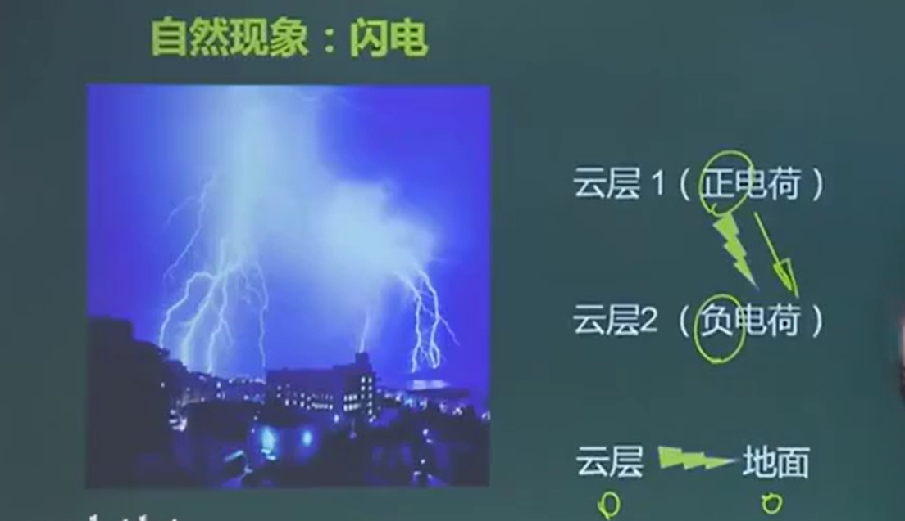
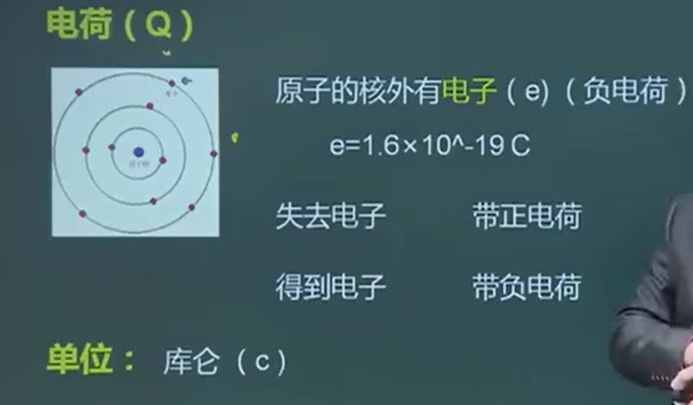
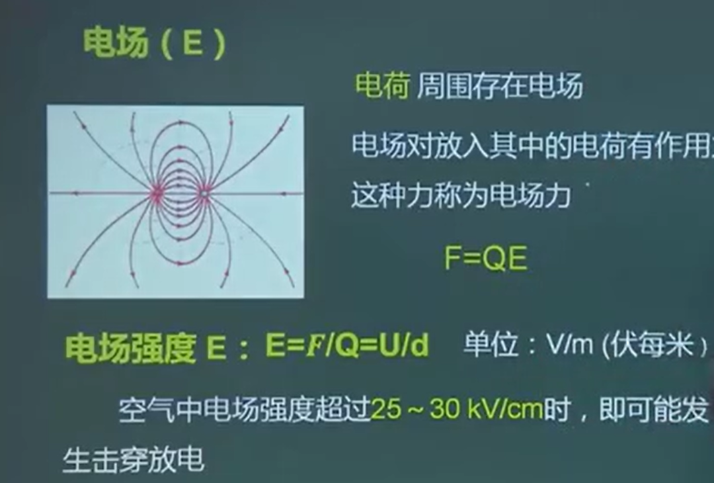
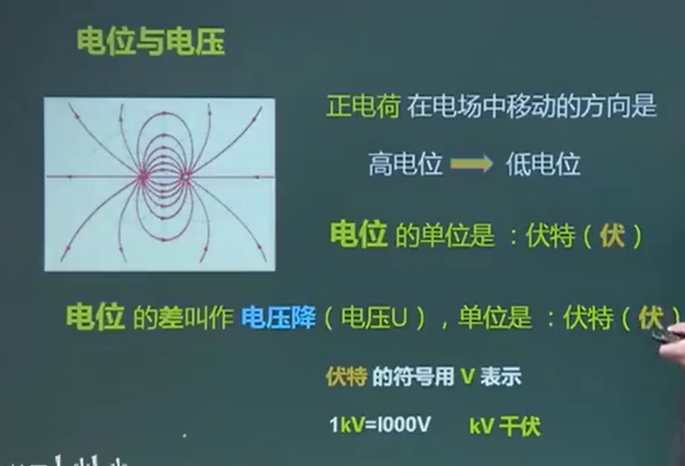
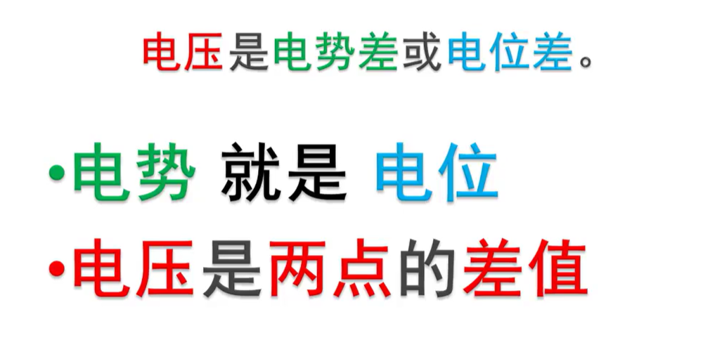
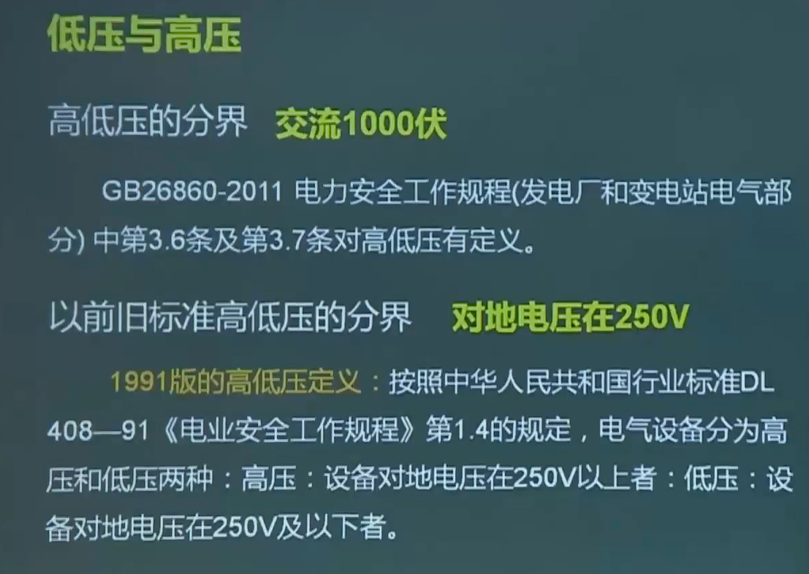
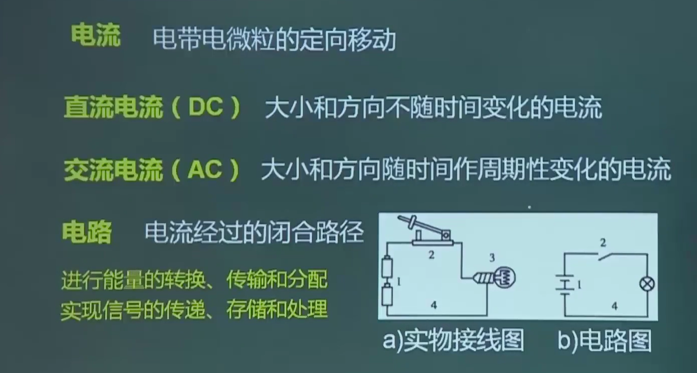
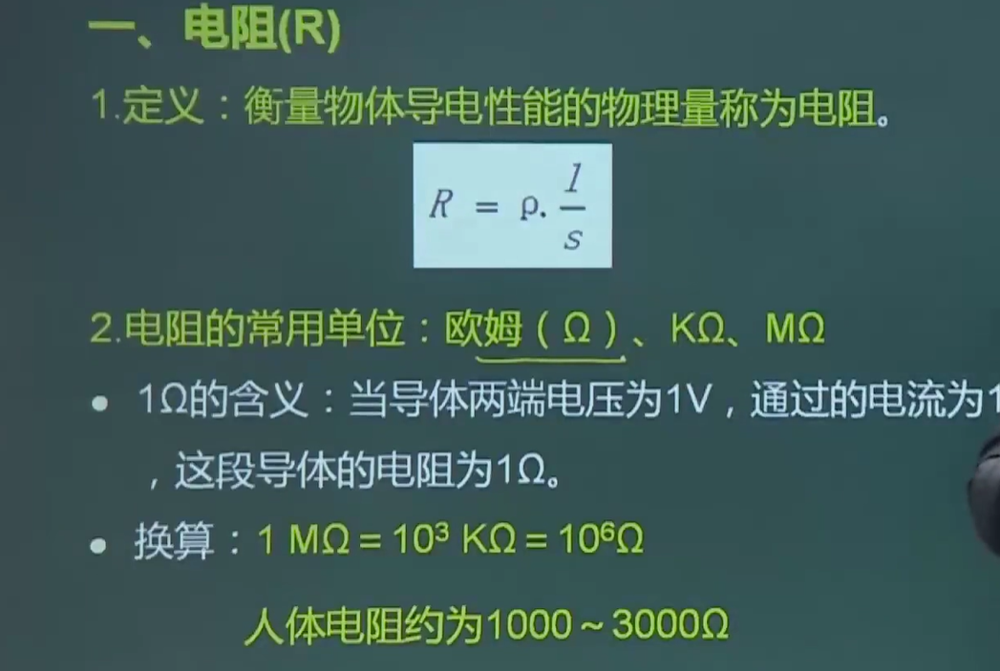
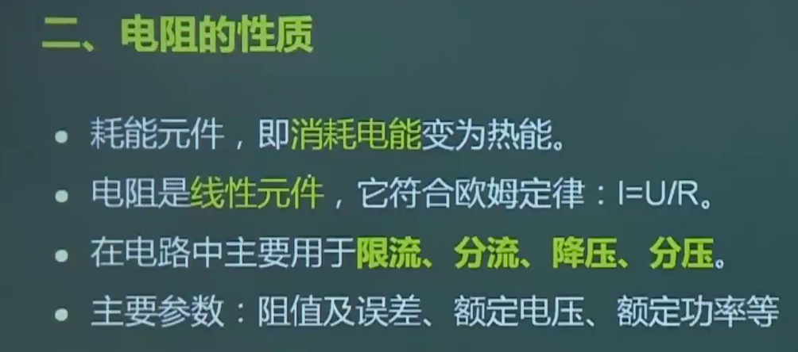
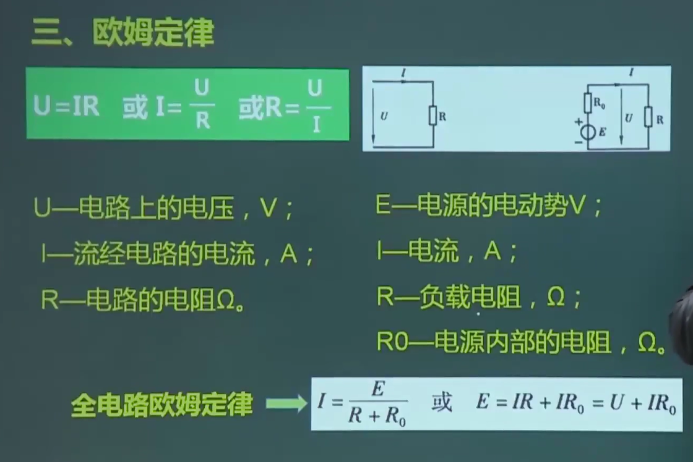

# 1.相关法律法规

## 1.我国的安全生产方针

我国的安全生产方针是：“以人为本，坚持安全发展，坚持安全第一、预防为主、综合治理”。这一方针体现了对安全生产工作的高度重视和全面要求，旨在保障人民生命财产安全，促进经济社会持续健康发展。

具体来说，我国安全生产方针的内涵包括以下几个方面：

1. **以人为本**：强调安全生产工作应当把保护人民生命安全摆在首位，树牢安全发展理念，确保人民群众的生命安全和身体健康。
2. **坚持安全发展**：将安全发展作为经济社会发展的重要前提和保障，推动经济社会持续健康发展。
3. **坚持安全第一**：要求从事生产经营活动必须把安全放在首位，不能以牺牲人的生命、健康为代价换取发展和效益。这是安全生产工作的核心原则。
4. **预防为主**：要求把安全生产工作的重心放在预防上，强化隐患排查治理，从源头上控制、预防和减少生产安全事故。通过加强安全生产管理、建立健全安全生产责任制和安全生产规章制度等措施，提高安全生产水平。
5. **综合治理**：要求综合运用法律、行政、经济、科技等多种手段，加强安全生产监管和执法力度，形成齐抓共管的安全生产工作格局。同时，加强安全生产宣传教育，提高全社会的安全生产意识和能力。

此外，我国安全生产工作还坚持中国共产党的领导，实行管行业必须管安全、管业务必须管安全、管生产经营必须管安全的“三个必须”原则。同时，强化和落实生产经营单位的主体责任，建立生产经营单位负责、职工参与、政府监管、行业自律和社会监督的机制，形成全社会共同关注和支持安全生产的良好氛围。

综上所述，我国的安全生产方针是一个全面、系统、科学的指导方针，它为我国的安全生产工作提供了明确的方向和目标。在实践中，我们应当认真贯彻落实这一方针，不断加强安全生产工作，为人民群众的生命财产安全和经济社会持续健康发展提供有力保障。

## 2.从业人员的安全权利和义务

### 五项权利

1. 知情权、建议权
2. 批评、检举、控告权
3. 合法拒绝权
4. 遇险停，撤权
5. 保险外索赔权

### 四项义务

1. 遵章作业的义务
2. 佩戴和使用劳动护具的义务
3. 接受安全生产教育培训的义务
4. 安全隐患报告义务

# 2.电工的基础知识

## 1.电荷和电场

### 1.1闪电的形成

### 1.2.电荷

### 1.3电场

电场力 等于Q（电荷量）乘以 E （电场强度） **d表示距离** **U是电压**

### 1.4电压

## 2.低压与高压

## 3.直流电路

## 4.电阻

电阻等于 p 电阻率 * l 电阻长度 / s 横截面积

## 5.欧姆定律

