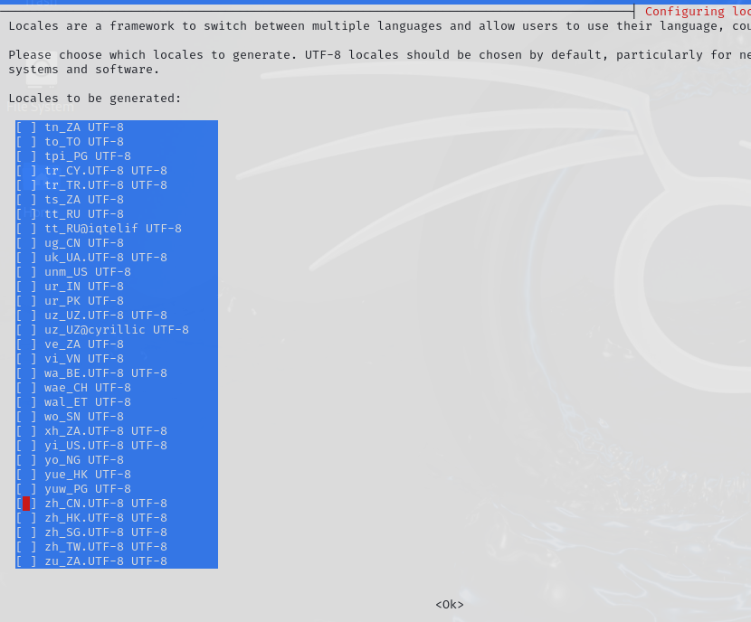

# 1.常用命令


## 1.1 用户相关命令

1. **useradd**：用于创建新的系统用户。
   - 语法：`useradd [选项] 用户名`
   - 例如：`useradd testuser` 会创建一个名为testuser的新用户。
2. **userdel**：用于删除已存在的系统用户。
   - 语法：`userdel [选项] 用户名`
   - 例如：`userdel testuser` 会删除名为testuser的用户。如果还希望同时删除用户的主目录，可以使用 `-r` 选项：`userdel -r testuser`。
3. **usermod**：用于修改已存在的系统用户属性。
   - 语法：`usermod [选项] 用户名`
   - 例如，要修改用户名为testuser的用户的登录名为newuser，可以使用：`usermod -l newuser testuser`。
4. **passwd**：用于设置或更改用户的密码。
   - 语法：`passwd [选项] 用户名`
   - 如果只输入 `passwd` 并按回车，系统会提示您更改当前用户的密码。如果要为其他用户设置密码，如testuser，可以使用：`passwd testuser`。
5. **id**：查看用户身份和组信息。
   - 语法：`id [选项] [用户名]`
   - 例如：`id testuser` 会显示testuser用户的UID、GID以及所属的其他组。
6. **su**：用于切换当前用户身份到其他用户身份。
   - 语法：`su [选项] [-] [用户名]`
   - 例如：`su - testuser` 会以testuser用户的身份登录，并加载其环境变量。
7. **whoami**：显示当前登录用户的名称。
   - 语法：`whoami`
8. **groups**：显示指定用户所属的用户组。
   - 语法：`groups [用户名]`
   - 例如：`groups testuser` 会显示testuser用户所属的所有组。


## 1.2 将kali设置成中文

```shell
dpkg-reconfigure locales
```

选择完成后 输入 reboot 命令重启就生效了




# 2. metasploit


## 2.1 metasploit 攻击 windows 系统


1. 通过 **msfconsole**： 启动 metasploit
2. 使用 msfdb init 命令 初始化metaploit 数据库 （可选）


### msf 使用法则：

- 使用模块 - use [module_name]
- 配置模块必选项 - set [opthin_name]
- 运行模块 - run

三步操作，就能实现主流漏洞的攻击


### 永恒之蓝


**永恒之蓝漏洞（MS17-010）**是一种针对Microsoft Windows系统的安全漏洞，它的爆发源于WannaCry勒索病毒的诞生。该漏洞源于美国国家安全局（NSA）泄露的一种名为“EternalBlue”（永恒之蓝）的漏洞利用工具。这一漏洞被不法分子获取并利用，进而改造出了WannaCry勒索病毒。

该漏洞通过TCP的445和139端口，利用SMBv1和NBT中的远程代码执行漏洞，通过恶意代码扫描并攻击开放445文件共享端口的Windows主机。只要用户主机开机联网，不法分子即可通过该漏洞控制用户的主机，并在其中植入勒索病毒、窃取用户隐私、远程控制木马等恶意程序。

2017年5月12日，WannaCry勒索病毒在全球范围内爆发，对包括学校、大型企业、政府等机构在内的众多计算机用户造成了严重损失。只有通过支付高额的赎金，受害者才能恢复被加密的文件。不过，在病毒爆发不久之后，微软就发布了补丁程序，以修复这一漏洞。

永恒之蓝漏洞的爆发揭示了网络安全的重要性，也提醒广大用户需要保持警惕，及时更新系统和软件，以防范类似的安全威胁。


安装


