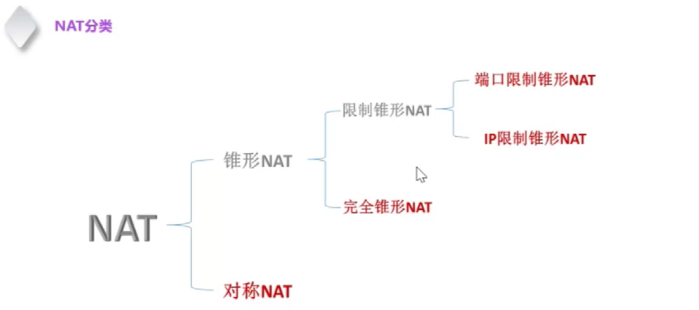
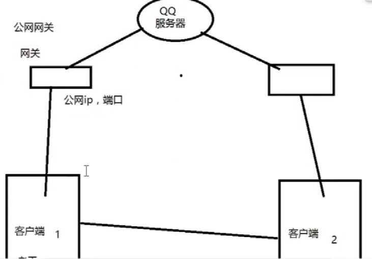
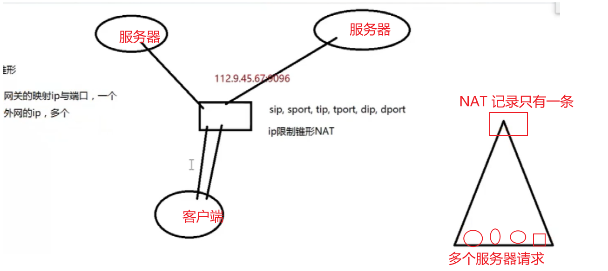

# 查询指定端口占用的程序

````shell
// 查询指定端口
netstat -ano | findstr "your_port"
// 其中your_pid是你刚才记下的进程ID 查询到对应的程序命
tasklist | findstr "your_pid"
// 根据 pid 杀死进程
taskkill -PID your_pid
// 权限不足使用下面这个 加上 -F 强制删除
taskkill -PID your_pid -F
````


# 1. windows 常用网络命令


|   命令   |                  说明                  |                 可选项                 |
| :------: | :------------------------------------: | :------------------------------------: |
|   ping   |             测试网络连通性             |             -t: 不间断ping             |
|          |                                        |        -l: 指定发送的数据包大小        |
|          |                                        |             -S: 指定源地址             |
|          |                                        |        -n: 指定ping的数据包数量        |
| ipconfig |         显示和更新网络配置信息         |       /all: 显示所有网络配置信息       |
|          |                                        |          /release: 释放IP地址          |
|          |                                        |         /renew: 重新获取IP地址         |
|          |                                        |      /flushdns: 清除DNS解析器缓存      |
| tracert  | 显示数据包到达目标主机所经过的路由路径 |            -d: 不解析主机名            |
|          |                                        |            -h: 设置最大跳数            |
|   arp    |           显示和修改ARP表项            |             -a: 显示ARP表              |
|          |                                        |            -d: 删除ARP表项             |
|          |                                        |          -s: 设置静态ARP表项           |
| nslookup |       查询DNS以解析域名或IP地址        |                                        |
| netstat  |    显示网络连接、路由表、接口统计等    | -a: 显示所有活动的网络连接和监听的端口 |
|          |                                        |     -n: 以数字形式显示地址和端口号     |
|          |                                        |             -r: 显示路由表             |
|          |                                        |         -e: 显示以太网统计信息         |
|  route   |           显示和修改IP路由表           |             add: 添加路由              |
|          |                                        |            delete: 删除路由            |
|          |                                        |            change: 修改路由            |
|          |                                        |           print: 显示路由表            |
|   net    |        管理网络服务、共享资源等        |            start: 启动服务             |
|          |                                        |             stop: 停止服务             |
|          |                                        |            share: 共享资源             |
|          |                                        |         unshare: 取消共享资源          |

请注意，这些命令的具体可选项可能因Windows版本的不同而有所差异。在实际使用时，可以通过在命令提示符下输入命令并加上`/?`或`/help`来获取详细的帮助信息，例如`ping /?`将显示ping命令的详细用法和可选项。


# 2. 计算机网络概念


## 1. 基础概念


### **1. 网关（Gateway）**：

网关是一个网络硬件设备，它提供了一个通道，使得在不同网络间的设备可以互相通信。在家庭网络中，路由器通常就是网关，它连接了你的家庭网络和互联网。在企业网络中，网关可能是一个专门的服务器或者一个网络设备，如防火墙或路由器。


### **2. 网段（Network Segment）**：

网段是指在同一网络中，拥有共同网络地址部分的所有设备。例如，在IP地址为192.168.1.0/24的网络中，所有192.168.1.x的设备都在同一个网段内。


### **3. 子网掩码（Subnet Mask）**：

子网掩码是一种用于标识网络地址和主机地址的二进制掩码。它的作用是将IP地址分为网络地址和主机地址两部分。例如，子网掩码255.255.255.0表示前三个数字是网络地址，最后一个数字是主机地址。


### **4. DNS（Domain Name System）**：

DNS是一个将域名转换为IP地址的系统。当你在浏览器中输入一个网站的URL时，例如[www.example.com](https://www.example.com/)，你的计算机会先询问DNS服务器这个网站的IP地址是什么，然后才能连接到这个网站。它的作用就像是互联网的电话簿。


### **5. DHCP（Dynamic Host Configuration Protocol）**：

DHCP是一个网络协议，用于动态分配IP地址给网络中的设备或主机，以便它们可以自动地连接和通信在IP网络上。在设备连接到网络时，DHCP服务器会自动提供一个IP地址和其他网络配置信息（如子网掩码、默认网关、DNS服务器等）给这台设备。

DHCP服务器是指由服务器控制IP地址范围。设置虚拟主机? 客户端在登录服务器时可以自动获取服务器分配的IP地址和子网掩码。

一般来说，DHCP服务器是自动为计算机分配IP地址和子网掩码的服务器。比如我们设置路由器的dhcp服务器，让DHCP服务器自动分配192.168.1.100到192.168.1.199的IP地址(子网掩码会自动设置，不需要设置)。


如果用户在路由器设置中关闭了DHCP服务器功能，如果没有启用，则必须在本地连接中为连接到路由器的每台计算机手动设置“互联网协议”。禁用比启用麻烦。但是，如果您想通过路由器管理每台计算机，禁用它会更方便，但是您需要为每台计算机手动设置一个本地IP地址。

简单来说，DHCP服务器最大的优点就是可以防止局域网内计算机的IP地址冲突和网络不稳定。如果我们手动分配IP地址，会有更多的计算机，其中很多可能会被分配重复的IP地址，因此更改它们会很麻烦。利用DHCP服务器自动分配IP的功能可以避免这个麻烦，IP地址由路由器统一分配。DHCP服务器将每个IP地址只分配给一台计算机，可以保证局域网的稳定性。


在路由器设置中，用户可以对dhcp服务器进行相关设置，包括启用或禁用，也可以设置本地IP地址池的起始地址和结束地址等。让我们看看设置教程。

首先在连接路由器网络的电脑或手机设备上打开浏览器，然后登录路由器的登录地址，输入密码登录，一般是192.168.1.1。不同的路由器有不同的登录地址，请参考路由器底部铭牌上的标签。

进入路由器设置界面后，可以在设置中找到DHCP服务器的设置。用户可以配置DHCP服务器是启用还是禁用，也可以是自动的。默认设置为“开”，也可以设置地址池起始地址和结束地址。


以上是路由器DHCP服务器设置教程。对于普通用户来说，一般不需要单独设置这个，但是默认是打开的。如果需要关机，需要单独设置电脑的本地IP地址，比较麻烦。对于非专业的局域网管理用户，建议不要修改相关设置。

这些概念都是构建和管理计算机网络的基础，它们共同支持互联网的正常运行和设备之间的通信。


## 2. 内网和公网

内网和外网是计算机网络中常用的术语，它们描述了网络的不同范围和用途。以下是内网和外网的详细介绍：

### 内网（局域网、内部网络）

**定义**：
内网通常指的是一个组织或机构内部的计算机网络，它仅限于该组织内部使用，并且与外部的互联网是隔离的。

**特点**：

- **安全性**：内网相对于外网来说更为安全，因为它可以通过防火墙、VPN等技术手段来限制外部访问。
- **速度**：内网内部的数据传输速度通常较快，因为减少了经过路由器的跳转次数。
- **范围**：内网的覆盖范围通常较小，可能只限于一个建筑物、一个校园或一个公司内部。
- **用途**：内网主要用于组织内部的数据共享、资源访问和通信。

**常见应用**：

- 企业内部网络：用于员工之间的文件共享、邮件传输等。
- 校园网络：供学生、教职工使用，访问校内资源。

### 外网（互联网、外部网络）

**定义**：
外网指的是连接了全球各地的计算机和网络的互联网，它允许用户访问和交换来自世界各地的信息。

**特点**：

- **开放性**：外网是开放的，任何接入互联网的计算机都可以访问外网资源。
- **多样性**：外网上的资源丰富多样，包括网站、电子邮件、在线服务等。
- **安全性问题**：由于外网的开放性，网络安全问题相对较多，如黑客攻击、病毒传播等。

**常见应用**：

- 网页浏览：访问各种网站，获取信息。
- 在线服务：如在线购物、社交媒体等。
- 远程办公：利用外网进行远程工作、会议等。

**内网与外网的连接**：
通常，组织或机构会使用路由器等设备来连接内网和外网，以实现内部员工可以访问互联网资源，同时保护内部网络免受外部威胁。在此过程中，可能会设置防火墙、VPN、代理服务器等安全措施来确保网络的安全性和稳定性。

总结：内网和外网是计算机网络中两个不同的概念，它们分别服务于不同的目的和场景。内网主要关注组织内部的数据传输和资源共享，而外网则是一个开放的平台，允许全球范围内的计算机进行信息交换。在实际应用中，需要根据需求和场景来选择使用内网还是外网，并采取适当的安全措施来确保网络的安全和稳定。


## 3. NAT


NAT（Network Address Translation，网络地址转换）是计算机网络中的一种技术，它允许一个整体机构以一个公用IP（互联网协议）地址出现在Internet（互联网）上。NAT将内部网络使用的本地地址（即私有IP地址，这些地址不能在Internet上路由）转换为合法注册的IP地址（即公有IP地址），从而在内部使用私有地址的主机可以访问Internet。

NAT的主要作用如下：

1. **IP地址复用**：NAT允许在一个私有网络中使用相同的私有IP地址，当这些地址转换为公有IP地址时，由于端口号的差异，不会造成冲突。这样，就可以节省IP地址资源。
2. **安全性提升**：由于NAT隐藏了内部网络的真实IP地址，外部网络无法直接访问到内部网络的主机，从而提高了网络的安全性。
3. **简化网络管理**：NAT可以减少公有IP地址的分配和管理，简化了网络管理的工作。
4. **负载均衡**：某些NAT设备可以实现负载均衡功能，将外部网络对内部服务器的访问请求均衡地分配到不同的服务器上，提高系统的性能和可靠性。

请注意，虽然NAT具有上述优点，但它也可能导致一些问题，例如增加网络延迟、可能导致某些网络应用无法正常工作（特别是那些依赖于端到端IP地址的应用）等。因此，在使用NAT时，需要根据实际情况进行权衡和选择。


### 利用NAT 实现客户端对客户端通信


**4 种 NAT**




**客户端 向 另一个客户端 直接通信** 

场景： 



​		有 4 个对象 **客户端1** **服务器** **客户端2**  **公网网关**

客户端 1 向服务器 发送 一条信息  

=>  因为 客户端在内网，发送的消息会通过公网网关转发给 服务器 【在这个过程中，网关会记录一个 NAT记录】

格式为   （内网 IP 端口）  （公网 IP 端口 ）（服务器 IP 端口）

=> 服务器接收到数据 响应给 根据 网关的 （公网 IP 端口） 响应给网关

=> 网关接收到这个数据 根据 NAT 表 对照 这个（服务器 IP 端口）查询 这个NAT记录 然后根据 NAT 记录 对应的（内网 IP 端口）转发响应给客户端 1


1. **完全锥形 NAT** ： 只要要知道 对方 **网关 ->  对方客户端 IP -> 进程端口** 就行进行直接通信

2. **IP限制锥形 NAT**：  客户端 向服务器发送一条信息到 到服务器 （网关 NAT 记录 对应的 服务器 IP 端口），服务可以正常与内网中客户端正常通信， 如果其他客户端想访问内网的 客户端 ，因为 NAT 中没有 该客户端的 与内网中客户端的记录 IP 网关则不会理会这条请求 （请求的服务器 IP 是NAT 中对应的，就可以和内网中的客户端通信）

3. **端口限制 NAT**： 请求的服务器 IP 是NAT 中对应的，端口不一致也不会允许和内网中客户端通信

**锥形 NAT**  客户端向 多个服务器 发送请求时  对应 的 NAT 记录只有一条（ **原IP端口 ）和 （公网IP端口）不变** （服务器IP 端口） 变化且这个**客户端对应的NAT 记录只要一个** （图1）

**对称 NAT** 客户端向 多个服务器 发送请求时  对应 的 **NAT 记录 一一对应 多条**


图1




## 4. IP 地址之网络地址 广播地址

IP地址中的**网络地址**和**广播地址**是IP地址的两个重要组成部分，它们各自具有特定的定义和作用。

1. **网络地址**：

- **定义**：网络地址是IP地址中用于标识特定网络的部分。
- 作用
  - **标识网络**：它唯一地标识一个特定的网络或子网，使得网络中的设备能够相互通信。
  - **路由决策**：路由器等网络设备使用网络地址来决定数据包应该被转发到哪个网络或子网。

1. **广播地址**：

- **定义**：广播地址是一个特殊的IP地址，用于在同一网络内发送广播消息。
- 作用
  - **局域网通信**：广播地址允许局域网内的设备发送消息到该网络上的所有其他设备。
  - **服务发现**：通过广播，设备可以发现网络上的其他设备或服务，如DHCP服务器、打印机等。
  - **网络诊断**：网络管理员可以使用广播地址发送诊断命令或请求，以检测网络设备的状态或配置。

总结来说，**网络地址**和**广播地址**在IP地址中扮演着重要角色。网络地址用于标识和路由网络，确保数据包能够到达正确的目的地；而广播地址则用于在同一网络内发送消息，实现设备间的通信和发现。这两个地址的协同工作，使得计算机网络能够高效、准确地传输数据。


## 5. MAC 地址 ARP 协议


**MAC地址**、**ARP协议**是计算机网络中的重要组成部分，它们各自具有特定的功能和作用。

1. **MAC地址**：

- **定义**：MAC地址是适配器（网络接口）的链路层地址，用于标识局域网内一个帧从哪个接口到哪个物理相连的其他接口。局域网中的每块网卡都有唯一的MAC地址。
- **特点**：MAC地址长度为6字节，共有2^48个可能的MAC地址。MAC地址固化在网卡ROM中，但也可以使用软件修改。
- **作用**：MAC地址的主要作用是确保数据在局域网内的正确传输。当一个帧在网络中传输时，适配器会检查帧的MAC地址与自己的接口MAC地址是否一致，如果不匹配则丢弃该帧，如果匹配则向上传递。

1. **ARP协议**：

- **定义**：ARP协议是地址解析协议，属于TCP/IP体系结构的网际层。它的主要作用是将网络层（IP层）提供的32位IP地址解析为数据链路层使用的MAC地址。
- **特点**：ARP协议具有即插即用特性，结点可以自主创建ARP表。当源和目的主机处于同一个局域网内，且源主机知道目的主机的IP地址时，ARP协议能够帮助源主机获取目的主机的MAC地址。
- **作用**：ARP协议在网络通信中起到了桥梁的作用，使得网络层和数据链路层之间的通信成为可能。它解决了在网络通信中如何根据IP地址找到对应的MAC地址的问题，从而确保数据包能够准确地从源主机发送到目的主机。

总的来说，**MAC地址和ARP协议在计算机网络中起到了关键作用**。MAC地址确保数据在局域网内的正确传输，而ARP协议则负责将网络层的IP地址解析为数据链路层的MAC地址，使得数据包能够在网络中准确地找到目的地址。这两个元素共同协作，为网络通信提供了坚实的基础。


## 6. 端口


计算机网络中的**端口**是计算机与外界通讯交流的出口，是连接计算机内部网络和外部网络的桥梁。其主要作用体现在以下几个方面：

1. **实现网络通信**：

- 端口是网络应用程序与外界通信交流的出口，它允许计算机上的应用程序通过网络与其他计算机或设备进行通信。

2. **区分不同应用程序**：

- 同一台计算机上运行的不同应用程序通常使用不同的端口号，以便网络中的数据包能够准确地传递到对应的应用程序进行处理。

1. **提供灵活性和安全性**：

- 使用不同的端口号，网络管理员可以限制对特定应用程序的访问，只允许特定的应用程序使用特定的端口号，从而增强网络的安全性。

3. **支持并发通信**：

- 由于每个计算机可以拥有多个端口，因此可以同时运行多个应用程序，而不会相互干扰。例如，一台计算机可以同时作为Web服务器、邮件服务器和文件服务器运行，每个服务都使用不同的端口号。

4. **实现端口转发和NAT**：

- 在网络中，端口转发允许路由器将外部网络的特定端口流量转发到内部网络中的特定计算机和端口。NAT（网络地址转换）则允许多个计算机共享一个公共IP地址，通过映射内部网络中的计算机和端口到外部网络的不同端口，实现与外部网络的通信。

总结来说，计算机网络中的**端口**在实现网络通信、区分不同应用程序、提供灵活性和安全性、支持并发通信以及实现端口转发和NAT等方面发挥着重要作用。它们是计算机网络中不可或缺的元素，为各种网络应用提供了便利和保障。


